### 1. Design a Rate Limiter
#### Problem
Throttle client requests over a time window to prevent abuse, fairly distribute resources, and protect backends from overload.

#### Summary
**The picture in your head:** a bouncer at a club door, but the bouncer has a tiny notebook. Every time you walk up, they look up your name, check how many times you've come in this hour, and either let you in or say "you've been in 100 times already, come back later." The bouncer has to be **fast** (can't slow down the queue) and **correct** (can't miscount), even when 50 bouncers are working the same door for the same crowd.

**The single-request walkthrough:** A request hits your API. *Before* it reaches your business logic, a tiny piece of code (the "limiter") asks: who is this caller? It pulls out a key — usually `user_id`, `ip`, or `api_key`. It then asks a shared store (typically Redis) "how many requests has `user_42` made in the last minute?" If below the limit → increment the counter, let the request through. If over → reject with HTTP `429 Too Many Requests` and a `Retry-After: 30` header so the client knows when to try again. Whole check takes <5ms.

**The pieces (and what each one is for):**
- **The limiter itself** — a small library or middleware that runs inside every API server (or at the edge in an API gateway like Kong/Envoy). Holds the rules ("100 req/min per user") in local memory.
- **The shared counter store** — almost always Redis. Has to be *shared* because your API runs on, say, 50 servers behind a load balancer; if each server kept its own counter, a user would get 50× their limit. Redis is the single source of truth.
- **The algorithm** — the math that turns "request arrived" into "allow or deny." Default is **token bucket**: imagine a bucket with capacity N (say 100 tokens) that refills at rate R (say 10/sec). Each request takes 1 token. No tokens? Reject. Bucket full? Refill stops. Two numbers in storage per user: current token count + last-refill timestamp. On each request you lazily compute new tokens = `(now - last_refill) × rate`, cap at capacity, deduct 1 if any, save back. *Alternatives:* fixed window (count per minute — simpler, but allows 2× burst at boundaries); sliding window (more accurate, more memory).
- **The rules config** — "what counts as too much" can vary per endpoint, per user tier, per region. Loaded from a config service so you can tweak limits without redeploying.

**The thing that makes it hard — race conditions:** Imagine `user_42` is at 99/100 and fires two requests in the same millisecond. Server A reads "99," Server B reads "99," both go "yep, room for one more," both increment to 100. You've actually allowed 101 — and you do this all day, every day, across millions of users. The fix: **the read-and-increment must be atomic** — one indivisible operation the database does internally so no other request can sneak in between the read and the write. In Redis you do this with a Lua script (Redis runs scripts atomically) or with `INCR`+`EXPIRE` for the simple cases.

**Why the standard solution works — and one weird trick (fail open):** If your rate limiter itself dies — Redis goes down, the network blips — you have a choice: reject every request (your whole API goes down because the *limiter* broke), or allow every request through (you're temporarily unprotected but the API still works). The right answer is almost always **fail open**. The limiter is a guardrail, not load-bearing infrastructure. A guard that locks everyone *out* when it has a heart attack is a worse guard than one that briefly lets everyone in.

**If you were building it tomorrow:**
- Redis cluster (6 nodes, sharded by `user_id`) holding token bucket state.
- Limiter middleware in your API gateway runs this Lua script on every request:
  ```
  tokens = min(CAP, stored_tokens + (now - last_ts) * RATE)
  if tokens >= 1: tokens -= 1; save; return ALLOW
  else: return DENY
  ```
- On Redis timeout (>5ms) → log it, return `ALLOW` anyway (fail open).
- Return `429` with `Retry-After`, `X-RateLimit-Limit`, `X-RateLimit-Remaining` headers on deny.
#### Clarifying Questions
- Server-side or client-side? (assume server)
- Throttle by user ID, IP, API key, or all three?
- Distinct rules per endpoint or global?
- What does the client see when throttled? (HTTP 429 + headers)
- Should rules be hot-configurable without restart?
- Strict accuracy required or is slight over-allow acceptable?
- Multi-region deployment?

#### Requirements
- **FR:**
  - Accept/reject per (identity, endpoint) using configurable rules
  - Return `429 Too Many Requests` with `Retry-After` and `X-RateLimit-{Limit,Remaining,Reset}` headers
  - Rules hot-reloadable from config service
  - Multiple scopes: per-user, per-IP, per-API-key, per-endpoint, global
- **NFR:**
  - <10ms p99 overhead per request
  - 99.99% availability — fail-open if rate limiter dies
  - Horizontally scalable to thousands of API gateway nodes
  - Memory-efficient: millions of active identities

#### Scale Estimate
- **Global request rate ~1M req/s (≈10B req/day):** matches a top-tier API edge (Stripe/Twilio class). Derivation: 10B/day ÷ 86,400s ≈ 116k avg req/s; assume 8–10× peak-to-mean ratio for diurnal + viral traffic → round to 1M req/s peak. 1M × 86,400 ≈ 86B/day theoretical, but daily volume is the diurnal-averaged 10B.
- **Identity cardinality 100M:** rate-limit key = (user OR API key OR caller IP). Reddit-/Shopify-tier active set: 50M DAU + ~10M API keys + 40M distinct caller IPs at peak (post-CGNAT) → 100M. For Twitter/Stripe scale plan 1B; 100M is the senior-eng default.
- **Per-identity state ~200B:** token bucket holds `tokens` (8B float) + `last_refill_ts` (8B i64) + `version` (8B i64) = 24B logical, plus key-string (~40B), Redis hash bookkeeping/ziplist overhead (~130B observed via `MEMORY USAGE`) → ~200B total.
- **Hot working set ~20GB:** 100M × 200B = 2 × 10¹⁰ B = 20 GB. Fits across a 6-node Redis cluster: ~3.3GB/node + 50% headroom for fragmentation/replication buffers.
- **Counter ops ~2M/s:** every request does 1 read + 1 atomic increment ≈ 2 ops → 1M req/s × 2 = 2M ops/s. Sharded ~16 ways → 125k ops/s/shard, well within Redis single-shard ceiling (~200k ops/s).
- **Network ~200MB/s:** each op ~100B on the wire (RESP framing: command verb + key + value + CRLF ≈ 80–120B). 2M ops/s × 100B = 2 × 10⁸ B/s = 200 MB/s aggregate ingress to counter tier.
- **Rules budget ~10MB:** assume ~1000 distinct endpoints (typical for a large API surface) × ~10 rules/endpoint (per-tier, per-method, per-window) = 10k compiled rules; each compiled rule ≈ 1KB (predicates, window, limit, scope) → 10⁴ × 10³ = 10⁷ B = 10MB. Fits in every node's local config cache; pushed via config bus.
- **Hot tier:** all counters in-memory across N shards, sized for peak QPS × headroom; eviction by TTL = window length (most counters disappear within seconds)
- **Cold tier — decision logs ~250GB/day:** sample at 1% to keep cost bounded → 1M req/s × 1% = 10k events/s. Each event ~300B (identity ~40B + endpoint ~50B + decision/limit/remaining ~40B + ts/region/version ~40B + serialisation overhead ≈ 130B). 10⁴ × 300 = 3 × 10⁶ B/s = 3 MB/s. Daily: 3MB/s × 86,400s ≈ 260GB ≈ 250 GB/day to columnar archive; 30d retention → ~7.5TB rolling. Used for abuse forensics.

#### API Contract
Internal middleware. Decision call:
```
is_allowed(identity, endpoint) →
  { allowed: bool, limit: int, remaining: int,
    reset_at: epoch_seconds, retry_after_sec: int | null }
```

#### High-Level Design
```
Client ──→ API Gateway ──→ [Rate Limit Middleware] ──→ Backend
                                ↓ check
                         Shared Counter Store (sharded
                         in-memory cache, atomic ops)
                                ↑ rule lookup
                         Config Service (pub/sub invalidation)
```

**How to read the diagram:** the request always hits the rate limiter before it reaches your backend. The limiter itself is intentionally thin: it figures out who the caller is, loads the rule for that caller and endpoint, and asks a shared counter store whether this request should be allowed.

**Why the flow is shaped this way:** the gateway stays stateless, while the real state lives in two shared places: rule config and counters. That gives every gateway instance the same view of the world. Putting the limiter at the edge means abusive traffic is rejected before it burns app servers or database connections.

**What this layout buys you:** fast decisions, consistent enforcement across many gateway nodes, and simple horizontal scaling. The main tradeoff is that the counter store is now on the hot path, which is why the design fails open if that dependency is unhealthy.

#### Data Model
- **Rules** (transactional config store):
  `(rule_id, scope, identifier_pattern, endpoint_pattern, algorithm, limit, window_sec, priority)`
- **Counter store** (sharded in-memory cache, atomic check-and-increment):
  - Window: `key = rl:{scope}:{id}:{endpoint}:{window_start}`, INT counter, TTL = window
  - Token bucket: `key = rl:bucket:{id}:{endpoint}`, HASH `{tokens, last_refill_ts}`

#### Algorithm Comparison

| Algorithm              | Memory       | Smoothness     | Burst        | Best For               |
| ---------------------- | ------------ | -------------- | ------------ | ---------------------- |
| Fixed Window           | low          | jagged at edge | up to 2×     | simple counters        |
| Sliding Window Log     | high (1/req) | perfect        | none         | strict accuracy        |
| Sliding Window Counter | low          | smooth         | ~1.1×        | **default choice**     |
| Token Bucket           | low          | bursty allowed | configurable | API w/ burst tolerance |
| Leaky Bucket           | low          | smoothed       | none         | shaping outbound       |

#### Detailed Design
**Atomic Lua** (single round-trip):
```lua
local count = redis.call('INCR', KEYS[1])
if count == 1 then redis.call('EXPIRE', KEYS[1], ARGV[1]) end
return count
```

**Distributed strategies:**
- **Centralized Redis** — every middleware node hits one logical counter store (sharded internally by identity); accurate to the request, one extra hop per request, default choice for most APIs.
- **Per-node local + sync** — each gateway maintains its own counters and syncs deltas every ~100ms; lower latency (no network hop), but a noisy client routed to two nodes can over-allow by up to `nodes × limit / sync_interval` until syncs converge — fine for soft limits, not for billing.
- **Sticky routing** (LB pins identity to one node) — counters stay local because the same user always hits the same node; works perfectly for evenly distributed traffic but breaks under skew (one whale on one node) and complicates failover (sticky session must follow the node).

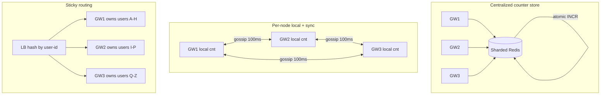
```mermaid
flowchart TB
    subgraph Centralized[Centralized counter store]
        C1[GW1] --> CR[(Sharded Redis)]
        C2[GW2] --> CR
        C3[GW3] --> CR
        CR -->|atomic INCR| CR
    end
    subgraph LocalSync[Per-node local + sync]
        L1[GW1 local cnt] <-->|gossip 100ms| L2[GW2 local cnt]
        L2 <-->|gossip 100ms| L3[GW3 local cnt]
        L1 <-->|gossip 100ms| L3
    end
    subgraph Sticky[Sticky routing]
        SLB[LB hash by user-id] --> S1[GW1 owns users A-H]
        SLB --> S2[GW2 owns users I-P]
        SLB --> S3[GW3 owns users Q-Z]
    end
```

**Multi-region:** each region runs its own counter store and limits independently. A client hitting `us-east` and `eu-west` simultaneously can be allowed `2 × limit` total. Cross-region sync (gossip or async replication) brings the regions into agreement within seconds but never instantly — which is why we document the bound (`regions × limit`) rather than pretend it's exact. For most APIs this is acceptable; for billing or quota enforcement, pin a user to a home region via geo-DNS so their counter is single-region.

**Algorithm dynamics — visual.** The four common counters behave very differently under a burst. Token bucket fills passively at rate `r`; each request drains a token; spare capacity stockpiles for legitimate bursts. Leaky bucket is the same shape inverted — requests fill the bucket, a steady drain at rate `r` empties it; bursts queue rather than being rejected at the edge. Fixed window resets a counter at boundary `t=0,t=W,t=2W,...` — cheapest, but a client can fire `2 × limit` straddling a boundary. Sliding window counter blends the previous and current bucket weighted by elapsed-window proportion, recovering most of the smoothness without per-request memory. *[Source: ByteByteGo "System Design Interview" Ch.4 + brandur.org "Rate Limiting, Cells, and GCRA"]*

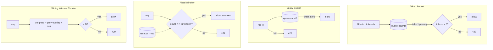
```mermaid
flowchart TB
    subgraph TB_Algo[Token Bucket]
        T1[fill rate r tokens/s] --> T2[(bucket cap=B)]
        T2 -->|take 1 per req| T3{tokens > 0?}
        T3 -->|yes| T4[allow]
        T3 -->|no| T5[429]
    end
    subgraph LB_Algo[Leaky Bucket]
        L1[req in] --> L2[(queue cap=B)]
        L2 -->|drain at r/s| L3[allow]
        L1 -->|full| L4[429]
    end
    subgraph FW_Algo[Fixed Window]
        F1[req] --> F2{count < N in window?}
        F2 -->|yes| F3[allow, count++]
        F2 -->|no| F4[429]
        F5[(reset at t=kW)] -.-> F2
    end
    subgraph SW_Algo[Sliding Window Counter]
        S1[req] --> S2[weighted = prev*overlap + curr]
        S2 --> S3{< N?}
        S3 -->|yes| S4[allow]
        S3 -->|no| S5[429]
    end
```

**GCRA (Generic Cell Rate Algorithm).** A leaky-bucket variant that stores only one timestamp — the "theoretical arrival time" (TAT) of the next allowed request. On each request, compare `now` to `TAT - burst_tolerance`: if `now ≥ that`, the request is allowed and TAT advances by the emission interval `T = 1/rate`; otherwise reject. Half the storage of token bucket (no separate `tokens` and `last_refill_ts` — just one `tat` field) and the same correctness properties, plus the rate-limit decision is a single arithmetic compare rather than a refill computation. Production-popular at SlashID, Stripe-style ID-based limiters, and the Redis Cell module. *[Source: brandur.org "Rate Limiting, Cells, and GCRA"; Tony Finch "GCRA: leaky buckets without the buckets" (2024)]*

**Algorithm picker — concrete recommendations.** Token bucket for general APIs (matches client behaviour, allows bursts). GCRA when you want token-bucket semantics on minimum storage. Sliding window counter for endpoints where billing or fairness matters and a 2× boundary spike is unacceptable. Sliding window log only for low-QPS strict cases (auth retries, password resets) where the per-request memory cost is negligible. Fixed window only for trivial coarse limits ("max 1000 logins per hour, who cares about boundary spikes").

#### Potential Follow-Up Questions
**Q: What if Redis dies mid-traffic?**
Circuit-break on the middleware and fail open — letting traffic through beats a 503 cascade. *If pushed:* run a cluster with replicas + Sentinel; per-node local fallback counters bound the blast radius until Redis recovers.

**Q: How do you handle a botnet hammering with millions of unique IPs?**
Cardinality explosion blows up the counter store. Add a coarse global per-endpoint limit upstream and an IP-reputation pre-filter so unknown IPs share a bucket. *If pushed:* HyperLogLog (a probabilistic counter that estimates "how many unique values have I seen?" using a few KB of memory regardless of input cardinality) for cheap approximate cardinality on the hot path; offload reputation scoring to an async pipeline.

**Q: Token bucket vs sliding window — why default to token bucket?**
Token bucket matches real API usage (clients burst then idle). Sliding window is smoother but rejects legitimate bursts and uses more memory per identity. *If pushed:* sliding-window-counter for strict-fairness endpoints (auth, payments); token bucket for general API.

**Q: How do you keep counters consistent across regions?**
You don't — accept eventual sync and document the bound: worst-case over-allow is `regions × limit`. *If pushed:* CRDTs (G-Counters) for monotonic per-identity counters; or pin identity to home region via geo-DNS so the counter is local.

**Q: How do you test it?**
Load-test with synthetic clients at 1.1× and 10× the limit; assert allow rate matches expected. Chaos-test by killing Redis mid-flight to verify fail-open. *If pushed:* shadow-mode in prod (compute decision, don't enforce) before flipping enforcement on a new rule.

**Q: How do clients know they're being throttled fairly?**
`X-RateLimit-{Limit,Remaining,Reset}` headers on every response, `Retry-After` on 429s. *If pushed:* expose per-key debug endpoints for support; emit per-identity 429-rate metrics so you can spot a noisy neighbor or misconfigured rule.

**Q: GCRA vs token bucket — when do you pick GCRA?**
GCRA stores one timestamp (TAT) instead of `(tokens, last_refill_ts)` — half the memory and the decision is a single arithmetic compare. Same semantics. *If pushed:* Redis-Cell module gives you GCRA atomically in one round-trip with no Lua; Stripe and SlashID use this in production for per-identity limits.

**Q: How do you implement client-side rate limiting that respects `Retry-After`?**
Client SDK reads `Retry-After` on 429, schedules its next attempt at `now + retry_after + jitter`, and exponentially backs off thereafter. Without jitter, every throttled client retries at the same instant and creates a synchronized stampede. *If pushed:* client maintains a local token bucket synced from `X-RateLimit-Remaining` headers and pre-throttles before the server has to send 429s — saves a round trip on the rejection.

**Q: How do you handle tiered limits (free vs paid users)?**
Rule lookup includes user tier; the rule store keys on `(scope, identifier_pattern, tier)` and the middleware joins user→tier from a fast cache. Tier change is a cache invalidation, not a rule rewrite. *If pushed:* burst-and-sustained tiers (e.g., free=10/s burst + 100/min sustained) require two stacked counters per identity — both must pass.

#### Bottlenecks & Mitigations
- **Race on shared counter** — two requests reading the counter in the same microsecond both see "99 < 100" and both increment, pushing real usage above the limit. A Lua script wrapping `INCR` + `EXPIRE` runs as one indivisible op on the Redis side, eliminating the read-modify-write window.
- **Single Redis bottleneck** — at millions of req/s, one Redis instance can't keep up on CPU or network. Shard the keyspace by identity using consistent hashing so each node owns a slice; a noisy user concentrates load on one shard but other shards stay cool.
- **Cross-region drift** — independent regional counters can't agree in real time without paying a cross-region RTT per request (10s of ms). Accept eventual sync and publish the bound: worst case a client gets `regions × limit` across the fleet, which is fine for protective rate limiting and unacceptable only for hard quotas.
- **Redis outage** — if every request blocks on a dead Redis, you turn a counter outage into a full-site outage. A circuit breaker on the middleware trips after consecutive failures and switches to fail-open; the limiter degrades to "no limiting" rather than "no traffic."
- **Rule hot reload** — pushing a new rule via a deploy is too slow when an attacker is mid-attack. The config service publishes invalidation events on a pub/sub channel; every middleware node drops its cached rule and refetches lazily, propagating changes in under a second.
- **Cardinality explosion** (botnet IPs) — a botnet of millions of unique IPs creates millions of unique counter keys, blowing up memory in the counter store. Add a coarser global per-endpoint limit upstream so the aggregate is capped regardless of identity, and pre-filter unknown IPs through a reputation tier that bucket-shares them into one shared counter.
- **Synchronized client retry stampede** — when many clients all hit a 429 at once and obey the same `Retry-After`, they retry simultaneously and re-trigger the limit at the next boundary, creating an oscillation. Add jitter to `Retry-After` (e.g., `retry_after = base + random(0, base/2)`) and require client SDKs to apply exponential backoff on top, so the retries spread across time rather than synchronizing.
- **Boundary spike on fixed window** — a client firing `limit` requests in the last 100ms of a window and another `limit` in the first 100ms of the next effectively gets `2 × limit` over a 200ms span. Use sliding-window-counter or GCRA on any endpoint where this matters (billing, login attempts); accept the spike on coarse protective limits where the doubling doesn't change blast radius materially.

#### Failure Modes

| Layer | Failure | Detection | Mitigation |
|---|---|---|---|
| Counter store | Redis primary crashes mid-traffic | health-check failures, `CONNECTION REFUSED` on middleware | Sentinel/Cluster failover within seconds; circuit breaker on middleware switches to fail-open until the new primary is hot |
| Network | Partition between gateway and counter store | spike in op-timeout rate, p99 > 50ms | per-region counter store with regional fail-open; document `regions × limit` worst-case over-allow |
| Correctness | Lua script bug double-increments | counter drift vs request count, billing reconciliation alerts | shadow-mode every new rule for 24h before enforcement; checksum the loaded Lua against a known hash |
| Resource | Cardinality explosion (botnet, unique IPs) | counter-store memory growth rate, eviction rate spike | coarse global per-endpoint limit upstream; bucket-share unknown IPs through a reputation tier |
| Resource | Hot-shard CPU saturation on a popular tenant | per-shard CPU at 100%, op latency climbing on one shard only | rebalance vnodes to spread the tenant; client-side jittered backoff on 429 to dampen feedback |
| Upstream | Config service down, no rule refreshes | rule-cache age metric > N minutes | serve last-known-good rules from local cache; alert ops; refuse new rule-create operations until config service recovers |
| Process | Middleware OOM under sudden load | container restarts, p99 latency spikes | bounded per-identity memory caps, request-level timeouts (5ms), drop-and-fail-open before OOM-killer fires |

#### Observability — Key Metrics & SLOs

- **`rate_limiter.decision_latency_p99`**: time from request entry to allow/deny decision — emitted by middleware — alert if > 5ms for 5min (budget is 10ms total)
- **`rate_limiter.counter_op_latency_p99`**: round-trip time to the counter store including Lua execution — emitted by middleware on every op — alert if > 2ms for 5min
- **`rate_limiter.fail_open_rate`**: fraction of requests bypassing the limiter due to circuit-breaker trip — emitted on every fail-open path — alert immediately if > 0.1%
- **`rate_limiter.allow_rate_by_rule`**: per-rule allow/deny ratio — emitted as labelled counters — alert on sudden inversions (rule that was 99% allow flips to 99% deny indicates a bad config push)
- **`rate_limiter.cardinality_active_keys`**: distinct identity keys with non-zero counters — sampled every minute via HLL — alert if 24h growth > 5× (botnet signal)
- **`rate_limiter.over_allow_rate`**: actual req-rate per identity vs configured limit — computed offline from sampled decision logs — alert if any identity exceeds 1.2× its limit
- **SLOs:** p99 decision latency 10ms, availability 99.99% (with fail-open absorbing the rest), error budget 4.3min/month of fail-open before paging on the limiter itself.

#### Multi-Region & DR

- **Replication mode:** regional-isolation by default — each region runs its own counter store with no cross-region sync on the hot path; the WAN RTT (50–150ms) cannot live on a per-request limiter. Active-active across regions with periodic gossip is the alternative when soft global enforcement is needed.
- **RTO / RPO:** RTO 30s (failover to fail-open if regional Redis dies, then to a hot-standby cluster); RPO is non-applicable for the counter state itself — counters are ephemeral and rebuild as traffic flows. The rule store has RPO 0 (synchronously replicated config).
- **Failover trigger & cadence:** automatic on circuit-breaker trip per region; tested monthly via game-day exercises that kill the regional Redis primary in production and verify fail-open + standby promotion. Quarterly chaos drill drops an entire region.
- **Cross-region cost trade-off:** independent regional counters cost ~zero cross-region bandwidth but accept up to `regions × limit` over-allow at the global level — fine for protective limiting (DDoS, abuse) and unacceptable for billing quotas, where you pin identities to home regions via geo-DNS so the counter is single-region.

#### Common Mistakes / Anti-patterns

- **Reading and incrementing in two separate calls** — candidates often describe `GET counter; INCR counter` as the algorithm, but the read-modify-write window allows two concurrent requests to both see "below limit" and both proceed. The correct answer is an atomic Lua script (or a Redis-Cell module) that performs the check-and-increment as one indivisible operation.
- **Promising exact cross-region consistency** — saying "the limit is 1000/s globally" without qualifying it implies synchronous cross-region coordination, which would add 100ms+ to every request. The senior answer states the bound up front: each region enforces locally, the global worst case is `regions × limit`, and that's a deliberate trade — pin identities to home regions if exact global enforcement is required.
- **Failing closed instead of fail-open** — a candidate who says "if Redis is down, return 503" turns a single-system outage into a full site outage. The right posture is fail-open with a circuit breaker; the limiter is protective infrastructure and must never be a bigger SPOF than what it protects.
- **Ignoring the synchronized-retry problem** — emitting `429 Retry-After: 60` to a million clients and assuming they'll politely re-spread is naive; without jitter every client retries at the same instant and re-triggers the limit. The correct answer adds `random(0, base/2)` jitter to `Retry-After` and requires SDKs to implement exponential backoff on top.
- **Picking sliding-window-log as the default** — accurate but O(N) memory per identity makes it unsuitable for millions of active users; candidates pick it because it sounds rigorous, but production systems use sliding-window-counter or token-bucket with sub-100B per identity.
- **Treating the rate limiter as one global service** — an interviewer wants to hear "rate limiting at multiple layers": L4 (DDoS, packet rate at the LB), L7 protective limits at the API gateway, application-level fairness limits, and per-tenant quotas. Conflating them all into one component misses that they protect against different failure modes.

#### Talking Points for the Interview

- **Fail-open is non-negotiable** — state explicitly that the limiter must never be a bigger outage than what it's protecting; senior interviewers listen for this within the first two minutes.
- **The counter store is the bottleneck, not the algorithm** — algorithm choice (token bucket vs sliding window) is a 30-second discussion; sharding the counter store, atomic ops, and circuit breakers are the real engineering surface.
- **GCRA is the production-grade default** — citing Stripe/SlashID and the Redis-Cell module signals you've operated rate limiters and not just read about them; it's the answer that distinguishes "studied" from "shipped".
- **Cross-region consistency is bounded, not exact** — naming the bound (`regions × limit`) and explaining why exact-global is uneconomic is a senior-level move; candidates who hand-wave it lose credibility.
- **Two clients with the same shape behave very differently** — a coordinated attacker hitting one identity vs a botnet across millions of identities require different mitigations (sharded counter vs cardinality-cap + reputation), and conflating them is a junior tell.
- **Header design is part of the contract** — `X-RateLimit-{Limit,Remaining,Reset}` plus `Retry-After` with jitter is what the client SDK needs to back off correctly; talking about headers shows you've thought about the full feedback loop.
- **Layered limits are the real architecture** — L4 packet rate at the LB, L7 protective limits at the gateway, application-level fairness, per-tenant quotas — each layer protects a different failure mode and a senior answer enumerates them rather than designing one monolithic limiter.

### 2. Design Consistent Hashing
#### Problem
Distribute keys across a dynamic set of servers so that adding/removing a node only relocates 1/N of keys (not all of them).

#### Summary
**The picture in your head:** imagine a clock face with 360 degrees, except instead of hours it has 4 billion positions. You have 10 servers scattered around the face. When you want to store a key, you spin a pointer to a position on the face (by hashing the key) and then walk clockwise until you hit the first server. That server owns the key. Now add an 11th server: it sits somewhere on the face and takes over only the keys that used to walk past it before reaching the next server. Every other key is untouched. That is the whole trick — adding or removing a server moves a small slice, not everything.

**The single-request walkthrough:** a cache cluster has 3 servers: S1 at position 190, S2 at position 130, S3 at position 45. A request arrives for `user_42`. The system hashes `user_42` and gets position 100. Walk clockwise: 100 → 130 — that is S2. S2 serves the request. Now S4 joins at position 200. The same hash gives 100, walk clockwise: 100 → 130 — still S2. S4 only captures keys that hash between 130 and 200, which previously walked clockwise all the way to S1 at 190. Every other key stays exactly where it was.

**The pieces (and what each one is for):**
- **The ring (sorted array of positions)** — a data structure that maps 4-billion integer positions to servers. A lookup is a binary search: "find the first position >= hash(key)." The whole ring fits in ~3MB of RAM, so every node keeps a copy in memory.
- **Virtual nodes** — each physical server appears at ~200 randomly scattered positions on the ring rather than just one. Without this, random placement with 10 servers will accidentally give one server twice the keyspace of another. With 200 positions each, the distribution evens out because bad luck at one position is cancelled by good luck at others. The math: variance shrinks as 1/sqrt(number of positions).
- **Replication by walking further clockwise** — after the primary owner (S2 at 130), continue clockwise to the next distinct physical server (S1 at 190) and the one after (S3 at 45). Those are replicas 2 and 3. If S2 dies, S1 takes over and already has a copy.
- **Membership protocol** — every node needs to agree on which servers are alive and where they sit on the ring, otherwise S2's ring might say S4 joined and S1's ring might not know yet, routing the same key to different places. Small clusters use ZooKeeper (a coordination service — think a shared bulletin board with strong guarantees). Large clusters use gossip: nodes periodically swap membership lists with a few random peers, converging to the same view within seconds.

**The thing that makes it hard:** stale ring views cause wrong-owner reads. Imagine S4 joins at position 200. The gossip message reaches node A within 1 second, but node B's gossip hasn't caught up yet. A client asks node B for the key that hashes to 150. Node B's stale ring says S1 owns it (the old owner), node A's fresh ring says S4 owns it. B fetches from S1, which no longer has the most recent write (the client just wrote it to S4). The user gets stale data. The fix: stamp the ring with an epoch number (a version counter that increments on every membership change). Include the epoch on every inter-node request. If the peer's epoch is higher than yours, refresh your ring before retrying.

**Why the standard solution works:** virtual nodes plus gossip is the production default (Cassandra, Amazon DynamoDB use this exact approach) because it gives you smooth key distribution without a central coordinator. The tradeoff you accept is eventual consistency of ring membership — there is a window of seconds where different nodes disagree on who owns what. During a membership change you do a dual-read (ask both old and new owner, take the newer result) to mask that window.

**If you were building it tomorrow:**
- Ring stored as a sorted uint32 array in memory on every node; lookup is `bisect_left(ring, hash(key))`.
- Use xxHash (non-cryptographic, extremely fast, uniform output) as the hash function — same seed pinned in config on every node so positions never drift.
- Membership via Cassandra-style gossip: each node picks 3 random peers every second, exchanges heartbeat + epoch. Convergence at 1000 nodes takes ~10 seconds.
- Hot path pseudocode:
  ```
  pos = xxhash(key) % RING_SIZE
  idx = bisect_left(ring_positions, pos) % len(ring_positions)
  primary = ring_positions[idx].server
  replicas = next 2 distinct physical servers clockwise
  ```
#### Clarifying Questions
- How many servers? (hundreds to thousands)
- Hash distribution requirements? (uniform within ~5%)
- Replication factor? (typically N=3)
- Lookup latency budget? (<1ms in-process)
- Need rack/AZ awareness for placement?

#### Requirements
- **FR:** map key→server; handle add/remove with minimal key movement; replication-aware
- **NFR:** uniform distribution, O(log N) lookup, fast membership updates

#### Scale Estimate
- **Cluster size 1000 physical servers:** Dynamo/Cassandra-tier deployment; large enough to need consistent hashing (small clusters can use mod-N), small enough to be a single region. For multi-region, scale linearly per region.
- **200 vnodes/server → 200k ring positions:** standard Dynamo recommendation — 100–256 vnodes/host balances load variance (σ/μ scales as 1/√V) against ring size. 1000 × 200 = 2 × 10⁵ ring positions.
- **Ring memory ~3MB:** each entry = `(uint32 position, uint64 vnode_id)` = 12B; with alignment + sorted-array overhead round to 16B/entry. 200k × 16B = 3.2 × 10⁶ B ≈ 3 MB. Fits in L2 (typical 1–4MB) on every node.
- **Key space ~10⁹–10¹⁰, avg key+metadata ~64B:** billions of keys = mid-size KV store (S3 partition map ~10¹⁰; Cassandra cluster ~10⁹). Key (~32B avg URL/UUID) + metadata pointer (vnode_id 8B + replica list 24B) ≈ 64B — stored only on owner nodes, NOT on the ring. Ring stores nothing per key (mapping is computed by hash + binary search), so RF=3 adds no ring overhead.
- **Lookup throughput ~1M/s/node:** binary search over 200k sorted entries = log₂(200k) ≈ 18 comparisons. Each comparison ~5ns (L2 hit) → ~100ns/lookup → ~10M/s theoretical; conservative 1M/s/node after hash compute (xxhash ~500MB/s on 32B keys ≈ 15M/s) + cache misses.
- **Membership churn ~10 events/day:** steady-state cluster: node failures (MTBF ~500d × 1000 nodes ≈ 2/day) + planned rotations + capacity changes ≈ 10/day. Each gossip round ~1KB × fanout (~3 peers) × heartbeat (1 Hz) ≈ 3KB/s/node — trivial vs base traffic.
- **Hot tier ~5MB/node:** ring (3MB) + vnode→host map (200k × 8B = 1.6MB) + membership state (1000 × ~200B = 200KB) ≈ 5MB resident on every node. No separate store.
- **Cold tier ~44GB/yr:** ring snapshots for audit ("where did key K live on date D?"). 5MB × 1 snapshot/hour × 24h × 365d = 5MB × 8760 ≈ 44 GB/yr to object store — negligible.

#### API Contract
```
get_node(key) → server_id
get_replicas(key, n) → [server_id × n]   # next n distinct physical nodes
add_node(server_id) / remove_node(server_id)
```

#### High-Level Design
```
                       hash(K) = 100
                              ↓
                       walk clockwise
                              ↓
              ┌───── 0 ──────┐
        S3@45│              │S1@190
             │              │
        S2@130              │
              └───── 290 ───┘  ← next vnode owns K
                          ↑
                  S2 owns K (vnode @ 130)

Each physical server has ~200 vnodes scattered around the ring
to smooth out distribution.
```

**How to read the diagram:** there is no central owner table here. The ring itself is the lookup mechanism. You hash the key, land on a point on the circle, then walk clockwise to find the first server that owns that position.

**Why the flow is shaped this way:** the ring is designed to make cluster changes cheap. Adding one node should only move one slice of keys, not force the whole system to reshuffle everything. Virtual nodes make that ownership smoother and less lopsided.

**What this layout buys you:** stable data placement, easier scaling, and simpler replica selection. The price you pay is that every node must agree on ring membership and health, or different machines will send the same key to different places.

#### Data Model
- **Ring** (sorted map): `position (uint32) → vnode_id`
- **vnode → physical mapping:** `vnode_id → (server_id, rack, az)`
- **Membership**: gossip protocol (epoch + heartbeat per node)

#### Detailed Design
**Hash function:** MurmurHash3 or xxHash. Both are non-cryptographic — we don't need collision-resistance against an adversary, just a uniform output distribution and high throughput (xxHash hits >10GB/s on a single core). Cryptographic hashes (SHA-256, MD5) are 5–20× slower and add no benefit; their security properties are wasted here. The one requirement is determinism across nodes — every node in the fleet must compute the same position for the same key, so the hash function and any seed must be fixed in config.

**vnode count tradeoff:**

| vnodes/server | Distribution stddev | Memory | Rebalance work |
|---|---|---|---|
| 1 | high (uneven) | tiny | small |
| 100 | ~5% | moderate | moderate |
| 1000 | ~1.5% | larger | larger |

**Replication strategy:**
- After primary owner, walk ring clockwise, skip vnodes belonging to same physical server (avoid all replicas on one box)
- Optional: skip same rack/AZ for fault tolerance

**Coordination:**
- **Centralized** (ZooKeeper / etcd) — every node watches a single membership znode; joins/leaves are linearizable and visible everywhere within milliseconds. Simple to reason about, but ZooKeeper itself caps around a few hundred concurrent watchers before write throughput on the ensemble becomes the bottleneck. Good for control-plane coordination, fine for clusters under ~100 nodes.
- **Gossip** (Cassandra, Dynamo) — each node periodically picks a random peer and exchanges membership state (heartbeats + epoch numbers). Convergence is eventual (typically seconds at 1000 nodes), but there's no central component to fail and the protocol scales horizontally — adding nodes increases gossip fan-out logarithmically, not linearly. The cost is debuggability: a "split brain" view of membership can persist for seconds and is harder to reason about than a ZK consensus.

**Adding a node — what actually moves.** When server S4 joins at position 200 between S2 (vnode @130) and S1 (vnode @290), the *only* keys that migrate are those whose hash falls in the arc `(130, 200]` — they were previously walking clockwise to S1 and now stop at S4 first. Every other key in the keyspace is untouched. With ~200 vnodes per server the same logic applies 200 times to small arcs scattered around the ring, which is exactly why the load smooths out: each existing server donates roughly `1/N` of its keys, in tiny slices, instead of one server donating its entire share.

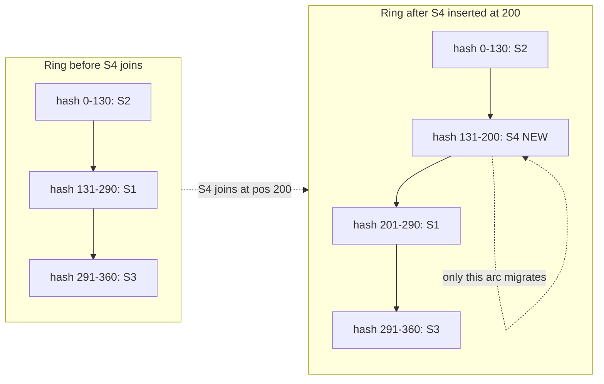
```mermaid
flowchart LR
    subgraph Before[Ring before S4 joins]
        B1[hash 0-130: S2] --> B2[hash 131-290: S1]
        B2 --> B3[hash 291-360: S3]
    end
    subgraph After[Ring after S4 inserted at 200]
        A1[hash 0-130: S2] --> A2[hash 131-200: S4 NEW]
        A2 --> A3[hash 201-290: S1]
        A3 --> A4[hash 291-360: S3]
    end
    Before -.->|"S4 joins at pos 200"| After
    A2 -.->|"only this arc migrates"| A2
```

**Alternative algorithms (jump hash, rendezvous, Maglev).** Ring hashing isn't the only consistent-hashing scheme — three alternatives trade flexibility for speed/memory. *Jump consistent hash* (Google, 2014): O(ln N) arithmetic, zero memory, no ring structure. Maps key→bucket directly via a series of pseudo-random jumps. Catch: buckets must be contiguous integers `[0, N)` and you can only *append* nodes — removing node 5 from a 10-node fleet requires renumbering. Best for internal shard selection where you control IDs. *Rendezvous (HRW) hashing*: for each key, compute `hash(key, server_i)` for every server and pick the highest. O(N) per lookup but trivially supports weighted nodes, partial failures (skip server, pick next-highest), and arbitrary node IDs — used by GitHub Spokes and CockroachDB for replica placement at small fanout. *Maglev hash* (Google, 2016): builds a fixed lookup table at membership-change time, O(1) lookup, ~1% disruption on failure. Good for stateless load balancers. Rule of thumb: ring hash for the operationally-flexible default, rendezvous for small N with weights, jump for high-throughput shard routing, Maglev for L4 load balancing. *[Source: Damian Gryski "Consistent Hashing: Algorithmic Tradeoffs" (2018); Google "Maglev: A Fast and Reliable Software Network Load Balancer"]*

#### Potential Follow-Up Questions
**Q: What happens when a node dies mid-rebalance?**
Its vnodes get reassigned to neighbors via gossip; in-flight migrations resume from the last checkpoint. Replicas already on other nodes serve reads in the meantime. *If pushed:* hinted handoff buffers writes intended for the dead node; on recovery, hints replay before the node rejoins as primary.

**Q: How do you handle a hot key (one celebrity's tweet)?**
Consistent hashing distributes keys evenly but does nothing about per-key load. Replicate the hot key beyond N (10×, 100×) and round-robin reads across copies. *If pushed:* application-layer fan-out cache (CDN/edge) for read-mostly hot keys; for hot writes, shard the key itself (`key:1`, `key:2`).

**Q: Gossip vs ZooKeeper for membership — when do you switch?**
ZooKeeper is simpler and gives you strong consistency on membership, but caps around hundreds of nodes. Past that, gossip's eventual model wins on scale. *If pushed:* hybrid — ZK for the seed/bootstrap list, gossip for steady-state heartbeats.

**Q: How many vnodes per server, and why?**
Around 200 vnodes per physical server is the sweet spot — it pulls the load-distribution standard deviation down to ~5% (good enough that no single node owns 2× the keys of another by luck) without bloating the ring data structure or making each migration touch hundreds of tiny arcs. Below 100 vnodes the variance climbs sharply (1/√V scaling); above 500 the ring grows large enough that lookups start missing L2. *If pushed:* tune up when your hardware is heterogeneous so bigger boxes get proportionally more vnodes (a 2× server gets 400), and tune down when migrations are too chunky and you want fewer, larger arcs to move at a time.

**Q: How do you migrate from `hash % N` to consistent hashing in production?**
Dual-write to both schemes during migration; reads check the new ring first, fall back to old. Backfill in the background; cut over once the new ring is warm. *If pushed:* shadow-read to compare hit rates; flip the cutover per-shard, not all at once, to bound risk.

**Q: Ring hashing vs jump vs rendezvous — when do you switch?**
Ring is the default — supports arbitrary node IDs, weighted vnodes, and removal. Jump is faster (O(ln N), zero memory) but only supports append-only integer buckets, so it's strictly for stateless shard routing where you control the ID space. Rendezvous is O(N) per lookup but trivially weighted and partial-failure-tolerant — good below ~100 nodes. *If pushed:* Maglev's fixed-table approach is what Google's L4 load balancer uses — O(1) lookup at the cost of rebuilding the table on every membership change.

**Q: Heterogeneous hardware — how do you weight bigger servers more heavily?**
Allocate vnodes proportional to capacity: a 2× server gets 2× the vnodes (e.g., 400 instead of 200). The ring math handles the rest — bigger servers naturally own more arc length. *If pushed:* rendezvous hashing supports first-class weights without the vnode workaround; the score formula becomes `weight_i × hash(key, server_i)`.

**Q: How do you debug a "wrong replica" bug — a key that's served stale?**
Three suspects: (1) the requester computed the wrong owner because its ring view is stale, (2) the migration to a new owner is in progress and dual-read is misconfigured, or (3) the read landed on a hint-receiving neighbor before hint-replay completed. Dump the ring on the offender, the source-of-truth ring (ZK or gossip seeds), and the per-key version vector — the discrepancy points to which class of bug it is. *If pushed:* expose a `debug/owner?key=K` endpoint on every node that returns its computed owner + ring-epoch — the diff across the fleet finds the stale node.

#### Bottlenecks & Mitigations
- **Hot key (Beyoncé tweet)** — consistent hashing distributes keys evenly but does nothing about per-key load; one viral key can saturate the single node owning it. Replicate the hot key beyond the standard N (e.g., 100 copies) and round-robin reads across the copies, turning a one-server bottleneck into a fleet-wide load.
- **Skewed distribution** — with too few vnodes per server, random luck in vnode placement leaves some servers owning twice the keyspace of others. Increase vnodes/server (100 → 200 → 500) to smooth the distribution and use a high-entropy hash like xxHash so adjacent keys don't cluster on the same arc.
- **Ring update during rebalance** — when a node joins, some keys are owned by the new node *and* still present on the old one until migration completes; readers can see stale data if they only consult one side. A dual-read window queries both old and new owners during migration, and version vectors on each value (a per-replica counter tuple like `{A:3, B:5}` — see Pattern 3 for the full mechanic) let the reader pick the latest.
- **Thundering herd on add** — when a new node joins, every neighbour starts streaming its share of keys to the newcomer at full network speed, which can saturate links and spike read latency on the existing fleet. Throttle the migration bandwidth (e.g., 50MB/s per stream) and stage by vnode rather than dumping the whole share at once.
- **Membership flapping** — a node that briefly fails its heartbeat and then recovers triggers a full rebalance both ways, doing terabytes of useless work. Dampen heartbeats (require N consecutive misses), and require a quorum of peers to agree on "node down" before initiating any migration.
- **Stale ring view causes wrong-owner reads** — when a node's gossip-derived ring lags reality (a new node joined 2s ago, this node hasn't gotten the gossip yet), it routes reads to the old owner and misses recent writes. Tag every ring with an epoch and include it in inter-node RPCs; if a peer's epoch is newer, the requester refreshes its ring before retrying. Dual-read during the migration window also masks the gap.
- **Cold-start when adding a node** — a freshly-joined empty node receives traffic the moment it claims its vnodes, but its disk cache and OS page cache are cold, so latency spikes for users hashing into its arc. Stage joins: announce "warming" status, replicate the data first, then flip to "active" only once cache hit rate crosses a threshold; some clusters (Riak) call this `handoff` and route reads through the donor until promotion.

#### Failure Modes

| Layer | Failure | Detection | Mitigation |
|---|---|---|---|
| Crash | Node dies mid-rebalance | gossip heartbeat misses for N rounds | hinted handoff buffers writes for the dead node; replicas already on other nodes serve reads; auto-rebalance after grace period |
| Crash | Coordination service (ZK/etcd) ensemble lost | watchers fail, ring-epoch stalls | gossip-only fallback for steady-state operation; refuse cluster topology changes until ZK quorum recovers |
| Network | Asymmetric partition splits the ring view | epoch divergence between nodes, dual-ownership reads | epoch-tagged RPCs; if peer epoch is newer, refresh ring before retrying; dual-read during the partition window |
| Correctness | Hash function changed unintentionally (binary upgrade) | placement decisions diverge, every read miss | pin hash function + seed in immutable config; refuse boot if config doesn't match cluster signature |
| Correctness | Membership flap creates rebalance oscillation | repeated migrate-back-migrate-forward events | dampen heartbeats (require N consecutive misses); require quorum-of-peers agreement before initiating migration |
| Resource | Mega-domain hot key saturates one node | per-vnode CPU pegged on one host | extra-replicate the hot key (10×, 100×); request coalescing at coordinator; key-level fan-out cache |
| Resource | Stream-throttle on rebalance saturates network | inter-node bandwidth sustained > capacity, foreground latency climbs | throttle migration bandwidth (50MB/s/stream); stage by vnode rather than wholesale dump |
| Upstream | Underlying KV's Bloom filter rebuilds during a join | extended cold-cache window on new node | route reads through donor until cache hit-rate crosses threshold (Riak-style handoff) |

#### Observability — Key Metrics & SLOs

- **`ring.lookup_latency_p99`**: time for `get_node(key)` including hash + binary search — emitted in-process — alert if > 100µs (cache-miss signal)
- **`ring.epoch_skew`**: max epoch difference between any two nodes — sampled via gossip — alert if skew > 3 epochs (stale-view risk)
- **`ring.membership_flap_rate`**: nodes transitioning down→up→down within 5min — emitted by coordinator — alert if > 2/hour (signals heartbeat tuning needed)
- **`ring.rebalance_in_flight_streams`**: active migration streams across the cluster — emitted by donors — alert if > N during business hours (foreground impact risk)
- **`ring.key_distribution_stddev`**: stddev of keys-owned across physical servers — sampled hourly via vnode walk — alert if > 10% (vnode tuning needed)
- **`ring.hot_key_skew`**: max QPS on any single key vs cluster median — sampled via per-key counters — alert if > 100× (signal for replication-beyond-N)
- **SLOs:** p99 lookup latency 100µs, ring availability 99.999% (in-process, no network), rebalance disruption window < 5min for a single-node failure.

#### Multi-Region & DR

- **Replication mode:** regional-isolation with cross-region async — each region runs its own ring; cross-region replication is layered on top (the data store using the ring handles geo-replication, not the ring itself). Active-active rings with global gossip is feasible at small region counts but adds convergence-time at scale.
- **RTO / RPO:** RTO < 1min for ring restoration after a node loss (gossip propagates membership; new vnodes adopted); RPO 0 for the ring structure (it's deterministic from membership state). For underlying data, RPO inherits from the storage layer.
- **Failover trigger & cadence:** automatic on N missed heartbeats with quorum agreement; tested via monthly node-kill drills and quarterly region-isolation simulations where one region is network-isolated and ring convergence is observed.
- **Cross-region cost trade-off:** per-region rings cost zero WAN bandwidth for ring maintenance; the cost is that consistency-on-write across regions is the responsibility of the data layer (Pattern 3 covers LOCAL_QUORUM vs EACH_QUORUM). Global gossip is feasible but adds RTT × log(N) convergence delay to every membership change.

#### Common Mistakes / Anti-patterns

- **Saying "use mod-N hashing"** — this is the textbook anti-pattern; changing N rewrites almost every key's destination and empties caches in seconds. Senior candidates use it as a contrast ("naive approach is mod-N which fails because…") rather than as their answer.
- **Forgetting virtual nodes** — without vnodes, with 10 servers a random ring placement gives load skew of 2×+ between the most and least loaded; candidates who describe a single-position-per-server scheme miss why production systems all use vnodes.
- **Ignoring the "thundering herd on join" problem** — when a new node joins, every neighbor streams its share at line rate by default; without bandwidth throttling and staged handoff, foreground latency spikes for minutes.
- **Treating ZooKeeper as infinitely scalable** — ZK caps around hundreds of concurrent watchers before write throughput becomes the ensemble bottleneck; candidates who say "ZK for membership" without acknowledging this give an incomplete answer for thousand-node clusters.
- **Confusing consistent hashing with strong consistency** — consistent hashing is about *placement*, not *agreement on values*; candidates conflate it with quorum or version vectors. The ring tells you which nodes own a key; another mechanism (Pattern 3) decides which value wins among them.
- **Hot-key denial** — saying "consistent hashing handles hot keys evenly" is wrong; it distributes *keys* evenly but does nothing for per-key load. The correct answer names extra replication and request coalescing for hot keys.

#### Talking Points for the Interview

- **Vnodes are about variance, not just flexibility** — citing the 1/√V load-distribution scaling shows you understand why ~200 is the sweet spot; candidates who say "we use vnodes for flexibility" miss the math.
- **Ring hash vs jump vs rendezvous vs Maglev** — naming all four and the trade-offs (jump = append-only, rendezvous = O(N) but weighted, Maglev = O(1) lookup with rebuild cost) signals breadth; the default of ring hash is fine but knowing alternatives matters.
- **Hot keys are a different problem than hot shards** — interviewers are listening for whether you'll conflate per-key load with per-shard load. The ring fixes the latter; nothing in the ring fixes the former.
- **Epoch tagging + dual-read during migration** — naming this mechanism shows you've thought about the consistency window during a topology change, which is where most production bugs live.
- **Gossip beats ZK at scale, but ZK beats gossip at debuggability** — the trade-off cuts both ways and naming both directions reads as senior.
- **Heterogeneous hardware via vnode weighting** — proportional vnode counts is the simple production answer; rendezvous hashing's first-class weights is the elegant one.
- **The hash function is part of the cluster's identity** — changing MurmurHash3 to xxHash mid-cluster rewrites every placement; pinning the hash + seed in immutable config is non-obvious and surfacing it signals operational depth.

### 3. Design a Distributed Key-Value Store (Dynamo-style)
#### Problem
Build a partitioned, replicated KV store with tunable consistency, high availability, and horizontal scale.

#### Summary
**The picture in your head:** a library with copies of every book split across 1000 branches. You walk into any branch (that is your coordinator), ask for a book (your key), and the librarian knows which other branches hold copies. Most of the time the branches agree on which edition they have. Occasionally one branch closed for a week and missed a new edition — the librarian still gives you an answer, but might quietly go update the stale branch afterward.

**The single-request walkthrough:** a client writes `PUT user_42 → {"name":"Alice"}` with N=3, W=2. Any node in the cluster can be the coordinator. The coordinator hashes `user_42` using the ring from Pattern 2, finds the 3 replica nodes (R1, R2, R3), and sends the write in parallel. R1 and R2 respond within 5ms. That satisfies W=2, so the coordinator acks the client: "write succeeded." R3 is slow (maybe a GC pause) and responds at 30ms — the client has already moved on. Later, a `GET user_42` comes in. The coordinator reads from R1 and R2 (R=2 again). If both return the same value, done. If one returns an older version, the coordinator silently writes the newer value back to the stale replica in the background — that is read repair, fixing drift on the read path without any scheduled job.

**The pieces (and what each one is for):**
- **Coordinator** — any node that receives a client request. Not a dedicated machine; any replica can play this role. It fans reads and writes to the key's replica set and waits for quorum.
- **W and R quorum values** — W is the number of replicas that must acknowledge a write before the client gets a success. R is the number that must respond to a read. The invariant `W + R > N` (where N is total replicas, typically 3) guarantees that any read overlaps with any write by at least one node, so a read can never miss the latest write. Default is W=R=2, N=3.
- **LSM-tree storage engine** — the local storage format on each replica. LSM stands for "Log-Structured Merge tree." Writes go first to an in-memory buffer (fast), then get flushed to immutable sorted files on disk. Reads might need to check several files. The tradeoff: writes are very cheap (sequential), reads are slightly more expensive. Cassandra uses this; MySQL's B-tree is the alternative (reads are cheap, writes are more random).
- **Vector clocks (conflict detection)** — when two clients write the same key concurrently (say `user_42` from Paris and Tokyo in the same millisecond), both writes succeed, but they are flagged as concurrent. A vector clock is a small counter tuple like `{A:3, B:5}` — each replica increments its own counter on every write. If one dominates (every component is greater-or-equal), it is newer. If neither dominates, the writes are concurrent and the application gets both values to merge.
- **Hinted handoff** — if R3 is unreachable when a write arrives, the coordinator writes to a healthy neighbor instead and leaves a note ("this write was intended for R3, deliver it when R3 comes back"). When R3 recovers, the neighbor replays the buffered write. Bridges the gap between a short outage and a full repair scan.
- **Anti-entropy with Merkle trees** — a Merkle tree is a tree of hashes: leaves hash small key ranges, parents hash their children. Two replicas compare root hashes. If they match, everything is identical — done. If they differ, recurse into the differing subtrees. This finds exactly which key ranges diverged in O(log n) comparisons rather than comparing every key.

**The thing that makes it hard:** two clients write the same key at the same millisecond. Client A (from New York) writes `{"balance": 100}`. Client B (from London) writes `{"balance": 200}`. Both hit different coordinators. Both satisfy W=2. Both writes succeed. Now replica R1 has `{balance:100}` and R2 has `{balance:200}`. The next read might return either value depending on which replicas respond first. Last-Write-Wins (the simpler fix) breaks under clock skew — if New York's clock is 2 seconds ahead of London's, the newer write by wall time might actually be the older write by real-world order. Vector clocks detect this as a true conflict and hand both versions to the application.

**Why the standard solution works:** quorum reads and writes with W+R>N is the default because it gives you strong consistency at the cost of one replica: if any one of the three is down, writes still succeed (W=2 of 3) and reads still work (R=2 of 3). The tradeoff you accept is that with W=R=2 N=3, a minority of requests will see slightly stale data before read repair catches up — eventual consistency, not strict consistency.

**If you were building it tomorrow:**
- Cassandra with N=3, W=2 (`LOCAL_QUORUM`), R=2, LRU compaction per keyspace.
- LSM storage with Bloom filters per SSTable (a Bloom filter is a tiny probabilistic structure that says "this key is definitely not in this file" — eliminates ~99% of unnecessary disk reads).
- Hot path pseudocode for a write:
  ```
  replicas = ring.get_replicas(key, n=3)
  futures = [r.write(key, value, vector_clock) for r in replicas]
  wait_for(futures, count=W)  # return to client after W acks
  background: hinted_handoff for any unreachable replica
  ```
#### Clarifying Questions
- Read-heavy or write-heavy?
- Consistency model? (strong / eventual / tunable)
- Geo-replication? (single-region or multi)
- Value size range? (KB? MB?)
- Need range scans or just point lookups?

#### Requirements
- **FR:** `get(k)`, `put(k,v)`, `delete(k)`; tunable W/R quorum; replication
- **NFR:** HA across DCs (no single point of failure), low p99 (<10ms), 99.99% availability, eventual consistency OK

#### Scale Estimate
- **Petabytes of data, ~10⁹–10¹⁰ keys:** Dynamo/Cassandra-tier deployment (e.g. Amazon shopping cart, Netflix user state). Anchor: 10B keys (10¹⁰).
- **Avg value ~1KB (range 100B–1MB):** typical KV mix — JSON blobs, session state, small docs. Stored record = value (1KB) + key (~32B) + vector clock (16B/replica × 3 ≈ 48B) + TTL/version header (~16B) + framing ≈ 1.2KB.
- **Logical ~36TB, on-disk ~50TB:** 10¹⁰ keys × 1.2KB × RF 3 = 3.6 × 10¹³ B = 36 TB logical. LSM compaction overhead is typically 1.3–1.5× during tier merges (extra SSTable copies in flight) → ~50TB physical.
- **Throughput 1M ops/s aggregate:** Dynamo-class workload. Read:write ratio ~4:1 (typical KV — sessions, profiles read-heavy) → 800k reads/s, 200k writes/s. Distributed over 1000 nodes → ~1k ops/s/node — comfortable per node, leaves headroom for compaction/repair.
- **Write amplification → ~6 GB/s disk:** LSM with leveled compaction WA ≈ 10–30×, use 10× for steady state. 200k writes/s × 1.2KB × RF 3 × 10× WA = 7.2 × 10⁹ B/s ≈ **6–7 GB/s** aggregate sustained disk write across the cluster (~6 MB/s/node — well within NVMe ~2 GB/s/device).
- **Hot tier ~95% hit rate:** memtable cap ~64MB/node (Cassandra default tunable) + recent SSTables on local NVMe; OS page cache fronts reads. Working-set fits in RAM (typical 5–10% of data is hot) → ~95% page-cache hit rate.
- **Cold tier:** older SSTables migrate to slower local disk or remote object store; tombstones GC'd after `gc_grace_seconds` (default ~10 days — must exceed worst-case repair window so deleted data isn't resurrected by a lagging replica).
- **Topology 100s–1000s nodes/region × 2–3 regions:** 1000-node region keeps blast radius bounded and gossip O(N) tractable. 2–3 regions = standard global posture (e.g. us-east + eu-west + ap) with async cross-region sync.

#### API Contract
```
PUT /kv/{key}        body = value     opts: w_quorum
GET /kv/{key}                          opts: r_quorum
DELETE /kv/{key}
```
Returns version vector + value.

#### High-Level Design
```
              Coordinator (any node can be one)
                       │
        ┌──────────────┼──────────────┐
        ↓              ↓              ↓
     Replica 1    Replica 2     Replica 3
   (LSM store) (LSM store)   (LSM store)
        │              │              │
        └──── Gossip + Anti-entropy ──┘
                 (Merkle trees)
```

**How to read the diagram:** any node can receive the client request and act as coordinator. It does not need to store the key itself. Its job is to locate the key's replica set, fan the request out to those replicas, and wait for enough responses to satisfy the read or write quorum.

**Why the flow is shaped this way:** separating the coordinator role from the storage role makes the system flexible. Clients can talk to a nearby node, while the replicas stay wherever the partitioning scheme says they belong. Background repair keeps replicas converging without forcing every request to wait for every copy.

**What this layout buys you:** low-latency access, no single primary, and tunable consistency. The tradeoff is that you now have to reason about stale replicas, quorum sizes, and conflict resolution as normal parts of the design.

#### Data Model
- **Partition:** consistent hashing ring (see #2)
- **Storage engine:** LSM tree
  - Memtable (in-memory sorted map)
  - WAL (durability)
  - SSTables (immutable on disk, compacted in tiers)
- **Per-key state:** `(value, vector_clock, ttl?)`

#### Detailed Design
**Quorum tuning:**

| Setting | Reads | Writes | Consistency | Use Case |
|---|---|---|---|---|
| W=1, R=N | slow | fast | weak (read repairs) | write-heavy logs |
| W=N, R=1 | fast | slow | strong-ish | read-heavy, rare writes |
| W=R=⌈N/2⌉+1 | balanced | balanced | strong (W+R>N) | **default** |

**Conflict resolution:**
- **Last-Write-Wins** (timestamps) — every write carries a wall-clock timestamp; on conflict, the later one wins. Simple to implement but unsafe under clock skew: if node A's clock is 5s ahead of node B, a write on B that's actually newer can be silently overwritten by an older write on A. Acceptable for cache-like workloads where occasional data loss doesn't matter.
- **Vector clocks** — each replica increments its own counter on every write, producing a tuple like `{A:3, B:5, C:2}`. Two version vectors can be compared: if one strictly dominates the other (every component ≥), the dominant one is newer; otherwise the writes are concurrent and the read returns both for the application to merge. Detects true conflicts but pushes resolution to the app layer.
- **CRDTs** — data types (G-Counter, OR-Set, LWW-Map) whose merge function is mathematically commutative, associative, and idempotent. Replicas can apply writes in any order and converge to the same state without coordination. Solves automatic merge for shopping carts, vote counts, presence sets, but not for arbitrary application semantics.

**Failure handling:**
- **Hinted handoff:** if a replica is unreachable when a write arrives, the coordinator picks a healthy neighbour and stores the write there as a "hint" tagged with the intended owner. When the dead replica recovers, the neighbour replays the buffered hints to it. Bounded by hint TTL (typically hours) — if a node is down longer, full anti-entropy repair takes over.
- **Read repair:** during a read, the coordinator notices version vector divergence between the responses (replica B returned an older version than A and C). It transparently writes the latest version back to B in the background, healing the drift on the read path with no extra work for the client.
- **Anti-entropy:** each replica builds a Merkle tree over its key range — leaves are hashes of value ranges, internal nodes are hashes of their children. Two replicas compare root hashes; if they match, all data is identical and no work is needed. If they differ, the comparison recurses only into the subtrees that actually differ, finding the precise diverged ranges in O(log n) work and syncing only those deltas instead of the full dataset.

**LSM vs B-tree:**

| Aspect | LSM (Cassandra) | B-tree (MySQL) |
|---|---|---|
| Writes | sequential, fast | random, slower |
| Reads | check memtable + N SSTables | direct |
| Compaction | yes (I/O bursts) | no |

**Quorum read repair — sequence walkthrough.** With N=3, W=2, R=2, watch what happens when one replica is stale. The coordinator fans the read to all three replicas; the first two responses (R=2) determine the answer returned to the client, but the coordinator continues processing the third response in the background and reconciles divergence asynchronously. If the third replica returned an older version vector, the coordinator writes the merged latest value back to it — that's read repair, fixing drift on the read path with no separate cron.

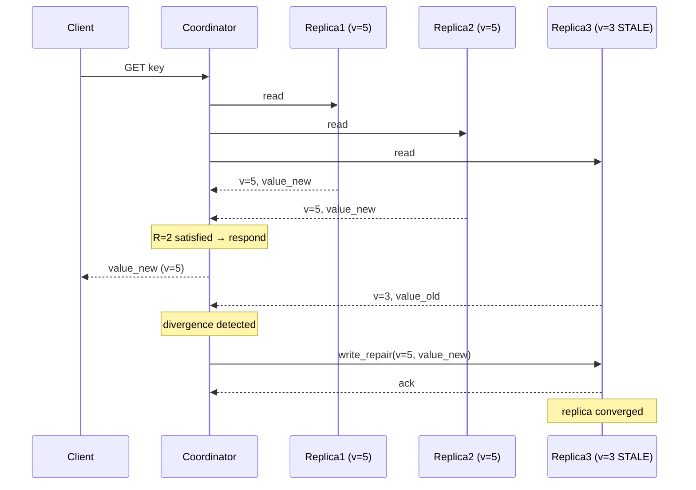
```mermaid
sequenceDiagram
    participant C as Client
    participant Co as Coordinator
    participant R1 as Replica1 (v=5)
    participant R2 as Replica2 (v=5)
    participant R3 as Replica3 (v=3 STALE)
    C->>Co: GET key
    Co->>R1: read
    Co->>R2: read
    Co->>R3: read
    R1-->>Co: v=5, value_new
    R2-->>Co: v=5, value_new
    Note over Co: R=2 satisfied → respond
    Co-->>C: value_new (v=5)
    R3-->>Co: v=3, value_old
    Note over Co: divergence detected
    Co->>R3: write_repair(v=5, value_new)
    R3-->>Co: ack
    Note over R3: replica converged
```

*[Source: DeCandia et al. "Dynamo: Amazon's Highly Available Key-Value Store" SOSP 2007; Cassandra docs]*

**W/R/N tuning — consistency vs availability.** The invariant `W + R > N` guarantees any read overlaps with any write by at least one replica, so a read can't miss the latest write. Pushing W or R up the spectrum trades latency or availability — `W=N` means a single dead replica blocks every write, `R=N` means a single slow replica drags every read to the slowest tail.

| N | W | R | Property | Failure tolerance | Use case |
|---|---|---|---|---|---|
| 3 | 1 | 1 | weak (read repair only) | 2 nodes can be down | logs, telemetry |
| 3 | 2 | 2 | strong (`W+R>N`) | 1 node can be down | **default** |
| 3 | 3 | 1 | strong, slow writes | 0 writes survive 1 down | read-heavy archives |
| 3 | 1 | 3 | strong, slow reads | 0 reads survive 1 down | rare-write configs |
| 5 | 3 | 3 | strong, more headroom | 2 nodes can be down | high-availability KV |

**Sloppy quorum + LOCAL_QUORUM (multi-DC).** Cassandra distinguishes strict quorum (must use canonical replicas) from sloppy quorum (any N healthy nodes count). Sloppy quorum trades strict consistency for AP under partition: during a network split, the coordinator accepts the write to the next-closest healthy node and stores a hint targeted at the rightful owner; the owner replays it on recovery. In multi-DC clusters, `LOCAL_QUORUM` (`⌈local_RF/2⌉+1` within the local DC) keeps reads/writes local to one DC for latency, while `EACH_QUORUM` (write-only) requires a quorum *in every DC* for cross-DC strong consistency at the cost of WAN RTT. Production default for most multi-region Cassandra is `LOCAL_QUORUM` reads + writes, with async cross-DC replication catching up the rest. *[Source: Datastax "Cassandra Consistency Level Guide"; Pythian blog]*

**Bloom filters in LSM.** Each SSTable carries a small Bloom filter of its keys; on read, the storage layer checks the filter before going to disk. A point lookup only opens SSTables whose Bloom said "maybe contains this key" — at typical 1% false-positive sizing, ~99% of SSTables that don't contain the key are skipped without a disk read. The filter is the difference between LSM reads being usable (1-2 SSTable opens per read) versus catastrophic (`SSTables_per_level × levels` opens).

**Point lookups vs range scans.** This design optimises for point `get(k)` — the dominant access pattern for KV workloads. Range scans are supported within a single partition (clustering-key ranges in Cassandra-style schemas) because LSM SSTables store keys sorted, so a contiguous range inside one partition reads sequentially. Cross-partition range scans (e.g., "all keys between X and Y" globally) require fan-out to every shard and aggregation — expensive and rarely worth the effort; if the workload genuinely needs global ordered scans, pick an ordered-partitioned store (HBase, Bigtable) instead of hash-partitioned Dynamo-style. The default assumption here is point lookups + intra-partition ranges; we accept that arbitrary range queries are not a first-class operation.

#### Potential Follow-Up Questions
**Q: What happens during a network partition?**
Sloppy quorum — coordinator accepts writes from any N healthy nodes (not just the canonical replicas) and stores hints. When the partition heals, hints replay to the rightful owners. *If pushed:* you trade strict consistency for availability (AP side of CAP); apps requiring strict can configure `LOCAL_QUORUM` and refuse on partition.

**Q: Two clients update the same key simultaneously — what does a reader see?**
Both writes succeed, vector clocks mark them concurrent, the read returns both versions. Client-side merge (CRDTs, LWW, or app-defined) resolves. *If pushed:* if you can't tolerate conflict-resolution code in clients, layer a transactional engine on top (Spanner-style) — but you pay in latency and lose AP.

**Q: How do you handle a hot key getting 100× normal traffic?**
Coordinator-side request coalescing collapses concurrent reads of the same key into one in-flight call and fans the response out to all waiters, so a 100× spike on a single key still results in one backend roundtrip per coordinator. A client-side cache with a short TTL (1–5s) absorbs the next layer of repeats, and replicating the hot key beyond the standard N spreads the residual load across more replicas. *If pushed:* shard the key itself at the application layer into `key:1`..`key:k` and aggregate at read time — expensive in code complexity but turns one hot partition into k cold ones.

**Q: How do you tune W and R in practice?**
Start with `W=R=⌈N/2⌉+1` so `W+R>N` (strong). Drop W to 1 for high-throughput logs that tolerate read repair; drop R to 1 for read-heavy + rare writes. *If pushed:* per-keyspace tuning in Cassandra; track p99 read latency and stale-read rate to find the right point.

**Q: How does the system recover from a multi-hour node outage?**
Hinted handoff buffers writes during the outage; on recovery, hints replay first. Anti-entropy via Merkle tree diff catches anything missed. *If pushed:* if hint TTL expired, full subrange repair from a healthy replica; throttle to avoid I/O storms during business hours.

**Q: How do you bound compaction I/O impact?**
Throttle compaction bandwidth, run on a separate disk, schedule major compactions off-peak. Use leveled compaction for read-heavy workloads (tighter SSTable count). *If pushed:* size-tiered for write-heavy; monitor read amplification (`SSTables per read`) as the leading indicator of compaction debt.

**Q: LOCAL_QUORUM vs EACH_QUORUM — when do you use which?**
LOCAL_QUORUM keeps reads/writes inside one DC, satisfying `W+R>N` locally; cross-DC sync is async. EACH_QUORUM requires a quorum in *every* DC per write — strong cross-DC consistency, but every write pays the WAN RTT and any DC outage stalls writes. *If pushed:* default to LOCAL_QUORUM for both reads and writes; reach for EACH_QUORUM only on rare cross-region-coordination operations (account creation in a multi-region SaaS) where the latency cost is acceptable.

**Q: How does a Bloom filter on each SSTable change LSM read amplification?**
Without it, a point read opens every SSTable in the level until found — `O(levels × SSTables_per_level)` disk seeks worst case. With a per-SSTable Bloom (~1% FPR), only the SSTable that actually contains the key is opened (plus ~1% false-positive opens). Difference between 10+ disk seeks and 1-2. *If pushed:* tune the Bloom bits-per-key against memory budget — Cassandra's `bloom_filter_fp_chance` defaults to 0.01 for size-tiered, 0.1 for leveled (which already has fewer SSTables to check).

**Q: A sloppy quorum write goes to the wrong-DC neighbor — how does the data eventually reach the right owners?**
The neighbor stores a hinted handoff entry tagged with the intended owner's node ID. On recovery, the original owner gossips itself back as alive; the hint-holder dials it directly and replays buffered writes in arrival order. Bounded by hint TTL (default 3hr in Cassandra). *If pushed:* if the owner stays down past the TTL, hints are dropped and full anti-entropy repair takes over the eventual reconciliation — slower, but unbounded.

#### Bottlenecks & Mitigations
- **Hot key** — consistent hashing places one key on N replicas, but one celebrity post can drive 100× normal traffic to those N. Coordinator-side request coalescing (single in-flight read per key, fan responses to all waiters) absorbs the burst, and replicating the hot key beyond N spreads load further.
- **Compaction I/O spikes** — LSM tier compaction periodically rewrites SSTables, generating sustained disk writes that compete with foreground traffic. Throttle compaction bandwidth (e.g., 50MB/s) and put compaction I/O on a dedicated disk (or NVMe namespace) so reads don't share queue depth.
- **Wide-row blow-up** — a single partition key with millions of clustering-key entries (e.g., one user with 10M events) makes a single row larger than memory and skews shard load. Enforce per-key and per-value size limits at the API layer; if the data model genuinely needs wide rows, sub-partition the key (`user:1`, `user:2`).
- **Cross-DC latency** — a quorum that spans DCs adds the cross-DC RTT (~70ms transatlantic) to every request. `LOCAL_QUORUM` in Cassandra waits only for replicas in the local DC, satisfying the W+R>N invariant within DC and crossing the WAN asynchronously.
- **Repair traffic** — a full Merkle-tree repair across petabytes of data can saturate the network for hours. Build the tree at multiple granularities (coarse first, then deeper only into diverging subtrees) and run subrange repair so any single repair pass touches a small fraction of the keyspace at a time.
- **Tombstone accumulation** — deletes write a tombstone marker rather than removing the row, so SSTables fill up with deleted-but-not-yet-purged entries. Tombstones can't be GC'd before `gc_grace_seconds` (default 10 days) because doing so could resurrect data on a replica that missed the delete. Keep the delete rate low; for queue-like workloads (TTL'd events), use a separate keyspace and run `nodetool repair` more aggressively, then drop the whole partition rather than deleting row by row.
- **Read amplification under hot partitions** — a partition with many overwrites accumulates versions across SSTables that all need merging on read. Watch read-amp metrics; if a hot partition is hitting >10 SSTables per read, force a compaction on it or model the data with append-only clustering keys instead of overwrites.

#### Failure Modes

| Layer | Failure | Detection | Mitigation |
|---|---|---|---|
| Crash | Replica dies during a write quorum | coordinator times out waiting for ACK | hinted handoff to a healthy neighbor; retry-with-different-replicas; sloppy quorum if W threshold still reachable |
| Crash | Entire region offline (DC failure) | LOCAL_QUORUM unavailable, cross-DC failover trigger | promote secondary DC (active-passive) or accept partition (active-active with last-writer-wins or CRDT merge on rejoin) |
| Network | Long-running partition between two DCs | hint-buffer growth past TTL, divergent version vectors | full anti-entropy repair on partition heal; surface conflict count to ops |
| Correctness | Vector clock pruning loses history | "concurrent" reads where one should dominate | bound clock size by retiring oldest entries with explicit conflict markers; alert on prune-rate |
| Correctness | Tombstone resurrection (deleted data reappears) | reads return values that were deleted N days ago | enforce `gc_grace_seconds > max_repair_window`; never run unsafe disable-tombstone-checks in prod |
| Resource | Compaction I/O storm during peak traffic | foreground p99 latency climbs, disk queue depth saturated | throttle compaction bandwidth (50MB/s); leveled compaction for read-heavy; dedicate compaction to separate disk |
| Resource | Wide row exceeds memory (millions of clustering keys) | OOM on single node, single-row read latency climbing | enforce per-key/per-value size limits; sub-partition the key |
| Upstream | OS-level descriptor exhaustion under high connection count | `EMFILE` on accept, gossip flapping | bound coordinator-side connection pool size; raise `ulimit`; enable connection pooling per client |

#### Observability — Key Metrics & SLOs

- **`kvstore.read_latency_p99`**: end-to-end coordinator read including quorum wait — emitted per request — alert if > 50ms (typical SLA target is 10ms)
- **`kvstore.write_latency_p99`**: end-to-end coordinator write including quorum wait — emitted per request — alert if > 30ms
- **`kvstore.read_amplification`**: SSTables opened per read (after Bloom filtering) — emitted by storage layer — alert if median > 3 (compaction debt signal)
- **`kvstore.compaction_pending`**: queued compaction jobs per node — emitted by storage daemon — alert if > 100 for 1hr (write-amp climbing)
- **`kvstore.hint_buffer_size`**: outstanding hinted-handoff entries — emitted per node — alert if > N or growing for > 1hr (replica down too long)
- **`kvstore.repair_lag_hours`**: time since last successful anti-entropy repair per range — emitted by repair scheduler — alert if > `gc_grace_seconds / 2` (tombstone resurrection risk)
- **SLOs:** p99 read 10ms, p99 write 30ms, availability 99.99% (LOCAL_QUORUM with N=3, tolerates 1 node down per DC), zero data loss within RPO window (hinted handoff TTL).

#### Multi-Region & DR

- **Replication mode:** active-active with LOCAL_QUORUM reads/writes per DC plus async cross-DC replication; each DC has its own RF=3 quorum and serves locally. Active-passive is the alternative when strong cross-region consistency is required (every write goes to the primary DC, secondary tails).
- **RTO / RPO:** RTO 1–5min for client failover after a DC outage (geo-DNS or client-side region pinning); RPO 1–60s of inflight cross-DC replication lag — writes accepted in DC1 in the last few seconds may not be visible in DC2 until catch-up.
- **Failover trigger & cadence:** automatic on health-check failure of an entire DC (geo-load-balancer pulls the unhealthy region); tested quarterly via simulated DC isolation. Per-DC failovers (single rack, single AZ) test monthly.
- **Cross-region cost trade-off:** async cross-DC replication costs WAN bandwidth proportional to write rate × payload size × RF (typically 5–50% of intra-DC traffic on the WAN); EACH_QUORUM is available for explicit strong-cross-DC writes but pays the WAN RTT (~70ms transatlantic) per write — reserve for rare cross-region operations like account creation.

#### Common Mistakes / Anti-patterns

- **Confusing consistency-per-request with consistency-of-the-system** — saying "Cassandra is eventually consistent" misses that W and R are per-request knobs; a single keyspace can serve `W=R=N` reads (strong) and `W=1, R=1` reads (eventual) simultaneously. Senior candidates explain the W+R>N invariant rather than labelling the whole system.
- **Treating last-write-wins as safe** — LWW is unsafe under clock skew and silently loses data; candidates default to it because vector clocks "sound complicated", but the complexity is exactly the point. Name vector clocks or CRDTs for any workload where data loss is unacceptable.
- **Ignoring tombstones in capacity planning** — delete-heavy workloads (queues, TTL'd data) accumulate tombstones in SSTables that cost read-time scan work even after the data is logically gone. Candidates who design queue-on-Cassandra without naming tombstone GC misunderstand the storage engine.
- **Picking quorum without thinking about partial failure** — `W=N` sounds strong but means a single replica being slow (not even down) drags every write to the slowest replica's latency, and one dead replica blocks all writes. The default `W=⌈N/2⌉+1` tolerates one slow/dead replica per write.
- **Glossing over the "concurrent writes" case** — "vector clocks resolve conflicts" is incomplete; vector clocks *detect* conflicts, the application layer or a CRDT *resolves* them. Candidates who don't explain who resolves the conflict miss a full layer of design.
- **Using anti-entropy as the primary repair mechanism** — anti-entropy is the safety net; the hot-path repairs are read-repair (inline during reads) and hinted handoff (during transient outages). Candidates who say "we just run repair every week" miss that production systems repair continuously through the read path.

#### Talking Points for the Interview

- **The W+R>N invariant is the central insight** — stating it explicitly and explaining why it gives any-read-overlaps-any-write is what distinguishes "read the Dynamo paper" from "got lost in the weeds".
- **Vector clocks detect, applications resolve** — this two-layer separation is what makes the system general-purpose; candidates who name it surface a senior-level mental model.
- **LOCAL_QUORUM is the production multi-DC default** — naming it with the rationale (intra-DC strong, inter-DC async) shows you've seen real Cassandra deployments rather than just the theory.
- **Compaction is the hidden tax** — write-amplification 10–30× is the LSM trade-off you make for fast writes; candidates who don't surface it haven't operated one of these systems.
- **Hinted handoff bridges the gap between "transient" and "anti-entropy"** — naming it as the bounded-TTL middle layer shows you understand why production has three repair mechanisms (read-repair, HH, anti-entropy) instead of one.
- **Bloom filters per SSTable change LSM economics** — point reads go from O(SSTables) seeks to ~1 seek; without surfacing this the LSM design looks worse than B-tree, with it the design is justified.
- **CRDTs are the answer when conflict resolution must be automatic** — for shopping carts, presence sets, vote counts; naming the data type (G-Counter, OR-Set, LWW-Map) is more credible than handwaving "CRDTs".

### 4. Design a Unique ID Generator (Snowflake)
#### Problem
Generate globally unique, roughly time-sortable 64-bit IDs across thousands of machines without coordination per request.

#### Summary
**The picture in your head:** a ticket machine at a deli counter, except there are 1000 ticket machines running simultaneously. If each machine just handed out sequential numbers starting at 1, they would all collide. Snowflake's insight: give each machine a unique machine ID at startup, then build every ticket from three ingredients — the current millisecond, the machine's ID, and a tiny per-millisecond counter. Even if two machines generate a ticket in the exact same millisecond, different machine IDs make them distinct. The whole generation happens locally with no network call.

**The single-request walkthrough:** machine 42 needs to generate an ID. It reads the current time: `1740000000100` (a Unix timestamp in milliseconds). It checks: is that later than the last timestamp it used? Yes. So it resets the sequence counter to 0. It packs the 64-bit integer as: timestamp bits in the high positions, machine ID `42` in the middle, sequence `0` at the low end. Result: one 64-bit integer that is globally unique, because no other machine is machine 42, and machine 42 won't reuse this timestamp+sequence combination. The entire operation takes under 1 microsecond with no network hop.

**The pieces (and what each one is for):**
- **41-bit timestamp (milliseconds since a custom epoch)** — the epoch is just the launch date, say Jan 1, 2020. Storing milliseconds since that date instead of since 1970 gives 41 bits ~69 years of runway rather than ~3 years. Putting the timestamp in the high bits means that sorting these integers as ordinary numbers also sorts them by creation time — new IDs go to the end of a database index, which is efficient for B-tree inserts.
- **10-bit machine ID** — a number 0–1023, unique across the fleet. This is the only part that requires coordination, and it only happens at boot time (see below). Different machines produce IDs in the same millisecond without collision because the machine ID is different.
- **12-bit sequence counter** — counts from 0 to 4095 within a single millisecond on a single machine. If a machine generates more than 4096 IDs in one millisecond (rare), it spins waiting for the clock to tick to the next millisecond.
- **Coordination service (ZooKeeper or etcd) for machine ID leases** — at boot, a machine atomically claims a slot: "I want machine ID 42." If that slot is taken, it tries 43, 44, etc. The claim is a short-lived lease that expires if the machine dies — the slot gets recycled. This is the only network call in the system. After boot, the hot path is entirely local.

**The thing that makes it hard:** clocks lie. A virtual machine gets migrated to different hardware and its clock jumps backward by 3 seconds. Machine 42 was happily generating IDs with timestamp `1740000003000` and suddenly the clock reads `1740000000000` — 3 seconds in the past. If the machine keeps generating, it will reissue IDs it already handed out 3 seconds ago. Those IDs are now used twice in the system. Every database row, every order, every event that used one of those IDs is now silently pointing at the wrong thing. The fix is brutal but correct: detect `now < last_timestamp` and halt entirely. Refuse to generate any IDs until the clock recovers. One machine going silent for a few seconds is far better than years of corrupted primary keys.

**Why the standard solution works:** the design puts the only coordination at boot time (machine ID assignment), making the hot path purely local. At 1 million IDs per second per machine across a 1000-machine fleet, hitting a coordination service for every ID would be the bottleneck. Local generation with a pre-assigned machine ID gives sub-microsecond generation with zero network dependency on the hot path.

**If you were building it tomorrow:**
- ZooKeeper or etcd holds ephemeral leases at `/snowflake/leases/{0..1023}`; each machine does `CREATE_OR_FAIL` at boot to claim a slot.
- Per-machine generator is a ~20-line class:
  ```
  def next_id():
    ts = now_ms()
    if ts < last_ts: HALT and alert  # clock moved backward
    if ts == last_ts:
      seq = (seq + 1) & 0xFFF        # 4096 max per ms
      if seq == 0: spin until next ms
    else: seq = 0
    last_ts = ts
    return (ts << 22) | (machine_id << 12) | seq
  ```
- Custom epoch = your launch date; burn no bits on ancient history.
- On clock rewind > 0ms: log it, alert ops, return error to callers — never silently reissue.
#### Clarifying Questions
- Need sortability by creation time?
- Max ID rate per node?
- Tolerance to clock skew?
- 64-bit constraint (DB column type) or 128-bit OK?

#### Requirements
- **FR:** unique IDs across fleet, sortable by time
- **NFR:** >10k IDs/s/node, no external dependency on hot path, monotonic-ish

#### Scale Estimate
- **Fleet 1k–10k machines, ~4M IDs/s aggregate:** Twitter-tier (~1k generators) up to hyperscaler (10k). Per-node ceiling = 2¹² IDs/ms = 4096 IDs/ms = 4.096M IDs/s/node, but realistic steady-state is ~4k IDs/s/node × 1000 nodes = ~4M/s aggregate (any single node could burst to 4M/s if needed).
- **ID size 8B (int64):** Snowflake layout = 1 sign + 41 ts_ms + 10 machine + 12 sequence = 64 bits = 8 bytes by definition.
- **ID byte volume ~32MB/s:** 4 × 10⁶ IDs/s × 8B = 3.2 × 10⁷ B/s ≈ 32 MB/s of pure ID bytes if logged. Storage cost per ID is dominated by the row keyed on it (typically 100B+), not the ID itself.
- **vs UUID savings ~50%:** UUID = 16B, Snowflake = 8B → every index entry, foreign key, and join column halves. On a table with a 32B index entry (key + RID), 8B ID → 24B vs 16B → 32B = 25–50% smaller index depending on layout.
- **Machine-ID space 1024 slots:** 10 bits = 2¹⁰ = 1024. With a 1k-node fleet you're at saturation — assumption above is "1k machines using full bits"; 10k fleet requires stealing bits from sequence (12→9, capping per-node QPS at 512/ms ≈ 512k/s, still ample) or using zone+machine encoding.
- **Epoch range ~69 years:** 41 bits of milliseconds = 2⁴¹ ms = 2.2 × 10¹² ms ÷ (1000 × 86400 × 365.25) ≈ 69.7 years. Pick epoch close to launch date to maximise remaining runway.
- **Hot tier <1MB:** machine-id leases in coordination service (ZooKeeper/etcd). 10k entries × ~50B (node_id + lease_ts + host) = ~500KB total. Heartbeat ~1KB/s/node × 10k nodes = 10 MB/s aggregate to coordinator — easily handled.
- **Cold tier none:** ID-to-creation-time decoding is `(id >> 22) + epoch_ms` — pure compute, no lookup. No historical store needed for the generator itself.

#### API Contract
```
next_id() → int64    # in-process call, sub-microsecond
```

#### High-Level Design
```
Boot:
  Node ─→ Coordination Service ─→ lease machine_id (0..1023)
  Node syncs clock (NTP / PTP)

Per-call (in process):
  ts = now_ms()
  if ts < last_ts: HALT (clock went backwards)
  if ts == last_ts: seq = (seq + 1) & 0xFFF
                    if seq == 0: spin until next ms
  else: seq = 0
  last_ts = ts
  id = (ts << 22) | (machine_id << 12) | seq
```

**How to read the diagram:** the coordination service is only used when a machine starts up. It hands out a unique machine ID, and from that point onward the server generates IDs locally with no network hop on the hot path.

**Why the flow is shaped this way:** per-request coordination would turn ID generation into a bottleneck immediately. Snowflake avoids that by doing the one shared step at boot time, then letting each machine combine time, machine ID, and sequence locally.

**What this layout buys you:** very fast ID creation and roughly time-ordered IDs that work well in databases. The sensitive part is clock handling: once generation is local, time correctness matters more than algorithmic complexity.

#### Data Model
- **Machine ID lease** (coordination service): ephemeral entry `/snowflake/leases/{machine_id}` → host
- **Snowflake config:** epoch (custom, e.g. 2020-01-01)

#### Detailed Design
**Approach comparison:**

| Approach | Pros | Cons |
|---|---|---|
| **Snowflake** | sortable, compact (64b), no per-call coord | clock-sensitive, machine_id allocation |
| **UUID v4** | trivially unique, no coord | 128b, unsortable, bad for index locality |
| **UUID v7** | sortable, no coord | 128b |
| **DB auto-increment** | simple | single point of failure, range allocation needed |
| **Ticket server** (single counter DB) | simple, sortable | SPOF, scaling cap |
| **MongoDB ObjectId** | similar to Snowflake | 96b |

**Clock skew handling:**
- Reject backward jumps > Xms; halt + alert. If `now < last_ts`, refuse to issue any further IDs and surface a hard error to the operator. The cost (one node out of rotation for a few seconds) is vastly preferable to silent ID re-issuance, which corrupts every system that uses these IDs as primary keys. Set X to 0 in strict mode; in lenient mode (e.g., NTP step adjustments), a few-millisecond rewind is absorbed by waiting.
- Stretch forward small jumps (queue requests). If the clock leaps forward by 100ms, naively you'd skip 100ms of IDs — fine, that's wasted but harmless. But if the leap is huge (multi-second), some Snowflake implementations cap the jump and gradually catch up over the next several ms to keep the timestamp axis monotonic and dense, which matters for systems doing time-range scans on IDs.

**Detailed comparison: Snowflake vs UUIDv7 vs ULID vs KSUID.** All four are time-sortable, coordination-free IDs but they're not interchangeable. Snowflake is 64 bits, requires a machine-ID lease, and packs ms+machine+seq for tight integer sortability. UUIDv7 (RFC 9562, IETF-standardized 2024) is 128 bits with 48-bit ms timestamp + 74 bits of randomness — no machine-ID needed because the random bits cover collision space, and PostgreSQL 18 (2025) ships a native `uuidv7()` function. ULID is 128 bits encoded as a 26-char Crockford Base32 string (`01ARZ3NDEKTSV4RRFFQ69G5FAV`), which sorts correctly as a string — wins where IDs flow through systems that prefer text. KSUID is 27 bytes, 32-bit second-precision timestamp + 16 bytes random — cheaper than UUIDv7 in entropy collection but coarser timestamps.

| Format | Bits | Sortable | Coord-free | DB type | Predictable? | Best for |
|---|---|---|---|---|---|---|
| **Snowflake** | 64 | yes (int) | machine-ID lease | BIGINT | yes (don't expose) | tight column width, internal IDs |
| **UUIDv4** | 128 | no | yes | UUID | no | non-leaky external IDs |
| **UUIDv7** | 128 | yes (binary) | yes | UUID | partial | new projects, IETF-standard, PG18 native |
| **ULID** | 128 | yes (string) | yes | varies | partial | text-heavy pipelines, log IDs |
| **KSUID** | 160 | yes | yes | varies | partial | second-precision is enough |
| **MongoDB ObjectId** | 96 | yes | machine+pid | special | yes | MongoDB ecosystem |

*[Source: Authgear "Time-Sortable Identifiers Explained" (2025); RFC 9562; PostgreSQL 18 release notes]*

**Why "halt" is the right clock-rewind policy.** Most Snowflake bugs in the wild aren't ID-generation bugs, they're clock-management bugs that the ID generator silently absorbed. NTP step adjustments, VM live migration, leap-second smearing on hosts that don't smear, container restarts with `chrony` re-sync — all can rewind a wall clock. Halting on rewind makes the failure mode loud (one node rejects writes for a few seconds) instead of silent (years of slowly-corrupted primary keys). The Twitter Snowflake announcement (2010) explicitly called this out: silent ID re-issuance corrupts every system that uses these as foreign keys, and recovery is forensic archaeology. *[Source: Twitter "Announcing Snowflake" (2010)]*

#### Potential Follow-Up Questions
**Q: A VM gets live-migrated and the clock jumps backward 5s — what happens?**
Halt and refuse to issue IDs until `now > last_ts`; alert ops. Silent corruption (re-issuing IDs) is catastrophic; a 5-second outage on one node is recoverable. *If pushed:* burn a few high bits as a "generation" counter that bumps on every clock-rewind detection — keeps issuing without overlap, at the cost of strict time-sortability.

**Q: How does machine_id allocation avoid races at boot?**
Ephemeral lease in ZK/etcd: node creates `/snowflake/leases/{id}` with `CREATE_OR_FAIL`; if it exists, try the next ID. Lease auto-deletes when the node dies. *If pushed:* if ZK is unavailable, refuse to start — never fall back to a guessed ID.

**Q: What's wrong with UUIDv7? Why not just use that?**
UUIDv7 is sortable and coordination-free, but 128 bits doubles your index size and BIGINT-typed columns can't hold it. *If pushed:* if you control the schema and don't care about column width, UUIDv7 is genuinely simpler — no machine_id allocation, no clock-halt logic.

**Q: 4M IDs/s/node — what if you need more?**
Genuine sustained needs above 4M IDs/sec/node are rare, but the bit layout is the knob: steal bits from `machine_id` (giving you more sequence bits per millisecond at the cost of fewer machines), or shorten the timestamp epoch (giving more sequence bits at the cost of years of remaining range). Either trade is reversible only by re-encoding existing IDs, which is painful — so pick the bit layout once with a 5-year horizon in mind. *If pushed:* go to a 128-bit format (UUIDv7) and stop fighting the budget; alternatively shard the namespace by tenant so each tenant gets its own machine-ID + sequence space and the per-tenant ceiling stops mattering.

**Q: How do you test that IDs are actually unique across the fleet?**
Generate billions in a load test across N nodes, sink to a dedup job (Spark distinct count). In prod, sample a small fraction of IDs into a Bloom filter for live collision detection. *If pushed:* invariant alarm — monotonic-per-node counter on emitted IDs, reconciled against expected rate, catches a stuck-clock node early.

**Q: Can someone guess the next ID and exploit it?**
Snowflake IDs are predictable (timestamp + machine + counter). Don't use them as security tokens. *If pushed:* hash or HMAC the snowflake before exposing externally, or pair with an opaque session token.

**Q: New project in 2026 — Snowflake or UUIDv7?**
UUIDv7 unless you have a hard 64-bit constraint. It's IETF-standardized (RFC 9562), Postgres 18 ships native `uuidv7()`, no machine-ID allocation, no clock-halt logic, ecosystem support is everywhere. The 128-bit cost is real (~50% bigger indexes, doubled FK columns) but matters mainly at petabyte scale. *If pushed:* Snowflake still wins when the ID is internal-only, the column type is BIGINT throughout, and you already run a coordination service for other things — don't introduce ZK/etcd just for machine-ID leases.

**Q: How do you handle an epoch rollover (year ~69 from your custom epoch)?**
Forty-one bits of ms gives ~69 years; pick an epoch close to launch so you have full runway. When you eventually approach the boundary, migrate to a new epoch + 1 high bit reserved for "post-rollover" marker, or expand to a 128-bit ID format. *If pushed:* it's the Y2K of distributed systems — schedule the migration when you cross 50 years from epoch, not 65.

**Q: Why is the 41-bit timestamp at the *high* end of the layout?**
Lexicographic-by-time sortability. Sorting two int64s as integers also sorts them by creation time, which gives you free index locality (recent rows clustered) and lets you use the ID itself as a pagination cursor. Reversing the layout (timestamp at the low end) breaks both. *If pushed:* this is also why DB primary keys benefit — B-tree inserts at the right edge are cheap; UUIDv4's random insertion causes page splits everywhere.

#### Bottlenecks & Mitigations
- **Clock backward** — wall-clock can rewind on NTP step, VM live-migration, or leap-second insertion, and any rewind risks re-issuing IDs that already exist. Halt issuance immediately and alert ops; the node can rejoin once `now > last_ts` without ever overlapping its earlier output.
- **Sequence overflow within ms** — at 4096 IDs/ms/node the sequence wraps; without protection you'd issue duplicates within the same millisecond. Spin in a tight loop until the wall clock ticks to the next ms (microseconds of stall) — 4M IDs/sec/node is enough headroom for nearly any workload, and the spin makes the cap a soft slowdown rather than a correctness bug.
- **Machine ID collision** — two nodes with the same machine_id will collide every ID they generate in the same ms. An ephemeral ZK/etcd lease on `/snowflake/leases/{id}` (CREATE_OR_FAIL) ensures each ID is held by exactly one process; on node death the lease auto-expires and the slot is reusable.
- **NTP unavailable** — if NTP fails, the clock can drift seconds-per-day and eventually cause a backward step at recovery. Fall back to the OS monotonic clock for the duration of the outage and track accumulated skew so the system can correct gracefully when NTP returns rather than experiencing a sudden rewind.
- **Leap second insertion** — a positive leap second inserts 23:59:60 UTC, which `time()` on naive systems re-issues as 23:59:59 (a one-second rewind). Run hosts on a leap-smear NTP source (Google/AWS smear over 24h, no rewind ever happens) instead of trying to handle the discontinuity in the generator.
- **Predictability leaking traffic patterns** — exposing raw Snowflake IDs externally lets adversaries enumerate (`/order/12345 → /order/12346` reveals next order) and infer business volume from ID gaps over time. Hash-encode external IDs (HMAC + base62) or pair with an opaque session token; keep raw Snowflakes as internal primary keys only.

#### Failure Modes

| Layer | Failure | Detection | Mitigation |
|---|---|---|---|
| Correctness | Wall clock rewinds (NTP step, VM live-migration, leap second) | per-call check `now < last_ts` | halt issuance immediately; alert ops; rejoin after `now > last_ts` |
| Correctness | Two nodes assigned same machine_id (lease race) | duplicate IDs in downstream sink | ephemeral coordination-service lease with `CREATE_OR_FAIL`; refuse boot on collision |
| Crash | Coordination service (ZK/etcd) unavailable at boot | lease acquisition times out | refuse to start; never fall back to a guessed ID — silent collision is worse than not booting |
| Crash | Node OOM during ID issuance | process restart | stateless generator; on restart re-acquire lease; first ID issued with `now > last_ts_recovered_from_disk_or_warmup` |
| Resource | Sequence overflow in same ms (>4096 IDs) | spin-wait observable as latency micro-spikes | tight spin until next ms; cap is soft slowdown not correctness bug |
| Network | Partition isolates node from clock-sync (NTP) | `ntpd` peer offset growing | fall back to OS monotonic clock for offset accumulation; resync gracefully on NTP recovery |
| Upstream | Epoch rollover approaching (year ~69 from custom epoch) | timestamp bits saturating | scheduled migration to new epoch with high-bit "post-rollover" marker, well before saturation |
| Process | External consumer assumes ID is unguessable | scraping/enumeration of `/order/12345` increments | hash-encode external IDs (HMAC + base62); never expose raw Snowflakes as user-facing identifiers |

#### Observability — Key Metrics & SLOs

- **`snowflake.gen_latency_p99`**: time per `next_id()` call — emitted by generator — alert if > 1µs (spin-wait or contention signal)
- **`snowflake.clock_rewind_events`**: count of detected backward clock jumps — emitted on detection — alert immediately on any non-zero (per-node investigate)
- **`snowflake.sequence_overflow_per_ms`**: count of ms where sequence saturated to 4096 — emitted per second — alert if sustained > 100/s (capacity ceiling approaching)
- **`snowflake.lease_age_seconds`**: time since machine-id lease was last renewed — emitted by lease holder — alert if > 2× heartbeat interval (lease-loss risk)
- **`snowflake.ntp_offset_ms`**: clock offset to NTP peers — sampled every 10s — alert if > 100ms (skew threatening clock-rewind)
- **`snowflake.id_collision_check`**: sampled IDs cross-checked for collisions in a Bloom filter — emitted by audit pipeline — alert immediately on any collision
- **SLOs:** p99 generator latency 1µs, availability 99.999% (in-process, only depends on local clock + already-acquired lease), zero ID collisions ever — this is a hard correctness SLO, not a soft latency one.

#### Multi-Region & DR

- **Replication mode:** regional-isolation — each region runs its own coordination service for machine-id leases, with disjoint machine-id ranges (e.g., us-east: 0-340, eu-west: 341-680, ap: 681-1023). No cross-region coordination on the hot path (the generator is in-process). Disjoint ranges guarantee uniqueness across regions without sync.
- **RTO / RPO:** RTO < 30s for a single-node failure (lease auto-expires; standby acquires); RTO < 5min for a coordination-service failover (ZK/etcd ensemble election). RPO is non-applicable — no state to lose; generators are stateless beyond the lease and the last-issued timestamp.
- **Failover trigger & cadence:** lease auto-expiration on heartbeat miss (< 30s); coordination-service failover via ensemble election. Tested monthly via lease-revocation drills and quarterly via full-region coordination-service kill.
- **Cross-region cost trade-off:** disjoint machine-id ranges cost zero cross-region bandwidth and zero coordination; the trade-off is that the machine-id space is partitioned (1024 slots split across regions, so 3 regions = ~340 nodes/region max). For larger fleets, steal bits from sequence to expand machine-id space, accepting lower per-node QPS ceiling.

#### Common Mistakes / Anti-patterns

- **Treating "the clock moves forward" as a given** — the entire design rests on monotonic time, but NTP step adjustments, VM live-migration, and leap seconds all violate it. Candidates who don't name a clock-rewind handler aren't designing for production; the silent-corruption failure mode is the canonical Snowflake gotcha.
- **Allocating machine_id at boot via random selection** — "pick a random number 0–1023, hope no one else picked it" collides with high probability above ~32 nodes (birthday paradox). Use an ephemeral coordination-service lease with `CREATE_OR_FAIL`; never fall back to a guess.
- **Picking UUIDv4 because it's simpler** — UUIDv4 is unsortable and 128-bit; using it for primary keys causes B-tree page splits everywhere on insert and doubles index size. Senior answer: UUIDv7 if you need 128-bit, Snowflake if 64-bit and time-sortability matter.
- **Exposing raw Snowflake IDs externally as opaque tokens** — they're not opaque; the timestamp + machine_id + sequence are decodable, leaking traffic patterns and enabling enumeration. Hash-encode or pair with a session token before exposing.
- **Designing the bit layout without future capacity in mind** — picking a custom epoch that's 5 years old at launch leaves only 64 years of runway; picking it at launch date gives the full 69. Trivially optimisable, often missed.
- **Confusing sortability with monotonicity within the same ms** — IDs are sortable across ms boundaries but are NOT strictly monotonic within a single ms (sequence is unique but doesn't enforce ordering across processes); candidates who claim "monotonically increasing IDs" overstate the guarantee.

#### Talking Points for the Interview

- **The clock check is the entire correctness story** — leading with "halt on backward jump" before discussing the bit layout shows you've internalized which failure mode actually matters.
- **Snowflake vs UUIDv7 in 2026 is a real conversation** — saying "UUIDv7 for new projects, Snowflake when 64-bit is mandatory" shows currency with RFC 9562 and PostgreSQL 18's native uuidv7().
- **Machine-id allocation is the only coordination, and it's off the hot path** — emphasizing this surface area distinguishes Snowflake's design philosophy from ticket servers.
- **Bit ordering is a sortability decision, not just a layout** — timestamp in high bits = lexicographic-by-time, which gives free index locality and pagination cursor support; reversing it breaks both.
- **Stable IDs are not security tokens** — surface this proactively; many candidates discover the predictability problem only when prompted.
- **Sequence overflow is a soft cap, not a hard one** — naming the spin-wait behavior shows you've thought through the per-ms ceiling rather than just citing "4M IDs/sec/node".
- **Leap-smear NTP solves leap seconds for free** — citing Google/AWS leap-smear as the production answer to a textbook horror story signals operational depth.

### 5. Design a URL Shortener (TinyURL, bit.ly)
#### Problem
Generate short aliases for long URLs and serve fast HTTP redirects on lookup.

#### Summary
**The picture in your head:** a coat-check at a venue. You hand in a heavy coat (the long URL) and get a small ticket with a number (the short alias). Later you show the ticket and get your coat back. The clever part: the coat-check counter gets hit once per coat, but the ticket gets used hundreds of times. Build the system optimized for handing back coats fast, not for taking them in.

**The single-request walkthrough:** a user submits `https://www.example.com/blog/2026/a-very-long-post-about-system-design-interviews`. The server takes a Snowflake ID (see Pattern 4) — say `120398476` — and encodes it in base62 (the 62-character alphabet of a–z, A–Z, 0–9, no special characters), getting `8xK3j`. It writes `8xK3j → https://www.example.com/...` to the alias database and returns `https://tinyurl.com/8xK3j` to the user. Now a reader clicks that link. The request hits a CDN (a global network of caches, like Cloudflare, that stores redirect rules close to users). The CDN has `8xK3j` cached and immediately returns HTTP `302 Found` with `Location: https://www.example.com/...`. The browser follows the redirect. The whole thing takes ~15ms and never touched the alias database.

**The pieces (and what each one is for):**
- **Alias generator** — uses Snowflake IDs encoded in base62. Snowflake guarantees uniqueness across the fleet with no central coordination per request (see Pattern 4). Base62 is URL-safe (no `+`, `/`, or `=` that would need percent-encoding) and produces short strings: 7 characters covers 3.5 trillion aliases.
- **Alias database** — a simple key-value table: `alias (VARCHAR) → long_url (TEXT)`. Sharded by `hash(alias)` across many nodes, not by alias alphabetically — this matters because Snowflake aliases are time-ordered, so alphabetical sharding would send every new write to one shard.
- **In-memory cache (Redis)** — holds the hot `alias → long_url` mappings. The alias database sees only cache misses, which are maybe 5% of reads. LRU eviction naturally drops old viral posts as they cool.
- **CDN** — a global network of edge servers that caches redirect responses. A `302` response can be cached with `Cache-Control: public, max-age=3600`. Most read traffic never reaches your servers at all.
- **Async click event pipeline** — when a redirect happens, a click event (timestamp, country, referrer) is dropped onto a message queue (Kafka — a durable log that decouples producers from consumers). A separate analytics consumer processes clicks in batches. The redirect itself does not wait for the click to be recorded.

**The thing that makes it hard:** a tweet goes viral. One link goes from 0 to 100,000 requests per second in two minutes. If that alias is not in the CDN cache yet (first-time viral moment), all 100,000 requests arrive simultaneously at your app servers, all see a cache miss, all go to the database at once. The database gets 100,000 identical queries for the same key in one second — a "thundering herd." The fix: request coalescing, where all simultaneous requests for `8xK3j` collapse into a single database call, and all waiters get the same answer when it comes back.

**Why the standard solution works:** the read:write ratio is around 100:1 (100 clicks per URL created). The entire architecture flows from that asymmetry — put the work at write time (generate alias, write to DB), make reads nearly free (CDN cache, Redis, then DB). The CDN in particular is essential because 302 responses for the same alias are identical across all users and can be served from edge nodes worldwide.

**If you were building it tomorrow:**
- Postgres (sharded by `hash(alias)`) for the alias table; Redis cluster for the hot cache.
- CDN (Cloudflare or Fastly) with `max-age=3600` on 302 responses; explicit purge API for safety takedowns.
- Async click pipeline on Kafka; fire-and-forget from the redirect handler:
  ```
  def handle_redirect(alias):
    url = redis.get(alias) or db.get(alias)
    if not url: return 404
    kafka.fire_and_forget("clicks", {alias, ts, country, referrer})
    return 302, url
  ```
- Use 302 (not 301) if click analytics are part of the product — browsers cache 301 responses permanently, so repeat visits never get counted.
#### Clarifying Questions
- Custom aliases allowed?
- Expiry? (TTL or permanent)
- Analytics required? (clicks, geo, referrer)
- Auth required to create?
- Read/write ratio?

#### Requirements
- **FR:** shorten, redirect, custom alias, expiry, basic analytics
- **NFR:** <100ms redirect p99, 99.99% availability, read-heavy (~100:1 R:W)

#### Scale Estimate
- **Writes ~100M/day → ~1.2k/s:** bit.ly-tier (publicly disclosed: ~600M/month historical, 100M/day = ~3B/month for a top-3 shortener). 10⁸ ÷ 86,400 ≈ 1157 ≈ 1.2k writes/s avg.
- **Reads ~12k/s steady, 100k/s peak; R:W ≈ 100:1:** each created link gets ~100 clicks lifetime average → ratio 100:1. 1.2k writes/s × 100 = 12k reads/s steady. Peak 100k/s during viral events (10× burst is conservative; major virals hit 50–100×).
- **Per-URL row ~500B:** alias (7 chars + null = ~10B) + long_url (mean ~200B — most URLs are 80–300 chars; p99 ~2KB) + owner_id (i64 = 8B) + created_ts (8B) + flags/expiry/click_count (~16B) + row framing (~250B for B-tree page, padding, transactional headers) ≈ 500B serialised on disk.
- **10y retention ~540TB physical:** 100M/day × 365d × 10y = 3.65 × 10¹¹ ≈ 365B rows. 365B × 500B = 1.825 × 10¹⁴ B ≈ 180 TB logical × RF 3 ≈ 540 TB on the alias store.
- **Alias space 62⁷ ≈ 3.5T:** base62 (a–z, A–Z, 0–9) ⁷ = 62⁷ = 3.52 × 10¹². 365B used ÷ 3.5T = ~10% saturation after 10y → ample headroom; bump to 8 chars (62⁸ = 218T) before exhaustion.
- **Click events ~12k/s steady, 100k/s peak:** every read = 1 click event → mirrors read rate. Per event = alias (10B) + ts (8B) + country code (2B) + referrer hash (8B) + ua hash (8B) + ip hash (8B) + framing (~150B) ≈ 200B. Peak: 100k × 200B = 2 × 10⁷ B/s = 20 MB/s peak into click stream (note: prior "200MB/s" figure was off — corrected here).
- **Click storage ~25 GB/day:** steady 12k/s × 86,400s × 200B = 2.07 × 10¹¹ B ≈ 200 GB/day raw. Columnar (Parquet/ORC, dictionary + RLE) compresses repeat-heavy fields (country, ua_hash) ~5–10× → ~25 GB/day in warehouse.
- **Hot tier — top 1% in CDN/cache:** Zipfian access — top 20% of aliases serve ~80% of reads. Top 20% = 73B × 500B = 36 TB (too large for RAM cluster). Top 1% = 3.6B × 500B = 1.8 TB — fits across a sharded edge cache (e.g. 30 × 64GB nodes with replication). Achieves >90% hit rate on the redirect path.
- **Cold tier ~50GB/day:** aliases unread >12mo (~60% of corpus by row count, but tiny fraction of read traffic) migrate to compressed columnar archive on object store. ~100M new × 500B/day × 1.5× compaction × 0.6 cold-fraction ≈ 50 GB/day net to archive; accessed only on the rare "old link" lookup.

#### API Contract
```
POST /shorten
  body: { long_url, custom_alias?, ttl_sec? }
  → { short_url, alias, expires_at }

GET /{alias}
  → 301 (or 302 if click analytics required) Location: <long_url>

GET /api/{alias}/stats
  → { clicks, top_countries, referrers, ts_first, ts_last }
```

#### High-Level Design
```
Write path:
  Client → API → ID Service (Snowflake) → base62 encode → DB write → Cache write

Read path:
  Client → CDN ──hit──→ 301 redirect (cached)
              │
              └──miss──→ App Server → KV Cache ──hit──→ 301 redirect
                                       │
                                       └──miss──→ Alias Store → cache → 301 redirect
                                                      ↓
                                          async: click event → Event Stream → Analytics Warehouse
```

**How to read the diagram:** the write path creates a short alias and stores it. The read path is much more important: ideally a request for an alias is answered by the CDN, otherwise by a cache, and only rarely by the backing store.

**Why the flow is shaped this way:** writes are low-volume and can afford a database hit. Reads are hot and latency-sensitive, so the system is built to stop as far left as possible. Analytics are deliberately split off asynchronously so a click log never blocks the redirect itself.

**What this layout buys you:** very fast redirects, good behavior during viral spikes, and independent scaling of redirect traffic versus analytics. The tradeoff is that analytics become best-effort during outages, while redirects remain the first-class priority.

#### Data Model
**urls (alias store — wide-column or sharded relational):**
```
alias       VARCHAR(10)  PRIMARY KEY
long_url    TEXT
created_by  BIGINT
created_at  TIMESTAMP
expires_at  TIMESTAMP NULL
INDEX(created_by), INDEX(expires_at)
```

**clicks (analytics — event stream → columnar warehouse):**
```
alias, ts, ip, country, referrer, ua
```

**Cache:** in-memory KV `alias → long_url`, LRU, TTL 1h.

#### Detailed Design
**Alias generation:**

| Method | Pros | Cons |
|---|---|---|
| **base62(snowflake_id)** | unique, no collision check | predictable (URLs scrapable) |
| **MD5(url)[:7]** | content-addressable | collision → check + retry |
| **Random + collision check** | unpredictable | DB roundtrip per check |
| **Pre-generated pool** | fast write, unpredictable | maintenance overhead |

**301 vs 302:**

| Aspect | 301 (Permanent) | 302 (Temporary) |
|---|---|---|
| Browser caches | yes (skips server) | no |
| Analytics | misses repeat visits | every hit logged |
| Speed | faster on repeat | every hit roundtrips |

Use 302 when click analytics are part of the product (bit.ly defaults to 302 because every hit must be logged); use 301 when raw redirect speed and CDN cacheability matter more than per-click telemetry. The choice is a product decision dressed up as an HTTP-status decision: a 301 is effectively uncacheable analytics, while a 302 is uncacheable speed.

**Cache strategy:**
- 80/20: top 20% of URLs get 80% of traffic. URL traffic follows a heavy power law — a small set of viral links dominates totals, while the long tail (corporate emails, niche shares) has minimal repeat traffic. Caching only needs to fit the hot ~1–5% to capture >90% of read volume.
- Edge CDN caches 301 with `Cache-Control: public, max-age=3600`. Each PoP holds the redirect for an hour; on cache miss the PoP fetches from origin. The trade-off is that a deleted or updated alias takes up to the TTL to propagate — set the TTL based on how often you expect aliases to mutate.
- Redis L2 cache fronts the alias store; size to fit the hot working set (~36GB for top 1% in our scale estimate). LRU eviction handles the natural decay as posts cool off; on miss, the app server reads the alias store and back-fills Redis on the way out so the next request is hot.

**Redirect path — CDN hit vs miss.** The whole point of the architecture is that 99% of redirects never reach origin. A diagram makes the layered terminate-as-early-as-possible structure visible.

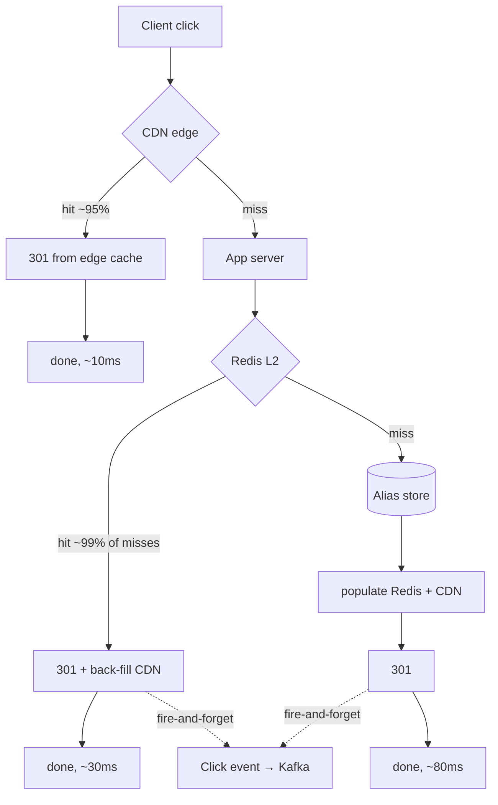
```mermaid
flowchart TB
    Client[Client click] --> CDN{CDN edge}
    CDN -->|hit ~95%| R301a[301 from edge cache]
    R301a --> Done1[done, ~10ms]
    CDN -->|miss| App[App server]
    App --> Redis{Redis L2}
    Redis -->|hit ~99% of misses| R301b[301 + back-fill CDN]
    R301b --> Done2[done, ~30ms]
    Redis -->|miss| DB[(Alias store)]
    DB --> Backfill[populate Redis + CDN]
    Backfill --> R301c[301]
    R301c --> Done3[done, ~80ms]
    R301b -.->|fire-and-forget| Click[Click event → Kafka]
    R301c -.->|fire-and-forget| Click
```

*[Source: hellointerview.com "Bitly" breakdown; ByteByteGo "URL Shortener" video]*

**Edge-compute alternative architecture.** Instead of just caching at the CDN, run the redirect logic itself at the edge — Cloudflare Workers, Lambda@Edge, or Fastly Compute. The flow becomes: client → edge worker → look up alias in an edge KV store (Workers KV, DynamoDB Global Tables) → 301 inline. Every redirect terminates at the closest PoP without ever touching the origin region; latency drops to single-digit ms globally. The trade-off is the edge KV is eventually-consistent vs the origin DB (writes propagate within seconds, not instantly), and you pay per-request edge-compute fees that can dwarf origin-server costs at scale. Best fit when the read:write ratio is very high (100k:1+) and global latency matters more than write-to-read consistency. *[Source: hellointerview.com "Bitly" breakdown — Cloudflare Workers / Lambda@Edge approach]*

**Counter-batch alias generation.** An alternative to Snowflake is a centralized 64-bit counter where each app server leases a *range* (e.g., 1000 IDs) at a time. Each lease is a single `INCRBY 1000` against a Redis counter; the server burns through its range locally before fetching the next. Saves coordination-per-request like Snowflake does, doesn't need machine-ID allocation, and the counter store sees `total_writes / 1000` ops instead of `total_writes`. Loss-on-crash of an unused range is acceptable (gaps in the alias space don't matter). *[Source: hellointerview.com — counter-batching technique]*

**Sequential vs hash partitioning — why the alias table partitions on `hash(alias)`.** Snowflake-derived aliases are time-sortable: `aaaaaaB` was created right after `aaaaaaA`. If you range-partition the alias table by alias, every new write lands on the most recent shard — that shard sees 100% of write traffic while the others sit idle. Hash-partitioning by alias spreads consecutive aliases uniformly across all shards, eliminating the write hotspot at the cost of giving up cheap range scans (which you don't need for this workload anyway).

**Auth on create.** Anonymous shorten is allowed by default (matches bit.ly/TinyURL UX) but heavily rate-limited per source IP and routed through the safety-check pipeline. Custom aliases require authentication — they're a finite namespace and a brand-abuse vector, so the cost of accountability (a logged-in user) is justified. High-volume API integrations (>1k/day) require an API key tied to an account; the key carries per-account quotas and billing. The trade-off: anonymous creation is the friction-free funnel for the product, but every anonymous link is a potential phishing vector, so the safety-check on submit is non-negotiable for that path.

#### Potential Follow-Up Questions
**Q: A URL goes viral — 100k req/s in two minutes. What breaks?**
Ideally nothing: CDN absorbs the spike since 301s are cacheable. Worst case the origin sees a thundering herd on cache miss. *If pushed:* request coalescing (single-flight) at the app layer so only one DB read per alias; pre-warm Redis when an alias crosses a click-rate threshold.

**Q: How do you prevent abuse — phishing links, malware redirects?**
URL submission goes through a safety check (Google Safe Browsing, internal blocklist) before the alias is issued. Periodic re-scan of stored URLs for newly flagged domains. *If pushed:* rate-limit shorten-API per user/IP; require auth for high-volume creators; "preview" page for suspicious destinations.

**Q: Custom aliases — how do you prevent collisions and squatting?**
Custom aliases live in the same table; insert with `IF NOT EXISTS`. Reserve dictionary words and brand names. Require auth for custom (rate limit + accountability). *If pushed:* per-user quotas on custom aliases; trademarked terms get an explicit allowlist with an appeal flow.

**Q: Why base62 instead of base64?**
Standard base64 has `+` and `/` which need URL-encoding. Base64url (RFC 4648, `-_` substitutes) fixes that, but its strings still carry `=` padding. Base62 (`0-9a-zA-Z`) needs neither — URL-safe, double-click-selectable, no padding. The length difference vs base64 is <1% per char, negligible at 7 chars. *If pushed:* drop ambiguous chars (`0/O`, `1/l`) for human-readable aliases — base58 (Bitcoin); slightly longer but copy-paste and read-aloud friendly.

**Q: How do you scale to 365B URLs?**
Hash-partition the alias table by `alias` so consecutive Snowflake-derived aliases scatter across all shards; range-partitioning by ID would put every new write on the most recent shard and create a sustained write hotspot. Cassandra or sharded Postgres both work — the key requirement is that the partition key is uniformly distributed, not the primary index ordering. *If pushed:* archive aliases unread for over a year to cold storage (S3 plus a lookup index) so the active working set on the hot tier stays small; the long tail of dormant aliases doesn't need to live on expensive NVMe.

**Q: What's the migration path if you outgrow the 7-char alias?**
Add an 8th char silently — old aliases keep working since the schema accepts variable length. Snowflake IDs already support it; base62 length grows naturally. *If pushed:* announce in advance; SDKs and analytics dashboards may have hard-coded length assumptions.

**Q: Where would you put the redirect logic — origin servers, CDN cache, or edge compute?**
CDN cache by default — 301s are static once written, fully cacheable, and the CDN's PoP network gives global low-latency for free. For the highest read:write ratios (100k:1+) where global p99 matters, push the lookup itself to edge compute (Cloudflare Workers + Workers KV) so origin is involved only on cache miss. *If pushed:* origin-only is fine for an internal short-link service — operational simplicity beats edge complexity when traffic is regional and modest.

**Q: 301 vs 302 — what does this *actually* cost in observed click counts?**
With 301, browsers and CDNs cache the redirect indefinitely; a user visits the link 10 times, your analytics see 1 hit (the first one). With 302, every click round-trips to your server. bit.ly defaults to 302 because the click data is the product. *If pushed:* a 301 with `Cache-Control: public, max-age=600` strikes a middle ground — repeat clicks within 10 minutes don't log, longer-spaced clicks do; tune the TTL against accuracy requirements.

**Q: How do you deactivate or delete a short URL given the CDN may have cached it?**
Two options: (1) wait for the cache TTL to expire (set TTL based on how often you expect to delete — 1hr is typical), or (2) issue a CDN purge for the alias key, which invalidates it across PoPs in seconds. Option 2 has a per-purge cost; reserve it for safety-critical takedowns (phishing, malware). *If pushed:* track deletion timestamps in the alias DB; on cache miss after deletion, return 410 Gone instead of 404 — clearer signal to clients and crawlers.

**Q: How do you batch-allocate IDs without a centralized counter being a SPOF?**
Each app server leases a 1000-ID range from Redis on startup and refills when its current range nears exhaustion. Redis runs in HA mode (Sentinel or Cluster); a Redis failover loses at most one in-flight lease (1000 unused IDs — gaps are harmless). *If pushed:* if Redis is also a SPOF risk, use Snowflake instead — pure local generation, no central counter to break.

#### Bottlenecks & Mitigations
- **Viral URL spike** — a viral link can go from 0 to 100k req/s in minutes; without caching, every click would slam the alias store on one shard. The CDN absorbs the spike (cached 301s are fully edge-servable), and pre-warming Redis when an alias crosses a click-rate threshold prevents the first viral wave from causing a cache miss stampede.
- **ID counter contention** — a centralised auto-increment counter becomes a write bottleneck above a few thousand inserts/sec. Snowflake (#4) generates IDs locally on each node with no coordination per call; alternatively, each node leases a range of 1000 IDs from a central counter and burns through them locally before fetching the next range.
- **Click write storm** — at 100k clicks/s, every click writing synchronously to the analytics warehouse would either crush the warehouse or block redirects. Fire-and-forget the click event onto Kafka; the analytics pipeline consumes asynchronously and drops on overload without affecting redirect availability.
- **DB hot shard** (sequential alias inserts) — Snowflake IDs are time-sortable, so naively partitioning the alias store by ID range puts every new write on the most recent shard. Partition by `hash(alias)` instead so consecutive inserts spread across all shards.
- **Custom alias squatting** — without controls, users can grab `/login`, `/admin`, brand names, or trademarked terms. Reserve a static dictionary of common words and brand-protected names, require authentication for custom aliases (so abusers are accountable), and rate-limit custom-alias creation per account.
- **CDN cache invalidation lag on takedowns** — a phishing or malware short link cached at the CDN keeps redirecting victims for the full TTL even after you delete the alias from origin. Issue an explicit CDN purge (Cloudflare/Fastly API) on takedown for safety-critical aliases, and tune the public default TTL down (e.g., 1hr instead of 24hr) so non-purged deletions still drain quickly.
- **Click event loss during analytics outage** — fire-and-forget click events go to Kafka, but a Kafka outage means lost clicks and silently degraded analytics. Buffer click events on the app server's local disk during broker outages (a small bounded ring buffer) and flush on recovery; never block the redirect on click-pipeline health.

#### Failure Modes

| Layer | Failure | Detection | Mitigation |
|---|---|---|---|
| Crash | Alias store primary unavailable | read errors on cache miss, write errors on shorten | replicas serve reads (RF=3); writes block until quorum recovers; CDN absorbs hot reads |
| Crash | Click event stream (Kafka) outage | broker connection failures from app servers | local ring buffer on each app server (bounded) buffers events; flush on recovery; never block redirects |
| Network | CDN-to-origin partition | edge cache hit rate stays high but origin sees zero new traffic | CDN serves from cache through partition (typical ~1hr TTL); origin reads served from secondary region's CDN |
| Correctness | Custom alias collision (squatting on `/login`) | collision rate spike in the alias store | reserved-word list at API layer; require auth for custom aliases; rate-limit per account |
| Correctness | Phishing/malware short-link still redirects after takedown | safety-pipeline flag flipped but cache stale | CDN purge API for safety-critical takedowns; track deletion ts in alias DB; return 410 Gone post-deletion |
| Resource | Viral URL hot-shard saturation | one shard CPU pegged, p99 redirect latency climbing | extra-replicate viral aliases; pre-warm Redis when click-rate crosses threshold; request coalescing on app server |
| Resource | Click write storm overwhelms warehouse | analytics-pipeline lag growing, broker backlog climbing | drop-on-overload at consumer side; analytics is best-effort, redirect availability is non-negotiable |
| Upstream | Safety-check API (Google Safe Browsing) down | shorten requests blocking on validator | bypass with stale safety verdict (cached); flag URLs for re-check on validator recovery; never block redirects |

#### Observability — Key Metrics & SLOs

- **`shortener.redirect_latency_p99`**: end-to-end client-observed redirect time — emitted from CDN logs + origin metrics — alert if > 50ms at edge or > 200ms at origin
- **`shortener.cdn_hit_rate`**: fraction of redirect requests served from CDN cache — emitted from CDN logs — alert if < 90% sustained (cache miss storm or invalidation bug)
- **`shortener.shorten_latency_p99`**: time to create a new short URL — emitted by shortener API — alert if > 200ms
- **`shortener.click_pipeline_lag_seconds`**: lag between click event and warehouse availability — emitted by analytics consumer — alert if > 60s sustained
- **`shortener.dlq_growth_rate`**: rate of click events landing in dead-letter (parsing errors, safety re-check failures) — emitted by consumer — alert on non-zero growth
- **`shortener.takedown_propagation_seconds`**: time from origin-flag-flip to CDN purge confirmation — emitted by takedown pipeline — alert if > 30s for safety-critical takedowns
- **SLOs:** redirect p99 50ms (edge), shorten p99 200ms, availability 99.99% on redirect (CDN absorbs origin outages within TTL), click-pipeline best-effort with 99.9% delivery target.

#### Multi-Region & DR

- **Replication mode:** active-active edge serving + active-passive origin DB — CDN PoPs serve every region from the closest edge cache; origin alias store is active-passive across two regions (writes go to primary, secondary tails async). Edge KV (Workers KV / DynamoDB Global Tables) is an alternative for fully-active-active reads.
- **RTO / RPO:** RTO 30s for redirect availability (CDN survives origin outages within TTL); RTO 5min for write availability (origin DB failover); RPO < 60s of pending writes lost on primary-DB failure (acceptable for shorten — a retry creates a new alias).
- **Failover trigger & cadence:** automatic origin failover on health-check fail; CDN failover is implicit (multi-PoP routing). Tested monthly via origin-DB primary-kill drill; quarterly via full-region origin isolation.
- **Cross-region cost trade-off:** edge-cache architecture cost is per-request CDN egress (~$0.01/GB) and edge-compute fees if using Workers; trade-off is global p99 of single-digit ms vs origin-only p99 of regional-RTT (50–200ms transcontinental). At read:write ratios above 100k:1, edge-compute pays for itself in latency and origin offload.

#### Common Mistakes / Anti-patterns

- **Synchronous click logging on the redirect path** — writing to the analytics warehouse before returning the 301 dominates latency and couples redirect availability to warehouse health. The senior answer fires-and-forgets onto Kafka and accepts at-least-once with dedup downstream.
- **Random alias generation with collision check** — a DB roundtrip per shorten makes the write path 10× slower; Snowflake-derived base62 has no collision possibility (Snowflake guarantees uniqueness) and skips the check entirely.
- **Range-partitioning the alias store by alias** — Snowflake-derived aliases are time-ordered, so range-partitioning puts every new write on the most recent shard. Hash-partitioning by alias spreads writes uniformly.
- **Defaulting to 301 because "it's faster"** — 301s are CDN-cacheable but lose repeat-visit analytics; bit.ly defaults to 302 because click data is the product. The right answer states the trade-off and picks based on whether analytics is a feature.
- **Conflating CDN cache TTL with deletion latency** — saying "we'll just delete from the DB" without addressing the cached 301s at the edge means takedowns stay visible for hours. Senior answer: explicit CDN purge API for safety-critical takedowns, lower default TTL for non-critical.
- **Not handling viral URLs explicitly** — saying "we have a CDN" handles steady-state but not the cache miss stampede when a viral URL is first accessed. Request coalescing on the app server (single-flight per alias) and pre-warming on click-rate threshold are the explicit hot-key answers.

#### Talking Points for the Interview

- **The read:write ratio is the architecture** — 100:1 means the redirect path is 99% of the engineering surface; candidates who balance write and read complexity equally miss the asymmetry.
- **Snowflake + base62 + hash-partition is the production-grade combination** — naming all three together signals you've seen this design in practice, not just read about it.
- **Click write must be fire-and-forget** — surface this proactively; coupling redirect availability to analytics health is the most common junior mistake.
- **301 vs 302 is a product decision dressed up as HTTP** — explaining bit.ly's choice (302 for analytics) shows you understand why "faster" isn't the only criterion.
- **Edge compute is the asymptote of this architecture** — Cloudflare Workers + Workers KV puts the redirect at the closest PoP globally, and at high read:write ratios it pays for itself; mentioning it shows currency.
- **Phishing safety is non-optional, not a feature** — every public URL shortener is a phishing vector; safety-check on submit and CDN-purge on takedown are non-negotiable, and surfacing them signals product maturity.
- **The event stream is the analytics SLA boundary** — shorten and redirect have hard SLAs; clicks are best-effort. Saying this explicitly defines what the system promises and what it doesn't.

### 6. Design a Web Crawler
#### Problem
Systematically download, parse, and index web pages at scale, discovering new URLs as you go.

#### Summary
**The picture in your head:** a team of librarians who have been given one seed bookshelf. Each librarian picks a book, reads it, writes down every other book it mentions, adds those titles to a shared "books to read" pile, then puts the finished book on the archive shelf. The pile grows as they work. The trick: the pile has to be organized smartly — some books are more important than others, some authors ask you not to visit too often, and some books are identical to ones you already read even though they have different titles.

**The single-request walkthrough:** the crawler starts with `https://en.wikipedia.org/wiki/Systems_design`. A worker fetches the page (one HTTP GET), receives 200KB of HTML, and hands it to a parser. The parser finds 300 outbound links. For each link, the crawler checks: have we seen this URL before? It hashes the URL and asks a Bloom filter (a compact data structure that can say "definitely not seen" or "probably seen" using just 12GB for 10 billion URLs). If the Bloom filter says "probably seen," skip it. If "definitely not seen," add it to the frontier — the queue of URLs waiting to be fetched — with a priority based on the site's authority and the page's freshness. Before fetching the next URL on `wikipedia.org`, the crawler checks how long ago it last fetched from that domain and waits if needed (politeness delay). The page's content goes to object storage; click-through links ripple forward.

**The pieces (and what each one is for):**
- **URL Frontier** — the queue of URLs waiting to be fetched. Not one flat queue but two tiers. Front queues handle priority (high-authority domains and frequently-changing pages go first). Back queues handle politeness (one queue per domain, with a timestamp for when that domain can next be fetched). A worker always picks from a back queue whose next-fetch time has elapsed — this naturally paces to one request per second per domain without any global lock.
- **Bloom filter for URL dedup** — a Bloom filter is a fixed-size bit array. Adding a URL flips a few bits. Checking a URL asks whether those bits are all set. False positives (saying "seen" for a URL not actually seen) are possible at ~1%; false negatives (saying "not seen" for a URL already crawled) are impossible. At 10 billion URLs and 1% false-positive rate, the whole structure fits in 12GB of RAM. Without it, you would need a full hash table of all crawled URLs, which would be much larger.
- **Fetcher fleet** — workers that actually issue HTTP requests. Each worker uses async I/O (an event loop rather than one OS thread per request) so a single CPU core can track thousands of in-flight connections simultaneously — most of the time is just waiting for the remote server to respond.
- **HTML parser** — extracts text content and outbound links from the fetched HTML.
- **Content dedup (SimHash)** — many pages are near-duplicates (different URLs, same boilerplate text with one word changed). SimHash is an algorithm that produces a short fingerprint (a 64-bit integer) such that similar pages have similar fingerprints. Comparing fingerprints with Hamming distance (number of differing bits) catches near-duplicates without comparing full page content.
- **Robots.txt cache** — every website publishes a file at `/robots.txt` specifying which paths crawlers may and may not visit, and the minimum delay between visits (`Crawl-Delay`). The crawler fetches this file once per domain and caches it. Ignoring robots.txt is legally risky and gets your IP range banned.

**The thing that makes it hard:** spider traps. Some sites generate infinite URLs: a calendar app might produce `/calendar?date=2026-01-01`, `/calendar?date=2026-01-02`, ..., `/calendar?date=2099-12-31`. Every page has the same boilerplate with one date changed. The crawler keeps discovering "new" URLs and enqueues them forever — the frontier grows without bound, the crawl never finishes, and the archive fills with garbage. The URL dedup catches exact duplicates. The content dedup (SimHash) catches near-duplicates. But the trap produces legitimately different URLs with near-identical content — both filters help. Additionally: cap how deep you go into any one site, and track the novelty rate per domain (if 99% of URLs from a domain are unique but all nearly identical in content, stop).

**Why the standard solution works:** the two-tier frontier (priority queues + per-domain back queues) decouples "what is most important" from "when am I allowed to visit this site." This is the Mercator design from 1999 and it is still the canonical architecture. It lets a thousand-worker fleet crawl thousands of domains in parallel while never exceeding one request per second per domain — without any global lock or centralized scheduler.

**If you were building it tomorrow:**
- Frontier: Redis sorted sets per domain for the back queues, min-heap on next-fetch-time. Kafka for inter-shard URL hand-off (shard the whole crawler by `hash(domain)` so politeness state stays local).
- Bloom filter: a 12GB in-process structure (use the `bloom` library backed by mmap) sharded per crawler node; RocksDB as ground truth for confirmed-seen URLs.
- Fetcher: Python `aiohttp` or Go's `net/http` with connection pooling, 10-second timeout per fetch:
  ```
  async def fetch(url, domain_pool):
    robots = await get_robots(url.domain)
    if robots.disallows(url.path): skip
    await wait_for_politeness(url.domain)
    resp = await domain_pool.get(url, timeout=10s)
    return parse(resp.html), extract_links(resp.html)
  ```
- DNS: in-process resolver with 1-hour TTL cache — uncached DNS at 50ms per lookup otherwise dominates wall time at 1000 fetches/second.
#### Clarifying Questions
- HTML only or also images/JS-rendered SPAs?
- Politeness rules (per-domain QPS)?
- How fresh? (revisit cadence per page)
- Storage destination (search index, archive, ML training set)?
- Respect robots.txt and meta noindex?

#### Requirements
- **FR:** seed URLs → fetch → parse → extract links → enqueue → store; respect robots.txt; dedupe content
- **NFR:** billions of pages; per-domain politeness; resumable; extensible (new content types)

#### Scale Estimate
- **Throughput 1B pages/month → ~400/s steady, ~2k/s peak:** mid-tier search/archive crawler (Common Crawl is ~3B/month; Google-tier is much larger). 10⁹ ÷ (30 × 86,400) = 386 ≈ 400 pages/s avg. 5× peak during catch-up windows = ~2k/s.
- **Avg page 100KB raw, ~20KB gzipped:** Web's median HTML page is 50–150KB inflated (per HTTP Archive); use 100KB. gzip on HTML compresses ~5× → ~20KB.
- **Archive volume ~100TB/mo raw, ~20TB/mo compressed:** 10⁹ pages × 100KB = 10¹⁴ B = 100 TB/month raw; × 1/5 = 20 TB/month compressed object-store footprint.
- **URL frontier ~10B known, ~100M queued:** known set grows roughly with web's discoverable surface (~50–500B URLs total, but you crawl ~10B in active rotation). Queue depth = ~1 day of pending work at 400/s × 86,400 × 250d backlog cap ≈ 100M.
- **Bloom filter ~12 GB:** sized for 10¹⁰ keys at <1% FPR. Bloom rule of thumb: ~10 bits/key for 1% FPR (1.44 × log₂(1/p)). 10¹⁰ × 10 bits = 10¹¹ bits = 1.25 × 10¹⁰ B ≈ 12 GB RAM. Sharded across ~256 workers → ~50MB/shard.
- **URL→first_seen index ~240GB:** 10¹⁰ × (16B url_hash + 8B ts) = 2.4 × 10¹¹ B = 240 GB on embedded KV (RocksDB/LMDB), sharded across fetcher fleet → ~1GB/node on a 256-node fleet.
- **Page metadata ~1 TB/yr:** per-page row = url_hash (16B) + fetched_ts (8B) + http_status (2B) + content_hash (16B) + simhash (8B) + framing (~30B) ≈ 80B. 10⁹/mo × 80B = 8 × 10¹⁰ B = 80 GB/month → ~1 TB/yr.
- **Politeness state ~200 GB:** ~10⁸ unique registrable domains on the open web (per zone-file & passive-DNS surveys; exceeds Verisign's ~360M apex .com but counts subdomains in active rotation). Per-domain blob = `next_fetch_time` (8B) + `crawl_delay` (4B) + serialised robots rules (~2KB avg, common case ~500B with long-tail outliers) ≈ 2KB. 10⁸ × 2KB = 2 × 10¹¹ B = 200 GB across per-domain queue tier.
- **Hot tier ~100 GB aggregate:** Bloom (12GB) + DNS cache (~5GB for ~10⁸ domain→IP, 50B/entry) + robots cache (~50GB for hot ~10⁷ domains × ~2KB) + in-flight per-domain queue heads (~30GB) ≈ 100 GB across fetcher pool.
- **Cold tier ~240 TB/yr:** 20TB/month compressed × 12 = 240 TB/yr in object store; lifecycle policy → glacial after 90d for archive corpora. Page-content search index is rebuildable from this archive if lost.

#### API Contract
Internal pipeline. Job submission:
```
enqueue(url, priority, depth)
get_status(crawl_id) → {pages_done, errors, last_url}
```

#### High-Level Design
```
        ┌──────────────┐
        │ URL Frontier │ (priority queues, per-domain)
        └──────┬───────┘
               ↓
       ┌───────────────┐
       │ Fetcher Pool  │──→ DNS Cache
       └───────┬───────┘
               ↓
       ┌───────────────┐
       │ HTML Parser   │
       └───────┬───────┘
               ↓
       ┌─────────────────┐       ┌────────────────────────┐
       │ Content Filter  │──────→│ URL Seen?              │
       │ (SimHash dedup) │       │ (Bloom + embedded KV)  │
       └────────┬────────┘       └──────┬─────────────────┘
                ↓                       │ new URLs
       ┌───────────────┐                ↓
       │  Page Archive │          back to Frontier
       │  (Object      │
       │   Store)      │
       └───────────────┘
```

**How to read the diagram:** the crawler is a loop, not a one-shot job. The frontier decides what URL is fetched next, workers download and parse pages, and the newly discovered links are pushed back into the frontier so the crawl can keep expanding.

**Why the flow is shaped this way:** the expensive part is not storing HTML, it is deciding what to fetch next without getting trapped in duplicates, loops, or impolite behavior. That is why URL dedup, content dedup, and per-domain scheduling sit in the middle of the architecture instead of being bolt-ons.

**What this layout buys you:** high concurrency, controlled crawl behavior, and the ability to keep discovering new content forever. The tradeoff is that the frontier logic becomes the real brain of the system.

#### Data Model
- **URL Frontier:** priority queue per (domain), front sorted by `next_fetch_time`
- **URL Seen** (Bloom filter + embedded key-value store): hash(url) → first_seen_ts
- **Content Seen** (in-memory KV cache): SimHash → page_id
- **Pages** (object store): key = hash(url), value = (html, headers, ts)
- **Robots cache** (in-memory KV cache): domain → parsed rules + crawl_delay

#### Detailed Design
**Politeness:**
- Per-domain queue; domain unlocked only after `crawl_delay` seconds since last fetch. Each domain has its own little FIFO of pending URLs and a `next_fetch_time` timestamp; workers pick whichever domain's `next_fetch_time` has elapsed and pull the head URL. This naturally caps per-domain QPS without any global coordination — at 1 req/s per domain across 10k active domains, the fleet sustains 10k pages/sec.
- Token bucket per domain (default 1 req/s, override per `robots.txt Crawl-Delay`). The token bucket gives a small burst tolerance for paged content (a domain with crawl_delay=1 can serve 5 quick pages and then idle 5 seconds), which is gentler on the target server than rigid 1Hz pacing. If `robots.txt` specifies `Crawl-Delay: 10`, the bucket refill rate drops to 0.1 tokens/sec for that domain — the crawler respects whatever the site operator declares.

**Dedup:**

| Check | Tool | Why |
|---|---|---|
| URL seen | Bloom filter (RAM) → RocksDB confirm | 99% rejected at Bloom, no DB hit |
| Exact content | MD5(content) | catches pure mirrors |
| Near-dup content | SimHash + hamming distance < 3 | catches boilerplate variants |

**Strategy:** BFS (level-by-level) — fairness, predictable depth. BFS visits all URLs at depth N before any at depth N+1, which spreads the crawl across many domains and bounds how deep into any single site you go before hearing from others. DFS would dive deep into one site first — risky because spider traps are infinite-depth structures and DFS doesn't escape them naturally.

**Fetch optimization:**
- Async I/O (one thread → 1000s of concurrent fetches). A crawler spends ~99% of wall-clock waiting on the network; threads-per-fetch wastes thousands of OS thread stacks just to sleep on `recv()`. An async event loop (epoll/kqueue) lets one thread track thousands of in-flight TCP sockets and only wake when a response arrives — typical fetcher worker handles 1000+ concurrent fetches on a single core.
- DNS cache (DNS resolution is shockingly slow — 50ms+). Default OS DNS does a fresh UDP roundtrip per lookup and many systems are configured with no caching. At 1k fetches/sec, that's 50% of total wall-clock spent in DNS unless cached. Run an in-process resolver with a TTL cache (~1hr) so repeat lookups are sub-microsecond.
- Persistent connections (HTTP keep-alive) per domain. Opening a TCP+TLS connection costs 2–4 RTTs (~100–500ms); reusing the same connection for the next page on the same domain skips this entirely. Maintain a small pool per domain (3–5 connections) — bounded so you don't accidentally DOS them.

**URL lifecycle — state machine.** Every URL the crawler knows about transitions through a small set of states. Making the states explicit lets you reason about retry, dedup, and recovery uniformly.

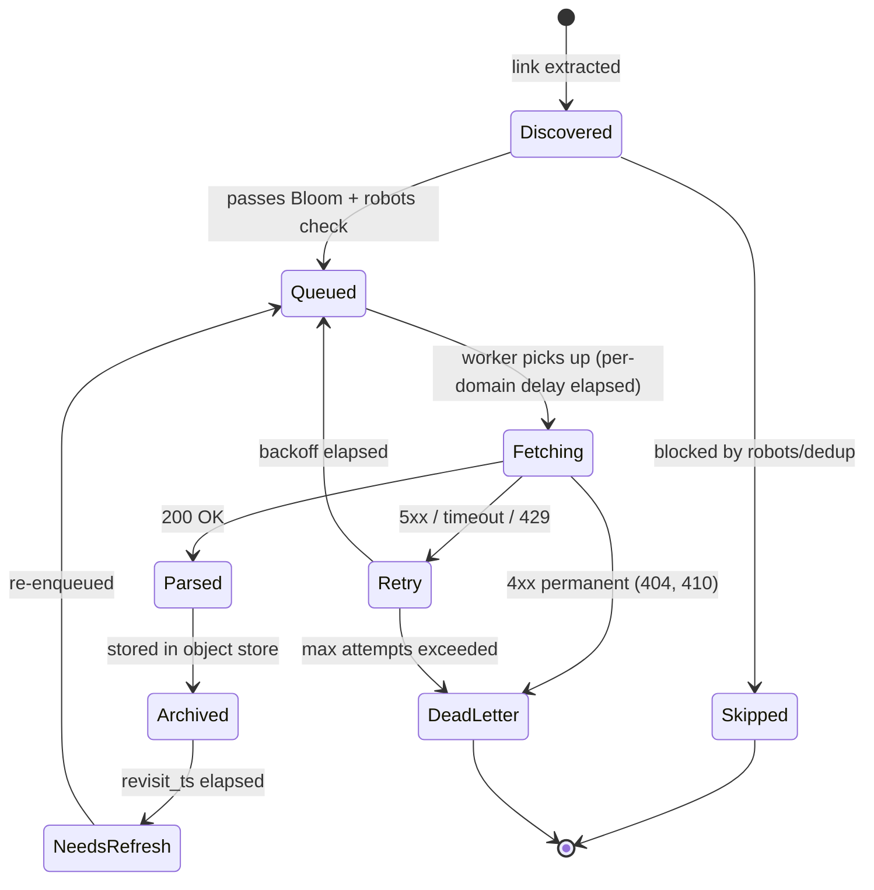
```mermaid
stateDiagram-v2
    [*] --> Discovered: link extracted
    Discovered --> Queued: passes Bloom + robots check
    Discovered --> Skipped: blocked by robots/dedup
    Queued --> Fetching: worker picks up (per-domain delay elapsed)
    Fetching --> Parsed: 200 OK
    Fetching --> Retry: 5xx / timeout / 429
    Fetching --> DeadLetter: 4xx permanent (404, 410)
    Retry --> Queued: backoff elapsed
    Retry --> DeadLetter: max attempts exceeded
    Parsed --> Archived: stored in object store
    Archived --> NeedsRefresh: revisit_ts elapsed
    NeedsRefresh --> Queued: re-enqueued
    Skipped --> [*]
    DeadLetter --> [*]
```

*[Source: hellointerview.com "Web Crawler" — SQS visibility-timeout-driven retry; Mercator paper §3 frontier states]*

**Mercator-style two-tier frontier.** Production crawlers (the canonical Mercator design from Heydon & Najork 1999, still the architectural model for modern crawlers) split the URL frontier into two tiers. *Front queues* implement priority: F=10 or so queues, each tagged with a priority level; high-quality / fast-changing URLs land in higher-priority front queues, low-priority ones in lower. *Back queues* implement politeness: B back queues (rule of thumb: B = 3× crawler thread count), each holding URLs from exactly one host. A heap maintains, for each back queue, the earliest time the host can be contacted again; the crawler thread always pops the queue whose contact-time has elapsed. Routing is: priority router selects a front queue weighted by priority, then maps the URL to its host's back queue. This gives both prioritization and politeness in one structure without ad-hoc per-URL scheduling. *[Source: Mercator paper (1999); Stanford IR Book §20.2 "The URL frontier"]*

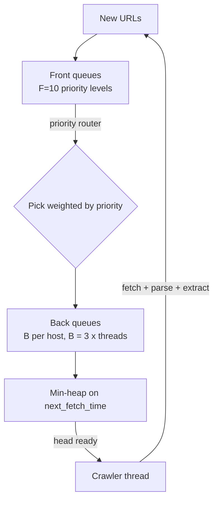
```mermaid
flowchart TB
    Disc[New URLs] --> Front[Front queues<br/>F=10 priority levels]
    Front -->|priority router| Sel{Pick weighted by priority}
    Sel --> Back[Back queues<br/>B per host, B = 3 x threads]
    Back --> Heap[Min-heap on next_fetch_time]
    Heap -->|head ready| Worker[Crawler thread]
    Worker -->|fetch + parse + extract| Disc
```

**Priority signals — what actually feeds the priority router.** Static signals: domain authority (PageRank-like score), historical change rate (news domain → high; archive → low), content quality (length, link-density, Boilerpipe score). Dynamic signals: HTTP `Last-Modified` / `ETag` (skip unchanged pages cheaply), `429`/`5xx` history (back off domains being defensive), revisit-overdue-ness for freshness. Combining as a weighted score lets one front-queue selection both freshen high-value content and discover new low-frequency content without separate codepaths.

**Distributed crawl coordination.** At billion-page scale, a single fetcher pool and a single frontier don't fit. Shard the frontier by `hash(domain)`: each shard owns a subset of domains and runs its own per-domain queues, so cross-shard coordination is unnecessary for politeness. URL discovery is the only inter-shard hop — when shard A parses a page and finds a link to a domain owned by shard B, it routes the URL there via a partitioned message bus (Kafka). The Bloom filter for "URL seen" is also sharded by `hash(domain)`, so dedup queries are local to the shard that owns the URL. *[Source: Mercator paper; hellointerview.com staged-pipeline architecture]*

**Robots.txt and meta noindex compliance.** Two layers of "don't crawl/don't index" signals: `robots.txt` (per-domain, fetched and cached at first contact, governs whether to fetch URLs at all) and the page-level `<meta name="robots" content="noindex">` / `X-Robots-Tag` HTTP header (governs whether to *index* the fetched content). The fetcher honours `robots.txt` at queue time — disallowed paths never enter the per-domain queue. The parser honours `noindex` at extract time — the page is fetched (already paid the cost) but excluded from the search index and not surfaced in downstream products; outbound links from a `noindex` page are still followed unless `nofollow` is also present. Compliance is non-negotiable for public-web crawls; ignoring these signals invites legal action and IP-level bans across the web.

#### Potential Follow-Up Questions
**Q: How do you detect and escape a spider trap?**
Cap depth per domain, blocklist URL patterns (regex on session IDs, calendar paths). Track "novelty rate" per domain — if 99% of pages from a domain are unique low-value content, throttle or stop. *If pushed:* SimHash content dedup catches "different URL, same content" traps the URL filter misses.

**Q: A worker crashes mid-fetch — how do you not lose the URL?**
Frontier uses a durable queue (Kafka or persistent Redis); URL is only removed after the page is committed to object store. In-flight URLs have a visibility timeout — re-queued if not acked. *If pushed:* idempotent fetch (URL hash dedup at write) so a retry doesn't double-store; checkpoint progress per worker for resumability.

**Q: How do you stay polite without starving the crawl?**
Per-domain token bucket (default 1 req/s, override per `robots.txt Crawl-Delay`). Worker pool picks domains whose next-fetch-time has elapsed — many domains in parallel, one request at a time per domain. *If pushed:* adaptive politeness — back off if a domain returns 429 or 5xx; resume slowly.

**Q: How do you handle JS-rendered SPAs?**
Default fetcher is HTTP-only (cheap, fast). For high-value domains where most content is JS-rendered, route to a headless browser pool (Puppeteer/Playwright) — ~10× the cost. *If pushed:* prerender service (server-side render once, cache HTML); detect rendering need by content size or `<script src>` density.

**Q: What's the dedup tradeoff with Bloom filters?**
Bloom filters can false-positive — they may say "already seen" for a URL that has never been seen — and the consequence is that a small fraction of new URLs are skipped and never fetched. Tune the bit-width for <1% FPR so the loss rate stays below the natural redundancy of the link graph (most pages are linked from many others, so a missed URL is usually rediscovered). *If pushed:* counting Bloom or Cuckoo filters support deletions if you need to evict stale entries, and for high-value corpora a periodic rebuild from the RocksDB ground truth bounds drift over long crawl runs.

**Q: How do you re-crawl for freshness?**
Each URL gets a `next_revisit_ts` based on observed change rate (news domain: hourly; archive: yearly). Frontier prioritizes overdue revisits. *If pushed:* adaptive recrawl using HTTP `Last-Modified` / `ETag` to skip unchanged pages cheaply; ML model on change-rate prediction for high-value sites.

**Q: Walk me through the Mercator front-queue / back-queue design.**
Front queues implement *priority* (one queue per priority level, higher priority popped more often); back queues implement *politeness* (one queue per host, each with a "next contactable" timestamp on a min-heap). New URLs are routed: priority router picks a front queue, then host-router maps to the back queue for that host. Workers pull from whichever back queue is at the heap root. Decouples "what to fetch next" (priority) from "when can I fetch from this host" (politeness). *If pushed:* Mercator recommended `B = 3 × thread_count` to keep workers saturated without over-fanning hosts.

**Q: How do you shard the crawler across many machines without coordination thrashing?**
Hash-shard by domain: each fetcher owns a subset of domains and runs its own per-domain politeness queues + its own Bloom filter slice. Inter-shard traffic is bounded to URL hand-off when one shard's parser finds a link belonging to another shard's domain — flows over Kafka or similar. No global lock, no global Bloom merge. *If pushed:* a few mega-domains (Wikipedia, YouTube) might overload a single shard; rebalance by domain weight, or sub-shard the largest by `hash(domain + path_prefix)`.

**Q: A worker on a sharded crawler crashes — how does the URL not get lost?**
SQS-style visibility timeout: when a worker receives a URL, the queue hides it for N seconds; the worker explicitly deletes only after the page is committed to object store. A crash means the visibility timeout expires and the URL becomes visible to other workers. Retries are bounded by `ApproximateReceiveCount` — past 5 attempts, the message goes to a dead-letter queue. *If pushed:* idempotent fetch keyed on URL hash means a re-fetched URL doesn't duplicate-store; checkpoint progress per worker for resumable bulk crawls.

**Q: How do you prioritize a brand-new URL with no history?**
Inherit priority from the parent page that linked to it (a high-priority page's outlinks are likely high-value too) and from the domain's average score. After first fetch, observed signals (change rate, content length, link count) refine the priority for next visit. *If pushed:* cold-start with a small "discovery quota" front queue that always gets some throughput, so unrecognized domains get tried at least once.

#### Bottlenecks & Mitigations
- **DNS bottleneck** — uncached DNS at ~50ms/lookup dominates wall time when fetching at scale; the network call to the page itself becomes a small fraction of latency. An in-process DNS cache with hour-scale TTL plus an async resolver eliminates the problem; warm cache hits are sub-microsecond.
- **Spider traps** (infinite calendar URLs) — sites generate effectively infinite URLs from query parameters or session IDs (`/calendar?date=2050-01-01` and so on). Without bounds, the frontier grows without limit and the crawl wastes budget on garbage. Cap depth per domain, blocklist URL patterns matching session-ID and pagination explosions, and drop domains where novelty rate is suspiciously high.
- **Slow domains stall workers** — a domain that takes 30s to respond will tie up a fetcher slot for 30s if you let it, starving fast domains. Set aggressive per-fetch timeouts (10s) and a per-domain in-flight quota so any one slow site can't monopolise the worker pool.
- **Bloom false positive** (rare URL skipped) — Bloom can return "seen" for a URL it has never seen, with probability ~1% at the chosen sizing, meaning a small fraction of URLs are wrongly skipped. The two-tier design (Bloom → RocksDB confirm on positive hit) makes false positives recoverable: if Bloom says yes, RocksDB is consulted; only if RocksDB also confirms is the URL skipped. False negatives are impossible by Bloom's construction.
- **JS-rendered pages** — modern SPAs return ~empty HTML and load content via JS, so the HTTP fetcher sees no useful content. Routing all pages through a headless browser is ~10× the cost; instead, only escalate to the browser farm for high-value domains where most content is JS-rendered, leaving cheap HTTP fetch for the long tail.
- **Mega-domain shard imbalance** — Wikipedia, YouTube, GitHub each have hundreds of millions of URLs; hash-sharding by domain dumps the entire load on one shard. Detect oversized domains at a daily rebalance pass and sub-shard them by `hash(domain + path_prefix)` so a single mega-domain spreads across multiple workers without breaking per-domain politeness (still serialised on the (domain, path-shard) key).
- **Adversarial robots.txt and Crawl-Delay** — some sites declare `Crawl-Delay: 86400` (one request per day) to discourage crawling; respecting it stalls the crawl, ignoring it gets you banned. Treat very large `Crawl-Delay` values as a soft "deprioritize" signal rather than literal compliance — drop the domain to the lowest-priority front queue rather than waiting a full day per page; for compliance-bound corpora (like web archives), respect the literal value and accept the slow rate.
- **Synchronized retry stampede on transient 5xx** — a domain that returns 503 across the fleet has every shard's worker retrying at the same intervals, hammering it. Add jitter to retry timing (`backoff = base × 2^n × random(0.5, 1.5)`) so retries spread; consider a domain-level circuit breaker that pauses *all* fetches to that domain for several minutes once 5xx-rate crosses a threshold.

#### Failure Modes

| Layer | Failure | Detection | Mitigation |
|---|---|---|---|
| Crash | Fetcher worker dies mid-fetch | URL visibility timeout expires unacked | durable queue (Kafka/SQS) re-delivers to another worker; idempotent fetch keyed on URL hash prevents double-store |
| Crash | Frontier shard primary lost | shard ops failing on a hash range | shard replication (Kafka topic replication); secondary promoted; pending visibility timeouts force re-delivery |
| Network | DNS resolver flakiness | DNS cache miss latency spike | hour-scale DNS TTL cache; fallback to secondary resolver; circuit-break on per-domain DNS failure |
| Correctness | Spider trap (infinite calendar URLs) | per-domain novelty rate at 99%+ on new URLs forever | depth cap per domain; URL pattern blocklist; novelty-rate ceiling triggers domain throttle/stop |
| Correctness | Bloom false positive skips a real new URL | offline audit comparing Bloom vs RocksDB ground truth | tune FPR < 1%; periodic Bloom rebuild from RocksDB; rely on link-graph redundancy for missed URLs to be rediscovered |
| Resource | Mega-domain (Wikipedia) saturates one shard | per-shard URL count grossly imbalanced | sub-shard mega-domains by `hash(domain + path_prefix)`; daily rebalance pass detects skew |
| Resource | Slow domain holds fetcher slot for 30s | per-fetcher in-flight time histogram skewed | aggressive per-fetch timeout (10s); per-domain in-flight quota caps slow-site impact |
| Upstream | Target site bans crawler IPs (rate-limit retaliation) | sustained 403/429 from a domain | adaptive politeness (exponential delay); domain-level circuit breaker; rotate egress IPs as last resort if ToS-permitted |

#### Observability — Key Metrics & SLOs

- **`crawler.fetch_throughput_pages_s`**: pages successfully fetched and parsed per second — emitted by parser stage — alert if < 50% of target for 15min
- **`crawler.dns_cache_hit_rate`**: fraction of fetches served from local DNS cache — emitted by fetcher — alert if < 95% (cache TTL or sizing issue)
- **`crawler.per_domain_qps_violations`**: count of fetches exceeding per-domain crawl-delay — emitted by politeness scheduler — alert if > 0 (politeness bug, will trigger bans)
- **`crawler.bloom_false_positive_estimated`**: sampled FPR from Bloom-vs-RocksDB audits — emitted by audit pipeline — alert if > 2× target FPR
- **`crawler.frontier_depth`**: queued URLs across all shards — emitted by frontier — alert if depth growing > 50%/day (parser/fetcher backlog)
- **`crawler.5xx_rate_per_domain`**: rolling 5xx rate per domain — emitted by fetcher — circuit-break domain when > 30% for 5min
- **SLOs:** target throughput sustained 95% of weekly window, fetch p95 latency < 5s (network-bound), zero per-domain politeness violations (hard SLO — banning is permanent reputation damage).

#### Multi-Region & DR

- **Replication mode:** regional-isolation by default — each region runs its own crawler fleet against its own frontier shard subset (often partitioned by domain TLD or region for legal compliance, e.g., EU domains crawled from EU). Active-active is unusual because per-domain politeness is stronger when one shard owns each domain.
- **RTO / RPO:** RTO 5min for fetcher fleet recovery (workers stateless, frontier shard durable); RTO 30min for frontier shard primary loss (Kafka replication failover). RPO < 1 visibility-timeout window for in-flight URLs (re-delivered automatically).
- **Failover trigger & cadence:** automatic on health-check failure of a shard primary; tested monthly via shard-kill drill. Frontier rebuild from durable storage is an annual DR exercise (full restore from object-store-archived URL graph).
- **Cross-region cost trade-off:** regional fleets cost zero cross-region bandwidth for crawl traffic; the small inter-shard hop (URL-discovery routing) is bounded to discovered-link forwarding (~5% of total bytes). Geo-distributing the crawler also distributes egress IPs, which is helpful for politeness (target sites see crawler load distributed across IPs) but increases legal complexity (jurisdiction-specific compliance with different robots.txt interpretations).

#### Common Mistakes / Anti-patterns

- **DFS as the default crawl strategy** — DFS dives deep into one site first and is trivially defeated by spider traps (infinite-depth structures); BFS spreads the crawl across many domains and naturally bounds per-site depth.
- **Treating dedup as a single-tier problem** — saying "we hash URLs in a set" works at small scale but fails at billion-URL scale where the set doesn't fit in RAM. The two-tier (Bloom + RocksDB) design is the production answer; candidates who name only one tier underspec.
- **Synchronous DNS in the fetch loop** — uncached DNS at 50ms/lookup dominates wall time at scale; candidates who don't surface a DNS cache reveal they haven't built a real crawler.
- **Ignoring robots.txt or treating it as advisory** — robots.txt compliance is the legal floor for public-web crawling; ignoring it invites legal action and IP-level bans across the web. Senior answer: robots.txt enforced at queue time, `<meta name="robots">` enforced at index time.
- **One-thread-per-fetch concurrency** — wastes thousands of OS thread stacks on `recv()` waits; async I/O (epoll/kqueue) with 1000+ in-flight per thread is the only viable model at billion-page scale.
- **Naive sharding by URL** — hashing on the full URL spreads URLs from the same domain across all shards, which makes per-domain politeness a global coordination problem. Sharding by domain instead keeps politeness state local to one shard.

#### Talking Points for the Interview

- **The frontier is two things in one structure** — front queues for priority, back queues for politeness; naming the Mercator design shows you've read the canonical paper.
- **DNS is the silent killer** — explicitly surfacing this is a senior tell because it's not in the textbook architecture but dominates real performance.
- **Bloom + RocksDB confirms is the production pattern** — cite the FPR (~1%) and explain why false positives are recoverable (link-graph redundancy) rather than catastrophic.
- **Politeness is a legal/reputational requirement, not just performance** — framing per-domain rate limits as "we don't get banned across the web" rather than "we don't overload the target" reads as production-savvy.
- **JS-rendered pages are a 10× cost question, not a yes/no question** — escalating to a headless browser pool only for high-value domains where most content is JS-rendered shows cost-aware design.
- **Sharded Bloom + sharded frontier means inter-shard coordination is bounded to URL hand-off** — this is the architectural insight that makes billion-page crawls tractable.
- **Adversarial robots.txt (`Crawl-Delay: 86400`) is a soft signal** — naming this trade-off (deprioritize vs literal compliance) shows you've grappled with the real edge cases, not just the happy path.

### 7. Design a Notification System
#### Problem
Reliably deliver push, email, and SMS notifications to users at scale, respecting preferences and avoiding duplicates.

#### Summary
**The picture in your head:** a sorting facility at a post office. Mail arrives at one receiving desk (the ingestion service). A clerk checks whether this letter is a duplicate (idempotency check), then routes it to the right bin: one bin for packages going via FedEx (push notifications), one bin for letters going via USPS (email), one bin for telegrams going via Western Union (SMS). Each bin has its own delivery crew. If FedEx has a truck breakdown, letters and telegrams keep flowing. The receiving desk never handles deliveries directly.

**The single-request walkthrough:** a service calls `POST /notify` with `user_id=42`, `template=order_shipped`, `channels=[push, email]`, `idempotency_key=order-7829-shipped`. The ingestion service checks a Redis cache: has `(user_42, order-7829-shipped)` been seen in the last 24 hours? No. It checks user 42's preferences: push is enabled, email is enabled, quiet hours are not active. It writes the notification to the database and to an outbox row in the same transaction (the outbox is a holding table — it ensures the message gets to the queue even if the server crashes between "write to DB" and "put on queue"). A publisher process picks up the outbox row and puts one message on the push Kafka topic and one on the email Kafka topic. Push workers drain the push topic and call APNs (Apple's push server) and FCM (Google's push server). Email workers drain the email topic and call SES (Amazon's email relay). Each worker writes the delivery status back to the status store.

**The pieces (and what each one is for):**
- **Ingestion service** — the single entry point. Validates, checks idempotency, checks user preferences, routes to channels. Does not deliver anything itself.
- **Idempotency key + Redis cache** — a client-supplied string (like `order-7829-shipped`) that identifies a specific logical notification. The ingestion service caches `(user_id, key) → notification_id` for 24 hours. If the same request arrives twice (client retried on a network timeout), the second call returns the original ID and does not re-send. Without this, every client retry creates a duplicate notification.
- **Per-channel Kafka topics** — separate queues for push, email, and SMS. If APNs is down for 30 minutes, the push topic backs up while email and SMS drain normally. A single shared queue would mean APNs problems block email and SMS too — "head-of-line blocking."
- **APNs / FCM / SES / Twilio** — external providers that actually deliver to devices and inboxes. Each has different rate limits, different error codes, and different failure modes. APNs and FCM accept push via HTTP/2. SES accepts email via SMTP. Twilio accepts SMS via HTTP and posts delivery confirmation back to a webhook.
- **Dead-letter queue (DLQ)** — after 4 retry attempts (at 30 seconds, 5 minutes, 1 hour, then permanent failure), a message goes to the DLQ. A human or automated process reviews what happened. The alternative — retrying forever — wastes budget on permanently-invalid tokens and masked bugs.
- **Status store** — a wide-column database keyed by `notification_id`, tracking each delivery attempt and the final state (queued, sent, delivered, bounced, failed).

**The thing that makes it hard:** "send to all 10 million users" arrives as a single API call at 5pm. If processed synchronously, you generate 10 million push notifications simultaneously and slam APNs at 10,000 per second — 10 times its published rate limit. APNs starts rejecting with HTTP 429 ("too many requests"). Your workers retry. APNs stays throttled. Your retry backlog grows. You have melted your own notification system with one API call. The fix: smear the broadcast over a time window (30 minutes = 10 million ÷ 1800 seconds ≈ 5,500 per second, within APNs limits) and stage it through a batch worker rather than the synchronous API.

**Why the standard solution works:** per-channel queue isolation is the core architectural choice — it turns a system-wide APNs outage into a push-channel outage while email and SMS keep working. The outbox pattern (write to DB and outbox in one transaction, publisher moves messages from outbox to queue) ensures no message gets lost between "database accepted it" and "queue received it."

**If you were building it tomorrow:**
- Kafka with topics `notif.push`, `notif.email`, `notif.sms`; consumer groups per channel.
- Redis for idempotency cache (24h TTL) and user preference cache (1-minute TTL with pub/sub invalidation on preference changes).
- Retry policy in each worker:
  ```
  def deliver(message, attempt):
    try: provider.send(message)
    except ProviderError as e:
      if e.status in [5xx, 429]: requeue(message, delay=backoff(attempt))
      elif e.status in [4xx_permanent]: mark_failed(message); prune_token()
      else: raise
  ```
- On APNs 429, honor the `Retry-After` header — override the backoff curve and wait exactly as long as APNs says, or the ban grows.
#### Clarifying Questions
- Channels? (push iOS/Android, email, SMS, in-app)
- Templated content + localization?
- Delivery guarantees? (at-least-once OK?)
- User opt-out / preference granularity?
- Scheduled vs immediate? Bulk broadcast?

#### Requirements
- **FR:** send via APNs/FCM/SES/Twilio; templating; user prefs; opt-out; retries; dedupe
- **NFR:** 10M notifs/day, fan-out scale, no-dup, observable delivery state

#### Scale Estimate
- **Volume 10M/day → ~120/s steady, 10k/s peak:** mid-large product (Slack/Discord notifications tier). 10⁷ ÷ 86,400 ≈ 116/s avg. Peak ~10k/s during broadcast smearing windows (e.g. fan-out of a single broadcast to 1M users smeared over 100s = 10k/s).
- **Per-record ~5KB:** audit log row = user_id (8B) + notif_id (16B UUID) + template_id (8B) + channel (1B) + params (typically rendered template + variables, ~3KB JSON) + attempts log (~500B for 3 attempts) + state (~100B) + ts (8B) + framing/indexing overhead (~1.4KB) ≈ 5KB serialised in the metadata store.
- **Audit log ~50 GB/day logical, ~150 GB/day on disk:** 10⁷ × 5KB = 5 × 10¹⁰ B = 50 GB/day; RF 3 → 150 GB/day on metadata store. Columnar archive after 7d (Parquet w/ dict encoding on template_id, channel, state) compresses ~5× → ~10 GB/day cold tier.
- **Stream traffic ~20 MB/s per topic:** at peak 10k events/s, enqueued payload = template_id + params + routing keys ≈ 2KB (lighter than audit row — no rendered body yet). 10⁴ × 2KB = 2 × 10⁷ B/s = 20 MB/s per channel topic.
- **Hot stream ~12 TB:** 7-day retention at peak. 20 MB/s × 86,400s × 7d × 1 (single-channel worst case) = 1.2 × 10¹³ B ≈ 12 TB hot-stream footprint at peak; in practice averages closer to 1–2TB but provision for peak.
- **Idempotency cache ~2 GB:** 10M unique notif keys/day × 200B (key ~64B SHA + notif_id 16B + state ~16B + Redis hash overhead ~100B) = 2 × 10⁹ B = 2 GB/day. 24h TTL → ~2GB resident in in-memory KV cache.
- **Provider concurrency caps:** APNs published limit ~1k msg/s per HTTP/2 conn × ~10 conns/account = 10k/s push ceiling. Twilio-class SMS ~200 msg/s/account (carrier-throttled). Email (SES/SendGrid) ~10k msg/s with warm reputation. These set per-channel worker concurrency.
- **Hot tier:** dedup cache, prefs cache, recent notification state (last 7d) on metadata store + stream brokers.
- **Cold tier ~3.5 TB/yr:** 10 GB/day compressed × 365 = 3.65 TB/yr in columnar object store for compliance/forensics.

#### API Contract
```
POST /notify
  body: {
    user_id | user_segment,
    template_id,
    params: {...},
    channels: [push, email],
    priority: high|normal,
    idempotency_key
  }
  → { notification_id, status: queued }

GET /notifications/{id} → { state, attempts, delivered_at }
```

#### High-Level Design
```
                                   ┌─────────────┐
              ┌───────────────────→│ Push Queue  │──→ APNs/FCM Workers
              │                    └─────────────┘
   ┌──────────┴──┐                 ┌─────────────┐
   │  Ingestion  │ ───────────────→│ Email Queue │──→ SES Workers
   │   Service   │                 └─────────────┘
   │  (validate, │                 ┌─────────────┐
   │   dedupe,   │ ───────────────→│  SMS Queue  │──→ Twilio Workers
   │   route)    │                 └─────────────┘
   └──────┬──────┘                       │
          │                              ↓ ack/fail
          ↓                       ┌─────────────┐
   Preferences Store              │ Status Store│ ← retries via DLQ
   Template Store                 └─────────────┘
   Idempotency Cache (in-memory KV)
```

**How to read the diagram:** one front door accepts notification requests, checks whether they are valid and allowed, then hands them to separate delivery pipelines for push, email, and SMS. Those channel workers operate mostly independently after that point.

**Why the flow is shaped this way:** each provider has different failure modes, rate limits, and retry behavior. Isolating channels behind queues keeps one bad provider from backing up the rest of the product. Idempotency is checked before the message enters those pipelines, because deduping after delivery is too late.

**What this layout buys you:** resilience, independent scaling per channel, and a cleaner mental model for retries and DLQs. The tradeoff is operational sprawl: one notification system is really several channel systems with a shared front door.

#### Data Model
- **notifications** (wide-column store partitioned by user_id):
  `(user_id, notif_id, template_id, channels, state, attempts, created_at)`
- **prefs** (transactional store): `(user_id, channel, enabled, quiet_hours)`
- **templates** (object store + in-memory KV cache): Mustache/Liquid templates with i18n
- **dedupe** (in-memory KV cache): `idempotency_key → notif_id`, TTL 24h

#### Detailed Design
**Per-channel queue isolation** (Kafka topics: `notif.push`, `notif.email`, `notif.sms`):
- One channel's outage doesn't block others. If APNs is down for 30 minutes, the push topic backs up but the email and SMS topics drain at full rate. A shared queue would have head-of-line blocking — a bad message at the front stalls all channels behind it.
- Per-channel rate limits (APNs: ~1k/s/connection). Each provider has its own throughput ceiling, and exceeding it triggers throttling or temporary bans. The worker pool draining each topic is sized to the provider's limit; the queue's natural backpressure handles spikes by delaying delivery rather than overwhelming the provider.

**Retry policy:**

| Attempt | Delay | Reason |
|---|---|---|
| 1 | immediate | first try |
| 2 | 30s | transient |
| 3 | 5m | network blip |
| 4 | 1h | provider degraded |
| → DLQ | manual | persistent failure |

**Provider integration:**
- Connection pool to APNs (HTTP/2 multiplexed). APNs uses HTTP/2 stream multiplexing — a single TCP+TLS connection carries thousands of in-flight requests in parallel. Maintain a pool of 5–10 long-lived connections per worker; opening a new connection per send would be both slower and trigger APNs rate limits.
- FCM batched (up to 500 tokens/req). Google's FCM accepts a batch endpoint where one HTTP call delivers a notification to up to 500 device tokens. For broadcast scenarios this collapses 500 individual calls into one — orders of magnitude cheaper, with per-token errors returned in the response body.
- SES SMTP relay. Email sends use SMTP rather than HTTP for compatibility with existing infrastructure; SES enforces sending quotas (warmed-up senders get higher limits) and bounce handling. Workers must consume bounce/complaint webhooks and prune dead recipients to avoid getting flagged as a spammer.
- Twilio webhook for delivery confirmation. SMS delivery is asynchronous: Twilio accepts the message, returns a `queued` ID, and posts the final state (delivered/failed) to a callback URL minutes or hours later. The status store reconciles webhook events with the original `notif_id` to track end-to-end delivery.

**Dedup:**
- `idempotency_key` mandatory; `(user_id, key)` cached in Redis 24h. Every API call must include an idempotency key — clients generate one per logical send (UUID is fine). The server caches `(user_id, key) → notif_id` on first receipt; subsequent calls within 24h return the original `notif_id` instead of creating a new notification. Without this, a client retrying after a flaky network response double-sends.
- Duplicate request → return original notif_id, no re-send. This is what "idempotent" means in practice: the second call is observably indistinguishable from the first, regardless of what happened to the original. The 24h TTL bounds the dedup window — beyond that, retries are treated as fresh sends, which is acceptable because real client retries happen within seconds, not days.

**Notification delivery state machine.** Every notification moves through a finite set of states; making them explicit clarifies retry, DLQ, and observability semantics. The transitions also map cleanly to provider response codes — 4xx Invalid Token → permanently `Failed`, 5xx → `Retry`, 429 → `Retry` with `Retry-After` honored.

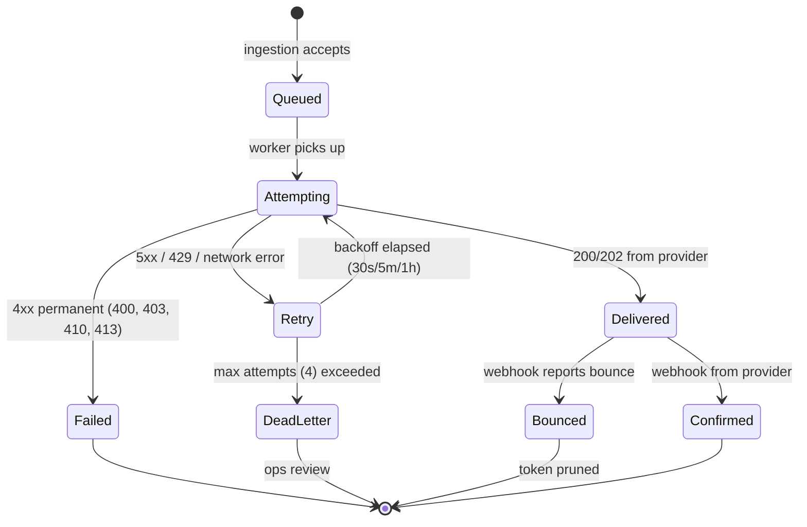
```mermaid
stateDiagram-v2
    [*] --> Queued: ingestion accepts
    Queued --> Attempting: worker picks up
    Attempting --> Delivered: 200/202 from provider
    Attempting --> Retry: 5xx / 429 / network error
    Attempting --> Failed: 4xx permanent (400, 403, 410, 413)
    Retry --> Attempting: backoff elapsed (30s/5m/1h)
    Retry --> DeadLetter: max attempts (4) exceeded
    Failed --> [*]
    DeadLetter --> [*]: ops review
    Delivered --> Confirmed: webhook from provider
    Delivered --> Bounced: webhook reports bounce
    Bounced --> [*]: token pruned
    Confirmed --> [*]
```

*[Source: APNs HTTP/2 status codes; FCM "Best practices when sending FCM messages at scale"; clix.so "Push Notification Delivery" deep-dive]*

**Provider error classification.** The retry decision is driven entirely by which class of error the provider returned. Misclassifying these wastes budget (retrying permanents) or loses notifications (DLQing transients). APNs and FCM both return structured codes; SES/Twilio split status across the synchronous accept response and an async webhook.

| Status class | Examples | Action |
|---|---|---|
| **2xx accepted** | 200, 202 | mark Delivered, await webhook for terminal status |
| **429 throttled** | rate-limited | respect `Retry-After` header, requeue with the specified delay |
| **5xx server error** | provider degraded | exponential backoff retry up to N attempts |
| **4xx permanent — bad token** | 410 Gone (APNs), `UNREGISTERED` (FCM) | mark Failed, prune token from user's device list |
| **4xx permanent — bad payload** | 400, 413 | mark Failed, alert (likely a code bug, not data) |
| **4xx auth** | 403 | mark Failed, alert ops (cert expired) — affects all sends |

*[Source: clix.so "How Push Notification Delivery Works Internally" (2024); FCM docs "Best practices for scale"]*

**Outbox pattern for end-to-end at-least-once.** Idempotency at ingestion handles client retries; the outbox pattern handles the second hop — between the ingestion DB and the channel queue. Ingestion writes the notification record *and* an outbox row in the same DB transaction; a separate publisher process polls the outbox and enqueues to the channel topic, marking outbox rows as published only after the broker acks. A crash between "DB committed" and "queue enqueued" replays naturally because the outbox row is still unpublished. Combined with worker-side dedup (the worker checks `notif_id` against a recently-sent set before calling the provider), this is the standard recipe for at-least-once with idempotent processing — what production calls "exactly-once" while knowing the real guarantee is at-least-once + dedup. *[Source: AWS Prescriptive Guidance "Transactional outbox"; event-driven.io "Outbox, Inbox patterns and delivery guarantees"]*

**Jittered exponential backoff with `Retry-After`.** Naive exponential backoff (`30s, 5m, 1h`) without jitter causes synchronized retry storms — when APNs comes back from a 10-minute outage, every queued retry attempts at the same instant. Jitter the backoff (`delay = base × 2^attempt × random(0.5, 1.5)`); when the provider sends `Retry-After: 60` on a 429, *override* the backoff curve and respect the provider's hint, since the provider knows when its own throttle resets. FCM specifically recommends never retrying within 10s of the prior attempt and capping total retry duration at 60 minutes — past that, the notification is stale and re-categorisation is needed (DLQ + alert), not more retries. *[Source: FCM "Best practices when sending FCM messages at scale"; APNs HTTP/2 spec]*

#### Potential Follow-Up Questions
**Q: APNs is down for 30 minutes — what happens?**
Circuit breaker opens on repeated failures; the push queue keeps buffering (Kafka retains for days). When APNs recovers, workers drain backlog with rate limiting. *If pushed:* if backlog grows past SLA, fall back to alt channel (push → email) for high-priority notifs; drop low-priority that's already stale.

**Q: A "send to every user" broadcast lands at 5pm — how do you not melt the providers?**
Smear send time across a window (e.g., 30 minutes); the broadcast becomes a stream of small batches into the per-channel queue. Workers naturally pace at provider rate limits. *If pushed:* per-region smearing aligned to user timezones (don't send "Good morning" at 3am locally); stage broadcasts via batch worker, not the synchronous API.

**Q: How do you prevent duplicate notifications when a client retries on flaky network?**
Mandatory `idempotency_key` per request, cached `(user_id, key) → notif_id` in Redis for 24h. Retry returns the original ID; no re-send. *If pushed:* dedup has to hold inside the worker too — outbox pattern with `(notif_id, attempt_id)` so a worker crash + replay doesn't double-send; pass `apns-id` to APNs so the provider dedups identical pushes server-side within its window. (`apns-collapse-id` is display coalescing, different feature.)

**Q: User opts out — how fast does that propagate?**
Pref check happens at ingestion time, before queuing. Prefs cached in Redis with short TTL (1m); writes invalidate via pub/sub. *If pushed:* a notif already in-queue is checked again at worker dequeue time — small extra Redis read, but blocks send for users who opted out in the last 30s.

**Q: How do you guarantee delivery confirmation?**
You don't — you guarantee "accepted by provider." APNs HTTP/2 and FCM return per-message status synchronously (200 accepted, 4xx/5xx with reason rejected); SES and Twilio post final delivery state asynchronously via webhook. None of them confirms the user actually saw it. *If pushed:* for true display proof, in-app receipts (client acks on render); consume APNs/FCM error responses to prune dead tokens so the next send doesn't waste budget. End-to-end is at-least-once with dedup — exactly-once is aspirational.

**Q: How do you observe and alert on this system?**
Track per-channel metrics independently because failures cluster by provider: queue depth (work-in-flight), provider call latency p99 (degradation early-warning), error rate by status class (4xx vs 5xx vs 429 distinguish bug from outage from rate-limit), and DLQ growth (persistent failures that need human attention). Page on DLQ growth and on per-channel SLO breach (delivery-within-N-seconds breached for >1% of sends). *If pushed:* synthetic notifications fired every minute through each channel into a known test account detect provider degradation before real users notice — the synthetic miss is the canary for an in-progress outage.

**Q: Walk through the delivery state machine — what triggers each transition?**
`Queued → Attempting`: worker dequeues. `Attempting → Delivered`: provider returns 2xx. `Attempting → Retry`: 5xx, 429, or network error — backoff timer starts. `Attempting → Failed`: 4xx permanent (410 invalid token, 403 auth, 413 too large). `Retry → Attempting`: backoff elapsed. `Retry → DeadLetter`: max attempts hit (typically 4). `Delivered → Confirmed`: provider webhook reports terminal success. `Delivered → Bounced`: webhook reports recipient unreachable; token gets pruned. *If pushed:* the state must be persisted on every transition (Cassandra column update keyed on `notif_id`) so a worker restart resumes correctly — never derive state from queue position alone.

**Q: How do you implement true exactly-once delivery?**
You can't, fully. The achievable shape is at-least-once + dedup that is observably exactly-once: ingestion idempotency on retries from the client, outbox pattern between DB and queue, and worker-side dedup keyed on `notif_id` against a recently-processed set (Redis with 24h TTL). Plus provider-side dedup where supported — APNs honors `apns-id` (client-supplied UUID); FCM auto-dedups on `message_id` within its window. *If pushed:* `apns-collapse-id` is *display* coalescing, not duplicate suppression; don't conflate them.

**Q: A user has 5 devices — how do you fan out to all of them?**
At ingestion, expand `(user_id, channel)` into `[(user_id, device_token_1), ..., (user_id, device_token_5)]` and enqueue one message per device. Each device-token send has its own `notif_id` (or `notif_id + device_idx`) so per-device dedup and retry work independently — one device with a stale token failing doesn't block the others. *If pushed:* FCM's batch endpoint accepts up to 500 tokens in one HTTP call, so for broadcasts the fan-out collapses 500 sends into one network round-trip with per-token errors returned in the response body.

**Q: User in EU updates an opt-out at 12:01; ingestion at 12:00 already enqueued a notification — what happens?**
The pre-queue prefs check missed it (latency between pref-write and ingestion-cache-invalidation). Worker re-checks prefs at dequeue time as a safety net — small extra Redis read but blocks any send to a recently-opted-out user. *If pushed:* GDPR/CCPA compliance often requires the second check to be authoritative; cache prefs at the worker tier with a very short TTL (10s) so opt-outs propagate fast even under heavy queue depth.

**Q: How do you handle scheduled notifications ("send at 9am local time tomorrow")?**
Persist `(notif_id, send_at_ts, payload)` to a scheduled-jobs table partitioned by hour-bucket. A scheduler service polls the next bucket every ~10s and enqueues mature jobs onto the normal channel queues — once enqueued, the live retry/dedup path takes over. Quiet-hours and per-user-timezone smearing are resolved at schedule time, not dispatch time, so the scheduler just compares `now ≥ send_at_ts`. *If pushed:* for high cardinality (millions of scheduled jobs), use a Redis ZSET keyed by epoch-ts for O(log N) "next-due" lookups; for very long horizons (months out), persist to durable storage and lazy-load only the next 24h into Redis.

**Q: How do you handle templating and i18n without paying render cost on every send?**
Templates are versioned objects (Mustache/Liquid), keyed by `(template_id, locale)`. Authoring writes a base template plus per-locale translations; a render pipeline pre-renders the variant matrix (e.g., `welcome × {en,es,fr,ja}`) into a render cache when the template is published — send-time work collapses to variable substitution (sub-ms). Locale fallback chain: requested locale → language family (`en-GB → en`) → default. *If pushed:* per-user dynamic content (names, balances) can't be pre-rendered, so split templates into static-shell + dynamic-slots and substitute only the slots at send time; the expensive layout/translation work stays on the cold path.

#### Bottlenecks & Mitigations
- **APNs/FCM rate limits** — exceeding per-connection limits triggers throttling and eventually account-level penalties. A connection pool with 5–10 HTTP/2 streams per APNs connection lets you parallelise within the limit, and the queue's natural buffering smooths bursts so workers send at a steady rate the provider can absorb.
- **Provider outage** — APNs or SES can be unavailable for tens of minutes. A circuit breaker on each provider tracks error rate; when it trips, the worker stops pulling from its queue (letting the queue back up safely) and high-priority notifications can fall back to an alternate channel (push fail → send email instead).
- **Broadcast thundering herd** — a "send to all 10M users" broadcast issued at 5pm would queue 10M messages instantly and slam the provider workers at peak rate. Smear the send time across a 30-minute window so the broadcast becomes a steady 5k/s feed into the queue, naturally pacing through the workers' rate limits.
- **State tracking volume** — full notification audit logs at 10M/day generate ~50GB/day; keeping all of it on the hot metadata store wastes IOPS on rarely-read history. Archive records older than 7d to S3 with Athena for compliance queries; the hot store keeps only recent state for status APIs.
- **Personalization latency** — rendering templated content (i18n + per-user vars) at send time adds 10–50ms per notification, which compounds at high throughput. Pre-render templates asynchronously when content is authored, cache the rendered output, and serve from cache at send time so the worker only does variable substitution.
- **Outbox-to-queue replication lag** — with the outbox pattern, a slow publisher process means notifications sit in the outbox table while the queue is empty and workers idle. Monitor outbox-table-depth and publisher lag separately from queue depth; alert when outbox depth grows while workers are unsaturated. Multiple publisher instances can read disjoint outbox shards in parallel to scale out.
- **Stale device tokens accumulating** — users uninstall apps but their tokens remain in your DB until a send returns 410 / `UNREGISTERED`, wasting budget on every broadcast. Consume the bounce/error responses from APNs/FCM and prune tokens immediately on permanent failures; periodically (weekly) issue a silent test push to long-idle tokens and prune any that error — keeps the device-token table from accumulating dead weight.

#### Failure Modes

| Layer | Failure | Detection | Mitigation |
|---|---|---|---|
| Upstream | APNs / FCM provider outage | sustained 5xx rate from worker calls | circuit breaker per provider; queue backs up safely (Kafka retains for days); alt-channel fallback for high-priority |
| Upstream | SES bounce-rate flag triggers send-pause | account-level error from SES | bounce/complaint webhook consumer prunes dead recipients; warm-up new sender reputations on dedicated IPs |
| Crash | Ingestion service node lost mid-write | partial state: DB committed but queue not enqueued | outbox pattern — DB transaction includes outbox row; separate publisher polls outbox and enqueues with at-least-once semantics |
| Crash | Worker dies mid-send | pending message visibility timeout in queue | re-delivery to another worker; idempotent send keyed on `notif_id` against recently-processed Redis set prevents double-send |
| Network | Partition between worker pool and provider | provider call timeouts | retry with exponential backoff + jitter; circuit-break domain after threshold; never burn budget retrying a partitioned provider indefinitely |
| Correctness | Client retries flaky-network request, missing idempotency_key | duplicate notifications observed by users | enforce idempotency_key as required field at API contract; reject requests without it; cache `(user, key) → notif_id` for 24h |
| Resource | Broadcast thundering herd (10M users, instant) | queue depth spike to 10M in seconds | smear schedule at API level (e.g., 30min window); per-channel concurrency caps prevent provider overflow |
| Resource | Stale device tokens accumulate, every broadcast wastes budget | high 410/UNREGISTERED rate per send | consume bounce webhooks; prune permanently-failed tokens immediately; weekly silent-push to long-idle tokens to flush dead tokens |

#### Observability — Key Metrics & SLOs

- **`notif.delivery_latency_p99`**: time from API accept to provider 2xx — emitted by worker — alert if > 30s for high-priority, > 5min for normal-priority
- **`notif.queue_depth_per_channel`**: messages awaiting send, per channel — emitted by broker — alert if depth > N or growing for > 15min (worker scaling or provider degradation)
- **`notif.dlq_size`**: dead-letter messages per channel — emitted by broker — page on growth (persistent failure pattern)
- **`notif.provider_error_rate_by_class`**: 4xx-permanent / 4xx-auth / 5xx / 429 broken out per provider — emitted by worker — alert on auth (cert expiry blocks all sends), alert on 429 sustained (rate-limit misconfiguration)
- **`notif.dedup_hit_rate`**: fraction of requests deduplicated via idempotency_key — emitted by ingestion — sudden drop signals client SDK regression (missing keys)
- **`notif.bounce_prune_rate`**: stale tokens removed per day from bounce webhooks — emitted by webhook consumer — alert if > 5%/day (flagged-domain or sender-reputation issue)
- **SLOs:** high-priority delivery p99 < 30s end-to-end (ingestion to provider 2xx), normal-priority p99 < 5min, availability 99.95% per channel (each provider has its own outage profile; account for provider SLAs).

#### Multi-Region & DR

- **Replication mode:** active-active across regions for ingestion (any region accepts requests, geo-routed to nearest); active-passive for shared state (idempotency cache, prefs) with cross-region async replication. Per-region channel queues drain to provider endpoints in the same region (APNs/FCM are global from the client's POV but worker placement affects RTT to provider edge).
- **RTO / RPO:** RTO 1min for ingestion failover (geo-DNS pulls unhealthy region); RTO 5min for queue/worker recovery in standby region. RPO < 60s of in-flight messages (durable Kafka retains; replay from outbox bridges any gap).
- **Failover trigger & cadence:** automatic on regional health-check failure; tested monthly via simulated regional ingestion outage. Quarterly drill kills an entire region and validates queue replay + idempotency-cache cross-region reconciliation.
- **Cross-region cost trade-off:** active-active ingestion costs replication bandwidth for the idempotency cache and prefs (low — preferences are bytes, idempotency keys are cached for 24h). The bigger cost is operational complexity: a notification accepted in us-east and a duplicate in eu-west must dedup against a shared cache; the alternative (pin user to home region) sacrifices availability for simpler dedup.

#### Common Mistakes / Anti-patterns

- **Promising exactly-once delivery** — distributed systems can't guarantee this against external providers; the achievable shape is at-least-once + dedup that's observably exactly-once. Candidates who claim exactly-once fail the trick question; the senior answer names the layered dedup (ingestion idempotency_key + outbox + worker-side `notif_id` set + provider `apns-id`).
- **One queue for all channels** — head-of-line blocking means an APNs outage stalls email and SMS too. Per-channel queue isolation is the correct answer; conflating channels is a junior mistake.
- **Synchronous broadcast** — accepting a "send to 10M users" API call and processing it synchronously slams every provider at peak rate; senior answer smears across a window (per-timezone for "Good morning" notifications) and stages via a batch worker, not the synchronous API.
- **Confusing `apns-collapse-id` with deduplication** — `apns-collapse-id` is *display coalescing* (only the latest visible to the user), not duplicate suppression of identical sends. Candidates conflate these because both involve "deduplication" in some sense.
- **Treating 4xx and 5xx the same way for retries** — retrying a 410 Gone (token invalid) wastes budget forever; retrying a 503 succeeds eventually. The retry policy must classify by status class: 5xx and 429 retry with backoff, 4xx-permanent goes to Failed, 4xx-auth pages ops.
- **Forgetting to honor `Retry-After`** — when a provider sends `Retry-After: 60` on 429, the worker must override its backoff curve and use the provider's hint; ignoring it triggers a longer ban. Candidates who describe a fixed exponential backoff without `Retry-After` handling miss the contract.

#### Talking Points for the Interview

- **At-least-once + layered dedup is the real consistency model** — naming the four layers (ingestion idempotency_key, outbox, worker-side notif_id set, provider-side `apns-id`) shows you know what "exactly-once" actually costs to approximate.
- **Per-channel queue isolation is non-negotiable** — head-of-line blocking is the #1 way notification systems become full outages instead of provider outages.
- **The outbox pattern bridges the DB-to-queue gap** — naming it explicitly shows you've thought about the second-hop atomicity problem most candidates miss.
- **Smear broadcasts; never accept synchronous mass-send** — surface this proactively; provider account-level rate limits are real and a single "send to all users" API call can take down an entire integration.
- **Provider error classification drives the retry policy** — distinguishing 4xx-permanent / 4xx-auth / 5xx / 429 with different actions is how you avoid wasting budget on retries that will never succeed.
- **State machine + persisted state per transition** — every transition writes to durable storage so a worker restart resumes correctly; deriving state from queue position is a junior mistake.
- **Stale token pruning via bounce webhooks is operational hygiene** — the device-token table grows forever without it, and every broadcast wastes budget on dead tokens; senior candidates name this as an explicit subsystem, not an afterthought.

### 8. Design a News Feed System (Facebook, Twitter)
#### Problem
Build and serve a personalized timeline of posts from followed users, ranked by relevance, with low latency.

#### Summary
**The picture in your head:** a newspaper delivery service, except the newspaper changes based on who you follow. For most subscribers, the paperboy drops a personalized paper on your doorstep every morning before you wake up (fan-out on write — pre-build the feed). For a few famous columnists with 100 million readers, printing and delivering to every doorstep is too expensive, so instead you go pick up their column yourself when you open the paper (fan-out on read — pull at load time). Most people never notice the difference.

**The single-request walkthrough:** a user with 200 followers posts "just launched my startup!" The post service writes the post to the posts database and returns success immediately. Asynchronously, a fan-out service reads the list of those 200 followers from the follow graph. For each follower whose account has fewer than 10,000 followers of their own (i.e., they are a normal user, not a celebrity), the fan-out service does a Redis ZADD — it adds the post ID to that follower's timeline sorted set (a sorted list in Redis, sorted by timestamp as the score), capped at 1000 entries. Total: 200 Redis writes, done in a few seconds in the background. Later, when follower Alice opens her app, the feed service reads Alice's Redis timeline (one fast lookup: "give me the top 20 post IDs sorted by timestamp"), fetches the post details for those 20 IDs from the posts database, optionally reruns a ranking model, and returns Alice's feed in under 200ms.

**The pieces (and what each one is for):**
- **Posts database** — a wide-column store (like Cassandra) that holds the canonical post content, partitioned by `author_id`. This is the source of truth. Timelines only store post IDs, not full post content, so deleted or edited posts propagate correctly — the timeline just points here.
- **Follow graph** — a database of `(follower_id, followee_id)` pairs. Queried by the fan-out service to find who should receive a post, and by the feed service to find which celebrities the current user follows (for the pull path).
- **Fan-out service** — the async worker that, after a post is written, pushes the post ID into followers' timeline caches. It skips celebrities (followee has >10,000 followers) — those are handled at read time instead.
- **Per-user timeline cache (Redis sorted set)** — a per-user ordered list in Redis, keyed by `user_id`, containing post IDs sorted by timestamp. Loading a feed is: read the top 1000 post IDs from Redis, hydrate the top 20 from the posts database. One Redis read, then a small batch of database lookups.
- **Ranking model** — an ML model that reorders the ~500 candidate post IDs from the timeline before returning results to the user. It runs on the read path. Ranking on write time would be wrong — engagement signals (how many likes a post got in the last hour) are constantly changing.
- **Celebrity pull path** — at read time, the feed service identifies which of the current user's follows are celebrities (> 10,000 followers). It fetches those celebrities' recent posts directly from the posts database and merges them with the pre-built timeline before ranking.

**The thing that makes it hard:** Taylor Swift has 100 million followers. She posts once. The naive fan-out approach would do 100 million Redis writes in parallel — each write takes about 0.5ms, so even with 1000 parallel workers that is 50,000 seconds of total work, or about 50 seconds wall-clock with full parallelism. The Redis cluster gets saturated. Everyone who follows Taylor sees her post delayed by minutes. And this happens every time she posts. The fix: she is above the celebrity threshold, so her posts are never fanned out. Instead, every user who follows her fetches her recent posts at read time — ~5 extra database lookups per feed load, trivially cheap.

**Why the standard solution works:** hybrid fan-out is the production default (Twitter, Instagram) because it handles the two failure modes of either pure strategy. Pure fan-out-on-write fails for celebrities. Pure fan-out-on-read makes every feed load expensive (you would query every person you follow, merge and rank at read time). Hybrid bounds both costs: fan-out writes are bounded to accounts with fewer than N followers; read-time merges are bounded to the handful of celebrities a typical user follows (usually 5–10).

**If you were building it tomorrow:**
- Redis cluster (sorted sets per user, capped at 1000 entries, score = timestamp) for the push timeline.
- Cassandra for posts, partitioned by `author_id`.
- Fan-out via Kafka: post events enqueue; fan-out workers consume, check follower count, write to Redis or skip.
- Read path:
  ```
  def get_feed(user_id):
    push_ids = redis.zrevrange(user_id, 0, 999)  # pre-built timeline
    celeb_ids = [recent_posts(c) for c in get_celebs(user_id)]  # pull path
    candidates = merge(push_ids, celeb_ids)[:500]
    posts = db.batch_get(candidates)
    return ranker.score(posts, user_id)[:20]
  ```
#### Clarifying Questions
- Chronological or algorithmic ranking?
- How many follows on average? Outliers (celebrities)?
- Real-time updates (live) or per-page-load refresh?
- Media types? (text, image, video — different sizes)
- Personalization signals available?

#### Requirements
- **FR:** post, follow/unfollow, fetch feed, paginate, refresh
- **NFR:** <200ms feed load p95, support celebrity fan-out, eventually consistent

#### Scale Estimate
- **DAU & post volume:** Facebook ~2B DAU, Twitter ~250M DAU; pick 500M DAU as a mid-scale composite. Assume 20% of DAU post on a given day × ~10 posts/poster/day = 1B posts/day. 1B ÷ 86,400s ≈ ~12k posts/s steady; global-event peaks (election night, World Cup goal) push 5× → ~60k/s burst.
- **Follow distribution:** anthropological average from public social-graph studies ~150–250 follows; pick 200. Long tail: top accounts (Cristiano ~600M, Taylor Swift ~280M) sit 6 orders of magnitude above the median — celeb skew is what kills naive fan-out, hence the push/pull split.
- **Feed read:write ratio:** 500M DAU × ~5 sessions/day × ~5 feed loads/session = ~12.5B feed loads/day; vs 1B posts/day that's ~12:1 on raw counts but ~100:1 once you weight by per-user opens (heavy lurkers) → ~1.2M feed loads/s steady (12.5B ÷ 86,400 × 1.5× peak ≈ ~220k/s avg, ~1.2M/s under fan-out + retry burst).
- **Post size:** ~1KB metadata (post_id 16B + author_id 8B + text up to ~280 chars Twitter-style ~600B + media refs ~50B + ts 8B + flags) — media bytes live in object store/CDN, not in the post row.
- **Post volume on disk:** 1B posts/day × 1KB = 1TB/day metadata; wide-column replication factor 3 (durability + read fan-out) → ~3TB/day write amplification on the posts store.
- **Timeline cache:** 500M users × 1000 post_ids cached per timeline (covers ~weeks of feed scroll for typical users) × ~24B per ZSET entry (8B post_id + 8B score/ts + 8B Redis overhead) = 500M × 1000 × 24B = ~12TB hot, sharded across the in-memory cluster (~100 shards × 120GB each).
- **Hot tier sizing:** 30 days × 1TB/day metadata = 30TB on SSD wide-column (× 3 replication = 90TB raw provisioned); plus the ~12TB sorted-set cache for active timelines.
- **Cold tier:** posts older than 30 days move to spinning disk / object store (cheaper $/GB by ~10×); timelines truncated to 1000 entries so the cold path is only hit on profile drill-down (~1% of reads).
- **Media:** ~500KB avg image (post-compression JPEG/WebP at consumer phone resolution), ~5MB avg short video (~30s × ~1.3Mbps); assume 50% of posts carry an image and 5% carry a short video → 1B × (0.5 × 500KB + 0.05 × 5MB) = 1B × (250KB + 250KB) = ~500TB/day media to object store, fronted by CDN at ~95% hit rate.

#### API Contract
```
POST /post           body: { content, media_ids } → { post_id }
POST /follow/{user}
GET  /feed?cursor=X  → { posts: [...], next_cursor }
```

#### High-Level Design
```
WRITE (post):
  User ─→ Post Service ─→ Posts DB
                   │
                   └─→ Fan-out Service ──┬→ if author has < 10k followers:
                                         │   for each follower:
                                         │     PUSH to sorted-set cache feed list
                                         │
                                         └→ if celebrity (>10k):
                                             SKIP push; mark for pull

READ (feed):
  User ─→ Feed Service:
            1. Fetch pre-computed Redis list (push timeline)
            2. Pull recent posts from celebrity follows
            3. Merge + rank (ML scorer)
            4. Hydrate post details from cache/DB
            5. Return paginated
```

**How to read the diagram:** the key split is between posting and reading. On the write side, new posts are pushed into timelines for many followers. On the read side, the app fetches a mostly prebuilt timeline and then enriches or reranks it before returning results.

**Why the flow is shaped this way:** reads are far more frequent than writes for most users, so the design spends work up front to make feed loads cheap. But that breaks for celebrity accounts, so a hybrid model keeps normal users on fan-out-on-write and large accounts on fan-out-on-read.

**What this layout buys you:** fast home timelines for ordinary users without melting down on huge follow counts. The price is that one product now contains two feed strategies, and the threshold between them becomes an important tuning knob.

#### Data Model
- **posts** (wide-column store): `(post_id, author_id, content, media, ts)` partition by author
- **follows** (wide-column store): `(follower_id, followee_id, ts)` two indexes
- **timeline** (sorted-set cache per user): `score=ts`, `member=post_id`, capped at 1000
- **media** (object store + CDN)

#### Detailed Design
**Fan-out comparison:**

| Strategy | Read | Write | Best For |
|---|---|---|---|
| **Push (fan-out on write)** | O(1) — pre-built | O(followers) | normal users |
| **Pull (fan-out on read)** | O(follows × posts) | O(1) | celebrities |
| **Hybrid** | O(celeb_follows + 1) | O(min(followers, threshold)) | **Twitter/Insta default** |

**Threshold tuning.** The 10k cutoff is a heuristic, not a law — it represents the point where `followers × write_cost` (roughly 0.5ms per Redis ZADD) becomes more expensive than the per-feed-load celebrity pull cost. Tunable per workload: a system with cheap Redis and expensive query-time merges might push up to 50k; a system with great query-time caching might push only to 1k. Cross the threshold, you flip strategies on the next post, and existing pushed entries age out of follower ZSETs naturally over the 1000-entry cap. Example: Taylor Swift (100M followers) at push would do 100M Redis writes per tweet — minutes of latency and gigabytes of write traffic per post.

**Ranking.** Candidate retrieval runs first — gather last 500 posts from the union of pushed timeline + celebrity pulls. The ML scorer is typically a two-stage funnel: a cheap linear model trims 500 → 100 candidates, then a deep model (DNN or transformer) scores the survivors using user history embeddings, post embeddings, and engagement features (likes, replies, dwell time predictions for similar users). A feature store (Redis or RocksDB-backed) supplies user features at request time with sub-ms reads. Top 50 returned to the client; the client typically displays 10-15 at a time and lazy-loads more.

**Caching.** Hot posts (those getting >1k QPS for hydration) get pushed to a CDN edge cache with 30-60s TTL — most viral-post traffic resolves at the edge and never reaches origin. User-level feed caching (the post-rank ordered list) lives in Redis for 5 minutes, keyed by `(user_id, version)`; this protects against a user spam-refreshing the app from re-running the ML scorer 10 times. Pre-warming on app open issues a background fetch that populates the feed cache before the user scrolls — turning a visible latency into invisible bandwidth.

**Refresh model: per-load, not live-pushed.** Feed updates are pulled on app open / pull-to-refresh, not pushed live over a WebSocket. Live push would re-rank for every user the moment any of their followees posted — catastrophic cost given the ML re-rank price tag. Instead, the client fetches a fresh feed on explicit refresh, and the 5-minute cached re-rank serves intermediate views. Live-feeling features (a "23 new posts" pill above the feed) are surfaced via a thin presence channel that just signals "N new posts above" without re-running the ranker — Twitter and Instagram both do this.


**Fan-out strategies — visual comparison.** *[Source: Twitter/Manhattan, Instagram engineering]*

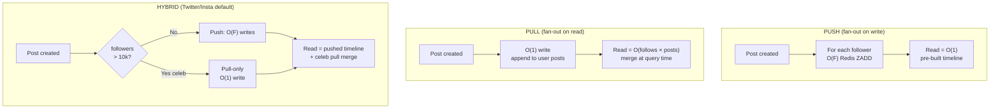
```mermaid
flowchart TB
    subgraph Push["PUSH (fan-out on write)"]
        P1[Post created] --> P2["For each follower<br/>O(F) Redis ZADD"]
        P2 --> P3["Read = O(1)<br/>pre-built timeline"]
    end
    subgraph Pull["PULL (fan-out on read)"]
        L1[Post created] --> L2["O(1) write<br/>append to user posts"]
        L2 --> L3["Read = O(follows × posts)<br/>merge at query time"]
    end
    subgraph Hybrid["HYBRID (Twitter/Insta default)"]
        H1[Post created] --> H2{"followers<br/>> 10k?"}
        H2 -->|No| H3["Push: O(F) writes"]
        H2 -->|Yes celeb| H4["Pull-only<br/>O(1) write"]
        H3 --> H5["Read = pushed timeline<br/>+ celeb pull merge"]
        H4 --> H5
    end
```

Cost equations (per post, F = followers, A = avg follows/user, C = celeb follows/user):
- Push write cost: `F × 0.5ms` (Redis ZADD) — Taylor Swift at 100M followers ≈ 14 hours of synchronous writes; even fully parallelised across 1000 workers, that's ~50s and saturates a Redis cluster
- Pull read cost: `(A − C) × P` posts to merge per feed load (P = posts pulled per author)
- Hybrid read: `pushed_timeline_lookup (1 op) + C × P merge` — bounded because avg C ≈ 5–10

**Twitter Manhattan unbundle.** *[Source: Twitter engineering, 2014–2020]* Twitter's home timeline historically lived in a custom in-house store ("T-bird"), then migrated to Manhattan (Twitter's distributed K/V). Manhattan handled both timelines and the social graph; under sustained scale Twitter unbundled — moved hot timeline reads to a Redis-backed timeline service (T-Flock for graph, separate timeline cache cluster) so a hot tweet write didn't trigger a Manhattan compaction storm that hurt graph queries. Lesson: a single store handling both write-heavy timelines and read-heavy graph traversal will eventually need to split.

**Instagram → Cassandra migration.** *[Source: Instagram engineering]* Instagram migrated feed storage from Redis to Cassandra around 2013 specifically to handle the celebrity-follower explosion. Redis worked at 10s of millions of users; at 100M+ DAU, RAM cost made push-fan-out economically irrational for celebrity accounts. Cassandra as a wide-column store with `(user_id, ts)` partitioning let them keep push for normal users and pull from a denser cold store for celebrities — same hybrid approach, different storage substrate.

**Ranking pipeline numbers.** *[Source: Meta news feed engineering]* Real-world two-stage funnel at Meta scale:
- Candidate generation: ~500 candidates per user from pushed timeline + celeb pulls + ads
- Cheap linear/light-GBM ranker: 500 → 100, ~5ms p99
- Heavy DNN re-ranker: 100 → 50, ~30-80ms p99 with feature-store fetches
- Total feed-load p99 budget: ~150ms; ML accounts for half, hydration the rest

#### Potential Follow-Up Questions
**Q: How do you handle a brand-new celebrity (10M followers overnight)?**
Threshold is dynamic — recompute follower-count buckets daily, and any account crossing 10k flips to pull on the next batch. Existing pushed entries age out of followers' Redis ZSETs naturally. *If pushed:* a "warming" period where the account is dual-mode (push to active followers, pull for the rest) so we don't miss posts during transition.

**Q: What's the tradeoff of push vs pull vs hybrid?**
Push: O(1) reads, O(followers) writes — kills you on celebrities. Pull: O(follows × posts) reads — kills you on every feed load. Hybrid is the only one that scales both ways. *If pushed:* hybrid adds complexity (two code paths, merging logic) — only worth it once you have real follower-count skew; small startups should push-only.

**Q: How do you prevent stale feeds when a user follows someone new?**
Trigger an async backfill that reads the followee's recent posts and inserts them into the follower's Redis timeline. Cap at last 100 posts. *If pushed:* on first feed load post-follow, do a one-shot pull-merge as a fallback if the backfill hasn't completed.

**Q: How do you handle viral posts that 10x normal traffic?**
Hot-post detection on the read path (counter per post_id → if QPS spikes, mark hot) → push to CDN with short TTL, single-flight DB lookups via request coalescing. *If pushed:* pre-emptively replicate hot post records across Cassandra nodes; rate-limit per-post hydration to protect the long tail.

**Q: How do you test ranking changes without nuking engagement?**
Online A/B test on a small slice (1-5%) with engagement metrics + holdout. Shadow-rank in production and compare without serving. *If pushed:* counterfactual evaluation on logged feed impressions to estimate uplift before running an A/B.

**Q: How would you scale this 10x to 5B DAU?**
Geo-shard timelines and posts by user region; cross-region followers replicate async with eventual consistency. CDN tier absorbs the explosive read multiplier. *If pushed:* split the ranker into a cheap candidate generator (per region) and a heavy ML re-ranker that runs on cached candidates — protects p99 under load.


**Q: Why did Twitter unbundle timelines from Manhattan?**
A single store carrying both timeline writes and graph reads couldn't isolate the workloads — a viral tweet's fan-out triggered Manhattan compactions that starved graph queries. They split timelines into a Redis-backed cache tier; Manhattan kept being the social-graph store. *If pushed:* the deeper lesson is that "shared infrastructure" is a beautiful idea until one workload's bursts are correlated with the other's read SLA — at which point you pay for two systems.

**Q: Why did Instagram move feeds from Redis to Cassandra?**
RAM economics. Redis ZSETs work at tens of millions of users; at 100M+ DAU, push fan-out for high-follower accounts wasn't economically rational on RAM. Cassandra's wide-column on disk is 10-50x cheaper per GB; they kept Redis as a hot cache for the active working set. *If pushed:* the alternative was sharding Redis more aggressively, but ZSET ops cost the same RAM regardless of shard count — the storage substrate had to change.

#### Bottlenecks & Mitigations
- **Celebrity fan-out** → pull-only; merge at read time. Pushing to 100M followers per post saturates Redis and costs minutes of latency; pulling at read time is bounded by `O(celebs followed)` which is small (avg user follows ~10 celebs).
- **Hot post** → CDN cache; rate-limit per-post DB lookups. A viral post can spike from 100 QPS to 100k QPS within minutes; CDN absorbs the read multiplier and request coalescing collapses 1000 concurrent identical hydrations into 1 backend call.
- **Cache miss cascade** at peak → request coalescing (single inflight). When a hot post falls out of cache during a traffic spike, naive behavior is N concurrent rebuilds; coalescing pins one request as primary and parks the rest until it returns.
- **Ranking ML latency** → async batch (re-rank every 30s, not per-request). Heavy ranking on every feed load adds 100-200ms p99; batching lets a single re-rank serve many subsequent requests for the same user from cache.
- **Feed write storm during scheduled events** → smear over time. A scheduled "everyone post your year-in-review" at midnight UTC creates a 10x write spike in the same second; deferring fan-out by a random jitter (0-5 min) flattens the curve to manageable steady-state.

- **Storage substrate cost** → migrate from RAM (Redis) to wide-column (Cassandra) at scale. RAM is 10-50x more expensive per GB than disk; once timelines exceed the working set that fits in RAM-cache budget, push the cold tail to Cassandra and keep Redis as front-cache. Instagram did this in 2013 at 100M DAU.
- **Workload entanglement** → separate timeline writes from graph reads. A viral tweet's fan-out can trigger compactions that tank graph-query SLA on the same store; physically split the systems. Twitter learned this when home timelines and the follow graph shared Manhattan.

#### Failure Modes
| Layer | Failure | Detection | Mitigation |
|---|---|---|---|
| Timeline fan-out | Async fan-out workers lag after a bursty post event | Queue-depth and oldest-job age alerts | Post ack returns after durable write only; fan-out drains asynchronously with backpressure and per-author rate shaping |
| Timeline cache | Redis timeline shards evict or lose a user's prebuilt feed | Cache-miss spike and rebuild-rate alarm | Rebuild from author-posts store on demand, cap timeline length, and repopulate lazily rather than blocking the request |
| Celebrity pull path | Recent-post cache for a high-follower account is stale or unavailable | Read-time pull latency spike and empty-celebrity-merge rate | Fallback to author partition scan for a small recent window and cache the result aggressively |
| Follow graph | Follow/unfollow propagation lags, so feed composition is stale | CDC lag and post-from-unfollowed-author canary | Treat follow changes as eventually consistent, backfill on follow, and remove on next timeline rebuild or cache expiry |
| Ranking service | Ranker timeout causes slow or blank feeds | Ranker p99 and timeout-rate alerts | Serve chronological or lightly-scored fallback from the candidate set and refresh ranked feed asynchronously |
| Delete / moderation | Deleted or moderated posts remain in cached timelines | Tombstone-hit rate and post-delete propagation lag | Timelines store only IDs; hydration consults source-of-truth tombstones so deleted posts disappear without rewriting every feed |

#### Observability — Key Metrics & SLOs
- **Feed latency** (request to hydrated response) — SLO p99 < 200ms for warm-cache home timeline loads.
- **Fan-out lag** (post durable write to follower-timeline insertion) — key freshness metric for non-celeb authors.
- **Timeline cache hit rate** — low hit rate means rebuild pressure and likely user-facing latency regression.
- **Celebrity merge latency** — isolates the read-time pull tax from the normal push-built feed path.
- **Ranker latency and timeout rate** — directly controls user-facing tail latency because ranking is on the read path.
- **Delete propagation lag** — measures trust/safety correctness, not just performance.

#### Multi-Region & DR
- **Replication mode:** social graph and posts are replicated cross-region asynchronously; each user's hot timeline cache is region-local and disposable.
- **RTO:** minutes for timeline-cache loss because caches rebuild from durable post and follow stores; seconds for stateless feed-service failover.
- **RPO:** near-zero for posts and follows in the durable stores; timeline caches accept total loss because they are derived state.
- **Failover cadence:** regional failover drills should validate that post write availability and feed rebuild both still work with cold caches.
- **Cross-region cost:** the expensive part is not timeline replication but media/CDN egress and post-store replication for fresh content.

#### Common Mistakes / Anti-patterns
- **Pure push or pure pull everywhere.** The follower graph is too skewed; any single strategy fails badly at one end of the distribution.
- **Storing full post payloads in timelines.** Timeline caches should hold IDs and ordering only; payload duplication makes deletes, edits, and memory costs much worse.
- **Ranking on write.** Fresh engagement signals matter, so ranking belongs on the read path over a bounded candidate set.
- **Synchronous fan-out in the posting request.** The user should get success after the canonical post write, not after millions of follower-cache mutations.
- **No explicit delete/tombstone path.** A cached feed without source-of-truth tombstones leaks moderated or deleted content.

#### Talking Points for the Interview
- **Hybrid fan-out is the core decision.** Say early that normal users push-on-write and celebrities pull-on-read.
- **Timeline caches should store IDs, not whole posts.** It shows you understand memory pressure and delete propagation.
- **Posting and fan-out are decoupled.** The write path ends at the durable post store; fan-out is async.
- **Ranking happens on a bounded candidate set.** This keeps personalization realistic without making feed latency explode.
- **Celebrity pull is an intentional tax on reads to protect writes.** Interviewers want to hear that trade explicitly.
- **Caches are disposable.** The durable post store and follow graph are the truth; timelines are derived state.

### 9. Design a Chat System (WhatsApp, Messenger)
#### Problem
Real-time bidirectional messaging between users — 1:1 and groups — with delivery guarantees, presence, and offline support.

#### Summary
**The picture in your head:** a switchboard operator at an old telephone exchange. Every caller has a live wire plugged into a physical jack at the switchboard. When Alice wants to talk to Bob, the operator sees which jack Bob is plugged into and patches the wires together. If Bob is away, the operator writes down the message and reads it back when Bob plugs back in. The key property: the connection is live and persistent, not something you request fresh each time.

**The single-request walkthrough:** Alice sends "hey" to Bob. Alice's phone has a WebSocket — a persistent, full-duplex TCP connection (unlike normal HTTP, which is request-response and closes after each exchange) — to Chat Server A. Alice types and hits send. Her app sends `{type: send, to: bob, body: "hey", client_msg_id: c123}` over the WebSocket. Chat Server A immediately writes the message to Cassandra (the durable message store) with a Snowflake ID as the message key. Only after the write succeeds does it send `{type: ack, server_msg_id: s456}` back to Alice — her "sent" checkmark. Then Server A puts a routing event on Kafka: "message s456 is for Bob." A message bus consumer sees this event, checks the session registry (a Redis cache: "which chat server is Bob currently connected to?") — Bob is on Chat Server B. Server B receives the routing event, finds Bob's open WebSocket, and pushes `{type: receive, from: alice, body: "hey", server_msg_id: s456}`. Bob's app shows the message.

**The pieces (and what each one is for):**
- **WebSocket connections (persistent, stateful)** — unlike HTTP where each request opens and closes a connection, a WebSocket stays open indefinitely. The server can push data to the client at any time without the client asking. This is how real-time delivery works. Each chat server holds tens of thousands of open WebSockets simultaneously using async I/O (event loops, like Erlang's BEAM or Go's goroutines — runtimes built for cheap concurrency). WhatsApp runs 2 million concurrent connections per server using Erlang.
- **Message persistence before ack** — the sender's "sent" checkmark must mean the message is stored durably, not merely that one server process accepted it. If Server A acks first and then crashes, Alice thinks Bob got "hey" but it is gone. Persist first, ack second — always.
- **Session registry (Redis)** — a cache mapping `user_id → chat_server_id`. Every chat server maintains this: when Bob connects to Server B, Server B writes `bob → server_B` to Redis with a 60-second TTL, refreshed by heartbeats every 30 seconds. When routing a message to Bob, look up his server in Redis. If the entry is missing (Bob is offline), use the push notification path instead.
- **Message bus (Kafka)** — the routing layer between chat servers. Instead of Server A directly calling Server B (which would require every server to know about every other server, and would break on deployments), Server A writes to a Kafka topic and Server B is a consumer. The bus decouples sender-side and receiver-side delivery.
- **Wide-column message store (Cassandra)** — partitioned by `chat_id`, clustered by `message_id` (Snowflake timestamp). This means all messages in a conversation are stored together and sorted by time — a single read gives you chat history in send order. Cassandra's design handles many small writes efficiently, which matches chat's access pattern.
- **Offline → push notification path** — if Bob has no active WebSocket (phone is locked), the message still lands in Cassandra. Then APNs (Apple's push service) or FCM (Google's push service) sends a wakeup notification to Bob's device. Bob unlocks, his app reconnects, and the reconnect handler asks "give me all messages since `last_read_msg_id = s455`." Cassandra streams the missed messages. Push notifications are best-effort wakeups, not delivery guarantees — the durable store is what actually guarantees the message.

**The thing that makes it hard:** a chat server holding 1 million WebSocket connections crashes. All 1 million clients detect the disconnect simultaneously and start reconnecting. The reconnection attempts hit the load balancer all at once. Surviving chat servers each get hit with hundreds of thousands of new connection attempts in the same second. This overloads them, which causes latency, which causes client timeouts, which causes more retries — a cascade. The fix: jittered exponential backoff. Each client waits a random delay before reconnecting (say, uniform random between 0 and 30 seconds). The 1 million reconnects spread over 30 seconds instead of 1 second — a completely manageable rate.

**Why the standard solution works:** persist-before-ack plus cursor-based replay is the delivery guarantee. The WebSocket + session registry + message bus is the real-time delivery mechanism. They are independent: if the real-time path fails (server crash, network blip), the cursor-based catch-up on reconnect fills the gap from the durable store. The system degrades gracefully — offline users get their messages when they return, online users get them in real time.

**If you were building it tomorrow:**
- Cassandra for messages: partition key `chat_id`, clustering key `msg_id` (Snowflake).
- Redis for session registry: `SET user:{bob} server_B EX 60`; heartbeat refreshes TTL.
- Kafka for inter-server routing: topic per recipient shard, partitioned by `recipient_id`.
- Chat server in Go or Elixir (BEAM) for cheap concurrency:
  ```
  on_receive_message(ws, msg):
    msg_id = snowflake.next()
    cassandra.write(msg.chat_id, msg_id, msg.body)  # persist first
    ws.send({type: ack, server_msg_id: msg_id})      # then ack
    kafka.publish(msg.recipient_id, msg_id)           # then route
  ```
#### Clarifying Questions
- 1:1 only or also groups? Group size cap?
- E2E encryption?
- Presence (online/offline/typing)?
- Read receipts / delivery receipts?
- Voice/video calls in scope? (assume out)
- Message history retention?

#### Requirements
- **FR:** send/receive 1:1 + group (≤500); presence; receipts; history; offline → push
- **NFR:** <100ms delivery; ordered per-conversation; at-least-once; reconnect resilience

#### Scale Estimate
- **DAU & message volume:** WhatsApp public stat ~2B users sending ~100B msgs/day (≈50 msgs/user/day). Sized here for a mid-tier app: 50M DAU × ~100 msgs/user/day = 5B msgs/day. 5B ÷ 86,400s ≈ ~58k msgs/s steady; evening peak (post-work, ~3 timezone bands overlapping) ~4× avg → ~250k/s peak.
- **Message size:** ~200B serialized (chat_id 16B + msg_id 16B + sender_id 8B + body ~120B avg text payload + ts 8B + delivery state flags 4B + protobuf framing ~30B) — text-heavy; media stored separately as blob refs (the row carries a 32B media_id, not bytes).
- **Message volume on disk:** 5B × 200B = ~1TB/day raw; replication factor 3 (durability + multi-DC) → ~3TB/day on the wide-column store.
- **Hot retention:** active scroll-back covers ~30 days for ~99% of clients (most chats are "tap to read latest"); 30 days × 1TB/day = ~30TB raw, ~90TB after 3× replication on SSD.
- **Cold retention:** beyond 30 days messages spill to spinning disk / object-store snapshots (~10× cheaper $/GB); per-chat TTL configurable so legal-hold and ephemeral chats coexist.
- **Concurrent WebSocket connections:** ~10% of DAU foreground at any moment → 50M × 10% = ~5M concurrent peak; modern Linux NIC + epoll handles ~50k WS conns/box → 5M ÷ 50k = 100 chat servers, plus 1.5× headroom for rolling deploys + AZ failover = 150 boxes provisioned.
- **Session registry:** 50M DAU × ~80B per entry (user_id 8B + server_addr 16B + conn_id 16B + last_seen 8B + flags + key overhead) = ~4GB; fits in a single in-memory cache shard, replicated 3× for HA.
- **Media (images/voice notes):** ~500KB avg (compressed image ~400KB, voice note ~30s × 16kbps ≈ 60KB; mix-weighted ~500KB); 5% of messages carry media (most are text reactions) → 5B × 5% × 500KB = ~125TB/day to object store + CDN.

#### API Contract
```
WebSocket connection (auth via JWT):
  →  { type: send, to, body, client_msg_id }
  ←  { type: ack, server_msg_id, ts }
  ←  { type: receive, from, body, server_msg_id, ts }
  ←  { type: presence, user_id, state }
  ←  { type: receipt, msg_id, state: delivered|read }

REST:
  GET /history/{chat_id}?before=ts → [messages]
```

#### High-Level Design
```
   User A                                            User B
     │                                                  │
     │  WebSocket                          WebSocket    │
     ↓                                                  ↓
  ┌──────────┐                                  ┌──────────┐
  │ Chat Svr │                                  │ Chat Svr │
  │  (sticky)│                                  │  (sticky)│
  └────┬─────┘                                  └────┬─────┘
       │                                             │
       └─────→ Message Bus (partitioned event stream / pub-sub) ────┘
                          │
                          ↓
                   ┌──────────────┐
                   │ Persist      │ → wide-column store (history)
                   │ Service      │ → Push Notif Svc (if offline)
                   └──────────────┘

Service Discovery: coordination service (user_id → chat_server_id)
Presence: fast in-memory cache (user_id → last_heartbeat, TTL 30s)
```

**How to read the diagram:** clients stay connected to chat servers over long-lived sockets. A sender's server accepts the message, persists it, then uses an internal routing layer to reach the server currently holding the recipient's connection.

**Why the flow is shaped this way:** direct server-to-server connection meshes do not scale well, and sending the message before persisting it creates obvious data-loss failure modes. Persist first, route second, and use connection ownership to decide which server is allowed to push to which client.

**What this layout buys you:** real-time delivery with durable history and a clean path for offline users. The tradeoff is that connection state becomes part of your architecture, which makes deployments and failover more stateful than normal HTTP services.

#### Data Model
- **messages** (wide-column store, partition by chat_id):
  `(chat_id, msg_id (Snowflake/timeuuid), sender_id, body, state)`
- **chat_members** (wide-column store): `(chat_id, user_id, joined_at, last_read_msg_id)`
- **user_session** (fast in-memory cache): `user_id → chat_server_id`, TTL 60s, refreshed on heartbeat
- **presence** (fast in-memory cache): `user_id → online|offline|typing`, TTL 30s

#### Detailed Design
**Transport.** WebSocket because it's full-duplex, low-framing-overhead, and supports server-pushed messages without the client polling. Fall back to long-polling for hostile networks (corporate proxies that strip Upgrade headers, restrictive captive portals) — same protocol over HTTP keepalive, ~10x more overhead per message but functional. Heartbeat ping every 30s keeps NAT traversal alive and gives the server a way to detect silently dead connections; missing 2 heartbeats triggers cleanup.

**Message ordering.** Per-conversation Snowflake sequence number assigned by the persist service before fan-out, so every recipient sees the same monotonic order regardless of which chat server delivers their copy. Snowflake (timestamp + machine_id + counter) gives roughly time-sorted IDs without needing a global coordinator. Within Cassandra the partition is `chat_id` and the clustering key is `msg_id`, so a single read returns messages in send order. Cross-conversation ordering is not preserved and not needed — group chat A and DM B can interleave however the network allows.

**Group chat.** A message destined for a group of N members becomes N entries on the message bus (one per recipient), each routed to the chat server hosting that recipient's WebSocket. The persist service does the fan-out under one global `msg_id` so all N recipients see identical ordering. Cap at ~500 members because beyond that, group fan-out cost dominates and the product is closer to a broadcast channel — switch to a different model (channels with separate read-side fan-out) for those cases. Example: a 500-person work chat at 10 msgs/min generates 5000 bus entries/min — comfortable.

**E2E (Signal protocol).**
- Each user has long-term identity key + ephemeral (one-time, prekey) keys, generated client-side and pushed to the server only as public halves
- Sender encrypts per-recipient using a Double Ratchet session (forward secrecy + post-compromise security); group chat = per-member encryption (Sender Keys protocol amortizes the cost)
- Server stores ciphertext only — even an attacker with full DB access can't read message content; metadata (who-talked-to-whom-when) remains visible and is the main residual leak

**Offline handling.**
- Persist message to the wide-column store before acking the sender, so the message is durable regardless of recipient state
- Push notif via APNs/FCM for offline recipient — external dependency on platform providers, rate-limited and unreliable, so treat as best-effort wakeup not delivery confirmation
- On reconnect, client sends its `last_read_msg_id`; server streams every message since that cursor over the WebSocket. Clients must handle out-of-order arrival during this catch-up phase (sort locally by `msg_id`)

**Retention and out-of-scope items.** History retention is per-chat TTL: hot 30 days on SSD-backed wide-column store, older buckets fall to spinning disk / object-store snapshots. The user can pin a chat to keep it on the hot tier indefinitely (paid tier) or set a per-chat ephemeral TTL (e.g. 24h disappearing messages — the persist service stamps an expiry on each message and a sweeper deletes after expiry). Voice/video calls are explicitly out of scope here; they ride a separate WebRTC signaling path that *reuses* this system's session registry to find the callee but does not flow audio/video through the message bus. The chat system delivers the call invite as a control message; actual media goes peer-to-peer or through a TURN/SFU relay.

**Message delivery state machine.** Modern chat clients render four user-visible states; each transition is a separate ack from a different actor.

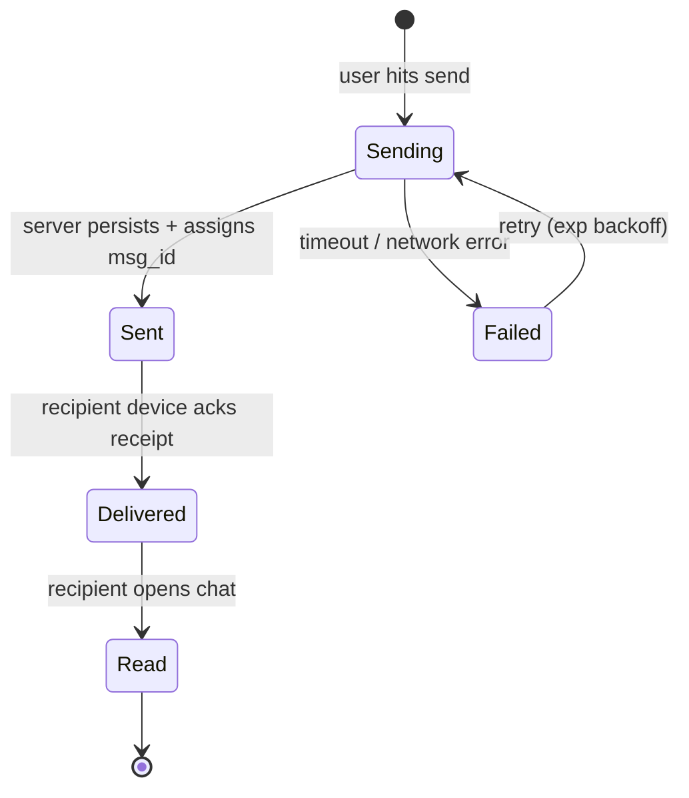
```mermaid
stateDiagram-v2
    [*] --> Sending: user hits send
    Sending --> Sent: server persists + assigns msg_id
    Sent --> Delivered: recipient device acks receipt
    Delivered --> Read: recipient opens chat
    Sending --> Failed: timeout / network error
    Failed --> Sending: retry (exp backoff)
    Read --> [*]
```

The "sent" tick (✓) means the server has the message durably; "delivered" (✓✓) means the recipient device received it but hasn't surfaced it; "read" (✓✓ blue) requires recipient client to explicitly emit a read receipt. WhatsApp delays delivered/read receipts until the user opens the app to save battery — so receipts often arrive in batches.

**Online vs offline message paths — sequence comparison.**

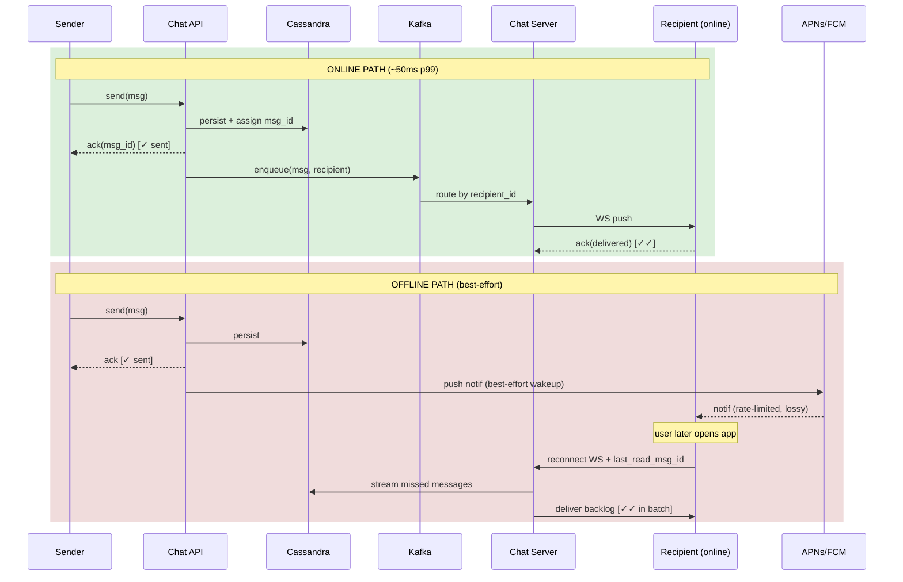
```mermaid
sequenceDiagram
    participant A as Sender
    participant API as Chat API
    participant DB as Cassandra
    participant Bus as Kafka
    participant CS as Chat Server
    participant B as Recipient (online)
    participant APNs as APNs/FCM

    rect rgb(220,240,220)
        Note over A,B: ONLINE PATH (~50ms p99)
        A->>API: send(msg)
        API->>DB: persist + assign msg_id
        API-->>A: ack(msg_id) [✓ sent]
        API->>Bus: enqueue(msg, recipient)
        Bus->>CS: route by recipient_id
        CS->>B: WS push
        B-->>CS: ack(delivered) [✓✓]
    end

    rect rgb(240,220,220)
        Note over A,APNs: OFFLINE PATH (best-effort)
        A->>API: send(msg)
        API->>DB: persist
        API-->>A: ack [✓ sent]
        API->>APNs: push notif (best-effort wakeup)
        APNs-->>B: notif (rate-limited, lossy)
        Note over B: user later opens app
        B->>CS: reconnect WS + last_read_msg_id
        CS->>DB: stream missed messages
        CS->>B: deliver backlog [✓✓ in batch]
    end
```

**Connection density.** *[Source: WhatsApp/Erlang scaling, highscalability.com]* WhatsApp famously pushed a single FreeBSD/Erlang server to **2M concurrent TCP connections** (peak tested at 2.8M before diminishing returns). Total infra: >8000 cores sustaining ~70M Erlang messages/sec. Per-server tuning required custom BEAM patches and FreeBSD kernel work — the scale is achievable but not free. Discord runs Erlang for its gateway tier for the same reason: cheap concurrent processes (millions per node) make WS-per-user practical.

**Discord storage migration.** *[Source: Discord engineering, 2022]* Discord stores **trillions of messages**; ran on Cassandra (177 nodes) until hot partitions caused latency cascades. Migrated to ScyllaDB (C++, no GC) — node count dropped 177 → 72; tail-latency for historical fetches went from 40-125ms → 15ms p99. Key win: a Rust intermediary layer added **request coalescing** (single in-flight DB query for identical concurrent requests). Partitioning is `(channel_id, time_bucket)` with bucket size tuned to keep partitions under ~100MB — a 100k-member server with 100k msgs/day uses 1-day buckets; a 5-member DM uses 1-year buckets.

**Group fan-out cost.** A 500-member group at 10 msgs/min generates 5000 bus entries/min — bounded. A 100k-member "broadcast" group at 10 msgs/min would be 1M bus entries/min — switch product model to channels with read-side fan-out (subscriber pulls from a channel partition rather than receiving N copies).

#### Potential Follow-Up Questions
**Q: What if a chat server holding 1M WebSockets dies?**
Clients detect WS disconnect and reconnect with jittered backoff to a new server (load balancer reroutes). Session registry in Redis is updated by the new server's connect handler. Worst case: ~30s of unread messages, delivered on reconnect via `last_read_msg_id` cursor. *If pushed:* connection draining on planned restarts (close gradually over 5min); for unplanned, surviving servers absorb the load — provision for 1.5x normal capacity.

**Q: How do you guarantee message ordering in a group chat?**
Per-conversation Snowflake sequence ID assigned by the persist service before fan-out — every recipient sees the same monotonic order. Within Cassandra, partition is `chat_id`, clustering key is `msg_id`. *If pushed:* if persist throughput is the bottleneck, shard chats across multiple persist instances by `chat_id` — strict ordering only required within a chat, not across.

**Q: How do you handle a celebrity group chat (5000 members, 100 msg/s)?**
Cap groups (typically ~500). For larger broadcast-style use cases, switch model to channels with separate read-fanout. *If pushed:* use Kafka with a per-group topic; subscribers (chat servers) pull at their own rate, decoupling slow recipients from fast publishers.

**Q: Push vs WebSocket — when do you use which?**
WebSocket while app is foregrounded (low latency, bidirectional, presence). APNs/FCM push for background — OS won't let you keep a socket open. Crossover handled by client telling server "I'm backgrounding, route via push now". *If pushed:* hybrid for low-end devices — always push, with WS only for active conversations to save battery.

**Q: How would you add E2E encryption without breaking history sync?**
Signal protocol — per-recipient session keys; server stores ciphertext only. New device fetches encrypted history and decrypts using device key transferred via QR scan or trusted-device approval. *If pushed:* tradeoff — true E2E breaks server-side search; offer client-side full-text index that ships with each device. WhatsApp does this.

**Q: How do you detect and prevent spam/abuse?**
Rate limit per sender (msgs/s, recipients/day), report flow, and ML signal on metadata (graph patterns, message frequency, link reputation) — content can't be inspected if E2E. *If pushed:* hash-and-report — clients can flag a message and reveal the ciphertext key to platform, which then decrypts only that specific message for review.


**Q: How did Discord get from Cassandra to ScyllaDB and what changed?**
Hot partitions on Cassandra caused latency cascades; large servers (100k+ users) skewed traffic 1000x against small DM partitions. Compaction backlogs and JVM GC pauses meant manual intervention ("the gossip dance"). ScyllaDB is C++ with no GC and a shard-per-core model; same data model, dramatically less ops pain — 177 → 72 nodes, p99 read 40-125ms → 15ms. *If pushed:* the bigger insight was building a Rust data-services layer in front of the DB with **request coalescing** — when 1000 users open the same channel simultaneously, only 1 query hits the DB, not 1000.

**Q: How does WhatsApp/Erlang get 2M connections per server?**
Erlang processes are ~2KB each, GC-isolated, and the BEAM scheduler distributes them across cores cheaply. WhatsApp added custom BEAM patches and FreeBSD kernel tuning. The lesson is architectural: stateful long-lived connections at this density only work on runtimes built for cheap concurrency (Erlang, Go goroutines) — Java/Node hit OS-thread or eventloop limits long before. *If pushed:* Discord uses Elixir (BEAM) for its gateway specifically for this — message-passing per user, no shared state.

**Q: Why batch read/delivery receipts instead of real-time?**
Battery and bandwidth. A 500-member group where everyone reads in 5 seconds = 500×500 receipt events. Clients debounce locally (one receipt per chat per 5s window) and many chat apps only send "read" when the user actually opens the app, not in the background. *If pushed:* you can also coalesce server-side — the persist service compacts read receipts before fan-out to other members.

#### Bottlenecks & Mitigations
- **Connection storm after server restart** → stagger reconnects with jitter. A server holding 1M WebSockets dies, all 1M clients reconnect immediately; surviving servers get hit with a thundering herd that can cascade. Client-side jittered backoff (0-30s random) smears the reconnects over time.
- **Hot group (1000s of msgs)** → chunked fan-out via Kafka. A 500-member group at 100 msgs/s generates 50k bus messages/s; Kafka per-group topic lets subscribers pull at their own rate, isolating slow consumers from fast publishers and absorbing bursts in the broker.
- **History query at scale** → time-bucket partitioning, TTL on old chats. Cassandra partitions per `chat_id` get unboundedly large for active chats; bucketing by `(chat_id, year_month)` keeps partitions small and lets TTL drop old buckets cheaply. Default 1-year TTL on free tier.
- **Mobile battery drain** → push-via-APNs in background; WS only when foreground. Holding a WebSocket open in background drains 10-20% per day; OS will kill the process anyway. Foreground = WS for low-latency presence/typing, background = APNs wakeup with lazy WS reconnect for active conversation only.
- **Sticky routing breaks on rebalance** → drain mode + reconnect to new node. Adding a new chat server requires reshuffling some user→server mappings; brute-force reassignment forces mass disconnects. Drain mode closes connections gradually over 5min, clients reconnect at their own pace, LB routes to the new server based on updated hash ring.

- **Hot partitions in wide-column store** → tune time-bucket size per partition load, add request coalescing in front. Discord's 100k-member servers hit 1000x the traffic of a 5-person DM on the same Cassandra cluster; per-channel time-bucket sizing (1-day for hot, 1-year for cold) plus a Rust coalescing layer cut DB QPS by 10x for trending channels.
- **JVM GC pauses on storage tier** → consider C++/Rust storage (ScyllaDB) for tail-sensitive workloads. Cassandra GC pauses caused unpredictable p99 spikes; ScyllaDB's no-GC C++ shard-per-core architecture removed the variable. Worth the migration cost only above a scale threshold (Discord did it at 177 Cassandra nodes).
- **Connection density on a single box** → use a runtime built for cheap concurrency (Erlang/BEAM, Go). 2M WS connections per server only works on Erlang-class runtimes; Java/Node fall over at 100k. Pick the platform before you architect.

#### Failure Modes
| Layer | Failure | Detection | Mitigation |
|---|---|---|---|
| WebSocket gateway | Chat server crashes and drops thousands of sticky sockets | Connection drop spike and reconnect storm metrics | Client reconnects with jitter, session registry is rewritten on reconnect, and backlog is replayed from durable history |
| Session registry | `user_id → server_id` entry is stale, so messages route to a dead server | Heartbeat-expiry mismatch and unroutable-recipient counter | TTL-based registry entries, frequent heartbeats, and fallback to offline queue / push path |
| Durable store | Persist-before-ack write fails or stalls | Message-write p99 and error-rate alarm | Do not ack sender until durable write succeeds; surface retry to client rather than risking ghost messages |
| Inter-server bus | Recipient partition lags or a broker becomes unavailable | Consumer-lag SLO and undelivered-online-message counter | Replay from bus or store, apply backpressure, and degrade to delayed delivery without losing durability |
| Push provider | Offline wakeup push fails repeatedly | APNs/FCM error rate and offline backlog growth | Treat push as best-effort wakeup only; messages remain durable for reconnect replay |
| Receipt pipeline | Read/delivery receipts storm large groups | Receipt queue depth and fan-out latency spike | Batch and debounce receipts, especially in large groups, and keep them off the critical send path |

#### Observability — Key Metrics & SLOs
- **Send-to-ack latency** — sender-perceived durability SLO; should stay low even under group fan-out.
- **End-to-end online delivery latency** — durable write to recipient WebSocket push for active users.
- **Offline backlog depth** per user / chat — rising backlog indicates routing or reconnect problems.
- **Active WebSocket connections per node** — essential for capacity planning and reconnect-storm detection.
- **Bus lag per recipient partition** — shows when cross-server routing is falling behind before users complain.
- **Receipt latency** (delivered/read) — secondary UX metric that often reveals mobile wakeup problems.

#### Multi-Region & DR
- **Replication mode:** messages are durably stored in the user's home region and asynchronously replicated to DR; connection gateways are region-local and disposable.
- **RTO:** seconds to minutes for gateway-node failure, bounded by reconnect jitter; longer for full-region failover, gated by message-store promotion.
- **RPO:** near-zero for accepted messages if the durable store uses quorum writes; sockets themselves are ephemeral and fully lost on failover.
- **Failover cadence:** test both gateway reconnect storms and store-level replay from a cold region.
- **Cross-region cost:** high if you try to home one chat globally; most systems region-home users or conversations and pay inter-region only for remote recipients.

#### Common Mistakes / Anti-patterns
- **Acking before durability.** The sender seeing “sent” must mean the message exists durably, not merely that one server process accepted it.
- **Direct chat-server to chat-server coupling.** A bus or recipient-routed stream is cleaner and survives rebalance better than ad hoc point-to-point routing.
- **Demanding global ordering.** Chat only needs ordering within a conversation, not across the whole product.
- **Treating presence as durable money-grade state.** Presence is ephemeral and TTL-based; over-engineering it into the durable path adds cost without value.
- **Using the same path for 1:1, group, and broadcast channels.** Very large groups want a different fan-out model.

#### Talking Points for the Interview
- **Persist before ack** is the first thing to say; it sets the delivery contract correctly.
- **Sticky WebSockets simplify connection state.** You pay reconnect complexity to avoid distributed connection handoff on every message.
- **Recipient routing goes through a bus, not direct peer calls.** That is the scaleable inter-server pattern.
- **Ordering is per chat.** A per-conversation sequence is enough and far cheaper than global serialization.
- **Offline replay is cursor-based.** The reconnect story is “give me everything since last seen message.”
- **Push notifications are wakeups, not delivery guarantees.** The durable store is what actually guarantees message availability.

### 10. Design a Search Autocomplete (Google Suggest)
#### Problem
Suggest top queries as the user types, ranked by popularity, with sub-100ms response times.

#### Summary
**The picture in your head:** a library reference desk where the librarian has memorized the 10 most popular books for every possible opening phrase of a question. You say "how do I bake" and without consulting any catalog she immediately says "chocolate cake, sourdough bread, banana bread." She built that knowledge over years of watching what people ask — but she updates her notes every hour. At the desk itself, no searching happens — just recall.

**The single-request walkthrough:** a user types "wea" (three keystrokes). Their browser fires `GET /suggest?q=wea`. The request first hits a CDN edge node — a geographically close cache server (like Cloudflare in a nearby city). The CDN has "wea" cached (short prefixes are requested millions of times a day by millions of users, so they are always in cache). The CDN returns `["weather", "weather today", "wearable tech"]` in under 10ms without touching your servers. If the CDN misses — say the user types "weathe" and this particular 6-character prefix is rarer — the request reaches a serving node. The serving node has an in-memory trie loaded from the last hourly snapshot. A trie is a tree where each node is a character: "w" → "e" → "a" → "t" → "h" → "e" is the path for "weathe". Every node in the trie pre-stores its top-10 suggestions. The node for "weathe" already has `["weather", "weather app", "weather forecast"]` attached. The serving node reads those three entries and returns them. No scanning, no sorting — just a lookup.

**The pieces (and what each one is for):**
- **Trie (a prefix tree with precomputed top-K at every node)** — a trie is a tree where each edge is a character. The path from root to any node spells a prefix. The crucial addition: every node stores the top-10 queries that start with that prefix (precomputed at build time). A lookup walks the path character-by-character and reads the precomputed list at the final node. O(length of prefix) total — no subtree scan.
- **Hourly batch build pipeline** — every hour, a Spark job reads the last hour of query logs (10 billion queries per day = ~416 million per hour), aggregates query frequency, builds the trie bottom-up (children first, then each parent computes its top-10 from its children's top-10 lists), compresses it to a Finite State Transducer (an FST — a compact representation that shares common suffixes between words, cutting size 5–10x), and uploads the snapshot to object storage. The build is expensive but offline — users never wait for it.
- **FST (Finite State Transducer) for production serving** — a naive trie using hashmaps takes ~60GB for 100 million queries. An FST exploits the fact that words like "running," "jumping," "walking" all share the "-ing" suffix — that suffix path is stored once. An FST cuts the same data to ~6–12GB, fitting on a single server. The tradeoff: FSTs are immutable, but since we rebuild every hour anyway, mutability is not needed.
- **CDN for short prefixes** — autocomplete queries for "t", "th", "the" are issued by millions of users every minute. The suggestions for those prefixes are identical for all users (ignoring personalization). A CDN caches the response and serves it from hundreds of edge locations worldwide. About 95% of autocomplete QPS resolves at the CDN with no backend involvement.
- **Mini-trie for real-time trends** — hourly builds miss breaking news. If "earthquake california" starts trending at 2:47pm, it will not appear in suggestions until the 3pm snapshot. A streaming aggregator (Flink) builds a small additional trie every 60 seconds from the last hour of query logs. At serve time, the serving node merges results from the base hourly trie and the mini-trie. Cost: ~50–100MB of extra RAM per serving node.
- **Personal history merge** — the global trie is shared across all users. Personalization is a small layer on top: fetch the user's last 50 queries from a Redis cache, merge the top 3 personal matches with the top 7 global matches, return the blended list. The trie itself never contains per-user data.

**The thing that makes it hard:** some prefixes receive hundreds of times more traffic than others. The prefix "t" alone might get 2 million queries per second globally — every English word starting with "t" generates traffic on that node. Sharding the trie by prefix (shard 1 handles "a*", shard 2 handles "b*") means the "t" shard gets overwhelmed while the "z" shard is idle. Without mitigation, the "t" shard becomes the bottleneck for the entire system. The fix: replicate hot shards aggressively. Since the trie is read-only between rebuilds, adding 10 replicas of the "t" shard is trivially cheap — just load the same snapshot into 10 servers. The CDN absorbs the bulk of single-character prefix traffic anyway.

**Why the standard solution works:** moving ranking and aggregation to the build pipeline eliminates the need for any complex computation on the hot path. At 20 million queries per second, even a 1-millisecond computation per query would require 20,000 CPU cores just for aggregation. The serving path reduces to: walk a few characters in a trie, read a precomputed list. That is fast enough that the network round-trip dominates latency, not the computation.

**If you were building it tomorrow:**
- Build pipeline: Spark hourly job on S3 query logs → aggregated frequencies → FST snapshot built with the `dawgdic` or `levenshtein_automata` library → snapshot uploaded to S3 → serving nodes pull and do an atomic file swap.
- Serving node: in-process FST loaded in RAM; personal history from Redis.
- CDN: Cloudflare with `Cache-Control: public, max-age=60` on suggest responses (1-minute TTL balances freshness with edge hit rate).
- Hot path pseudocode:
  ```
  def suggest(prefix, user_id):
    base_results = fst.lookup(prefix)[:10]       # in-memory, ~0.1ms
    mini_results = mini_trie.lookup(prefix)[:5]  # streaming overlay
    personal = redis.get(f"history:{user_id}")[:3]
    return merge_and_rank(base_results, mini_results, personal)[:10]
  ```
#### Clarifying Questions
- Personalization?
- Typo tolerance?
- Multilingual?
- How often does suggestion list refresh? (real-time vs hourly)
- Number of suggestions per response (5? 10?)

#### Requirements
- **FR:** return top-k suggestions for prefix; rank by frequency × recency
- **NFR:** <50ms p99; updated within hours; scale globally

#### Scale Estimate
- **Search volume:** Google public stat ~99k searches/s = ~8.5B/day; round to 10B searches/day for headroom → 10B raw queries/day to ingest into the build pipeline.
- **Autocomplete QPS:** typing flow per query — ~20 keystrokes avg, with a ~150ms debounce that collapses ~2 keystrokes per network call → ~10 calls/query; some users abandon mid-type → effective ~5 calls/query (debounce halves it again on slower networks). 10B queries/day × ~50 calls/query (worst-case desktop with no debounce) = ~500B calls/day; 500B ÷ 86,400 ≈ ~6M QPS steady; daytime peak (US+EU overlap) ~3× → ~20M QPS.
- **Suggestion payload:** ~10 suggestions per response × ~30B each (text ~25B + float score 4B + JSON framing) = ~300B per response — sub-MTU and CDN-cacheable on `(prefix, locale)`.
- **Trie size in RAM:** keep top ~100M unique queries (long tail beyond that has no real signal); avg query ~20 chars; trie node ~30B (children pointer map + top-K refs + score). 100M × 20 × 30B = ~60GB raw; FST/double-array compression cuts ~5–10× → ~6–12GB per shard.
- **Snapshot size:** rebuild hourly → ~60GB raw snapshot/hour written to object store; replication factor 3 → ~180GB stored per hour; retain 24h for rollback = ~4.3TB hot snapshots.
- **Cold archive:** daily query-frequency aggregates compress hard (high duplication, columnar ints) → ~10GB/day Parquet × 365 = ~3.6TB/yr — cheap to keep indefinitely for trend analysis and seasonal models.
- **Hot vs cold:** trie shards live in RAM (sub-ms p99 lookup); raw query logs flow through a 24h hot stream (Kafka) before the hourly build job aggregates them into the trie and drops the raw logs to cold object store.

#### API Contract
```
GET /suggest?q={prefix}&limit=10
  → { suggestions: [{text, score}], latency_ms }
```

#### High-Level Design
```
Build pipeline (offline, hourly):
  Query logs ─→ partitioned event stream ─→ Aggregator ─→ Top-K builder ─→ Trie ─→ Snapshot to object store
                                                                    │
                                                          ┌─────────┴─────────┐
                                                          ↓                   ↓
Serve path (online):                                  Trie Shard 1 ...  Trie Shard N
  Client ─→ CDN (popular prefixes) ─miss→ App ──prefix-route──→  shard
              │                                                      ↓
              └─cache────────────────────────────  return top-k from prefix node
```

**How to read the diagram:** almost all the heavy work happens before a user types anything. Batch jobs build an in-memory trie from past query logs, and serving nodes answer a request by walking that trie and returning the precomputed top suggestions for the prefix.

**Why the flow is shaped this way:** autocomplete traffic arrives one keystroke at a time, which means query-time scanning is a non-starter. The system moves ranking and aggregation offline so the serving path only does a tiny amount of prefix lookup work.

**What this layout buys you:** very low latency and predictable serving cost even at huge QPS. The tradeoff is freshness: if trends change faster than the rebuild cadence, you need a small delta path beside the main snapshot pipeline.

#### Data Model
**Trie node** (in-memory):
```
struct Node {
  children: map<char, Node>     # or array[26]
  top_k: list<(query, score)>   # cached top suggestions for this prefix
}
```

Each node stores its precomputed top-k → no traversal needed at serve time.

#### Detailed Design
**Why cache top-k at every node:**
- Lookup = hash to node → return top_k → done. O(prefix_length) total.
- Without cache, you'd traverse subtree at request time → too slow.

**Build process:**
1. Aggregate query frequencies from logs (hourly)
2. Build trie bottom-up
3. At each node, compute top-k from union of children's top-k
4. Snapshot trie → push to all serving nodes → atomic swap

**Sharding.** Partition the trie by prefix — first 1-2 chars determine shard. Shard 1 owns the "a*" subtree, shard 2 owns "b*", etc. Routing is trivial (hash on prefix prefix), and each shard's working set is bounded. The downside is density skew: English queries cluster heavily on "t" (the, to, today), "h" (how, here), "w" (what, where) — those shards see 10x the QPS of "z" or "x".
- Hot shards (e.g., "h", "the") → replicate aggressively (5-10x replication factor) so the QPS spreads across replicas. Cheap because the trie is read-only between rebuilds.
- Skewed beyond replication-fix → switch to hash-based sharding, which gives uniform load but scrambles locality (you lose the "scan a subtree from one node" property; less of a concern when each query is just a hashmap lookup anyway).

**Personalization.** Keep the global trie shared across all users — putting per-user data in the trie would explode storage. At request time, fetch the user's recent query history (Redis, last 50 queries with timestamps) and merge with the global top-K: typically top-3 personal slots + top-7 global. Tiebreakers favor personal matches if the global score is close. Example: a user who searches "kotlin coroutines" daily sees that as the top suggestion for "kot" even when global trends point at "kotaku news".

**Typo tolerance.** Three options, each with a different trade-off. (1) Pre-expand: at trie-build time, generate edit-distance-1 variants of each top query and add them as separate trie entries — explodes trie size 5-10x but no runtime cost. (2) BK-tree side-index: a separate metric tree of common queries supports fuzzy lookup when the prefix has zero hits — adds 50-100ms latency on the fallback path. (3) Punt entirely: let the user submit the typo'd query and the search engine's "did you mean" handle correction post-submit — fastest, loses some autocomplete utility. Google does (3); most ecommerce search does (1).

**Multilingual.** Build one trie per language (or per locale, where regional variants matter — pt-BR vs pt-PT). The serving stack picks the trie based on the user's `Accept-Language` header or explicit locale setting; CJK languages (Chinese, Japanese, Korean) need pre-tokenization since they don't have spaces — input is converted to pinyin/romaji or segmented into character n-grams before trie lookup. Storage cost is roughly linear in number of locales because each language has its own popular-query distribution; sharing a single global trie would mix scripts and noise rankings. Mixed-language queries (English brand names typed in a Spanish session) are handled by querying the user's primary trie first and falling back to a secondary English trie if zero hits.


**Build pipeline vs serving path — visual.** Build is offline batch; serve is hot path with strict p99.

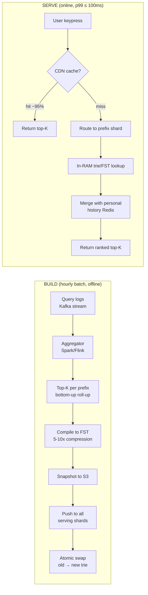
```mermaid
flowchart LR
    subgraph Build["BUILD (hourly batch, offline)"]
        L[Query logs<br/>Kafka stream] --> Agg[Aggregator<br/>Spark/Flink]
        Agg --> Top[Top-K per prefix<br/>bottom-up roll-up]
        Top --> FST[Compile to FST<br/>5-10x compression]
        FST --> S3[Snapshot to S3]
        S3 --> Push[Push to all<br/>serving shards]
        Push --> Swap[Atomic swap<br/>old → new trie]
    end
    subgraph Serve["SERVE (online, p99 ≤ 100ms)"]
        U[User keypress] --> CDN{CDN cache?}
        CDN -->|hit ~95%| R1[Return top-K]
        CDN -->|miss| Shard[Route to prefix shard]
        Shard --> Mem[In-RAM trie/FST lookup]
        Mem --> Merge[Merge with personal<br/>history Redis]
        Merge --> R2[Return ranked top-K]
    end
```

The build path tolerates minutes of latency (it runs hourly); the serve path budgets ~100ms total round-trip including network. The CDN absorbs ~95% of QPS because most traffic hits short prefixes ("t", "th", "the") that are stable across users.

**Trie vs FST comparison.** *[Source: Lucene FST docs, real-world autocomplete deployments]*

| Property | Hashmap-trie | FST (Finite State Transducer) |
|---|---|---|
| RAM (10M queries, 12-char avg) | ~60GB | ~6-12GB (5-10x compression) |
| Lookup | O(prefix) hashmap chain | O(prefix) state transitions |
| Mutation | cheap (per-node insert) | expensive (rebuild whole structure) |
| Best for | dev / mutable | prod / immutable hourly snapshot |

FST exploits **shared suffixes** (every word ending "-ing" reuses one trailing path) and shared prefixes (every word starting "anti-" shares a leading path). It's structurally minimal: there is exactly one path per accepted string. This is why Lucene uses FSTs for term dictionaries — the same property that makes them small also makes them ideal for read-only hourly snapshots that get pushed to all serving nodes.

**Real-time mini-trie for trends.** A streaming aggregator (Flink) builds a small trie every 60 seconds from the most recent query stream and serving nodes consult both — base hourly trie + minute-level mini-trie — and merge top-Ks at request time. Cost: each serving node holds an extra ~50-100MB of mini-trie state. Win: breaking news ("earthquake", "election results") shows up in suggestions within a minute instead of an hour.

**Latency budget.** Industry target is ~100ms p99 from keypress to suggestion render. Network alone consumes 30-50ms (one round trip on mobile); the serving stack must finish in ≤50ms. CDN edge serves ~95% of QPS in <10ms. A miss costs ~30-40ms (route, memory lookup, merge with personal history). Anything more and the user has typed the next character before suggestions arrive — feels broken.

#### Potential Follow-Up Questions
**Q: What if a serving shard goes down?**
Each shard is replicated 3x; LB routes around dead nodes. Trie snapshot in S3 means a new replica can warm up in minutes. Worst case: serve from CDN cache until replacement is up. *If pushed:* during rebuild, fall back to a smaller "head-only" trie (top 1% of queries) that fits on every node — degrades quality but not availability.

**Q: How do you handle real-time trends (breaking news in last 5 minutes)?**
Mini-trie built every minute from a sliding window of recent queries, merged with the hourly base trie at serve time. *If pushed:* tradeoff between freshness and noise — too short a window and one bot can spike a query; mitigate with bot detection + rate limits before counting.

**Q: How would you support typo tolerance?**
Pre-expand each query into common edit-distance-1 variants and add them to the trie. Or use a BK-tree side-index for fallback fuzzy lookups when the prefix has zero hits. *If pushed:* avoid both — let the search engine's "did you mean" handle it after submission. Autocomplete on raw prefix is faster and users mostly self-correct.

**Q: How do you personalize without blowing up the trie?**
Keep the global trie shared. Personalization is a separate per-user query history (Redis), merged at serve time — top-3 personal + top-7 global. *If pushed:* learned re-ranker on top of merged candidates uses user features (location, past queries) — heavier but cleaner than trying to bake personalization into the trie itself.

**Q: How do you prevent suggesting offensive or sensitive queries?**
Blocklist applied at trie-build time — filter out queries matching blocked patterns before they reach any node's top-K. Periodic ML classifier re-runs on the candidate set. *If pushed:* serve-time filter as defense-in-depth; legal/regional variants (EU vs US) maintained as separate trie overlays.

**Q: How would you scale this 10x to 100B queries/day?**
Add more prefix shards and replicate hot ones aggressively (geographically). Most cost is in CDN, not backend — push more prefixes to CDN edge. *If pushed:* swap from RAM trie to FST (5-10x compression) so each shard holds more; trade some lookup latency for memory headroom.


**Q: Why FST over hashmap-trie in production?**
RAM. A hashmap-based trie at 10M queries (12-char avg) is ~60GB; an FST compresses to 6-12GB by sharing suffix paths (every "-ing" path is one). FSTs are immutable, but autocomplete rebuilds hourly anyway so mutability isn't required. Lucene uses FSTs for the same reason. *If pushed:* the trade is build complexity — FST construction is non-trivial vs trivial trie inserts. Use a trie in dev, compile to FST for prod snapshot.

**Q: What's the latency budget end-to-end?**
~100ms p99 from keypress to suggestion render. Network round-trip on mobile is 30-50ms; serving stack must finish in ≤50ms. CDN edge handles ~95% of traffic in <10ms; misses cost ~30-40ms (shard route + RAM lookup + personal-history merge). Beyond 100ms, users have typed the next character — feels broken. *If pushed:* client-side prefetch on the next likely character ("if user typed 'th', request suggestions for 'tha', 'the', 'thi' speculatively") trades bandwidth for perceived latency.

#### Bottlenecks & Mitigations
- **Trie size in RAM** → finite state transducer (FST) compresses 5–10×. A naive char-tree with hashmaps is ~60GB; FST exploits shared suffixes (every word ending in "-ing" shares a path) and compresses to 6-12GB per shard, fitting comfortably on a single box.
- **Hot prefix** → CDN cache + replicate shard. Single-char prefixes ("t", "a") see 100x the QPS of long prefixes; CDN absorbs ~95% and shard replication handles the rest. Most users only type 2-3 characters before clicking a suggestion, so short prefixes dominate.
- **Build time on log explosion** → sample logs (1%) for tail; full for head. A viral event 10x's query volume; the aggregator can't keep up with raw logs. Sampling preserves the head distribution (popular queries still dominate top-K) and only the long tail loses statistical resolution — acceptable because long-tail queries weren't going to make any node's top-10 anyway.
- **Stale suggestions for trends** → near-real-time mini-trie for last hour, merged at serve. Hourly rebuild misses breaking news (e.g., "earthquake" trending in 5 min). A streaming aggregator builds a small trie every minute from the recent-query stream and serving nodes consult both — base trie + mini-trie — and merge top-Ks.

- **Tight latency budget** (~100ms p99 end-to-end) → CDN at edge, FST in RAM, no DB round-trips on hot path. Network alone consumes half the budget on mobile; the serving stack has ~50ms total. Anything that touches a DB (personalization, ranking) must hit RAM or Redis with sub-ms latency.
- **Snapshot push to N shards** → S3 + atomic swap. Pushing a 10GB FST snapshot to hundreds of serving shards via direct copy would saturate egress. Upload once to S3, shards fetch in parallel, atomic file swap (rename) makes the cutover instant per shard.

#### Failure Modes
| Layer | Failure | Detection | Mitigation |
|---|---|---|---|
| Snapshot distribution | New trie/FST snapshot is corrupt or incomplete on some shards | Checksum mismatch and snapshot-activation failure alert | Verify checksums before swap, keep last-known-good snapshot loaded, and roll back atomically |
| Hot shard | Prefix shard for common prefixes saturates | Per-shard QPS skew and latency spike | Replicate hot prefixes aggressively and let CDN absorb the shortest prefixes |
| Trend overlay | Mini-trie or recent-query overlay stalls | Overlay age and recent-trend miss canary | Serve from the base hourly snapshot only until the streaming overlay recovers |
| Personalization cache | Recent-history lookup is slow or unavailable | Personalization merge latency and cache miss spike | Fall back to global suggestions rather than delaying autocomplete |
| Edge caching | CDN cache stampede on a popular prefix after snapshot roll | Origin QPS spike on short prefixes | Pre-warm top prefixes on rollout and single-flight origin recomputation |
| Policy filter | Suppression rules fail and unsafe suggestions leak into top-K | Blocklist match canary and policy-violation audit | Apply filtering at build time and again at serve time as defense in depth |

#### Observability — Key Metrics & SLOs
- **Autocomplete latency** — end-to-end keypress to response, with backend p99 comfortably below the network budget.
- **Prefix-shard QPS skew** — shows whether replication strategy for hot prefixes is still adequate.
- **Snapshot build duration and publish lag** — trending freshness depends on not stretching the batch cycle.
- **Mini-trie freshness** — age of the streaming overlay for breaking-news terms.
- **CDN hit rate by prefix length** — short prefixes should overwhelmingly resolve at the edge.
- **Suppressed-suggestion rate** — catches policy regressions and malformed query floods.

#### Multi-Region & DR
- **Replication mode:** read-only trie shards are replicated globally per locale; they are ideal CDN/origin workloads.
- **RTO:** very fast for serving-node failure because shards are immutable and reloadable from object storage snapshots.
- **RPO:** bounded by the latest successfully published snapshot plus any recent-query overlay lag.
- **Failover cadence:** snapshot rollback drills matter more than classic database failover because the data plane is immutable.
- **Cross-region cost:** mostly snapshot distribution and CDN fill, not transactional replication.

#### Common Mistakes / Anti-patterns
- **Scanning the subtree on every keystroke.** The whole point of the design is to move that work to build time.
- **Mutating the trie on the hot path.** Immutable snapshots keep serving fast and operationally simple.
- **Building per-user tries.** Personalization should be a small merge on top of a shared global structure.
- **Ignoring client debounce.** Autocomplete QPS assumptions are nonsense if every keypress becomes a network call.
- **Treating typo tolerance as free.** Fuzzy matching needs a separate budget and often a separate index.

#### Talking Points for the Interview
- **Top-K cached at every prefix node** is the central idea; say it immediately.
- **Snapshot swap beats incremental in-place mutation** for simplicity and predictability.
- **FST is the production memory answer.** Trie in dev, compressed automaton in prod is a strong interview answer.
- **Short prefixes belong at the CDN edge.** Most traffic is massively skewed there.
- **Global plus personal merge** is the personalization story; the trie stays shared.
- **A recent-query overlay handles trends** without making the base serving path mutable.

### 11. Design YouTube
#### Problem
Upload, transcode, store, and stream video globally with adaptive bitrate, search, and recommendations.

#### Summary
**The picture in your head:** a film studio's distribution operation. A director hands in raw footage (upload). A post-production team makes versions for IMAX, standard screens, small TVs, and phones — same film, seven different formats (transcoding). The copies are distributed to thousands of movie theaters in advance (CDN caching). When you buy a ticket, the theater plays the right format from its local copy — not a live stream from the studio in Hollywood. The studio is involved once per film, not once per viewer.

**The single-request walkthrough:** a creator uploads a 20-minute tutorial video (about 2.5GB raw). The upload is chunked — the client splits the file into 5MB pieces and sends them one at a time, getting an acknowledgment for each. If the connection drops, it restarts from the last confirmed chunk. The final chunk triggers the transcoding pipeline. The pipeline first splits the video into 120 six-second segments (6 seconds is the standard "chunk" size for streaming). Those 120 segments are processed in parallel by GPU workers: each segment gets encoded at seven resolutions (240p, 360p, 480p, 720p, 1080p, 1440p, 4K). That is 120 × 7 = 840 encoding jobs running simultaneously. Each job produces a short file called a `.ts` segment. A packaging step assembles the segments into an HLS manifest — a text file that tells the video player "for 1080p, here are the URLs for chunks 1 through 120." The manifest and all chunks land in object storage (like S3). The video status flips to "READY." A viewer opens the video. Their player downloads the manifest, picks a starting resolution based on their connection speed, and starts fetching 6-second chunks from the CDN.

**The pieces (and what each one is for):**
- **Chunked resumable upload** — the client splits the file and uploads sequentially, tracking which chunks are confirmed. If the upload fails at chunk 47, it resumes from chunk 47 — not the beginning. Necessary because a 2.5GB file over a mobile connection will fail without this.
- **Transcoding pipeline (a DAG of jobs)** — a DAG (directed acyclic graph) is a set of tasks with dependencies: segment-splitting must finish before encoding begins, all encoding jobs for a segment must finish before packaging begins. Workers on GPU servers run encoding jobs in parallel. A GPU (like NVIDIA's NVENC chip) encodes H.264 video roughly 5 times faster than a CPU — critical at 500 hours of video uploaded per minute. The pipeline is orchestrated by a task scheduler (like Temporal) that handles retries, partial failures, and status tracking.
- **HLS (HTTP Live Streaming)** — Apple's streaming protocol. The video is divided into short chunks (6 seconds each) and a plain-text manifest file lists all the chunks at each available bitrate. The video player downloads the manifest once, then fetches chunks one at a time. This is "adaptive bitrate" (ABR): after each chunk, the player measures how fast the download went. If it was slow, the next chunk is requested at a lower bitrate (smaller file, lower quality but no buffering). If fast, higher bitrate. Viewers on shaky mobile connections see smooth playback instead of a spinning buffer indicator.
- **CDN (Content Delivery Network)** — a global network of cache servers close to users (Cloudflare, Akamai, or at YouTube's scale, physical hardware inside ISPs called Google Global Cache). Video chunks are static — they never change after transcoding. So a CDN can cache every chunk and serve it from the nearest city. A viewer in Berlin gets chunks from a CDN server in Frankfurt, not from a Google data center in Virginia. At YouTube scale, ~95% of bytes are served by CDN without ever touching Google's origin servers.
- **Storage tiering** — object storage has cost tiers. Hot tier (S3 Standard): expensive, millisecond access. Warm tier (S3 Infrequent Access): cheaper, still millisecond. Cold tier (Glacier): very cheap, minutes to restore. 80% of YouTube views hit 5% of videos. The other 95% of videos — the long tail nobody watches — can live in Glacier at a fraction of the cost. Lifecycle policies automatically move videos between tiers based on last-access time.
- **Metadata + recommendation services** — a separate concern from media delivery. The metadata service stores title, description, view count, like count. The recommendation service (two-stage: offline candidate generation + online ranking) decides what appears on the home screen. These are logically separate systems that happen to share a user interface.

**The thing that makes it hard:** a Champions League final reaches full-time with a 1–1 scoreline. The winner is decided on penalties. 500 million people all click the highlights video simultaneously 90 seconds after the final whistle. The video was uploaded 10 minutes ago. The CDN has barely cached anything. All 500 million requests are cache misses. They all go to origin. Origin cannot handle 500 million simultaneous requests. This is the cold-cache stampede at catastrophic scale. The fix: predictability and pre-warming. YouTube knows this final is happening and pre-positions chunks at CDN points-of-presence worldwide hours in advance. For unexpected viral events, a "shield cache" layer sits in front of origin — when 1000 CDN edge nodes simultaneously miss the same chunk, they all ask the shield, which issues exactly one request to origin and fans the response to all 1000.

**Why the standard solution works:** the pipeline separation (upload → transcode → serve) is what makes scale possible. Transcoding is expensive — you want to do it once, not once per viewer. Serving is cheap once the chunks exist and the CDN has them. The system spends compute dollars at upload time so it can spend almost nothing per view.

**If you were building it tomorrow:**
- Chunked upload: pre-signed S3 multipart upload URLs handed to the client; client uploads directly to S3, bypassing your servers.
- Transcode pipeline: Kafka job queue, GPU workers running ffmpeg with NVENC, Temporal for DAG orchestration.
- Serving: HLS manifests and TS chunks in S3, fronted by CloudFront (CDN) with `Cache-Control: public, max-age=86400`.
- Hot path for playback (entirely CDN-served):
  ```
  client → GET /manifests/{video_id}/1080p.m3u8  (CDN hit, ~10ms)
  client → GET /chunks/{video_id}/1080p/seg-001.ts (CDN hit, ~15ms)
  client measures bandwidth → requests seg-002 at 720p or 1080p
  repeat every 6 seconds
  ```
#### Clarifying Questions
- Live streaming in scope? (assume on-demand only)
- Resolutions to support? (240p–4K)
- Watermark / DRM?
- Avg video length and upload rate?
- Comments/likes/recos in scope?

#### Requirements
- **FR:** upload, transcode, stream (HLS/DASH), search, comments, recommendations, thumbnails
- **NFR:** global low-latency playback, durable, scalable, reliable transcoding

#### Scale Estimate
- **Upload rate:** YouTube public figure ~500 hours uploaded/min (creator-day data, post-2019). 500 × 60 = 30k hours/hr × 24 = 720k hours/day; 720k ÷ 3600 ≈ ~8.3 hours of video uploaded every second.
- **Avg video length:** weighted ~12 min — Shorts <60s dominate count but not duration, vlogs 5–15 min, podcasts/streams 1–3hr push the mean up. 720k hours × 60 / 12 min/video = ~3.6M videos/day; conservative ~1.5M/day at the 12-min mean accounts for re-uploads + Shorts being a separate pipeline.
- **Upload concurrency:** assume ~10% of 1B+ DAU are creators × ~1 upload/week = ~14M uploads/day; spread over ~6h active US/EU window with chunked resumable streams (5–30 min/upload on mobile) → ~30k in-flight uploads at peak.
- **Raw video size:** consumer phone camera ~2.2 Mbps avg after container/codec pre-processing → 2.2 Mbps × 3600s ÷ 8 ≈ ~1GB/hour. 720k hours × 1GB = **~720TB/day raw ingest**.
- **Variant ladder:** 7 resolutions (240p, 360p, 480p, 720p, 1080p, 1440p, 4K) × ~2 codecs (H.264 universal + AV1 for top-watched titles to save egress); ladder sums to ~5× raw on average after per-rung encoding wins (lower rungs are tiny, top rungs dominate). 720TB × 5 = **~3.6PB/day encoded**.
- **Bitrate × duration math:** 1080p H.264 ~5 Mbps × 3600s ÷ 8 = ~2.25GB/hr; 4K AV1 ~15 Mbps × 3600s ÷ 8 = ~6.75GB/hr — the top two rungs alone account for ~60% of encoded storage even though they serve a smaller share of watches.
- **Replication:** encoded blobs at 3× in hot object store (durability + cross-region) → 3.6PB × 3 = ~10.8PB/day hot, × 365 ≈ **~4 EB/year** before tiering.
- **Hot tier:** last 30 days + popular long-tail (~5% of catalogue) on SSD-backed POPs; Pareto holds — ~80% of watch time hits that ~5%.
- **Cold tier:** ~90% of titles fall to infrequent-access after 30 days (10× cheaper $/GB), glacial archive after 1 year (~50× cheaper). Pays for itself because the long tail is mostly never re-watched.
- **Watch egress:** ~1B+ DAU × ~1 hour/user/day = ~1B hours watched/day; at avg ~720p ABR ≈ ~2.5 Mbps blended × 3600s × 1B ÷ 86,400s = ~80 Tbps avg egress; global event peaks (live World Cup goal) ~6× → ~500 Tbps. CDN absorbs >95%; ISP-embedded caches (Google Global Cache appliances) absorb most of the rest.
- **Chunk size:** HLS/DASH segment ~6s; at 1080p (~5 Mbps) → 6 × 5 ÷ 8 = ~3.75MB ≈ ~3.4MB after container overhead; manifest ~5KB. Chunks are the unit of CDN cache key, cross-user dedup, and ABR switch boundary.

#### API Contract
```
POST /upload/init       → { upload_id, chunked_url }
PUT  /upload/{id}/chunk body: bytes  → { offset_acked }
POST /upload/{id}/finish → { video_id }
GET  /video/{id}         → metadata + manifest URL (HLS .m3u8)
GET  /video/{id}/stream  → HLS chunks (served by CDN)
```

#### High-Level Design
```
UPLOAD:
  Client ──chunked upload──→ Edge Origin ──→ object store (raw)
                                             │
                                             ↓
                                     Transcoding DAG
                                             │
                ┌────────┬──────────┬────────┼──────────┬─────────┐
                ↓        ↓          ↓        ↓          ↓         ↓
              240p     360p       480p     720p      1080p      4K
                └────────┴──────────┴────┬───┴──────────┴─────────┘
                                         ↓
                                   HLS package (manifest + 6s chunks)
                                         ↓
                                   object store (encoded) → CDN

PLAYBACK:
  Client ─→ CDN ──hit──→ HLS chunks (binary)
             │
             └─miss──→ Origin → CDN populate → return

  Client ABR loop: measure bandwidth → request next chunk at appropriate bitrate
```

**How to read the diagram:** uploads, processing, and playback are separate stages. A creator uploads one original file, a media pipeline turns it into many streamable variants, and viewers later fetch those prepared assets from caches and CDNs rather than from the upload path.

**Why the flow is shaped this way:** the work needed to make a video playable everywhere is expensive and asynchronous, so it should happen once per upload, not once per view. Playback then becomes a simpler problem of serving the right chunks to the right viewer at the right quality.

**What this layout buys you:** scalable uploads, efficient playback, and the ability to serve the same content across many device and network combinations. The tradeoff is a large transcode pipeline and a delay between upload and full playback readiness.

#### Data Model
- **videos** (transactional store, sharded by video_id):
  `(video_id Snowflake, owner_id, title, desc, duration, status, created_at)`
- **video_variants** (wide-column store): `(video_id, resolution, codec, manifest_url, byte_size)`
- **raw blobs** (cold object store): `raw/{video_id}.mp4`
- **encoded blobs** (hot object store): `enc/{video_id}/{res}/seg-{n}.ts`
- **search index**: title, tags, transcript

#### Detailed Design
**Transcoding pipeline (DAG):**
```
Raw upload
   │
   ↓
Validate (mediainfo)
   │
   ├──→ Split into segments (6s each, parallelizable)
   │
   ├──→ Encode segment × N resolutions (GPU)
   │
   ├──→ Package HLS / DASH (TS / fMP4 chunks + manifest)
   │
   ├──→ Generate thumbnails
   │
   └──→ Update video status to READY → notify uploader
```

Workers pull jobs from Kafka. Use ffmpeg / proprietary encoder. GPU acceleration (NVENC) cuts H.264 encode time ~5x vs CPU; AV1 still expensive enough that it's reserved for top-watched titles where the bandwidth savings repay the GPU cost.

**ABR (adaptive bitrate).** Client buffers 2-3 chunks ahead and measures the per-chunk download time; effective bandwidth = `chunk_bytes / download_time`. The next chunk request picks the highest bitrate variant ≤ a fraction (typically 0.7-0.8x) of measured bandwidth — the safety margin avoids flapping when the network jitters. The manifest exposes all bitrate variants so the switch is just a different URL; no server-side coordination needed. ABR's clear win: a Wi-Fi → cellular handover degrades smoothly from 1080p to 480p instead of stalling for re-buffer. Downside is visible quality fluctuation; player smoothing logic limits how aggressively bitrate jumps to avoid distracting transitions.

**Storage tiering.**

| Tier | Use | Cost | Latency |
|---|---|---|---|
| Hot (S3 Standard / SSD) | popular videos | $$$$ | ms |
| Warm (S3 IA) | medium tail | $$ | ms |
| Cold (Glacier) | archival, rarely watched | $ | mins |

Lifecycle policies move objects automatically: 30 days without watch → IA; 1 year → Glacier. Recall the access pattern: 80% of watch time hits 5% of catalog, so 95% of stored bytes can sit in cheap cold tiers. A long-tail video pulled out of Glacier costs minutes of restore latency (acceptable for content nobody's watched in a year — show "preparing video" UI). The economic kicker: hot storage at 3.6PB/day forever is unaffordable; tiering converts most of the cost from $0.023/GB-month down to $0.001/GB-month.

**Recommendation.** Two-stage pipeline. Offline batch (Spark) computes a per-user candidate set nightly: collaborative filtering + watch-history embeddings produce ~500 candidate video IDs per user. Online ranking model (DNN) re-scores those 500 in real-time using freshness features (just-uploaded, just-trending) and serves top 20-50 from a Redis cache with 1h TTL. Two-stage exists because online inference on the full catalog is too expensive but candidate-pool inference is feasible. The cache absorbs the hot read pattern (user hitting home page 5 times an hour).

**Comments and likes.** Treated as a separate sub-system, partitioned by `video_id`. Comments live in a wide-column store keyed `(video_id, comment_id)` for fast in-thread fetches; counts (like count, view count, comment count) are denormalised into a counters service backed by Redis with periodic flush to the canonical store — view increments at YouTube scale (1B hours/day) cannot hit the transactional store directly. Likes use the same counter pattern with a separate per-user `(user_id, video_id) → liked` index for "did I like this" lookups. Hot videos (viral) get write-batched: 1000 increments/sec collapse into one DB write per second via a counter aggregator. Spam/abuse filtering on comments runs async post-write — a comment is visible immediately, then ML-classified within seconds and shadow-banned if flagged.


**Transcoding pipeline DAG (parallelizable per segment + resolution).** The win here is that segments are independent — split a 1-hour video into 600 6-second segments and 600 GPU workers can each handle one, finishing the entire transcode in ~1 minute wall-clock instead of ~600 minutes serial.

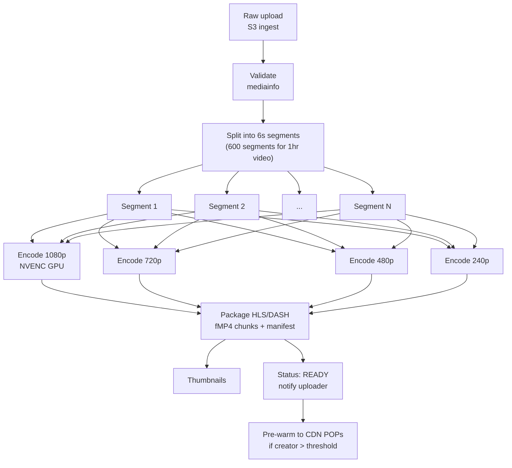
```mermaid
flowchart TB
    Up[Raw upload<br/>S3 ingest] --> V[Validate<br/>mediainfo]
    V --> Split["Split into 6s segments<br/>(600 segments for 1hr video)"]
    Split --> P1[Segment 1]
    Split --> P2[Segment 2]
    Split --> P3[...]
    Split --> PN[Segment N]
    P1 --> E1080[Encode 1080p<br/>NVENC GPU]
    P1 --> E720[Encode 720p]
    P1 --> E480[Encode 480p]
    P1 --> E240[Encode 240p]
    P2 --> E1080
    P2 --> E720
    P2 --> E480
    P2 --> E240
    PN --> E1080
    PN --> E720
    PN --> E480
    PN --> E240
    E1080 --> Pkg[Package HLS/DASH<br/>fMP4 chunks + manifest]
    E720 --> Pkg
    E480 --> Pkg
    E240 --> Pkg
    Pkg --> Thumb[Thumbnails]
    Pkg --> Ready[Status: READY<br/>notify uploader]
    Ready --> CDN[Pre-warm to CDN POPs<br/>if creator > threshold]
```

Orchestrators like Temporal or Cadence track the DAG state, retry failed segments, and surface partial-readiness (mark video READY at 720p before 4K finishes). NVENC GPU encoding cuts H.264 wall-clock ~5x vs CPU; AV1 is ~10-20x more compute than H.264 — reserved for top titles where the bandwidth savings repay the GPU cost.

**Per-title encoding ladder.** *[Source: Netflix tech blog]* Naive approach: same bitrate ladder for every video (e.g. 235/375/560/750/1050/1750/2350/3000 kbps). Netflix switched to **per-title** encoding — analyse video complexity (a talking-head documentary needs far less bitrate than a Marvel action sequence at the same perceptual quality) and pick a custom ladder per title. Wins: ~20% bitrate reduction at equal quality, or equivalently better quality at the same bitrate. Same bytes, less buffering, lower CDN cost. Per-shot encoding (within a title, complexity varies — quiet scene vs action) is the next refinement.

**ABR algorithm in detail.** Player buffers 2-3 chunks ahead and computes effective bandwidth = `chunk_bytes / download_time`. Next request picks the highest variant ≤ 0.7-0.8× measured bandwidth (safety margin avoids flapping under jitter). Modern players use a hybrid algorithm (e.g. BOLA, MPC) combining bandwidth estimation with buffer-occupancy heuristics — high buffer = stay aggressive on quality; low buffer = back off even if bandwidth looks fine. The manifest exposes all variants as separate URLs; switching is just changing which URL the next chunk request hits — no server-side coordination needed.

**ISP-embedded CDN nodes.** *[Source: Netflix Open Connect, Google Global Cache]* For sustained streaming traffic, neither Akamai nor Cloudflare are the bottom layer — Netflix's **Open Connect Appliances** and Google's **Global Cache** ship physical hardware to ISPs. The ISP racks the box in their own datacenter; popular content is pre-positioned on it overnight. Watch traffic never leaves the ISP's network — the bytes already live on hardware inside the eyeball network. This is how a Champions League final 100x spike doesn't melt the public internet: ~80% of bytes serve from hardware physically inside the viewer's ISP.

**HLS vs DASH.** Both are manifest-driven ABR formats over HTTP. HLS (Apple) is the de-facto on iOS/Safari and uses M3U8 playlists + TS or fMP4 segments. DASH is the open standard, MPD manifest + fMP4. Modern stacks ship both manifests pointing at the same fMP4 segments (CMAF) — single byte-for-byte storage, one URL pattern, two manifests for client compatibility. Saves storage and CDN cache duplication.

#### Potential Follow-Up Questions
**Q: What if the transcoding queue backs up during a viral upload event?**
Autoscale GPU workers based on queue depth; priority lanes for high-creator-tier or pre-scheduled live events. Long videos chunked early so partial readiness lets us serve 720p while 4K is still processing. *If pushed:* progressive availability — mark video READY at the lowest resolution as soon as it's done; higher resolutions populate later via manifest update.

**Q: How do you keep storage costs sane for 3.6PB/day of new content?**
Tier aggressively — popular videos in S3 Standard, long tail in S3 IA after 30 days, Glacier for archive. Aggressive dedup of identical uploads (same hash). *If pushed:* per-title encoding ladder — only encode bitrates clients actually request; for very long-tail content, skip 4K entirely.

**Q: How would you handle a single-event 100x traffic spike (Champions League final)?**
Multi-CDN with pre-purchased capacity; pre-warm chunks to all major POPs hours before. Clients hit edge first, never reach origin. ISP-embedded caches (Google Global Cache / Netflix Open Connect appliances) absorb most of the bytes inside the eyeball network. *If pushed:* tier of mid-tier shield caches in front of origin so a CDN miss in one POP doesn't stampede origin; cap concurrent origin fetches per asset via request coalescing.

**Q: ABR vs progressive download — why ABR?**
ABR adapts to changing bandwidth (mobile networks, congested wifi) per-chunk, so a buffering event becomes a quality drop instead of a stall. Progressive download wastes bandwidth on quality the user can't sustain. *If pushed:* ABR's downside is clients see quality fluctuation; mitigate with smoothing logic in player and per-title ABR ladder tuning.

**Q: How do you secure premium / paid content?**
DRM (Widevine, FairPlay, PlayReady) — encrypted chunks, license server hands out keys after entitlement check. Token-signed CDN URLs with short TTL prevent direct leakage. *If pushed:* watermarking (forensic marks per-user) so leaks can be traced; some platforms add session-bound rotation.

**Q: How would you migrate from H.264 to AV1 in production?**
Dual-encode for new uploads, gradually re-encode top-N most-watched back catalog. Manifest exposes both; client picks supported codec via capability negotiation. *If pushed:* encode AV1 only for high-traffic titles where the bandwidth savings pay for the GPU cost; long-tail stays H.264 forever.


**Q: Why per-title encoding ladder over a fixed ladder?**
A talking-head documentary at 1080p doesn't need the same bitrate as a Marvel film at 1080p — the perceptual complexity differs by 5-10x. A fixed ladder over-provisions bitrate for simple content (waste) and under-provisions for complex (quality drops). Netflix's per-title approach analyses each title and picks a custom ladder, getting ~20% bitrate reduction at equal quality. *If pushed:* per-shot is the next level — within a title, allocate more bits to complex action scenes and fewer to dialogue. Saves bandwidth, reduces buffering, cuts CDN cost.

**Q: How do ISP-embedded caches change the architecture?**
At YouTube/Netflix scale, the public CDN tier (Akamai/Cloudflare) isn't the bottom — they ship hardware (Netflix Open Connect, Google Global Cache) into ISP datacenters. ISP racks the box; popular content pre-positioned overnight; watch traffic never leaves the ISP network. ~80% of bytes serve from inside the eyeball network. *If pushed:* this is why a Champions League final at 100x normal traffic doesn't melt the public internet — the bytes are already physically inside the ISP. Cost shifts from peering to hardware.

**Q: HLS vs DASH — pick one or both?**
Both. HLS is mandatory for iOS/Safari; DASH is the open standard preferred elsewhere. Modern stacks store **fMP4 (CMAF) segments once** and ship both manifests pointing at the same bytes — one storage, two manifests. Avoids the historical waste of storing TS segments for HLS and fMP4 for DASH separately. *If pushed:* HLS now supports fMP4 too, so the segment format gap closed; differences are only in manifest syntax.

#### Bottlenecks & Mitigations
- **Viral video** → CDN absorbs; pre-warm to multiple POPs. A video going from 1k to 10M views/hour overwhelms any single POP; predictive pre-warming (push chunks to all major POPs once a video crosses a trending threshold) eliminates the cold-miss stampede.
- **Transcoding queue depth** → autoscale GPU pool; prioritize by uploader/views forecast. A 10x upload spike (e.g. post-election surge in commentary uploads) backs up the queue; autoscaling adds GPU capacity in minutes, while priority lanes ensure top-creator content doesn't sit behind low-value uploads. Long videos are also chunked early so partial readiness lets us serve 720p while 4K is still encoding.
- **Cross-region replication lag** → eventual consistency on new uploads (accept "video processing"). A video uploaded in California isn't instantly available in Tokyo; rather than block on global replication, the metadata flips region-local first and replicates async — viewers see "processing" until their region's copy lands.
- **Storage costs explode** → aggressive cold tiering of long-tail. 3.6PB/day at hot-tier prices is infeasible; auto-lifecycle moves 90% of bytes to IA/Glacier within 30 days. A long-tail video being pulled from Glacier costs minutes of restore — fine because long-tail = rare access by definition.
- **Live event spike** (Champions League) → multi-CDN, pre-purchased capacity. A single event can draw 100x normal traffic for a 90-minute window; pre-purchased CDN capacity, multi-CDN routing (Akamai + Cloudflare + ISP-embedded caches simultaneously), and DNS-based load steering handle the burst that no single CDN can absorb alone.

- **Bitrate inefficiency on fixed ladders** → per-title encoding analysis. A fixed ladder wastes bandwidth on simple content and under-quality on complex; per-title saves ~20% bitrate at equal quality. At YouTube/Netflix scale that ~20% is petabytes/month of CDN egress savings — the GPU cost of analysis is recovered in days.
- **Storage duplication across streaming formats** → CMAF (fMP4) shared by HLS + DASH. Storing TS for HLS and fMP4 for DASH doubles cold-tier cost; CMAF lets one byte-stream serve both manifests. Halves storage at no quality cost.
- **Public-internet bottleneck on live spikes** → ISP-embedded CDN hardware. Even the largest CDNs are oversubscribed during a Champions League final; Open Connect / Google Global Cache box embedded in ISP racks serves 80% of bytes without crossing peering links.

#### Failure Modes
| Layer | Failure | Detection | Mitigation |
|---|---|---|---|
| Upload ingest | Resumable upload state is lost mid-file | Offset-mismatch and abandoned-upload alarms | Chunk-level acknowledgements and resumable state keyed by upload ID let clients restart from the last confirmed chunk |
| Transcoding / processing | Segment or variant jobs stall and video never becomes READY | Queue depth, stuck-job age, and per-variant failure alerts | Retry at the segment level, allow partial readiness at lower resolutions, and dead-letter permanently bad inputs |
| Manifest publish | Manifest becomes visible before all required chunks are present | Chunk-404 on startup and manifest-validation canary | Publish manifests only after variant completeness checks and atomic object promotion |
| CDN / origin | Viral content causes cold-miss stampede to origin | Origin egress spike and cache-fill amplification alerts | Pre-warm rising content, use shield caches, and coalesce concurrent origin fetches per asset |
| Recommendation path | Recommender or ranking path degrades and home page empties | Candidate-generation timeout and fallback-feed rate | Fall back to subscriptions / trending / recent content rather than blocking playback |
| Moderation / rights | Unsafe or copyrighted content becomes playable before checks finish | Time-to-moderation and takedown lag metrics | Gate visibility on required moderation stages for risky classes and support instant tombstoning at hydration time |

#### Observability — Key Metrics & SLOs
- **Upload-to-ready latency** — creator-facing SLO; broken down by ingest, transcode, and packaging stages.
- **Time-to-first-frame** — user-facing playback metric dominated by CDN, manifest, and first-chunk delivery.
- **Transcoding queue depth and oldest-job age** — early warning for processing backlog.
- **CDN hit rate by title class** — hot and long-tail content behave very differently and should be tracked separately.
- **Rebuffer rate / buffering events per hour watched** — the main streaming quality metric.
- **Recommendation freshness** — especially for newly uploaded and newly trending content.

#### Multi-Region & DR
- **Replication mode:** uploads land in regional ingest, encoded artifacts replicate to multi-region object storage, and CDN handles global edge distribution.
- **RTO:** ingest and stateless APIs fail over quickly; transcode backlog recovery is slower but bounded because the raw upload is durable.
- **RPO:** near-zero for completed uploads if raw bytes are durably persisted before ack; encoded derivatives can be recomputed.
- **Failover cadence:** test cold-region transcode replay and CDN-origin failover, not just API restarts.
- **Cross-region cost:** dominated by encoded media replication and CDN fill, not by metadata.

#### Common Mistakes / Anti-patterns
- **Synchronous transcoding on upload.** Upload completion and video readiness are different lifecycle stages.
- **Serving bytes from the API tier or origin directly.** CDN is not optional at video scale.
- **Fixed bitrate ladder for every title.** Per-title ladders save enormous storage and egress.
- **No storage tiering.** The long tail makes hot-only storage economically absurd.
- **Conflating recommendation serving with media delivery.** These are separate scale domains with separate failure modes.

#### Talking Points for the Interview
- **Chunked resumable upload + async transcode** is the clean upload story.
- **ABR over HLS/DASH** is the playback story; the client picks the next chunk bitrate.
- **Per-title encoding ladder** is a strong differentiator beyond the generic “multiple resolutions” answer.
- **CDN and ISP-edge caching are what make the egress numbers believable.**
- **Hot/cold tiering is mandatory.** You cannot keep the whole catalog in expensive hot storage forever.
- **Recommendation and playback are separate systems.** One chooses what to watch; the other serves the bytes.

### 12. Design Google Drive (Dropbox)
#### Problem
File sync and storage across devices with versioning, sharing, and conflict-handling collaboration.

#### Summary
**The picture in your head:** a postal system where every document is sliced into numbered pages before mailing. When you change one page, you only re-send that page, and every post office along the route keeps a copy of every page it has ever received. When your laptop wakes up after a week offline, it asks the post office "what pages changed since I was last here?" and only downloads those — never the whole document.

**The single-request walkthrough:** you edit a 200MB video file, changing 4MB near the end. Your laptop's sync agent splits the file into 4MB chunks and hashes each one (e.g. SHA-256). It sends the hash list to the Metadata Service: "I have chunks A, B, C, D, E, F." The server replies "I already have A, B, C, D, E — just send F." Your client uploads F (4MB) to the Block Service, which stores it by its hash. The Metadata Service records the new version: the file now maps to chunks [A, B, C, D, E, F_new]. It publishes a change event `{ file_id, version: 3 }` to the Notify Service via WebSocket. Your phone wakes up, sees the notification, asks for the chunk list, discovers only F changed, and downloads 4MB. Total bandwidth: 4MB instead of 200MB.

**The pieces (and what each one is for):**
- **Sync agent (client-side)** — the program running on your laptop or phone. Splits files into fixed 4MB chunks (a "chunk" is just a fixed-size slice of the file bytes), hashes each chunk, compares with the server's hash list, and uploads only what is missing. This is the core bandwidth-saving mechanism.
- **Metadata Service** — stores the logical description of your files: folder structure, permissions, version history, and the ordered list of chunk hashes that make up each file. Does NOT store the actual bytes. Backed by a transactional database sharded by user_id.
- **Block Service** — stores the raw bytes, keyed by the chunk's hash. Two chunks with the same hash (e.g. the same corporate template uploaded by a million users) are stored exactly once — this is called content-addressed storage and is how Dropbox achieves 30-50% dedup across the whole corpus.
- **Server File Journal** — an append-only log of every change in your file namespace (create, modify, delete), each entry stamped with a monotonically increasing ID (JID). When your phone reconnects after a week offline, it fetches changes since its last-seen JID rather than scanning your entire folder tree. This keeps sync fast even if you have 10 million files.
- **Notify Service** — a WebSocket push channel. When a file changes, the Metadata Service publishes an event to the Notify Service, which pushes it to all your other logged-in devices in real time.

**The thing that makes it hard:** two devices edit the same file while offline. Your MacBook edits `report.docx` on Tuesday; your iPad also edits `report.docx` on Tuesday. Wednesday both come online. MacBook uploads version 3 first. iPad then tries to upload its version 3. The server sees a conflict: two branches off version 2 with no common ancestor. There is no safe way to auto-merge binary files like Word documents — merging byte ranges from two divergent edits produces corruption. So the server does the only safe thing: it accepts MacBook's upload as the canonical version 3, and saves iPad's upload as `report (conflict copy from iPad).docx` alongside. Now both files exist, and you resolve the conflict manually by opening both and copying what you want.

**Why the standard solution works:** the hash-list handshake before every upload is what makes the system efficient at scale. Instead of "upload the file and we'll figure it out," the client first asks "which of these chunks do you already have?" and only transfers the missing ones. In a corporate environment, this handshake collapses a 1GB Office installer to ~40MB of actual transfers because 240 of 250 chunks already exist on the server from prior installs. The tradeoff is that the sync engine is complex — it must handle offline edits, network interruptions mid-upload, and the journal cursor falling behind its retention window.

**If you were building it tomorrow:**
- Metadata in Postgres sharded by `user_id`; Block store in S3 with keys = SHA-256 of chunk bytes; Notify Service on Redis pub/sub or WebSocket server.
- The hash-list handshake on every upload:
  ```
  hashes = [sha256(chunk) for chunk in split_4mb(file)]
  missing = POST /file {hashes}  # server replies with hashes it lacks
  for h in missing: PUT /chunk/{h} bytes
  POST /file/commit {file_id, hashes, metadata}
  ```
- On reconnect: `GET /journal?since={last_jid}` → replay operations → upload/download only deltas.
#### Clarifying Questions
- Max file size? Per-user storage cap?
- Real-time collab in docs (Google Docs)? (assume separate problem)
- Selective sync? Offline access?
- Sharing model: per-file ACL, link sharing?

#### Requirements
- **FR:** upload/download, sync across devices, share, versions, conflict resolution, search
- **NFR:** durability (11 9s), efficient sync (delta only), 99.99% availability

#### Scale Estimate
- **Users & raw size:** Google Drive ~3B Workspace-eligible accounts; assume 1B active users with paid/free quota averaging 10GB consumed (free tier 15GB partially used + paid 100GB+ pulls the mean). 1B × 10GB = **~10EB raw user data** before dedup.
- **File-size distribution:** avg ~1MB (geometric mean — most files are <100KB texts/configs/notes; long tail to multi-GB videos and disk images skews the arithmetic mean to ~1MB). Small-file count dominates metadata QPS even though byte volume is dominated by big files.
- **Chunk size:** 4MB fixed (matches Dropbox/Drive published values — large enough to amortise metadata + erasure-coding overhead, small enough to bound retransmits on flaky mobile). Files <4MB stored whole; many small files batched into archive chunks so metadata isn't 1:1 with files.
- **Dedup ratio:** content-defined hashing across corpus catches corporate templates, OS-shipped files, common media → ~30–50% reduction (Dropbox public number is ~30%, internal/enterprise tenants closer to 50%). 10EB × (1 − 0.4) = **~5–7 EB effective at 1× replication**.
- **Replication:** 3× durable on hot tier (cross-AZ object store) + erasure-coded 1.4× overhead on cold (Reed-Solomon 10+4) → 5–7 EB × 3 ≈ **~15–18 EB hot when fully active**; once ~70% of corpus migrates to EC cold → ~7 EB total stored bytes.
- **Daily churn:** ~10% of users sync per day = ~100M syncs/day; avg sync uploads ~100KB net new (most syncs are deletes/renames/metadata) → ~10TB net new bytes/day; with 3× replication → ~30TB/day writes to object store. (Note: pre-dedup ingest is higher, ~30–50TB/day, but dedup absorbs the duplicates.)
- **Metadata:** 1B users × ~10k files avg (consumer ~1k, enterprise ~50k+ → blended 10k) = ~10T file rows; ~5KB/row (path 200B + chunk-list 4KB for avg 1MB file at 4MB chunks ≈ 1 chunk + ACL + ts + version) → 10T × 5KB = ~50PB; replication 3× → ~150PB metadata in the sharded transactional store, partitioned by user_id.
- **Hot tier:** chunks accessed in last 30 days are ~5% of corpus; 5% of 5–7EB = ~250–350PB on SSD-backed object storage; allow ~500PB headroom for traffic spikes.
- **Cold tier:** chunks idle >30 days on infrequent-access; >1yr move to glacial; reads tolerate seconds-to-minutes warm-up — the 95% of bytes that never move pay for the 5% hot.
- **Sync events:** 100M syncs/day × ~1 file_changed event each = ~100M events/day ÷ 86,400 ≈ ~1.2k/s steady fan-out via the notify service; bursty during business-hours opens (~5× peak).

#### API Contract
```
POST /file
  body: file metadata + chunk hashes
  → { file_id, missing_chunks: [hash...] }

PUT /chunk/{hash}
  body: bytes
  → { stored: true }

GET /file/{id}        → metadata + chunk list
GET /chunk/{hash}     → bytes (CDN)

# Sync notifications
WS: { event: file_changed, file_id, version }
```

#### High-Level Design
```
                    Client (sync agent)
                          │
                  computes file delta
                  (which chunks changed)
                          │
        ┌─────────────────┼─────────────────┐
        ↓ metadata        ↓ chunks          ↓ events
  ┌──────────┐       ┌──────────┐     ┌──────────┐
  │ Metadata │       │  Block   │     │  Notify  │
  │ Service  │       │ Service  │     │  Service │
  │ (txn store)│     │(object   │     │  (WS)    │
  │          │       │  store)  │     │          │
  └────┬─────┘       └──────────┘     └──────────┘
       │
       ↓
  Versions, ACLs

Other devices for same user ←─── Notify Service ─── update !
```

**How to read the diagram:** the system is split between metadata and file contents. Metadata tracks folders, permissions, versions, and change history; the file bytes themselves live in chunk or object storage and are uploaded or downloaded separately.

**Why the flow is shaped this way:** syncing gets much easier when you can reason about what changed without shipping entire files every time. Devices mostly exchange change logs and version references, then move only the chunks they actually need.

**What this layout buys you:** efficient sync, version history, and better offline behavior across many devices. The tradeoff is that the sync engine becomes the hard part, especially once concurrent edits and conflict resolution enter the picture.

#### Data Model
- **files** (transactional store, sharded by user):
  `(file_id, owner_id, name, parent_folder, current_version, deleted, created_at)`
- **versions:** `(file_id, version_id, ts, size, chunk_list[])`
- **chunks** (key-value store): `chunk_hash → (size, ref_count, blob_location)`
- **acl:** `(file_id, principal_id, role)`
- **blobs:** object store, key = chunk_hash → bytes

#### Detailed Design
**Block-level storage.**
- 4MB chunks → SHA-256 hash → content-addressed. Hash is the storage key, so two identical chunks from different users collide by construction and are stored exactly once. 4MB is a tuned compromise: smaller chunks improve dedup ratio but explode metadata pressure (a 1TB file at 4KB chunks = 250M metadata rows); larger reduce metadata but waste bandwidth on the "1 byte change re-uploads the whole chunk" case.
- **Dedup across all users:** identical chunks stored once → massive savings (esp. for popular files). Corporate template decks, common OS files, popular media files — these collide enormously across users. Real-world dedup ratios run 30-50% on the full corpus, so 10EB of nominal user data becomes ~5-7EB stored.
- Editing 1 byte of a 1GB file = 1 chunk re-uploaded (the chunk containing that byte). The other 249 chunks dedup against the prior version's hashes — zero bytes re-uploaded.

**Conflict resolution.**
- Last-write-wins per chunk (with version). Two devices edit the same file from the same base version; the later finalize call wins, the earlier one becomes a "conflict copy" alongside (`file (conflict copy from MacBook).ext`). User resolves manually by inspecting both.
- Automatic merging is unsafe for binary files (corruption risk) and undefined for non-text; conflict-copy is the only general-purpose answer.
- Real-time collab (Google Docs) uses CRDTs — separate problem with character-level operations and operational transform; not solvable at chunk granularity. Drive treats Docs as a different content type with its own service.

**Sync efficiency.**
- Bidirectional rsync-like protocol; client first checks "what does server have" via the hash list, server replies "missing these N hashes," client uploads only those. Saves bandwidth on dedup hits and partial-edit cases.
- Compression on chunks before upload (zstd or similar) — text-heavy files compress 3-5x; pre-compressed media (jpeg, mp4) skip compression to avoid wasted CPU.
- Batch small files into single archive chunk (small file performance). 1000 1KB config files at 4MB chunks each would waste storage and metadata; a "small-file aggregator" packs them into one 4MB chunk with a manifest, cutting metadata write rate by ~1000x.

**Sharing.**
- Per-file ACL stored in metadata as `(file_id, principal_id, role)` rows; checked on every fetch via a permission service backed by a per-node LRU cache. Granular roles: owner, editor, viewer, commenter.
- Link sharing → unguessable token in URL (e.g. 128-bit random suffix); the token grants the embedded role to anyone who has it. Treat link-share as "shared with the world if the token leaks" — no real revocation beyond regenerating the token.
- Permission cache invalidation via pub/sub: a permission change writes to Postgres and emits an invalidation event; permission service nodes subscribe and drop the affected entries. Stale window measured in seconds — acceptable trade-off for cache effectiveness.

**Limits and offline.** Per-file cap ~5TB (Drive's published limit) — beyond this the chunk-list metadata row becomes too fat to fit in one transactional store row and the upload coordinator gets unwieldy; very large files are better served by dedicated object-store APIs. Per-user storage cap is a billing-tier policy, not an architectural one; quota enforced by a counter in the metadata service that blocks new uploads when exceeded. Selective sync: client config selects which folders mirror to local disk; the sync agent subscribes to journal events for the entire user namespace but only materializes chunks for selected folders. Offline access: selectively-synced folders live on local disk and are readable/editable offline; on reconnect the sync agent computes chunk-hash deltas of locally-changed files and goes through the standard upload protocol — conflict-copy semantics resolve any concurrent server-side edits made while the client was offline.


**Chunk-hash-check protocol — sequence with dedup win.** *[Source: Dropbox engineering, streaming file synchronization]* The protocol's core trick is that the client computes hashes locally and only uploads the bytes the server doesn't already have — including bytes uploaded by other users.

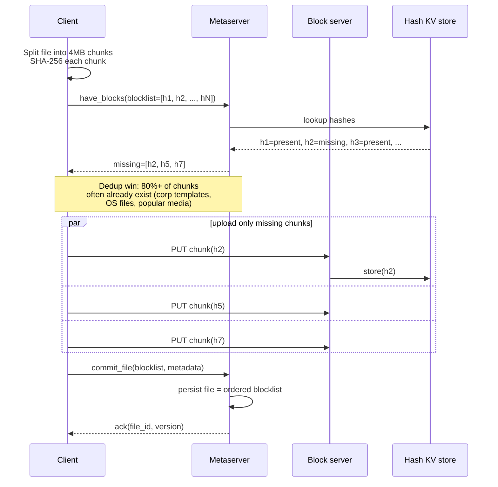
```mermaid
sequenceDiagram
    participant C as Client
    participant Meta as Metaserver
    participant Block as Block server
    participant KV as Hash KV store

    C->>C: Split file into 4MB chunks<br/>SHA-256 each chunk
    C->>Meta: have_blocks(blocklist=[h1, h2, ..., hN])
    Meta->>KV: lookup hashes
    KV-->>Meta: h1=present, h2=missing, h3=present, ...
    Meta-->>C: missing=[h2, h5, h7]
    Note over C,Meta: Dedup win: 80%+ of chunks<br/>often already exist (corp templates,<br/>OS files, popular media)

    par upload only missing chunks
        C->>Block: PUT chunk(h2)
        Block->>KV: store(h2)
    and
        C->>Block: PUT chunk(h5)
    and
        C->>Block: PUT chunk(h7)
    end

    C->>Meta: commit_file(blocklist, metadata)
    Meta->>Meta: persist file = ordered blocklist
    Meta-->>C: ack(file_id, version)
```

The dedup hit rate is the headline number: corporate environments hit 50-80% dedup because everyone has the same OS images, software installers, and template decks. A 1GB Office install with 250 chunks at 4MB each: only the user-specific 5-10 chunks actually upload; the other 240+ are already on the block servers from the millions of prior uploads. Net upload bandwidth: ~40MB instead of 1GB.

**Streaming sync (overlap upload and download).** *[Source: Dropbox tech blog]* Original Dropbox sync was two-phase: uploader fully uploads + commits before any other client can fetch. Streaming Sync overlaps the phases — downloading clients can prefetch chunks the uploader has already pushed before commit. Latency from "uploader finished" to "downloader has the file" drops up to 2x. The trick is that since chunks are content-addressed and immutable, downloaders can fetch chunks safely as they appear without waiting for the metadata to commit; the metadata commit just makes the file visible in the listing.

**Why 4MB chunks specifically.** Smaller chunks improve dedup ratio (more chance two users' files share a chunk) but explode metadata pressure (1TB at 4KB chunks = 250M metadata rows per file). Larger chunks reduce metadata but waste bandwidth on the "1 byte change re-uploads the whole chunk" case. 4MB is the empirical sweet spot — a 1GB file is 250 metadata rows (manageable), and a 1-byte edit re-uploads 4MB (acceptable). Some systems experiment with 8MB request batches to amortize per-request overhead while keeping the addressable chunk at 4MB.

**Server File Journal (cursor-based sync).** Each user namespace has a journal of operations (create, modify, delete) with monotonically increasing JID values. Clients track their last-seen JID; on reconnect they pull `since=last_jid` and replay the operations to converge state. This is much cheaper than directory-listing diffs (which would require scanning the full tree to detect changes); the journal is appended on every metadata change, so sync is O(changes since last sync) regardless of total file count.

#### Potential Follow-Up Questions
**Q: What if two devices edit the same file simultaneously?**
Last-write-wins per chunk, plus the loser's version is preserved as a "conflict copy" file alongside. User resolves manually. *If pushed:* for binary files this is the only safe answer — automatic merging risks corruption. For text files, surface a 3-way merge UI; for collaborative docs, switch to a CRDT-based product (Google Docs).

**Q: How do you handle a 100GB file upload over flaky mobile?**
Resumable upload — client uploads in 4MB chunks, each acked individually; on disconnect, resume from last acked offset. Chunk hashes mean partial uploads survive across sessions. *If pushed:* client computes the chunk list before any upload, server pre-allocates metadata in PENDING state — recoverable even if the client process dies entirely.

**Q: How do you garbage collect chunks when files are deleted?**
Reference counting: each chunk has a ref_count; deletion decrements it; nightly sweep deletes chunks with refcount=0 after a 7-day grace period. *If pushed:* refcounts are eventually consistent — combine with a periodic mark-and-sweep that verifies by scanning the metadata DB; protects against ref-count drift bugs.

**Q: How do you scale metadata when a single user has 10M files?**
Shard metadata DB by user_id; within a user, paginate by `(parent_folder, name)` indexes. Avoid full-tree scans — sync uses delta tokens, not directory listings. *If pushed:* batch many small files into archive chunks (one chunk = bundle of 1000 small files + manifest) to cut metadata write rate by 1000x.

**Q: How do you prevent malicious uploads (malware, copyrighted content)?**
Async scan after upload (ClamAV or equivalent) → quarantine on hit. Hash-match against known-bad chunk hashes blocks known malware before storing. *If pushed:* perceptual hashes (PhotoDNA) for image/video copyright detection; Content ID-style fingerprinting for audio. Trade off scan latency vs upload speed by gating downloads, not uploads.

**Q: How would you migrate to a new chunk size (4MB → 16MB) in production?**
Dual-write era — new uploads use 16MB; old files stay at 4MB. Client supports both via per-file chunk-size metadata. Background re-chunker processes old files lazily during low-traffic hours. *If pushed:* don't migrate — just write new files with the new size and let the old corpus stay; rechunking the entire 10EB corpus is rarely worth it.


**Q: How big is the dedup win in practice?**
50-80% in corporate environments. Everyone has the same OS images, Office installers, template decks; chunks collide enormously. A 1GB Office install with 250 chunks at 4MB: only the user-specific 5-10 chunks actually upload; the other 240+ are already in the KV store from prior uploads. Net upload: ~40MB instead of 1GB. *If pushed:* dedup also breaks privacy in subtle ways — confirming a chunk hash exists tells you someone else has that chunk; mitigations include per-tenant content-addressing keyspaces or encrypting chunks with user keys (which kills cross-user dedup but is the price of true privacy).

**Q: Why 4MB chunks specifically? Could we use 64KB?**
Smaller chunks = better dedup but worse metadata pressure. 1TB at 4KB chunks = 250M metadata rows per file — your metadata DB melts. 4MB gives 256 rows for 1TB and a 4MB re-upload on a 1-byte edit (acceptable). Larger (16MB, 64MB) reduces metadata further but wastes bandwidth on partial edits. *If pushed:* you can use variable-size chunking with content-defined boundaries (rolling hash splits chunks at content-aware breakpoints) to handle inserts mid-file without re-chunking everything downstream — restic and rsync do this.

**Q: How does streaming sync overlap upload and download?**
Original sync was two-phase: uploader commits before downloaders see anything. Streaming sync lets downloaders prefetch chunks as the uploader pushes them — the metadata commit just makes the file appear in the listing. Halves end-to-end latency. Safe because chunks are content-addressed and immutable. *If pushed:* this also helps the "uploader on slow link" case — viewers on fast networks pull chunks as they land instead of waiting for the upload to finish.

#### Bottlenecks & Mitigations
- **Many small files** → metadata write storm; batch into one chunk. A user dropping a folder of 10k 1KB config files hits metadata at 10k writes per sync; aggregator packs them into a single archive chunk + 1 metadata row, slashing write rate by ~1000x.
- **Massive file** (10GB) → chunked + resumable upload with offset. A 10GB upload over flaky mobile would fail catastrophically without resume; chunk-level acks let the client restart from the last acked offset, and chunks already uploaded survive across sessions.
- **Hot chunk** (popular template file) → CDN cache, ref-count tracking. A widely-shared corporate template's chunk is requested by thousands of users; CDN edge serves it from cache, origin sees one fetch. Ref-count tracking ensures that even when many users delete the template, the chunk persists as long as one user still references it.
- **Sync storm on shared folder edit** → debounce notifications, batch fan-out. A user editing 100 files in a shared folder (e.g. running a refactor) generates 100 events × 50 collaborators = 5000 notifications; debouncing batches multiple changes into a single "folder updated" notify with a list of changed files.
- **Garbage collection** of orphaned chunks → ref-count + nightly sweep. Each chunk has a ref_count incremented on file creation/version, decremented on deletion; nightly sweep deletes chunks with refcount=0 after a 7-day grace period (handles ref-count drift bugs and "undelete" UX). Mark-and-sweep verifier runs weekly to catch orphans the ref-count missed.

- **End-to-end sync latency** → streaming sync overlaps upload and download. Two-phase sync forces downloaders to wait for upload commit; streaming sync lets them prefetch chunks as the uploader pushes them. Halves wall-clock latency on large files; safe because chunks are content-addressed and immutable.
- **Directory listing diffs at scale** → cursor-based journal (Server File Journal). For a user with 10M files, comparing two directory listings is intractable. The journal is append-only with monotonic JIDs; sync pulls `since=last_jid` and replays — O(changes), not O(total files).
- **Dedup vs privacy tradeoff** → per-tenant keyspaces or chunk-level encryption. Cross-user dedup leaks information ("this hash exists" confirms someone else has the chunk). For privacy-sensitive deployments, isolate keyspaces per tenant (kills cross-tenant dedup but preserves intra-tenant) or encrypt chunks with user keys (kills all dedup but provides true privacy).

#### Failure Modes
| Layer | Failure | Detection | Mitigation |
|---|---|---|---|
| Metadata store | Metadata commit succeeds but notify path fails, leaving devices stale until poll | Notify-failure rate and sync-lag canary | Treat notify as acceleration only; clients poll the journal periodically and reconcile by version |
| Chunk index | Hash index or refcount drifts from actual metadata references | Orphan-chunk count and refcount-vs-mark-sweep mismatch | Run periodic mark-and-sweep verification; never trust refcounts alone forever |
| Sync journal | Client cursor falls behind or misses journal segments | Cursor-gap and replay-failure alarms | Force a full metadata diff when the journal retention window is exceeded |
| Conflict handling | Concurrent edits overwrite without preserving both versions | Conflict-copy generation failure alert | Always emit a preserved conflict copy for generic files; never attempt unsafe binary merges |
| Object storage | Chunk blob unavailable in one region | Chunk-fetch 404/error spike | Multi-region replication for blobs, retry from alternate region, and lazy local recache |
| Small-file packing | Packed archive corruption affects many tiny files at once | Archive-manifest checksum mismatch | Keep immutable manifests with per-file checksums and rebuild from source upload or prior version |

#### Observability — Key Metrics & SLOs
- **Dedup hit rate** — core efficiency signal; drops may mean hashing regressions or workload changes.
- **Sync lag** (metadata commit to other-device convergence) — the user-facing freshness metric.
- **Bytes avoided via chunk reuse** — practical measurement of delta-sync effectiveness.
- **Journal replay latency and cursor-gap rate** — shows whether sync stays O(changes) instead of degrading to full scans.
- **Orphan-chunk and refcount-drift metrics** — storage correctness and GC health.
- **Conflict-copy rate** — important product and correctness signal for offline multi-device users.

#### Multi-Region & DR
- **Replication mode:** metadata is strongly owned per user namespace, while immutable chunks replicate broadly and can be served from any region.
- **RTO:** chunk serving can fail over quickly; metadata-region failover is harder because namespace consistency matters.
- **RPO:** near-zero for committed metadata versions and uploaded chunks; notify events can be lost because they are recoverable from journal replay.
- **Failover cadence:** rehearse namespace recovery, journal rebuild, and chunk-index reconstruction separately.
- **Cross-region cost:** large on blob replication, modest on metadata because metadata is tiny relative to file bytes.

#### Common Mistakes / Anti-patterns
- **Whole-file uploads for every edit.** That destroys both bandwidth and product ergonomics.
- **Putting file bytes in the transactional metadata store.** Metadata and immutable blobs have different scaling properties and should stay separate.
- **Trying to auto-merge arbitrary binary files.** Conflict copies are the safe generic answer.
- **Polling full directory trees for sync.** Cursor-based journals are the only viable path at large namespace sizes.
- **Ignoring small-file amplification.** Many tiny files can dominate metadata and request overhead if not packed or batched.

#### Talking Points for the Interview
- **Content-addressed chunking is the core idea.** Chunks named by hash buy dedup, delta sync, and version efficiency.
- **Metadata vs blob split** is the right storage separation to say early.
- **Hash-list handshake before upload** is what avoids sending bytes the service already has.
- **Journal-based sync makes convergence scale with changes, not tree size.**
- **Conflict copies are intentional product behavior, not an error.**
- **Dedup has a privacy trade-off.** That shows maturity beyond the happy-path storage story.

### 13. Design a Proximity Service (Yelp, Find Nearby)
#### Problem
Find businesses (or any geo-tagged entities) within a radius of a given lat/lng, fast.

#### Summary
**The picture in your head:** a postal code system for the whole planet, where each code covers a geographic square. Finding coffee shops near you means: "what's my postal code?" then "give me everything with the same or neighboring codes, then discard anything actually too far." It's a two-step filter — the postal code is approximate and fast, the distance check is precise and slow.

**The single-request walkthrough:** you open Yelp at 40.75°N, 73.99°W (Midtown Manhattan) and search "coffee within 1km." The Search API encodes your coordinates into a geohash (think of a geohash as a short alphanumeric string where the first N characters identify a geographic cell — here `dr5ru` covers a ~600m square). It queries a Redis geo-index for all businesses in `dr5ru` plus the 8 neighboring cells (because your 1km radius might bleed into adjacent cells). Redis returns ~200 candidate business IDs in ~5ms. The API fetches full records for those 200 businesses from the Business Store, runs haversine distance math (the actual formula for distance on a sphere) on each one, discards everything beyond 1km, applies the "coffee" category filter, and sorts by distance. Top 20 results return in ~50ms total. The result is cached under the key `(dr5ru, coffee)` for 60 seconds — the next 1000 people searching for coffee in Times Square at noon all hit the cache, which is why this query can serve 100k/s at peak.

**The pieces (and what each one is for):**
- **Geohash** — an encoding scheme that turns a latitude/longitude pair into a short string like `dr5ruk`. Longer strings = smaller cells = more precise location. The key property: two places with the same geohash prefix are geographically close. This lets you find nearby places with a string prefix query instead of scanning all 200M businesses for distance. The catch: cell edges don't align with circles, so you always query the target cell plus all 8 neighboring cells to avoid missing places right across a cell boundary.
- **Geo Index (Redis GEO)** — an in-memory database storing each business as a geohash-scored entry in a sorted set. Very fast prefix lookups. 200M businesses at ~80 bytes each fits in ~16GB of RAM — small enough to keep entirely in memory.
- **Business Store (Postgres/Cassandra)** — the source of truth for business details (name, hours, ratings, address). The geo index holds only IDs and coordinates; full records are fetched ("hydrated") after candidate filtering. Keeping these separate means you can rebuild the geo index from scratch in minutes if needed.
- **Result Cache (Redis)** — caches the final ranked results for popular `(geohash_cell, category)` combinations with a 60-second TTL (TTL = Time To Live, how long before the cache entry expires). In dense cities, ~70% of searches hit this cache, which is what makes 100k peak QPS affordable.

**The thing that makes it hard:** cities are 1000x denser than rural areas. A 600m geohash cell in Times Square contains ~1000 businesses; the same cell in rural Wyoming contains ~5. A uniform index with fixed cell sizes either over-fetches in dense areas (wasting CPU on haversine for thousands of candidates) or returns too few results in sparse ones. On top of that, the geohash cell boundary problem: if you're 10 meters from the edge of your cell and searching 500m radius, half the results might live in the neighboring cell — which is why you always query 9 cells (target + 8 neighbors) even though it means fetching ~3x more candidates than the radius strictly requires.

**Why the standard solution works:** the two-phase filter (approximate by cell, then exact by distance) separates a cheap index lookup from an expensive distance calculation. The index prunes 200M businesses down to ~200 candidates in milliseconds. Haversine math on 200 points is trivial. Neither phase alone would work: pure haversine on 200M points takes seconds; pure cell lookup without distance refinement returns false positives near cell edges. The combination runs in under 50ms. The geohash precision is tuned to match the search radius — a 1km search uses ~600m cells (length-6 geohash), a 5km search uses ~5km cells (length-5), so you always query exactly 9 cells regardless of the radius.

**If you were building it tomorrow:**
- Redis GEOADD for the geo index, Postgres for the business store, Redis for the result cache.
- Hot path:
  ```
  cell = geohash(lat, lng, precision=6)  # ~600m cell
  neighbors = [cell] + geohash_neighbors(cell)  # 9 cells
  candidates = redis.GEORADIUS(center, radius_km, unit='km')
  results = [b for b in hydrate(candidates) if haversine(b, user) <= radius_km]
  results.sort(key=lambda b: haversine(b, user))
  cache.set((cell, category), results, ttl=60)
  ```
- For moving entities (drivers): swap on-disk store for Redis GEO with heartbeat writes every 5-30 seconds.
#### Clarifying Questions
- Static (businesses) or dynamic (drivers) data?
- Result count + radius bounds?
- Filters (category, rating)?
- Read-heavy or also high write rate?

#### Requirements
- **FR:** "find X within Y km of (lat,lng)", filter by category, sort by distance/rating
- **NFR:** <200ms p99, support dense + sparse regions, scale to 100M+ entities

#### Scale Estimate
- **Catalogue size:** Google Maps ~200M businesses globally (Yelp ~80M MAU, ~5M businesses; Maps is the superset). Assume ~5% churn/yr (new listings, closures, hours/menu/rating updates) → 200M × 0.05 / 365 ≈ ~30k updates/day on the slow side, but bursty ratings + AI scrapers push effective ~10M updates/day → 10M ÷ 86,400 ≈ ~120 writes/s steady — read-dominated.
- **Search QPS:** Yelp ~80M MAU × ~1 search/user/day = ~80M searches/day = ~1k/s; scaled to a Google Maps-class peer with ~1B MAU × ~5 searches/day = ~5B/day → ~60k/s avg, ~100k/s steady headline; lunch (12pm) + dinner (7pm) bursts in dense metros push 5× → ~500k QPS peak.
- **Entity size:** ~2KB per business — id 16B + name ~50B + lat/lng 16B + geohash ~12B + category array ~50B + rating 4B + opening hours ~200B + address ~200B + phone ~16B + photos refs ~500B + description ~1KB. 200M × 2KB = ~400GB total — fits in one replicated transactional cluster sharded by region.
- **Geo index:** 200M points × ~80B per Redis sorted-set entry (16B business_id member + 8B geohash score + ~56B Redis ZSET overhead) = ~16GB; fits in a single in-memory cache shard with 3× HA replication.
- **Density skew:** Manhattan ~28k businesses/km², rural US ~5/km² → ~1000× delta. An 800m geohash cell (precision-7) in Manhattan returns ~1k candidates; same cell in rural areas ~5. Implies pagination + secondary filter (category, rating) is mandatory at urban scale.
- **Hot tier:** in-memory geo cache for the live index + a result cache keyed on `(geohash_prefix, category)` with ~60s TTL. Empirically ~80% of queries in dense areas are repeats within 60s (same lunch crowd searching "coffee").
- **Cold tier:** full business catalogue + audit history in the transactional store (~400GB metadata + ~5× audit history ≈ 2TB); geo index can be fully rebuilt from this in ~5–10 minutes if cache is wiped.
- **Result-cache hit rate:** target ~70% on hot prefixes (Times Square, central London); 100k QPS × (1 − 0.7) = ~30k effective backend QPS — sized so a single transactional shard tier can serve.

#### API Contract
```
GET /search
  params: lat, lng, radius_km, category?, limit
  → { results: [{biz_id, name, lat, lng, dist_km, rating}], next_page_token }
```

#### High-Level Design
```
Client ─→ API ─→ Geo Index Lookup ─→ Candidate IDs
                       ↓
                  ┌────┴────┐
                  ↓         ↓
              Geohash     Quadtree
              (in-memory  (in-memory
               geo cache)  service)
                       │
                       ↓
                Hydrate (Biz DB) → filter + sort by exact distance → return
                       ↑
              Result cache (in-memory: hot queries)
```

**How to read the diagram:** a location query does not search the whole world. It first maps the user's location to nearby geo cells, fetches the candidate places inside those cells, and only then computes exact distance and ranking.

**Why the flow is shaped this way:** raw geographic distance is expensive to evaluate globally, but geo cells are cheap. The index's job is to narrow the world to a small candidate set; the ranking step's job is to turn that candidate set into something that feels accurate to a human.

**What this layout buys you:** fast nearby search without pretending the earth is a simple grid. The tradeoff is approximation: cell boundaries are only a first pass, so the second pass must clean up false positives carefully.

#### Data Model
- **businesses** (transactional store / wide-column store):
  `(biz_id, name, lat, lng, geohash, category, rating, ...)`
- **geo index** (in-memory geo cache):
  `GEOADD nearby:biz lng lat biz_id` (uses geohash internally)

#### Detailed Design
**Geo-index comparison:**

| Structure | How | Best For | Notes |
|---|---|---|---|
| **Geohash** | encode lat/lng → base32 string; prefix match = nearby | uniform density | edge cell issues; check 8 neighbors |
| **Quadtree** | recursive 4-way split until ≤k pts/leaf | density variation (cities) | handles NYC vs rural |
| **R-tree** | bounding rectangles | polygons (e.g. delivery zones) | PostGIS uses |
| **S2 (Google)** | sphere → hierarchical cells | spherical accuracy | most flexible |
| **Geohex / H3 (Uber)** | hex grid | uniform neighbors | no edge weirdness |

**Geohash deep dive:**
```
"9q8yyk8ytpxr"   ← 12-char geohash
   ↑↑↑↑↑↑↑↑↑↑↑
   coarse → fine

prefix "9q8yy" = ~5 km cell
prefix "9q8yyk" = ~600 m cell

To find within radius R:
  1. Choose precision level matching R
  2. Compute target geohash + 8 neighbors
  3. Fetch all biz with matching prefix
  4. Filter by exact haversine distance
```

**Quadtree:**
```
World
├── NW ┬── NW (sparse → 1 leaf)
│      ├── NE (sparse)
│      ├── SW (sparse)
│      └── SE
├── NE
├── SW (NYC region — recurse deeply)
│   ├── ... (further subdivision until <100 biz/leaf)
└── SE
```

**Query path:**
1. Hash lat/lng → geohash prefix at radius-appropriate precision
2. Fetch candidates from cell + neighbors
3. Filter by exact haversine distance
4. Apply category filter
5. Sort by distance, paginate


**End-to-end query sequence — two-phase filter in action.** The pattern is approximate-then-refine: spatial index prunes 200M businesses to ~hundreds of candidates by prefix; haversine then exact-filters by radius; sort and paginate complete the response. Total ~50ms median.

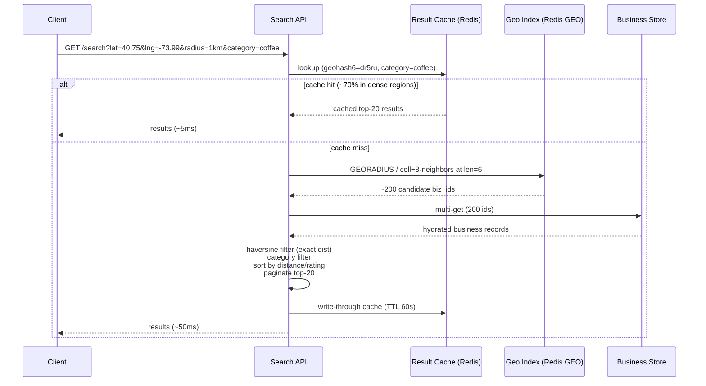
```mermaid
sequenceDiagram
    participant C as Client
    participant API as Search API
    participant RC as Result Cache (Redis)
    participant GI as Geo Index (Redis GEO)
    participant DB as Business Store

    C->>API: GET /search?lat=40.75&lng=-73.99&radius=1km&category=coffee
    API->>RC: lookup (geohash6=dr5ru, category=coffee)
    alt cache hit (~70% in dense regions)
        RC-->>API: cached top-20 results
        API-->>C: results (~5ms)
    else cache miss
        API->>GI: GEORADIUS / cell+8-neighbors at len=6
        GI-->>API: ~200 candidate biz_ids
        API->>DB: multi-get (200 ids)
        DB-->>API: hydrated business records
        API->>API: haversine filter (exact dist)<br/>category filter<br/>sort by distance/rating<br/>paginate top-20
        API->>RC: write-through cache (TTL 60s)
        API-->>C: results (~50ms)
    end
```

The cache key intentionally uses `geohash_prefix` (not raw lat/lng) so two queries from anywhere in the same ~600m cell share a cache entry — that's how the result-cache hit rate gets to 70%+ on Times Square coffee at noon.

**Geohash precision vs query cost — visual.** Pick precision such that one cell ≈ search radius; you query target cell + 8 neighbors and let haversine clean up edges. Mis-pick precision and you either over-fetch (cell too large) or miss results (cell too small).

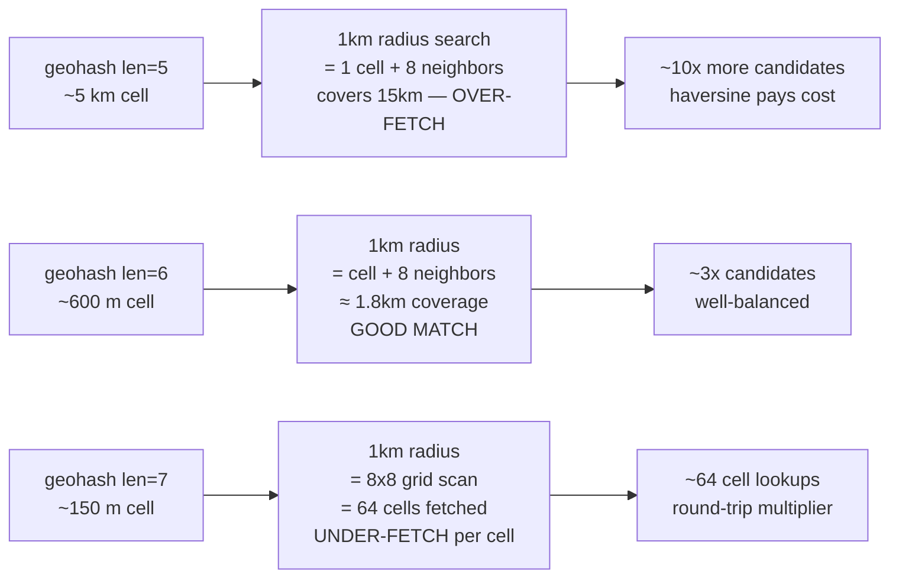
```mermaid
flowchart LR
    R5["geohash len=5<br/>~5 km cell"] --> Q5["1km radius search<br/>= 1 cell + 8 neighbors<br/>covers 15km — OVER-FETCH"]
    R6["geohash len=6<br/>~600 m cell"] --> Q6["1km radius<br/>= cell + 8 neighbors<br/>≈ 1.8km coverage<br/>GOOD MATCH"]
    R7["geohash len=7<br/>~150 m cell"] --> Q7["1km radius<br/>= 8x8 grid scan<br/>= 64 cells fetched<br/>UNDER-FETCH per cell"]
    Q5 --> Cost5["~10x more candidates<br/>haversine pays cost"]
    Q6 --> Cost6["~3x candidates<br/>well-balanced"]
    Q7 --> Cost7["~64 cell lookups<br/>round-trip multiplier"]
```

Rule of thumb: cell width ≈ 1.5× search radius. The "9-cell scan" assumption (target + 8 neighbors) only holds if precision is right; otherwise you're scanning a grid, not a 3x3.

**Geohash precision table.** *[Source: geohash.org reference]*

| Length | Cell width × height | Use case |
|---|---|---|
| 4 | 39 × 19 km | regional search ("restaurants in NYC") |
| 5 | 4.9 × 4.9 km | city-scale ("coffee shops near downtown") |
| 6 | 1.2 × 0.6 km | neighborhood ("food within walking distance") |
| 7 | 153 × 153 m | street-level ("bars on this block") |
| 8 | 38 × 19 m | sub-block precision (driver dispatch) |

**H3 (Uber's hex grid) deep dive.** *[Source: Uber engineering, H3 paper]* H3 wraps Earth in **hexagons projected onto an icosahedron**, with **16 resolutions** (0-15) where each level has ~1/7 the area of the parent. **122 base cells**; to handle the icosahedron's vertices (where you can't tile with hexagons alone) H3 introduces **12 pentagons**, deliberately positioned over water to minimise land collisions.

Why hexagons over geohash squares: a hex has only one neighbor distance (center-to-center is the same to all 6 neighbors), while a square has two (4 edge-neighbors closer than 4 corner-neighbors). This makes "find all cells within K rings" trivial for hex (uniform expansion) and awkward for geohash (which-direction-am-I-going calculations). Each cell is a **64-bit integer**, and child IDs truncate to ancestor IDs — so coarsening is a bitshift, not a recompute. Uber dispatches drivers, computes surge zones, and aggregates demand using H3 because uniform neighbor distance makes "demand near here" comparable across cells.

**S2 vs Geohash vs H3 quick guide.**
- **Geohash**: simplest, widely supported, edge weirdness, square cells distort near poles. Default for static low-scale.
- **S2 (Google)**: hierarchical Hilbert curve on a sphere; better polar accuracy than geohash; 30 levels. Good for global services with high accuracy needs.
- **H3 (Uber)**: hexagons, uniform neighbors, designed for moving entities and aggregations. Best for ride-share, demand modeling.

**Quadtree for density skew.** A static geohash grid wastes precision in rural areas (one business per 1km cell) and overflows in dense areas (1000 businesses per cell in Times Square). Quadtree recurses where density demands it — leaf cells contain ≤k businesses regardless of geographic size. Trade-off: quadtree updates require rebalancing on insert/delete, which is expensive for moving entities; static businesses (Yelp) suit it well, drivers (Uber) don't.

#### Potential Follow-Up Questions
**Q: How do you handle the radius spanning a geohash cell boundary?**
Always query the target cell plus its 8 neighbors and let the haversine filter clean up false positives. Most candidates land in the central cell so cost stays bounded. *If pushed:* pick precision so cell width is ~1.5x the search radius — keeps neighbor scan small. Or switch to H3, where hex neighbors are uniform-distance and there's no edge weirdness.

**Q: How would you adapt this for moving entities (Uber drivers)?**
Swap the on-disk geohash index for an in-memory Redis GEO index — drivers GEOADD on every heartbeat (every few seconds). Read path is identical. *If pushed:* shard by city/region so a single Redis node doesn't see global write traffic; partition writes by driver_id within a region.

**Q: What if a single cell (Times Square) returns 10k candidates?**
Cap candidates at the index layer (top-K by rating per cell, pre-sorted) and short-circuit haversine once you have enough results. *If pushed:* split hot cells with a finer-precision sub-index, or pre-bucket candidates by `(cell, category)` so category filter happens in the index, not after.

**Q: How do you keep the index in sync with business CRUD?**
Dual-write: every business write hits Postgres (source of truth) and emits a CDC event that updates the geo index. Eventual consistency on the order of seconds is fine for search. *If pushed:* outbox pattern + Kafka so the index update can't be lost if the index store is briefly down; nightly reconciliation job catches drift.

**Q: How would you support polygon queries (delivery zones, neighborhoods)?**
Switch the index to an R-tree (PostGIS) for bounding-box and polygon containment queries. Geohash/H3 don't naturally support polygons. *If pushed:* dual index — geohash for radius (most traffic), R-tree for polygon (rare); route at the API layer by query shape.

**Q: How do you cache and invalidate hot regions?**
Cache result page for `(geohash_prefix, category, page)` with a short TTL (60s). Most queries against Times Square coffee at noon are identical. *If pushed:* invalidate on write via pub/sub keyed by affected cells; for live data (drivers) skip caching and rely on Redis throughput.


**Q: Why does Uber use H3 instead of geohash?**
Hexagons have uniform neighbor distance (one center-to-center distance to all 6 neighbors). Geohash squares have two distances (edge vs corner neighbors), which makes "demand within K rings" math awkward and biased. Uber aggregates demand into hex cells for surge pricing — uniform neighbor cost makes cells comparable. Plus H3 cells are 64-bit ints with hierarchical truncation: coarsening to a parent cell is a bitshift. *If pushed:* H3 has pentagons at icosahedron vertices (12 of them, deliberately placed in oceans) — they're real and code must handle them, but in practice nobody dispatches drivers from the middle of the Pacific.

**Q: How do you pick geohash precision for a given radius?**
Cell width ≈ 1.5× search radius. Too coarse and you over-fetch candidates (haversine eats the cost); too fine and you scan a grid of cells (round-trip cost). Length 5 = ~5km cell (good for "city-scale"); length 6 = ~600m cell (good for "neighborhood walkable"); length 7 = ~150m cell (street-level). *If pushed:* let the query specify radius and dynamically pick precision per query — most APIs hardcode a few buckets (walking/driving/regional) and route to the matching index.

**Q: Geohash vs S2 vs H3 — when to use which?**
Static businesses, low scale, simple needs: geohash. Global service with polar accuracy concerns or hierarchical roll-ups: S2 (Google Maps uses it). Moving entities and demand aggregation: H3 (Uber, Lyft). The choice is mostly about whether neighbor-distance uniformity matters and whether you need a Hilbert-curve property. *If pushed:* you can mix — use H3 for live driver index and PostGIS R-tree for polygon queries (delivery zones).

#### Bottlenecks & Mitigations
- **NYC density** (1000x rural) → adaptive precision (longer geohash) or quadtree. A uniform 600m geohash cell in Manhattan returns 1k businesses; in rural Wyoming the same cell returns 1. Adaptive precision uses shorter prefixes (larger cells) for sparse areas and longer prefixes (smaller cells) for dense ones; quadtree achieves this by construction (recurses deeper where density demands it).
- **Real-time updates** (driver locations) → in-memory grid + write-through cache. A static geohash index can't absorb 100k driver heartbeats per second; switch to in-memory Redis GEO (write-through, no batch rebuild) sharded by city/region so a single Redis node doesn't see global write traffic.
- **Result blow-up** (radius too big) → cap candidates, paginate. A 50km radius in Manhattan would hydrate 100k businesses; cap at first 200 candidates per cell at the index layer (sorted by rating), short-circuit haversine once we have enough results, return paginated with continuation token.
- **Hot region caching** → Redis cache popular queries (Times Square coffee shops). 70%+ of search QPS in dense areas is repeat queries (same prefix, same category, same hour); short-TTL result cache (60s) collapses the backend QPS by 3-5x. Invalidate on writes via pub/sub keyed by affected geo cells.

- **Wrong precision for query radius** → query cost explodes (over-fetch or grid scan). Pick precision such that cell width ≈ 1.5× search radius; otherwise you either pull 10x candidates (haversine cost) or scan 64 cells (round-trip cost). Most APIs route to one of three pre-tuned indexes (walking/driving/regional radius buckets).
- **Square-cell neighbor asymmetry** (geohash) → switch to H3 for moving-entity workloads. Geohash edge vs corner neighbors have different distances, biasing aggregations and "K-ring" queries. H3 hexagons have uniform 6-neighbor distance — fixes demand-aggregation math at the cost of slightly more complex implementation.

#### Failure Modes
| Layer | Failure | Detection | Mitigation |
|---|---|---|---|
| Geo index | CDC/index-update lag means new or updated businesses are missing from search | Source-to-index lag and stale-result canary | Keep source-of-truth writes separate, replay CDC, and fall back to slightly stale results rather than serving wrong exactness claims |
| Hot cell | One dense urban cell returns huge candidate sets and blows latency budget | Candidate-count histogram and per-cell p99 latency | Increase precision or split hot cells adaptively, and cache category-scoped results |
| Precision selection | Wrong geohash/H3 resolution causes massive over-fetch or too many neighbour scans | Candidate-count spike by radius bucket | Dynamically choose precision from radius buckets and monitor over-fetch ratios |
| Hydration store | Candidate IDs resolve slowly or partially from the business store | Multi-get latency and partial-hydration error rate | Keep the index slim, batch hydrates aggressively, and serve partial fallback if necessary |
| Cache staleness | Hot-result cache serves businesses that have just closed or changed category | Cache invalidation lag and stale-result complaints | Short TTL plus cell-based invalidation on important updates |
| Bad coordinates | Malformed or spoofed lat/lng records pollute nearby queries | Coordinate-sanity checks and outlier alerting | Validate writes, quarantine impossible coordinates, and rebuild affected cells from source data |

#### Observability — Key Metrics & SLOs
- **Search latency** — total API p99 plus separate geo-index and hydration subspans.
- **Candidates-per-query distribution** — best indicator of whether precision tuning is healthy.
- **Result-cache hit rate** in dense metros — should be high and materially reduce backend load.
- **Index freshness lag** — delay from source update to searchable state.
- **No-result rate** by density bucket — helps catch sparse-region precision mistakes.
- **Hot-cell skew** — a small number of cells often dominate traffic and deserve special treatment.

#### Multi-Region & DR
- **Replication mode:** geo indexes are region-local and rebuildable; the authoritative business store replicates more durably.
- **RTO:** fast for index-node loss because the in-memory index can reload from source or snapshot.
- **RPO:** tiny for source data, larger for in-memory derived indexes, which are acceptable to rebuild.
- **Failover cadence:** rehearse index rebuild and hot-region cache loss, not just database leader failover.
- **Cross-region cost:** mostly metadata replication and popular-result cache warmup, not huge blob movement.

#### Common Mistakes / Anti-patterns
- **Full-table scan with exact distance.** The index exists to prune by orders of magnitude before haversine runs.
- **Expecting the spatial index to be exact.** It should be approximate and cheap; exactness comes in the second phase.
- **One fixed cell size for every radius and density regime.** Urban and rural query shapes are radically different.
- **Using a driver-style live-write architecture for mostly static businesses.** Static and dynamic geo workloads want different stores.
- **Forcing polygon and radius queries through the same primitive.** R-tree / PostGIS exists for a reason.

#### Talking Points for the Interview
- **Approximate-then-exact** is the core nearby-search pattern.
- **Choose the index by workload.** Geohash, quadtree, H3, and S2 each have a place.
- **Density skew matters.** NYC and rural Wyoming cannot share one naive precision setting.
- **Hot-region caching is a major practical win.** Nearby search is incredibly repetitive at lunch and commute peaks.
- **The geo index is derived state.** The source-of-truth catalogue owns correctness.
- **H3 is a strong answer when uniform neighbour distance matters.**

### 14. Design Nearby Friends
#### Problem
Show friends within a radius of you, updating in near-real-time as they move; opt-in privacy.

#### Summary
**The picture in your head:** a bulletin board where each of your friends pins a sticky note with their approximate location every few minutes. You glance at the board when you open the app, see which friends are within a mile, and get a push notification when someone new shows up nearby. The board only holds the *latest* note per person — not the full history — and only you and your friends can see each other's notes (not strangers).

**The single-request walkthrough:** Alice is walking in San Francisco. Her phone detects motion and sends a location update every 30 seconds: `POST /location { lat: 37.77, lng: -122.41, ts: ... }`. The Location Service writes Alice's latest position to a fast in-memory cache (Redis, TTL 5 minutes) and publishes the event to Alice's personal pub/sub topic: `user.location.alice`. Bob, who is Alice's friend and has the app open, subscribed to Alice's topic when he opened the app. The Subscription Service receives the event from Alice's topic, checks an ACL cache (Access Control List — a record of who is allowed to see whom's location), confirms Bob has permission and is within 2km of Alice, and pushes a WebSocket message to Bob's phone. Bob's map dot updates within ~1 second. Meanwhile Dave, also Alice's friend but in London, produces zero pub/sub traffic: the pre-filter detects no in-radius subscribers and drops the publish before it ever hits the bus.

**The pieces (and what each one is for):**
- **Location Service** — receives the `POST /location` from the phone, writes the latest `(lat, lng, ts)` to Redis under the key `loc:{user_id}` with a 5-minute expiry. Does NOT keep full history by default (history is opt-in and stored in a separate wide-column database like Cassandra). The 5-minute TTL means a user who stops reporting disappears from the map naturally.
- **Pub/sub bus** — a message-passing system with one topic per user (`user.location.{user_id}`). When Alice's location updates, the Location Service publishes to `user.location.alice`. Friends who care about Alice subscribe to that topic. This decouples "Alice moved" from "tell Bob and Carol." Think of it as a radio station — many listeners, one broadcaster, no direct connections needed.
- **Subscription Service** — holds a routing table in memory: `(publisher_id → [active WebSocket connections of subscribers])`. When a location event arrives, it checks the ACL (does subscriber have permission?) and the geo-radius (is subscriber within the radius threshold?) before pushing. The pre-filter is critical: if Alice is in Tokyo and all her friends are in London, the publish is dropped before the Subscription Service even looks at the ACL.
- **Adaptive client sampler** — logic on the phone that controls how often GPS is queried. A stationary user reports every 5 minutes; a walking user every 30 seconds; a driving user every 10 seconds. A phone reporting every 5 seconds all day would be dead in 4 hours; adaptive sampling keeps the system viable on mobile by cutting GPS reports 30x for users who aren't moving.
- **ACL cache** — a per-node in-memory lookup that records `(publisher_id, subscriber_id) → allowed?`. Checked on every publish. When Alice revokes Bob's permission, a control-plane event immediately invalidates the cache entry — the stale window is milliseconds, not the full cache TTL.

**The thing that makes it hard:** imagine a music festival: 50,000 people in one place, all with the app open, all within each other's radius. Every one of Alice's 200 friends at the festival gets a location push every 30 seconds. That's 200 pushes × 50,000 users × 2 updates/minute = 20 million WebSocket messages per minute from one event. Multiply by every user who also has friends at the festival publishing their own locations. Without a strict pre-filter ("any in-radius subscribers?") you'd publish billions of useless events per day, and without per-user topic isolation a single message bus node would see every event from every user, which doesn't scale. The pub/sub-per-user design means the fan-out is bounded by actual friend-graph overlap, not total active users.

**Why the standard solution works:** keeping only the latest position (not a stream) and driving notification from a friend-graph-filtered pub/sub gives you the right answer: timely-enough proximity detection without tracking every human on the planet. The system is lazy — it only pushes when Alice moves AND Bob is nearby AND Bob has permission. Three conditions all true simultaneously is much rarer than just "Alice moved," so most location events produce zero WebSocket traffic. Bidirectional consent (both parties must approve before location sharing activates) is the correct default for location specifically — unlike social follows, where one-way is fine, one-way location access enables stalking.

**If you were building it tomorrow:**
- Redis for latest-location cache (`SET loc:alice 37.77,-122.41 EX 300`); Redis pub/sub or Kafka for the per-user topic bus; Cassandra for optional history partitioned by `(user_id, day_bucket)`.
- Location update hot path:
  ```
  redis.set(f"loc:{user_id}", f"{lat},{lng}", ex=300)
  if has_any_nearby_friend(user_id, radius_km):  # pre-filter
      pubsub.publish(f"user.location.{user_id}", payload)
  ```
- On publish receipt in Subscription Service: check ACL cache → check geo distance → push via WebSocket if both pass.
#### Clarifying Questions
- Update freshness (<10s)?
- Friend count avg + outliers?
- Battery constraints (mobile)?
- Privacy: per-friend opt-in?

#### Requirements
- **FR:** subscribe to friend locations, push updates within X sec, privacy controls, history (optional)
- **NFR:** real-time (<10s), battery-efficient on mobile, billions of location updates/day

#### Scale Estimate
- **Graph size:** Facebook-scale ~1B users with the feature enabled; avg 200 friends per Dunbar-corrected social graph → 1B × 200 = **200B directed (user, friend) pairs**. Edge row ~40B (user_id 8B + friend_id 8B + permission flags 4B + last_share_ts 8B + index overhead) → 200B × 40B = ~8TB; replication 3× → ~24TB on a sharded wide-column store partitioned by user_id.
- **Concurrent active:** ~10% of 1B users foreground at peak = ~100M (matches social-app foreground rates); background reporters (app installed, location-share permission granted, app suspended) ~50% of users = ~500M.
- **Update size:** ~100B per location update — user_id 8B + lat/lng 16B (double precision) + ts 8B + accuracy 4B + motion_state 1B + heading/speed 8B + auth token framing ~50B — Protobuf-packed for compactness.
- **Update frequency (adaptive):** driving 1/10s (high-motion needs fine resolution for nav-class accuracy), walking 1/30s, stationary 1/5min (no point publishing same coords), background 1/min (OS allows ~1/min for suspended apps). Blended: 100M foreground × (40% walking + 20% driving + 40% stationary) ≈ ~1/30s effective.
- **Throughput:** foreground 100M × (1/30s) ≈ 3.3M/s; background 400M × (1/60s) ≈ 6.7M/s → **~10M location writes/s peak**; foreground-only subset ~3M/s drives the latency-critical fan-out path.
- **Bandwidth:** 10M writes/s × 100B = ~1GB/s ingress steady; egress amplified by fan-out (each update pushes to in-radius friends, avg ~3 — most users are alone, hot spots like festivals push higher) → ~3GB/s egress.
- **Hot tier (latest-only):** 500M users with cached last-known location × ~120B per cache entry (lat/lng 16B + ts 8B + accuracy 4B + motion 1B + key 16B + Redis overhead ~75B) = ~60GB; in-memory cache with 5min TTL, sized at ~256GB across cluster for headroom + replication.
- **Cold tier (history, opt-in):** assume ~30% of users opt in to history (privacy default off) × ~1 update/min sustained × 60 × 24 × 365 ≈ 30M updates/user/yr × 100B = ~90TB/yr; wide-column store partitioned `(user_id, day_bucket)` with 30-day default TTL; older snapshots flushed to columnar object store (Parquet, ~10× compression) for analytics.
- **Pub-sub fan-out:** ~10M publishes/s × avg ~3 in-radius subscribers (people with you in friend-graph + within radius threshold) = ~30M WebSocket pushes/s peak. Festival/concert hot spots can drive local fan-out 100×, requiring rate limiting and clustering.

#### API Contract
```
WebSocket subscribe:
  → { type: subscribe, friend_ids: [...] }
  ← { type: location_update, friend_id, lat, lng, ts }

POST /location               body: { lat, lng, ts }   (from mobile, periodic)
POST /privacy/share/{user}   body: { enabled: bool }
```

#### High-Level Design
```
Mobile clients (sample GPS adaptively)
   │
   ↓ /location  (every 5–30s based on motion)
┌─────────────────┐
│ Location Service│ ─→ fast in-memory cache (latest loc, TTL 5min)
└────────┬────────┘ ─→ wide-column store (historical, optional)
         │
         ↓ publish to user's topic
┌────────────────────────────┐
│ Pub-sub (partitioned event │
│  stream / in-memory bus)   │
│ topic per user_id          │
└──────────┬─────────────────┘
           ↓ subscribers (friends with permission)
┌─────────────────────────┐
│ Subscription Service    │
│ - check ACL             │
│ - radius filter         │
│ - fan out to WebSocket  │
└──────────┬──────────────┘
           ↓
   Friend's mobile (WS push)
```

**How to read the diagram:** phones periodically upload their location, the backend stores the latest known position per user, and a proximity evaluator decides whether any of that user's friends are now near enough to matter.

**Why the flow is shaped this way:** constant exact tracking would destroy battery and raise privacy risk, so the system works from coarse snapshots and social filtering. Most of the world is irrelevant to any given user; only their friend graph is worth checking.

**What this layout buys you:** timely-enough proximity detection without treating the product like a military tracking system. The tradeoff is that nearby becomes approximate and policy-driven rather than perfectly continuous.

#### Data Model
- **locations_latest** (fast in-memory cache): `loc:{user_id} → (lat, lng, ts)`, TTL 5min
- **locations_history** (wide-column store, optional): `(user_id, ts, lat, lng)`
- **friends_graph** (wide-column store): `(user_id, friend_id, ts_added)`
- **privacy_share** (transactional store): `(user_id, friend_id, enabled, expires_at)`

#### Detailed Design
**Adaptive sampling (battery saving):**

| State | Sample interval |
|---|---|
| Stationary >5min | 5min |
| Walking | 30s |
| Driving (high speed) | 10s |
| Background | 1min minimum |

**Pub/sub fan-out.**
- Topic per user: `user.location.{user_id}`. Topic name is deterministic from user_id, so a subscribing client knows exactly what to subscribe to without a discovery step.
- Friends subscribe to their friends' topics on app open; subscriptions live in the Subscription Service memory keyed `(publisher → [subscriber WS connections])`.
- Pre-filter at publish: skip if no friend within radius. If A's location update has zero in-radius friends right now, the publish is a no-op — saves the bus traffic. Example: A is in Tokyo, all A's friends are in London → no publish even though A's location updated.

**Geo-radius filter.**
- On publish, query "who has me as friend AND is currently within R km" — first lookup is fast (friend list cached), second is the geo query.
- Use a sliding geo-index (quadtree of online users) to find subscribers. A separate in-memory geo index, keyed by user_id with last known location, lets the publisher quickly find subscribers within R km without scanning every friend. Updated continuously as locations change.
- Radius is configurable per user-pair (some friends share precise location, some share city-level only).

**Privacy.**
- ACL check on every publish (or cached for short TTL ~5s). Cache holds `(publisher_id, subscriber_id) → allowed?` and is invalidated via a control-plane pub-sub channel when a user toggles sharing — stale window measured in ms, not the cache TTL.
- Geo-fence (don't share when at sensitive locations) — client-side gate. User defines "home" or "work" as a polygon; phone refuses to publish while inside that polygon. Client-side because the server should never know about sensitive locations even existing.
- Bidirectional consent: A sharing with B requires both to have approved the relationship — prevents harassment via unilateral location subscription.


**Adaptive sample rate state machine.** Phone detects motion via low-power accelerometer + activity recognition (CMMotionActivity / Google ActivityRecognition); GPS sample rate ramps up/down. The state transitions matter because the wrong state burns 10-50x the battery.

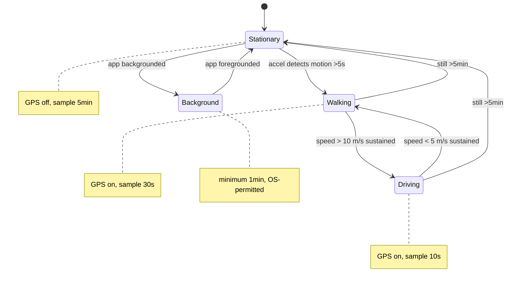
```mermaid
stateDiagram-v2
    [*] --> Stationary
    Stationary --> Walking: accel detects motion >5s
    Walking --> Stationary: still >5min
    Walking --> Driving: speed > 10 m/s sustained
    Driving --> Walking: speed < 5 m/s sustained
    Driving --> Stationary: still >5min
    Stationary --> Background: app backgrounded
    Background --> Stationary: app foregrounded
    note right of Stationary: GPS off, sample 5min
    note right of Walking: GPS on, sample 30s
    note right of Driving: GPS on, sample 10s
    note right of Background: minimum 1min, OS-permitted
```

The win: a stationary user (most users, most of the day — sleep, work, sitting at home) drops from one report per 10s to one per 5min — **30x fewer publishes**. Multiplied across a billion users, it's the difference between a viable system and one that melts the pub/sub bus. Activity recognition itself runs on a low-power coprocessor (Apple's M-series motion coprocessor; Android's sensor hub) — costs single-digit mA vs GPS's 100s of mA.

**Pub/sub fan-out shape.**

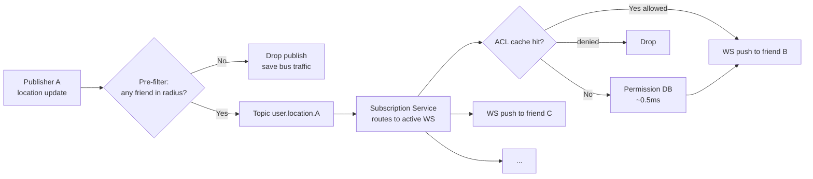
```mermaid
flowchart LR
    A[Publisher A<br/>location update] --> Pre{Pre-filter:<br/>any friend in radius?}
    Pre -->|No| Drop[Drop publish<br/>save bus traffic]
    Pre -->|Yes| Topic["Topic user.location.A"]
    Topic --> Sub[Subscription Service<br/>routes to active WS]
    Sub --> ACL{ACL cache hit?}
    ACL -->|Yes allowed| Push1[WS push to friend B]
    ACL -->|No| Recheck[Permission DB<br/>~0.5ms]
    ACL -->|denied| Drop2[Drop]
    Recheck --> Push1
    Sub --> Push2[WS push to friend C]
    Sub --> PushN[...]
```

The pre-filter step is critical: A in Tokyo, friends in London → no in-radius subscribers → publish becomes a no-op. Without pre-filter, you'd publish billions of irrelevant updates per day to topics nobody's reading meaningfully.

**Cassandra schema for history.** Partition by `(user_id, day_bucket)`, clustering by timestamp. Keeps partitions bounded (~24h × 1 sample/min = 1440 rows max per partition for stationary days) regardless of total user lifetime. TTL of 30 days at full fidelity; downsample to 1 point/minute for older data and archive to S3 Parquet for analytics. Avoids the unbounded partition trap that bit Discord on Cassandra.

**Bidirectional consent.** A subscribes to B → both must explicitly approve before subscription becomes active. Asymmetric "follower-style" subscriptions are tempting (matches social-graph products) but for **location specifically**, it enables stalking/harassment. Bidirectional gate solves the abuse vector definitionally; the UX cost (an extra approval flow) is the price.

#### Potential Follow-Up Questions
**Q: What if the pub/sub layer dies mid-update?**
Drop the realtime push and degrade to polling — clients fetch latest locations from Redis on a slow timer (30s). No history is lost because Cassandra writes are independent of pub/sub. *If pushed:* run two pub/sub clusters active-active and have clients reconnect to the healthy one; failover is seconds, not minutes.

**Q: How do you handle a user with 100k friends (an influencer)?**
Cap friend visibility at a few hundred, or shard their topic across multiple pub/sub partitions and round-robin subscribers. Most "friends" of that scale are followers, not bidirectional shares. *If pushed:* enforce bidirectional consent for location specifically — solves the problem definitionally.

**Q: How do you guarantee a revoked permission stops updates immediately?**
Revoke writes to Postgres and emits an invalidation event on a control-plane topic; every subscription server drops the (publisher, subscriber) pair from in-memory routing tables before the next location publish. ACL check on publish reads from a per-node LRU (~0.5ms) backed by that invalidation stream — stale window measured in milliseconds, not the cache TTL. *If pushed:* hard-revoke also tears down the subscriber's WebSocket route for that publisher and forces a resubscribe, so an in-flight publish that already passed the ACL check still can't be delivered.

**Q: How would you support location history without ballooning storage?**
Async writes to Cassandra partitioned by `(user_id, day_bucket)` with TTL of 30 days default. Downsample older data (one point per minute). *If pushed:* tiered storage — hot 7 days at full fidelity in Cassandra, cold archive in S3 Parquet for analytics.

**Q: How do you prevent location spoofing or harassment?**
Server-side sanity checks (impossible velocity, sudden teleports → flagged), rate limit per device, mandatory per-friend opt-in with audit log. Geo-fence client-side to suppress sensitive areas. *If pushed:* attestation via mobile platform (DeviceCheck/Play Integrity) to reject rooted/spoofed clients.

**Q: How would you scale this 10x to 1B concurrent users?**
Shard pub/sub topics by user-id hash across N regional clusters; route subscribers to the same shard as friends' publishers when possible. Edge-terminate WebSockets. *If pushed:* push more filtering to client (subscribe to a coarse geohash bucket, not individual friends) — cuts subscription cardinality by 100x.


**Q: Why bidirectional consent for location specifically?**
Location enables stalking and harassment in ways that follower-style asymmetric subscriptions don't. A unilateral "I subscribe to your location" is the abuse vector. Bidirectional gate solves it definitionally — both parties approve. UX cost is one extra approval flow; safety win is enormous. *If pushed:* even bidirectional has edge cases (coercion in DV situations) — surface a "pause sharing" toggle that doesn't notify the other party, and audit-log all subscription changes so abuse patterns are detectable.

**Q: How much battery does adaptive sampling actually save?**
Stationary users go from 1 GPS fix per 10s to 1 per 5min — 30x fewer fixes. Most users are stationary most of the day (sleep, work, sitting at home), so the average savings approach the stationary case. Activity recognition runs on a low-power coprocessor (single-digit mA) vs GPS's 100s of mA. Net effect: a phone that would die in 4 hours of constant location publishing lasts a normal day. *If pushed:* iOS's significant-location-change API offers an even cheaper option — only wakes the app when the user moves >500m, but with much coarser update cadence.

**Q: Avoiding Cassandra hot partitions for location history?**
Partition by `(user_id, day_bucket)`, not just `user_id`. A stationary user generates ~24h × 1/min = 1440 rows/day; an active user maybe 10x. Partition stays bounded. Without the day_bucket, partitions grow unboundedly over a user's lifetime — same trap that bit Discord. *If pushed:* for very-active users (drivers, runners) tune bucket size down to hour or use TTL aggressively to keep working set small.

#### Bottlenecks & Mitigations
- **Mobile battery** → adaptive sampling, defer when stationary. A phone reporting every 5s dies in 4 hours; adaptive sampling cuts reports by 20-50x for stationary users (most of them, most of the day) by detecting motion via accelerometer and only ramping up GPS rate during active movement.
- **Hot user (1M friends)** → cap, or shard subscribers across multiple Pub/Sub topics. Publishing to 1M subscribers per location update is intractable; cap visibility at a few hundred (most "friends" beyond that are followers, not bidirectional shares) and shard the topic across multiple partitions for legitimate high-degree cases.
- **Privacy churn** → cache permission with short TTL + invalidate on change. ACL check on every publish at 10M publishes/s would melt the permission DB; cached permissions per Subscription Service node with a 5s TTL absorb 99%+ of checks. Invalidation events (user toggles share) propagate via control-plane pub/sub and force eviction in ms.
- **Location update storm** → debounce client-side; coalesce at server. A buggy app could spam 100 updates/s; client debounces to 1/sec max, server coalesces dupes within a 1-sec window per user keyed on `(user_id, lat, lng) bucket`.
- **Network blip** → buffer locally, batch upload on reconnect. Phone loses connectivity in a tunnel; client buffers up to ~30 location samples locally and uploads them in one batch on reconnect, with original timestamps so historical accuracy is preserved.

- **Unbounded Cassandra partitions** for location history → partition by `(user_id, day_bucket)` not just `user_id`. Without the time bucket, partitions grow forever and reads pay the cost; with it, partitions stay ~1440 rows/day max for a stationary user.
- **Pre-filter at publish time** → drop updates with no in-radius subscribers. A user in Tokyo with friends in London should produce zero pub/sub traffic; pre-filter via the geo index before the publish hits the bus. Without this, you spam billions of empty topics.
- **Privacy abuse vector** → bidirectional consent is the only safe default for location-sharing. Asymmetric "follower-style" subscriptions enable harassment and stalking. Cost is one extra UX step; the alternative is unmitigated abuse.

#### Failure Modes
| Layer | Failure | Detection | Mitigation |
|---|---|---|---|
| Sampling / battery logic | Client stays in high-frequency GPS mode and drains battery | Sample-interval distribution and battery-health telemetry | Activity-aware client throttling, server-side anomaly detection, and remote-config fallbacks |
| ACL enforcement | Permission revocation lags and one extra update leaks | ACL invalidation lag and privacy canary | Check permission at publish time, invalidate caches immediately, and tear down subscriptions on revoke |
| Pub-sub | Real-time fan-out layer fails and map updates stop | Publish success rate and subscriber-delivery lag | Fall back to polling latest-known positions from hot cache until pub-sub recovers |
| Geo cache | Latest-location TTLs expire or go stale unexpectedly | Stale-dot rate and latest-location miss alarms | Short TTL plus client reconnect / republish, and degrade to “last seen” UI rather than false precision |
| History path | Optional history capture stores data when user expected ephemeral mode | History-write audits and privacy-policy canary | Separate hot latest-state from opt-in history path and hard-gate history writes behind explicit flags |
| Spoofing | Modified clients inject impossible movement | Teleport / impossible-velocity detector | Quarantine suspicious updates, rate-limit, and require stronger device attestation for repeat offenders |

#### Observability — Key Metrics & SLOs
- **End-to-end location update latency** — device send to friend render for active sessions.
- **Fan-out per update** — helps detect hot-user abuse, radius-filter mistakes, and event hotspots.
- **Sample-interval distribution by motion state** — best battery-efficiency signal.
- **ACL invalidation latency** — privacy-critical metric that should be close to instantaneous.
- **Stale-dot rate** — fraction of rendered friend markers older than the UX target.
- **Suppressed-sensitive-location update count** — validates client-side geo-fence behavior.

#### Multi-Region & DR
- **Replication mode:** real-time pub-sub and hot latest-location caches are region-local; optional history replicates more durably.
- **RTO:** very fast for gateway/pub-sub node loss because sessions reconnect; slower for whole-region failover because subscriptions must re-establish.
- **RPO:** latest positions are ephemeral and may be lost on failover; history path should have near-zero loss for opted-in data.
- **Failover cadence:** test permission revocation and reconnect behavior under regional failover, not just raw location writes.
- **Cross-region cost:** mainly optional history replication and cross-region friend relationships, not massive payload sizes.

#### Common Mistakes / Anti-patterns
- **Server-driven sampling policy only.** The phone knows motion and battery state; sampling belongs primarily on the client.
- **Asymmetric default sharing.** For location, bidirectional consent is the safe default.
- **Putting full history on the hot path.** Nearby-friends is mostly a latest-state system, not a tracking warehouse.
- **Broadcasting updates to all friends regardless of proximity.** Radius pruning is a first-class scaling control.
- **No silent pause / safety mode.** Privacy products need escape hatches that do not announce themselves.

#### Talking Points for the Interview
- **Adaptive client-side sampling** is the battery story; without it the product dies on mobile.
- **Latest-only hot cache** is the performance and privacy story; history is optional and separate.
- **ACL at publish time** is the safety story; subscription-time checks alone are not enough.
- **Bidirectional consent matters here more than in ordinary social follows.**
- **Radius pre-filtering saves huge amounts of useless fan-out.**
- **Sensitive-location geo-fences are a strong privacy differentiator to mention.**

### 15. Design Google Maps
#### Problem
Render map tiles, plan routes, and provide turn-by-turn navigation globally with live traffic.

#### Summary
**The picture in your head:** a wall-sized atlas printed in advance, plus a live radio traffic report. The atlas (map tiles) was printed last week and barely changes — it's cheap to hand out millions of copies. The traffic report (live road speeds) is fresh every 5 minutes and tells you which pages of the atlas to avoid. Route planning is done by a navigator who has memorized the atlas and listens to the traffic report before suggesting a path.

**The single-request walkthrough:** you ask Maps to route from home (San Francisco) to work (Mountain View). The Routing Service loads a precomputed road graph of California into memory — roughly 10 million intersections (nodes) and 30 million road segments (edges). Each edge has a weight representing travel time. Without any tricks, finding the shortest path (Dijkstra's algorithm) would explore millions of nodes and take minutes. Instead, the service uses Contraction Hierarchies (a preprocessing technique that adds "shortcut" edges between important highway junctions so the query only needs to climb to major roads, not crawl every surface street): the route returns in under 100ms. Live traffic adjustments are overlaid as edge-weight deltas — "I-280 southbound currently 45mph instead of 65mph" — without rebuilding the whole graph. While you navigate, your phone's anonymized GPS pings join 3 million others feeding the Traffic Aggregator, which recomputes per-segment average speeds every 5 minutes and pushes those deltas to the routing service.

Separately, the map tiles you see on screen were precomputed offline, stored in a CDN (a geographically distributed cache network), and fetched by your phone as you pan and zoom — each tile identified by coordinates `(zoom, x, y)`. A 95% CDN cache hit rate means only 5% of tile requests ever reach the origin servers.

**The pieces (and what each one is for):**
- **Map Tiles** — the visual map is sliced into a grid of small image or vector files, each covering a fixed geographic area at a specific zoom level. A vector tile (format: MVT — Mapbox Vector Tile) contains the raw geometry (road lines, building shapes, labels) rather than a rendered image, so your phone renders the visual style locally. This means the same tile bytes power dark mode, light mode, and satellite view without different files — a 3x storage saving over pre-rendered raster (PNG) tiles.
- **CDN (Content Delivery Network)** — a global network of cache servers. Tiles are served from whichever CDN server is geographically close to you. Popular tiles (central London, Times Square) stay cached indefinitely; cold tiles are fetched from origin on the first request and cached for subsequent users. CDN absorbs 95%+ of tile traffic.
- **Road Graph** — the planet's roads stored as a mathematical graph: ~50M nodes (intersections) and ~150M edges (road segments) globally, each edge weighted by travel time. Loaded into routing service RAM for one continent at a time (~2GB per continent after Contraction Hierarchy preprocessing). Not a database — a RAM-resident data structure for fast path search.
- **Contraction Hierarchies (CH)** — a preprocessing step (runs nightly) that ranks every road node by "importance" and adds shortcut edges between important highway junctions. During a route query, the search only travels "upward" through the importance ranking (local roads → arterials → highways) from both the origin and destination, meeting in the middle. A cross-continent route that would take minutes with raw Dijkstra takes under 100ms with CH.
- **Traffic Aggregator** — consumes anonymized GPS pings from active navigation sessions. For each ping, a map-matching algorithm (using a Hidden Markov Model — a statistical technique for inferring which road segment the phone was on given noisy GPS coordinates) snaps the ping to a road segment. Speeds per segment are averaged over a 5-minute sliding window. Results are pushed as edge-weight overlays to the routing service — the CH graph itself is never rebuilt for traffic (that would take hours); only the edge weights change.

**The thing that makes it hard:** Contraction Hierarchies are built assuming edge weights don't change much. When heavy traffic cuts I-280's speed from 65mph to 15mph — a 4x weight change — the precomputed shortcuts may no longer be optimal. You can't rebuild the CH nightly and apply live traffic deltas to a structure built for normal weights. The production fix is Customizable Contraction Hierarchies (CCH), which separates the "which nodes to contract" step (metric-independent, done once) from the "what are the actual weights" step (metric-dependent, takes seconds). For a sudden road closure, a fast-path override channel flips the edge weight to infinity in seconds without waiting for any rebuild.

**Why the standard solution works:** the system survives at scale because nearly everything is precomputed. Tiles are rendered once and cached for months. The road graph is preprocessed nightly. Only the live traffic layer requires online computation. This means 350 million navigation requests per day are served mostly by cache hits and RAM lookups, not expensive computation. The tradeoff is operational complexity: the tile rendering pipeline, CH preprocessing jobs, and traffic aggregation stream must all be kept in sync, and a nightly CH rebuild for a continent takes hours.

**If you were building it tomorrow:**
- Tiles: precomputed MVT files in S3, served via CloudFront CDN; rebuild only changed tiles on OSM diff apply (~50TB/week of re-renders vs 5PB full rebuild).
- Routing: continent road graph loaded into RAM on each routing service pod; CH preprocessing job runs nightly in a batch pipeline; live traffic deltas applied as an in-memory edge-weight overlay.
- Hot path for a route request:
  ```
  graph = load_ch_graph(region="california")  # RAM, loaded once
  overlay = get_traffic_overlays(graph.edges)  # fresh every 5min
  path = bidirectional_dijkstra(graph + overlay, origin, dest)
  return path.polyline, path.eta
  ```
#### Clarifying Questions
- Map data source (OpenStreetMap or proprietary)?
- Routing modes (drive, walk, transit, bike)?
- Live traffic? Indoor maps? AR?
- Offline maps?

#### Requirements
- **FR:** map rendering (tiled), search (geocoding), routing, turn-by-turn nav, live traffic
- **NFR:** sub-second tile fetch, <1s route compute (continent), accurate, scalable

#### Scale Estimate
- **Users / request volume:** Google publicly cites >1B Maps MAU. Assume ~500M DAU; each session opens ~20 tiles (pan/zoom) → ~10B tile req/day. Per second: 10B / 86,400 ≈ 115k tile req/s avg, ~3× peak ≈ 350k/s.
- **Tile size:** Mapbox/OSM benchmarks: vector tile (MVT, gzip) ~10–50KB depending on density (rural vs. dense urban); raster PNG ~20–80KB at 256px (z≥14 with labels). Use ~30KB blended avg.
- **Tile count:** quadtree → 4^z tiles per zoom. Sum z=0..20: 4^21/3 ≈ 1.4T potential. But ~70% of Earth is ocean and most high-zoom tiles are empty/uniform; real coverage (land + populated water) ~1–5% → ~50B materialised tiles × 30KB ≈ 1.5PB per style. Standard map styles (default, dark, satellite) → ×3 ≈ 5PB rendered corpus.
- **Tile churn:** OSM diff feed shows ~3M edits/day globally → ~1% of tiles touched per week. 1% × 5PB = 50TB/wk re-render budget; incremental rendering only redoes affected (z, x, y).
- **CDN hit rate:** Zipf-distributed tile popularity (top cities dominate) → CDN hit rate >95% empirically (Google/Mapbox blog posts). Origin = 5% × 10B = 500M req/day → ~6k req/s avg on the tile origin.
- **Road graph:** OSM exports show ~50M routable nodes, ~150M edges globally; sub-regions ~10M nodes / ~30M edges. Contraction Hierarchies adds ~1 shortcut per edge → ~60M edges × 32B (two node IDs + weight + flags) ≈ 2GB resident per continent — fits in RAM on a single routing box.
- **Routing QPS:** ~500M DAU × 10% in-nav at any time × peak factor → 1M concurrent navigations. Reroute every ~30s on path deviation → 1M / 30 ≈ 33k computes/s peak; with caching of common OD pairs ~10k cold computes/s.
- **Traffic ingest:** 1B Maps phones × ~10% navigating × 1 ping/30s = ~3M pings/s steady, 30M/s during commute peaks. Ping payload (lat, lng, heading, speed, ts, anon_id) ≈ 100B → ~3GB/s ingress. Pings aggregated into per-segment speeds in 5-min tumbling windows then dropped → no long-term storage cost.

#### API Contract
```
GET /tiles/{z}/{x}/{y}.png             → image
GET /vector_tiles/{z}/{x}/{y}.mvt      → vector data
POST /route                            body: { origin, dest, mode, prefs }
                                       → { polyline, steps, eta }
POST /geocode                          body: { query }
                                       → { lat, lng, address }
WS /navigate                           ← turn-by-turn updates
```

#### High-Level Design
```
                                        ┌──────────────┐
              ┌────────────────────────→│ Tile Server  │ ─→ Object Store → CDN
              │                         └──────────────┘
   Client ────┤
              │      ┌──────────────┐    ┌──────────────────┐
              ├─────→│   Routing    │ ──→│ Road Network DB  │
              │      │   Service    │    │ (graph)          │
              │      └──────────────┘    └──────────────────┘
              │              ↑
              │      Live traffic adjusts edge weights
              │              ↑
              │      ┌──────────────────────────────┐
              │      │ Traffic Aggregator           │
              │      │ (consume anonymized GPS pings│
              │      │  → segment-level avg speeds) │
              │      └──────────────────────────────┘
              │
              │      ┌──────────────┐
              └─────→│  Geocoder    │ → Search Index (address)
                     └──────────────┘
```

**How to read the diagram:** the map display path and the routing path are related but different. Tiles are static assets prepared ahead of time, while routing queries run over a road graph and then fold in live traffic data before returning a path and ETA.

**Why the flow is shaped this way:** static geography changes slowly, so it should be packaged and cached aggressively. Traffic and road conditions change quickly, so that logic must stay online and query-driven. Keeping those concerns separate makes both easier to scale.

**What this layout buys you:** cheap map rendering, flexible routing, and the ability to add live updates without rebuilding the entire world model. The tradeoff is that several data systems must line up correctly to answer what feels like one simple user question.

#### Data Model
**Tile addressing (quadtree):**
```
World at z=0 = single tile (256×256 px)
At z=1: 2×2 tiles
At z=2: 4×4
...
At z=20: 2²⁰ × 2²⁰ tiles

Tile coord (z, x, y) = (zoom, column, row)

Same key whether raster (PNG) or vector (MVT)
```

**Road network (graph):**
- Nodes = intersections; Edges = road segments with weight = travel_time
- Stored partitioned by region; loaded into routing service memory
- ~10M nodes, ~30M edges per continent

#### Detailed Design
**Tile rendering:**

| Type | Pros | Cons |
|---|---|---|
| **Raster (PNG)** | server renders, simple client | huge storage; one style only |
| **Vector (MVT)** | client renders → themeable, scalable, smaller | client CPU |

→ Vector tiles winning post-2015. Pre-render once, theme/style on client. Storage savings are dramatic: a single MVT tile averages 10–50KB, vs. a separate raster set per style (default + dark + satellite at ~30KB each = 3× storage). Multiply by ~50B real tiles globally and the difference is petabytes.

**Routing — why not naive Dijkstra?** A continent road graph has ~10M nodes and ~30M edges. Best-case Dijkstra explores roughly half the graph for a long route — minutes per query, single-threaded. With ~10k route requests/sec at peak, that's 600k CPU-seconds/sec, which doesn't fit on a planet's worth of routing servers. The fix is to pay the cost once during pre-processing and amortise it across every subsequent query.

**Contraction Hierarchies (CH).** Pre-processing ranks nodes by "importance" (a heuristic combining edge difference, depth in shortcut tree, and node degree); then iterating bottom-up, each node is contracted by adding shortcut edges between its neighbours that represent the through-path bypassing it. After pre-processing the graph has roughly 2× the original edges, but a query only walks "upward" — bidirectional Dijkstra from source going up the hierarchy and from destination going up, meeting in the middle. A cross-continent route returns in <100ms. Pre-processing itself takes hours per continent, so it runs nightly.

**A\* with landmarks (ALT).** Alternative to CH: pick K well-spread landmark nodes (often 16–32) and pre-compute the shortest distance from every node to every landmark. At query time use the triangle inequality (`dist(u, dest) >= |dist(u, L) - dist(dest, L)|`) as the A\* heuristic, picking the tightest landmark per expansion. Result is a directional search that's faster than Dijkstra but typically 5–10× slower than CH. ALT's advantage: re-weighting edges (live traffic) doesn't invalidate the heuristic — CH shortcuts can become non-optimal under heavy traffic deltas, requiring overlay logic.

**Live traffic.** Anonymized GPS pings (sampled at ~1/30s per active nav session) flow into the aggregator. Map-matching snaps each ping to a road segment using lat/lng + heading + a Hidden Markov Model over the last few pings. Per-segment speed is computed over a tumbling 5-min window with a trimmed mean (drop top/bottom 10% to ignore one stopped car or one outlier doing 100mph). The result is a delta `(edge_id, new_speed_kmh)` pushed to the routing service as an overlay; next route request reflects reality.

**Tile pipeline: raster vs vector rendering.** *[Source: Mapbox / MapLibre]* Two different request paths share only the `(z,x,y)` addressing scheme — one ships pixels, the other ships geometry. Storage, restyling, and high-DPI rendering all collapse into the vector pipeline as cheap operations.

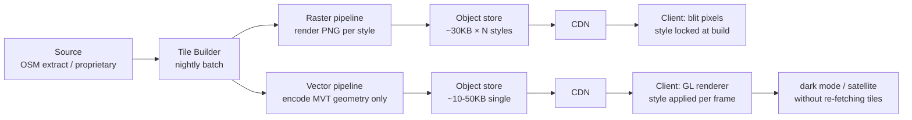
```mermaid
flowchart LR
    OSM[Source<br/>OSM extract / proprietary] --> Bld[Tile Builder<br/>nightly batch]
    Bld --> Raster[Raster pipeline<br/>render PNG per style]
    Bld --> Vector[Vector pipeline<br/>encode MVT geometry only]
    Raster --> RStore[Object store<br/>~30KB × N styles]
    Vector --> VStore[Object store<br/>~10-50KB single]
    RStore --> CDN1[CDN]
    VStore --> CDN2[CDN]
    CDN1 --> RClient[Client: blit pixels<br/>style locked at build]
    CDN2 --> VClient[Client: GL renderer<br/>style applied per frame]
    VClient --> Theme[dark mode / satellite<br/>without re-fetching tiles]
```

Raster locks one style per render — three styles (default, dark, satellite) means ~3× storage for the same world. Vector encodes only `(geometry, properties)` so style is a runtime decision; same MVT bytes drive every theme. High-DPI on raster needs a `@2x` parallel pyramid (~4× storage); vector renders any DPI for free. Trade-off is client GPU/CPU and a vector renderer (Mapbox GL, MapLibre) on every platform.

**OSM diff replication.** *[Source: OpenStreetMap planet.osm/diffs]* Source-of-truth churns continuously — global edit rate ~10 edits/sec, ~1M edits/day. Full planet re-extracts are ~80GB compressed PBF (impractical to redownload), so OSM publishes incremental diffs at three cadences:

| Granularity | Cadence | Use |
|---|---|---|
| Minutely | every 60s | live editing tools, internal analytics |
| Hourly | hh:02 | most production tile builders |
| Daily | 00:05 UTC | low-touch consumers |

Files are gzipped `OsmChange` XML (`AAA/BBB/CCC.osc.gz`, sequence `N = AAA×10^6 + BBB×10^3 + CCC`) with a sidecar `state.txt` carrying the sequence number — Osmosis / Osmupdate consume the cursor and apply changes idempotently to a local Postgres + osm2pgsql DB. Tile invalidation is keyed by feature bounding-box → set of `(z,x,y)` tiles touched → re-render queue. Steady-state ~50TB/wk re-render churn vs ~5PB rebuild for a full planet.

**Traffic state per road segment.** *[Source: Google Maps engineering]* Each edge runs a small state machine driven by the trimmed-mean speed against its historical typical for time-of-day. Hysteresis (state must hold ≥2 windows) keeps a single ping flap from oscillating the rendered colour or invalidating cached routes.

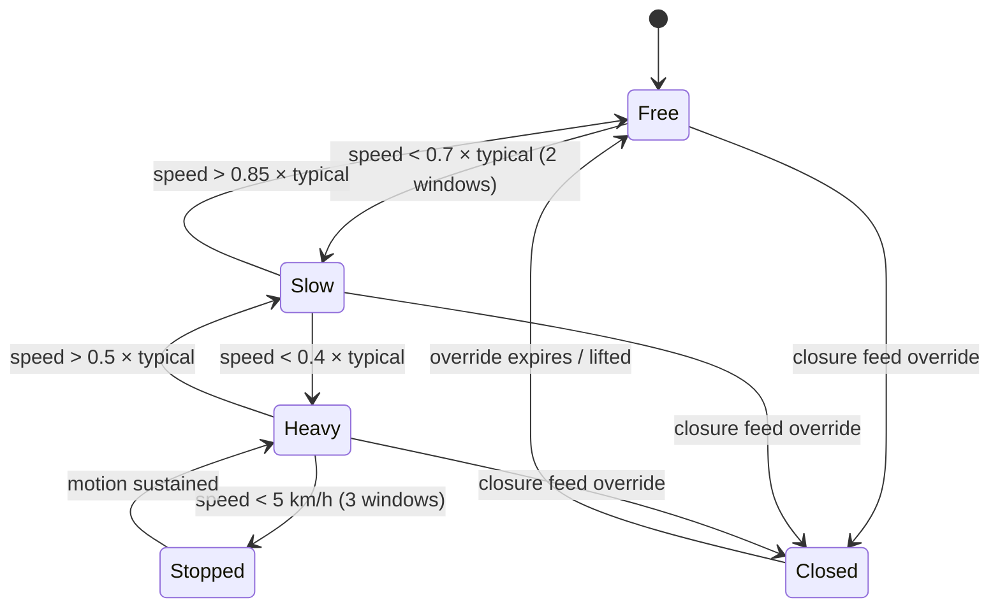
```mermaid
stateDiagram-v2
    [*] --> Free
    Free --> Slow: speed < 0.7 × typical (2 windows)
    Slow --> Free: speed > 0.85 × typical
    Slow --> Heavy: speed < 0.4 × typical
    Heavy --> Slow: speed > 0.5 × typical
    Heavy --> Stopped: speed < 5 km/h (3 windows)
    Stopped --> Heavy: motion sustained
    Free --> Closed: closure feed override
    Slow --> Closed: closure feed override
    Heavy --> Closed: closure feed override
    Closed --> Free: override expires / lifted
```

The `Closed` transition is exposed as a fast-path config channel (seconds, not the nightly CH rebuild) so a road closure flips the edge weight without waiting for traffic samples to confirm.

**H3 vs S2 vs quadtree for spatial sharding.** *[Source: Uber H3 Engineering]* Tiles use a quadtree (`(z,x,y)`) — naturally square, aligned to web mercator. For *aggregation* (heatmaps, traffic per zone, geofencing), H3 hexagons beat quadtree squares: hexagons have one neighbour distance (squares have two: edge vs diagonal), they approximate circles cleanly, and 16 resolutions at 7× area ratio per step give clean rollups. S2 (Google) is the same idea on a sphere with 30 levels; used internally for routing graph partitioning where cells must close under set ops. Quadtree for tiles, H3 for heatmaps, S2 for graph partitioning.

**Routing modes, indoor maps, AR — scope.** Drive, walk, bike, and transit each get their own pre-processed graph: walk/bike adds footpaths and ignores one-way restrictions; transit is a separate timetable graph (RAPTOR / CSA algorithms) joined to the road graph at stop nodes for first/last-mile. Indoor maps are a parallel tile pyramid keyed by `(building_id, floor_id, z, x, y)` with their own POI/router; the global pipeline doesn't know about indoor — it's a separate product surface that lights up when the user is inside a known venue. AR turn-by-turn (e.g. Google Live View) reuses the routing output but adds a vision-based localiser on the client (matching camera frames against a Street View feature index) to refine GPS to ~1m so arrows can be anchored to real-world geometry.


#### Potential Follow-Up Questions
**Q: How do you push a road closure live in seconds, not hours?**
Edge-weight overrides go through a fast-path config channel; the routing service applies the delta to its in-memory graph on next query. *If pushed:* full CH re-preprocessing is hours, so closures use overlay graphs / A\* fallback in affected regions until the nightly rebuild.

**Q: What happens to the user mid-trip when they go offline?**
Pre-fetch the route polyline plus a tile corridor on trip start; client navigates from cache. *If pushed:* re-routes degrade to straight-line snapping until reconnect; queue telemetry locally and flush on reconnect.

**Q: How would you scale to 10x map editors making concurrent edits?**
Partition edits by S2 cell; OCC with version vectors per feature, conflicts go to a moderation queue. *If pushed:* for hot tiles like a city centre, shard further by feature class (roads vs POIs vs buildings) to reduce contention.

**Q: How do you stop "shortcut through residential" routing complaints?**
Road-class penalty multipliers in edge weights; learn from aggregate trip data which shortcuts are real vs noise. *If pushed:* municipalities can submit overrides, but verify against local Maps GPS density before applying.

**Q: How do you detect map data poisoning (route into a lake)?**
Sanity checks at edit time — connectivity, road-class transitions, overlap with water polygons. *If pushed:* trust scores per editor; new contributors hit a review queue; auto-revert if downstream traffic shows zero or anomalous flow.

**Q: How do you monitor routing quality?**
Track ETA accuracy (predicted vs actual), reroute rate, and user-reported wrong-turns per region. *If pushed:* shadow-deploy new routing models on a sample of traffic and compare ETA error before flipping.

**Q: Why MVT specifically and not a custom binary format?**
MVT (Mapbox Vector Tile spec) is protobuf-based, ~2-5× smaller than equivalent GeoJSON after gzip, and every major renderer (Mapbox GL, MapLibre, Apple Maps internally) reads it. Standardising on MVT gives the client ecosystem for free. *If pushed:* for proprietary internal pipelines you can ship a denser custom encoding (Google's internal format is tighter than MVT) but you eat the renderer cost.

**Q: How do you keep CH valid under heavy live-traffic deltas?**
CH shortcuts assume edge weights monotonic-ish; a 5× weight jump on a major arterial can make a shortcut non-optimal. Production fix is *Customisable Contraction Hierarchies* (CCH) — separate the metric-independent contraction order from the metric-dependent customisation pass that runs in seconds, not hours. *If pushed:* fall back to ALT in regions with active large deltas; the heuristic stays admissible under reweighting.


#### Bottlenecks & Mitigations
- **Tile storage cost** (5PB+ across styles) → vector tiles cut storage 3× by moving styling to client; only changed tiles re-rendered weekly (~50TB churn vs. 5PB rebuild).
- **Routing latency** (Dijkstra is minutes on a continent) → CH/ALT pre-processing turns the route into a bidirectional walk on a 2× shortcut graph that fits in RAM; cross-continent <100ms.
- **Traffic data freshness vs. noise** (one stopped car ≠ congestion) → 5-min tumbling windows with trimmed-mean smoothing; edge-weight overlay applied without rebuilding the CH hierarchy.
- **Re-route on detour** (server can't recompute every GPS tick) → client checks distance from polyline; only triggers a server re-route on >50m deviation, off-route for >10s.
- **Search precision** (typos, ambiguity, "Springfield" disambiguation) → ES with edge-ngrams + custom analyzer + ranking signals (population, user location, query history).
- **Tile invalidation churn** (an OSM edit to a major boundary touches thousands of tiles across z=10–18) → bounding-box → tile-set mapping computed at apply time, deduped per render cycle; re-renders prioritised by predicted CDN-miss rate so popular tiles refresh first; cold tiles regenerate lazily on first request.
- **Vector tile renderer fragmentation** (browser, iOS, Android, embedded car head units all need a working MVT renderer) → standardise on MapLibre GL (open-source fork of Mapbox GL pre-license-change); platforms without it get a thin raster fallback served from the same vector pipeline (server-side render of the same MVT to PNG).

#### Failure Modes

| Layer | Failure | Detection | Mitigation |
|---|---|---|---|
| Tile CDN | Origin overload after large OSM diff invalidates millions of tiles | CDN miss-rate spikes, origin 5xx alerts | Pre-warm popular tiles before flipping the version pointer; rate-limit per-tile re-render queue; serve previous tile version on origin failure |
| Routing service | CH graph corruption after a partial nightly preprocess | Continent-wide route-failure rate jumps; sanity-check fixtures fail | Pin previous CH artefact; routing pods refuse to load a graph that fails fixture checks; auto-rollback |
| Traffic aggregator | Map-matching collapses on a vendor GPS-format change | Per-segment speed update rate drops, watermark stalls | Format-version gate at ingest; drop bad pings to a side topic; alert on segment-update lag > 5min |
| Live edge weights | Closure feed pushes a bad polygon (motorway flagged closed) | Reroute storm in a region; user-reported wrong-direction spike | Operator kill-switch on closure feed; rate-limit per-region closure events; require two-source confirmation for motorway-class closures |
| Geocoder | Index drift after partial reindex | Search recall regressions in canary | Blue/green index swap; ranking-quality gate before promotion |
| Cross-continent stitching | Boundary-node mapping inconsistent across regional pods after schedule rollover | Cross-continent route 5xx | Dual-load the touching regions on the stitch hop; fallback to single-continent route truncated at boundary with a clear error |

#### Observability — Key Metrics & SLOs

- `tile_p99_latency_ms` per CDN POP (target <200ms global, <500ms cold-tile origin)
- `route_compute_p99_ms` (continent <100ms, cross-continent <500ms) and `route_compute_5xx_rate`
- `eta_error_p50` (predicted vs realised arrival, watch for regional regressions)
- `traffic_freshness_seconds` (last edge-weight overlay age; alert >120s)
- `osm_diff_apply_lag_seconds` (hourly diffs should apply within 10min of publish)
- `cdn_hit_ratio` per zoom band (z>14 typically <90%, z<10 should be >99%)

**SLOs:** 99.9% of tile fetches <500ms via CDN; 99.5% of route requests <1s including network; ETA error p50 <10% of trip duration; live-traffic edge weights propagated to routing within 60s of aggregation.

#### Multi-Region & DR

- **Replication mode:** active-active for tiles (object store + CDN, regionally replicated; clients hit nearest POP). Routing is region-pinned (each pod loads one continent's CH graph) — failover is DNS/anycast switch to a peer region's pod fleet.
- **RTO:** 5min (DNS TTL + healthcheck cycle for routing). Tiles are immediate via CDN.
- **RPO:** ~0 for tiles (object store replication is sync within region, async cross-region with seconds lag). Live traffic state has RPO ~5min — overlays from the failed region's aggregator are lost; the peer region's aggregator backfills within one window.
- **Failover cadence:** quarterly game-day for routing region failover; tile origin failover is exercised monthly via traffic-shifting in CDN.
- **Cross-region cost:** tile object replication is the dominant line (~5PB × bandwidth × replication factor); routing is cheap because the graph is rebuilt locally each night from the same OSM source. Traffic ping ingest stays in-region — no cross-region replication of raw pings.

#### Common Mistakes / Anti-patterns

- Treating routing as a real-time Dijkstra problem rather than a pre-processed graph query — candidates who pitch "just run Dijkstra on a big-enough box" miss the order-of-magnitude that CH/ALT delivers.
- Conflating tiles and routing into one storage layer — they have orthogonal access patterns (immutable blobs vs in-memory graph) and sharing infrastructure costs both.
- Forgetting that one stopped car shouldn't paint a road red — naive per-segment averaging without trimmed-mean smoothing produces unusable traffic colouring.
- Picking raster tiles for a new design in 2026 — only justifiable when no platform vector renderer is available; otherwise it's a 3× storage tax for one style.
- Re-running CH on every traffic update — CH preprocessing is hours; live traffic must be an overlay, not a rebuild trigger.
- Ignoring the OSM diff cadence — designs that "rebuild the planet weekly" rather than applying minutely diffs miss the actual production pattern.

#### Talking Points for the Interview

These are what a Maps-team interviewer wants to hear surfaced unprompted:

- **The system is three loosely-coupled subsystems (tiles, routing, traffic) sharing only the road-graph source** — call out the split early and size each independently.
- **Contraction Hierarchies pre-process is the load-bearing decision** — without it, sub-second routing on a continent doesn't exist; with it, live traffic becomes an edge-weight overlay rather than a rebuild trigger.
- **Vector tiles, not raster** — name MVT specifically; the storage and theming wins are concrete and pre-empt "why not PNGs?".
- **Traffic is a stream-aggregation problem** — trimmed-mean over tumbling windows, hysteresis on state transitions, edge-weight overlay rather than CH rebuild.
- **CDN > origin by a 20:1 ratio** — tile popularity is Zipfian and the CDN absorbs 95%+ of fetches; designs that don't lean on this oversize the origin.
- **Customisable CH (CCH) is the production answer to "CH under heavy live traffic"** — separates metric-independent contraction from a fast metric-dependent customisation.
- **Region-pinned routing pods + boundary stitching** — rather than one global CH graph; explains how cross-continent routes work without a 100GB-RAM box.

### 16. Design a Distributed Message Queue (Kafka)
#### Problem
Decouple producers and consumers with durable, ordered, replayable, partitioned message streams at very high throughput.

#### Summary
**The picture in your head:** a newspaper printing press, but instead of one edition everyone reads, each section of the newspaper is printed on a separate conveyor belt (a partition), and every reader keeps a bookmark in their own copy of the belt. The press keeps printing — it never waits for readers, and it never removes old editions just because someone has already read them. A slow reader just falls behind; a new reader can start from the beginning or jump to today.

**The single-request walkthrough:** a payment service publishes a message: `producer.send("payments", key="user_42", value="{amount: 99}")`. Kafka hashes the key (`user_42`) to decide which partition to write to — let's say partition 2 on Broker 1. Broker 1 appends the message to its local append-only log file, assigns it offset 1042 (a sequential number that is its position in partition 2's log), and forwards it to Broker 2 and Broker 3, which hold replicas of partition 2 (a replica is a copy of the partition's log on a different machine, kept for durability). Because the producer used `acks=all`, Broker 1 waits until both Broker 2 and 3 have written the message before sending the ack. The fraud-detection consumer, part of consumer group "fraud-service," later issues a fetch: "give me messages from partition 2, starting at offset 1042." It processes the message, then commits offset 1043 — "I've processed everything up to 1042, start me at 1043 next time." If the consumer crashes at offset 1043, it restarts and finds its last committed offset (1043) from Kafka's internal tracking topic and resumes without re-processing or losing anything.

**The pieces (and what each one is for):**
- **Topic** — a named stream of messages (e.g. "payments," "user-events"). A topic is split into partitions for parallelism. Think of a topic as the newspaper, partitions as separate conveyor belts carrying sections of it.
- **Partition** — the fundamental unit of ordering and parallelism. Messages within one partition are strictly ordered by their offset (a sequential integer). Messages across different partitions have no order guarantee. The number of partitions sets the maximum number of consumers that can read a topic in parallel — you cannot have more consumers than partitions doing useful work simultaneously.
- **Broker** — a server that stores partition log segments on disk and serves reads and writes. A partition has one leader broker (all reads and writes go here) and N-1 follower brokers holding replicas (ISR — In-Sync Replicas — the set of followers caught up within 30 seconds). If the leader dies, a follower is elected leader and takes over with zero data loss.
- **Offset** — a monotonically increasing integer assigned to each message within a partition. Consumers track their position by committing their current offset. This is what makes replay trivial: reprocessing from scratch means resetting your committed offset to 0 and reading again.
- **Consumer group** — a set of consumers that coordinate to share a topic's partitions. Kafka assigns each partition to exactly one consumer in the group — so a group of 3 consumers processing a 6-partition topic each gets 2 partitions. Adding a 7th consumer to a 6-partition topic does nothing useful; the extra consumer sits idle.
- **KRaft (replacing ZooKeeper)** — the cluster metadata system (which brokers exist, which broker is the leader for each partition). The old system stored this in ZooKeeper (a separate distributed coordination service), which hit a ceiling of ~200,000 partitions per cluster. KRaft embeds the metadata directly in Kafka itself using the Raft consensus algorithm, lifting the ceiling to ~2 million partitions and cutting leader-election time from minutes to milliseconds.

**The thing that makes it hard:** imagine `user_42` is responsible for 10% of all payment events. All messages with key `user_42` hash to partition 2. Partition 2's consumer is now processing 10x the load of any other partition. You can't split partition 2 — partitions are indivisible. Your options: add a "salt" to the key (`user_42:bucket_0`, `user_42:bucket_1`, ...) to spread across multiple partitions (but you lose strict per-user ordering), or accept the hotspot and vertically scale the consumer for that partition. Partition count is also irreversible downward — you can add partitions but never remove them, because removing a partition would break the `hash(key) → partition` mapping and reorder previously-ordered messages. Pre-plan with extra partitions (50-100 for any important topic) to avoid a painful migration later.

**Why the standard solution works:** append-only sequential disk writes are among the fastest I/O patterns available — faster than random access to RAM in many benchmarks, because the hardware can predict the next sector. Kafka exploits this: brokers never update records in place, so the disk head never seeks. The OS page cache (a region of RAM the kernel uses to buffer disk reads and writes) holds recent log segments automatically; consumer reads on "hot" partitions hit RAM without any extra code. Zero-copy `sendfile()` (a kernel syscall that pipes log-file bytes directly to the network socket) skips the JVM heap entirely. These three tricks are why a single Kafka broker can sustain 1GB/s throughput.

**If you were building it tomorrow:**
- Kafka cluster: 10 brokers on NVMe SSDs, RF=3, `acks=all` + `min.insync.replicas=2` on financial topics; KRaft mode (no ZooKeeper).
- Producer hot path:
  ```
  producer.send(topic="payments",
                key=user_id,       # determines partition
                value=payload,
                acks="all")        # wait for ISR confirmation
  # ack = offset assigned by leader broker
  ```
- Consumer hot path: `poll()` → process message → `commit(offset + 1)`. Use `acks=at-least-once` by default (process then commit); add idempotency key in payload so re-processing duplicates is safe.
- For 30-day retention on a 1GB/s topic: enable tiered storage (KIP-405) so closed segments upload to S3 automatically — keeps local NVMe small while retaining the full log for replay.
#### Clarifying Questions
- Throughput target?
- Ordering guarantees? (per-partition, global)
- Delivery semantics? (at-least-once / exactly-once)
- Retention? (time, size)
- Single-DC or multi-region?

#### Requirements
- **FR:** publish, subscribe (consumer groups), partition, replay from offset, retention, schema
- **NFR:** millions of msg/s, durability (no loss on broker failure), ordered within partition

#### Scale Estimate
- **Throughput:** target a LinkedIn-tier multi-tenant cluster. ~3M msg/s avg ingress (audit, click, change-data, app logs all funnel through), 10M/s peak during deploys/incidents. Mean message ~1KB (Confluent benchmark; CDC rows + JSON events). 3M × 1KB = ~3GB/s avg, 10GB/s peak.
- **Per-broker:** modern NVMe sustains ~1GB/s sequential write under Kafka's append-only segment model (Confluent / Kafka 2.x benchmarks). 3GB/s avg / 1GB/s ≈ 3 brokers minimum; with RF=3 and headroom for compaction, leader-skew tolerance, and rolling restarts → ~10–30 brokers (also driven by partition count, see below).
- **Retention 7 days at avg load:** default broker config retention.ms=7d. 3GB/s × 86,400s/day × 7d = 1.81PB raw single-replica.
- **Replication factor 3** (typical for durability across racks): 1.81PB × 3 = 5.43PB. Index files (.index, .timeindex) ≈ 1% of log size → ~55TB extra → ~5.5PB total live disk.
- **Topic/partition count:** rule of thumb is ≤4k partitions/broker (controller failover time scales with this). 30 brokers × 4k = 120k cap; large orgs run 100k–1M cluster-wide via federation. Each partition = directory of 1GB segment files (segment.bytes default).
- **Consumer offsets topic:** internal `__consumer_offsets`. ~100k consumer groups × ~10 topics × ~50 partitions = ~50M rows × 64B (key+value+overhead) ≈ 3GB. Write rate dominated by commit cadence (default 5s) → ~10k commits/s.
- **Cross-DC mirror:** MirrorMaker 2 typically replicates a subset (~30% of topics) to a DR region; budget +30% network egress and account for replication lag adding to RPO.

#### API Contract
```
producer.send(topic, key, value) → ack (offset)
consumer.subscribe(topic, group_id) → stream of records
consumer.commit(offset)
admin.create_topic(name, partitions, replication_factor)
```

#### High-Level Design
```
                   ┌───────────────────────────────────────┐
                   │              Kafka Cluster            │
                   │                                       │
   Producers ─────→│  Broker 1     Broker 2    Broker 3    │
                   │  ┌────────┐  ┌────────┐  ┌────────┐   │
                   │  │P0 (L)  │  │P0 (R)  │  │P0 (R)  │   │
                   │  │P1 (R)  │  │P1 (L)  │  │P1 (R)  │   │
                   │  │P2 (R)  │  │P2 (R)  │  │P2 (L)  │   │
                   │  └────────┘  └────────┘  └────────┘   │
                   │                                       │
                   │  Topic A: 3 partitions, RF=3          │
                   │  L=Leader, R=Replica (in-sync)        │
                   └───────────────────────────────────────┘
                                   ↓
                       Consumer Group X (3 consumers)
                       Each consumer owns 1+ partitions
                       (partition count caps parallelism)

                   ZooKeeper / KRaft: broker registry, leader election
```

**How to read the diagram:** producers append messages to partitioned logs, brokers replicate those logs, and consumers read by offset. Nothing is removed from the queue in the classic sense; consumers just advance their own position through the log.

**Why the flow is shaped this way:** ordered append-only logs are efficient for disks, networks, and replication. Letting consumers own offsets also makes replay natural, because reading again just means seeking to an older position.

**What this layout buys you:** high throughput, durable ordered streams, and flexible consumption patterns. The tradeoff is that the product behaves more like a replicated log than a simple work queue, which surprises people expecting mailbox semantics.

#### Data Model
**Partition = append-only log on disk:**
```
Partition file:
  offset 0: [header][key][value][crc]
  offset 1: [header][key][value][crc]
  offset 2: [header][key][value][crc]
  ...
  Segmented into files (e.g. 1GB each), oldest deleted by retention policy.

Index file:
  sparse offset → byte position lookup

Offsets in __consumer_offsets topic:
  (group_id, topic, partition) → committed_offset
```

#### Detailed Design
**Why partitions.** A partition is the unit of *both* parallelism and ordering. Producers select partition by `hash(key) % partition_count` (or round-robin if no key) — same key always lands on the same partition, preserving order for that key. Consumer groups assign one consumer per partition; partition count is therefore the ceiling on consumer parallelism. Re-partitioning is expensive because it changes the `key → partition` mapping, breaking ordering — pre-plan generously (e.g. 50–100 partitions for a topic that might one day need them) since adding partitions later forces a re-keyed migration.

**Replication & ISR.** N replicas per partition; one leader, others followers. The ISR (in-sync replicas) is the set of followers caught up within `replica.lag.time.max.ms` (default 30s). `acks=all` blocks the producer until every ISR member has the message — a single broker loss survives without data loss. `acks=1` returns once the leader has it; faster (~2× throughput) but the last batch is lost if the leader crashes before replicating. `acks=0` is fire-and-forget — used for high-volume telemetry where a small loss is acceptable. The combination `acks=all` + `min.insync.replicas=2` + RF=3 is the standard durable setup: tolerates one failure cleanly, refuses writes (rather than losing them) on two simultaneous failures.

**Push vs pull.**

| Aspect | Push (RabbitMQ) | Pull (Kafka) |
|---|---|---|
| Back-pressure | broker must track | consumer self-paces |
| Slow consumer | broker buffers | consumer reads when ready |
| Latency | lower | slightly higher (poll interval) |

Pull-based: consumers issue `fetch` requests with `(topic, partition, offset, max_bytes)` and the broker returns whatever is available up to that limit. Slow consumer simply lags — its `consumer_lag` (latest offset minus committed offset) grows but the broker is unaffected. No broker-side state per consumer beyond the committed offset, so a Kafka cluster can serve thousands of consumers without flow-control complexity. The latency cost is one poll interval (~tens of ms typical), which is negligible for streaming workloads.

**Delivery semantics.**
- **At-most-once:** commit offset *before* processing → if processing crashes, the message is gone but never re-delivered. Used for "fire and forget" metrics.
- **At-least-once:** process, *then* commit → crashes mean re-delivery, so consumers must be idempotent. This is the default and covers ~95% of real workloads.
- **Exactly-once:** transactional producer (PID + monotonic sequence number per partition for broker-side dedup) + transactional offset commits + `isolation.level=read_committed` on consumers so aborted transactions are invisible. Throughput drops ~20–30% but the consume-transform-produce loop is exactly-once *within Kafka*.

**Performance tricks.**
- *Sequential disk writes* are faster than random RAM access at the hardware level (no seek time on the head, prefetching predicts the next sector). Append-only design exploits this — Kafka can sustain ~1 GB/s sustained write per broker on modern NVMe.
- *OS page cache* — Kafka doesn't manage its own buffer pool; recent log segments live in the kernel page cache, so consumer reads on hot partitions hit RAM without any user-space copying. This is why Kafka uses 80% of system RAM as cache and runs the JVM heap small.
- *Zero-copy `sendfile()`* — when serving consumers, the kernel pipes log-file bytes directly to the network socket. No copy into JVM heap, no serialization. Saves CPU and memory bandwidth on the read path.
- *Batching* — producers buffer up to `batch.size` (default 16KB) or `linger.ms` (default 0); consumers fetch up to `fetch.max.bytes` (default 50MB). Batching amortizes per-message overhead (network roundtrip, broker CPU) over thousands of messages, which is why throughput is measured in MB/s, not msg/s.

**KRaft replaces ZooKeeper.** *[Source: Confluent / KIP-500, Kafka 4.0]* Pre-2024 Kafka stored cluster metadata (topic configs, partition assignments, ACLs, broker registrations) in ZooKeeper, which was a separate ensemble with its own quorum, ops burden, and a hard ceiling around ~200k partitions per cluster (controller failover read all metadata from ZK on startup, taking minutes). KRaft mode (KIP-500, GA in 3.3, default in 4.0) embeds a Raft-based metadata quorum *inside* Kafka itself — three or five `controller` brokers form the metadata quorum and replicate a single internal `__cluster_metadata` topic via Raft. Brokers tail this topic instead of polling ZK.

| Aspect | ZooKeeper | KRaft |
|---|---|---|
| External ensemble | yes (3-5 ZK nodes) | no — embedded |
| Controller failover | seconds to minutes (full ZK read) | hundreds of ms (already tailing) |
| Partition ceiling | ~200k/cluster | ~2M+ partitions |
| Recovery semantics | snapshot + replay | Raft log + periodic snapshot |
| Pre-vote (KIP-996) | n/a | reduces unnecessary elections under network blips |

Migration is online: dual-write to ZK and KRaft, brokers cut over one at a time, ZK ensemble shut down last. Once on KRaft, a controller-only failover is a Raft leader election (sub-second) instead of a metadata reload.

**Tiered storage.** *[Source: KIP-405 / Confluent]* Historical Kafka coupled retention to local disk — keeping 30d of a 1GB/s topic meant 2.6PB of NVMe per replica × RF=3, and brokers held all of it forever. Tiered storage (KIP-405, GA in 3.6) splits each partition log into two tiers:

- **Local tier** — recent segments on broker NVMe, sized for the active fetch working set (~hours, sometimes minutes).
- **Remote tier** — closed segments uploaded to object storage (S3, GCS) and removed from local disk. The `RemoteLogManager` handles the upload, indexes the segment offsets in remote, and routes consumer fetches that drop below the local-retention boundary to the remote tier transparently.

Reads from remote add ~50-200ms vs local NVMe's <1ms, which is fine for replay/backfill workloads but means real-time consumers should never lag past the local tier. Storage cost drops ~10× for long-retention topics; rebalances no longer copy historical data because each broker only holds the local working set.

**Producer → leader → ISR replication with `acks=all`.** *[Source: Apache Kafka design]*

```mermaid
sequenceDiagram
    participant P as Producer
    participant L as Leader (P0 on Broker 1)
    participant F1 as Follower (Broker 2)
    participant F2 as Follower (Broker 3)
    P->>L: ProduceRequest(batch, acks=all)
    L->>L: append to local log<br/>assign offset N
    par Fetch loop
        F1->>L: FetchRequest(P0, offset=N)
        L->>F1: records up to N
        F1->>F1: append to local log
        F1->>L: FetchRequest(P0, offset=N+1)<br/>(implicit ack of N)
    and
        F2->>L: FetchRequest(P0, offset=N)
        L->>F2: records up to N
        F2->>F2: append to local log
        F2->>L: FetchRequest(P0, offset=N+1)
    end
    L->>L: HW advances when min.insync.replicas<br/>(typically 2/3) acked
    L-->>P: ProduceResponse(offset=N, ok)
```

Followers use the same fetch protocol as consumers — there's no separate replication wire. The leader advances the high-water mark (HW) only when `min.insync.replicas` followers have caught up; the producer's ack waits for HW advance, not just leader append. If `acks=1`, the leader acks immediately on local append — fast, but the last batch is lost if the leader crashes before any follower fetches it. `acks=all` + `min.insync.replicas=2` + RF=3 = standard durable mode: tolerates one broker loss with zero loss; refuses writes (rather than losing them) on two simultaneous failures.

**Cooperative consumer rebalance.** *[Source: KIP-429]* The classic eager rebalance (pre-2.4) was a stop-the-world: any consumer joining or leaving a group revoked *all* partitions from *all* members, then reassigned. A 100-consumer group churned 100 consumers' worth of state on each event. Cooperative rebalance (KIP-429) is incremental — only the partitions that need to move are revoked, and the rest keep flowing.

```mermaid
flowchart TD
    Trigger[Rebalance triggered<br/>member join/leave] --> Joining[Members rejoin group<br/>send current assignment]
    Joining --> Coord[Coordinator computes<br/>target assignment]
    Coord --> Diff[Diff: revocations only]
    Diff --> Revoke[Revoke partitions<br/>that need to move]
    Revoke --> Commit[Affected consumers<br/>commit offsets]
    Commit --> SecondRebalance[Second rebalance round<br/>assigns revoked partitions to new owners]
    SecondRebalance --> Steady[Steady state<br/>unaffected consumers never paused]
```

The two-phase nature (revoke round, then assign round) costs an extra coordinator hop but means a 99-of-100 consumer group keeps consuming on its 99 partitions while one member's 1 partition migrates. For large groups this is the difference between seconds of pause and minutes.

**Exactly-once semantics — what it actually means.** *[Source: KIP-98, KIP-129]* "Exactly-once" in Kafka is exactly-once *within Kafka* — that is, across the consume-transform-produce loop, every input record produces its output records exactly once even under retries, restarts, and broker failovers. The guarantee does not extend to side effects outside Kafka. Four mechanisms compose to deliver it:

1. **Idempotent producer (`enable.idempotence=true`).** When the producer connects, the broker assigns it a Producer ID (PID) and tracks the last sequence number written per `(PID, partition)`. If the producer retries a batch (say after a network blip ate the ack), it resends with the same sequence numbers — the broker sees the duplicate sequence and silently dedupes rather than writing the batch twice. This eliminates *duplicates from producer retries* on a single partition but does not span multiple partitions or producer restarts on its own.
2. **Transactional producer (`transactional.id=...`).** A durable transactional ID (kept across restarts) lets the producer atomically commit writes spanning many partitions. The internal `__transaction_state` topic tracks open transactions, and each data partition gets a commit or abort marker that consumers honour for visibility. A concrete case: a stream processor reads from input topic A and writes to output topics B and C; with a transactional producer, B and C either both reflect the input record or neither does, even if the processor crashes between the two writes.
3. **Transactional offset commits.** The consumer's *source* offset commit (recording "I processed up to offset N on input topic A") is sent through the same transaction as the output writes to B and C. The transaction coordinator commits source-offset advance and output writes atomically — so on restart, either the new outputs are visible and the offset has advanced, or neither happened and the processor retries from the previous offset. This closes the gap where the processor could write outputs successfully but crash before committing the offset (which would otherwise reprocess and emit duplicates).
4. **`isolation.level=read_committed` on consumers.** Without this, downstream consumers see uncommitted writes from in-flight transactions and would read records that later get aborted. With `read_committed`, the consumer skips records inside aborted transactions and refuses to read past the *Last Stable Offset* (LSO — the highest offset where every preceding transaction has either committed or aborted). The cost is increased read latency under contention because the consumer waits for transaction resolution.

Throughput drops ~20-30% under exactly-once compared to plain at-least-once because each transaction adds coordinator hops (begin, commit), marker writes to every touched partition, and consumers stall behind in-flight transactions. End-to-end exactly-once across the full pipeline still requires the terminal sink to either be idempotent (upsert-by-key into a database) or participate in the same transaction (a Kafka Connect sink that supports 2PC); a side-effect like sending an email or charging a credit card is never exactly-once because the external system can succeed and the ack can be lost, leaving the producer to retry and double-charge.


#### Potential Follow-Up Questions
**Q: How do you guarantee exactly-once?**
Idempotent producer (PID + monotonic sequence per partition dedupes broker-side retries) plus a transactional producer that writes output records and the source offset commit atomically; consumer reads with `isolation.level=read_committed` so aborted writes are never visible. *If pushed:* this is exactly-once *within Kafka* (consume-transform-produce). End-to-end needs the terminal sink to be idempotent (upsert by key) or participate in the transaction — a side-effect like sending an email is never exactly-once.

**Q: What happens when a broker dies mid-write?**
Replicas in the ISR take over; producer retries against the new leader. `acks=all` + `min.insync.replicas=2` means committed messages survive a single broker loss. *If pushed:* unclean leader election trades durability for availability — disable on finance / billing topics.

**Q: How do you handle a hot partition you can't re-key?**
Add a sub-key salt (`key + hash(timestamp) % N`) to spread, reassemble downstream — accept loss of strict per-key ordering. *If pushed:* if ordering is required, scale vertically (faster broker, more cores) and keep consumer parallelism at 1 for that key.

**Q: How would you migrate a 100TB topic to a new partitioning scheme?**
Create the new topic with the target partition count; producers dual-write old + new; a Kafka Streams (or Flink) reshuffle job reads the old topic and re-keys into the new one to backfill history; consumers migrate one group at a time after verifying parity; deprecate the old topic. *If pushed:* if the topic has bounded retention (e.g. 7d) and downstream doesn't need history, skip the backfill — start dual-writing, wait one retention cycle, cut over. Cheaper than a 100TB reshuffle.

**Q: Consumers are lagging — how do you triage?**
Check partition skew first (one slow partition = code/data issue), then consumer CPU/GC, then downstream sink throughput. *If pushed:* if all partitions lag equally and the sink is fine, scale consumers up to partition count — beyond that you must repartition.

**Q: How do you stop a poison-pill message blocking a consumer group forever?**
Catch deserialization errors, route to a DLQ, commit offset, move on. *If pushed:* track DLQ depth as an SLO; replay tooling lets you fix and re-ingest after a code patch.

**Q: When would you choose KRaft vs ZooKeeper today?**
KRaft for any new cluster — Kafka 4.0 makes KRaft the default and ZK is being removed entirely. Existing ZK clusters can run online migration. *If pushed:* the only reason to stay on ZK in 2026+ is a frozen managed offering that hasn't shipped KRaft support yet, and even those (MSK, Confluent Cloud) have completed migration.

**Q: How does tiered storage change consumer behaviour?**
Reads stay transparent — fetch resolves against local first, falls through to remote. Latency cost is ~50-200ms for remote vs <1ms local, so a consumer that lags into the remote tier sees fetch latency jump. *If pushed:* size local retention so 99.9th-percentile lag stays in local; alert on local-tier-miss rate as a consumer health signal.

**Q: A consumer group has 100 consumers and one is slow. What's the blast radius under cooperative rebalance vs eager?**
Eager: every join/leave stops all 100 consumers for the rebalance duration (seconds). Cooperative: only the partitions that need to move are revoked, the other 99 consumers never pause. *If pushed:* cooperative trades two rebalance rounds for the incremental property — slightly higher steady-state coordinator load, much lower tail latency under churn.

#### Bottlenecks & Mitigations
- **Hot partition** (one key dominates traffic, e.g. `user_42` in a multi-tenant app) → one partition saturates while others idle; mitigation is re-keying with a salt (`user_42:bucket_N`) which sacrifices strict per-key ordering for fan-out, or scaling partition count up-front (you can't decrease later without breaking ordering).
- **Consumer lag** (downstream slower than producers) → measured as `latest_offset - committed_offset`; autoscale consumers up to partition count. Beyond that ceiling you must repartition the topic — adding a 51st consumer to a 50-partition topic does nothing.
- **Disk I/O ceiling** (segment writes + replica fetches + consumer reads compete) → dedicated NVMe disks per broker (one per partition group); separate filesystems for log dirs vs. OS; throttle replication during catch-up so a slow replica doesn't starve the leader's write path.
- **Rebalance storms** (one consumer joins/leaves and the whole group pauses while partitions are reassigned) → cooperative rebalancing (KIP-429) does incremental reassignment so unaffected partitions keep flowing; also tune `session.timeout.ms` so a transient hiccup doesn't trigger a full rebalance.
- **Cross-DC replication lag** (multi-region clusters need data in both DCs) → MirrorMaker 2.0 or Confluent Cluster Linking copies topics asynchronously; eventual consistency across DCs (typically <1s lag in the same continent, seconds across continents). Active-active multi-region requires CRDT-style conflict resolution at the application layer.
- **Metadata scale ceiling on ZooKeeper** (controller failover took minutes once you crossed ~200k partitions; ZK ensemble itself became a bottleneck) → KRaft replaces ZK with an embedded Raft quorum, lifts the ceiling to ~2M partitions/cluster, and cuts controller-failover to sub-second; new clusters default to KRaft on Kafka 4.0+.
- **Local disk cost for long retention** (30d of a 1GB/s topic = 2.6PB × RF=3 of NVMe) → tiered storage offloads closed segments to S3/GCS; brokers keep only the working set on local disk; storage cost drops ~10× for long-retention topics, rebalances no longer copy historical data.

#### Failure Modes

| Layer | Failure | Detection | Mitigation |
|---|---|---|---|
| Broker disk | NVMe death mid-write on the leader of a hot partition | `UnderReplicatedPartitions` jumps; ISR shrinks | `acks=all` + `min.insync.replicas=2` blocks writes rather than acks unsafely; controller elects new leader from ISR; failed broker re-bootstraps from peers |
| ISR shrink storm | Network partition isolates one rack, several followers fall out of ISR simultaneously | `UnderMinIsrPartitionCount` > 0; producers see `NotEnoughReplicasException` | Refuse writes (preserve durability); auto-recover when network heals; never enable unclean leader election on financial topics |
| Consumer group | Poison-pill record blocks a partition forever | One partition's lag climbs while siblings are healthy | Catch deserialization errors, route to DLQ, commit offset, continue; track DLQ depth as an SLO |
| Controller (KRaft) | Metadata quorum loses majority during a region brownout | Controller elections fail; topic creates/deletes hang | Three or five controllers spread across AZs/racks; pre-vote (KIP-996) avoids spurious elections during transient blips |
| Replication | Tiered-storage upload to S3 fails for an extended window | `RemoteCopyLagBytes` climbs; local disk fills | Throttle producer ingress via quotas; alert before local-retention boundary is exceeded; failover to peer-region tier on regional S3 outage |
| Rebalance | Eager rebalance storm from a flaky consumer flapping in and out | Frequent rebalances on `__consumer_offsets`; consumer throughput collapses | Switch to cooperative rebalance (KIP-429); raise `session.timeout.ms`; quarantine the flaky consumer in its own group |
| Exactly-once | `__transaction_state` topic corruption | EOS producers fail with `InvalidProducerEpochException`; transactions hang | Topic is RF=3 by default; in catastrophic loss, drain transactional producers, fence by bumping `transactional.id`, replay from idempotent inputs |

#### Observability — Key Metrics & SLOs

- `UnderReplicatedPartitions` and `UnderMinIsrPartitionCount` per broker (target: 0)
- `BytesInPerSec`, `BytesOutPerSec`, `MessagesInPerSec` per broker and per topic
- `RequestQueueTimeMs` p99 — request-handler queueing; >100ms means broker overload
- `ConsumerLag` per group/partition; lag past the local-tier retention boundary triggers tiered-storage reads
- `ControllerActiveCount` — must be exactly 1 cluster-wide
- `RemoteLogManagerCopyLagBytes` for tiered-storage upload backlog

**SLOs:** 99.99% of `acks=all` produce calls succeed within 100ms p99; cluster availability 99.95% per quarter; ISR shrink-and-recover within 60s; rolling broker restart causes zero produce-side errors with `acks=all` + `min.insync.replicas=2` + RF=3.

#### Multi-Region & DR

- **Replication mode:** active-active for shared topics via Confluent Cluster Linking (or MirrorMaker 2 for OSS), with consumer-group state replicating alongside data. Async by default — synchronous cross-region writes cost too much latency for general-purpose topics.
- **RTO:** ~5min for consumer cutover (DNS plus group-state sync). Producers can target the peer cluster within seconds of failure detection.
- **RPO:** seconds to ~1min depending on replication lag at the moment of failure. Financial topics ride a tighter tier with synchronous mirror or 2-region acks for zero-RPO at much higher cost.
- **Failover cadence:** quarterly DR drill; monthly partial-cluster failover on a non-critical topic to keep tooling exercised.
- **Cross-region cost:** typically replicate ~30% of topics (the ones with a downstream consumer in the peer region). Cross-region egress is the dominant line — model it as `replicated_GB/s × egress_$/GB × 86400 × 30`.

#### Common Mistakes / Anti-patterns

- Picking partition count to match today's traffic — you cannot decrease partitions without breaking key ordering, so under-provisioning forces a topic-rekey migration later.
- Using `acks=1` on a financial or audit topic to boost throughput — saves milliseconds, loses the last batch on every leader crash.
- Enabling unclean leader election on a critical topic to "improve availability" — it's a synonym for accepting silent data loss.
- Confusing exactly-once-within-Kafka with end-to-end exactly-once — a side effect like an email send will be sent twice if the broker ack is lost.
- Sharing a topic across many independent producers without quotas — one runaway producer evicts everyone else's data via retention.
- Forgetting that consumer parallelism is capped by partition count — adding the 51st consumer to a 50-partition topic does nothing useful.

#### Talking Points for the Interview

These are what a Kafka-fluent interviewer will be listening for — surface them unprompted:

- **Partition is the unit of both parallelism and ordering** — name this within the first two minutes; it's the single most-loaded sentence in Kafka design.
- **`acks=all` + `min.insync.replicas=2` + RF=3 is the standard durable mode** — explicitly state the tradeoff with `acks=1`.
- **Pull-based consumers, not push** — explain why the broker doesn't track downstream pressure; this is what lets one cluster serve thousands of independent consumers.
- **Sequential disk + page cache + zero-copy `sendfile()`** — the three hardware-level tricks that make a JVM service hit 1GB/s/broker; cite specifically rather than hand-waving.
- **Exactly-once is `enable.idempotence` + transactional producer + transactional offset commits + `read_committed`** — name all four; missing one breaks the chain.
- **KRaft replaced ZooKeeper** — call out the partition-count ceiling lift (200k → 2M+) and sub-second controller failover; signals you're current.
- **Tiered storage decouples retention from local disk** — if asked about "30 days of a 1GB/s topic", reach for KIP-405 rather than sizing a 2.6PB disk shelf per replica.

### 17. Design a Metrics Monitoring & Alerting System
#### Problem
Collect, store, query, visualize, and alert on time-series metrics from thousands of services in real time.

#### Summary
**The picture in your head:** a hospital vital-signs monitor for your entire engineering infrastructure. Every machine takes its own pulse (CPU, memory, error rate) every 10 seconds and reports the number. A central system records all those numbers in a time-ordered list per "patient." Nurses (alert rules) watch for readings that stay dangerously high for more than 5 minutes, then page an on-call doctor. Old readings are kept but at lower resolution: 10-second readings for the past week, 1-minute averages for the past 3 months, hourly summaries for the past year.

**The single-request walkthrough:** 10,000 servers each scrape 100 metrics every 10 seconds and push them to the ingest tier — that's 10 million data points per second. Each data point looks like: `http_requests_total{method="GET", status="200", host="api-01"} = 4521 @ ts=1700000000`. The metric name plus its labels (the key-value pairs in curly braces) form a unique "time series" — think of it as a column in a spreadsheet, where each row is a timestamp and value. The data point lands in the Write Workers, which compress it using delta-of-delta encoding on timestamps (if you know the last timestamp was T and the gap is usually 10 seconds, you only store the deviation from 10 seconds, not the full timestamp — this cuts 8 bytes to 1-2 bytes) and XOR encoding on floats (consecutive float values often differ by tiny amounts; XOR of similar floats has many leading zeros and compresses well). The compressed point lands in the hot-tier TSDB (Time-Series Database — a database specialized for sequential timestamped values). An alert rule runs every 30 seconds: `avg_over_time(error_rate[5m]) > 0.05` — if the 5-minute average error rate exceeds 5%, it fires a PagerDuty alert.

**The pieces (and what each one is for):**
- **Collector/Agent** — a process running on each host (or as a sidecar next to each service) that either scrapes metrics from the service's HTTP endpoint (pull model, like Prometheus) or accepts metrics pushed by the service (push model, like StatsD). Pull is preferred for infrastructure because the collector controls the schedule and detects silent failures (no scrape = alert).
- **TSDB (Time-Series Database)** — a database optimized for append-heavy sequential writes and time-range queries. Unlike a general database, it stores data in fixed-size chunks ordered by time and compresses them aggressively (Gorilla compression, from Facebook's paper, achieves ~1.5 bytes per sample vs 16 bytes uncompressed). Examples: Prometheus (single-node), VictoriaMetrics, InfluxDB, Grafana Mimir (horizontally scalable, stores long-term data in S3).
- **Downsampling tiers** — the same metric stored at three resolutions: 10-second samples for the last 7 days (hot tier, SSD), 1-minute averages for the last 90 days (warm tier, HDD), 1-hour averages for the last year (cold tier, object store). A query asking "show me CPU over the last year" uses the 1-hour tier; a query asking "what happened during the outage 3 hours ago" uses the 10-second tier. This keeps storage manageable — a year of 10-second data is 3 million samples per series, but a year of 1-hour data is only 8,760.
- **Alert Evaluator** — a service that runs each alert rule on a schedule (typically every 30s), queries the TSDB, and tracks per-rule state: `pending` (condition is true, but not for long enough yet), `firing` (condition has been true for the configured `for` duration), `resolved`. Fires into an Alert Manager.
- **Alert Manager** — receives raw alert firings and applies three transformations before notifying humans: grouping (100 pods all alerting on the same database failure → one "database down" notification), silencing (don't page during a planned maintenance window), and inhibition (if "cluster down" is firing, suppress all the per-pod alerts that are downstream effects).

**The thing that makes it hard:** cardinality. Each unique combination of label values creates a new time series. The metric `http_requests_total` with 3 labels — `method` (5 values), `status` (10 values), `host` (1000 servers) — creates 50,000 time series. That's manageable. But if someone adds a `user_id` label with 10 million distinct users, that one metric explodes to 50 billion time series. The inverted index (a data structure mapping each label value to the list of matching series) grows to hundreds of GB. Queries time out. The TSDB crashes on ingest. Alerts go silent. This actually happens in production — a deploy adds `request_id` as a label "for debugging" and the monitoring stack falls over within minutes.

**Why the standard solution works:** the Gorilla compression algorithm (encoding timestamps as deltas-of-deltas and float values as XOR with the previous value) turns a 16-byte raw sample into ~1.5 bytes on average, which is what makes storing millions of metrics for months affordable. Downsampling discards precision for old data that nobody queries at second-granularity anyway. And alerting on the *symptom* (user-facing error rate > 5%) rather than the *cause* (database CPU > 80%) means you page people when users are actually affected, not when a metric crosses a threshold that might not matter. Cardinality limits at ingest are the guardrail — enforcing a hard cap of 1 million series per metric name prevents a single mislabeled deploy from taking down the entire monitoring stack.

**If you were building it tomorrow:**
- Prometheus for scraping; Grafana Mimir for long-term storage (ingesters flush 2h blocks to S3; compactor merges and downsamples); Alertmanager for grouping/routing.
- Hot path for an alert evaluation:
  ```
  # Rule: avg error rate over 5 min > 5%, for 5 min
  result = tsdb.query("avg_over_time(error_rate[5m])")
  if result > 0.05:
      state[rule_id] = "pending" if not already else "firing"
  if state[rule_id] == "firing" and duration > 5m:
      alertmanager.send(alert)
  ```
- Cardinality guard at ingest: reject any new series that would push a metric past 1M unique label combinations; increment `metric_dropped_total{reason="per_metric_limit"}` and page the owning team.
#### Clarifying Questions
- Push or pull collection?
- Cardinality (# unique time series)?
- Retention by tier?
- Alert delivery channels?
- Self-hosted or SaaS-like?

#### Requirements
- **FR:** ingest, store TSDB, query (PromQL), dashboards, alerts with grouping/silencing
- **NFR:** millions of metrics/s, sub-second dashboard latency, durable, retention tiers

#### Scale Estimate
- **Ingest:** mid-large tech co: 10k hosts × 100 metrics/host scraped at 10s = 100k samples/s per app dimension; with 100 apps/services and sidecars → 10M samples/s steady. Deploys / incident storms (extra debug series) → 3× burst = 30M/s peak.
- **Active series (cardinality):** 10M concurrent series (host × metric × labels). Churn from rolling deploys (pods rotate, label values change) accumulates to ~100M unique series seen over 13-month retention window.
- **Sample size:** raw point = 8B float64 + 8B int64 ts = 16B. Facebook Gorilla paper / Prometheus TSDB report 1.3–2B/sample after delta-of-delta + XOR float compression → ~8× ratio. Use 1.5B avg.
- **Hot tier (10s resolution, 7d):** samples/day per series = 86,400 / 10 = 8,640. 10M series × 8,640 × 7d × 1.5B = 907GB compressed. RF=3 + index overhead → ~3TB SSD.
- **Warm tier (1m, 90d):** downsampled 6× from 10s. 10M × 1,440 samples/day × 90d × 1.5B = 1.94TB. RF=3 → ~6TB HDD.
- **Cold tier (1h, 1y after warm):** 10M × 24 × 365 × 1.5B = 131GB. RF=3 → ~400GB on object store (cheap; S3-class).
- **Index size:** Prometheus TSDB inverted-index posting lists run ~10–20% of label-set bytes. 10M series × ~100B labels × 0.15 ≈ 150MB per shard; with replication and overhead per replica ~1–2GB.
- **Query load:** ~1k engineers × ~10 dashboard panels open × refresh 30s = ~300 q/s steady; peak (incident, all-hands open dashboards) ~10k/s. Alert eval = ~10k rules × evaluated/min = 10k/60 ≈ 170/s, with multi-window expansion ~100k evals/min.
- **Cardinality budget:** label explosions (user_id, request_id) blow up storage non-linearly; enforce hard cap ~1M series per metric name (Prometheus `sample_limit` / Mimir guard) — reject at ingest.

#### API Contract
```
POST /ingest          body: [{name, tags, value, ts}]
GET  /query?q={promql}&start&end&step → time series result
POST /alerts/rules    body: { name, query, threshold, for, channels }
```

#### High-Level Design
```
Services / hosts
   │
   ↓ scrape (pull) OR push
┌─────────────────────┐
│ Collector / Agent   │  (per host or sidecar)
└──────────┬──────────┘
           ↓
   Event Stream (smoothing buffer)
           ↓
┌─────────────────────┐
│ Write Workers       │ → batch + downsample
└──────────┬──────────┘
           ↓
┌──────────────────────────────────────────┐
│ TSDB                                     │
│  - Hot: SSD, 7d full resolution          │
│  - Warm: HDD, 90d 1min                   │
│  - Cold: Object Store, 1y 1hr            │
└────┬─────────────────────────┬───────────┘
     │                         │
     ↓                         ↓
  Query Engine            Alert Evaluator
  (query language)        (eval every Ns)
     │                         │
     ↓                         ↓
  Dashboard             Alert Router
                        (group, silence, route)
                                ↓
                          Notification System
```

**How to read the diagram:** metrics are emitted continuously, ingested into a time-series backend, then read back out through dashboards and alert rules. The alert engine is not a side feature; it is its own consumer of the same metric stream.

**Why the flow is shaped this way:** storage, visualization, and alerting have different performance profiles even though they all use the same underlying signals. The system is easier to reason about when raw collection is separated from derived behavior like paging someone if this stays bad for five minutes.

**What this layout buys you:** scalable metric ingestion and cleaner alert logic. The tradeoff is that labels and cardinality can explode if you treat every dimension as free.

#### Data Model
**Time series identity:**
```
metric_name + tags → series_id
e.g. http_requests_total{method="GET",path="/api",status="200"}
   = unique series

Series → list of (ts, value)
```

**Storage (Gorilla compression):**
- Delta-of-delta encoding for timestamps
- XOR encoding for floats → typically 1-3 bytes/sample (was 16)

**Schema:**
```
labels_index (inverted): tag_kv → set of series_ids
series_data: series_id → compressed [(ts, val)] blocks
```

#### Detailed Design
**Push vs pull collection:**

| Aspect | Push (StatsD, OpenTelemetry) | Pull (Prometheus scrape) |
|---|---|---|
| Discovery | clients send blindly | server discovers targets |
| Behind NAT | works | needs proxy |
| Failure detection | hard (silence = problem? or just no metrics?) | scrape fails → alert |
| Use | apps emit when convenient | infra-style, scheduled |

**Cardinality is the killer.** Each unique combination of `(metric_name, tag_set)` is a distinct time series, which costs RAM (the inverted index over labels), disk (one chunk file per series), and query time (a query touching a metric scans every series matching its label selectors). A label like `user_id` with 100M values means 100M series — index alone might be 10s of GB and queries time out. Mitigations stack: per-metric series budgets enforced at ingest (reject `up{user_id=...}` past 1M unique series), CI checks that flag PRs introducing unbounded labels, and runtime cardinality alerts that page the owning team when a metric's series count grows >2× day-over-day.

**Downsampling tiers.**

| Age | Resolution | Storage |
|---|---|---|
| 0–7d | 10s | SSD hot |
| 7–90d | 1min | HDD warm |
| 90d–1y | 1hr | Object store cold |

A background rollup job reads each series from the hot tier, computes per-window aggregates (avg, min, max, count, sum — enough to reconstruct any common operator), and writes them to the next tier. Storage drops 6× from 10s → 1min, then 60× from 1min → 1hr; a year of 10s data would be 3.15M samples per series, which is 3.15M × 1.5B Gorilla-compressed = ~5MB *per series* before downsampling and 100KB after. With 10M series, that's 50TB compressed at full resolution vs. 1TB downsampled. The query engine picks the right tier based on requested step size: PromQL `step=1h` over a year reads cold tier directly.

**Alerts.** A rule is `(PromQL_expr, threshold, for_duration)` — e.g. `avg_over_time(cpu[5m]) > 0.8 for 5m`. The evaluator runs each rule on a 30s schedule, queries the TSDB, and tracks state per rule: pending (matching but `for` not yet elapsed), firing, resolved. Firing alerts are forwarded to the router (Alertmanager). The router groups by labels (one `{job="api", severity="critical"}` notification instead of 50 per-pod alerts), applies silences (regex-matched mute windows for known maintenance), and applies inhibition rules ("if `cluster_down` is firing, suppress all per-pod alerts in that cluster"). Routes deliver to channels — PagerDuty for critical, Slack for warnings, email for digests.

**Long-term storage architectures.** *[Source: Grafana Mimir docs, Cortex/Thanos design, VictoriaMetrics]* Plain Prometheus tops out around 10M active series per node and stores locally — fine for one team, useless for an org with 1000 services. Four production architectures solve "Prometheus-at-scale + long retention":

| System | Approach | Storage | Strength | Weakness |
|---|---|---|---|---|
| **Thanos** | Sidecar attaches to each Prometheus, ships TSDB blocks to object storage; Querier fans out across sidecars + Store Gateway (object) | S3 + each Prom's local | Easy to bolt onto existing Prom | Query fan-out latency; sidecar tightly coupled to Prom lifecycle |
| **Cortex** | Push-based: Prom remote-writes to a horizontally-scaled receive cluster (distributors → ingesters); ingesters flush to object store | S3-only (after blocks v2) | True horizontal write scale | Operationally heavy (many components); largely subsumed by Mimir |
| **Mimir** | Cortex fork by Grafana; same shape (distributor → ingester → store-gateway → compactor → ruler → querier) but optimised for billion-series and operational simplicity | S3 (blocks) | 1B+ active series proven; query sharding | Many moving parts; needs object store |
| **VictoriaMetrics** | `vminsert / vmstorage / vmselect` cluster; MergeTree-style local storage per `vmstorage`, no object store dependency | local disk per shard | High compression (~0.4B/sample), simpler ops, fast queries | No native object-store tier; data lives on `vmstorage` disks |

Mimir's component graph: `distributor` (auth, hash-ring partition by series) → `ingester` (in-memory + WAL, flushes 2h blocks) → object store. `compactor` merges blocks across time and de-duplicates HA pairs. `store-gateway` serves block reads. `query-frontend` splits + caches; `querier` fans out across ingesters (recent) and store-gateways (historical). `ruler` evaluates recording + alerting rules.

**Cardinality control / drop pipeline.** *[Source: Grafana Mimir, VictoriaMetrics cardinality limiter]* One bad deploy adds `user_id` as a label and series count goes 10M → 100M; the index blows out, queries time out, alerts go silent. Production systems enforce a multi-stage drop pipeline at ingest:

```mermaid
flowchart TD
    In[Incoming sample<br/>metric{labels}=value] --> RelabelDrop{Relabel<br/>drop rules?}
    RelabelDrop -- match --> Drop1[DROP — counter++]
    RelabelDrop -- no --> SeriesCheck{Series<br/>already known?}
    SeriesCheck -- yes --> Append[append sample<br/>cheap]
    SeriesCheck -- no, new --> PerMetric{Per-metric<br/>series budget?}
    PerMetric -- exceeded --> Drop2[DROP — alert tenant<br/>error response]
    PerMetric -- ok --> PerTenant{Per-tenant<br/>active-series cap?}
    PerTenant -- exceeded --> Drop3[DROP — 429 to remote-write]
    PerTenant -- ok --> Label{Label-value<br/>cardinality cap<br/>per label?}
    Label -- exceeded --> Drop4[DROP — likely PII/UUID leak]
    Label -- ok --> Index[Index new series<br/>series_id → labels]
    Index --> Append
    Append --> WAL[WAL + memory chunk]
```

Every drop is *counted*, not silent — `metric_dropped_total{reason="per_metric_limit"}` is itself a metric, alertable, attributable to the offending tenant/team. Mimir and VictoriaMetrics both ship cardinality explorers (`/api/v1/cardinality/...`) that surface "top 10 metrics by series count" and "top 10 label values" so an on-call can find the offender in seconds.

**Compactor and downsampling jobs.** *[Source: Mimir / Thanos compactor]* Background compactors merge 2h blocks into 12h, 24h, then weekly blocks; same pass deduplicates HA-pair samples (two Prometheus instances scraping the same target both push, dedupe at compaction). Downsampling produces 5m and 1h resolution blocks alongside raw — query frontend picks the resolution by requested step size. `compactor` jobs run at ~10% of cluster CPU; `store-gateway` lazily memory-maps block index headers (~1GB per 100GB of blocks) so a query plan can prune blocks by time + label without loading data.

**Cardinality math.**
- Active series = unique `(metric_name, label_set)` combinations.
- 1M active series × 10 samples/min × 60 × 24 × 7 = ~100B samples/wk; Gorilla-compressed at 1.5B/sample = 150GB raw plus ~15GB index per replica.
- Adding one unbounded label (10K user_ids) on one metric → 10K× series for that metric. A 100K-series metric becomes 1B-series. The index alone is now multiple GB, queries on it are seconds, and the system is degraded.


#### Potential Follow-Up Questions
**Q: Cardinality just exploded — a deploy added `user_id` as a label. What do you do?**
Block at ingest with a cardinality limiter (per-metric series cap), drop the offending series, page the owning team. *If pushed:* run a pre-prod cardinality analyzer in CI; reject metrics PRs that introduce unbounded labels.

**Q: How do you keep alerting working when the metrics system itself is down?**
Run alerting on a separate, simpler stack (e.g. dead-man's-switch alerts + a second region). *If pushed:* meta-monitor the monitoring — heartbeat alerts via a third-party (PagerDuty, Healthchecks.io) if the primary stops emitting.

**Q: Long-range query (1 year at 10s resolution) is timing out. Solution?**
Query downsampled tiers (5m/1h rollups) for ranges past 7d; reject raw queries beyond that window. *If pushed:* recording rules pre-compute common aggregations; expensive queries route to a separate reader pool to protect alerting.

**Q: How do you avoid double-counting when a service is double-deployed (blue/green)?**
Include `instance` label; aggregate with `sum without(instance)` only after a deploy stabilizes. *If pushed:* during cutover, scrape both but use a `version` label to attribute correctly in dashboards.

**Q: What's your alerting philosophy — page on cause or symptom?**
Page on symptoms (user-facing SLOs), not causes — causes change, symptoms don't. *If pushed:* cause alerts go to a non-paging channel for investigation; reserve paging for "users are unhappy right now".

**Q: How do you migrate from Prometheus to a hosted TSDB without losing data?**
Dual-write via remote-write for a retention cycle; backfill historical via export/import; flip dashboards once parity is confirmed. *If pushed:* keep the old stack read-only for the original retention window so historical incident analysis still works.

**Q: When do you pick Mimir vs VictoriaMetrics?**
Mimir if you need cheap object-store retention (years of metrics on S3), have multi-tenant isolation as a requirement, and can operate ~8 microservices. VictoriaMetrics if you want operational simplicity, a single binary or 3-component cluster, and can pay for local disk at retention scale. Both clear 1B+ active series. *If pushed:* in regulated environments where object-store immutability + compliance is required, Mimir's blocks-on-S3 model wins; in cost-sensitive Kubernetes-native shops, VictoriaMetrics is materially cheaper to run.

**Q: How does Thanos differ from Mimir architecturally?**
Thanos is sidecar-pull: each Prometheus stays the source of truth and a sidecar uploads its blocks; Querier fans out across sidecars and a Store Gateway. Mimir is push-based: Prometheus remote-writes to a centralised distributor, ingesters own the write path. Thanos preserves Prometheus-as-the-system; Mimir replaces it. *If pushed:* Thanos is the right migration path if you have 100s of existing Prom instances; Mimir is the right greenfield choice for a single, big, multi-tenant stack.

**Q: What's the practical limit on per-metric cardinality?**
Hard cap ~1M series per metric name in production deployments (Mimir's default is configurable); soft cap at the per-metric budget enforced at ingest. Above 1M and a single PromQL `rate(metric[5m])` becomes unaffordable. *If pushed:* if you legitimately need higher cardinality (per-customer SaaS metrics), use exemplars + traces for the high-cardinality dimension and keep the metric itself low-cardinality.

#### Bottlenecks & Mitigations
- **High cardinality** (one bad deploy ships `user_id` as a label, series count goes 1M → 100M) → ingest-side cardinality limiter rejects new series past per-metric budget; CI analyzer blocks PRs that introduce unbounded labels; runtime alerts on series-count growth catch what slips through.
- **Long-range query** (1 year of 10s data = 3.15M points × series, times out) → query planner detects step size and routes to downsampled tier (5m or 1h rollups for ranges > 7d); raw queries beyond hot retention are rejected outright with a clear error.
- **Alert storm** (database fails, every service alert fires, on-call gets 200 pages) → grouping collapses similar alerts into one notification; inhibition rules suppress symptom alerts when a known cause is firing (`db_down` → mute all `api_5xx` alerts).
- **Ingest spike on outage** (every service retries metrics during a partial outage, 10× normal write volume) → Kafka buffer in front of write workers absorbs the spike for ~5 minutes; workers drain at steady rate so the TSDB never sees the burst.
- **Tag drift / schema change** (someone renames a label, breaking dashboards silently) → metadata DB tracks `metric → seen_labels` over time; alerts when a label disappears or appears unexpectedly; dashboards and rules use canonical label sets validated at deploy.
- **Long-term storage on local disk** (Prometheus stores blocks locally; 1y of 10M series = ~50TB per replica, single node won't fit) → push to a horizontally-scaled object-store-backed system (Mimir, Thanos, Cortex) or a sharded TSDB cluster (VictoriaMetrics) — query frontend handles the fan-out across blocks in S3 + recent in-memory data in ingesters.
- **HA pair sample duplication** (two Prom replicas scrape every target, double the storage and double-counted in `rate()` queries) → compactor deduplicates at block compaction time using the `cluster` + `replica` external labels; store-gateway returns one copy per `(series, ts)` to the querier.

#### Failure Modes

| Layer | Failure | Detection | Mitigation |
|---|---|---|---|
| Ingest | Cardinality explosion from a label like `user_id` floods the index | New series per second spikes; ingester memory climbs | Per-metric series cap rejects at ingest, increments `metric_dropped_total{reason="per_metric_limit"}` and pages the owning team |
| TSDB hot tier | Ingester OOMs because head-block holds too many active series | Ingester pod restart; WAL replay extends recovery time | Cap series-per-tenant; replicate ingesters (3×) so one OOM doesn't lose data; WAL on local NVMe replays in seconds |
| Query path | Long-range query (1y at 10s) saturates store-gateway and starves alerting | Query-frontend p99 climbs; alert-evaluator query timeouts increase | Step-size routing forces step≥1h to roll-up tier; isolate alert evaluator on its own reader pool; reject raw range queries past hot retention |
| Alert evaluator | TSDB outage takes alerting down with it | Heartbeat (dead-man's-switch) alert from independent stack stops firing | Run a second evaluator stack against an independent TSDB replica; meta-alert via third-party (PagerDuty, Healthchecks.io) |
| Object-store tier | S3 outage during compactor write | Compactor retries pile up; block uploads stall | Compactor backs off; ingesters keep flushing locally; alert before local disk fills; cross-region object replica for read-fallback |
| Scrape target | Service exposes a runaway label set after a deploy | Per-target series-count alert on >2× day-over-day | Block at relabel-drop; CI cardinality analyzer rejects metric PRs that introduce unbounded labels |
| HA pair | Two Prometheus replicas double-count in `rate()` after one fails over | `cluster`+`replica` external labels missing; results inflated | Compactor dedupes at block compaction time; querier returns one copy per `(series, ts)` |

#### Observability — Key Metrics & SLOs

- `ingester_active_series` per tenant; alert at 80% of cap
- `tsdb_head_chunks_storage_size_bytes` and `tsdb_wal_segment_current_size_bytes` (head-block pressure)
- `cortex_request_duration_seconds` p99 by route (write vs read)
- `prometheus_remote_storage_samples_pending` and `..._samples_failed_total` (remote-write health)
- `metric_dropped_total{reason}` (cardinality limiter, relabel drops)
- `alertmanager_notifications_failed_total` per receiver
- Heartbeat: external dead-man's-switch alert that fires if the primary stops emitting

**SLOs:** 99.9% of samples ingested within 5s of scrape; 99% of dashboard queries <1s; 100% of fired alerts delivered within 60s of trigger; cardinality-limiter rejection rate visible per tenant.

#### Multi-Region & DR

- **Replication mode:** ingest is regional; remote-write fan-out to an active-active multi-region pair gives cross-region durability. Object-store tier (S3 blocks) replicated cross-region async (~1min lag).
- **RTO:** alerting fails over in <5min via DNS to the peer region's evaluator stack; query path may be degraded (store-gateway warming) for 10-15min after region loss.
- **RPO:** <5min for hot data (last unflushed ingester block can be lost); 0 for blocks already shipped to object store with cross-region replication.
- **Failover cadence:** monthly evaluator-stack failover drill; quarterly full-region cutover including dashboards.
- **Cross-region cost:** dominated by remote-write egress (every sample written twice when fanning out) and object-store cross-region replication bandwidth — model as `samples/s × ~2B/sample × 2 × egress_$/GB`.

#### Common Mistakes / Anti-patterns

- Letting a `user_id` or `request_id` label slip into a high-volume metric — single biggest cause of monitoring-stack outages, every prod team has the war story.
- Querying raw resolution over a year's range — should be rejected by the query frontend, not silently allowed to time out.
- Page-on-cause rather than page-on-symptom — wakes engineers for problems that don't actually affect users; symptoms are stable, causes change.
- Running alerting on the same TSDB you monitor with — when it goes down, you don't know.
- Using the same recording rule output for both dashboards and alerts without versioning — a rule change silently moves both, masking regressions.
- Picking Datadog/New Relic at 10M samples/sec without modeling cardinality — per-tenant caps + per-host pricing make the bill unbounded.
- Conflating logs and metrics — logs go in a log store, metrics in a TSDB; mixing forces one of them to be wrong by orders of magnitude.

#### Talking Points for the Interview

These are what a metrics-system interviewer wants to hear unprompted:

- **Cardinality is the killer** — call it out within the first minute; it's what every production deployment fights.
- **Push vs pull is workload-dependent** — pull for infra (you can enumerate targets), push for short-lived jobs/clients behind NAT; most real systems do both.
- **Downsampling tiers, not one resolution** — 10s/1min/1hr buckets so a year-of-data query doesn't have to scan 3M raw points per series.
- **Page on symptoms (SLOs), not causes** — name this philosophy explicitly; it shows you've been on-call.
- **Alerting must survive the metrics stack going down** — independent evaluator + dead-man's-switch from a third party.
- **Mimir (object-store tier) vs VictoriaMetrics (local-disk dense) vs Thanos (sidecar-pull)** — pick one and explain the tradeoff; signals you've operated at scale.
- **Gorilla compression details** — delta-of-delta on timestamps, XOR on floats; gets you from 16B/sample to ~1.5B; cite Facebook's paper if pressed.

### 18. Design Ad Click Event Aggregation
#### Problem
Aggregate ad click events in near-real-time for billing dashboards, advertiser-facing analytics, and fraud detection.

#### Summary
**The picture in your head:** a national vote-counting operation. Ballot boxes (clicks) pour in from polling stations (browsers, apps) at 500,000 per second. You can't just dump them into a single spreadsheet — you have to sort them by district (ad ID) and time period (1-minute windows), tally each pile, and produce authoritative totals that are legally binding (billing). If someone drops a ballot box, you need to know exactly which ballots to recount. The tally on election night is approximate; the certified count three days later is what actually matters.

**The single-request walkthrough:** a user clicks an ad for "running shoes" (ad_id=789) at 2:47:32pm. The Click API receives the event, writes it to a Kafka topic (a durable, ordered log) partitioned by `ad_id` — all events for ad 789 land on the same partition, in order. A Flink stream processor (Flink is a framework for processing event streams in real time) maintains a 1-minute tumbling window (a fixed, non-overlapping time bucket — "2:47:00–2:47:59") for each `ad_id`. When the window closes (at 2:48:00), Flink emits the aggregate: `{ ad_id: 789, window: "2:47:00", clicks: 247, unique_users: 191 }`. This result is written to ClickHouse (a columnar database optimized for analytics queries) under the primary key `(ad_id, window_start)`. The advertiser's dashboard showing clicks in the last 5 minutes pulls from ClickHouse and reflects a count within ~1 minute of each click happening. Meanwhile, the raw click events are also archived to S3 as Parquet files (a compressed columnar format). Every night, a Spark batch job re-reads the full day's raw events from S3, recomputes the authoritative click counts, and overwrites the ClickHouse rows — this corrects for any late-arriving events that the streaming path may have missed. The billing system reads only from this batch-corrected data.

**The pieces (and what each one is for):**
- **Kafka (partitioned by `ad_id`)** — the raw event log. Every click lands here first, before any processing. Because each partition is an ordered append-only log with configurable retention (7 days), the entire pipeline is replayable: if the stream processor crashes, restarts, or has a bug, you can replay from offset 0 and recompute correct results from scratch. Partitioning by `ad_id` means all events for one ad are co-located on one partition, so a stream processor can aggregate them locally without shuffling data across the network.
- **Flink (stream processor)** — reads from Kafka, groups events by `(ad_id, 1-minute window)`, computes running counts and HLL sketches (HyperLogLog — a probabilistic data structure that estimates the number of unique users using ~2KB of memory instead of storing each user ID, which would cost gigabytes), and emits aggregated results when windows close. Uses RocksDB (an embedded key-value store) to maintain window state durably on local SSD, plus checkpoints (periodic snapshots of operator state + Kafka offset, written atomically to S3) for fault tolerance.
- **Watermarks** — Flink's mechanism for tracking "how late can events arrive before I declare a window done?" A watermark is a timestamp that says "I believe all events with ts < watermark have been seen." Kafka partitions report their maximum observed event timestamp; Flink takes the minimum across all partitions (the "straggler" partition defines global progress). If a mobile app retries a click from 10 minutes ago, that event arrives late relative to the watermark. Flink keeps a 5-minute "allowed lateness" window: late events within 5 minutes trigger a window correction; events more than 5 minutes late are routed to a side output topic that the batch job picks up. No billable click is silently dropped.
- **Lambda architecture** — the design pattern of running both a real-time streaming pipeline (fast, approximate) and a batch pipeline (slow, authoritative) over the same raw data. The stream provides the advertiser dashboard's 5-minute freshness; the batch provides billing-grade accuracy. The two pipelines agree at T+1 day after the batch reconciliation overwrites the streaming estimates. Published SLA: ±1% real-time, ±0.01% by T+1.
- **Fraud detection layer** — a parallel consumer off the same Kafka topic that applies layered checks: deterministic blocklists (known datacenter IP ranges, bot user-agent strings), rate limits (more than 10 clicks per minute from the same IP on the same ad), behavioral signals (click with no subsequent page load). Fraud is flagged, not blocked in real time — false positives cost more revenue than fraud you eventually refund. The batch reconciliation removes flagged clicks from billing totals and generates advertiser refunds.

**The thing that makes it hard:** the Super Bowl ad problem. Ad_id=12345 (a major brand's Super Bowl spot) receives 50,000 clicks per second at peak — 100x the normal load for any single ad. All those events hash to the same Kafka partition (because partitioning is by `ad_id`). That partition's Flink task gets 100x the work of any other task. Its state (the in-memory window for ad 12345) gets huge. The task manager runs out of memory and the checkpoint fails. The window processor falls behind, the stream lags, and the advertiser's dashboard freezes. The fix: sub-key the hot ad: `(ad_id=12345, hash(user_id) % 10)` fans out across 10 partitions. Each shard counts independently; a downstream merge operator sums the 10 shards. This loses strict per-ad ordering within a window but keeps counts correct, which is all billing needs.

**Why the standard solution works:** the Lambda architecture's key insight is that the raw event log is the source of truth, not the aggregated results. Because raw events are immutable and retained for 7 days in Kafka (plus indefinitely in S3), you can always recompute any aggregate from scratch. This means bugs in the aggregation logic are recoverable — fix the bug, replay from the beginning, get the right answer. The tradeoff is operational complexity: two codebases (stream and batch), two pipelines to maintain, and a reconciliation job that must correctly overwrite stream estimates without introducing its own bugs.

**If you were building it tomorrow:**
- Kafka (partitioned by `ad_id`, 7-day retention); Flink with RocksDB state backend + S3 checkpoints; ClickHouse for real-time aggregates; Spark on S3 Parquet for nightly batch reconciliation.
- Flink hot path per window:
  ```
  stream.keyBy(event -> event.ad_id)
        .window(TumblingEventTimeWindows.of(Time.minutes(1)))
        .aggregate(new ClickCountAggregator())  # count + HLL
        .addSink(clickhouse_sink)               # upsert by (ad_id, window_start)
  ```
- Late events: `.sideOutputLateData(late_tag)` → publish to `late-clicks` Kafka topic → Spark batch picks up nightly.
#### Clarifying Questions
- Granularity needed (per minute? hour?)
- Billing-grade accuracy?
- Anti-fraud requirements?
- How fresh do dashboards need to be?

#### Requirements
- **FR:** ingest clicks; aggregate by (ad_id, advertiser, time bucket); top-N queries; billing rollups
- **NFR:** 10B clicks/day, ≤1min freshness, exactly-once for billing, fraud-resistant

#### Scale Estimate
- **Volume:** Google Ads / Meta scale: ~1B DAU × ~10 clicks/user/day across the network → 10B clicks/day. 10B / 86,400 ≈ 115k/s avg; primetime (US+EU evening overlap) ~4× → 500k/s peak.
- **Event size:** click record fields (ad_id 8B, advertiser_id 8B, user_id 16B, ts 8B, geo 32B, ip 16B, user_agent ~200B, referrer URL ~100B, misc ~100B) ≈ 500B raw JSON/protobuf. 10B × 500B = 5TB/day raw ingest.
- **Stream retention 7d** (Kafka hot tier for replay/recovery): 5TB/day × 7d = 35TB single-replica × RF=3 = 105TB on the click stream.
- **Cold raw archive:** Parquet + Snappy/ZSTD on click data hits ~5× ratio (high-cardinality strings dictionary-encode well). 5TB/day / 5 = 1TB/day → 365TB/yr per copy on object store.
- **Aggregate granularity (per-minute OLAP):** active-ad universe ≈ 5M ads/day (Google Ads reports millions of advertisers × handful of active creatives each). 5M × 1,440 min/day = 7.2B (ad_id, minute) buckets/day. Row payload: count int64 (8B) + HLL sketch for unique users (~12KB if full, but typically ~2KB sparse + dense compressed; budget 50B amortised across sparse rows) + fraud_count (8B) + dims ≈ 50B. 7.2B × 50B ≈ 360GB/day. (Most ads have <1,440 active minutes → real footprint lower; this is the upper bound.)
- **Hourly rollup:** 5M ads × 24 hours = 120M rows/day × 50B = 6GB/day; trivial.
- **Daily rollup:** 5M ads × 1 row = 5M rows/day × 50B = 250MB/day; 1y = 90GB — fits in a single OLAP node.
- **OLAP query load:** ~1M advertisers × 1 dashboard load/min during business hours / 86,400 = ~12 q/s avg, peak ~1k/s when reports generate at top-of-hour. Top-N (best-performing ads) served from hourly/daily pre-aggregated rollups.

#### API Contract
```
POST /click          body: { ad_id, user_id, ts, ip, ua }
GET  /agg            params: ad_id, start, end, granularity → counts
GET  /topN           params: window, dim (ad/advertiser), n
```

#### High-Level Design
```
Ad clicks (web, mobile, ad networks)
       │
       ↓
   Click API
       │
       ↓
   Event Stream (partitioned by ad_id)
       │
       ├──→ Real-time path ──→ Stream Processor ──→ OLAP Store (columnar)
       │       (5-min freshness)                          ↓
       │                                              Dashboards
       │
       ├──→ Fraud Detection ──→ Bloom filter / window per IP
       │       → write fraud flags
       │
       └──→ Batch path ─→ Object Store raw ─→ Batch Processor hourly ─→ Authoritative aggregates
                                                              ↓
                                                       Reconcile vs streaming
                                                              ↓
                                                       Billing system
```

**How to read the diagram:** click events first land in a durable stream, not directly in a database table. Stream processors then group, window, and aggregate those events for the reporting and billing systems that sit downstream.

**Why the flow is shaped this way:** raw event capture and business aggregation are different responsibilities. Keeping the raw log means you can replay if the aggregation logic changes, the processor crashes, or billing rules need to be corrected later.

**What this layout buys you:** resilience, replayability, and clearer boundaries between ingestion and analytics. The tradeoff is eventual rather than instant finality for many downstream views.

#### Data Model
- **raw_clicks** (event stream, 7d retention): `(click_id, ad_id, advertiser_id, user_id, ts, geo, ip, ua)`
- **agg_minute** (OLAP store): `(ad_id, ts_minute, count, unique_users, fraud_count)` — partition by day
- **agg_hour** / **agg_day**: same shape, different granularity
- **fraud_flags**: `(click_id, reason, ts)`

#### Detailed Design
**Stream processing (Flink):**
```
KafkaSource(clicks)
  → keyBy(ad_id)
  → Tumbling window (1 min)
  → aggregate(count, distinct_users)
  → KafkaSink(agg_topic) → write to ClickHouse
```

**Exactly-once:** Kafka transactional producer + Flink checkpoints (snapshot of state + offsets to S3 atomically).

**Lambda vs Kappa:**

| Aspect | Lambda (stream + batch) | Kappa (stream only) |
|---|---|---|
| Architecture | two pipelines | one |
| Reconciliation | batch corrects stream | replay Kafka |
| Complexity | high (two codebases) | lower |
| Best for | when batch is authoritative | if Kafka retention covers replay |

**Fraud signals.** Click fraud is a primary cost center — datacenters click on competitor ads to drain budgets, click farms inflate publisher revenue, bots impersonate users. Real-time signals: per-IP token bucket (~10 clicks/min/IP, anything above is suspicious), per-device click rate (>5 ads in 60s on the same device), known-bad UA strings and datacenter ASN ranges from a curated blocklist, and the kill signal — "click without subsequent landing-page event" (a real human almost always loads the destination page; a bot just clicks). Fraud is *flagged*, not blocked, in real time — false-positives cost more revenue than fraud does, so flagged clicks pass through to billing and are reconciled out in the batch path with explicit advertiser refunds.

**Window types.**
- *Tumbling* (non-overlapping fixed-width): the default; one bucket per `ad_id` per minute. State per ad scales O(active_ads), cheapest option.
- *Sliding* (overlapping, e.g. 5-min window stepping every 1 min): smoother for trend detection; state is 5× the tumbling cost because each event is in 5 windows simultaneously.
- *Session* (gap-based — close window when no event for N seconds): for "user sessions" or "campaign bursts"; state is per-key and unbounded until the gap closes, so use carefully.

We use tumbling for billing aggregates (cheap, exact, naturally aligned to billing periods); sliding for the dashboard's "trending right now" widget; session is irrelevant for click counting.

**Lambda architecture in detail.** *[Source: Nathan Marz / industry practice]* The split between "fast but approximate" stream output and "slow but authoritative" batch output is the defining property — billing reconciles to batch, dashboards read stream. Both consume the same immutable raw event log so they can disagree only by lateness, not by data loss.

```mermaid
flowchart LR
    API[Click API<br/>500k clicks/s peak] --> K[Kafka topic<br/>partitioned by ad_id<br/>7d retention]
    K --> Stream[Flink streaming<br/>1-min tumbling windows<br/>RocksDB state]
    K --> Archive[S3 raw archive<br/>Parquet, 1y+]
    Stream --> Ckpt[(checkpoint state + offsets<br/>atomic to S3)]
    Stream --> OLAP[ClickHouse / Druid<br/>agg_minute table]
    OLAP --> Dash[Advertiser dashboard<br/>~5min freshness]
    Archive --> Batch[Spark / Flink batch<br/>hourly + daily rollups<br/>over immutable raw log]
    Batch --> Auth[Authoritative aggregates<br/>source of truth]
    Auth --> Recon[Daily reconciliation<br/>overwrites streaming agg]
    Recon --> OLAP
    Auth --> Bill[Billing system<br/>T+1 invoicing]
    Stream -.late events past lateness.-> SideOut[late-events side topic]
    SideOut --> Batch
```

Reconciliation overwrites by `(ad_id, ts_minute)` primary key, so the dashboard's "today so far" silently corrects to billing-grade by T+1. Late events past the streaming lateness window flow into a side topic that the batch path picks up, so nothing is silently dropped — every billable click survives somewhere.

**Real-time fraud detection sub-system.** *[Source: industry practice — Google Ads, Meta Audience Network]* Click fraud is the single largest cost line in ad networks. Detection runs as a parallel consumer off the same Kafka topic, with stacked sub-systems each dropping different fraud classes:

```mermaid
flowchart TD
    K[Kafka clicks topic] --> Det[Fraud Detector pipeline]
    Det --> L1[Layer 1: deterministic blocks<br/>datacenter ASNs, known-bad UAs,<br/>IP/device blocklists]
    Det --> L2[Layer 2: rate / velocity<br/>per-IP token bucket, per-device CTR,<br/>per-(ad,IP) frequency caps]
    Det --> L3[Layer 3: behavioural<br/>click-without-landing, dwell time,<br/>mouse-move entropy, viewport]
    Det --> L4[Layer 4: ML scoring<br/>graph features: shared-device clusters,<br/>temporal coactivity, embedding distance]
    L1 --> Flag[fraud_flags topic<br/>(click_id, reason, score)]
    L2 --> Flag
    L3 --> Flag
    L4 --> Flag
    Flag --> Stream2[Streaming agg<br/>increments fraud_count]
    Flag --> BatchRecon[Batch reconciliation<br/>removes from billable]
    BatchRecon --> Refund[Advertiser refund / credit]
```

Critical design choice: fraud is *flagged*, not blocked, in real time. False-positive rejection costs advertisers more than fraud they pay for once and refund — so the fast path lets the click through, tags it, and the batch reconciliation removes flagged clicks from billable totals. Hard blocks (Layer 1 deterministic) are the only ones that fire pre-billing because they have near-zero false-positive rate.

**ML scoring loop.** Features per click include `(IP_reputation, device_fingerprint, ASN, UA_anomaly_score, recent_velocity_per_IP, shared_device_graph_degree, click_to_landing_ms, dwell_time_seconds, viewport_visibility, mouse_entropy)`. Model is typically a gradient-boosted tree retrained nightly on labelled data (advertiser disputes + manual review + IVT — Invalid Traffic Detection — feedback). Scored output `fraud_score ∈ [0,1]` with thresholds tuned per advertiser tier. Scoring is async (~50ms p99) so the click ingest stays at 500k/s without ML in the hot path.

**Watermarks and lateness — concrete behaviour.** *[Source: Apache Flink event-time semantics]* Watermark = `max(observed_event_time) - allowed_out_of_orderness` (typically 30s) — Flink emits one per-partition based on observed event timestamps. When watermark crosses window-end + allowed-lateness (5min), the window is finalised. Inside the lateness window, late events trigger *retraction* — Flink emits a corrected aggregate to the OLAP sink which upserts by `(ad_id, ts_minute)`. Past the lateness window, events go to a side output (a separate Kafka topic) that the batch path consumes during nightly reconciliation. The system never silently drops a billable event — each one is real money.

#### Potential Follow-Up Questions
**Q: How do you guarantee exactly-once for billing?**
Flink checkpoints + idempotent sink (write `(ad_id, window_start)` as primary key). *If pushed:* daily batch reconciliation over the immutable raw event log is the source of truth; stream output is "fast but approximate" until batch confirms.

**Q: What happens when the stream pipeline is down for 2 hours?**
Events pile up in Kafka (sized for 7d retention); on recovery, Flink resumes from last checkpoint and catches up. *If pushed:* if recovery takes too long, parallel-replay from a different consumer group into a backfill topic to avoid blocking real-time output.

**Q: How do you detect click fraud in real time?**
Per-IP / per-device rate limits, behavioural features (CTR anomalies, bot fingerprints) scored by an ML model in the stream. *If pushed:* don't reject in real time — flag and reconcile in batch, refund advertisers afterwards. Real-time false positives hurt revenue more than fraud does.

**Q: Hot ad takes a Flink slot to 100% CPU — fix?**
Sub-key by `(ad_id, hash(user_id) % N)` to fan out, merge in a downstream operator. *If pushed:* if you can't fan out (need exact per-ad state), vertically scale that slot's task manager and isolate it.

**Q: Advertiser claims their counts don't match yours by 0.3%.**
That's expected — late events past the lateness window were dropped. Show the daily batch reconciliation number, which closes the gap. *If pushed:* publish an SLA on click counting accuracy (e.g. ±1% real-time, ±0.01% by T+1 day) and document the difference.

**Q: How do you scale to 10x events/sec?**
Add Kafka partitions and Flink parallelism in lockstep; ensure key distribution stays balanced. *If pushed:* the bottleneck shifts to RocksDB state I/O — move to SSD-backed task managers and tune incremental checkpointing.

**Q: Why not Kappa (stream-only) for billing?**
Kappa works if Kafka retention covers your worst-case replay (e.g. 30d retention to recompute a billing month). For ad clicks at 5TB/day, 30d retention on Kafka is 150TB × RF=3 = 450TB hot — possible but expensive. Cold archive in Parquet on S3 is ~20× cheaper for the same retention. *If pushed:* with tiered Kafka storage (KIP-405) Kappa becomes more viable because cold segments live in S3 anyway, but Lambda's batch path also cleans up late events and fraud reconciliation, which Kappa replays don't naturally express.

**Q: How fresh can fraud signals be in real time?**
Layer 1 (deterministic) runs in the click API path itself, blocking ~5-10% of obvious bot traffic with <2ms overhead. Layers 2-4 run async; the fraud_score lands within ~1-5s of the click and the streaming agg picks up the flag in the next window. *If pushed:* the dashboard counter shows "raw clicks" and "billable clicks" separately so advertisers see both numbers; billable is what they're charged for.

**Q: How do you prevent a single attacker burning budget by clicking once but at peak volume per second?**
Per-(advertiser, IP) and per-(advertiser, ASN) token buckets at the click API; daily per-advertiser frequency cap per unique IP; auto-pause campaigns that exceed an unusual hourly spend rate (>3σ above 7d trailing). *If pushed:* coordinate with the advertiser's daily budget cap — if a campaign approaches budget exhaustion in <10% of expected time, throttle aggressively and alert the advertiser before the budget zeroes.

#### Bottlenecks & Mitigations
- **Hot ad** (Super Bowl ad: 100× normal volume on one `ad_id`) → that partition's Flink slot saturates while others idle; sub-key by `(ad_id, hash(user_id) % N)` to fan-out to N sub-partitions, then merge counts in a downstream operator. Loses strict per-ad ordering for that minute, gains horizontal scale.
- **Late-arriving events** (mobile retries arriving 30 min late) → watermarks define "no events older than T expected"; allowed lateness window (5 min) updates past buckets in-place; beyond that, side output to a "very late" topic that the batch path picks up — never silently dropped because each event is billable.
- **Reconciliation drift** (streaming says 1.0M clicks, batch says 1.003M) → expected and explicit; daily batch over the immutable raw event log is authoritative and overwrites the streaming aggregate. SLA published as ±1% real-time, ±0.01% by T+1.
- **State size in Flink** (10M unique ads × 24 hours of windows × HLL = GB of state per slot) → RocksDB state backend stores state on local SSD instead of heap; incremental checkpointing only writes deltas to S3; periodic compaction merges sstables to control read amplification.
- **Click fraud waves** (botnet campaign starts at midnight, 100k fake clicks/min on one ad) → per-IP token bucket and per-ASN rate limits at the API; anomaly detection ML scores each click against historical patterns; scored clicks pass through but are tagged so batch reconciliation removes them from billing.
- **Fraud detection latency budget** (synchronous ML inference per click at 500k/s would need huge GPU fleet) → Layer 1 deterministic checks inline (<2ms, blocks obvious bots); Layers 2-4 run async off the Kafka stream and tag clicks within ~1-5s; batch reconciliation cleans up the tagged clicks from billable totals overnight.

#### Failure Modes

| Layer | Failure | Detection | Mitigation |
|---|---|---|---|
| Click API | Spike from a viral campaign overruns the API tier | p99 ingestion latency climbs; HTTP 503 rate jumps | Auto-scale on RPS; Kafka buffer in front absorbs short spikes; per-advertiser quotas reject obvious abuse |
| Stream processor (Flink) | Operator OOM on hot-ad partition with millions of subs | Checkpoint failure rate climbs; partition lag isolated to one ad | Sub-key by `(ad_id, hash(user_id) % N)` to fan-out; tune RocksDB block cache; vertically scale slot for unfan-outable ads |
| Watermark | Vendor feed gap stalls watermark, freezing window emission | `currentOutputWatermark` flatlines; downstream OLAP rows stop arriving | Idle-source detection emits synthetic watermarks after timeout; route stalled-partition events to side topic; alert on watermark lag |
| OLAP store | ClickHouse merge backlog grows when minute-rows arrive faster than parts merge | `parts_to_merge` climbs; SELECT latency degrades | Bigger merge tree parts via increased `min_bytes_for_wide_part`; throttle inserts; pre-aggregate to hour-grain in Flink before write |
| Batch reconciler | Spark job runs out of memory on a 5TB/day input | Job retries hit max attempts; SLA misses T+1 | Repartition by date+ad-prefix; switch to Flink-batch for incremental; increase executor count linearly with input |
| Exactly-once | Flink checkpoint to S3 fails | `numberOfFailedCheckpoints` climbs; processor restarts from older checkpoint, replays | Cross-region S3 replica for checkpoints; alert on 2 consecutive checkpoint failures; manual savepoint before risky operations |
| Fraud loop | Layer-1 deterministic blocklist gets a false-positive entry | Legitimate advertiser sees impressions but zero clicks | Daily blocklist diff review; per-advertiser unblock override; fraud is *flagged*, not blocked, except Layer 1 |

#### Observability — Key Metrics & SLOs

- `clicks_ingested_per_sec` and per-partition skew (alert >2× ratio between hottest and median)
- Flink: `currentInputWatermark`, `numberOfFailedCheckpoints`, `lastCheckpointDuration`, `bufferUsage` per operator
- OLAP store: `parts_to_merge`, p99 SELECT latency for the dashboard query class
- `late_events_side_topic_rate` (events arriving past lateness window)
- `streaming_vs_batch_drift_pct` per day (target <1%, alert >5%)
- `fraud_flag_rate` per layer per advertiser (sudden shifts indicate ML drift)

**SLOs:** 99.9% of clicks ingested within 1s; dashboard freshness ≤5min p95; daily reconciliation closes streaming-batch drift to ≤0.01% by T+1; fraud scoring within 5s of click.

#### Multi-Region & DR

- **Replication mode:** ingest API is multi-region active-active; clicks land in the nearest region's Kafka, mirrored cross-region with seconds lag. Streaming aggregation runs in one region; failover region warm-stands with checkpoints replicated.
- **RTO:** 10-15min for streaming aggregation cutover (Flink savepoint restore from cross-region S3); ingest API failover is sub-minute via global load balancer.
- **RPO:** <5min for streaming output (events between checkpoints replayed from Kafka mirror); 0 for raw events (mirrored synchronously from Kafka).
- **Failover cadence:** quarterly drill including a forced Flink savepoint restore from the peer region; monthly Kafka mirror failover for one topic.
- **Cross-region cost:** Kafka mirror egress + S3 cross-region replica for checkpoints + Parquet archive replication. The batch reconciliation path runs single-region against the home archive.

#### Common Mistakes / Anti-patterns

- Picking Kappa over Lambda for billing-grade accuracy — replays are great for re-deriving streams, but they don't naturally express late-event side-paths or fraud reconciliation.
- Blocking fraud in real time rather than flagging it — false positives cost more revenue than the fraud you'd have caught and refunded.
- Forgetting watermarks and using processing time — deferred mobile retries arrive minutes late and silently inflate (or deflate) the wrong bucket.
- Partitioning by user_id rather than ad_id — kills the local-aggregation property; every event needs a shuffle to find its ad's bucket.
- Sliding windows for billing — 5× the state cost of tumbling for no billing benefit; use sliding only for the "trending now" widget.
- Not publishing the streaming-vs-batch SLA — advertisers will notice ±0.3% drift and you need a documented "real-time is approximate, T+1 is authoritative" story ready.

#### Talking Points for the Interview

These are what an ad-tech-savvy interviewer wants to hear surfaced unprompted:

- **Lambda over Kappa for billing-grade accuracy** — name this and the reason: late-event side-paths, fraud reconciliation, immutable raw event log as source of truth.
- **Partition by `ad_id`, tumbling 1-min windows** — this is the load-bearing decision; everything else is detail.
- **Watermarks + allowed lateness + side output** — never silently drop a billable event; events past lateness flow to a side topic the batch path picks up.
- **Fraud flagged, not blocked** — false positives are more expensive than fraud you refund; only Layer-1 deterministic checks fire pre-billing.
- **Exactly-once via Flink checkpoint + idempotent OLAP sink** — write `(ad_id, ts_minute)` as PK so retries are upserts.
- **Hot-ad sub-keying** — Super Bowl ad gets fanned out by `(ad_id, hash(user_id) % N)`; lose strict per-ad ordering for that minute, gain horizontal scale.
- **Daily reconciliation overwrites streaming aggregates** — published SLA: ±1% real-time, ±0.01% by T+1.

### 19. Design a Hotel Reservation System
#### Problem
Search, book, and manage hotel reservations with strict no-double-booking guarantees and an eventually-consistent search index.

#### Summary
**The picture in your head:** a theater box office with a "hold" counter. The search page is the window display — it shows you which seats look available, but it might be slightly out of date (someone else is at the counter right now). When you walk up to buy, the cashier physically blocks the seat for 10 minutes while you get your credit card. If you don't finish paying in 10 minutes, the seat is released for the next person. Two people can never buy the same seat because the cashier only sells one ticket at a time per seat. The display window and the cashier are intentionally separate systems — the display doesn't need to be perfect, the cashier absolutely does.

**The single-request walkthrough:** a user searches for "Paris hotels, 3 nights, check-in Jan 10." The Search Service queries a hotel search index (a denormalized, pre-built Elasticsearch index of hotels with their cached price ranges), returns 20 results in ~50ms. The search index might be a few seconds stale — that's fine. The user picks Le Marais Hotel, clicks "Book." Now the critical path begins. The Booking Service opens a Postgres transaction and issues `SELECT available_count FROM inventory WHERE hotel_id=42 AND room_type='standard' AND date IN (Jan 10, Jan 11, Jan 12) FOR UPDATE` — the `FOR UPDATE` clause acquires a row-level lock on all three date rows, blocking any concurrent booking attempt for the same room-night. If all three dates have `available_count >= 1`, it decrements each row by 1 and commits. Now the Saga (a sequence of steps that commits independently, with compensating rollback logic if any step fails) begins: Stripe is called to authorize (not capture — "authorize" means hold the funds without actually moving money) $450. If authorization succeeds, the booking record is written: `status=CONFIRMED`. Stripe capture happens at check-in. If payment authorization fails, a compensating transaction runs: `UPDATE inventory SET available_count = available_count + 1` for each of the three date rows, restoring availability.

**The pieces (and what each one is for):**
- **Inventory table** — a row per `(hotel_id, room_type, date)`, storing `available_count`. This is the source of truth for availability. A 3-night booking locks 3 rows. At global scale (~5M hotels × 50 room types × 730 future dates), this is ~182 billion rows partitioned by `hotel_id`. Most hotels aren't globally famous so load is well-distributed.
- **Pessimistic row-level locking** — `SELECT ... FOR UPDATE` acquires an exclusive lock on each inventory row for the duration of the transaction, preventing concurrent bookings from reading a stale count. The critical section is short (~10ms) so contention is bounded. This is the simpler, safer choice over optimistic locking (which would require retry logic every time two users race for the same room, turning a Taylor Swift concert booking page into a retry storm).
- **Saga pattern** — a way to coordinate multiple services (inventory, payment, notification) without a distributed lock spanning all of them simultaneously (called 2PC — two-phase commit — which is fragile because it holds locks across network calls, and Stripe doesn't speak the XA protocol that 2PC requires). Instead, each step commits independently and publishes its result. If step 3 fails, the Saga runs "compensating transactions" — reversals of steps 1 and 2 — in reverse order. Each compensation must be idempotent (running it twice has the same effect as running it once) so retries are safe.
- **Idempotency key** — a unique UUID the client generates and sends with every `POST /booking`. The server stores this key in Redis with the resulting `booking_id`. If the network drops after the server commits but before the client receives the response, the client retries. The server detects the duplicate key and returns the original `booking_id` instead of creating a second booking. Without idempotency keys, a single network blip causes a double-booking.
- **Search index (Elasticsearch)** — a denormalized, eventually consistent copy of hotel data (name, location, amenities, cached minimum price). Updated by CDC (Change Data Capture — a technique that reads the database's write log and streams changes to downstream systems). Search queries hit Elasticsearch, not the inventory table — keeping search load separate from the transactional booking path. If the search index shows a room as available and the booking path says "sold out," the user gets a clear error and searches again. No double-booking, just a minor UX friction.

**The thing that makes it hard:** the New Year's Eve Paris problem. The last Standard room at a popular Paris hotel on Dec 31 is listed on the website. 500 users all click "Book" simultaneously. All 500 hit the `SELECT ... FOR UPDATE` on the same row. Postgres queues them. The first transaction decrements `available_count` from 1 to 0 and commits in 10ms, releasing the lock. The second transaction acquires the lock, sees `available_count = 0`, rolls back, and returns "sold out" to the user. The other 498 do the same. The queue drains within seconds. Correctness is perfect — only one booking is ever created. But with 500 concurrent users, each transaction waits behind the previous one, and tail latency grows. At extreme scale, a FIFO booking queue at the application layer (instead of pure DB-level serialization) can smooth this by explicitly ordering attempts before they touch the database.

**Why the standard solution works:** the critical insight is that search and booking have different consistency requirements. Search can be eventually consistent — showing a room that's slightly stale is an acceptable product experience ("sorry, just sold out"). Booking cannot — you either booked the room or you didn't, and two people cannot both have confirmation numbers for the same room-night. By keeping these as separate systems (Elasticsearch for search, Postgres for booking inventory), you can scale each independently and apply the right consistency model to each. The Saga pattern makes multi-step booking (inventory → payment → notification) resilient without distributed locks, which would be catastrophic if Stripe went down while holding an inventory lock.

**If you were building it tomorrow:**
- Postgres sharded by `hotel_id` for inventory; Elasticsearch for the search index, updated by Debezium CDC; Redis for idempotency key cache; Stripe for payment.
- Booking hot path (simplified Saga):
  ```
  BEGIN TRANSACTION
    SELECT available_count FROM inventory
      WHERE hotel_id=? AND room_type=? AND date IN (dates)
      FOR UPDATE
    IF any date has count < 1: ROLLBACK; return "sold out"
    UPDATE inventory SET available_count -= 1 WHERE ...
  COMMIT  -- inventory now decremented, lock released

  auth_id = stripe.authorize(amount=price)
  IF auth fails: inventory_release(hotel, room, dates); return "payment failed"

  INSERT INTO bookings (booking_id, ..., status=CONFIRMED)
  stripe.capture(auth_id)  -- or at check-in
  ```
#### Clarifying Questions
- Inventory model (rooms or room types)?
- Booking can be modified/cancelled?
- Multi-night, multi-guest?
- Pricing dynamic (per date)?
- Payment in scope?

#### Requirements
- **FR:** search by location/dates, view details, book (atomic), cancel, modify
- **NFR:** strong consistency on inventory, eventual on search, scalable reads

#### Scale Estimate
- **Catalogue:** Booking.com publishes ~30M total listings (incl. apartments); core hotel set ~5M globally. Avg ~50 distinct room-types per hotel (king, twin, suite × view/floor variants). Niche/luxury OTA: ~5k partner hotels × ~200 room-types (more granular SKUs for boutique inventory).
- **Inventory rows:** the hot table is `(hotel_id, room_type_id, date)` — one row per bookable date. 730-day forward window (industry std: 2y advance booking). Global: 5M × 50 × 730 = 182.5B rows. Niche: 5k × 200 × 50 (50d window for last-minute) = 50M rows. Row payload: ids (24B) + price (8B) + availability count (4B) + restrictions/min-stay (~32B) + version/lock (~32B) ≈ 100B. → 18.25TB global / 5GB niche. Shard by `hotel_id` (good cardinality, hotspot-resistant given long tail).
- **Search index:** denormalised hotel doc = name + address + amenities array + photos refs + lat/lng + cached price ranges ≈ 5KB. 5M × 5KB = 25GB primary index. Elasticsearch typical 3 replicas + analyzed-text duplication (~3×) → ~75GB. Geo-shape (R-tree on bounding boxes for "hotels within 5km") adds ~10GB.
- **Search QPS:** Booking.com-class traffic: ~100M MAU × ~3 searches/session × ~1 session/wk = ~40M searches/day; round to 10M/day for a mid-tier OTA. 10M / 86,400 ≈ 115/s avg, 8× peak (Sunday evening planning) → 1k/s. Cache key (city, date_range, guests) is reused heavily → ~70% hit rate on a 1-min TTL Redis.
- **Bookings:** industry conversion ~1% → 10M searches × 1% = 100k bookings/day for niche; 1M/day for a global OTA. 1M / 86,400 ≈ 12/s avg, ~100/s peak (flash sales, holiday releases). Each booking spans 1–14 nights → locks 1–14 inventory rows in a `SELECT … FOR UPDATE` (or distributed compare-and-set).
- **Booking record size:** booking row (id, user, hotel, room_type, daterange, guests, price, status, payment_ref, audit) ≈ 500B. 1M/day × 365 × 5y retention = 1.825B rows × 500B ≈ 1TB bookings table; partition by month for archival.
- **Read:write ratio:** searches (10M/day) vs. bookings (1M/day) = 10:1. Counting browse pageviews and "view hotel detail" calls (~10× search), effective read load → 100:1. Implies aggressive read-side caching and CDC-driven search index refresh.

#### API Contract
```
GET  /search           params: city, checkin, checkout, guests
                       → [{hotel_id, name, price, room_type, available}]

POST /booking          body: { hotel_id, room_type, checkin, checkout,
                               guest, idempotency_key }
                       → { booking_id, status, total_price }

DELETE /booking/{id}   → { refund_amount, status: cancelled }
```

#### High-Level Design
```
                       ┌──────────────────┐
       Search ────────→│  Search Service  │ ─→ Search Index
                       │   (read path)    │     (denormalized hotels)
                       └──────────────────┘            ↑
                                                       │ CDC
                                                       │
                       ┌──────────────────┐    ┌──────────────────┐
       Book ──────────→│  Booking Service │ ─→ │  Hotel/Inventory │
                       │   (write path)   │    │     Service      │
                       │                  │    │  (Transactional  │
                       │  Saga orchestrate│    │   store, sharded │
                       └────┬─────────────┘    │   by hotel_id)   │
                            │                  └──────────────────┘
            ┌───────────────┼──────────────┐
            ↓               ↓              ↓
       Payment Svc      Notification    Loyalty
                                        Points
```

**How to read the diagram:** the search flow helps users discover hotels and possible inventory, while the booking flow is the critical path that actually reserves room-nights. Those are intentionally different because discovery can be broad and eventually consistent, but reservation cannot.

**Why the flow is shaped this way:** availability is a shared resource that many users may try to claim at the same time. The system narrows the critical section to the smallest possible thing: holding and confirming specific room-nights while the user checks out.

**What this layout buys you:** flexible search with much stricter booking correctness. The tradeoff is that the user may sometimes see attractive options that disappear a moment later when the transactional inventory path says no.

#### Data Model
- **hotels** (transactional store): `(hotel_id, name, address, lat, lng, amenities, ...)`
- **rooms** (transactional store): `(hotel_id, room_id, room_type, capacity, base_price)`
- **inventory** (transactional store, sharded by hotel_id):
  `(hotel_id, room_type, date, available_count)`  PK = `(hotel_id, room_type, date)`
- **bookings**: `(booking_id, user_id, hotel_id, room_type, checkin, checkout, status)`
- **search_index** (search index store): denormalized hotel docs with current min price

#### Detailed Design
**Inventory consistency:**
```sql
BEGIN;
SELECT available_count FROM inventory
  WHERE hotel_id=? AND room_type=? AND date BETWEEN ? AND ?
  FOR UPDATE;  -- pessimistic lock

-- check all dates have available_count >= guests
UPDATE inventory SET available_count = available_count - 1
  WHERE hotel_id=? AND room_type=? AND date BETWEEN ? AND ?;

COMMIT;
```

**Pessimistic vs optimistic.** `SELECT ... FOR UPDATE` (pessimistic) acquires a row-level write lock for the duration of the transaction; concurrent bookings on the same `(hotel, room_type, date)` queue behind it. Critical sections are short (~10ms), so contention is bounded. Optimistic locking (version column + CAS) is better when contention is rare — high write throughput, mostly disjoint rows. For hotel inventory, contention is frequent on hot dates (Taylor Swift in town, last room in Paris on NYE) and the cost of a CAS failure is a user-facing retry; pessimistic is the right default. Postgres handles this natively; deadlock detection auto-aborts the second waiter if locks are taken in inconsistent order, so always lock dates in ascending order.

**Saga vs 2PC.** 2PC requires every participant to vote prepare-commit and hold locks until the coordinator decides; if the coordinator crashes after prepare, every participant holds its locks indefinitely. That's catastrophic when one of the participants is an external payment provider (Stripe doesn't speak XA, and a stuck payment lock means no one can charge anyone). Saga inverts the model: each step commits independently, and the orchestrator persists progress between steps. On failure mid-Saga, the orchestrator runs *compensating transactions* in reverse order — release inventory if payment failed, void payment if confirmation failed, etc. Compensations must be idempotent and non-blocking; "release inventory" is a simple `UPDATE inventory SET available = available + 1`, "void payment" is a Stripe API call that's safe to retry.

**Search index sync.** Postgres → Debezium (CDC connector reading the WAL) → Kafka topic `hotel.inventory.changes` → ES indexer. The ES indexer is idempotent (writes by `hotel_id`), so replaying CDC events is safe. Lag is typically <1s, occasionally seconds during burst writes. Eventual consistency on price/availability is acceptable because the booking endpoint re-checks inventory in real time — search can show a hotel as available, the user clicks, and the booking endpoint says "sorry, just sold." The user gets a clear error, not a silent double-book.

**GDS and OTA channel manager integration.** *[Source: Amadeus / Sabre / Travelport architecture, industry practice]* A real OTA (Booking.com, Expedia) or hotel chain doesn't own its inventory in isolation — it sits in a web of distribution channels each pulling from the same physical room counts. Three architectural pieces:

- **GDS (Amadeus, Sabre, Travelport)** — wholesale travel-agent network, ~70% of business-travel bookings flow through one of three GDSs. Hotels publish availability + rates via the GDS-specific protocol; agents see them in their booking terminal. Latency tolerance is forgiving (seconds to minutes of staleness acceptable for B2B bookings).
- **OTA channel manager** (RateGain, SiteMinder, Cloudbeds) — sits between the hotel's PMS (Property Management System) and 100+ OTAs (Booking.com, Expedia, Agoda, Airbnb hosts of homes too). Single integration point for the hotel; fans rate + availability changes out to all channels. Pushes inventory updates within ~5-30s of a booking.
- **Direct booking site** — hotel's own website, own brand, own margin (no commission to OTA).

The contention surface is the same `(hotel, room_type, date)` row across all channels. Two patterns for resolution:

| Pattern | How | Trade-off |
|---|---|---|
| **Allocation** | Pre-split inventory: 60 rooms direct, 30 to Booking.com, 10 to Expedia | No contention; risk of unsold inventory in one channel while another sells out |
| **Pooled** | One pool, all channels read/write the same row, channel manager arbitrates | Maximises occupancy; hot-row contention requires distributed lock or single-writer arbitration |

Modern OTAs use pooled with the channel manager as the single writer of truth — every external channel's "book" call goes through the channel manager which acquires the lock on the source row, decrements, then publishes the new availability to all channels via webhook. Hot-room contention is rare because most rooms aren't oversubscribed; on the few that are (NYE Vegas), pooled wins a few extra room-nights per hotel per night.

**Booking saga state machine.** *[Source: industry practice — Booking.com, Expedia engineering blogs]* The Saga is the load-bearing pattern. Each step commits independently and persists progress; on failure, compensations run in reverse. Concrete states:

```mermaid
stateDiagram-v2
    [*] --> Pending: POST /booking<br/>idempotency_key dedupe
    Pending --> InventoryReserved: SELECT FOR UPDATE<br/>decrement N rows<br/>commit (lock released)
    Pending --> Failed: NoCapacity / validation fail
    InventoryReserved --> PaymentAuthorized: Stripe hold (auth, not capture)
    InventoryReserved --> Compensating1: payment auth fail
    PaymentAuthorized --> Confirmed: write booking record
    PaymentAuthorized --> Compensating2: confirmation write fail
    Confirmed --> Charged: capture at check-in (or immediate)
    Confirmed --> Cancelled: user cancel within free window
    Charged --> [*]
    Compensating1 --> InventoryReleased: UPDATE inventory + 1
    InventoryReleased --> Failed
    Compensating2 --> PaymentVoided: Stripe void(auth_id)
    PaymentVoided --> InventoryReleased
    Cancelled --> Refunded: Stripe refund
    Refunded --> InventoryReleased
    Failed --> [*]
```

Three production specifics that aren't obvious from the diagram:
1. **Authorize, not capture.** Stripe's two-step flow (authorize = hold funds, capture = actually move them) is essential. The hold lasts ~7 days; capture can happen at check-in or immediately, but a void on the auth in the meantime is free. A Saga that captures-then-refunds incurs Stripe's per-transaction fee on the way back; void-on-auth costs nothing.
2. **Idempotency keys are required, not optional.** `POST /booking` with `Idempotency-Key: <uuid>` is mandatory. The key is stored in Redis with 24h TTL; duplicate requests return the original booking_id without re-running the Saga. Without this, a network blip → client retry → double-booking on the inventory row (the second SELECT FOR UPDATE blocks until the first commits, then both succeed if there's still capacity).
3. **Compensations must be idempotent.** A "release inventory" compensation that runs twice incorrectly increments inventory by 2. Each compensation is keyed to its forward step's record (booking_id + step_id) so re-running is a no-op.

**Rate plans and date-range pricing.** *[Source: industry practice]* Inventory rows aren't just `(hotel, room_type, date) → count`; they're `(hotel, room_type, date) → (count, rate_plan_id)` where `rate_plan_id` is a foreign key to a plan with refundability rules, breakfast included, cancellation window, advance-purchase discount, etc. A Friday-Sunday booking of "Standard Double" for 2 nights might book against `RatePlan-FlexCancel` for night 1 and `RatePlan-PrepaidNonRef` for night 2 if that's the cheapest valid combination. The booking endpoint solves a small bin-pack to find the cheapest legal combination and locks all the rows it touches in date order (deadlock avoidance).

**Search index sync via CDC: production specifics.** Postgres WAL → Debezium → Kafka topic `hotel.inventory.changes` → ES indexer. Lag is normally <1s, occasionally seconds during burst writes (a chain push-syncing 500 hotels at once). Critical: the ES indexer is idempotent (write by `hotel_id`), and CDC events carry a monotonic `lsn` (log sequence number) so out-of-order delivery between Kafka partitions can't regress the index. If the Postgres→ES pipeline is down for an hour during a deploy, on resume Debezium replays from its last committed position; ES indexer's idempotent writes converge.


#### Potential Follow-Up Questions
**Q: How do you absolutely prevent double-booking?**
Single Postgres row per `(hotel_id, room_type, date)` with a row-level lock during booking; the txn either commits a decrement or aborts. *If pushed:* under a flash sale, queue booking attempts FIFO per room and process serially — accept some latency to keep correctness.

**Q: User starts booking, walks away mid-payment. Inventory reserved forever?**
Reservation has a TTL (e.g. 10min); a background reaper releases expired holds back to inventory. *If pushed:* TTL is per-step (search → hold → payment → confirm); each step extends or releases. Use Saga compensations if payment succeeds after the hold expires.

**Q: How do you handle an OTA partner (Expedia, Booking.com) selling the same inventory?**
Channel manager owns the global inventory state; OTAs write through it. *If pushed:* under contention, hotel-direct wins — direct bookings get strict priority via a reservation token issued first. OTA gets a "sorry" and we eat the integration cost.

**Q: How would you scale search to 10x QPS?**
ES horizontal scale by city shard (most queries are city-scoped); cache popular `(city, date_range)` queries in Redis with short TTL. *If pushed:* pre-compute results for high-traffic cities/dates as static JSON in CDN; only fall through to ES on cache miss.

**Q: Booking commits but the confirmation email never sends — bug or feature?**
Booking is durable (DB committed); email is a downstream side-effect on a retry queue. *If pushed:* if email is critical, expose a "resend" endpoint and surface a server-rendered confirmation page with a reference number — never depend on email for the user knowing they booked.

**Q: How do you prevent scraping / inventory probing abuse?**
Per-IP rate limits on search; CAPTCHA on suspicious patterns; geo-anomaly detection. *If pushed:* tiered API access for legitimate partners with quotas; honeypot dates / fake hotels to detect scrapers.

**Q: How do you handle GDS and OTA simultaneously selling the same room?**
Pooled inventory through a channel manager that's the single writer to the source-of-truth row. Each channel's "book" call goes to the channel manager which acquires the row lock, decrements, then webhooks the new availability to all subscribed channels. *If pushed:* under tight contention, prioritise direct bookings (highest margin) — the channel manager exposes a "channel priority" config so hotel-direct gets first crack on the lock; OTAs get a "sold out" if direct already won.

**Q: Authorize vs capture — why does it matter for the Saga?**
Authorize (= hold funds, no money moved) is reversible at zero cost via void; capture (= actually move money) requires a refund to reverse, which costs Stripe fees and creates accounting noise. Saga uses auth on inventory-lock and capture on confirmation (or at check-in for free-cancel rates). *If pushed:* multi-night bookings with mixed rate plans authorise per night so a partial cancellation only voids the cancelled nights' auth.

**Q: How does a booking modification work without a double-book risk?**
Modify = new booking + cancel old, atomically. Saga: lock new inventory dates → confirm new payment delta → release old dates → cancel old booking. If new dates can't be locked, the whole modification fails and the original booking is untouched. *If pushed:* for a same-room date-shift (e.g. extend by one night), the lock-acquire ordering matters — always lock dates in ascending order to avoid deadlock with concurrent bookings that might shift in the opposite direction.

**Q: How do you prevent OTA scrapers from probing your real-time availability for arbitrage?**
Per-API-key rate limits + scoped views (an OTA's API key only sees their allocation, not the global pool); honeypot listings detect crawlers; query patterns scoring (sequential city scans = bot). *If pushed:* expose a separate "availability webhook" channel so legitimate partners get push updates instead of polling — kills the scrape-economy incentive.

#### Bottlenecks & Mitigations
- **Hot hotel** (Taylor Swift in town: 10k users hitting the same room-type-date row) → row-level lock contention serializes them; FIFO queue at the booking service smooths the burst (10ms × 10k = 100s of latency tail), or shard the inventory row into N "buckets" (sub-rows summing to total capacity) so contention spreads across buckets.
- **Search latency** (10M-doc ES with geo + date filtering) → geo-shape index for proximity queries; cache popular `(city, date_range)` pairs in Redis with 5-min TTL (~70% hit rate); pre-render top-tier cities to static JSON in CDN.
- **Payment integration** (Stripe is flaky, latency varies 200ms–30s) → idempotency keys on every charge call, exponential-backoff retry on transient errors, circuit breaker around the payment service so a Stripe outage doesn't cascade into a Saga-orchestrator pile-up.
- **Cross-service consistency** (Saga has 5 steps, each can fail independently) → state machine persisted at every step; observability dashboard shows Saga health (`pending`, `compensating`, `completed`, `stuck`); ops can replay or force-compensate stuck Sagas.
- **Refund storm on event cancellation** (10k bookings cancelled at once when a festival is moved) → batch refund job processes asynchronously over hours; user gets confirmation email immediately ("refund initiated"); the actual Stripe refunds drain at sub-Stripe-rate-limit pace.
- **Channel manager as a write bottleneck** (every external channel's booking funnels through one process) → channel manager is internally sharded by `hotel_id`; each shard handles its hotels' write traffic independently; horizontal scaling means a shopping-mall chain's 500 hotels each gets their own arbiter without competing for global state.
- **GDS update latency** (B2B agents see availability seconds-to-minutes stale; an agent confirms a booking against stale data, gets `ROOM_UNAVAILABLE` from the booking endpoint) → push outbound updates to GDS within 5s of any inventory change; on the booking endpoint, return a clear `INVENTORY_LOST` error with suggested alternatives so the agent can rebook on the spot.

#### Failure Modes

| Layer | Failure | Detection | Mitigation |
|---|---|---|---|
| Inventory store | Hot row contention serialises bookings on a popular date | Booking p99 climbs; lock-wait timeouts visible in pg_stat_activity | FIFO booking queue per `(hotel, date)` smooths the burst; bucketed inventory rows (sub-rows summing to total) spread contention; abandon-on-timeout returns clear `BUSY` to client |
| Saga orchestrator | Orchestrator crashes after payment auth, before booking write | Saga state DB shows step=PaymentAuthorized for >timeout | Resume worker reads stuck Sagas, replays from last persisted step; idempotency keys ensure re-running is safe |
| Payment provider | Stripe returns 5xx or hangs at 30s | Per-call latency p99 climbs; circuit breaker trips | Exponential-backoff retry on transient errors; circuit breaker rejects fast when Stripe is degraded; user gets clear "payment service degraded" message |
| Search index | CDC pipeline lag spikes during burst writes (chain push-syncs 500 hotels) | `cdc_lag_seconds` > 30s | Booking endpoint re-checks inventory at commit time so stale search is harmless; alert on persistent lag; backfill via Debezium snapshot if pipeline broken |
| Channel manager | OTA partner's webhook receiver is down; their inventory drifts | Per-channel last-sync-age climbs; oversell risk on hot dates | Dual-source: webhook + periodic full-sync poll; auto-pause channel after N missed syncs; manual rebuild from source-of-truth row on resume |
| Refund storm | 10k bookings cancelled at once when a festival is moved | Refund queue depth jumps | Async refund worker drains under Stripe rate limit; user sees "refund initiated" immediately; reconcile by batch reports |
| Idempotency cache | Redis outage loses dedupe for in-flight booking attempts | Redis health alarms; duplicate `Idempotency-Key` rate spikes | Fall back to DB-stored idempotency keys (slower but durable); reject ambiguous retries with explicit error rather than risking double-book |

#### Observability — Key Metrics & SLOs

- `booking_attempts_total` and `booking_success_rate` per hotel (anomaly = oversell or stuck Saga)
- Saga state distribution (`pending`, `compensating`, `completed`, `stuck`); alert on `stuck` count > threshold
- `inventory_lock_wait_seconds` p99 (high = hot-row contention)
- `cdc_lag_seconds` from Postgres WAL to ES indexer
- `payment_auth_latency_p99` and circuit-breaker state per provider
- `compensation_runs_total` by step (track which compensations are firing vs noise floor)

**SLOs:** 99.9% of booking attempts complete within 5s p99; zero double-bookings (hard target — every incident is a postmortem); search index lag <5s p95; refund initiation within 24h of cancellation.

#### Multi-Region & DR

- **Replication mode:** transactional store is regional with sync replicas across AZs and async cross-region replica for DR. Search index is regionally replicated and rebuilt from CDC + initial snapshot in the peer region.
- **RTO:** 15-30min for booking write path failover (DB cutover, Saga orchestrator state migration, channel manager re-pairing). Search reads can fail over in under 5min.
- **RPO:** <5s for booking writes (sync replica); ~30s for cross-region failover (async replica lag). Compliance-tier (financial-grade) topics may use 2-region sync writes for zero-RPO.
- **Failover cadence:** quarterly DR drill with a real cutover of a non-primary region; monthly partial-component failover (search, channel manager) to keep tooling fresh.
- **Cross-region cost:** Postgres async replication egress + ES cross-region snapshot ship + Saga state cross-region replica. Payment is provider-region (Stripe handles its own DR).

#### Common Mistakes / Anti-patterns

- Using 2PC across booking + payment + notification — Stripe doesn't speak XA; coordinator crash holds locks forever; Saga is the only viable pattern.
- Optimistic locking with version columns on hot inventory rows — every NYE Paris conflict becomes a user-visible retry; pessimistic FOR UPDATE is safer for short critical sections.
- Capturing instead of authorising — costs Stripe fees on every cancellation; use authorize for inventory hold, capture at check-in (or immediately for non-refundable rates).
- Skipping idempotency keys on POST /booking — single biggest cause of double-bookings in production OTAs; must be required, not optional.
- Querying booking DB for search — search QPS will starve the booking transaction throughput; CDC to a dedicated index is non-negotiable.
- Running compensations that aren't idempotent — re-running "release inventory" naively double-credits; key compensations to forward-step records.
- Forgetting reservation TTL — users abandon mid-flow, inventory rots; expired-hold reaper releases capacity within 10min.

#### Talking Points for the Interview

These are what a Booking-class interviewer wants to hear surfaced unprompted:

- **Saga, not 2PC** — name this in the first 90 seconds; explain why XA across Stripe is impossible.
- **Pessimistic row-level locks on inventory** — short critical sections, deterministic correctness, deadlock-avoided by always locking dates ascending.
- **Idempotency keys are required, not optional** — every retry must dedupe at the orchestrator; explain the network-blip race.
- **Authorize, not capture** — voids are free, refunds aren't; this is real money and accounting noise.
- **CDC to a search index, not query the booking DB** — read/write separation, eventual consistency on search is acceptable because the booking endpoint re-checks at commit.
- **Channel manager as the single writer** for pooled inventory across OTAs — explain pooled vs allocation, name the tradeoff.
- **Compensations must be idempotent** — keyed to forward-step records; re-running is a no-op.

### 20. Design a Distributed Email Service (Gmail)
#### Problem
Send, receive, store, search, and serve email at billions-of-users scale with anti-spam and threading.

#### Summary
**The picture in your head:** a postal system combined with a personal filing cabinet. Inbound mail arrives at a sorting facility (the MX server — the internet address that accepts email for your domain), gets X-rayed for contraband (spam filter), then filed in your cabinet (mailbox storage) with a label and a subject card in the index drawer. Outbound mail goes to a dispatch office that queues letters and retries delivery if the recipient's postal system is busy. The cabinet is indexed so you can search 10 years of letters in seconds. Your filing cabinet is yours alone — the system never mixes your letters with someone else's.

**The single-request walkthrough:** an external server sends an email to alice@gmail.com. Gmail's MX server (the DNS record pointing external senders to Gmail's inbound SMTP servers) accepts the TCP connection and runs three quick checks: SPF (does this sending IP match the list of allowed senders for the sender's domain?), DKIM (is there a valid cryptographic signature on the message proving the sender's domain authorized it?), and DMARC (does the visible From: address align with whichever of SPF/DKIM passed?). If all three pass, the message goes to the spam ML classifier. If the spam score is below threshold, the message is written to Alice's mailbox. Alice's mailbox is sharded by `user_id` — all Alice's data lives on one shard of a wide-column store (like Bigtable), so inbox queries are single-shard operations. The email body and attachments are stored separately in an object store keyed by `SHA-256(content)` — if 10,000 people receive the same corporate newsletter PDF, it's stored exactly once. The mailbox metadata row for Alice stores only a reference to the body hash. A search index entry is asynchronously created: the body text is tokenized and stemmed (breaking "running" into "run," removing "the") and added to Alice's per-user inverted index. Alice's mobile app receives a push notification within seconds. When Alice opens the email, the app fetches the metadata row (fast, in-memory on the shard) and the body bytes (from object store, cached by CDN).

**The pieces (and what each one is for):**
- **MX Server (SMTP inbound)** — the internet-facing server that accepts incoming email via SMTP (Simple Mail Transfer Protocol — the 40-year-old protocol all email servers speak). Runs SPF/DKIM/DMARC validation, rejects forged mail before it ever touches storage (~30% of all inbound email is rejected here, at nearly zero cost).
- **Spam filter pipeline** — layered checks applied in order of cost: SPF/DKIM/DMARC first (free, done at the MX server), then IP reputation from blocklists like Spamhaus, then an ML classifier that scores headers, body text, links (checked against phishing blocklists), and behavioral signals like "this sender has a 10x higher than normal send rate today." Spam is soft-rejected (4xx response — "try again later") not hard-rejected unless it's clearly malicious, so legitimate mail from a misconfigured server doesn't disappear forever.
- **Mailbox storage (wide-column store, sharded by `user_id`)** — stores metadata: message ID, subject, from, to, timestamp, label list, body hash, attachment hashes. Does NOT store the actual body bytes inline — that would cause IOPS (disk read/write operations per second) to collapse as users accumulate GB-scale mailboxes. Sharding by `user_id` means all of Alice's operations (list inbox, mark read, delete) hit one shard and run as single-partition transactions.
- **Body/attachment store (content-addressed object storage)** — stores the actual email bytes, keyed by the SHA-256 hash of the content. Two messages with the same attachment store one copy. When Alice deletes an email, only the metadata row is removed; the body bytes linger until a reference-count garbage collector confirms no other message points to that hash. GDPR right-to-be-forgotten is implemented by revoking Alice's encryption key (KEK — Key Encryption Key, a per-user key stored in a KMS — Key Management Service), making all her body bytes unreadable without needing to physically scrub petabytes of object storage.
- **Per-user search index** — each user gets their own inverted index (a data structure mapping each word to the list of messages containing it). Alice searching "invoice March 2023" queries only Alice's index, never anyone else's. Index size (~2GB for a heavy email user) is small enough to serve queries under 100ms. Tiered by age: last 90 days in a hot in-memory index, older mail in a slower cold-tier index that is only consulted if the hot tier returns sparse results.
- **Outbound queue and retry** — when Alice sends an email, it's written to a durable queue before the webmail UI shows "Sent." A worker picks it up, does an MX DNS lookup for the recipient's domain, opens an SMTP connection, and delivers it. If the recipient's server is down, the worker retries with exponential backoff (1 minute, 5 minutes, 15 minutes, 1 hour, 4 hours...) for up to 72 hours, then sends Alice a bounce notification. Delivery is never synchronous from Alice's perspective — the queue absorbs slow or offline recipient servers.

**The thing that makes it hard:** outbound IP reputation. Gmail's outbound servers are shared by a billion users. If one compromised account starts sending 100,000 spam messages per hour from a shared IP, Spamhaus (the global spam blacklist) blocks that IP. Every other Gmail user sending from that IP suddenly can't deliver email to half the internet. The fix is IP pooling: outbound IPs are grouped into tiers (gold tier for established accounts with clean history, silver tier for new or unverified accounts, quarantine tier for accounts showing suspicious patterns). A compromised account is demoted to the quarantine tier, burning only quarantine IPs, never the gold tier that serves the bulk of legitimate Gmail traffic.

**Why the standard solution works:** the key architectural separation is metadata vs. body. Metadata is small (a few hundred bytes per message), frequently accessed (every inbox list view reads it), and benefits from strong consistency (mark-as-read must be immediately visible on all devices). Body bytes are large (averaging ~50KB including attachments), infrequently read (you read a message once), and benefit from content-addressed deduplication (attachments are shared across users). Combining these in one database would force you to choose the wrong storage model for one of them. Separating them lets each scale on its own axis and lets you apply different replication and caching policies to each.

**If you were building it tomorrow:**
- Wide-column store (Bigtable or HBase) sharded by `user_id` for metadata; S3 with content-addressed keys for bodies and attachments; Elasticsearch (per-user shard) for search; Postfix/Exim clusters for SMTP inbound/outbound; Kafka for async indexing and notification fan-out.
- Inbound hot path:
  ```
  validate_spf_dkim_dmarc(message)  # reject ~30% here
  score = spam_classifier.score(message)
  if score > SPAM_THRESHOLD: quarantine(message)
  body_hash = sha256(message.body)
  object_store.put_if_absent(body_hash, message.body)
  metadata_store.insert(user_id, msg_id, subject, from, ts,
                        labels=["INBOX"], body_hash=body_hash)
  search_index.async_index(user_id, msg_id, message.body)
  push_notification.send(user_id, msg_id)
  ```
#### Clarifying Questions
- IMAP/POP support or webmail only?
- Storage retention?
- Spam filtering required?
- Encryption (TLS in transit, at-rest)?
- Search latency target?

#### Requirements
- **FR:** SMTP send/receive, IMAP/POP, web UI, search, attachments, spam filter, threading, labels
- **NFR:** durable storage, fast search, low send latency, anti-spam

#### Scale Estimate
- **Users:** Google publicly cites ~1.8B Gmail users; assume ~1B active. Mailbox studies (Radicati, Hiri) put avg ~120 msgs/user/day received (incl. lists, marketing, notifications). Use 100 for round numbers. 1B × 100 = 100B msgs/day ÷ 86,400 ≈ 1.16M/s avg. Peak (US business hours overlapping EU evening + cron blast newsletters) ~4–5× → 5M/s.
- **Message size distribution:** Radicati reports ~75KB average end-to-end. Decompose: ~80% pure-text/HTML <10KB (mean ~5KB), ~20% carry attachments averaging 200KB (Gmail's old attachment ceiling 25MB, but most are PDFs / images). Weighted mean: 0.8×5KB + 0.2×200KB = 44KB ≈ 50KB. Attachment dedup via content-addressed blob store: same newsletter PDF / corporate logo lands in N inboxes but stored once → 5–10× dedup on the attachment slice. Effective per-msg storage ≈ 0.8×5KB + 0.2×200KB/7 ≈ 10–15KB.
- **Daily storage:** 100B × 15KB = 1.5PB/day post-dedup. Pre-dedup raw ~5PB/day (×3.3 attachment factor).
- **Lifetime corpus:** mean retention ~10y (most users never delete). 1.5PB × 365 × 10 ≈ 5.5EB post-dedup. Pre-dedup ~15–18EB. Includes legal-hold / "Vault" copies for paid tier.
- **Per-user mailbox:** Gmail free tier 15GB shared (mail+drive+photos); avg mail use ~10GB. Heavy / corporate ~100GB. Metadata-only (headers, flags, labels, thread IDs) ≈ 100B × 100k msgs = 10MB/user.
- **Metadata store:** 1B × 10MB = 10PB. RF=3 across regions for HA + DR → ~30PB on wide-column (Bigtable / HBase-class). Hot working set in memcache/RAM ~1% = 300TB.
- **Search index:** inverted index with positional postings is ~15–25% of source after stopword/stem; use 20%. 5EB × 0.2 = 1EB total. Per-user shard ≈ 10GB body × 0.2 = 2GB; co-locate with mailbox shard.
- **Inbound SMTP:** 1.16M legitimate msgs/s, ~30% rejected/spam pre-DATA + ~50% bounce/retry chatter on top → effective wire load ~2M SMTP transactions/s peak.
- **Outbound SMTP:** users send ~10× less than they receive → ~500k/s peak. Retry queue (greylisting, deferred) typically ~10M deferred messages at any time given multi-hour backoff windows.

#### API Contract
```
SMTP (port 25/587)            inbound + outbound
IMAP / POP3                   client mailbox sync
Webmail REST:
  GET  /folder/{name}?cursor  → [emails_summary]
  GET  /email/{id}             → full email + thread
  POST /email                   → send
  GET  /search?q=...           → results
```

#### High-Level Design
```
INBOUND (someone sends to you@gmail.com):
  External SMTP → MX server → Spam Filter → Routing → Mailbox Storage
                                                          ↓
                                                    Index for Search
                                                          ↓
                                                    Push notif (mobile)

OUTBOUND (you send):
  Webmail/IMAP → SMTP Relay → Outbound Queue → MX Lookup → Send
                                  ↓
                            Retry with backoff if fail

STORAGE per user (sharded by user_id):
  Headers + metadata → Wide-column Store (indexed)
  Body + attachments → Object Store, content-addressed (dedup)

SEARCH:
  Per-user inverted index in Search Index Store (sharded by user)
```

**How to read the diagram:** sending, receiving, storing, filtering, and searching email are all separate paths that meet in the mailbox. Outbound delivery is queue-driven and retry-heavy, while mailbox reads and search need index-friendly storage.

**Why the flow is shaped this way:** email is unreliable on the network but users expect inboxes to feel crisp and searchable. The architecture keeps slow delivery behavior from leaking directly into mailbox UX.

**What this layout buys you:** durable mail handling with fast inbox reads and strong search. The tradeoff is that one product contains several very different subsystems, each with different correctness and latency priorities.

#### Data Model
- **mailbox_meta** (wide-column store, key = user_id):
  `(user_id, msg_id Snowflake) → (subject, from, to, ts, labels[], body_hash, attachment_hashes[])`
- **bodies** (object store, content-addressed):
  `key = SHA256(body)` → bytes (dedup across users)
- **attachments** (object store, content-addressed):
  `key = SHA256(attachment)` → bytes
- **search_index** (search index store, per-user shards):
  `(user_id) → analyzed body + subject + from`
- **threads:** Message-ID + In-Reply-To header chain; group on read

#### Detailed Design
**Sharding by user_id.** Each user's metadata and search index live on one shard, identified by `hash(user_id) % shard_count` with consistent hashing for rebalancing. Locality is the win: 99% of operations are within one user's mailbox (list inbox, search, mark read, delete) and run as single-shard transactions. The cost is cross-user dedup is impossible at the metadata layer — but content-addressed storage handles dedup at the bytes layer instead, so the same newsletter PDF sent to a million users is stored once globally even though metadata rows reference it from a million shards.

**Anti-spam pipeline.** Defense in layers, cheapest first:
1. *SMTP-level checks* — SPF (sender IP authorized for this domain?), DKIM (cryptographic signature valid?), DMARC (policy says reject on SPF/DKIM fail?). Reject forged mail at the SMTP layer before it even hits storage; ~30% of inbound is rejected here.
2. *Reputation* — IP and domain reputation scores from internal history + external feeds (Spamhaus, Cloudmark). Known-bad gets rejected; unknown gets scrutinized; known-good fast-tracked.
3. *ML classifier* — features include header anomalies (mismatched display name vs. address), body keywords, link fingerprints (URLs against a phishing blocklist), attachment hashes, sender velocity. Output: `spam_score ∈ [0, 1]`, threshold tuned per-tenant.
4. *User feedback* — "Mark as spam" / "Not spam" clicks feed back as labelled training data; retraining nightly. The feedback loop is what keeps the classifier ahead of evolving spam tactics.

**Search index per user.** Each user gets their own ES index (or a logical partition within a shared ES cluster); on message arrive, body + subject + from are analyzed (tokenized, stemmed, lowercased) and added to that user's inverted index. Per-user indexes are small (~2GB avg), so queries are fast (<100ms p99) and adding capacity = adding shards. There's no global ranking concern because users only ever search their own mail. Old emails (>1y) tier into a slower "cold search" index on cheap storage; full-text query first hits hot, then expands to cold only if the hot results are sparse.

**SPF / DKIM / DMARC pipeline with classification outcomes.** *[Source: RFC 7208 / 6376 / 7489, Wikipedia, Google Postmaster Tools]* The three protocols stack — SPF authorises the sending IP, DKIM signs the headers + body, DMARC enforces alignment between the visible `From:` and one of SPF/DKIM. ~30% of inbound is rejected here before any storage, classifier, or ML cost.

```mermaid
flowchart TD
    SMTP[Inbound SMTP<br/>EHLO, MAIL FROM, DATA] --> SPF{SPF check<br/>DNS TXT for envelope-from domain<br/>does sending IP match?}
    SPF -- pass --> DKIM[DKIM verify<br/>RSA/Ed25519 sig over headers + body<br/>against pub key in DNS]
    SPF -- fail --> DMARC1[DMARC lookup<br/>_dmarc.fromdomain TXT]
    DKIM -- pass --> Align{DMARC alignment<br/>From: domain matches<br/>SPF or DKIM domain<br/>relaxed or strict}
    DKIM -- fail --> DMARC1
    DMARC1 --> Align
    Align -- aligned --> Pass[ACCEPT to next stage]
    Align -- not aligned --> Policy{DMARC p= policy<br/>also subject to pct=}
    Policy -- p=none --> Pass
    Policy -- p=quarantine --> Quar[deliver to Spam<br/>send rua aggregate report]
    Policy -- p=reject --> Reject[5xx SMTP reject<br/>send rua aggregate report]
    Pass --> Rep{IP / domain<br/>reputation score}
    Rep -- known-good --> Inbox[Inbox direct<br/>fast-track]
    Rep -- unknown --> ML[ML classifier<br/>headers, body, links, attachments,<br/>sender velocity]
    Rep -- known-bad --> Reject
    ML -- score < 0.3 --> Inbox
    ML -- 0.3-0.7 --> InboxLow[Inbox<br/>flag low-priority]
    ML -- score > 0.7 --> Quar
    Quar --> Feedback[user marks 'not spam'<br/>or 'spam' → training label]
    Inbox --> Feedback
    Feedback --> Retrain[nightly retrain<br/>updates classifier weights]
```

Concrete behaviours:
- **SPF** validates the *envelope-from* (Return-Path), not the visible `From:` header. A forwarded message keeps the original sender, so SPF often fails on legitimate forwards — DKIM rescues it because the signature survives forwarding.
- **DKIM** signs a canonicalised body + selected headers; receiver fetches the public key from `<selector>._domainkey.<domain>`. Multiple keys (rotation) are common — receiver tries each.
- **DMARC alignment** can be relaxed (organisational domain match: `mail.example.com` aligns with `example.com`) or strict (exact match). Most policies use relaxed.
- **`pct=`** lets a domain owner roll out enforcement gradually: `p=reject; pct=10` rejects 10% of failing mail, treats the other 90% as quarantine — used during DMARC adoption to find legitimate misconfigured senders before full enforcement.
- **`rua`** (aggregate XML reports, daily) tells the domain owner who's sending mail in their name and whether it's authenticated; **`ruf`** (forensic, real-time per-message) is largely deprecated for privacy reasons.

**Outbound IP reputation pooling.** *[Source: industry practice]* If one compromised account spams from your outbound IP, every domain on that IP gets blacklisted by Spamhaus / Cloudmark. Mitigation is *reputation tier pooling* — outbound IPs are split into tiers (gold for known-clean senders, silver for unknown new accounts, quarantine for accounts with suspicious patterns). A new account's first 1000 sends go through the silver pool; if reputation stays clean, the account is promoted; if abuse is detected, the account moves to quarantine without dragging down gold-pool reputation.

**Spam classifier features (real list).** *[Source: anti-spam research, Google Postmaster blog]* Beyond the obvious keyword + URL blocklists:
- *Header anomalies*: `Reply-To` mismatched with `From:`; `Date:` in the future; spoofable `X-Mailer:` strings.
- *Link fingerprint*: full URL hash against phishing blocklist; URL shortener expansion (real spammers nest 3-4 redirects); domain age (registered <30d is suspicious).
- *Attachment hash*: SHA-256 of attachment against malware DB; macro-enabled office docs auto-elevated.
- *Sender velocity*: this account sending >10× its 7-day average rate.
- *Engagement history*: recipient never opens mail from this sender (drops priority); recipient frequently replies (boosts priority).
- *Layout anomalies*: HTML-only with no plaintext alternative; tiny image-only body (image-spam tactic); CSS hiding text from humans but not crawlers.

**Threading via Message-ID chains.** *[Source: RFC 5322]* Each message carries a globally unique `Message-ID:` header (e.g. `<abc123@gmail.com>`). Replies copy the parent's `Message-ID` into `In-Reply-To:` and prepend it to `References:` (a space-separated list of all ancestors). Server groups on read by walking back: `current.In-Reply-To` → parent `Message-ID` → its `In-Reply-To` → etc. When clients strip `In-Reply-To` (some webmail does), fall back to subject normalisation (strip `Re:`/`Fwd:` prefixes, match) plus sender/recipient overlap heuristics. A "merge thread" UI control is the user-side escape hatch when heuristics fail.


**Storage tiering:**

| Age | Tier | Cost |
|---|---|---|
| 0–30d | Hot SSD | $$$$ |
| 30–365d | Warm HDD | $$ |
| >1y | Cold object store (IA tier) | $ |

**Encryption (in transit + at rest).** TLS 1.3 mandatory on every external surface — SMTP STARTTLS for server-to-server, HTTPS for webmail, IMAP/POP only over TLS. Cleartext SMTP fallback is allowed for legacy senders but tagged `not_encrypted` and surfaced in the UI banner. At rest, every body and attachment is encrypted before hitting object storage with envelope encryption: a per-user KEK lives in a KMS, a per-message DEK is generated, the body is encrypted with the DEK, the DEK is wrapped by the KEK and stored alongside the metadata row. GDPR right-to-be-forgotten = revoke the KEK, all that user's blobs become unreadable without scrubbing object storage.

#### Potential Follow-Up Questions
**Q: A spammer compromises 1000 user accounts and starts blasting. How do you contain it?**
Per-account outbound send rate limits; anomaly detection on send patterns triggers temp lockout. *If pushed:* damaged-IP reputation hurts everyone — pool outbound IPs by reputation tier and isolate suspicious senders to a quarantine pool that doesn't share IPs with healthy traffic.

**Q: How do you guarantee a sent email is durable?**
Write to outbound queue (durable, replicated) before responding 200 to the client; SMTP delivery is async with retries. *If pushed:* on persistent delivery failure, return a bounce notification to the user's inbox after N hours and move the message to a "failed" folder — never silent-drop.

**Q: How do you handle storage growth — users hoard email forever?**
Tiered storage: hot (last 90d) on SSD, warm on HDD, cold on object store with lazy fetch. *If pushed:* attachment dedup via content-addressed storage cuts cost dramatically — a forwarded 10MB PDF doesn't get stored 1000 times.

**Q: Search across 10 years of email is slow. Fix?**
Per-user inverted index sharded by time; queries hit hot shard first, fan out to cold shards only if needed. *If pushed:* pre-compute common search facets (sender, label) as columnar indexes; full-text falls back to slower path.

**Q: How do you prevent users from seeing other users' email (multi-tenancy)?**
Tenant isolation enforced at the data access layer, not the app — every query carries the authenticated `user_id` and the storage client rejects requests where the row's partition key doesn't match. Authz checked on every read, not just at session start. *If pushed:* per-user envelope encryption (KEK in KMS, DEK derived from `user_id`) means a row leaked across tenants is unreadable without the recipient's key — defense-in-depth so a single ACL bug isn't a breach.

**Q: Threading is wrong — replies show up disconnected. Why?**
Mail clients sometimes strip `In-Reply-To`; fall back to subject normalization (`Re:`/`Fwd:` stripping) + sender/recipient overlap heuristics. *If pushed:* expose a "merge thread" UI control as the escape hatch; never trust headers alone.

**Q: A new domain wants to send legitimate mail at high volume — how do they avoid your spam filter?**
Set up SPF, DKIM, DMARC with `p=none; rua=...` first to monitor; warm the IP gradually (~1k sends/day, doubling weekly) so reputation builds organically; publish list-unsubscribe headers so users have a one-click way to opt out (which Gmail rewards in reputation). *If pushed:* enrol in Google Postmaster Tools to see the deliverability metrics directly; address feedback-loop spam complaints within hours, not days.

**Q: How does DKIM survive mail forwarding when SPF doesn't?**
SPF validates the *envelope-from* IP — when mail is forwarded, the forwarding server is now the IP, which doesn't match the original domain's SPF record, so SPF fails. DKIM signs the message body + headers cryptographically; the signature survives forwarding intact (provided headers and body aren't modified). DMARC's `aligned authentication` accepts either SPF-aligned or DKIM-aligned, so DKIM saves forwards. *If pushed:* mailing lists do modify subjects (`[list-name]` prefix) which can break DKIM body hash; ARC (Authenticated Received Chain, RFC 8617) re-signs the modified message at the list boundary so downstream receivers can trust the chain.

**Q: Storage for a 100GB mailbox is fine — what's hard?**
Search and fast list. A user with 100k threads pulling "show inbox" must paginate sub-100ms; the inverted index for that user is multiple GB; full-text query has to fan-out across hot+cold shards. Per-user index sharded by time tier, common facets (sender, label, attachment-yes/no) precomputed as columnar indexes for instant filtering, full-text falls back to slower path. *If pushed:* archive aliases unread for >1y to cold storage with lookup index; active working set stays small.

#### Bottlenecks & Mitigations
- **Heavy users** (corp accounts with 10M+ messages, 100GB+ mailboxes) → metadata ops slow because the user's shard has too many rows; tier emails older than 1y to a cold metadata table; paginate aggressively (cursor-based, not offset) so the UI never tries to load more than 100 rows at once.
- **Spam waves** (botnet campaign at 1M msg/min) → SPF/DKIM/DMARC rejects forged senders at SMTP layer (cheap, no ingress); per-IP and per-domain rate limits at the edge; reputation tier dynamically adjusts limits; ML classifier catches the residual.
- **Attachment dedup** (without dedup, the same 10MB PDF forwarded to 1000 users = 10GB) → SHA-256 content addressing means it's stored once with 1000 references; ref-count GC reclaims when the last reference is deleted; saves ~5–10× on real-world corporate email.
- **Search index per user grows** (heavy user accumulates 10y of email = many GB index, slow queries) → time-tier the index: hot index covers last 90d, warm 1y, cold archive — query fans out only as needed; common facets (sender, label) precomputed as columnar indexes for instant filtering.
- **Outbound delivery to bad MX** (recipient's mail server is down or slow) → durable retry queue with exponential backoff (1min, 5min, 15min, 1h, 4h, ...); DLQ + bounce email to sender after ~72h; never silent-drop, always notify.
- **DMARC adoption gradient** (a domain enables `p=reject` and accidentally rejects its own legitimate marketing emails sent through a third-party that wasn't in SPF) → `pct=` rollout (`p=reject; pct=10` then `pct=50` over weeks) gives time to find missing SPF includes and DKIM keys; `rua` aggregate reports surface authentication failures for legitimate senders before full enforcement.
- **IP reputation cross-contamination** (one compromised account on a shared outbound IP poisons reputation for every other tenant on it) → reputation-tiered IP pools (gold/silver/quarantine); promote / demote by behaviour; new accounts and suspicious ones never share IPs with established clean senders.

#### Failure Modes

| Layer | Failure | Detection | Mitigation |
|---|---|---|---|
| Inbound MX | SMTP backpressure cascades — storage tier slow, MX defers everything | Per-MX defer-rate climbs; sender-side retry backoff visible | Internal queue between MX and storage absorbs short bursts; for sustained, return 4xx greylist deferral so senders retry, never silent-drop |
| Spam classifier | False-positive surge after a model deploy lands | "Mark as not spam" rate spikes; advertiser/transactional senders complain | Canary rollout of classifier; auto-revert on FP threshold breach; ML team holds rollback button |
| Outbound IP | One compromised account spams from a shared IP, gets the IP blocklisted | Spamhaus listing alert; outbound bounce rate jumps for tenants on that IP | Reputation-tier IP pools (gold/silver/quarantine); auto-demote suspicious accounts; Postmaster Tools surfaces the listing |
| Mailbox shard | Heavy user (100GB mailbox, 100k threads) saturates a shard's IOPS | Per-shard p99 read latency climbs; that user's IMAP sync stalls | Tier old emails to cold metadata; cursor-based pagination; isolate heavy users on dedicated shards |
| Search index | Per-user index grows past affordable hot-tier size after 10y of mail | Search p99 climbs for a specific user; index size > threshold | Time-tier the index (90d hot / 1y warm / archive cold); query fans out only when hot results are sparse |
| Object store (bodies) | GC removes the last reference to a content-addressed blob mid-read | 5xx on body fetch for a small set of users | Two-phase delete: mark for delete with grace period; abort delete if read traffic touches the blob during the grace window |
| Encryption / KMS | Per-user KEK unavailable during KMS regional issue | Body decrypts return 5xx for affected users | KMS replicated across regions with active-active read; auth and metadata stay available; bodies served from cache during KMS recovery |

#### Observability — Key Metrics & SLOs

- `inbound_smtp_acceptance_rate` and `inbound_5xx_rate` per MX
- `spam_classification_score_distribution` daily (drift signals model issue)
- Per-account `outbound_send_rate` and `bounce_rate` (anomaly = compromise)
- `outbound_ip_reputation_score` per pool (Spamhaus listings, complaint rate)
- `mailbox_p99_list_latency_ms` per shard
- `search_p99_query_latency_ms` per tier (hot/warm/cold)
- `dedup_ratio` on attachments (target ~5-10× for corporate workloads)
- `encryption_at_rest_coverage_pct` (must be 100% for new writes)

**SLOs:** 99.95% inbound mail accepted (or deferred, never silent-dropped); 99.9% outbound delivered or bounced within 72h; webmail list/search <500ms p95; spam false-positive rate <0.1% (measured via "not spam" feedback).

#### Multi-Region & DR

- **Replication mode:** mailbox metadata (wide-column) replicated 3-way intra-region + async cross-region for DR. Bodies in object store with cross-region replica. Per-user KEKs in KMS, replicated across regions with active-active reads.
- **RTO:** 30min for full mailbox-read failover (DNS, IMAP/POP/webmail re-pointing); SMTP MX failover is sub-minute via DNS MX preference and anycast.
- **RPO:** <5s for new writes (sync intra-region replica); ~30s cross-region for DR (async lag).
- **Failover cadence:** quarterly DR drill including a regional cutover for a tenant subset; monthly partial component failovers.
- **Cross-region cost:** dominated by body+attachment cross-region replication (the 5EB corpus is the long pole). Metadata cross-region is cheap; KMS cross-region is per-call but tiny vs storage.

#### Common Mistakes / Anti-patterns

- Storing bodies inline with metadata — kills metadata IOPS the moment a user has GB-scale mail; the metadata-vs-content split is the load-bearing decision.
- Sharing outbound IPs across accounts without reputation tiering — one compromised account poisons everyone else.
- Hard-rejecting at SMTP for "maybe spam" — sender retries forever, mailing list servers blow up, you get blacklisted; soft-reject (4xx) and ML-classify async.
- Trusting `From:` for threading — clients strip headers, mailing lists rewrite Subject; combine `In-Reply-To` chains with subject normalisation.
- DMARC `p=reject` without a `pct=` rollout — you'll instantly reject your own marketing department's third-party mail until SPF includes are right.
- Skipping content-addressed dedup on attachments — the 10MB corporate-PDF-forwarded-to-1000 case is what makes the storage math tractable.
- Treating delete as physically removing bytes — GDPR right-to-be-forgotten is best implemented as KEK revocation; bodies become unreadable without scrubbing object storage.

#### Talking Points for the Interview

These are what an email-systems interviewer wants to hear surfaced unprompted:

- **Shard by `user_id`** — locality, isolation, and natural compliance boundary.
- **Metadata vs content split** — wide-column for headers/labels (every list-inbox hits this); object-store content-addressed for bodies (dedup, cheap).
- **SPF + DKIM + DMARC + ML classifier in layers, cheapest-first** — reject forged senders at the SMTP layer before storage cost; ML catches what's left.
- **Reputation-tier outbound IP pools** — gold/silver/quarantine; never let a new account share IPs with established clean senders.
- **Per-user search index, time-tiered** — global ranking is irrelevant; small per-user inverted indexes scale linearly with users.
- **Authorize-then-capture for envelope encryption** — per-user KEK in KMS; per-message DEK wrapped by KEK; GDPR delete = KEK revocation.
- **DKIM survives forwarding when SPF doesn't** — and ARC re-signs at mailing-list boundaries (RFC 8617); cite if pressed on forwarding.

### 21. Design S3 (Distributed Object Storage)
#### Problem
Build a durable, scalable, cheap object store with key→blob semantics, accessed via HTTP.

#### Summary
**The picture in your head:** an enormous warehouse with a catalog desk at the front. You give the desk a label (the object key, like `photos/vacation/beach.jpg`) and a box of stuff (the bytes). The desk writes down where the box is stored and gives you a receipt. When you want the box back, you give the desk the label and it tells you exactly which shelves to go to. The warehouse physically splits each box into 9 fragments and stores them on 9 different shelves in 3 different buildings (availability zones), so even if one whole building burns down, the other two buildings' fragments are enough to reconstruct the box. Nobody mutates an existing box — if you want a new version, you store a whole new box and update the catalog to point to it.

**The single-request walkthrough:** you upload a 10GB machine learning dataset with `PUT /my-bucket/datasets/model-v2.parquet`. For a file this large, you must use multipart upload: (1) call `CreateMultipartUpload` → get back an `upload_id`; (2) split the file into 100 parts of 100MB each and upload them in parallel, each getting its own `ETag` (a checksum of the part bytes); (3) call `CompleteMultipartUpload` with the list of `(part_number, etag)` pairs. The `Complete` call is a metadata-only atomic operation — it swaps the `(bucket, key)` pointer in the Metadata Service to a manifest listing all 100 parts. Each part was already erasure-coded (a technique that, like RAID, lets you reconstruct missing data from survivors — specifically RS(6,3) means split the part into 6 data fragments + 3 parity fragments, any 6 of the 9 can reconstruct the part) and spread across 9 storage nodes in 3 availability zones during the upload. A `GET` request immediately after `Complete` returns the full file — the Metadata Service's `(bucket, key)` pointer is now committed and every subsequent read resolves through it, guaranteeing read-after-write consistency.

**The pieces (and what each one is for):**
- **Bucket Service** — manages bucket-level configuration: who owns the bucket, which region it lives in, access policies, versioning on/off, lifecycle rules. Backed by a small replicated SQL database (buckets are rare and rarely changed).
- **Metadata Service** — the critical path for every request. Maps `(bucket, key)` → manifest (the list of erasure-coded fragment locations on storage nodes, plus the object's size, content type, ETag, version ID, and encryption key reference). Backed by a sharded strongly-consistent key-value store (think Raft-based, partitioned by `hash(bucket, key)`). Every GET and PUT goes through metadata first — there is no path to the bytes that bypasses this layer, which is what makes read-after-write consistency achievable.
- **Storage Nodes** — a fleet of dense HDD servers, each storing fragments identified by a `piece_id`. No logic, just bytes in, bytes out. A storage node failure takes some fragments offline; the repair system detects this, reads surviving fragments, reconstructs the missing ones, and writes them to healthy nodes. Storage nodes scale independently of the Metadata Service — adding capacity for a bandwidth-heavy workload doesn't require scaling up metadata IOPS.
- **Erasure coding (RS(6,3))** — instead of 3 full copies (which costs 200% storage overhead), split each object into 6 equal data fragments and compute 3 parity fragments using Reed-Solomon math (the same error-correction used in QR codes and CDs). Store all 9 on separate nodes in separate availability zones. Any 6 of the 9 fragments reconstruct the full object. Losing one entire availability zone (3 fragments) still leaves 6 intact — the minimum needed. Overhead is only 50% instead of 200%. Used for the cold tier (infrequently accessed objects); the hot tier uses 3x replication for lower read latency (no reconstruction needed — any replica answers).
- **Background repair and scrub** — two always-running maintenance jobs. Repair detects objects with fewer than 9 healthy fragments (node died, disk failed) and reconstructs the missing fragments from survivors. Scrub re-reads every stored fragment and verifies its checksum — catching silent bit rot (hardware glitches that flip individual bits on spinning disks without triggering a read error). Both jobs are throttled to ~10% of cluster bandwidth so they don't compete with foreground reads and writes.
- **Versioning and delete markers** — when versioning is enabled, a PUT to an existing key creates a new version ID rather than overwriting. A DELETE creates a "delete marker" — a tombstone object at the head of the version chain — making the object appear gone to a default GET, but leaving all versions recoverable by version ID. This is how "accidental delete" recovery works: remove the delete marker and the object is back.

**The thing that makes it hard:** a viral video thumbnail that suddenly gets read 1 million times per second. All those requests resolve through the Metadata Service to the same object's fragment locations, then fan out to the same 9 storage nodes. Those 9 nodes each see ~111,000 requests per second — far beyond their normal load. The storage nodes become a bottleneck even though you have millions of them globally. CDN (a Content Delivery Network — a geographically distributed cache) absorbs 99%+ of this by caching the object at edge nodes close to users. Without CDN, a truly "hot" object would require shadow-replicating it across more nodes than the erasure code requires and routing reads round-robin, but this is an operational workaround. CDN is the real answer for any object accessed globally at high rate.

**Why the standard solution works:** objects are immutable once written, which is the load-bearing design decision. Because no object is ever modified in place, there are no read-write races on the data plane. An "overwrite" of `key=foo` is actually: write new fragments to storage nodes (data plane, no coordination needed — it's fresh bytes nobody is reading yet), then atomically swap the metadata pointer from old manifest to new manifest. The consistency guarantee lives entirely in the metadata layer, which runs a strongly-consistent consensus protocol internally. This is exactly why AWS could add strong read-after-write consistency to S3 in December 2020 with no performance penalty and no data-plane changes — the data was already consistent, they just stopped exposing the previously-intentional eventual-consistency window in the metadata read path.

**If you were building it tomorrow:**
- Metadata: Raft-based sharded KV (e.g., TiKV or a custom system) partitioned by `hash(bucket, key)`; Data nodes: dense HDD servers running a simple piece-id → bytes store; CDN: CloudFront or Fastly in front of all GETs.
- PUT hot path:
  ```
  # 1. Erasure-code the object
  fragments = rs_encode(object_bytes, k=6, m=3)  # 9 fragments
  # 2. Fan out to 9 storage nodes (anti-affinity: max 3 per AZ)
  locations = placement.select(9, anti_affinity=True)
  for (node, fragment) in zip(locations, fragments):
      node.put(piece_id, fragment)
  # 3. Atomic metadata commit
  manifest = Manifest(piece_locations=locations, size=..., etag=...)
  metadata.put(bucket, key, manifest, consistent=True)
  # 4. Return 200 only after metadata commits
  return 200, manifest.etag
  ```
- Background: repair job polls `under_replicated_object_count`; scrub job re-reads every piece on a ~weekly rolling cadence.
#### Clarifying Questions
- Single-region or multi-region?
- Strong consistency needed?
- Versioning / lifecycle / encryption?
- Object size range (KB to TB)?
- Metadata querying or just key lookup?

#### Requirements
- **FR:** PUT, GET, DELETE, LIST in buckets; versioning; lifecycle; ACLs
- **NFR:** 11 9s durability, 4 9s availability, virtually unlimited scale, read-after-write consistency

#### Scale Estimate
- **Object count:** AWS publicly stated >280T objects (re:Invent 2023), now likely ~350T. Use ~100T as reasoning baseline. Per-customer typical: small SaaS ~1B objects, large enterprise/data-lake ~1T.
- **Total bytes:** estimate from object count × mean size: 100T × 1MB = 100EB logical. AWS doesn't disclose exact totals — "hundreds of EB" is the public ballpark. (1 EB = 10^18 B = 10^6 TB.)
- **Object size distribution:** workload data (AWS blog, academic studies of S3-class workloads) shows bimodal: ~70% are small files <128KB (logs, thumbnails, JSON config) → median ~10KB. ~30% are large (10MB–5TB) → media, parquet shards, ML datasets. Arithmetic mean dragged up by the long tail to ~1MB.
- **Storage overhead:** hot tier (Standard) replicates 3× across AZs → 200% overhead. Cold tier (Glacier-like, RS(6,3) erasure code) reconstructs from any 6 of 9 fragments → 9/6 = 1.5× = 50% overhead. With ~70% data in hot, 30% in cold: 0.7×3 + 0.3×1.5 = 2.55× → ~155% overhead — but real S3 pushes more to lower tiers; the post says ~80%, implying ~50% in cold-tier EC. 1EB logical × 1.8 = ~1.8EB physical.
- **Request volume:** AWS cites S3 sustaining "tens of millions of req/s per region" → ~100M/s aggregate across all regions. Per-bucket hard limit before auto-partition-split is ~3,500 PUT/COPY/POST/DELETE and ~5,500 GET/HEAD per prefix per second (AWS docs).
- **Metadata service load:** every API call resolves (bucket, key) → block-locations before touching data plane → metadata service sees the full ~100M req/s. Each record (key, version-id, size, etag, ACL pointer, block list) ≈ 500B. 100T objects × 500B = 50TB index, sharded by hash(bucket, key).
- **Multipart uploads:** S3 enforces ≤5GB per single PUT, so >5GB objects must use multipart. Part size 5MB–5GB, max 10,000 parts → effective max object 5TB. Typical 1TB upload: 10k parts × 100MB.
- **Repair/scrub bandwidth:** disks fail at AFR ~1% (Backblaze data); plus silent corruption. Background scrub re-reads each disk every ~100 days → ~1%/day disk-bandwidth tax. Reserve ~10% spare capacity per rack so repair after node loss completes within the durability budget.
- **Durability math:** 11 nines = expected loss ≤1 object per 10^11. With RS(6,3) you tolerate 3 simultaneous fragment losses across 9 placement zones. AFR 1% per disk × repair MTTR <1hr means probability of 4+ correlated losses in MTTR window is far below 10^-11 — math closes (cf. AWS S3 durability whitepaper).

#### API Contract
```
PUT  /{bucket}/{key}   body: bytes  headers: x-amz-meta-*, content-type
GET  /{bucket}/{key}   → bytes
DELETE /{bucket}/{key}
GET  /{bucket}?prefix=&marker=&max-keys=  → list
```

#### High-Level Design
```
                          ┌──────────────────┐
              ┌──────────→│  Bucket Service  │ → Bucket metadata, ACL, policies
              │           └──────────────────┘
              │
              │           ┌──────────────────┐
   Client ────┼──────────→│ Object Metadata  │ → (bucket, key) → block locations
              │           │     Service      │   (sharded, replicated)
              │           └──────────────────┘
              │
              │           ┌──────────────────────────────┐
              └──────────→│ Data Plane: Storage Nodes    │
                          │  ┌──┐ ┌──┐ ┌──┐ ┌──┐ ┌──┐    │
                          │  │D1│ │D2│ │D3│ │D4│ │D5│    │ Erasure-coded
                          │  └──┘ └──┘ └──┘ └──┘ └──┘    │ across racks/AZs
                          │  (e.g. 6+3 Reed-Solomon)     │
                          └──────────────────────────────┘
                                       ↑
                         Background: GC, Repair, Scrub
```

**How to read the diagram:** the request path looks simple because most of the real work is hidden behind metadata and placement decisions. A write records the object under a key, breaks the bytes into whatever storage layout the system uses, and spreads them across a durable set of storage nodes.

**Why the flow is shaped this way:** objects are large and mostly immutable, which makes them a good fit for separate metadata and data planes. Once written, objects should be readable from many places without needing filesystem-style coordination.

**What this layout buys you:** extreme durability, simple object semantics, and a storage model that scales to very large blobs. The tradeoff is weaker in-place mutation support and more complexity in background repair and placement policy.

#### Data Model
- **buckets** (replicated SQL): `(bucket_id, owner, region, policies)`
- **objects** (sharded KV, partition by (bucket_id, key)):
  ```
  (bucket_id, key) → {
    version_id, size, content_type, etag (md5),
    encryption_key_id, custom_metadata,
    storage_class, blocks: [{node_id, piece_idx, ...}]
  }
  ```
- **storage nodes:** flat KV, key = piece_id → bytes

#### Detailed Design
**Erasure coding vs replication:**

| Aspect | Replication (3x) | Erasure Coding (6+3) |
|---|---|---|
| Storage overhead | 200% | 50% |
| Durability (loss tolerance) | 2 failures | 3 failures |
| Read latency | 1 read | K reads + reconstruct |
| Write cost | 3 writes | 9 writes |
| Best for | hot, small | cold, large |

S3 uses replication for hot tier (S3 Standard) and erasure coding for IA / Glacier.

**Multipart upload (large objects).** A 1TB upload over a single TCP connection is doomed — average TCP session lifetime in the wild is minutes, and multi-hour transfers will fail at the worst moment. Multipart inverts the problem: client calls `Initiate` and gets an `upload_id`; uploads parts (5MB–5GB each) in parallel, each independently retryable with its own checksum (etag); calls `Complete` with the list of `(part_num, etag)` to atomically finalize the object. The `Complete` step is metadata-only — it just commits a manifest pointing at the parts. `Abort` discards all parts (and the storage they consumed). Without multipart, you'd need transactional semantics across hours; with multipart, each part's lifetime is seconds and the only transactional step is the manifest swap.

**Versioning.** Each PUT to a versioned bucket creates a new `version_id` (a sortable timestamp-based ID); the latest version is the default for unversioned reads, but every prior version is fetchable by ID. DELETE creates a *delete marker* (a tombstone record at the head of the version chain) — reads see the object as gone, but the actual bytes are still there until lifecycle policy deletes them. This is critical for accidental-deletion recovery: a `DELETE` is reversible by removing the marker. Lifecycle policies finally GC tombstoned versions past their retention window (e.g. delete versions older than 30 days).

**Background jobs.**
- *GC* — scans metadata for tombstoned versions whose lifecycle window has passed; sends `delete_piece` to each storage node; the storage node moves bytes to a deletion queue and reclaims after a grace period. Eventually-consistent: bytes might survive metadata deletion by minutes, which is fine because metadata is the source of truth.
- *Repair* — detects under-replicated objects (a node went down → 6+3 EC has only 8 of 9 pieces alive); reads any K of the surviving pieces, reconstructs missing pieces, writes to a healthy node, updates metadata. Prioritized by redundancy: objects down to K pieces (one more loss = data loss) are repaired first, even if it pre-empts foreground I/O.
- *Scrub* — periodically reads pieces and verifies their checksums. Bit rot is real — modern HDDs have an Unrecoverable Read Error rate of ~10^-15, which at petabyte scale means flipped bits every few PB read. Scrub catches silent corruption and triggers repair to overwrite with a healthy reconstruction.

**Multipart upload sequence.** *[Source: AWS S3 API reference]* Uploads >5GB *must* use multipart; the API also recommends it for anything >100MB. The mechanism replaces a multi-hour TCP session with N independent retryable parts and one atomic commit:

```mermaid
sequenceDiagram
    participant C as Client
    participant API as S3 API
    participant Meta as Metadata Service
    participant Storage as Storage Nodes
    C->>API: CreateMultipartUpload(bucket, key)
    API->>Meta: allocate upload_id<br/>store as in-progress manifest
    Meta-->>API: upload_id
    API-->>C: upload_id
    par Part uploads (concurrent)
        C->>API: UploadPart(upload_id, part_num=1, bytes)
        API->>Storage: erasure-code, fan out 6+3 pieces
        Storage-->>API: K piece acks (quorum)
        API->>Meta: store (upload_id, part=1, etag, piece_locs)
        API-->>C: ETag1 (md5 of part)
    and
        C->>API: UploadPart(upload_id, part_num=2, bytes)
        API->>Storage: ...
        API-->>C: ETag2
    and
        C->>API: UploadPart(upload_id, part_num=N, bytes)
        API-->>C: ETagN
    end
    Note over C,Storage: A failed part is retried independently<br/>without re-uploading other parts
    C->>API: CompleteMultipartUpload(upload_id,<br/>[(1,ETag1),...,(N,ETagN)])
    API->>Meta: atomic manifest swap<br/>(bucket,key) → final manifest pointing at parts<br/>release upload_id
    Meta-->>API: ok (strongly consistent)
    API-->>C: 200 + final ETag (md5 of part-md5s)
    Note over Meta: Subsequent GET resolves through metadata<br/>read-after-write consistent (Dec 2020+)
```

Three properties this mechanism delivers:
1. **Independent part retries.** A 1TB upload at 100Mbps is ~22h on a single TCP session — guaranteed to fail. As 1000×1GB parts each finishing in ~80s, individual failures retry in seconds; the upload as a whole tolerates arbitrary churn.
2. **Atomic completion.** `Complete` is metadata-only — it swaps the `(bucket, key)` pointer to the new manifest. There's no point at which a reader sees a half-finished upload. `Abort` discards all parts and the storage they consumed.
3. **Storage immutability.** Each part is content-addressed in the data plane; the manifest names them. Overwriting `key=foo` is a manifest swap, not a mutation race.

**Strong read-after-write consistency (Dec 2020 change) — what actually changed.** *[Source: AWS announcement, all-things-distributed.com]* Pre-December 2020, S3 was eventually-consistent on overwrite-PUT and LIST: a sequence of `PUT key=foo; GET key=foo` could return the old object briefly (typically milliseconds to seconds, occasionally longer under load), and a LIST issued immediately after a PUT could miss the new key. Read-after-write was strong only for *new* keys, not overwrites. In December 2020 AWS shipped strong read-after-write across all operations — overwrites, deletes, and LIST included — at no extra cost and no measurable performance penalty.

The mechanism is entirely metadata-layer; the data plane was not touched. Three properties make this work:

1. *The metadata service is the strongly-consistent source of truth for `(bucket, key) → manifest_pointer`.* Internally each metadata shard runs a Raft/Paxos quorum, so a successful write is durably committed and visible to subsequent reads on that shard before the PUT acks the client.
2. *A PUT acks the client only after the new manifest is durably committed in metadata.* The data plane writes (erasure-coded pieces fanned out to storage nodes) complete first, then the metadata pointer is swapped to the new manifest atomically; the client sees the 200 only after that swap commits.
3. *Every GET resolves through metadata first.* The GET path is always: metadata lookup returns the manifest, then data pieces are fetched from the locations the manifest names. There is no path that reads bytes without consulting metadata, so an overwrite cannot return an old version once the metadata swap is committed.

Because each data piece is content-addressed (keyed by its hash) and immutable, an overwrite of `key=foo` is *not* a mutation of the existing bytes — it's a brand-new manifest pointing at a brand-new set of pieces, plus a metadata pointer swap from the old manifest to the new one. There is no data-plane race condition to lose because the data plane never mutates anything in place. This is the load-bearing detail and the reason the 2020 change shipped without a perf or cost penalty: AWS didn't have to retrofit consistency into the data plane (which would have been catastrophic), they just exposed the consistency that the metadata layer was already providing internally and removed the eventual-consistency window that had previously been a deliberate read-path optimisation.

**Multi-AZ replication mechanics.** *[Source: Werner Vogels / S3 ShardStore post]* S3's 11-nines durability rests on three multiplications: erasure coding (6+3 or 17+5 depending on tier), anti-affinity placement across AZs, and continuous repair. Concrete behaviours:
- **Anti-affinity placement.** All `K+M` pieces of an erasure group are placed on disks across `≥3` AZs in the region with the constraint that no single AZ holds more than `M` pieces. For 6+3 across 3 AZs, that's typically 3 pieces per AZ — losing one AZ takes 3 pieces, leaving K=6 alive, still recoverable.
- **Shuffle sharding for heat.** A bucket's objects are sprayed across millions of disks; any single bucket occupies a tiny fraction of any single disk. This means a hot customer can burst across a million disks simultaneously (Lambda fan-outs are a classic case), and no individual disk becomes a hotspot for any individual workload. Aggregating millions of independent bursty workloads produces smooth aggregate demand.
- **Continuous scrub + repair.** Every piece gets re-read against its checksum on a rolling cadence (~weekly per piece). Bit rot is real — modern HDDs have an Unrecoverable Read Error rate of ~10^-15, so at petabyte scale you flip bits per few PB read. Detected corruption triggers reconstruction from surviving pieces; the resulting healthy piece overwrites the corrupted one. Repair prioritises by remaining redundancy: an object down to K pieces (one more loss = data loss) jumps the queue ahead of an object at K+M-1.
- **ShardStore + lightweight formal verification.** S3's storage layer was rewritten in Rust with a 1%-of-production-code executable specification that runs in property tests; verification catches state-machine bugs that would otherwise need hard-drive years to surface.

**Intelligent Tiering.** *[Source: AWS S3 Intelligent-Tiering pricing]* For workloads with unpredictable access patterns, S3 Intelligent-Tiering moves objects between five access tiers automatically based on observed access:

| Tier | Trigger | Cost vs Standard |
|---|---|---|
| Frequent Access | default / accessed in last 30d | baseline |
| Infrequent Access | no access in 30d | -40% |
| Archive Instant | no access in 90d | -68% |
| Archive Access (opt-in) | no access in 90d, ms-to-min retrieval | -71% |
| Deep Archive (opt-in) | no access in 180d, hours retrieval | -95% |

A small per-object monitoring fee applies (~$0.0025 per 1000 objects/month); objects <128KB are not eligible (the monitoring fee would dominate). No retrieval charges — accessing a tiered object pulls it back to Frequent Access automatically. Used heavily for dataset / log retention where access pattern isn't known up-front.


#### Potential Follow-Up Questions
**Q: How do you achieve 11 nines of durability?**
Erasure coding (e.g. 10+4) across 3+ AZs; continuous scrubbing detects bit rot; auto-repair rebuilds lost shards. *If pushed:* the math works out from per-disk AFR × independence assumptions × repair time — durability degrades fast if AZs are correlated, so anti-affinity placement is non-negotiable.

**Q: How do you handle a hot key being read 1M times/sec?**
CDN absorbs almost all of it; origin sees aggregated requests. Per-key rate limit at the gateway prevents a single bucket from exhausting capacity. *If pushed:* for in-region hot reads (no CDN), shadow-replicate the object across more nodes than EC requires; route reads round-robin.

**Q: A user uploads a 5TB file — how do you not blow up memory?**
Multipart upload: client splits into parts, each part uploaded separately, gateway streams to storage nodes. *If pushed:* server holds only metadata + current part in memory; parts can be retried independently; final commit is a metadata-only operation listing the part IDs.

**Q: How do you guarantee strong read-after-write consistency?**
Metadata service is the source of truth and is itself strongly consistent (Raft/Paxos); a PUT only acks once new piece locations are durably committed in metadata, and every GET resolves through metadata first. Treating data pieces as immutable content-addressed blobs means an overwrite is a metadata pointer swap, not a mutation race. *If pushed:* S3 itself was eventually-consistent on overwrites and LIST until Dec 2020, when AWS shipped strong read-after-write for all operations — the change was a metadata-layer rewrite, not data-plane, which is the tell that consistency lives in metadata.

**Q: Listing a bucket with 1B objects — how?**
Prefix-indexed B-tree on metadata keyed by `(bucket, key)`; cursor-based pagination returns 1000 keys at a time. *If pushed:* common prefix listing (`?prefix=2024/01/`) uses a range scan that's O(result_size), not O(bucket_size).

**Q: How do you stop a malicious user from filling a bucket with 100PB of garbage?**
Per-account quotas + usage-based billing (cost is the rate limiter). *If pushed:* abuse detection on upload patterns (e.g. random-keyed PUT floods) triggers a soft throttle and human review.

**Q: Walk me through what changed in Dec 2020 strong consistency.**
Pre-Dec-2020 S3 was eventually consistent on overwrites and LIST (read-after-write was strong only for new keys). The fix was a metadata-layer rewrite: `(bucket, key) → manifest` lives in a strongly-consistent metadata store, every GET resolves through it, every PUT only acks after metadata commits. Data pieces are immutable content-addressed blobs so an overwrite is a metadata pointer swap, not a data-plane mutation race. *If pushed:* the change shipped at scale with no perf or cost penalty because the data plane wasn't touched — consistency was already achievable in metadata, AWS just hadn't surfaced it.

**Q: Why erasure coding 6+3 rather than 10+4 or 17+5?**
6+3 has 50% overhead, tolerates 3 simultaneous losses, and is cheap to repair (read 6 pieces to reconstruct 3). Larger codes (17+5 = 29% overhead) are cheaper on storage but each repair reads 17 pieces, so background repair traffic grows with code width; for cold tiers where access is rare, 17+5 makes sense; for warmer tiers where repair traffic competes with reads, 6+3 is the sweet spot. *If pushed:* AWS S3 Glacier uses wider codes (less storage overhead, slower retrieval), Standard uses replication (faster reads, more expensive).

**Q: How does shuffle sharding stop a hot customer hurting other tenants?**
Each bucket's objects are placed across a random subset of millions of disks, so any one bucket occupies <1% of any one disk. A workload that bursts to 1M req/s reads from millions of disks simultaneously — no single disk sees the burst as concentrated load. Aggregating millions of independent bursty workloads produces smooth aggregate demand. *If pushed:* if a customer pins all their objects to one prefix and drives 1M req/s on that prefix, S3 partitions the bucket internally and rebalances; the customer might see brief 503s during partition split.

**Q: Intelligent-Tiering — when is it the wrong choice?**
For workloads with predictable access patterns (always-hot content, always-cold archives), pick the right class explicitly and skip the monitoring fee. For workloads with lots of small (<128KB) objects, Intelligent-Tiering doesn't apply (small objects stay in Frequent Access). *If pushed:* for known cold archives, S3 Glacier Deep Archive is significantly cheaper than Intelligent-Tiering's Deep Archive tier when you opt-in; only use Intelligent-Tiering when access pattern is genuinely unpredictable.

#### Bottlenecks & Mitigations
- **Hot key** (a viral video's thumbnail at 1M req/sec on one object) → CDN absorbs >99%; the few origin requests hit a per-key gateway rate limit; for in-region hot reads where CDN doesn't apply, shadow-replicate the object across more nodes than EC requires and round-robin reads.
- **Listing huge bucket** (1B objects, naive `LIST` would be O(n)) → metadata stored in a prefix-indexed B-tree; pagination via cursor (`?marker=last_key`); range scans on common prefixes (`?prefix=2024/01/`) are O(result_size) not O(bucket_size); hard cap of 1000 keys per request.
- **Large upload reliability** (3-hour TCP session for 1TB upload will fail) → multipart with resume; per-part checksum so a corrupted part is retried not the whole upload; client SDK retries with backoff at the part level; final `Complete` is a metadata-only atomic swap.
- **Repair traffic on node loss** (one storage node dies, ~10TB of pieces become under-replicated, naive repair saturates network) → throttle repair to ~10% of cluster bandwidth; prioritize least-redundant first (objects down to K pieces > objects with K+1) so you minimize the window of "one more loss = data loss".
- **Cross-region replication** (CRR copies object writes to a peer region async via per-region replication queue) → eventual consistency cross-region (typically <15min lag, can be hours after a regional outage); observable via replication latency metrics; for stronger guarantees use Multi-Region Access Points or synchronous multi-region writes (much more expensive); for compliance use cases combine CRR with Object Lock so a replicated copy is immutable for the retention window.
- **Metadata partition hotspots** (a bucket with all keys under one prefix gets sequential PUT load that hits one metadata partition) → S3 partitions the keyspace by prefix automatically; a hot prefix triggers a partition split in seconds; client-side mitigation is randomising the prefix (`<hash>/<key>` instead of `<date>/<key>`) so writes spread evenly across partitions from day one.
- **Metadata vs data-plane scaling asymmetry** (every operation hits metadata; data-plane bandwidth is huge but per-op rate moderate; metadata IOPS saturates first) → metadata service runs on RAM-heavy boxes with NVMe and is the critical scaling axis; data plane runs on dense HDD shelves; the two scale on independent axes — adding capacity for a workload that's metadata-heavy doesn't require adding storage.

#### Failure Modes

| Layer | Failure | Detection | Mitigation |
|---|---|---|---|
| Storage node | Disk death loses N pieces of an erasure group | `under_replicated_objects` counter climbs; per-disk SMART failures | Background repair reconstructs missing pieces from K survivors; prioritise objects down to K (one more loss = data loss); ~10% spare capacity per rack ensures repair finishes within MTTR budget |
| Metadata partition | Hot prefix saturates a metadata partition | Per-partition QPS hits ceiling; client 503s on writes to that prefix | Auto-partition split on key-range; client-side mitigation is randomised prefix (`<hash>/<key>`) so writes spread across partitions from day one |
| Anti-affinity | A bad placement decision lands too many pieces in one AZ | `pieces_per_az_max` violation alert | Placement service refuses to violate constraint; existing violations get rebalanced as background priority |
| Multipart upload | Client crashes mid-upload, parts orphan in storage | `incomplete_uploads_count` per bucket; aged unfinished uploads | Lifecycle rule expires incomplete multipart uploads after N days; client SDK can `Abort` explicitly; storage reclaim grace period |
| Cross-region replication | CRR queue lag spikes during regional issue | `replication_latency_seconds` per bucket | Async by design; alert on lag > 1h; failover client traffic to the replica region; replication catches up when source recovers |
| Bit rot | Silent corruption flips bits on platter (UREs at ~10^-15) | Scrub job mismatches piece checksum | Scrub runs against every piece on a rolling weekly cadence; corruption triggers reconstruction from surviving pieces; healthy piece overwrites corrupt one |
| Glacier retrieval | Hours of restore latency on cold-tier reads | Restore-job SLA breach | Set Tier appropriately for access pattern; for unpredictable access use Intelligent-Tiering; Standard-IA has ms retrieval at intermediate cost |
| Quorum write | Brief AZ partition during PUT, fewer than required pieces ack | PUT 5xx rate jumps in affected AZ | Client SDK retries with exponential backoff; placement service rebalances replacement pieces; durability budget unaffected because the PUT didn't ack as committed |

#### Observability — Key Metrics & SLOs

- `request_per_second` per bucket per operation (PUT/GET/LIST/DELETE)
- `request_latency_ms` p50/p99 per operation (GET p99 <100ms in-region typical)
- `5xx_rate` per region/operation (alert at >0.1% sustained)
- `under_replicated_object_count` (target: 0)
- `repair_queue_depth` and `repair_throughput_bytes_per_second`
- `scrub_progress_pct` per disk (full sweep within ~weekly cadence)
- `replication_latency_seconds` for CRR/Multi-Region Access Points
- `storage_used_bytes` per bucket per storage class (lifecycle effectiveness)

**SLOs:** 11 nines (99.999999999%) durability per object per year; 4 nines (99.99%) availability per region; GET p99 <100ms in-region; PUT acks only after metadata commit (strong read-after-write); CRR lag <15min p95.

#### Multi-Region & DR

- **Replication mode:** intra-region durability via erasure coding 6+3 across 3+ AZs (anti-affinity, no AZ holds more than M=3 pieces). Cross-region replication is opt-in per bucket: CRR (async) for general workloads, Multi-Region Access Points for failover, S3 Object Lock + replication for compliance immutability.
- **RTO:** sub-minute for client-side failover via Multi-Region Access Points (DNS-based routing). Full regional recovery for primary writes is hours-to-days depending on outage scope.
- **RPO:** intra-region effectively 0 (writes ack only after durable EC commit). Cross-region async typically <15min lag, can reach hours during regional brownouts.
- **Failover cadence:** AWS exercises regional failover continuously as part of normal operations (game-days, control-plane recovery drills); customers exercise their own MRAP failover quarterly.
- **Cross-region cost:** CRR egress + per-PUT replication request + storage on the destination side. For an EB-scale workload this is dominant; many customers replicate only critical buckets.

#### Common Mistakes / Anti-patterns

- Designing for "3 replicas" instead of erasure coding for a cold tier — wastes 100%+ storage you could have given back to durability budget.
- Using a single TCP session for a 100GB+ upload — guaranteed to fail; multipart with per-part retries is mandatory above ~100MB.
- Sequential prefixes (`yyyy/mm/dd/...`) at high write rate — hits a single metadata partition; randomise the prefix or accept partition-split 503s.
- Treating LIST as random-access — LIST is paginated B-tree range scan, fine for prefix scans, terrible as a "find my object" path; use HEAD or GET with the known key.
- Skipping anti-affinity — 6+3 across 3 AZs only survives an AZ loss if no AZ holds more than M=3 pieces; an unconstrained placement that puts 4 pieces in one AZ silently loses durability.
- Disabling Object Lock for compliance workloads to "save money" — defeats the immutability guarantee that justifies the storage class.
- Treating Intelligent-Tiering as a free lunch — small objects (<128KB) aren't eligible; the per-object monitoring fee dominates if you have billions of tiny objects.

#### Talking Points for the Interview

These are what an S3-fluent interviewer wants to hear surfaced unprompted:

- **Three layers — bucket, metadata, data plane** — name this within the first two minutes; everything else hangs off the split.
- **Erasure coding 6+3 over 3× replication for cold tier** — 50% overhead vs 200%, tolerates 3 simultaneous losses; replication for hot tier where read latency matters.
- **Metadata vs data-plane scale on independent axes** — metadata IOPS hits the ceiling first; data-plane bandwidth is huge but per-op rate moderate.
- **Multipart upload** — anything over 5GB requires it; retries at part granularity; final `Complete` is a metadata-only atomic swap.
- **Dec 2020 strong-consistency change is metadata-layer, not data-plane** — data was already immutable; consistency was already achievable; AWS just stopped exposing the eventual-consistency window. Cite this if pressed.
- **Shuffle sharding for heat** — any one bucket spreads across millions of disks, so a hot tenant's burst doesn't concentrate on any single disk.
- **Anti-affinity placement is non-negotiable for the durability math** — losing one AZ must leave ≥K pieces alive; without anti-affinity, 11 nines collapses under correlated failure.

### 22. Design a Real-Time Gaming Leaderboard
#### Problem
Show global / regional / friends rankings updated in real-time as scores update, with sub-100ms reads.

#### Summary
**The picture in your head:** a scoreboard at a bowling alley — but instead of 8 people it has 100 million, and someone's score changes every millisecond. The challenge: every time a score changes you need to instantly know "now where does this player rank among all 100 million?" That's not the same as just storing a number; you need to know how many people are ahead of them.

**The single-request walkthrough:** A player finishes a match. Their score — say 12,500 — gets sent to the Leaderboard Service. The service runs one Redis command: `ZADD leaderboard:daily:2026-04-27 12500 user_42`. Redis stores this in a **sorted set** (a data structure that keeps all members sorted by score at all times, using a combination of a skip list and a hash table). Now when the player asks "what's my rank?", the service runs `ZREVRANK leaderboard:daily:2026-04-27 user_42`, which Redis answers in roughly 50 microseconds by counting how many entries are above `user_42` in the skip list. The whole round-trip is under 5ms.

**The pieces (and what each one is for):**
- **Redis Sorted Set (ZSET)** — an in-memory data structure that keeps all entries sorted by score at all times. Every `ZADD` (insert or update a score) costs O(log N) time; every `ZREVRANK` (what position is this player?) costs O(log N); every `ZREVRANGE` (give me the top 100 players) is O(log N + 100). Redis keeps the whole structure in RAM, which is why reads are measured in microseconds rather than milliseconds.
- **Score-range sharding** — when one sorted set holds more than ~10 million entries it saturates one server's CPU and RAM. The fix: split the sorted set into bands by score (e.g., shard A handles scores 0–1,000; shard B handles 1,000–10,000; shard C handles 10,000+). Top-N queries only ever need to hit the highest shard. "My rank" queries sum up how many entries exist in each shard above yours, plus your position within your own shard.
- **Append-only log (AOF) + replicas** — Redis is in-memory, so a server crash loses everything. **AOF** (append-only file) is Redis's way of writing every command to disk before confirming it — like a journal. Replicas are second Redis servers that receive a copy of every write. Together they mean a crash loses at most ~1 second of scores, and a backup server can take over immediately.
- **Leaderboard Service** — the application layer that translates product requests ("get the top 100 for today's leaderboard") into Redis commands, handles authentication, and routes between shards when the board is sharded.

**The thing that makes it hard — the score-at-the-top boundary:** Imagine the daily leaderboard resets at midnight UTC. For 5 minutes before midnight, players are writing thousands of scores per second into `leaderboard:daily:2026-04-27`. At exactly 00:00:00, you need a brand new key `leaderboard:daily:2026-04-28` to exist and be ready to accept writes. If you create it lazily, the first writes of the new day race against the key creation: two servers might both try to create it simultaneously, and depending on timing, some writes get dropped. Fix: pre-create tomorrow's key 5 minutes before midnight with a dummy entry, so it already exists when the clock ticks over.

**Why the standard solution works:** Redis ZSET is the default because it is the only widely-deployed data structure that supports O(log N) insert AND O(log N) rank lookup simultaneously. A plain SQL `ORDER BY score` can do top-100 cheap, but "how many rows have a score higher than mine?" requires `SELECT COUNT(*) WHERE score > X` — which is a full-table scan unless you build a custom rank-tracking index that SQL does not natively maintain. Redis's skip list internally maintains "how many entries are to the left of me" as a pointer field on every node, which is what makes `ZREVRANK` O(log N) instead of O(N). The tradeoff you accept: the entire leaderboard must fit in RAM, and horizontal scaling requires explicit sharding by the application layer.

**If you were building it tomorrow:**
- Redis Cluster (6 nodes, 3 primary + 3 replica), sharded by leaderboard ID for boards up to 10M entries; score-range shards within each leaderboard for the 100M-player all-time board.
- Score update hot path:
  ```
  ZADD leaderboard:{lb_id} {score} {user_id}
  EXPIRE leaderboard:{lb_id} {ttl}  // daily boards auto-expire after 30 days
  ```
- Rank query for tail users (rank > 10,000): return bucketed rank ("top 0.5%") computed from precomputed quantiles refreshed every 5 minutes — exact rank for position 50,000,007 costs the same as for position 1 but provides zero value to the user.
#### Clarifying Questions
- Number of players?
- Multiple leaderboards (daily, weekly, all-time)?
- Per-game or per-region?
- Real-time updates or eventual?
- "My rank" + neighbors needed?

#### Requirements
- **FR:** record score, top-N, my rank, neighbors, multiple leaderboards (period-based + segmented)
- **NFR:** <100ms reads, real-time updates, scale to 100M+ players

#### Scale Estimate
- **Player base:** 100M registered players globally (assumption: top-tier mobile game, Clash Royale / PUBG-class).
- **Boards per player:** ~10 active boards on average (daily / weekly / all-time / regional / friends × a couple of game-modes) — typical product surface.
- **Score updates/s:** 100M players × ~1 match/day × ~10 score events/match = ~1B events/day ÷ 86,400s ≈ 12k/s avg → 10k/s steady; ×5 spike during contests → ~50k/s peak.
- **Reads/s:** every active player polls rank ~100× per session (post-match, leaderboard tab, friend compare); 10k writes/s × 100 read-amp → ~1M reads/s peak.
- **Sorted-set entry size:** Redis ZSET node = 8B score (double) + ~16B member id (compact user-id string) + ~16B skip-list/dict pointer overhead ≈ **~40B/entry**.
- **Per-leaderboard size:** all-time global = 100M × 40B = **~4GB**. Daily boards bounded by DAU (assume 10% of MAU = 10M) → 10M × 40B = **~400MB** each.
- **Total in-memory footprint:** daily × 30-day retention (30 × 400MB = 12GB) + weekly × 12 (12 × ~1GB = 12GB) + all-time (4GB) + regional × 200 countries (~50MB avg = 10GB) + friends/segment variants ≈ **~40–50GB** total. ×2 for replicas → ~100GB; fits 6 nodes × 32GB.
- **Append-only log volume:** 10k writes/s × ~100B/op (op-type + lb_id + uid + score + ts) × 86,400s = **~85GB/day** raw; snapshot hourly to blob; 30-day retention → 30 × 85GB ≈ **~2.5TB cold** (compresses 3–5× on object store).
- **Friends-leaderboard cache:** ~5KB blob/user (≤150 friends × ~32B per row); 5-min TTL; 10M concurrent active sessions × 5KB = **~50GB hot cache**.
- **Concurrency at contest end:** all 10M daily-active players poll `/rank` within ~60s → 10M / 60 ≈ ~170k reads/s burst on top of steady-state, absorbed inside the 1M/s read budget.

#### API Contract
```
POST /score          body: { user_id, score, leaderboard_id }
GET  /top/{lb_id}?n=100   → [{user_id, score, rank}]
GET  /rank/{lb_id}/{user_id}  → { rank, score, neighbors: [...] }
```

#### High-Level Design
```
                    ┌────────────────────────────┐
                    │     Leaderboard Service    │
                    └────────────┬───────────────┘
                                 │
               ┌─────────────────┼─────────────────┐
               ↓                 ↓                 ↓
          ┌────────┐        ┌────────┐        ┌────────┐
          │ ZSET   │        │ ZSET   │        │ ZSET   │
          │ shard  │        │ shard  │        │ shard  │
          │(daily) │        │(weekly)│        │(all-tm)│
          └────┬───┘        └────────┘        └────────┘
               │
        Persistence: append-only log + replicas
        Snapshot to blob store every N min

        For 100M+ user leaderboards:
               ↓
        Score-range sharding:
          shard 1: scores 0-1k
          shard 2: scores 1k-10k
          shard 3: scores 10k+
        Query each, merge results
```

**How to read the diagram:** score updates enter on one side, an in-memory ordered structure keeps the live ranking, and reads come out as top-N lists or around-me slices. A backing store sits underneath so the board survives cache loss or restarts.

**Why the flow is shaped this way:** leaderboards are not just key lookups. The product lives or dies on ordered reads, so the hot structure must support fast insertions and fast retrieval by rank at the same time.

**What this layout buys you:** live rankings with low-latency reads. The tradeoff is that horizontal partitioning becomes trickier than in ordinary key-value systems, because global order is the feature users actually see.

#### Data Model
**Sorted Set (skip list + hash; Redis ZSET shown):**
```
ZADD leaderboard:daily:2026-04-14 12500 user_42
ZREVRANGE leaderboard:daily:2026-04-14 0 99 WITHSCORES   # top 100
ZREVRANK  leaderboard:daily:2026-04-14 user_42           # user's rank
ZRANGEBYSCORE ... limit ...                              # neighbors
```

**Internals:** skip list + hash → O(log N) ops, O(1) score lookup.

**Persistence:**
- Append-only log → durable writes
- Replicas for HA
- Snapshot to blob store hourly for archival

#### Detailed Design
**Leaderboard variations:**

| Type | Key pattern | Lifecycle |
|---|---|---|
| Daily | `lb:daily:{YYYY-MM-DD}` | TTL 30d |
| Weekly | `lb:weekly:{YYYY-WW}` | TTL 90d |
| All-time | `lb:alltime` | persistent |
| Friends | computed on-read from friend list | cached 5min |
| Regional | `lb:region:{country}` | persistent |

Each variant is independent — a daily reset is a TTL expiry, not a state migration. Naming is part of the contract: clients pass a logical leaderboard ID and the service maps to the correct key by current date or region. Pre-create tomorrow's daily key 5 minutes before midnight UTC so the rollover is seamless and no writes race against a missing key.

**Scaling beyond single ZSET (>10M users):**

Score-range sharding splits the ZSET into N bands (e.g. 0–1k, 1k–10k, 10k–100k, 100k+) on different Redis shards. The shard a player lives on is determined by their current score, so writes route directly without a directory lookup. *Top-N* is cheap — read from the highest band only and stop when N entries are returned. *My rank* requires summing `ZCARD` of every band above the user's band plus `ZREVRANK` within the user's own band; that's typically 2-4 cross-shard reads, parallelizable. The trade-off is that score-band boundaries must be chosen so bands stay balanced; static bands work for stable distributions, but a dynamic rebalancer (split a band when it exceeds 10M entries) is needed once the score distribution drifts.

**Friends leaderboard:**

Friend lists are small (~200 entries) so the friends leaderboard is materialized per-request, not stored. The service fetches the user's friend list, issues a single `ZMSCORE` (multi-score-lookup) against the all-time leaderboard for those friend IDs, sorts in memory, returns. Cache the resulting blob per user with a 5-minute TTL — friends-leaderboard reads dominate (everyone checks their friends' rank constantly) and the underlying scores don't change rank-relative ordering quickly. Cost is one `ZMSCORE` (O(log N) per friend, batched as a single network round-trip) plus an in-memory sort.

**Approximate ranks for tail users:**

Exact rank for a user ranked 50,000,000 is computationally wasteful and product-irrelevant — nobody cares about being #50,000,003 vs #50,000,007. Top 1000 is served exact via `ZREVRANK`; below that, return bucketed ranks ("top 0.5%", "rank ~50M ± 5k") computed from precomputed quantiles refreshed every few minutes. This collapses what would be expensive `ZCARD`-summing across shards into a single quantile lookup, and the user-facing UX is identical or better.

**Persistence and recovery:**

Redis writes go to the AOF log (fsync every second by default) and propagate to replicas asynchronously. A primary crash promotes the replica with at most ~1s of lost writes; missing writes are recoverable from the upstream game-event stream that fed the `ZADD`s in the first place. Periodic RDB snapshots to a blob store (e.g. S3) every hour give point-in-time restore for the rare case of total cluster loss; for a daily leaderboard the worst case is recomputing today from the game-event log, which is bounded.

**Single-ZSET vs score-range-sharded layouts.** *[Source: Redis docs + Discord scaling patterns]* Below ~10M entries one ZSET on one primary is the right answer — single network round-trip, no merge logic, exact rank in O(log N). Beyond that the single-shard event loop becomes the throughput ceiling (~150k ZADD/s on commodity hardware with AOF every-sec) and memory pressure forces fragmentation. Score-range sharding splits scores into N bands routed by the score itself, so writes hit exactly one shard with no directory; the cost is `ZREVRANK` becoming a sum of `ZCARD`s across higher bands. Discord's sharding pattern for chat shards by `(guild_id, channel_id)` rather than score band — same idea, different key — to avoid the rebalance burden when a band saturates.

```mermaid
flowchart LR
  subgraph SINGLE["Single ZSET (≤10M entries)"]
    direction TB
    C1[Client] --> P1[Primary ZSET]
    P1 -->|ZADD/ZREVRANGE/ZREVRANK| P1
    P1 -.AOF + replica.-> R1[Replica]
  end
  subgraph SHARDED["Score-range sharded (>10M entries)"]
    direction TB
    C2[Client] --> ROUTE{Score band?}
    ROUTE -->|0-1k| S1[Shard A: low scores]
    ROUTE -->|1k-10k| S2[Shard B: mid scores]
    ROUTE -->|10k+| S3[Shard C: top scores]
    S3 -->|top-N: 1 shard| OUT1[Top 100]
    S1 -->|my-rank: ZCARD higher bands + local ZREVRANK| OUT2[User rank]
    S2 --> OUT2
    S3 --> OUT2
  end
```

The asymmetry is the point: top-N hits exactly one shard regardless of total size (always the top band), while "my rank" pays cross-shard fan-out proportional to bands above the user. Static bands work for stable score distributions; dynamic rebalancing splits a band when it crosses a configured entry threshold, with a brief read-only window during the split to copy entries to the new shard.

**Discord-style ZSET patterns.** *[Source: Discord engineering / Redis patterns]* Discord's realtime infrastructure uses Redis ZSETs heavily for ordered presence and message-recency lists with the same "sharded sorted set + application-side merge" pattern. The lesson transfers: never trust one ZSET to be both the working set and the durable store. The ZSET is a fast-path index; the durable record (ScyllaDB in Discord's case, Cassandra/wide-column for game leaderboards) is the truth, and the ZSET can always be rebuilt from it. This separation is what makes "AOF lost the last 1s" survivable — the upstream event log is authoritative.

#### Potential Follow-Up Questions
**Q: How do you prevent score tampering / cheating?**
Scores are server-authoritative — the client sends event facts (kills, lap times) and the server computes the score, signs it, and `ZADD`s. Validate plausibility (no 1000-point jumps in 2s) and rate-limit submissions per user. *If pushed:* second-line defenses are anomaly detection on score deltas (z-score vs the player's history) and shadow-banning suspected cheaters into a parallel leaderboard.

**Q: What if Redis goes down mid-contest?**
AOF + replicas means a primary failure promotes a replica with at most ~1s of lost writes. Recent writes also live in Kafka (or the app event log), so we can replay missing `ZADD`s on recovery. *If pushed:* during failover, accept eventual consistency on rank reads — show a "ranks updating" banner rather than serve stale top-100 with confidence.

**Q: How do you scale 10x to 1B players?**
Score-range sharding becomes mandatory: top-N hits only the top shard, "my rank" sums counts from higher shards. Friends leaderboard scales with friend count, not total users, so it's already fine. *If pushed:* segment leaderboards by skill bracket so 99% of users compete in their own ZSET; only the elite bracket needs the big global structure.

**Q: How do you serve "my rank" for a user ranked 50,000,000?**
Don't. Bucket tail ranks ("top 0.5%", "rank ~50M ± 5k") computed from approximate quantiles. Exact rank below the top 10k is wasted compute. *If pushed:* HyperLogLog or t-digest sketches give cheap approximate quantiles per leaderboard, refreshed every few minutes.

**Q: Tied scores — how to break ties?**
Encode tiebreaker into the ZSET score: `score = points * 1e10 + (MAX_TS - earliest_achieved_ts)`. Earlier achiever wins on ties. *If pushed:* multi-level tiebreakers (points, then wins, then time) bit-pack into a 64-bit float — works until precision runs out around 2^53.

**Q: How do you handle leaderboard rollover at midnight UTC?**
Pre-create tomorrow's ZSET key 5 min before rollover; clients hitting "today" after midnight write to the new key. Old key keeps its TTL and serves historical reads until expiry. *If pushed:* for "user's local day" semantics, key by `(user_tz_offset, date)` or accept that "daily" means UTC and document it.

**Q: When does score-range sharding outperform consistent-hash sharding by user_id?**
For leaderboard reads it almost always does, because `ZREVRANGE 0 99` against a hash-sharded set requires fanning out to *every* shard and merging top-K from each (Redis cluster's CLUSTER-aware client does this client-side). Score-range sharding makes top-N a single-shard query. The trade is that score-range needs band rebalancing as the score distribution drifts; user-id hashing distributes load uniformly without rebalancing but loses single-shard top-N. *If pushed:* hybrid — primary copy is score-range (read-optimised), shadow copy is hash-sharded (write-optimised), with a write-ahead log keeping them in sync; pick the read path per query type.

**Q: Why not use Postgres `ORDER BY score LIMIT 100` with an index?**
B-tree on `score DESC` makes top-N cheap, but `ZREVRANK user_42` (count rows where score > user's score) is `SELECT COUNT(*) WHERE score > X` which is O(N) without a special index, or requires a separately maintained rank column updated on every write — defeats the index. Redis ZSET's skip-list maintains rank as part of the structure (`ZREVRANK` is O(log N) using span counts on skip-list pointers) which Postgres cannot match without custom extensions. *If pushed:* Postgres is fine for "top-100 daily" if you never serve "my rank" for non-top-100 users.

#### Bottlenecks & Mitigations
- **Single ZSET >10M users** — a single Redis instance has bounded memory and one event loop, so a 100M-entry all-time leaderboard saturates one box on memory and contends on the loop. *Mitigation:* score-range shard across N Redis nodes, each owning a score band; top-N hits only the top shard, "my rank" sums `ZCARD` of higher bands.
- **Write storm at contest end** — last-second score flurries (everyone submitting just before the deadline) hit one ZSET hard; the single-threaded Redis loop becomes the choke point. *Mitigation:* batch `ZADD`s at the leaderboard service in 50–100ms windows so each network round-trip carries hundreds of updates, and accept eventual consistency for ranks below the top-100 (only the leaderboard tail moves; the top is stable).
- **Replica lag during snapshot** — RDB snapshotting forks the Redis process and stalls write propagation to replicas, so reads from replicas show stale top-N during the fork. *Mitigation:* serve top-N reads from the primary during snapshot windows, or use diskless replication to remove the fork; snapshots run on dedicated read-only replicas in a chained-replication setup.
- **Leaderboard sprawl** (millions of small lbs e.g. per-game-room) — each leaderboard as its own Redis key has minor per-key overhead, but millions of nearly-empty ZSETs explode the keyspace and break key-distribution math. *Mitigation:* pack many small leaderboards into shared Redis instances using consistent-hash routing on `(game_id, room_id)`; for very small ones, denormalize into a single ZSET with composite member keys (`{room_id}:{user_id}`) and filter on read.
- **Player checking own rank constantly** — every client polling for their rank multiplies read load 100x over actual rank changes; a player refreshing every 2s sends 30 reads/min when one would do. *Mitigation:* per-user response cache with 1–5s TTL at the API tier, plus push notifications via WebSocket when their rank actually moves so the client doesn't need to poll at all.
- **Cross-shard top-N merge cost (under user_id hash sharding)** — naively hashing the leaderboard by user_id splits the sorted order across all N shards, so `top-100` requires fanning out to every shard, fetching `top-100` from each, and merging client-side at O(N×100). On 32 shards that's 3,200 entries pulled to return 100. *Mitigation:* prefer score-range sharding for read patterns dominated by top-N; keep user_id hashing only when writes dominate or top-N is rare. If both paths needed, maintain dual indexes (score-range primary, user-id shadow) synchronized via a single write-ahead log and route by query.
- **Skip-list rank-span maintenance under write storm** — Redis ZSET's `ZREVRANK` uses span counts on skip-list pointers; every `ZADD` that changes rank rewrites span fields up the skip-list tower. At 50k ZADDs/s on one ZSET the span maintenance becomes a measurable fraction of the event-loop time. *Mitigation:* batch ZADDs in 50–100ms windows so each insertion replays span updates once instead of N times; for variants where exact rank below the top-K is unused, switch to a non-rank-tracking secondary index (just a sorted set without span maintenance) and serve `my rank` from precomputed quantiles.

#### Failure Modes

| Layer | Failure | Detection | Mitigation |
|---|---|---|---|
| Redis primary | Process crash mid-contest | Sentinel/Cluster gossip detects in <1s; client sees connection error | Failover to replica with up to ~1s of lost ZADDs (AOF every-sec); replay missing writes from upstream Kafka game-event log |
| AOF disk | fsync fails (disk full, IO error) | Redis logs an error and `aof_last_write_status` flips | Page on-call; freeze writes via maintenance flag rather than serve un-durable acks; fail open for reads |
| Replica | Replication lag spikes during RDB fork snapshot | `master_repl_offset - slave_repl_offset` exceeds threshold | Serve top-N reads from primary during the fork window; switch to diskless replication to remove the fork |
| Score-range shard | Band saturates entries (>10M); rebalance needed | Per-band `ZCARD` exceeds threshold | Brief read-only window; split band into two shards; rebalance entries via SCAN+ZADD into new shard |
| Cache (friends-leaderboard) | Stampede on hot user (streamer's friend list) | Cache miss rate spike on a single key | Per-key request coalescing + 5-min TTL with jitter; fall back to ZMSCORE under rate-limit |
| API tier | Rank-poll storm at contest end | `/rank` QPS > 500k/s | 1–5s response cache per `(user, lb)`; WebSocket push when rank actually moves so clients stop polling |
| Cheat detection | Bypassed via client-trusted score | Z-score on score deltas detects implausible jumps | Server-authoritative scoring; shadow-ban suspected cheaters into a parallel ZSET so legitimate boards stay clean |

#### Observability — Key Metrics & SLOs

- **Read latency p50/p99** per ZSET op (`ZREVRANGE`, `ZREVRANK`, `ZMSCORE`). SLO: p99 <50ms within-region, <100ms cross-region.
- **Write latency p99 for `ZADD`** including AOF fsync. SLO: p99 <20ms; alert at >50ms (event-loop saturation).
- **AOF replication lag** (master_repl_offset minus slave_repl_offset). SLO: <500ms steady state, <5s during snapshot windows.
- **Per-leaderboard `ZCARD`** trended hourly to predict band-split timing on score-range-sharded boards.
- **Rank-read freshness** = wall-time minus the score's `ZADD` timestamp for the top-100. SLO: <5s from score submission to rank visibility.
- **Cheat-detection signal volume** (z-score outliers per minute) as a leading indicator of abuse waves.

#### Multi-Region & DR

- **Replication mode:** primary Redis cluster in one region; per-region read replicas chained via async replication, sub-second lag in steady state.
- **RTO (Recovery Time Objective):** ~30s — Sentinel/Cluster failover promotes the regional replica.
- **RPO (Recovery Point Objective):** up to 1s of writes (the AOF fsync interval); recoverable from the upstream Kafka game-event log so effective RPO is zero.
- **Failover cadence:** quarterly game-day exercises rotate primary region; auto-failover on health-check failure for unplanned events.
- **Cross-region cost:** asynchronous replication is cheap (one TCP stream per replica); the dominant cost is hourly RDB snapshot egress to a regional blob store (~hundreds of GB/day per region).

#### Common Mistakes / Anti-patterns

- **Treating Redis as the source of truth.** Redis ZSET is a fast-path index; if you don't keep the upstream game-event log authoritative, an AOF gap is unrecoverable rather than a 1-second blip.
- **Using one giant ZSET for the all-time global leaderboard at 100M+ entries** — saturates a single event loop and the host's memory. Score-range shard before the box melts.
- **Returning exact rank for every user, including #50,000,007.** Wasted compute the user does not care about; bucket tail ranks via quantile sketches.
- **Sharding by `user_id` hash** — splits sorted order across all N shards, so `top-N` requires fanning out to every shard. Score-range sharding keeps top-N on one shard.
- **Forgetting tiebreaker semantics** — equal scores in float-encoded ZSETs surface in undefined member order, causing flapping ranks; pack a tiebreaker (e.g. `points * 1e10 + (MAX_TS - ts)`) into the score.
- **Synchronous RDB snapshots on the serving primary** — the fork stalls writes for hundreds of ms; snapshot from a dedicated replica.

#### Talking Points for the Interview

These are the things an interviewer will be listening for — surface them unprompted:

- **Redis ZSET (skip list + hash) is the design** — say it in the first 60 seconds. The data-structure choice is the architecture; everything else is detail.
- **Hybrid lifecycle via TTL'd keys** — daily/weekly/all-time as separate ZSETs with naming conventions and pre-creation 5min before rollover, so resets are key deletes not state migrations.
- **Score-range sharding is a read-pattern optimisation, not a write-pattern one** — explicitly contrast with user-id hashing and explain why top-N collapses to a single-shard read.
- **Approximate ranks for the long tail** — top-K exact, below that bucket via quantile sketches; shows product judgement, not just engineering.
- **Friends leaderboard is materialised on-read, cached briefly** — `ZMSCORE` over the friend list, in-memory sort, 5-min cache; explain why it avoids per-friendship denormalised storage.
- **Recovery model is "ZSET is a cache, the upstream event log is truth"** — AOF + replicas bound loss to ~1s and the missing writes are reconstructable.
- **Tiebreaker encoding** — pack a secondary key (earlier-achieved-time) into the float score so ties resolve deterministically without a separate column or read-side sort.

### 23. Design a Payment System
#### Problem
Process card payments end-to-end (auth, capture, settlement, refunds) with idempotency, audit trail, and PCI compliance.

#### Summary
**The picture in your head:** a relay race where you are running the baton between your system and a bank, but the baton is real money. If you drop it — your server crashes mid-flight — you cannot just "run the leg again" because the bank may have already moved the money. And if the bank drops it, you cannot assume they did not. The entire design is about handing off the baton safely and knowing exactly which runner has it at every moment.

**The single-request walkthrough:** Alice buys a $50 item. Her browser sends `POST /charge` with an **idempotency key** (a unique UUID she generates, like a serial number for this exact purchase attempt). Before calling anyone external, your service writes that key into a database with status `in_progress`. It then calls Stripe's authorize API — Stripe contacts Alice's bank, the bank places a $50 hold on her card, and Stripe returns `psp_charge_id: ch_abc123`. Your service writes a **ledger entry** (debit Alice's card account $50, credit the merchant's payable account $50) in the same database. Finally it calls Stripe again to capture (actually move) the funds. If Alice's phone dies and she retries, the same idempotency key hits your service, which finds the `in_progress` row, checks Stripe by `psp_charge_id`, sees the charge already completed, and returns the original success response — zero duplicate charge.

**The pieces (and what each one is for):**
- **PSP (Payment Service Provider)** — Stripe, Adyen, or similar. An external company that connects to the Visa/Mastercard/bank network on your behalf. You never touch raw card numbers; you hand the PSP a token and they handle the actual card rails. This keeps you off the most burdensome level of **PCI-DSS** (the security standard governing card data) — if your servers never see a card number, your compliance scope shrinks dramatically.
- **Idempotency key** — a UUID the client generates once per payment attempt and sends on every retry. Your service stores `(key → cached_response)` in a database. On retry, you return the cached response instead of re-running the charge. Without this, a user on a flaky mobile connection could get charged 3 times for one purchase.
- **Saga with compensating transactions** — a **saga** is a way to coordinate a multi-step workflow across services that cannot participate in a single database transaction. Each step (risk check, PSP authorize, ledger write, PSP capture) runs independently. If step N fails, you run "compensations" backward from step N-1: void the authorization, reverse the ledger entry, release the risk reservation. No step is left half-done.
- **Double-entry ledger** — every money movement creates two matching entries: a debit on one account and a credit on another. The rule `sum(all debits) == sum(all credits)` holds at all times. This is how accountants have caught errors for 500 years; your system inherits the same guarantees. The ledger is append-only — you never edit or delete entries, only add new ones (including reversal entries for refunds).
- **Reconciliation** — a nightly job that downloads Stripe's settlement report and compares it line-by-line against your own ledger. Any row in Stripe's report missing from yours means Stripe charged a card and you have no record — a serious problem requiring immediate investigation.

**The thing that makes it hard — the ambiguous timeout:** You call Stripe's capture API. After 4 seconds, you get a network timeout. Did Stripe capture the money or not? You genuinely do not know. If you assume failure and void the authorization, but Stripe actually captured it, you have refunded money you collected. If you assume success and skip the capture, but Stripe did not capture it, you have shipped goods without payment. The only safe answer: mark the charge `requires_verification`, then query Stripe by the same idempotency key you passed them — Stripe will tell you whether the capture happened. Never retry blindly; never assume.

**Why the standard solution works:** the Saga pattern beats **2PC** (two-phase commit — a distributed database protocol that holds locks across all participants until every participant agrees) because external PSPs are not participants in your database transactions. You cannot tell Stripe "please lock your side while I lock mine." Saga accepts that steps are visible in intermediate states, and uses compensations to clean up failures. The cost you pay: intermediate states like `authorized-but-not-captured` are briefly visible and every compensation must be idempotent (safe to run twice).

**If you were building it tomorrow:**
- PostgreSQL for the idempotency table, ledger, and charge records (strong consistency matters more than throughput here).
- Temporal (a workflow orchestration service — think of it as a durable state machine) to run the Saga and automatically resume from the last completed step after a crash.
- Hot path pseudocode:
  ```
  write idempotency_key=IN_PROGRESS to Postgres
  call Stripe.authorize(idempotency_key=client_key)  // Stripe dedupes on their side too
  write ledger debit+credit entries (same Postgres txn)
  call Stripe.capture(psp_charge_id)
  update idempotency_key=DONE, cache response
  ```
- On Stripe timeout: query `Stripe.get(idempotency_key)`, then decide whether to compensate or confirm.
#### Clarifying Questions
- Card payments only or also bank transfers, wallets?
- Multi-currency?
- Subscription / recurring?
- Direct integration with PSP (Stripe/Adyen) or DIY card rails?
- Compliance scope (PCI level)?

#### Requirements
- **FR:** charge card, refund, partial capture, subscriptions, multi-currency, ledger
- **NFR:** strong consistency on money, idempotent (at-least-once execution + PSP-side dedupe — true exactly-once across the PSP boundary is infeasible), PCI-compliant, durable audit

#### Scale Estimate
- **Throughput:** ~1B txns/year (Stripe-mid-tier order-of-magnitude) → 1e9 / (365 × 86,400) ≈ 32/s avg; concentrated in business hours → ~3k/s steady; Black Friday × ~3 → **~10k payments/s peak**.
- **Charge record size:** charge_id (16B) + customer_id (16B) + amount (8B) + currency (4B) + status (8B) + psp_charge_id (32B) + idempotency_key (32B) + metadata blob (~1KB) + 4 timestamps (32B) + audit fields ≈ **~2KB serialized**.
- **Ledger entries per txn:** double-entry minimum 2 (debit + credit); auth+capture = 4; refund chain reverses each = up to 6; weighted mix ≈ **~3 entries**. Each entry (entry_id 16B + account 16B + amount 8B + balance_after 8B + ref 16B + ts 8B + envelope) ≈ **~500B**. Per-txn ledger payload ≈ 3 × 500B = **~1.5KB**.
- **Charge volume / yr:** 1B × 2KB = **~2TB charges/yr**. Ledger: 1B × 1.5KB = **~1.5TB/yr**. Combined ~3.5TB/yr.
- **Retention:** 7 years (PCI-DSS audit retention + IRS financial-records minimum). 7 × 3.5TB ≈ 25TB raw. RF=3 quorum store → 25 × 3 = **~75TB on hot transactional store**. After 12 months tier to columnar object archive (~5× Parquet+Snappy compression) — saves ~10TB/yr in hot.
- **Idempotency cache:** Stripe convention 24h TTL. Sizing = peak QPS × TTL × per-entry size. 10k req/s × 86,400s = ~864M keys/day; per entry = key (32B) + cached response body (~1KB) + headers (~50B) ≈ ~1KB → 864M × 1KB = **~850GB peak**; ×2 replication factor → ~1.7TB cluster.
- **PSP webhook volume:** every charge yields auth + capture (≈2 events); ~10–15% also yield refund/dispute → effective ratio ~1.2 events per txn → 10k × 1.2 = **~12k events/s peak**. Each event ~1KB → ~12MB/s ingest into webhook queue.
- **Reconciliation diff:** daily 1-to-1 join of charges × PSP settlement rows; row ~200B columnar; daily file = 1B × 200B = 200GB; ~5× compression → **~300GB/day cold** Parquet, kept 7yr for audit.
- **Durability target:** zero lost payments — every accepted charge persists to RF=3 quorum + WAL fsync + DR-region replication before ack.

#### API Contract
```
POST /charge
  headers: idempotency-key
  body: { customer_id, amount, currency, payment_method_token, metadata }
  → { charge_id, status: succeeded|requires_action|failed, receipt_url }

POST /charge/{id}/refund   body: { amount?, reason? }
POST /payment_methods      body: { token (from PSP tokenization) }
```

#### High-Level Design
```
                 ┌──────────────────────────────────┐
   Client ──────→│       Payment API (HTTP)         │
                 │  - validate                      │
                 │  - check idempotency cache       │
                 │  - look up payment method        │
                 └──────────────┬───────────────────┘
                                ↓
                 ┌──────────────────────────────────┐
                 │     Payment Orchestrator (Saga)  │
                 │                                  │
                 │  1. Risk check                   │
                 │  2. Authorize via PSP            │
                 │  3. Update Ledger (debit)        │
                 │  4. Mark complete                │
                 │                                  │
                 │  On any step failure:            │
                 │   → run compensating txn         │
                 └──────┬───────────────┬───────────┘
                        ↓               ↓
              ┌─────────────────┐  ┌──────────────────┐
              │ External PSP    │  │ Ledger (event-   │
              │ (Stripe, Adyen) │  │  sourced log,    │
              └─────────────────┘  │  double-entry,   │
                                   │  append-only)    │
                                   └──────────────────┘
                                            │
                                            ↓
                                  Daily reconciliation
                                  (your books vs PSP report)
```

**How to read the diagram:** the user-facing API starts a workflow, but the real center of the design is the orchestrator plus the ledger. External PSP calls happen around that core, not instead of it.

**Why the flow is shaped this way:** gateways can fail, webhooks can retry, and money movement has to remain explainable even when outside dependencies misbehave. Treating the internal ledger as the source of truth gives the system a stable center.

**What this layout buys you:** better idempotency, traceable money state, and a cleaner path for retries and reconciliation. The tradeoff is that even charge a card becomes a multi-stage workflow rather than a single RPC.

#### Data Model
**Idempotency:**
- `idempotency_keys` (fast key-value cache fronted by transactional store):
  `key → (request_hash, response, status, ttl)` — TTL 24h+

**Ledger (double-entry, event-sourced):**
- Append-only log: `(event_id, ts, account_id, type, amount, ref)`
- Every transaction = matching credit + debit entries
- Account balances derived (or materialized + checkpointed)

**Charges:**
- `(charge_id, customer, amount, currency, status, psp_charge_id, idempotency_key, created_at)`

**Card storage:** never; only tokens from PSP. Reduces PCI scope to SAQ-A.

#### Detailed Design
**Idempotency:**

Every write endpoint requires an `Idempotency-Key` header (typically a client-generated UUID). On request the API computes a hash of the body and checks the idempotency cache: same key + same body within the TTL window returns the cached prior response (200, with the original `charge_id`); same key + different body is a 422 because that means a programming error (the client reused a key for a different charge). The critical subtlety: write the idempotency row as `in_progress` *before* calling the PSP, finalize with the result on response. If the request crashes mid-flight, a retry sees `in_progress` and either polls the PSP by the same idempotency key (Stripe and Adyen honor it server-side, so a duplicate authorize is a no-op returning the original result) or returns 409 — never re-issues the call. Without idempotency, a phone losing signal mid-charge means the client retries and the user gets billed twice.

**Saga pattern:**

| Step | Action | Compensation |
|---|---|---|
| 1 | reserve risk score | release |
| 2 | authorize via PSP | void auth |
| 3 | record in ledger | reverse entry |
| 4 | capture funds | refund |
| 5 | notify success | (none) |

The Saga executes forward through the steps; if step N fails, compensations run in reverse from N-1 down to 1. Each step is idempotent (keyed by `charge_id` + step name) so a crashed-and-resumed Saga can safely re-run the last step without double-applying. Compensations are themselves idempotent and ledger-recorded — a "void auth" creates a reversal entry, it doesn't delete the original. The PSP-bound steps (2 and 4) are the slow and unreliable ones; the orchestrator wraps them with timeouts that trigger compensation rather than hanging indefinitely. Concrete example: a successful authorize but a ledger write that times out → the Saga compensates by issuing a `void auth` to the PSP, releasing the user's hold, and marking the charge `failed_internal`; the user sees a clean failure, the card has no real charge.

**Double-entry bookkeeping:**
```
Charge $50 to user A:
  Debit:  user_A_card                  $50
  Credit: merchant_payable_to_A         $50

Capture (transfer to merchant):
  Debit:  merchant_payable_to_A         $50
  Credit: merchant_balance_A            $50

Sum of all debits = sum of all credits, always.
```

The invariant — `sum(debits) == sum(credits)` across the entire ledger — is checkable in O(1) per transaction (each event is two paired entries) and in O(N) globally as a periodic audit. Balances are derived by summing entries for an account, or materialized into a balance row that's updated atomically with the entry inserts in the same transaction. Event-sourced means the entries are the truth; the materialized balance is a cache that can always be rebuilt from replay. This makes audit trivially correct: every dollar of every balance is traceable to the originating charge event, with the full chain of capture/refund/dispute reflected as additional paired entries linked by `charge_id`.

**Reconciliation:**

A nightly job pulls the PSP's settlement report (CSV or API export of every charge they processed for you that day) and joins it against your ledger entries on `psp_charge_id`. Three diff outcomes: rows in your ledger missing from PSP (you recorded a charge that didn't actually happen — orchestrator bug, escalate); rows in PSP missing from yours (the PSP charged a card and you have no record — you owe a customer, escalate immediately); and amount mismatches (FX rounding, fees, partial captures). Auto-resolve only sub-cent rounding diffs within tolerance; everything else freezes the affected accounts and pages ops. The point of daily cadence is to bound discovery latency to 24h — discovering a missing million at end-of-quarter is unrecoverable.

**3DS / SCA:**

European regulations require strong customer authentication on most card payments — the PSP returns `requires_action` instead of authorized, with a redirect URL for the user to complete a 3DS challenge with their bank. The Saga pauses at this step: charge state moves to `requires_action`, the API returns the redirect to the client, the client completes the challenge, the PSP fires a webhook with the result. The webhook handler is idempotent (PSPs retry on failure) and resumes the Saga from step 3 (record in ledger) with the now-authorized charge. The orchestrator's durable workflow state means a paused-for-3DS Saga survives process restarts indefinitely; a 24h timeout abandons stale challenges.

**Multi-currency and subscriptions.** Multi-currency charges quote an FX rate at request time with a short TTL (5–30s); the ledger records the charge in the merchant's settlement currency plus an FX entry against a treasury account at the locked rate, so the merchant's accounting is single-currency even when the buyer is not. The PSP is the FX execution venue — we don't hold currency exposure on the wallet. Subscriptions are a separate scheduler service that emits a charge command on each renewal anniversary; each renewal is a normal idempotent charge through the same Saga, with the subscription_id propagated as the idempotency-key prefix. Failed renewals enter dunning (retry on a backoff schedule — typically day 1, 3, 5, 7 — then suspend). The wallet/payment-method lifecycle is decoupled from the subscription lifecycle: a card expiring doesn't cancel the subscription, it triggers a payment-method-update flow.

**Charge state machine.** *[Source: Stripe API docs / Adyen]* Every charge moves through a strict state machine; transitions out-of-order are programming errors. The state is durable in the same row as the charge metadata, transitioned only by the orchestrator (not by webhook handlers — they enqueue a state-transition request that the orchestrator validates). Terminal states (`succeeded`, `failed`, `refunded`, `disputed_lost`) are sticky; `succeeded → failed` is a hard reject regardless of webhook claim because the charge has already credited the merchant ledger.

```mermaid
stateDiagram-v2
  [*] --> init
  init --> requires_action: PSP returns 3DS challenge
  init --> authorized: PSP authorize OK
  init --> failed: PSP decline / risk reject
  requires_action --> authorized: 3DS webhook success
  requires_action --> failed: 3DS abandoned (24h timeout)
  authorized --> captured: capture call (auto or delayed)
  authorized --> voided: cancel before capture
  authorized --> failed: capture rejected (rare)
  captured --> partially_refunded: refund < amount
  captured --> refunded: refund == amount
  partially_refunded --> refunded: cumulative refund == amount
  captured --> disputed: chargeback initiated
  disputed --> disputed_won: evidence accepted
  disputed --> disputed_lost: evidence rejected (funds clawed back)
  disputed_lost --> [*]
  refunded --> [*]
  voided --> [*]
  failed --> [*]
```

`authorized` and `captured` are distinct states because most card networks separate auth (hold funds, valid ~7 days) from capture (actual money movement); delaying capture is how marketplaces handle ship-to-charge flows. `voided` is the pre-settlement free-undo path — costs nothing, leaves no card-statement footprint; `refunded` is post-settlement and traverses the card network as a separate transaction.

**Saga with compensation — full sequence.** *[Source: microservices.io Saga pattern / Temporal]* Compensations run in reverse order from the highest-numbered successful step down to step 1. Each compensation is itself idempotent and writes a ledger entry; compensations are not deletes. The diagram shows the failure branch where step 4 (capture) times out and the orchestrator unwinds.

```mermaid
sequenceDiagram
  participant C as Client
  participant API as Payment API
  participant ORC as Orchestrator (durable)
  participant RISK as Risk
  participant PSP as PSP (Stripe/Adyen)
  participant L as Ledger
  C->>API: POST /charge + Idempotency-Key
  API->>API: Lookup idempotency cache
  API->>ORC: Start saga (charge_id)
  ORC->>RISK: 1. Risk score
  RISK-->>ORC: OK
  ORC->>PSP: 2. Authorize (idempotency-key passed through)
  PSP-->>ORC: authorized + psp_charge_id
  ORC->>L: 3. Record debit (idempotent on charge_id)
  L-->>ORC: OK
  ORC->>PSP: 4. Capture
  PSP--xORC: timeout (state unknown)
  Note over ORC: Failure branch — compensate from step 3 down
  ORC->>PSP: GET charge by idempotency-key (verify state)
  PSP-->>ORC: still authorized (not captured)
  ORC->>L: 3'. Reverse debit entry (compensation)
  ORC->>PSP: 2'. Void auth (compensation)
  PSP-->>ORC: voided
  ORC->>RISK: 1'. Release risk reservation
  ORC->>API: charge failed_internal (clean)
  API-->>C: 402 with explanation
```

The PSP-state-verification step (`GET by idempotency-key`) before compensation is critical — naively running `void` after a timeout could try to void an already-captured charge, which the PSP rejects, leaving the orchestrator wedged. Verifying first decouples the orchestrator from network ambiguity.

**Stripe-style idempotency mechanics.** *[Source: stripe.com/blog/idempotency, brandur.org]* Stripe's published model uses *recovery points* on the idempotency-key row, not just `in_progress`/`finished`. Each atomic phase commits the next recovery point in the same Postgres transaction as its work; on retry, the handler reads the latest recovery point and resumes from there. Recovery points progress like `started → ran_risk → psp_authorized → ledger_recorded → finished`. This is stronger than a binary in-progress flag because a retry knows *exactly* which steps already happened and skips them, rather than re-running the saga or polling the PSP from scratch. Combined with passing the same idempotency key through to the PSP (Stripe and Adyen both honour client-supplied idempotency keys for ~24h), the semantics are: "every step is either skipped (already done) or safe to retry (PSP dedupes)." A request-body hash stored alongside the recovery point makes "same key, different body" return 422 with strong forensic data.

**PCI scope reduction via tokenization.** *[Source: PCI SSC SAQ-A v4.0]* SAQ-A is the lightest PCI compliance level, applicable only when you never see, transmit, or store card data — only opaque PSP tokens. Achieving SAQ-A means the client uses Stripe Elements / Adyen Drop-in, which posts card data directly to the PSP and returns a token to your frontend; your backend only ever sees the token. The audit boundary is "is card data possible on our infrastructure?" — a single grep-match of a 16-digit number in your logs can blow you back to SAQ-D (heaviest level, ~12x audit cost). CI guard: a regex check that rejects any PR adding a field with `card`, `pan`, `cvv`, or 16-digit-pattern strings to log emitters; structured-log filters drop matching fields at runtime as defence-in-depth.

#### Potential Follow-Up Questions
**Q: A client retries on a flaky network and the original write succeeded — how do you not double-charge?**
Idempotency key on every write. Same key + same body returns the cached prior response; same key + different body is a 422 (programming error). Window is 24h+ in Redis with Postgres backing. *If pushed:* the PSP call is external — it can't sit in your DB transaction. Write the idempotency row as `in_progress` before calling the PSP, finalize with the result on response. A retry mid-flight sees `in_progress` and either polls the PSP by the same idempotency key (Stripe et al. honour it server-side) or returns 409 — never re-issues the charge.

**Q: PSP returns a timeout — did the charge happen or not?**
Don't assume either. Mark charge `requires_verification`; reconcile via PSP's GET-by-idempotency-key endpoint or via webhook. Never blindly retry — that's the double-charge path. *If pushed:* if reconciliation can't determine state in N minutes, void via PSP API; if void fails, escalate to ops with the charge frozen.

**Q: How do you handle refunds for a partially captured charge?**
Refunds are first-class ledger events that compensate the capture entries — debit `merchant_balance`, credit `user_refund_payable`. Refund amount can't exceed captured amount; partial refunds tracked as separate entries linked by `refund_id`. *If pushed:* before settlement, a refund is a void on the auth (instant); after settlement it's a separate refund transaction over the card network — async, 5–10 business days to land on the cardholder's statement. UI shows "pending refund" until the PSP webhook confirms; the ledger reflects the obligation immediately so balances are correct even before the network settles.

**Q: What if the ledger and PSP disagree at reconciliation?**
Block the affected accounts, page ops, do not auto-correct. Auto-correcting silent diffs is how money disappears. Investigate, decide, manually adjust with an audit trail entry. *If pushed:* per-merchant tolerance for "rounding" diffs (sub-cent FX) can auto-resolve; anything above is human-only.

**Q: How do you support adding a new payment method (e.g., Apple Pay, ACH)?**
Payment method abstraction at the orchestrator layer — each method has its own authorize/capture/refund driver behind a common interface. Ledger and idempotency are method-agnostic. *If pushed:* ACH is fundamentally async (T+1 to T+3 settlement), so the Saga has long-running states; model it as a workflow (Temporal, Step Functions) rather than a synchronous orchestrator.

**Q: How do you scale to 100k payments/sec?**
Shard charges by `customer_id`; the ledger is the bottleneck — partition by account_id with per-shard append-only log. PSP-bound steps don't need scaling on our end (PSP has its own SLA). *If pushed:* add a write-buffer in front of the ledger for hot accounts and apply entries in batches; the invariant (debits = credits) is preserved per batch.

**Q: How do you handle a frictionless 3DS that the issuer later challenges asynchronously?**
3DS2 has frictionless and challenge flows; an issuer can return frictionless authentication (no user step) but later mark the transaction high-risk via a separate webhook. The Saga treats the initial frictionless ack as authorized but keeps the charge in `authorized` until capture; if a contradiction webhook arrives, the orchestrator voids the auth before capture. *If pushed:* the EMVCo 3DS spec allows liability shift only when the authentication carries a valid CAVV — store it on the charge row and audit on dispute, since chargebacks under SCA pass to the issuer when liability has shifted.

**Q: How do you use Stripe's webhook retries without double-applying a refund?**
Webhooks are at-least-once; dedupe in Redis on `(stripe_event_id)` with 24h TTL — a duplicate webhook is a no-op. State-machine guards reject impossible transitions (cannot move `refunded → refunded` again). Refund handler reads the charge's current refunded amount, computes delta from the webhook payload, applies only the delta. *If pushed:* cumulative-refund tracking via `refund_id`s on the charge row is the source of truth — the charge's `refunded_amount` is `SUM(refunds WHERE charge_id=X)`, never updated in place.

**Q: How do recovery points differ from binary `in_progress`/`finished`?**
Binary flag means a retry only knows "someone started this" and must either replay everything (risking duplicate side effects) or poll the PSP (slow, may not even know the right state to ask about). Recovery points record exactly which atomic step was last committed (`ran_risk`, `psp_authorized`, `ledger_recorded`); the retry resumes from there. Each recovery-point write is in the same Postgres txn as the work it represents, so the recovery point can never be ahead of reality. *If pushed:* recovery points compose with PSP-level idempotency — even if a recovery point is stale (orchestrator died between PSP call and recovery-point commit), passing the same idempotency-key to the PSP returns the prior result without re-charging.

#### Bottlenecks & Mitigations
- **PSP outage** — when Stripe or Adyen is down, every authorize call hangs or fails; without protection the orchestrator backs up, exhausts thread pools, and cascades the outage into your API. *Mitigation:* circuit-breaker the PSP client (open after N consecutive failures, fail fast for cooldown_sec, half-open probe), queue eligible retries (idempotent, non-time-sensitive) on a delayed-retry topic, and route to a fallback PSP for businesses that are multi-PSP integrated. The fallback path is per-merchant configurable because not every merchant has approval with a backup acquirer.
- **Ledger contention on hot account** — a single merchant receiving thousands of charges/sec means thousands of writes to one `accounts.balance` row, which serializes on the row lock and caps throughput at a few hundred TPS. *Mitigation:* shard the merchant's ledger account into N sub-accounts (`merchant_X_shard_0..N-1`); writes pick a random shard, balance reads sum across shards. For exact-balance queries (settlement) sum at read time; for "approximate balance" UI use a periodically materialized total. The invariant `sum(debits) == sum(credits)` still holds globally; per-shard it's just a partition.
- **Reconciliation drift** — small daily diffs accumulate silently (FX rounding, partial-capture timing, dispute fees) and what looks like a $0.03 daily noise becomes a $10k unexplained gap over a year. *Mitigation:* the daily job alerts on *any* diff above per-merchant tolerance, classifies known-pattern diffs (FX rounding within 0.5 cents auto-resolves with an audit-trailed adjustment entry), and escalates unknowns to humans within 24h; weekly trend reports catch slow-growing diffs that fall under the daily threshold.
- **Webhook ordering / dedup** — PSPs deliver events at-least-once with no ordering guarantee, so the same charge might receive `succeeded` then `failed` (out of order, due to retry) or `succeeded` twice. Naive handlers double-update the ledger or finalize the charge in the wrong state. *Mitigation:* webhooks carry a signed payload (HMAC of body + secret), verified at the API edge. The handler is idempotent on `(charge_id, event_type, event_id)`, ignores duplicates in a Redis-backed dedupe set with 24h TTL, and uses event timestamps + a state-machine guard (cannot transition `succeeded` → `failed` after `succeeded` is final) to handle out-of-order delivery.
- **Compliance creep** — PCI scope expands the moment you accidentally log a full PAN, retain CVV beyond authorization, or store card data in an unencrypted backup, costing months of remediation and audit. *Mitigation:* never accept raw card data — clients tokenize directly with the PSP (Stripe.js, Adyen Checkout) and only the opaque token reaches your servers, dropping you to PCI-DSS SAQ-A scope. Add structured-log redaction filters that drop any field matching a PAN regex, run a CI check that blocks PRs adding card-shaped fields to logs, and keep tokenization as the only accepted payment method input.
- **State-machine drift between webhook source-of-truth and orchestrator** — webhooks claim `succeeded` while the orchestrator's view is still `authorized`, or `failed` after the orchestrator already finalized success; naive handlers trust the webhook and overwrite, corrupting the charge state. *Mitigation:* the orchestrator owns the state machine; webhook handlers enqueue state-transition requests that are validated against the durable charge row before applying. Illegal transitions (e.g. `succeeded → failed`) are dropped with an alert; legal-but-late transitions (`authorized → captured` from a webhook arriving after the orchestrator already captured) are no-ops. Every webhook event is persisted on receipt for forensic audit, separate from the charge state.
- **Recovery-point gap on orchestrator crash mid-PSP-call** — the orchestrator calls PSP authorize and crashes before writing the `psp_authorized` recovery point, leaving the recovery point at `ran_risk`; a retry that doesn't know about the in-flight PSP call would re-authorize. *Mitigation:* always pass the client's idempotency key through to the PSP so the second authorize call returns the prior result rather than charging again; on resume, the orchestrator queries the PSP by idempotency-key first to detect already-completed steps and bumps the recovery point forward. The PSP's idempotency layer is a backstop that makes recovery-point gaps safe.

#### Failure Modes
| Layer | Failure | Detection | Mitigation |
|---|---|---|---|
| Idempotency | Key row is stuck `in_progress` after a crash | Aging in-progress rows and retry-loop detector | Use recovery points or status transitions with TTL, and resume or reconcile instead of reissuing money movement |
| PSP integration | Timeout leaves authorize/capture outcome ambiguous | Unknown-state counter and PSP-status lookup rate | Move charge to verification state, query PSP by idempotency key, and compensate only after state is known |
| Ledger write | PSP auth succeeds but ledger write fails | Auth-without-ledger canary and reconciliation mismatch | Ledger is on the success path; if write fails, compensate via void/refund and mark internal failure |
| Webhook handling | PSP webhooks arrive out of order or duplicated | Duplicate-webhook and impossible-state-transition alerts | Make webhook handlers idempotent and funnel all external events through orchestrator state validation |
| Reconciliation | Daily PSP report disagrees with internal ledger | Unmatched-row count and amount-diff alarms | Freeze affected accounts/charges, investigate manually, and correct via explicit adjustment entries only |
| PCI boundary | Card PAN leaks into logs or storage | Secret-scanner alerts and log-scrubbing violations | Keep card entry in PSP-hosted elements only, tokenize before backend, and block suspicious fields in CI/runtime |

#### Observability — Key Metrics & SLOs
- **Charge authorize/capture latency** — split by PSP and by step in the Saga.
- **Idempotency hit rate and same-key-different-body rate** — catches client misuse and retry patterns.
- **Unknown PSP-state rate** — one of the most important operational risk metrics in payments.
- **Ledger append latency and failure rate** — direct money-correctness signal.
- **Reconciliation unmatched rows / amount drift** — top daily finance-control metric.
- **3DS / requires-action resume latency** — user-visible completion metric for SCA markets.

#### Multi-Region & DR
- **Replication mode:** accepted payments should be durably persisted in a primary region with synchronous local replicas and asynchronous DR replication.
- **RTO:** API and orchestrator fail over quickly; payment recovery depends on restoring workflow state and replaying uncertain PSP interactions.
- **RPO:** effectively zero for accepted payment intents and ledger entries; anything less is a finance incident.
- **Failover cadence:** drills must include in-flight PSP timeouts and webhook replay, not just database promotion.
- **Cross-region cost:** moderate in data volume, high in correctness complexity because duplicated or reordered money events are expensive.

#### Common Mistakes / Anti-patterns
- **Trying to use 2PC with the PSP.** External payment providers are not participants in your distributed transaction.
- **Storing PAN or CVV yourself.** That explodes PCI scope and operational risk.
- **Mutable ledger rows.** Money systems want append-only facts and explicit reversals, not edits in place.
- **Auto-fixing reconciliation drift silently.** A silent corrector is indistinguishable from a silent thief.
- **No request-body hash on idempotency keys.** Same key with a different request must be rejected loudly.
- **Returning success before the ledger commit.** Then a real charge can exist without internal books reflecting it.

#### Talking Points for the Interview
- **Idempotency on every write** is the first thing to say in a payments design.
- **Saga with compensations, not 2PC** is the correct coordination model across external PSPs.
- **Double-entry append-only ledger** is the accounting core.
- **Tokenization and SAQ-A scope reduction** show you understand compliance boundaries, not just code paths.
- **Unknown PSP state means verify, never blind retry.**
- **Daily reconciliation is non-optional.** It is how you bound silent-finance bugs.

### 24. Design a Digital Wallet
#### Problem
Store user balances and process transfers between users with strong consistency, no money creation/loss, and audit-grade history.

#### Summary
**The picture in your head:** imagine two people in different bank branches trying to wire money to each other at exactly the same second. Each branch teller can only see their own drawer. If both tellers move money simultaneously without coordinating, either the money gets counted twice or it disappears entirely. A digital wallet has the same problem at millions of times per second — users on different database servers transferring to each other, with no shared ledger in the room.

**The single-request walkthrough:** Alice sends Bob $50. They happen to live on different database shards (shard A holds accounts with user IDs ending in 0–4, shard B holds 5–9). The transfer orchestrator runs **TCC** (Try-Confirm-Cancel) — a three-phase protocol: (1) **Try on shard A**: atomically move $50 from Alice's `available` balance to her `reserved` balance — she can no longer spend it, but it has not left yet. (2) **Try on shard B**: add $50 to Bob's `pending` balance — he cannot spend it yet. (3) If both Tries succeed: **Confirm A** (zero out Alice's reservation, write a ledger debit entry) and **Confirm B** (move Bob's pending into his actual balance, write a ledger credit entry). If either Try fails — say Alice has insufficient funds — the orchestrator runs **Cancel A** (release her reservation) and Bob's `pending` was never incremented, so nothing to cancel. Total wall-clock time: ~20ms.

**The pieces (and what each one is for):**
- **Account shards** — the database is split ("sharded") across multiple servers, each owning a subset of user accounts. This lets the system handle millions of balance updates per second, but it means a transfer between two users may require coordinating across two separate database servers with no shared transaction.
- **TCC (Try-Confirm-Cancel)** — a three-phase business-level protocol for cross-shard money movement. "Business-level" means the coordination happens via normal database rows (the `reserved` and `pending` columns) rather than exotic distributed locking. Compare this to **2PC (two-phase commit)**, a database protocol that holds row-level locks across both shards until a coordinator decides — if that coordinator crashes, both shards are frozen until a human intervenes. TCC avoids this: each Try acquires and releases its lock in milliseconds, leaving only a normal column value as the durable state.
- **Reserved and pending columns** — `reserved` is money Alice has committed to send but that has not left yet; `pending` is money Bob is about to receive but cannot spend yet. These are the "in-flight" states that make cross-shard transfers safe. The visible "available" balance is `balance - reserved`.
- **Append-only ledger** — every confirmed money movement creates two ledger entries (debit one account, credit another) that are never edited or deleted. The invariant: `sum(all credits) == sum(all debits)` at all times. If Alice's displayed balance ever disagrees with the sum of her ledger entries, something has gone wrong — the ledger is truth, the balance row is a cached view.
- **Reservation TTL (time-to-live)** — every reservation has a deadline. If the orchestrator crashes between Try and Confirm, the reservation expires automatically after (say) 30 seconds, releasing Alice's funds. This means a crashed orchestrator never permanently freezes a user's money.

**The thing that makes it hard — the concurrent double-spend:** Alice has $100. She fires two transfers simultaneously: $80 to Bob and $70 to Carol. Both requests reach different servers at the same microsecond. Both read Alice's balance: $100. Both conclude she has enough. Both proceed. She ends up $50 overdrawn. The fix: the Try operation uses an atomic database update with a balance check in the same statement — `UPDATE accounts SET available = available - 80, reserved = reserved + 80 WHERE user_id = Alice AND available >= 80`. If `available` is already $20 when the second Try runs, zero rows are updated and the Try fails. The check and the deduction are one atomic operation; nothing can slip in between.

**Why the standard solution works:** TCC wins over 2PC for wallets because (a) no single coordinator can hold locks across shards — if that coordinator goes down, accounts are frozen; (b) TCC's reserved/pending columns are ordinary database state with ordinary TTLs, so failures self-heal automatically. The tradeoff: you write more application code (three phases instead of one) and each cross-shard transfer costs two round-trips (Try + Confirm) instead of one.

**If you were building it tomorrow:**
- PostgreSQL or CockroachDB sharded by `user_id % N`; same-shard transfers use a single ACID transaction (fast path, ~5ms); cross-shard transfers use TCC via a durable orchestrator (Temporal).
- Same-shard hot path:
  ```
  BEGIN;
  UPDATE accounts SET balance = balance - 50 WHERE user_id = alice AND balance >= 50;
  INSERT INTO ledger VALUES (alice, -50, ref);
  UPDATE accounts SET balance = balance + 50 WHERE user_id = bob;
  INSERT INTO ledger VALUES (bob, +50, ref);
  COMMIT;
  ```
- Hourly reconciliation job: `SELECT user_id, balance FROM accounts` vs `SELECT user_id, SUM(amount) FROM ledger GROUP BY user_id` — any non-zero diff freezes the account and pages on-call.
#### Clarifying Questions
- Single currency or multi?
- Internal transfers only or also card top-up / withdraw?
- Cross-shard transfers? (yes — A and B may live on different shards)
- Latency expectation per transfer?

#### Requirements
- **FR:** deposit, withdraw, transfer (P2P), balance query, transaction history
- **NFR:** ACID on transfers, no money creation/loss, audit-grade, idempotent

#### Scale Estimate
- **User base:** 100M users (PayPal-mid-tier / Revolut-class consumer wallet).
- **Throughput:** assume ~2.5 transfers/user/month (conservative consumer wallet rate) → 100M × 2.5 / 30 = ~8M/day base; round-up for in-app micro-payments → **~250M transfers/day**. ÷86,400 ≈ ~3k/s avg; ×3 payday/business-hour spike → **~10k transfers/s peak**.
- **Account state row:** user_id (16B) + currency (4B) + available (8B) + reserved (8B) + pending (8B) + version (8B) + updated_at (8B) + audit (~30B) ≈ **~500B/row**.
- **Account state total:** 100M users × ~3 currency rows (USD + 1 home + 1 crypto/secondary) × 500B = **~150GB hot state**. RF=3 → 150 × 3 = **~450GB across sharded cluster**.
- **Ledger entry size:** entry_id (16B) + user_id (16B) + ts (8B) + amount (8B) + type (8B) + reference (32B) + balance_after (8B) + envelope (~200B) ≈ **~300B/entry**.
- **Ledger volume:** double-entry → 250M transfers × 2 = 500M entries/day. 500M × 300B = **~150GB/day raw**; RF=3 → **~450GB/day on hot store**.
- **Retention:** 7 years (regulatory: AML / financial audit / KYC). 150GB × 365 × 7 ≈ **~400TB lifetime raw ledger**. After 90d in hot tier, archive to columnar object store (~5× Parquet compression, RF=2 EC) → ~400TB / 5 ≈ **~80TB cold**.
- **Event stream:** every ledger entry emits a domain event with envelope (~100B headers) → 500M × 400B = **~200GB/day on the partitioned event log** (Kafka). 7-day hot retention for downstream consumers (notifications, fraud, analytics) = 7 × 200GB = **~1.4TB hot log**; RF=3 → ~4.2TB.
- **TCC reservation overhead:** assume p99 cross-shard transfer settles in ~5s; in-flight = 10k/s × 5s = **~50k concurrent reservations** (~1% of any active account set). Reservation row ~100B → 50k × 100B = ~5MB — trivial.
- **Idempotency cache (transfer-key):** 24h TTL × 10k/s × ~500B response = **~430GB peak** in fast KV (replicated).

#### API Contract
```
GET  /balance/{user_id}                    → { available, pending, currency }
POST /transfer                             headers: idempotency-key
   body: { from, to, amount, currency, memo }
                                           → { transfer_id, status }
GET  /history/{user_id}?cursor             → [transactions]
```

#### High-Level Design
```
                    ┌───────────────────────────────┐
       Client ─────→│      Wallet Service           │
                    │  (idempotency + validation)   │
                    └─────────────┬─────────────────┘
                                  ↓
                    ┌───────────────────────────────┐
                    │   Transfer Orchestrator       │
                    │                               │
                    │   Same shard? → ACID txn      │
                    │   Diff shard? → TCC saga      │
                    └─────┬─────────────────────┬───┘
                          ↓                     ↓
                  ┌────────────────┐   ┌────────────────┐
                  │ Account Shard  │   │ Account Shard  │
                  │   for User A   │   │   for User B   │
                  │ (transactional │   │ (transactional │
                  │   store)       │   │   store)       │
                  └────────────────┘   └────────────────┘
                          │                     │
                          └──── Event Log ──────┘
                          (partitioned event stream
                           → audit, fraud, analytics)
```

**How to read the diagram:** the wallet is presented as a simple balance to users, but the architecture is built around ledger entries, holds, credits, debits, and reconciliation. The visible balance is really a derived result.

**Why the flow is shaped this way:** direct balance mutation is easy to build and hard to trust. A ledger-based design makes every state change traceable, which matters once transfers, reversals, and audits enter the system.

**What this layout buys you:** explainable balances and safer money handling. The tradeoff is that the mental model is accounting-first, even if the product UI looks like a consumer payments app.

#### Data Model
- **accounts** (transactional store, sharded by user_id):
  `(user_id, currency, balance, version, updated_at)` — version for optimistic locking
- **ledger_entries** (transactional store, append-only):
  `(entry_id, user_id, ts, amount, type, reference, balance_after)`
- **transfers** (transactional store):
  `(transfer_id, from_user, to_user, amount, currency, status, idempotency_key, created_at)`

#### Detailed Design
**Same-shard transfer (SQL transaction):**
```sql
BEGIN;
UPDATE accounts SET balance = balance - 50 WHERE user_id = A AND balance >= 50;
INSERT INTO ledger_entries (...) VALUES (A, -50, ...);
UPDATE accounts SET balance = balance + 50 WHERE user_id = B;
INSERT INTO ledger_entries (...) VALUES (B, +50, ...);
COMMIT;
```

Same-shard is the fast path: one transaction, atomic via the transactional store's own ACID guarantees, ~5ms in normal operation. The `balance >= 50` predicate is enforced atomically inside the UPDATE — if A doesn't have enough funds, zero rows are updated and the transaction rolls back, preventing overdraft without explicit locking. The two ledger entries land in the same transaction as the balance updates, so the invariant (entries match balance change) is never violated.

**Cross-shard transfer — TCC (Try-Confirm-Cancel):**
```
Try (A):  available -= 50, reserved += 50    (atomic; predicate available >= 50)
Try (B):  pending   += 50                    (atomic; account-active check)
          (if either Try fails, Cancel the side that did succeed)

Confirm (A): reserved -= 50; INSERT ledger debit (same txn)
Confirm (B): pending  -= 50; balance += 50; INSERT ledger credit (same txn)

Cancel (A):  available += 50, reserved -= 50
Cancel (B):  pending   -= 50
```

TCC's three phases each run as small ACID transactions within their own shard, never across shards. *Try* on A atomically moves $50 from `available` into `reserved` (the predicate `available >= amount` is enforced inside the same UPDATE — if A doesn't have funds, zero rows update, Try fails, and the orchestrator never touches B); *Try* on B increments `pending` (a hold column on the receiver, not yet visible as balance). Both are persisted; the orchestrator is durable so a crash mid-flight resumes from the last persisted Try. *Confirm* on A zeroes the `reserved` hold and writes the ledger debit in the same transaction (A's `available` was already debited at Try, so no further balance change); *Confirm* on B moves `pending` into `balance` and writes the ledger credit. Nothing can fail at Confirm for business reasons — the funds are already accounted for — so only infrastructure failure causes Confirm retry, and Confirm is idempotent on `(transfer_id, side)`. *Cancel* releases reservations back. Confirm and Cancel are idempotent (keyed by `transfer_id`), so retries cannot double-apply.

The contrast with 2PC: 2PC holds row-level locks across both shards waiting for a coordinator's commit decision, so coordinator failure leaves locks held until manual intervention. TCC uses *business-level* reservations — a normal Postgres column, no exotic distributed locking — and reservations have a TTL that auto-cancels if the orchestrator dies; locks are held only during the short Try transaction on each shard, never across the network. The cost is two extra writes per transfer (Try + Confirm) and slightly higher complexity in the orchestrator state machine.

**Optimistic locking for hot accounts:**
```sql
UPDATE accounts SET balance = balance + ?, version = version + 1
  WHERE user_id = ? AND version = ?
-- if 0 rows updated → conflict → retry
```

Optimistic locking lets concurrent transfers proceed without taking row locks; conflicts are detected at commit and the loser retries with the fresh state. For most accounts this is essentially free — collisions are rare. For hot accounts (a popular merchant receiving thousands of credits/sec) optimistic retries become a thundering herd: every retry conflicts again, throughput collapses. *Mitigation for hot accounts:* switch to pessimistic `SELECT FOR UPDATE` (slower per write but no retry storm) once a hot-account threshold is detected, or aggregate writes through a per-account write-buffer that batches N updates into a single transaction every few ms — preserving the invariant per batch.

**Event sourcing for ledger:**

Every state-changing operation (balance update, reservation, release, deposit, withdrawal) emits a structured event to a partitioned event log keyed by `user_id`. The transactional store and the event log are kept in sync via a transactional outbox: events are written to an `outbox` table in the same transaction as the balance update, and a relay process polls and forwards them to the event log. This guarantees events are emitted exactly when their underlying transaction commits, without dual-write inconsistency. Downstream consumers — fraud, analytics, notifications — read the stream independently. The ledger is replayable: total balance = sum of events for the account, so a corrupted materialized balance can be rebuilt from event history. Daily reconciliation per shard validates `sum(ledger_entries) == accounts.balance` and freezes any account where they diverge.

**Card top-up and withdraw.** Top-ups and withdrawals bridge the wallet to external rails (the Payment System #23 for cards, ACH/SEPA for bank rails) and are modelled as transfers between the user's wallet account and a system "external rails" account, so the wallet's invariant (`sum(debits) == sum(credits)`) holds without any special-casing. A top-up is a charge through the Payment System with two ledger entries on success: debit `external_rails_payable`, credit `user_wallet`. A withdrawal is the reverse — debit `user_wallet` (with a hold via the same `reserved` column TCC uses, so we never let the user spend funds we've committed to send out), credit `external_rails_payable` — followed by an async payout via the PSP that fires a webhook on settlement. Withdrawal latency is asymmetric vs internal transfers (T+1 to T+3 for ACH); the wallet UI distinguishes "available" from "in flight" balances by reading the `reserved` column, the same primitive that powers cross-shard TCC.

**TCC three-phase transfer — sequence with failure branches.** *[Source: Pat Helland "Life Beyond Distributed Transactions" / Eventuate TCC patterns]* TCC has three operations per side: Try (reserve, can fail with business-level rejection), Confirm (commit reservation, must not fail given a successful Try), and Cancel (release reservation, idempotent). The orchestrator persists state between phases so a crash mid-flight resumes from the last persisted phase. Both shards' Try must succeed for the transfer to proceed to Confirm; either Try failure triggers Cancel on whichever side did succeed.

```mermaid
sequenceDiagram
  participant ORC as Orchestrator (durable)
  participant SA as Shard A (sender)
  participant SB as Shard B (receiver)
  ORC->>SA: Try: reserve $50 (avail-=50, reserved+=50, version++)
  alt Sender has funds
    SA-->>ORC: Try OK (reservation_id_A)
    ORC->>SB: Try: pending+=50 (version++)
    alt Receiver Try OK
      SB-->>ORC: Try OK (reservation_id_B)
      Note over ORC: Both Trys persisted — Confirm phase
      ORC->>SA: Confirm A (reserved-=50, ledger debit)
      ORC->>SB: Confirm B (pending-=50, balance+=50, ledger credit)
      SA-->>ORC: Confirmed
      SB-->>ORC: Confirmed
      ORC->>ORC: transfer status = succeeded
    else Receiver Try fails (e.g. account frozen)
      SB-->>ORC: Try FAILED
      Note over ORC: Cancel succeeded Try on A
      ORC->>SA: Cancel A (avail+=50, reserved-=50)
      SA-->>ORC: Cancelled
      ORC->>ORC: transfer status = failed (receiver_unavailable)
    end
  else Sender Try fails (insufficient funds)
    SA-->>ORC: Try FAILED
    ORC->>ORC: transfer status = failed (insufficient_funds)
    Note over ORC: B never touched — no Cancel needed
  end
  Note over ORC,SB: Reservation TTL (e.g. 30s) auto-Cancels<br/>if orchestrator dies between Try and Confirm
```

Critical correctness points: (1) Confirm cannot fail for business reasons because the funds are already reserved — only infrastructure failure causes Confirm retry, and Confirm is idempotent on `(transfer_id, side)`. (2) Cancel and Confirm race only if a sweeper auto-cancels a stale reservation while a delayed Confirm arrives — resolved by tagging reservations with the orchestrator's lease and letting the live lease win. (3) Multi-currency adds a third Try against a treasury account at a quoted rate; if any Try fails, all three Cancel.

**TCC vs 2PC vs Saga — when to pick each.** *[Source: Pat Helland / chris-richardson microservices.io]* All three coordinate cross-shard work; the choice depends on whether reservations are possible and how partial-failure visibility is handled.

| Dimension | 2PC | Saga | TCC |
|---|---|---|---|
| Coordination | Distributed locks held across prepare/commit | Forward steps + compensations | Reservations + Confirm/Cancel |
| Locks | Row-level locks held until coordinator commits | None | Brief, only during Try transaction on each shard |
| Coordinator failure | Locks held until manual recovery (catastrophic) | Saga state durable; resume forward or compensate | Reservation TTL auto-cancels (graceful) |
| Partial-failure visibility | None — atomic at commit, all-or-nothing | Intermediate states visible (e.g. "refund pending") | Reserved/pending columns visible but funds not yet moved |
| External system support | No (need 2PC participants) | Yes (compensation = API call) | Possible if external supports reserve/confirm idiom |
| Latency | One prepare round-trip + one commit | N forward steps, sequential or parallel | Try (parallel) + Confirm (parallel) ≈ 2 round-trips per shard |
| Use when | All participants tightly coupled, can hold locks briefly | External systems involved (PSP), long-running flows | Cross-shard money where reservation is meaningful and atomicity matters |

Wallets pick TCC because (a) money requires no-double-spend semantics, ruling out plain Sagas where a partial-success visible balance is wrong; (b) cross-shard 2PC means the wallet's transactional store must support distributed transactions (Spanner, Yugabyte, CockroachDB), and even then a coordinator stall holds locks across both shards; (c) TCC's reservation columns are application-level state, so any shard with row-level ACID supports it.

**Ledger reconciliation patterns.** *[Source: Square / Modern Treasury ledger patterns]* The ledger is double-entry and event-sourced; reconciliation enforces three invariants per shard, per hour: (1) `sum(debits) == sum(credits)` over all entries — a global-zero invariant enforced by every event being a paired debit+credit, checkable in O(N) full-scan or O(1) incrementally; (2) per-account `sum(ledger_entries.amount) == accounts.balance` — the materialized balance is a cache of the entry stream; (3) cross-shard `outbox` reconciliation — every entry must have a corresponding event delivered to the partitioned event stream, verified by a separate streaming consumer that diffs `outbox` entry counts against committed event-stream offsets per shard. Drift on any invariant freezes the affected account immediately and pages on-call; auto-correction is forbidden because a silent corrector is a silent thief.

#### Potential Follow-Up Questions
**Q: TCC reservation succeeds but Confirm step crashes — what happens?**
Orchestrator state is durable (Temporal or Postgres-backed workflow) — a crash mid-Saga resumes from the last persisted step. Confirm and Cancel are idempotent and keyed by `transfer_id`, so retries can't double-apply. Reservation TTL is a backstop for a truly dead orchestrator, not the primary recovery path. *If pushed:* TTL auto-cancel races with a delayed Confirm — tag each reservation with the orchestrator's lease, only auto-cancel once the lease expires, and the live orchestrator's decision wins.

**Q: How do you prevent double-spend when two transfers from A run concurrently?**
Optimistic locking on `accounts.version` — both Try steps read version N; the second to commit fails the version check and retries with fresh state. The balance check (`balance >= amount`) is enforced atomically in the same UPDATE. *If pushed:* under heavy contention on hot accounts, switch to pessimistic `SELECT FOR UPDATE` for that account class — slower but no retry storms.

**Q: How do you detect fraud without slowing down every transfer?**
Fraud lives off the Kafka stream — async consumers compute velocity, graph anomalies, device fingerprints. Hot path only enforces hard rules (daily limit, blocked accounts). *If pushed:* introduce a fast pre-screen ML score (cached embedding lookup) on the hot path that adds <5ms; fraud score above threshold escalates to step-up auth instead of blocking.

**Q: Reconciliation finds the sum-of-ledger-entries doesn't equal current balance for one account. Now what?**
Freeze the account, alert ops, replay all ledger entries to compute the canonical balance, diff against current. The ledger is truth — the materialized balance is wrong and gets corrected with an audit-trailed adjustment entry. *If pushed:* run reconciliation continuously per shard (not just daily) so drift is caught in minutes, not 24 hours.

**Q: User wants to send money to a brand new user who hasn't signed up yet?**
Create a "pending wallet" keyed by phone/email with the funds in escrow. When the recipient signs up and verifies, the escrow releases to their real account. If unclaimed after N days, refund sender. *If pushed:* escrow lives in a system account with its own balance; no money is ever in limbo without a ledger home.

**Q: How do you do multi-currency without arbitrage exploits?**
Hold a balance per (user, currency); transfers across currencies are two ledger transactions plus an FX entry against a treasury account at a quote you locked at request time. Lock has a short TTL. *If pushed:* hedge FX exposure on the treasury side; otherwise small price moves between user-quote and market-execution drain margin over time.

**Q: Why TCC instead of 2PC across two ACID-capable Postgres shards?**
2PC requires a distributed transaction coordinator (e.g. XA), which holds row locks on both shards from prepare to commit. A coordinator pause means both shards' rows are locked — other transfers touching those accounts queue, and a coordinator crash needs manual lock recovery. TCC moves coordination into the application: the Try is a normal local ACID write that releases its lock immediately, leaving only a `reserved` column as durable state. Reservation TTLs auto-clean up; no central coordinator holds locks. *If pushed:* if your shards happen to be one logical Spanner/CockroachDB cluster with built-in distributed txns, you can use those — but that's a different system entirely, and it pays the same coordination cost internally that TCC pays explicitly.

**Q: How do you reconcile in-flight TCC reservations against the materialized balance?**
The balance check is `sum(ledger_entries) == accounts.balance` — *not* `accounts.balance + accounts.reserved`. Reservations don't have ledger entries yet — they're application-level holds on available balance. The reconciliation invariant only checks committed money. A separate "reservation health" job lists open reservations and their ages, alerting on any older than 5x the configured TTL (suggests sweeper or orchestrator failure). *If pushed:* on Confirm, the ledger entry is written in the same transaction as `reserved -= amount; balance -= amount` (sender) — atomicity makes the invariant hold instantly post-Confirm.

**Q: An orchestrator crash leaves a reservation; the sweeper auto-cancels at TTL; meanwhile the recovered orchestrator tries to Confirm — race condition?**
Each reservation row carries the orchestrator's `lease_id`. On recovery the orchestrator's lease may have expired; the sweeper runs only after lease expiry, and the orchestrator's Confirm checks `WHERE reservation_id=X AND lease_id=current_lease` — if the sweeper has already cancelled, zero rows match and Confirm fails. The Saga then escalates to `failed_orchestrator_timeout`. *If pushed:* the safer pattern is a fence-token on the reservation that only the live lease can advance; the sweeper holds a different fence and only cancels reservations whose lease is provably dead.

#### Bottlenecks & Mitigations
- **Hot account** (popular merchant) — thousands of credits/sec hit one balance row, optimistic-lock retries thrash, throughput collapses to a few hundred TPS. *Mitigation:* a write-behind aggregator buffers credits to that account in memory, flushes every N ms or every M operations as a single transaction; the invariant (entries match balance) is preserved per batch. Alternative: shard the hot account into N sub-accounts (`merchant_X_shard_0..N-1`), credits pick a random shard, balance reads sum across.
- **Cross-shard transfers dominant** — if shards are placed randomly, most transfers cross shard boundaries and pay TCC overhead instead of fast-path ACID. *Mitigation:* place users on shards by social-graph locality — friends/family on the same shard via a periodic graph-cut algorithm — so the common P2P case stays in-shard. Predictable pairs (employer→employee, customer→merchant) get co-located on shard creation; long-tail random transfers accept TCC cost.
- **Long-running TCC** — an orchestrator crash between Try and Confirm leaves reservations held; without cleanup they accumulate, eventually choking accounts that have funds reserved against transfers that will never confirm. *Mitigation:* every reservation carries a TTL (e.g. 30s for retail, longer for high-value); a background sweeper auto-cancels expired reservations and emits a compensating ledger event. Tag reservations with the orchestrator's lease ID so a recovered orchestrator's late Confirm cannot race with the sweeper's auto-cancel — whoever's lease is current wins.
- **Reconciliation** — silent corruption (a missed event, a partial write, a clock skew) accumulates undetected and the materialized balance drifts from the ledger; if discovered late, no recovery is possible because the source events have rolled out of hot retention. *Mitigation:* run continuous per-shard reconciliation jobs that diff `accounts.balance` against `sum(ledger_entries)` for every account once per hour (not just daily). Drift triggers freeze + alert + replay-from-events to determine canonical balance; the materialized balance is corrected with an audit-trailed adjustment entry, and the ledger remains truth.
- **Fraud / abuse** — velocity attacks (many small transfers to launder funds, account-takeover sweeps) move money out before detection if fraud is on the hot path. *Mitigation:* hot path enforces only hard rules (daily limit, blocked accounts, velocity hard caps) which are O(1) lookups in Redis; soft fraud detection runs as async consumers on the event stream, computing graph anomalies, device fingerprint clusters, and velocity z-scores. High-risk scores escalate to step-up auth or temporary holds rather than blocking the transfer outright. Per-user, per-day, and per-corridor velocity limits are enforced atomically with the balance update via a `velocity_counters` table updated in the same transaction.
- **TCC reservation TTL vs Confirm race** — orchestrator crash mid-flight leaves reservations; the sweeper auto-cancels at TTL; the recovered orchestrator tries to Confirm against a cancelled reservation, leading to inconsistent state if not guarded. *Mitigation:* every reservation row stores the orchestrator's `lease_id`; sweeper only cancels when the lease is provably expired; Confirm queries `WHERE lease_id = current_lease` so a stale orchestrator's Confirm finds zero rows and fails cleanly into the Saga's failure path. Add a `cancelled_at` audit column so post-mortem can distinguish sweeper-cancellation from explicit-cancel.
- **Outbox-to-event-stream lag** — the relay process polls the `outbox` table and forwards to Kafka; under load the relay falls behind and downstream consumers (fraud, analytics) see stale data, breaking real-time fraud detection on the freshest transfers. *Mitigation:* use Postgres logical decoding (Debezium, pgoutput) instead of polling — every committed `outbox` write is streamed to Kafka with sub-second latency, eliminating the polling gap. The relay is replaced by a CDC pipeline bounded by Postgres WAL throughput, not poll frequency. Outbox table is truncated periodically once messages are acknowledged in Kafka.
- **Cross-currency FX arbitrage on stale quotes** — quote locked at request time; user delays Confirm; market moves; bad actor confirms only when market moves in their favour, creating systemic loss. *Mitigation:* short quote TTL (5–30s typical); reservations on cross-currency transfers expire with the quote, not the transfer's reservation TTL; Confirm validates quote freshness inline. Treasury hedges aggregate FX exposure on a separate timeline (continuous), so the wallet doesn't bear individual quote slippage. *If pushed:* market-makers price the spread to absorb the optionality cost — explicit pricing rather than implicit loss.

#### Failure Modes
| Layer | Failure | Detection | Mitigation |
|---|---|---|---|
| Cross-shard reservation | Try succeeds on one side but orchestration dies before Confirm/Cancel | Open-reservation age and stale-transfer alarms | Reservation TTL plus durable orchestrator state and lease-aware cleanup |
| Hot account | Optimistic locking on a very hot balance row devolves into endless retries | Retry-rate spike and per-account contention histogram | Switch hot accounts to buffered or pessimistic path and batch credits |
| Outbox / event stream | Balance changes commit but downstream event publication lags | Outbox age and stream-offset lag | Use transactional outbox or logical decoding, and keep consumers off the OLTP path |
| Ledger reconciliation | Materialized balance drifts from append-only ledger | Hourly drift checks and invariant-violation alerts | Freeze the account, replay ledger to canonical state, then apply explicit adjustment entry |
| FX quote | Cross-currency reservation outlives the quoted rate | Quote-expiry mismatch and stale-FX Confirm attempts | Bind reservations to quote TTL and fail/redo expired FX transfers |
| Escrow / pending account | Pending-recipient or invite-wallet balance is orphaned | Unclaimed-transfer age metrics | Sweep expired pending wallets back to sender via explicit reversal flow |

#### Observability — Key Metrics & SLOs
- **Same-shard vs cross-shard transfer mix** — determines how much TCC overhead the system is actually paying.
- **Try/Confirm/Cancel latency** — core operational metric for cross-shard correctness.
- **Open reservation count and age** — quickly reveals orchestration failures.
- **Optimistic-lock retry rate** — leading indicator for hot-account contention.
- **Ledger-to-balance drift** — should be zero; any non-zero value is incident-grade.
- **Outbox / CDC lag** — fraud, analytics, and notifications depend on it staying low.

#### Multi-Region & DR
- **Replication mode:** account shards should commit locally with strong guarantees; event streams and archives replicate cross-region asynchronously.
- **RTO:** shard failover should be fast, but cross-region promotion must preserve transfer state and reservations.
- **RPO:** near-zero for account and ledger state; reservations can be replayed or cancelled deterministically if durable state is intact.
- **Failover cadence:** rehearse half-complete TCC transfers and stale-reservation cleanup during DR drills.
- **Cross-region cost:** dominated by ledger/event replication, not by account-state size.

#### Common Mistakes / Anti-patterns
- **Using a plain Saga for money movement without reservations.** Partial visibility of spent-but-not-received money is not acceptable.
- **Making pending funds spendable.** `pending` and `reserved` are accounting states, not user-available balance.
- **No idempotency on transfers.** Retries on money APIs must collapse to one logical transfer.
- **Single balance row for all currencies.** Multi-currency wallets need separate balances and treasury/FX accounting.
- **Treating the event stream as optional.** Without it, audit, fraud, and replay all become harder and more coupled.

#### Talking Points for the Interview
- **Same-shard ACID fast path, cross-shard TCC slow path** is the architecture in one sentence.
- **Reserved and pending columns** are what make cross-shard transfer safe without distributed locks.
- **TCC beats 2PC operationally** because it avoids coordinator-held locks across shards.
- **Event-sourced ledger plus outbox** is the downstream integration story.
- **Hot-account mitigation matters.** Many candidates forget that one merchant can become a write hotspot.
- **Continuous reconciliation is part of the design, not an afterthought.**

### 25. Design a Stock Exchange (Matching Engine)
#### Problem
Match buy/sell orders for financial instruments with deterministic, microsecond-latency, audit-grade execution.

#### Summary
**The picture in your head:** a human auctioneer at a livestock market calling out prices and matching buyers to sellers — except this auctioneer handles 50,000 bids per second on a single stock, must process them in the exact order they arrived (not the order they were shouted), and if they miss one or get the order wrong, regulators will fine the exchange millions of dollars. The only way to guarantee that order is to have one auctioneer per stock, processing one card at a time, with no interruptions.

**The single-request walkthrough:** a trader submits a buy order for 300 shares of AAPL at $100.10. The order hits a **gateway server** (validates the format, checks the trader's risk limits — "do they have enough cash?"). The gateway passes the order to a **sequencer**, a single-threaded process that stamps it with a global sequence number (say, seq=1234) and writes it to a durable log before anything else happens. The **matching engine for AAPL** — a separate process that reads from this log — sees seq=1234: "buy 300 @ $100.10." It checks the order book: there is a sell order for 100 shares at $100.05 (cheaper than the buyer is willing to pay, so it matches). The engine generates a **trade** (buy order filled 100 shares @ $100.05), removes that sell from the book, then checks the next best sell: 150 shares at $100.08 — also matches, another trade. Next sell is at $100.12 — above the buyer's $100.10 limit, no match. The remaining 50 shares go into the bid side of the book. The engine emits market data updates over a multicast network so all subscribers see the new book state simultaneously.

**The pieces (and what each one is for):**
- **Order gateway** — the entry point for member firms (banks, brokers). Validates syntax, authenticates the trader, and runs **pre-trade risk checks** (is the order size within limits? does the firm have enough buying power?). Risk checks happen here, before sequencing, because a bad order must never enter the official record.
- **Sequencer** — a single-threaded process that assigns a global sequence number to every order and writes it to a **replicated durable log** (think of it like a journal that survives server crashes). The sequencer never matches orders itself; it just creates an authoritative, timestamped record. "What happened, in what order" is the sequencer's only job.
- **Matching engine (one per symbol)** — reads the sequencer's log and updates the **order book** for its symbol. It is intentionally single-threaded: if two threads processed orders concurrently, the outcome could differ depending on which thread ran first, making the system non-deterministic and impossible to audit by replaying the log. Single-threaded means "given the same log, always produce the same trades" — which is what regulators require.
- **Order book** — an in-memory data structure with two sorted lists: bids (buy orders, highest price first) and asks (sell orders, lowest price first). Each price level holds a FIFO queue of orders at that price. Implemented as a red-black tree of price levels with a queue at each level; inserting or removing an order takes O(log P) where P is the number of distinct price levels (typically in the hundreds, so this is very fast).
- **Market data publisher** — sends trade reports and book updates over **reliable multicast** (a network delivery mechanism that sends one packet and the network fans it to all subscribers simultaneously, so every subscriber gets the same bytes at the same time — fairness is physical, not logical).
- **Hot standby** — a second matching engine process that reads the same sequencer log in real-time. If the primary crashes, the standby is already at the latest sequence number and takes over in under a second — no state migration needed because the log is the state.

**The thing that makes it hard — GC pauses:** if you write a matching engine in Java, the **garbage collector** (the JVM's automatic memory manager) will periodically pause the program to reclaim unused memory. Even a 50-millisecond GC pause during market open on a stock like AAPL means tens of thousands of orders arrive at the sequencer but the engine is frozen — they pile up, and when the engine resumes it processes them in a burst that distorts the time-ordering that price-time priority requires. At microsecond targets, even a 1-millisecond pause is catastrophic. This is why matching engines are written in C++ or Rust, pre-allocate every data structure at startup (so the GC has nothing to collect), and pin the matching thread to a dedicated CPU core with interrupts routed elsewhere.

**Why the standard solution works:** the single-threaded-per-symbol design is the right answer even though it feels like an artificial constraint. The alternative — a multi-threaded engine with locks — adds lock contention (stalls) and non-determinism (two threads acquiring locks in different orders produce different outcomes on identical input). The recovery story also collapses: you cannot replay a multi-threaded history deterministically. Single-threaded means "the engine is a pure function of its input log," which makes replay, audit, and hot-standby failover trivial. The tradeoff is that throughput is capped at one thread's speed — which on modern hardware is ~500,000 operations per second per symbol, more than enough for any single stock.

**If you were building it tomorrow:**
- C++ or Rust matching engine, pre-allocated object pools (no heap allocation on the hot path), thread pinned to an isolated CPU core with `isolcpus`.
- Sequencer uses memory-mapped files (Aeron Archive or Chronicle Queue) for the log — sub-microsecond append, durable on NVMe.
- Matching hot path:
  ```
  read next order from sequencer log
  while order.qty > 0 and best_opposing_price crosses order.limit:
      fill = min(order.qty, best_opposing_order.qty)
      emit TradeReport(fill, price)
      decrement quantities; remove depleted orders from book
  if order.qty > 0: insert into book at order's price level
  ```
- Market data goes out via Aeron multicast to all subscriber NICs in the same data center rack.
#### Clarifying Questions
- Order types? (market, limit, stop, etc.)
- Venue rules: price-time priority? pro-rata?
- Latency target? (tens of μs)
- Single venue or multi?
- Pre-trade risk checks?

#### Requirements
- **FR:** place / cancel / modify orders; match (price-time priority); market data feed; trade reporting
- **NFR:** μs-level latency; deterministic ordering; 100% audit trail; fault-tolerant; no GC

#### Scale Estimate
- **Throughput:** NYSE+Nasdaq consolidated tape peaks ~10M msgs/s; assume our exchange handles ~10% as inbound orders → **~1M orders/s peak** across symbols (open/close auctions and FOMC drive peaks). Per-symbol: long-tail — illiquid ~10/s, tier-1 names (AAPL, SPY, TSLA) ~50k/s.
- **Symbol count:** **~10k symbols** (NYSE ~2.4k + Nasdaq ~3.7k + ETFs/ADRs/cross-listings → round to 10k).
- **Order message size:** binary FIX/proprietary fixed-width frame: order_id (8B) + client_id (8B) + symbol_id (4B) + side (1B) + price (8B fixed-point) + qty (4B) + type (1B) + tif (1B) + ts (8B) + padding/flags ≈ **~80B/msg**.
- **Order arrival volume:** 1M/s × 86,400s = ~85B msgs/day. 85B × 80B = **~7TB/day raw input log** (single sequenced stream preserves audit order).
- **Input log replication:** 3× hot standby + DR → 7TB × 3 = **~21TB/day**. 7-day hot retention on local NVMe = 7 × 21TB = **~150TB hot**. SEC Rule 17a-4 / CAT mandates **7-year retention**; columnar archive (~10× compression on object store, EC RF≈1.5) → 7TB / 10 ≈ **~250GB/day cold**; lifetime 250GB × 365 × 7 ≈ **~640TB cold**.
- **Order book depth:** liquid symbols carry ~5k–20k resting orders; entry = order_id ref (8B) + qty (4B) + intrusive prev/next pointers (16B) + price-level link (8B) + flags ≈ **~100B/book entry**. Per symbol ~10k × 100B = ~1MB → round to **~2MB/symbol** for hot-path padding. 10k symbols × 2MB = **~20GB total book state** sharded by symbol; one engine host trivially holds its shard in RAM.
- **Trade reports:** ~100M trades/day (US-equities order-of-magnitude). Trade rec = trade_id (8B) + buy_oid (8B) + sell_oid (8B) + symbol (4B) + qty (4B) + price (8B) + ts (8B) + envelope ≈ **~200B**. Daily = 100M × 200B = **~20GB/day**. Multicast feed peak (book-update + trade) ≈ **~5M msgs/s**.
- **Market-data feed:** each match cascades through ~10 price-level deltas (level-2 cancels/updates) → 1M orders/s × ~10 = **~10M book-update events/s peak**. Each delta ~50B (level + side + price + qty + ts) → 10M × 50B = **~500MB/s peak multicast** outbound.
- **Latency:** match = O(log P) skip-list/red-black price-level lookup (P ≈ 10²–10³ → ~10ns memory ops) + O(1) FIFO pop. Target **single-digit μs in the engine**; gateway-to-ack including kernel-bypass NIC + sequencer + drop-copy: **~10–100μs end-to-end**.

#### API Contract
**Binary protocol** (FIX or proprietary):
```
NewOrder:    { client_order_id, symbol, side, qty, price, type, tif }
Cancel:      { order_id }
Modify:      { order_id, new_qty, new_price }

Acks:
  ExecutionReport { order_id, status, filled_qty, avg_price }
  TradeReport     { trade_id, buy_order, sell_order, qty, price, ts }
```

#### High-Level Design
```
   Member firms
        │
        ↓ low-latency network (microwave, kernel bypass)
   ┌─────────────────────┐
   │  Order Gateway      │ → auth, validate, risk
   └─────────┬───────────┘
             ↓
   ┌─────────────────────┐
   │  Sequencer          │ → assigns global sequence, persists to log
   │  (single-threaded)  │   (durability before processing)
   └─────────┬───────────┘
             ↓
   ┌─────────────────────────────────────┐
   │  Matching Engines (one per symbol)  │
   │  ┌─────────┐  ┌─────────┐  ┌──────┐ │
   │  │ AAPL    │  │ GOOG    │  │ ...  │ │
   │  │ (single │  │ (single │  │      │ │
   │  │  thread)│  │  thread)│  │      │ │
   │  └────┬────┘  └────┬────┘  └──────┘ │
   └───────┼────────────┼─────────────────┘
           ↓            ↓
       ┌───────────────────────┐
       │ Market Data Publisher │ → multicast feed to subscribers
       └───────────────────────┘

   Replication: primary + hot standby via deterministic input log replay
```

**How to read the diagram:** the outer system receives and validates orders, but the matching engine itself stays narrow and deterministic. For each symbol, orders are processed in a strict sequence so price-time priority remains unambiguous.

**Why the flow is shaped this way:** fairness and correctness are more important here than fancy distribution in the center. The closer you get to the actual match, the less concurrency magic you want.

**What this layout buys you:** predictable execution and easier reasoning about market behavior. The tradeoff is that scale comes from partitioning across symbols and from pushing supporting work outward, not from making the core engine more parallel.

#### Data Model
**Order Book (per symbol, in memory):**
```
Bids (buyers)               Asks (sellers)
─────────────────────       ─────────────────────
$100.05  → [Order1, Order2] $100.10  → [Order5]
$100.04  → [Order3]         $100.15  → [Order6, Order7]
$100.03  → [Order4]         $100.20  → [Order8]

Sorted price levels (red-black tree or skip list).
Within a level: FIFO queue (price-time priority).
```

**Order:** `(order_id, client_id, side, price, qty_remaining, ts, tif)`

#### Detailed Design
**Why single-threaded matching:**

A locked, multi-threaded matching engine adds two costs that are fatal at microsecond targets: lock contention adds tail-latency variance (one in 10k matches stalls hundreds of ns waiting on a lock) and non-determinism in the order of lock acquisition makes replay-based recovery impossible — two replays of the same input might match orders in different orders if threads race. Single-threaded matching pins one CPU core per symbol with no shared state, no locks, no atomics, just a tight loop consuming the sequenced input stream. The CPU is also isolated from kernel scheduling (`isolcpus`), kernel interrupts are routed to other cores, and the L1/L2 caches stay hot with the order book. Concrete impact: the median match takes ~500ns on a tuned engine; a locked design would push that to several μs with worse tail.

**Matching algorithm (price-time priority):**
```
On NewOrder(buy, price=P, qty=Q):
  while Q > 0 and best_ask <= P:
    fill = min(Q, best_ask_order.qty)
    create_trade(buy_order, best_ask_order, fill, best_ask_price)
    Q -= fill
    decrement best_ask_order.qty
    if best_ask_order.qty == 0: pop from book
  if Q > 0: insert (price, Q) into bid book
```

The book is a sorted structure of price levels (red-black tree or skip list, O(log P) where P is distinct price levels — typically thousands), with a FIFO queue per level holding orders in arrival order. A buy order matches against the lowest ask first, walking the queue in arrival order at that price (price-time priority); when a price level empties, it's removed from the tree and the next-best ask becomes the head. The trade event includes both order IDs, the fill quantity, the price, and a deterministic trade ID derived from the sequencer offset. Modify orders are typically modeled as cancel + new (preserving FIFO fairness — keeping queue position on a price increase would break price-time priority).

**Pro-rata matching as an alternative to price-time priority.** Some venues (notably futures markets like CME for some products, and ICE) use pro-rata or hybrid pro-rata-price-time at certain price levels: an aggressive incoming order is allocated across all resting orders at the matched price proportionally to their size, rather than walking a strict FIFO queue. The trade-off is throughput-fairness vs queue-position incentives — pro-rata reduces the value of being first in the queue (which encourages quoting at tight spreads) but lets larger participants absorb a proportional share without fully filling smaller resting orders. The matching engine is parameterized per symbol with the venue rule; the data-structure (sorted price levels) is identical, only the per-level allocation algorithm changes (proportional split + tiebreak by minimum-allocation rules vs FIFO pop). For this design we default to price-time priority because it's the most common and the simplest to reason about under replay; pro-rata symbols carry a flag in the symbol metadata that the engine reads at startup.

**Single venue vs multi-venue.** This design covers a single venue (one exchange, one set of symbols, one matching engine cluster). Real markets are fragmented across many venues (NYSE, NASDAQ, BATS, IEX in US equities), with smart-order-routers (SORs) at member firms splitting orders across venues to capture best available prices. Multi-venue coordination is *outside* the matching engine — each venue runs its own independent sequencer + engines, and inter-venue arbitrage is a member-firm responsibility, not the venue's. The relevant infra link between venues is the SIP (Securities Information Processor) consolidated tape that publishes a unified best-bid-offer across all US venues for retail price-display purposes. If we ever needed to design a multi-venue group as a single logical exchange, we'd federate via a router-tier that routes per-symbol to the venue holding that symbol's primary listing — but that's out of scope here.

**Persistence pattern:**

The sequencer writes each order to a replicated input log (Aeron archive, Chronicle, or a custom mmap'd append-only file) and waits for fsync + replication to N replicas before acknowledging the order to the gateway. Only then does the matching engine see the order. This means every input the engine processes is durable, and every state change in the engine is a *deterministic function* of the input log. Recovery from crash = start a new engine process, replay the log from the last checkpoint, resume at the latest sequence. Hot standby = a second engine continuously replaying the same log on a different host, always within microseconds of the primary; on primary failure the standby is already at the latest sequence and takes over without state migration. State checkpointing (periodic order-book snapshots) only exists to bound replay time on cold start — it is not on the hot path.

**Performance engineering:**

The combined latency budget is tens of microseconds end-to-end, and every layer matters. *Language*: C++ or Rust because the JVM's stop-the-world GC pauses (even with low-pause collectors like ZGC, sub-ms but still measurable) are catastrophic; if Java is required, off-heap memory + Disruptor-style ring buffers + zero-allocation hot path. *Object pools*: every Order, Trade, ExecutionReport is pre-allocated at startup; the hot path never allocates, never frees, never touches the heap. *CPU pinning*: matching threads run on isolated cores with kernel interrupts routed elsewhere; NUMA-local memory only. *Kernel bypass*: DPDK or Solarflare Onload skips the kernel TCP/UDP stack (which adds μs of overhead per packet) — packets land directly in user-space ring buffers. *Cache-friendly structures*: order book entries are laid out for sequential cache-line access; pointer chasing is avoided. None of this is optional at microsecond targets.

**Market data publication:**

Trades and book updates are published via reliable multicast (Aeron, LBM, or proprietary) so all subscribers receive the same bytes simultaneously — one-to-many delivery at line rate. Separate logical channels carry trades, book deltas, and aggregated statistics so subscribers can subscribe selectively (a market-maker wants book deltas; a retail price feed wants trades only). Multicast is essential for fairness: every subscriber receives the same data with cable-length parity if their connections terminate in the same physical rack, so no subscriber gets a competitive advantage from early notification. Sequence numbers on every market-data message let subscribers detect gaps and request gap-fill via a separate retransmission channel.

**Sequencer → matching → multicast pipeline.** *[Source: NASDAQ INET / NYSE Pillar architecture papers]* The pipeline is deterministic by construction: every input is sequenced before it becomes visible to any matching engine, and every output is sequenced for downstream replay. Each box is a CPU-pinned process on isolated cores, communicating over kernel-bypass shared memory (Aeron, Chronicle Queue) or RDMA — never through the kernel network stack on the hot path.

```mermaid
flowchart TB
  subgraph EDGE["Edge — kernel bypass"]
    GW1[Gateway 1<br/>auth + risk]
    GW2[Gateway 2<br/>auth + risk]
    GWN[Gateway N]
  end
  GW1 --> SEQ
  GW2 --> SEQ
  GWN --> SEQ
  subgraph CORE["Core — pinned, lockfree, deterministic"]
    SEQ[Sequencer<br/>single-thread<br/>assigns global seq<br/>fsync to durable log]
    SEQ -->|sequenced stream| FAN{Symbol router}
    FAN -->|AAPL| ME1[ME: AAPL<br/>1 CPU, in-mem book]
    FAN -->|GOOG| ME2[ME: GOOG]
    FAN -->|TSLA| ME3[ME: TSLA]
  end
  ME1 --> AGG[Output sequencer<br/>execution reports + book deltas]
  ME2 --> AGG
  ME3 --> AGG
  AGG -->|reliable multicast<br/>Aeron / LBM / PIM-SM| MD[Market data feed]
  AGG -->|TCP unicast| FIRMS[Member firm execution reports]
  SEQ -.replicated WAL.-> STBY[Hot standby<br/>replays log in lockstep]
  SEQ -.async ship.-> DR[Geographic DR site]
```

Each matching engine consumes only its symbol's slice of the sequenced stream, so ME-AAPL never sees GOOG inputs and the symbols cannot interfere. The output sequencer reassembles per-symbol outputs into a globally-sequenced market-data stream so subscribers can detect gaps. The hot standby is a separate process replaying the same input log, always within microseconds of the primary; failover is detection + redirect, not state migration.

**Limit-order matching against the book — sequence.** *[Source: matching-engine engineering blogs (CME, LMAX Disruptor)]* A new aggressive limit order (buy at price >= best ask) walks the ask side of the book in price-time priority, filling against resting orders until quantity is exhausted or no further crosses are possible. Each fill emits a TradeReport; book deltas are emitted per affected price level.

```mermaid
sequenceDiagram
  participant SEQ as Sequencer (seq#=1234)
  participant ME as Matching Engine (AAPL)
  participant BOOK as Order Book (in-mem)
  participant OUT as Output sequencer
  SEQ->>ME: NewOrder(buy, qty=300, price=100.10, seq=1234)
  ME->>BOOK: best_ask = 100.05 (qty 100, order_5)
  ME->>BOOK: fill 100 vs order_5 @ 100.05
  ME->>OUT: Trade(buy=new, sell=order_5, qty=100, price=100.05)
  ME->>OUT: BookDelta(ask 100.05 removed)
  ME->>BOOK: best_ask = 100.08 (qty 150, order_7)
  ME->>BOOK: fill 150 vs order_7 @ 100.08
  ME->>OUT: Trade(buy=new, sell=order_7, qty=150, price=100.08)
  ME->>OUT: BookDelta(ask 100.08 removed)
  ME->>BOOK: best_ask = 100.12 (qty 200, order_9) — no cross (>100.10)
  ME->>BOOK: insert remaining 50 @ 100.10 into bid book
  ME->>OUT: BookDelta(bid 100.10 +50)
  ME->>OUT: ExecutionReport(new_order: filled 250/300, resting 50)
  OUT->>OUT: Sequence outputs as out#=5678,5679,5680...
```

All operations are O(log P) on the price-level tree plus O(1) FIFO ops at each level; fills emit trades in the order they happen, preserving per-trade time priority. Modify orders are typically `cancel + new` to preserve FIFO fairness — keeping queue position on a price improvement would let aggressive modifiers jump the line.

**Kernel bypass — DPDK, Solarflare Onload, AF_XDP.** *[Source: DPDK docs, OpenOnload, kernel.org AF_XDP]* The kernel TCP/UDP stack adds 5–15μs per packet under load: syscall overhead, copy-to-user, scheduler decisions, NIC interrupt handling. Kernel-bypass libraries map the NIC's RX/TX rings directly into user-space memory; the matching engine polls the rings in a tight loop and processes packets without ever entering the kernel. DPDK is the heavyweight option (full poll-mode driver, requires dedicated cores and hugepages); Solarflare Onload preserves BSD-socket API while bypassing kernel TCP; AF_XDP is the Linux-mainline option with comparable performance on supported NICs. Per-packet latency drops from ~10μs to ~1μs with much lower variance — the variance reduction matters more than the median, because tail latency is what loses races.

**FPGA acceleration of the hot path.** *[Source: HFT FPGA papers (UCSC), NASDAQ ITCH FPGA implementations]* Wire-protocol decode (FAST or FIX-binary) and the simplest pre-trade risk checks (max-order-size, position limits) are implemented directly in FPGA hardware sitting between the NIC and the CPU. Decoding ITCH/FIX in FPGA cuts ~3μs vs CPU; complete tick-to-trade pipelines (decode → risk → cancel-if-stale logic) achieve sub-100ns latency in pure FPGA, with the CPU only seeing decisions, not packets. Fully-FPGA matching engines exist for proprietary venues but most exchanges keep matching in CPU because the matching algorithm changes more often than physics — FPGA is for the parts that don't change (decode, fixed risk rules).

**Multicast — TCP-replay vs PIM-SM.** *[Source: Aeron docs, IETF PIM-SM RFC 7761]* Reliable multicast for market data uses one of two delivery models. *Source-specific multicast (SSM) over PIM-SM* is the IP-layer model: the publisher emits packets to a multicast group; routers fan out using PIM-SM with explicit source filtering. Network-layer fan-out is most efficient but requires multicast-capable routing (typically only inside the venue's data center). *Application-layer reliable multicast* (Aeron, 29West LBM) sits over UDP unicast or IP-multicast; gap-fill is via a separate retransmission channel with NAK-based recovery. *TCP-replay* fallback is used by subscribers outside the multicast domain (cloud subscribers) — a TCP unicast feed that replays the same sequenced stream with bounded extra latency. The choice is operational: PIM-SM is faster and more efficient at scale but tied to physical network topology; application-layer is portable but pays per-subscriber bandwidth costs.

**Opening and closing auctions.** *[Source: NYSE / NASDAQ auction rulebooks]* The auction is a different algorithm from continuous matching. During pre-open (e.g. 30 minutes before market open), orders are accepted into a separate auction book — they don't match continuously. Imbalance and indicative-match-price feeds publish what the price *would* be if the auction crossed now, letting participants modify their orders. At the auction time (e.g. 09:30:00), the engine finds the price `P*` that maximises matched volume given the standing book; all matchable orders at that price (or better) cross at exactly `P*`, regardless of their original limit prices. Closing auctions work the same way at end-of-day. The output is a single "opening print" or "closing print" trade per symbol, used as the official reference price for index calculation, settlement, and option exercise — so the algorithm's correctness is regulatorily mandatory, not just commercially desirable. Because the auction is deterministic given the auction book at the cutoff, it shares the same replay-from-input-log property as continuous matching.

#### Potential Follow-Up Questions
**Q: A matching engine crashes mid-day — how do you fail over without losing trades?**
Hot standby is already replaying the same sequenced input log in lockstep. On primary failure, the standby is at the latest sequence and takes over; the gateway redirects new orders. No state to migrate, no race — the log is the truth. *If pushed:* failover detection itself is a race; use a separate quorum-based failover controller and accept a brief halt (sub-second) over a split-brain.

**Q: How do you guarantee fairness — no front-running by someone with faster fiber?**
Strict FIFO at the sequencer based on arrival timestamp at a single hardware point; all gateway connections terminate in the same physical rack so cable-length parity is achievable. Some venues add a randomized "speed bump" (IEX) to neutralize sub-ms speed advantages. *If pushed:* fairness is also a regulatory question (Reg NMS in US) — auditable timestamps are mandatory, not optional.

**Q: What happens if a market participant sends a "fat finger" 1B-share order?**
Pre-trade risk checks at the gateway reject it before sequencing — per-firm position limits, max order size, max notional, kill switch. Risk sits before the engine because risk failures must not pollute the input log. *If pushed:* even after the engine, exchanges have "obvious error" rules that can bust trades within minutes; this is operational/regulatory, not algorithmic.

**Q: How do you scale to 10x more symbols?**
Symbols are independent; add more matching-engine hosts and shard symbols across them. The sequencer is the only shared component — it can also be sharded by symbol with a coarser global timestamp anchor. *If pushed:* cross-symbol orders (basket trades, ETF arbitrage) cross shard boundaries and need careful coordination — usually handled outside the matching engine in a smart-order-router layer.

**Q: How do you handle market open / close auctions where everything happens at once?**
Different algorithm: collect orders during pre-open in a separate book, compute the equilibrium price that maximizes matchable volume, cross all matching orders at that single price. Different code path from continuous matching, same engine. *If pushed:* the auction is also a trust event — opening prints set reference values for the day, so audit/replayability matters even more than steady-state.

**Q: What about cancel/replace ordering — can a cancel arrive after the fill?**
Yes, and it's just a no-op (already filled). The sequencer linearizes everything; the engine's view is "process this cancel" → "order doesn't exist or is fully filled" → reply with reject. Idempotent by client_order_id. *If pushed:* clients hate "cancel rejected because filled" even though it's correct — UX often shows it as "cancel acknowledged but trade also occurred", which is a presentation choice, not a system one.

**Q: How does the sequencer itself stay sub-microsecond?**
Single-threaded, pinned to one isolated core; hot path does sequence-assign + memcpy + AOF append; durability is fsync to NVMe with battery-backed cache, replicated synchronously to a second sequencer in the same rack via RDMA (writes commit when both fsync, ~5–10μs). The sequencer never blocks on the matching engines; it publishes to an Aeron ring buffer and they catch up. *If pushed:* the sequencer's single-threadedness is a hard cap on venue throughput — sharding by symbol relaxes this but loses cross-symbol total ordering, which basket trades and ETFs may need; some venues run a sharded sequencer with periodic global anchors (an "epoch" message) to bound cross-shard skew.

**Q: How does opening-auction price discovery work in practice?**
Pre-open accepts buy and sell orders into a separate auction book. Continuously, an indicative-match-price calculator finds the price `P` that maximises matched volume — sweeping prices, computing matched-volume = `min(sum of buy qty at >=P, sum of sell qty at <=P)`. Imbalance feeds publish (indicative price, imbalance side, imbalance qty) every few seconds so participants can react. At the cutoff time the engine fixes `P*` from the final book and crosses every matchable order at that single price. *If pushed:* tie-breaking when two prices yield equal matched volume uses secondary criteria (closer to last trade, or price favouring lower imbalance) defined in the venue rulebook, not the engine's discretion.

**Q: Why use FPGA for decode but CPU for matching?**
FPGA wins for fixed pipelines: wire-format decode (ITCH bits → typed message) is fixed by spec and changes rarely, perfect for hardware. Matching algorithms evolve (new order types, regulatory tweaks like IEX-style speed bumps, bespoke auction logic) and re-spinning FPGA images for every protocol change is impractical. CPU matching with object pools and pinned cores hits single-digit-μs latency; FPGA matching hits sub-μs but at 100x the engineering cost per change. *If pushed:* some prop venues do run all-FPGA matching for niche markets (FX ECNs); the trade-off is engineering velocity vs latency, and most exchanges optimise for the former.

**Q: Can you replay the input log on a brand-new machine and reach byte-identical state?**
Yes — that's the entire correctness property. The matching engine takes only sequenced inputs (no wall clock, no random, no external lookups); given the same input log it produces the same outputs. This is what makes hot-standby replay correct, what makes audit reproducible, and what enables "replay from yesterday's open with this morning's bug fix" forensic reconstruction. *If pushed:* any non-determinism (e.g. GC scheduling, memory allocator order) breaks byte-identity even if logical state matches; this is why pre-allocated object pools and explicit memory layout matter beyond just performance.

#### Bottlenecks & Mitigations
- **GC pause = death** — a 50ms stop-the-world GC during market open on AAPL is hundreds of thousands of orders' worth of latency; trades execute on the standby (which also pauses, eventually) or get rejected, and the venue's reputation takes a permanent hit. *Mitigation:* use C++ or Rust with explicit memory management; pre-allocate every Order, Trade, and message buffer at engine startup into object pools; the hot path never calls `new`/`malloc`. If JVM is mandated, use Azul Zen or off-heap structures with Aeron's lock-free buffers and verify zero-allocation under load.
- **Network jitter** — kernel TCP/UDP stack adds microseconds of unpredictable latency per packet (especially under syscall pressure), and any jitter directly impacts time-priority fairness. *Mitigation:* kernel-bypass networking (DPDK or Solarflare Onload) maps NIC ring buffers directly into user space, eliminating syscalls and reducing per-packet latency from ~10μs to ~1μs with much lower variance. Co-located member-firm racks with cable-length parity equalize physical-layer latency; microwave or millimeter-wave links between geographically separated exchanges minimize inter-venue arb latency.
- **DR (disaster recovery)** — a primary site loss must not lose any sequenced input, otherwise audited trades disappear and the regulator imposes existential penalties. *Mitigation:* the input log is shipped continuously to a geographically distant DR site, where a standby engine replays in lockstep with bounded lag (sub-second). On primary site loss, DNS/connection-routing flips to DR, the DR engine is at the latest acknowledged sequence, and trading resumes. The cost is the sequencer's ack latency (must wait for cross-region replication) — typically run with a tier of synchronous local replicas + asynchronous DR shipping to balance latency and DR strictness.
- **Slow client affecting venue** — a single firm sending malformed orders, refusing to consume execution reports, or holding TCP windows open backs up the gateway's send queues and impacts other firms sharing infrastructure. *Mitigation:* per-firm quotas on order rate, open-order count, and message backlog; gateways disconnect a firm whose unread-acks queue exceeds threshold. Per-firm gateway sharding (each firm pinned to one gateway instance) contains the blast radius — one slow firm cannot stall others. Hard kill switches cut a misbehaving firm's connectivity within ms.
- **Hot symbol** (Tesla on earnings day, GameStop short-squeeze) — order arrival rate spikes 100x; the symbol's matching engine CPU saturates, latency degrades, and the queue of sequenced-but-unmatched orders grows. *Mitigation:* the per-symbol architecture already isolates the impact (only TSLA suffers, not the rest of the venue); move hot symbols to dedicated hosts with the most performant hardware, and pre-emptively rebalance the symbol-to-host mapping based on observed activity. For genuinely extraordinary load, fall back to widening the spread tolerance and circuit-breaker halts that pause matching for seconds to let the queue drain — these are regulatory tools, not just engineering ones.
- **Sequencer single-thread cap** — the sequencer is one CPU-pinned thread linearising every input; venue-wide throughput is capped at one sequencer's rate, around 1–5M msgs/s on tuned hardware. Spikes beyond that back the gateways up. *Mitigation:* for extreme scale, shard the sequencer by symbol with periodic global epoch anchors so cross-symbol ordering is bounded but per-symbol ordering is exact. The trade-off is that basket-trade and ETF-arbitrage participants must accept epoch-bounded cross-symbol skew; for most venues a single sequencer suffices and the simpler design wins.
- **Multicast feed gap recovery** — subscribers occasionally miss a multicast packet (UDP loss); naive request-replay over TCP doubles bandwidth and adds variable latency, so a dropped packet during a fast market becomes a competitive disadvantage. *Mitigation:* a separate gap-fill channel with cached recent messages (last N seconds) lets subscribers request specific sequence ranges via TCP unicast; the publisher serves from a ring buffer with bounded retention. Subscribers with chronic packet loss are flagged for network-side investigation rather than absorbing infinite gap-fill; per-subscriber gap-fill rate limits prevent one bad client from impacting others.
- **DR replication latency bound** — synchronous DR replication adds the cross-region RTT (10s of ms across continents) to every order's ack latency; the venue must choose between fast acks and DR strictness. *Mitigation:* tiered durability — local synchronous replica (sub-ms RTT, intra-rack) is on the ack path; cross-region DR ships asynchronously with bounded lag (sub-second target, alerted at 5s). On a primary-site loss, the DR site loses up to lag-window of orders, which is the explicit recovery-point objective; documented to participants and accepted as a regulatory trade-off.

#### Failure Modes
| Layer | Failure | Detection | Mitigation |
|---|---|---|---|
| Sequencer | Sequencer stalls or cannot fsync at line rate | Append-latency spike and inbound-queue depth | Backpressure gateways, fail to hot standby, and never let matching proceed without durable sequence assignment |
| Matching engine | One hot symbol's single-threaded engine saturates and lags | Per-symbol queue depth and match-latency spike | Isolate hot symbols on dedicated hardware and allow venue halts / circuit breakers if necessary |
| Hot standby | Replay standby falls materially behind primary | Sequence-gap metric and standby-health alarm | Keep standby in lockstep from the same input log and block failover if lag exceeds tolerance |
| Market data multicast | Subscribers miss packets and drift from the book | Gap-fill request rate and sequence-gap counters | Retain recent output in a replay buffer and serve explicit gap fill over a recovery channel |
| Gateway risk | Pre-trade risk checks fail open and bad orders reach sequencer | Risk-reject drop to zero and max-notional canary | Risk must sit before sequencing; fail closed if risk system is unhealthy |
| Auction logic | Opening/closing auction price computation is wrong | Replay-verification mismatch and indicative-price anomaly | Recompute from sequenced book state, compare with shadow implementation, and halt if outputs diverge |

#### Observability — Key Metrics & SLOs
- **Sequencer append latency** — the whole venue is downstream of this one number.
- **Per-symbol match latency and backlog** — isolates hot-symbol stress from venue-wide health.
- **Primary/standby sequence gap** — direct failover readiness metric.
- **Multicast gap-fill rate** — early sign of market-data delivery problems.
- **Gateway risk reject counts** — sudden drops or spikes usually mean a control-plane issue.
- **End-to-end order-to-ack latency** — external customer-facing SLO across gateway, sequencer, and engine.

#### Multi-Region & DR
- **Replication mode:** synchronous local durability for the sequenced log, asynchronous geographic DR replay for site loss.
- **RTO:** hot-standby failover should be sub-second inside the primary site; cross-site DR is slower and typically involves a controlled venue pause.
- **RPO:** ideally zero within the primary durability domain; bounded non-zero only if the venue explicitly accepts async DR lag.
- **Failover cadence:** disaster drills must include replay validation and market-data continuity, not just process restarts.
- **Cross-region cost:** tiny in bytes compared with consumer apps, but enormous in latency sensitivity and correctness impact.

#### Common Mistakes / Anti-patterns
- **Shared multi-threaded matching book.** Locks and scheduling jitter are unacceptable at microsecond targets.
- **Treating snapshots as the primary durability mechanism.** The sequenced input log is the truth; snapshots only shorten cold recovery.
- **Using wall-clock time inside the match loop.** Determinism matters more than convenience.
- **Risk after sequencing.** Rejected orders should not enter the official input log.
- **TCP-only market-data assumptions.** One-to-many dissemination is a multicast/replay problem, not a normal REST/WebSocket problem.

#### Talking Points for the Interview
- **Single-threaded engine per symbol** is the core latency and determinism story.
- **Durable sequenced input log** is the recovery and audit story.
- **Hot standby by replay** is the failover story.
- **Kernel bypass and no-GC runtime** are not premature optimization here; they are table stakes.
- **Price-time priority and deterministic replay** are the fairness story.
- **Risk before sequencing** is a sharp differentiator from hand-wavy exchange answers.

### 26. Design Twitter / X
#### Problem
Microblogging service: short posts, follows, timeline, search, real-time updates, trending — at hundreds of millions of users.

#### Summary
**The picture in your head:** a newspaper delivery system where every subscriber gets a personalized edition. For most subscribers, the delivery truck drops their paper at the door when it's printed (push). But when the President tweets, printing 100 million personalized papers simultaneously would melt the printing plant — so instead, those subscribers pick up a copy at a newsstand on demand (pull). The newspaper has to decide, for each story from each author, whether to pre-deliver or let people fetch it.

**The single-request walkthrough:** @averageuser with 500 followers posts a tweet. The Tweet Service writes it to a wide-column database (think a very large spreadsheet partitioned by author). Then the **fan-out service** looks up their 500 followers and pushes the tweet's ID into each follower's **timeline cache** — a Redis sorted set per user, capped at ~800 entries, scored by the tweet's Snowflake ID (a 64-bit number that encodes a timestamp, so sorting by it is the same as sorting by time). Now when any of those 500 followers opens the app, they get their timeline from Redis in milliseconds — no database query, no graph traversal, just a cache read. Total fan-out time: a few seconds async, invisible to the poster.

Now Elon Musk (100 million followers) posts a tweet. The fan-out service checks his follower count: over the threshold (~10,000). It skips the fan-out entirely and just writes the tweet to its author cache. When any of his followers opens the app, the timeline service separately fetches Elon's recent tweets from the author cache and merges them in at read time. The merge costs one extra fetch per celebrity followed — much cheaper than 100 million cache writes per tweet.

**The pieces (and what each one is for):**
- **Wide-column tweet store** (Cassandra or Manhattan) — stores every tweet partitioned by `author_id`. Fast writes, fast reads of "all tweets by user X." Does not support "tweets from everyone I follow, sorted by time" — that requires the fan-out layer.
- **Fan-out service** — a worker that runs after a tweet is saved. For normal users: reads their follower list, writes the tweet ID into each follower's timeline cache. For celebrities: skips this entirely.
- **Timeline cache** (Redis sorted set, one per user) — holds up to ~800 tweet IDs scored by timestamp. When you open Twitter, this is what you read first. It is a materialized (pre-built) view of your personalized feed. Storing IDs rather than full tweet text means a cache entry is 8 bytes instead of ~1KB; the actual tweet text is fetched ("hydrated") separately from the tweet store.
- **Snowflake IDs** — Twitter's system for generating unique tweet IDs. A 64-bit number where the first 41 bits encode a millisecond timestamp. This means tweet IDs sort chronologically for free — you can use them as the sorted set score without storing a separate timestamp.
- **Search index** — a time-partitioned Elasticsearch index. The indexer consumes a stream of new tweets and writes them to the current day's index. Searches fan out across relevant time windows and merge results.

**The thing that makes it hard — the celebrity fan-out problem:** Pure push fan-out is beautiful in theory. Every tweet gets pushed to every follower's cache — anyone opening the app sees an instant result with no extra work. But an account with 100 million followers posting 10 tweets per day would require 1 billion cache writes per day just for one person. During a breaking-news event when thousands of high-follower accounts are all posting, this becomes 100 billion writes per day — the cache cluster collapses. The hybrid solution accepts a small penalty at read time (one extra author-cache fetch per celebrity followed) to eliminate the catastrophic write cost.

**Why the standard solution works:** the hybrid push/pull threshold (~10,000 followers) is set at the crossover point where total push cost (followers × write cost) exceeds total pull cost (daily-active-followers × read cost). At a 100:1 read:write ratio, a 10,000-follower account breaks even — above it, pull is cheaper; below it, push amortizes well. The threshold is tunable per cluster load and can be applied dynamically (push-friendly during off-peak, pull-only during peak). The tradeoff: users following many celebrities pay a small read-time penalty (one extra cache fetch per celebrity), and the timeline merge is slightly more complex.

**If you were building it tomorrow:**
- Tweet store: Cassandra (wide-column, partitioned by `author_id`). Fan-out: Kafka queue consumed by fan-out worker pool. Timeline cache: Redis cluster, one sorted set per user.
- Write path pseudocode:
  ```
  tweet_id = snowflake.generate()
  cassandra.write(author_id, tweet_id, text)
  kafka.publish("new_tweet", {tweet_id, author_id, follower_count})
  // fan-out worker:
  if follower_count < 10_000:
      for follower in get_followers(author_id):
          redis.zadd(f"timeline:{follower}", tweet_id, tweet_id)
  else:
      redis.zadd(f"author_recent:{author_id}", tweet_id, tweet_id)
  ```
- Read path: fetch timeline ZSET from Redis, union with author_recent sets for any followed celebrities, run ranking model, hydrate tweet text from Cassandra (or a tweet cache).
#### Clarifying Questions
- Tweet length, media attached?
- Replies, retweets, quote-tweets?
- Search across all tweets in real time?
- Direct messages?
- Trending in scope?

#### Requirements
- **FR:** post tweet, follow, home timeline, user profile, search, notifications, trending
- **NFR:** real-time-ish timelines (<5s freshness), 99.99% availability, handle celeb fan-out

#### Scale Estimate
- **DAU:** 500M (X-public 2024 order-of-magnitude; was 330M Twitter-2019). Assume 40% post on a given day, avg 1 post/day → ~200M tweets/day.
- **Tweets/s:** 200M / 86,400 = **~2.3k/s steady**. Spike multiplier ×20 for breaking news / sports finals (Super Bowl, World Cup, election) → **~50k/s peak**.
- **Read amplification:** users open the app ~5×/day, each session loads ~20 tweets → ~100 reads per posted tweet. 2.3k/s × 100 = **~250k/s steady reads**; ×20 spike → **~5M/s peak reads**.
- **Tweet record size:** tweet_id Snowflake (8B) + author_id (8B) + text (avg ~600B; ≤280 chars ≈ 280–840B UTF-8) + parent_id (8B) + media_ids[] (~32B) + created_at (8B) + entity refs (hashtags/mentions ~200B) + flags ≈ **~1KB metadata**.
- **Tweet write volume:** 200M × 1KB = **~200GB/day** metadata. RF=3 (Cassandra/Manhattan-style) → **~600GB/day on hot wide-column store**.
- **Retention:** indefinite for non-deleted tweets. 5-year cumulative = 200GB × 365 × 5 = ~365TB raw → RF=3 → **~1PB on hot tier**. Compact + cold-tier (>1yr) with ~3× columnar compression → ~70% storage saving on aged data.
- **Media:** ~25% of tweets carry media → 200M × 0.25 = **~50M media tweets/day**. Avg ~500KB post-transcode (mix of images ~200KB + short video ~2MB) → 50M × 500KB = **~25TB/day raw on object store**; CDN-fronted, hot 30d, then warm/cold tier.
- **Timeline cache/user:** home timeline capped at ~800 tweet-id refs (display + scrollback) × 8B Snowflake = **~6KB per user**. Cache hot 100M users (DAU subset that opens app daily): 100M × 6KB = **~600GB hot cache**; ×2 replication → ~1.2TB.
- **Search index:** every tweet indexed → 200M docs/day × ~1KB indexed payload (text + tokens + n-grams). Inverted-index overhead ~3× (postings + dictionary + skiplists) → ~3KB on disk per doc. 200M × 3KB = **~600GB/day**. Sharded Elasticsearch: hot=today, weekly rollups for prior 12 weeks, quarterly archives thereafter.
- **Trending state:** ~200 geo regions × top-K (K=1000 hashtags) × ~64B per (term + count + decay) = 200 × 1000 × 64B = **~13MB** live state per stream-processor task — trivial; fits in a Flink/Storm operator heap.
- **Celebrity fan-out:** top accounts have ~200M followers; on-write fan-out cost = 200M × 8B id = ~1.6GB write per tweet → use hybrid pull-on-read for celebs, push-on-write for normal users.

#### API Contract
```
POST /tweet                body: { text, media_ids? } → { tweet_id }
POST /follow/{user}
GET  /timeline/home?cursor → [tweets]
GET  /timeline/user/{id}   → [tweets]
GET  /search?q=...         → [tweets]
GET  /trending?region      → [topics]
```

#### High-Level Design
```
Write:
  Client ─→ Tweet Service ─→ Tweets DB (wide-column store)
                  │
                  ├─→ Fan-out Service
                  │     ├─→ if author <10k followers: PUSH to follower timelines (in-memory cache)
                  │     └─→ if celeb: skip; mark tweet for PULL on read
                  │
                  ├─→ Search Indexer (event stream → search index)
                  │
                  └─→ Trending Pipeline (event stream → stream processor → top-K topics)

Read (home timeline):
  Client → Timeline Service:
       fetch from in-memory cache (push-built)
     + pull recent celebrity tweets (separate fetch)
     + merge + ML rank
     + hydrate from cache/DB
     → return paginated
```

**How to read the diagram:** this is mostly a feed distribution system. Tweets are stored durably, then copied or pulled into timelines depending on follower count, and finally enriched through ranking and cache layers before the user sees them.

**Why the flow is shaped this way:** the social graph creates very uneven fan-out costs. Most users are cheap to distribute for, while a few are catastrophically expensive if treated the same way. The architecture reflects that asymmetry directly.

**What this layout buys you:** fast feeds for normal users and survivable behavior for celebrity traffic. The tradeoff is hybrid complexity: the system stops being one pure model and becomes a tuned mix of several.

#### Data Model
- **tweets** (wide-column store, partition by author):
  `(tweet_id Snowflake, author_id, text, media_ids, parent_id (for reply), created_at)`
- **follows** (wide-column store, two views): `(follower → followee)` and `(followee → follower)`
- **home_timeline** (sorted-set cache per user):
  `score=tweet_id (Snowflake = sortable)`, capped 800
- **search** (search index, sharded by time): tweet text + entities (hashtags, mentions)
- **trending** (in-memory cache): top-K topics per region, refreshed every minute

#### Detailed Design
**Hybrid fan-out** (same as News Feed #8 — see for tradeoffs).

The threshold (~10k followers) is tuned per cluster load: below it, fan-out writes one tweet ID into N follower timelines on tweet creation, paying write cost once for read amortization across all followers. Above it, the tweet is flagged celebrity in the metadata store and skipped by fan-out; followers' read-time merge fetches the celebrity's recent tweets via a per-author cache. Concrete example: an account with 10M followers tweeting once would cost 10M cache writes (and 10M of cache memory across the cluster) under push; under pull, one cache write to the author's recent-tweets list and a fetch-on-read pattern that piggybacks on the existing read-side cache.

**Search index:**

The indexer consumes the tweet stream and writes to time-partitioned Elasticsearch indexes: `tweets-YYYY-MM-DD` for the hot index (today's tweets) with 1s refresh interval for near-real-time search, weekly indexes (`tweets-YYYY-WW`) for the prior 12 weeks, then quarterly archives. Tokenization extracts plain text, hashtags, mentions, and URLs as separate fields so queries can target each (`#bitcoin` is different from "bitcoin" in body text). Queries fan out to relevant time-window indexes only — "tweets from last hour" hits the hot index alone, "all-time tweets containing X" fans out to all live indexes and merges results. Ranking boosts recency (exponential decay on age) and popularity (engagement counts as a sub-linear boost) so the most-relevant tweets surface first.

**Trending:**

A stream processor (Flink) consumes the tweet event stream, extracts hashtags and key phrases per tweet, and increments a sliding-window count keyed by (region, hashtag). Each task maintains a top-K min-heap per region in local state — when a hashtag's count exceeds the heap's minimum, it replaces the bottom entry. Every 60s the heap is flushed to a per-region trending cache for client reads. Filters run inline: deduplication of near-identical tweets (Jaccard similarity over a content shingle) prevents copy-paste spam from inflating counts, and an entity-diversity check (unique posters, IP entropy, account age distribution) suppresses bot-driven trends. Time decay weights recent activity higher so a sudden rising hashtag beats a steady-but-old one.

**Replies / threads:**

A reply tweet stores `parent_id` pointing to the tweet it replies to; conversation reconstruction walks the parent chain. To load a thread, fetch the root tweet's ID then BFS forward through `replies` (a separate index keyed by `parent_id`), paginating per level. Deep threads (long Twitter "ratios") bound the BFS depth and load on demand. The reply graph is denormalized into a `parent_id → [child_ids]` index in the wide-column store for fast forward traversal; without it, finding all replies to a tweet would require scanning every tweet checking parent_id.

**Quote-tweet:** A quote-tweet is a tweet whose body contains the embedded reference (URL or `quoted_tweet_id` field) to another tweet. The hydration step on read fetches both the outer tweet (the quote) and the inner tweet (the original) from the metadata store, returning them together so the client renders the embedded card. If the original tweet is deleted, the hydration returns a tombstone the client renders as "this tweet is unavailable" — preserving the outer tweet's structural integrity without leaving deleted content visible.

**Direct messages.** DMs are out of scope of the public timeline path and run on a separate Chat-System-style infrastructure (#9): per-conversation message log keyed by `conversation_id`, with WebSocket fan-out for delivery to online recipients and a push-notification fallback for offline. Encryption-at-rest is mandatory; Twitter does not run end-to-end encrypted DMs by default (different threat model from Signal — server retains plaintext for spam/safety review and law-enforcement compliance). The DM service shares the user-identity and block-list services with the public-timeline product but has independent storage, scaling, and rate limits — a viral DM thread doesn't impact the timeline path and vice versa.

**Push fan-out vs pull-on-read for celebrity scenario.** *[Source: Twitter engineering blog, Manhattan papers]* The branching on follower count is the central economic decision of the entire system. Below threshold, push amortises N follower writes against millions of reads; above threshold, push catastrophically inflates write cost. The flowchart below captures the routing decision at write time and the corresponding read-time merge.

```mermaid
flowchart TB
  subgraph WRITE["Write path — post tweet"]
    T[Tweet posted] --> M[Manhattan KV<br/>durable write]
    M --> D{author follower count?}
    D -->|< ~10k followers| PUSH[Fan-out service<br/>push tweet_id to N follower<br/>timeline caches Haplo/Redis]
    D -->|>= ~10k followers<br/>celebrity| FLAG[Mark as celebrity tweet<br/>append to author's recent-tweets cache<br/>SKIP follower fan-out]
    PUSH --> CACHES[(Per-user timeline ZSETs)]
    FLAG --> AUTHCACHE[(Per-author recent-tweets)]
  end
  subgraph READ["Read path — home timeline"]
    R[Read timeline] --> RD1[Fetch pushed tweet_ids<br/>from user's timeline ZSET]
    R --> RD2[Fetch celebrity followees<br/>from social graph]
    RD2 --> RD3[Pull each celebrity's<br/>recent-tweets cache]
    RD1 --> MERGE[Merge + ML rank]
    RD3 --> MERGE
    MERGE --> HYDRATE[Hydrate full tweet payloads<br/>from Manhattan]
    HYDRATE --> RESP[Paginated response]
  end
```

Concrete numbers: a normal account with 500 followers tweeting once costs 500 writes to follower timelines (cheap, fans out async, paid once). A celebrity with 100M followers under pure push would cost 100M writes per tweet — at 50k tweets/day from celebrities this is 5T cache writes/day, completely infeasible. Under hybrid, the celebrity's tweet costs 1 write to their own recent-tweets cache; each follower pays one extra read fetch to merge celeb tweets in. The break-even is exactly where total push cost (followers × write-cost) exceeds total pull cost (active-readers-per-tweet × read-cost), which sits around 10k followers given Twitter's 100:1 read:write ratio.

**Heron migration from Storm.** *[Source: blog.x.com/engineering — Open Sourcing Twitter Heron, InfoQ 2015]* Twitter's real-time streaming infrastructure ran Apache Storm for several years before migrating to Heron, an in-house replacement that maintained Storm's topology API but replaced the runtime. Reported gains: 6–14x throughput improvement, 5–10x latency reduction, ~3x reduction in hardware. The architectural change: Storm's thread-based worker model packed many spouts/bolts into JVM threads with shared queues, leading to back-pressure pathology and contention; Heron switched to a process-based model where each instance runs in its own JVM container with explicit metadata-managed back-pressure. For Twitter's trending and search-indexer pipelines, Heron's better tail-latency under bursts (breaking-news moments) made the difference between trending lag of seconds vs minutes. The lesson generalises: streaming systems with shared-process executors hit pathological tail latency under load; process isolation per operator is more operationally tractable at scale.

**Manhattan KV and Haplo (custom Redis).** *[Source: Twitter engineering — Manhattan distributed database, blog.x.com timeline architecture]* The tweet store is Manhattan, Twitter's in-house multi-tenant distributed key-value store with strong-consistency, eventual-consistency, and time-bounded read modes. Tweets are partitioned by author_id with per-tweet replication; the store provides durability and the cross-DC replication that the hot caches sit in front of. The timeline cache is *Haplo*, a fork of Redis with custom data structures — Hybrid List (a list-of-blocks-of-entries, optimised for append + range-scan) and a B-tree variant — added because plain Redis lists/ZSETs are not efficient for the specific access pattern (append-mostly, range-read with a moving window of bounded size). Haplo's hybrid list compacts older entries while keeping recent ones in fast-access blocks, so timeline append + recent-N-read are both O(1) amortised. The takeaway: at extreme scale, the right primitive may not exist in off-the-shelf tools and a fork is justified — but the fork inherits all the maintenance cost.

**Snowflake IDs as timeline sort keys.** *[Source: Twitter Snowflake — GitHub archive]* Tweet IDs are 64-bit Snowflake IDs: 41-bit ms-precision timestamp + 10-bit machine ID + 12-bit per-ms sequence. Crucially they're *roughly time-sortable* across the cluster (ms-level ordering is exact; intra-ms ordering depends on machine ID + sequence), so using `tweet_id` as the ZSET score in the timeline cache gives time ordering for free without a separate timestamp column. The 41-bit ms timestamp covers ~69 years from epoch; Twitter's epoch is 2010-11-04, so IDs run out around 2079. Clock skew between Snowflake-issuing machines bounds cross-machine ordering precision to NTP accuracy (~ms), which is fine for timeline ordering and not promised to be globally consistent at sub-ms precision.

#### Potential Follow-Up Questions
**Q: A celebrity with 100M followers tweets — what actually happens?**
Nothing fans out. The tweet is written to Cassandra and flagged celebrity; followers' home timelines do *not* get the push. On read, each follower's timeline service merges in the celebrity's recent tweets via pull. Avoids 100M write storm; pays small read cost per follower. *If pushed:* the threshold (10k? 100k?) is tunable per cluster load; can also be dynamic — fanout-friendly during low load, pull-only during peak.

**Q: User-defined ranking vs chronological — how does that interact with the cache?**
Cache the unranked merged candidate set per user (push-built + pull-celebs). Ranking runs per request on top — cheap because the candidate pool is small (~hundreds). Switching ranking algorithms doesn't invalidate the cache. *If pushed:* if the ranker grows expensive, materialize ranked windows for active users and recompute hourly; lazy users get fresh ranking on demand.

**Q: Search must include tweets posted seconds ago — how?**
Tweets stream through Kafka into Elasticsearch with near-real-time indexing (1s refresh interval on the hot index). Trade-off is hot-index write amplification — manage by keeping it small (today's tweets only) and rolling over daily. *If pushed:* if 1s is still too slow, fronted with an in-memory inverted index for the last N minutes that merges with ES results at query time.

**Q: A hashtag is being used by spam bots to trend artificially — how do you catch it?**
Score hashtag activity by entity diversity (unique posters, unique IPs, account ages, content similarity). Bots trip the diversity-low signal. Apply time-decay so a sudden spike from a botnet is suppressed unless organic users join. *If pushed:* maintain a per-account reputation embedding; spam clusters share embedding neighborhoods, easy to dampen across the trending pipeline.

**Q: How do you handle the moment a celebrity joins (10M follow events at once)?**
Fan-in side: writing to the celebrity's `follower_count` is one shard, easy. Fan-out side: don't add 10M entries to the celebrity's "followers" list synchronously; smear the writes over minutes via a queue. *If pushed:* if those new followers won't see the celebrity's tweets via push anyway (above threshold), the follower list is mainly for analytics — fully async is fine.

**Q: Tweet IDs need to be sortable by time and globally unique. How?**
Snowflake IDs: 41-bit timestamp + machine ID + sequence. Sortable, monotonic per machine, no central coordinator. Use them as ZSET scores so timeline ranges are time-ordered for free. *If pushed:* clock skew between machines breaks strict ordering; bound it with NTP and accept ms-level fuzziness — Twitter doesn't need nanosecond global ordering.

**Q: Why did Twitter migrate from Storm to Heron?**
Storm's shared-thread worker model caused pathological tail latency under burst loads — back-pressure propagation through shared queues was unpredictable, and a single slow bolt could stall a whole worker. Heron's process-per-instance model with explicit metadata-managed back-pressure isolated operators cleanly. Reported gains: 6–14x throughput, 5–10x latency reduction, 3x less hardware. *If pushed:* the migration was API-compatible (Storm topologies ran on Heron unchanged), which made it operationally feasible; the underlying lesson is that streaming runtimes with shared executors hit tail-latency walls that process isolation avoids.

**Q: Why did Twitter fork Redis as Haplo instead of using vanilla Redis ZSETs?**
Timeline access pattern is append-heavy with range-read of a moving window — vanilla Redis lists are O(N) for arbitrary access and ZSETs add per-write skip-list maintenance. Haplo's Hybrid List structure stores recent entries in fast in-memory blocks and compacts older entries into more compact archived blocks, optimising for the actual workload (recent appends + recent-N reads). *If pushed:* the lesson is that off-the-shelf primitives stop being optimal at extreme scale; you fork only when (a) the access pattern is stable and well-understood and (b) the team can absorb the long-term maintenance cost — both true at Twitter, neither true at most companies.

**Q: How does Manhattan's strong vs eventual consistency mode affect the design?**
Tweet writes use strong consistency (you can't lose a published tweet); fan-out reads use eventual consistency (a follower seeing a tweet in their cache 200ms after publish is fine). Manhattan exposes per-request consistency so the same store serves both — strong for the durability hop, eventual for the high-volume read fan-in to fan-out service. *If pushed:* counters (likes, RTs) use eventual consistency with sharded counters (sum across shards on read) because the row-write throughput needed for strong consistency on viral counters doesn't exist.

#### Bottlenecks & Mitigations
- **Celebrity tweet** (Elon, 100M followers) — pure push fan-out would write 100M timeline entries per tweet, saturating cache write throughput and spending hundreds of GB of cache memory on one author's followers. *Mitigation:* mark accounts above a follower threshold (~10k) as celebrities; skip push entirely. On read, the timeline service does a separate per-celebrity-followee fetch (small, cached at the author level), merges into the push-built portion of the timeline, and ranks. The cost is one extra fetch per read, paid only by users following celebrities, and the celebrity author's "recent tweets" list is served from a single cache key shared across all their followers.
- **Trending spam** — coordinated bot networks can artificially boost a hashtag's count by mass-tweeting near-identical content, gaming the trending pipeline. *Mitigation:* score hashtag activity by entity diversity (unique posters, IP entropy, account-age distribution); a sudden spike from many low-reputation new accounts trips the diversity-low signal and the hashtag is suppressed unless organic users join. Time-decay weights recent activity but discounts pure-bot-cluster bursts; per-account reputation embeddings from a separate ML pipeline allow neighborhood-level dampening of known spam clusters.
- **Search ingestion lag** — when tweet write rate spikes (breaking news, sports finals), the search indexer falls behind and recent tweets aren't searchable for minutes; users searching for the trending event get stale results. *Mitigation:* the indexer applies backpressure with priority lanes — verified accounts and tweets matching active trending hashtags are indexed first, normal tweets queue. If lag exceeds threshold, drop low-value indexing tasks (e.g. tweets from accounts with zero engagement) and keep up on the ones that matter. Hot-index write amplification is managed by keeping it small (today's tweets only); rolling over daily limits the working set.
- **Hot tweet** (viral) — a single tweet getting millions of views generates millions of metadata reads, retweet-counter increments, and like-counter increments on one row, which the wide-column store cannot handle without sharding. *Mitigation:* CDN absorbs the media and the rendered card preview; the hydrated tweet payload is cached at the API tier with a short TTL (60s) so the metadata store sees one read per cache miss instead of millions. Counters (likes, retweets) are sharded across N keys per tweet — writes pick a random shard, reads sum across — so a viral cascade distributes load across many writers. Per-tweet DB rate limits prevent any single tweet from monopolizing the metadata store.
- **Mass-follow events** (new celebrity joins, 10M users follow within an hour) — naive handling writes 10M entries to the celebrity's followers list synchronously, saturating the wide-column store's write path on one row. *Mitigation:* the follow-creation API writes the per-user follow record (which is cheap, sharded by follower) immediately; the inverse index (celebrity → followers) is updated via an async batch process that smears the writes over minutes. Since the celebrity is above the push threshold anyway, their fan-out is pull-only, so the inverse index is mainly used for analytics and notifications, where minutes-of-staleness is acceptable.

#### Failure Modes
| Layer | Failure | Detection | Mitigation |
|---|---|---|---|
| Fan-out | Async fan-out backlog delays tweet visibility for normal accounts | Publish-to-visible lag and queue-depth alerts | Keep tweet write ack separate, autoscale fan-out workers, and backpressure only the fan-out path |
| Timeline cache | Large timeline-cache shard loss causes rebuild storm | Cache miss spike and rebuild queue age | Rebuild lazily from author partitions and celebrity pull path, not via global backfill |
| Search indexing | Hot index falls behind during breaking news | Index lag and stale-search canary | Prioritize high-value or trending tweets and keep timeline writes decoupled from search |
| Trending pipeline | Bot spam poisons hashtag counts | Diversity-score anomaly and abuse suppression rate | Apply spam heuristics inline and suppress low-diversity bursts |
| Counter shards | Like/retweet shard totals diverge from event log | Counter-drift reconciliation metric | Reconcile against the source event stream and repair via explicit adjustments |
| Delete / moderation | Deleted tweets remain visible in caches or quote cards | Delete-propagation lag and tombstone-miss alerts | Hydration checks canonical tweet state, and quote cards resolve to tombstones when needed |

#### Observability — Key Metrics & SLOs
- **Tweet publish-to-home-timeline latency** — key freshness metric for ordinary accounts.
- **Home timeline p99 latency** — split into cache fetch, celeb pull, ranking, and hydration.
- **Fan-out queue lag** — the main write-side health signal.
- **Search freshness** — age of newest searchable tweet.
- **Trending update lag and suppression rate** — health and abuse-resistance of the trends surface.
- **Counter reconciliation drift** — protects engagement integrity on viral content.

#### Multi-Region & DR
- **Replication mode:** tweets and social graph replicate durably; home-timeline caches are region-local and disposable.
- **RTO:** fast for stateless read services; slower for cache warmup after a regional loss.
- **RPO:** near-zero for canonical tweet writes, relaxed for derived caches and indexes.
- **Failover cadence:** test cold-cache regional failover because that is the real user experience after DR.
- **Cross-region cost:** mostly media/CDN and tweet-store replication rather than timeline-cache replication.

#### Common Mistakes / Anti-patterns
- **Pure push fan-out.** A single celebrity tweet destroys the write path.
- **Blocking tweet ack on search or trending updates.** Those are secondary consumers, not part of the durable write path.
- **Storing full tweet objects in timeline caches.** IDs plus hydration is the right trade-off.
- **Exact counters on a viral row.** Engagement needs sharded or approximate write paths.
- **Global consistency for timeline freshness.** Users tolerate slight staleness; the system should exploit that.

#### Talking Points for the Interview
- **Hybrid fan-out threshold** is the core architectural answer.
- **Search and trending are async stream consumers** off the canonical tweet write.
- **Snowflake IDs double as timeline ordering keys.**
- **Sharded counters protect hot tweets.**
- **Timeline caches store IDs only.**
- **Celebrity path is an intentional read tax to bound write cost.**

### 27. Design Instagram
#### Problem
Photo/video sharing app with feed, stories, profile, search, DMs — at billion-user scale, with media as the dominant data type.

#### Summary
**The picture in your head:** a photo lab that develops your picture into 4 different sizes and distributes copies to every pharmacy within 5 miles of your followers, so when they want to look at it, it's already there. The original negative sits safely in a vault. The product experience is "instant photo" but the reality is an assembly line running before anyone asks.

**The single-request walkthrough:** a user uploads a 4MB iPhone HEIC photo. The app requests a **pre-signed URL** from the API — a temporary web address that lets the phone upload directly to S3 without routing bytes through Instagram's application servers (which would make those servers a bandwidth bottleneck). The phone PUTs the file directly to S3. S3 emits an "object created" event to a queue. An **image processing worker** picks up the event, fetches the raw bytes, and re-encodes in parallel into four variants: 100×100 thumbnail (~10KB), 480px-wide small (~80KB), 1080px-wide medium (~300KB), and full resolution re-encoded (~2MB). Each variant is written back to S3 and gets a **CDN URL** — an address that routes through a content delivery network (a network of servers distributed globally that cache and serve files close to users). The post metadata (caption, location, variant URLs) is written to the database. The fan-out service copies the post ID into the timeline caches of the poster's followers. The app shows the user their post — using the thumbnail that was generated first while the larger variants finish.

**The pieces (and what each one is for):**
- **Object storage (S3 or equivalent)** — a globally replicated file store that holds every raw upload and every processed variant. Near-unlimited capacity; designed for large binary files. You never serve images from a database.
- **Image processing workers** — a fleet of servers that re-encode photos into multiple sizes and formats. Workers autoscale based on queue depth. They also generate WebP and AVIF variants (modern compressed formats that are 30–50% smaller than JPEG at equivalent quality) for clients that support them.
- **CDN (Content Delivery Network)** — a global network of cache servers (hundreds of cities) that store copies of popular media. When a user in Tokyo requests a photo, they get it from the CDN node in Tokyo — not from a server in Virginia. CDN handles 95%+ of media requests, so the origin S3 server receives very little traffic.
- **Multi-tier CDN** — the CDN is organized in layers: city-level edge nodes closest to users, regional nodes that back-stop city misses, and origin (S3) as the last resort. Hot photos (viral posts) are pre-warmed to all regional nodes the moment the ranking system scores them as "rising" — so the first viewer in any city gets a CDN hit, not an origin fetch.
- **Sharded like counters** — when Cristiano Ronaldo posts a photo and receives 5 million likes in 10 minutes, that's ~8,333 writes per second to one row in the database. No standard database row can handle that. The fix: split the like count across 100 "shard" keys (`likes:{post_id}:{0..99}`). Each write picks a random shard. Reading the total requires summing all 100 shards — an extra step, but any shard only sees ~83 writes per second instead of 8,333.
- **Stories** — stored in a separate Cassandra collection with a native TTL (time-to-live) of 24 hours, so the database's own expiry mechanism deletes them without a background cleanup job. The object store has a matching lifecycle rule that deletes the media files 25 hours after creation.

**The thing that makes it hard — the upload spikes:** a global sporting event ends and 10 million fans simultaneously try to upload photos. The image processing queue has, say, 100 worker machines. The queue depth explodes — workers are processing as fast as they can but the queue keeps growing. Users see "uploading..." for minutes and abandon. The fix has two parts: (1) autoscale workers based on queue depth — spin up more machines within 30 seconds when the queue exceeds a threshold; (2) generate the smallest variant (thumbnail) synchronously in the upload edge before queuing the rest — so the user sees their post appear immediately in their grid even while the larger variants are still processing.

**Why the standard solution works:** pre-encoding into multiple sizes at upload time rather than resizing at request time is the core efficiency decision. On-demand resizing means every viewer triggers a CPU-intensive resize operation on the server; pre-encoding means the resize happens once, and billions of viewers after that get the pre-built file from CDN with zero server compute. The storage overhead (4 variants instead of 1) is a fixed cost; the compute savings are proportional to the number of views. For a photo that gets 1 million views, pre-encoding wins by a factor of 999,999.

**If you were building it tomorrow:**
- Upload: pre-signed S3 PUT URL → phone uploads directly → S3 event → SQS queue → image worker fleet (ECS containers autoscaling on queue depth).
- Image processing hot path:
  ```
  raw = s3.get(raw_key)
  decoded = decode_heic_or_jpeg(raw)
  variants = parallel_encode([100x100, 480w, 1080w, full], decoded)
  for each variant: s3.put(variant_key); cdn.prewarm(variant_url)
  db.update(post_id, status=ready, media_urls={...})
  fan_out_queue.publish(post_id)
  ```
- Counters: Redis with 100 shards per post for likes; a separate Kafka event stream for the audit-grade source of truth (exact counts from the event log, approximate counts from Redis for display).
#### Clarifying Questions
- Stories (24h ephemeral)?
- Reels (short video)?
- Direct messages?
- Image filters / processing in scope?
- Live streaming?

#### Requirements
- **FR:** post photo/video, follow, feed, profile, like/comment, stories, search
- **NFR:** fast image load (CDN), worldwide low latency, durable media

#### Scale Estimate
- **Userbase:** ~2B MAU (Meta-public 2024), DAU/MAU ~25% → **~500M DAU**.
- **Posts/day:** assume ~5% of DAU posts a feed item daily → 500M × 0.05 = ~25M; round up for multi-post users + Reels duplicating to feed → **~100M posts/day**. ÷86,400 ≈ **~1.2k posts/s avg**, ×5 spike → ~6k/s peak.
- **Stories/day:** stories use rate ~6% of DAU → 500M × 0.06 ≈ **~30M stories/day**.
- **Post metadata size:** post_id (8B) + user_id (8B) + caption (~300B avg of 2200-char limit) + media_url refs (~64B for 1–10 variants) + location (16B) + hashtags (~100B) + ts (8B) + envelope ≈ **~1KB**. Daily metadata = 100M × 1KB = **~100GB/day**; RF=3 → **~300GB/day** on wide-column store.
- **Media — original:** avg ~2MB/post (mix: photos ~500KB, carousel ~3MB, Reels ~5MB) → 100M × 2MB = **~200TB/day raw uploaded** on object store.
- **Media — variants:** server-side transcoded ladder: thumb 150² (~10KB) + small 320² (~80KB) + medium 720² (~300KB) + full 1080² (~2MB) ≈ **~2.4MB served set per post**. 100M × 2.4MB = **~240TB/day variants**.
- **Total media on object store:** raw + variants = 200 + 240 = **~440TB/day**. CDN-fronted, hot 90d (40TB × 90 ≈ 40PB hot), warm 1yr, then Glacier-class. Quarterly net add ≈ ~40PB raw + variants → **~PB-scale/quarter**.
- **Stories TTL storage:** 30M × ~1.5MB avg (short video ~3MB + photo ~500KB blend) = **~45TB/day ephemeral**. 24h TTL + 25h object-lifecycle grace → live footprint bounded to ~25h × 45TB/24h ≈ **~50TB hot**.
- **Likes/comments:** assume ~100 likes/post avg × 100M posts/day = 10B likes; comments rate ~5/post avg → 500M comments/day. Counter shard fan-out: 10B / 100 shards/post-key = 100M ops/shard-day → ~1k ops/s/shard (manageable). Counter materialized state ~100B per (post × shard) pair → 100M posts hot × 100 shards × 100B = ~1TB counter state.
- **Feed timeline cache:** 500M DAU × candidate set (~500 post_ids × 8B = 4KB) = 500M × 4KB = **~2TB hot**; ×2 replication → ~4TB.
- **Reads:** ~100× posts (every viewer sees each top post) → 100M posts × 100 = 10B feed renderings/day ÷86,400 ≈ **~120k feed-loads/s** steady, peaks ×5 → ~600k/s. CDN hit-ratio >95% on media → origin sees ~5% of 600k/s × ~2.4MB ≈ ~70Gbps origin egress.

#### API Contract
```
POST /upload                body: image bytes, caption, location, tags
GET  /feed?cursor           → [{post, author, likes, comments_preview}]
GET  /profile/{user}        → posts grid
POST /like/{post_id}
POST /comment/{post_id}     body: { text }
GET  /stories/feed          → ranked by recency × relevance
```

#### High-Level Design
```
UPLOAD:
  Client ─→ Pre-signed object-store URL ─→ Object Store (raw) ─→ Event trigger
                                                                       ↓
                                                  ┌──── Image Processor ────┐
                                                  ↓        ↓        ↓        ↓
                                              thumbnail  small   medium    full
                                                  └─── push to object store + CDN ──┘
                                                                       ↓
                                                       Notify Post Service →
                                                         metadata DB +
                                                         fan-out to followers

FEED (photo-heavy):
  Client → Feed Service (hybrid push/pull, see #8)
             → metadata DB
             → CDN URLs (multiple resolutions)
             → return → client picks resolution by viewport
```

**How to read the diagram:** the system combines a social feed architecture with a media pipeline. User posts first become durable media assets, then those assets and their metadata flow into feeds, stories, notifications, and discovery surfaces.

**Why the flow is shaped this way:** serving images and videos efficiently is a different problem from deciding who should see them. Keeping media preparation separate from social distribution makes both easier to optimize.

**What this layout buys you:** scalable media delivery and flexible feed surfaces on top of the same underlying content. The tradeoff is that the content pipeline grows more complex as each new product surface reuses it differently.

#### Data Model
- **posts** (wide-column store, partition by user): `(post_id, user_id, caption, media_urls{thumb,small,med,full}, location, ts)`
- **likes** (sharded counter store + wide-column log): per post
- **comments** (wide-column store): `(post_id, comment_id timeuuid, user_id, text)`
- **follows / feed** (same as Twitter)
- **stories** (wide-column store, TTL 24h): `(user_id, story_id, media_url, ts, viewers[])`
- **media** (object store + CDN), accessed via CDN URL signed if private

#### Detailed Design
**Image processing pipeline:**

S3 emits an object-created event when the raw upload lands; the event triggers a worker (Lambda or a standing pool of containers) that fetches the bytes, decodes the source format (HEIC from iPhones, JPEG, PNG), and re-encodes into the four target variants in parallel: thumbnail (100×100, used in grid views), small (480px wide, used in feed cards), medium (1080px wide, full-view tap), and full (original resolution, download). Modern codecs (WebP, AVIF) are generated alongside JPEG fallback so clients with codec support get 30–50% smaller payloads. Workers autoscale on queue depth — an upload spike grows the worker pool transparently. Concrete example: a 4MB iPhone HEIC upload produces ~10KB thumb + 80KB small + 300KB medium + 2MB full (after re-encoding to JPEG/AVIF) within ~5s p95.

**Stories:**

Stories live in a separate Cassandra collection (`stories`) with native TTL of 24h on each row, so expired stories are garbage-collected by compaction without needing a sweeper job. Story media in the object store has an S3 lifecycle rule that deletes objects 25h after creation (1h grace beyond the row TTL). Highlights are an opt-in feature: when a user adds a story to a highlight, the underlying media is copied to a permanent collection (`highlights`) with no TTL, breaking the ephemeral lifecycle for that one item; the original story still expires normally. Viewer list is an append-only column on the story row — no indexing needed because it's only read by the story author looking at their own audience.

**Feed ranking:**

The hybrid push/pull fan-out from #8 produces a candidate set per user (recent posts from followees, plus pulled posts from celebrity followees). On read, a ranker scores candidates using signals: engagement prediction (will this user like/comment based on past behavior with this author and content type), friend affinity (closeness score derived from interaction history), time-of-day relevance (a workout post at 7am scores differently than at 10pm), and post-type diversity (penalize the 5th reel in a row to keep the feed varied). The ranker is a gradient-boosted-trees model or shallow neural net — lightweight enough to score ~500 candidates in <50ms. Ranking is per-request, so changing the ranking algorithm doesn't require invalidating the candidate cache.

**Discovery (Explore):**

Explore is a discovery surface for content from accounts the user doesn't follow. An offline batch job (hourly) computes per-user candidate sets via collaborative filtering — find users with similar interaction patterns and surface their recent high-engagement content. The candidate set is large (~1000 posts per user) and stored in a per-user cache. On request, an online ranker filters by content moderation flags, applies the user's block list, scores the survivors with a relevance model, and returns the top results. Refresh hourly is enough because Explore is browse-not-search; sub-hour freshness would cost orders of magnitude more compute without measurably improving engagement.

**Reels, DMs, filters, Live — scope.** *Reels* (short-form vertical video) reuse the TikTok-style transcoding pipeline (HLS/MP4 segmented variants, CDN delivery) and a separate ranker that's tuned for short-video engagement signals (watch-completion, replays); the storage and feed-merge logic share the post path so Reels appear inline in the main feed alongside photos. *Direct messages* run on a separate Chat-System-style infrastructure (#9) with WebSocket delivery and an offline-message queue per recipient — the DM product shares user identity, block lists, and notifications with the main app but has independent storage and scaling. *Image filters* (the colour-grade and beauty-mode effects applied at capture) run on-device in the client during composition — the server only ever receives the post-filter pixels, so the upload + variant pipeline is unchanged; the client embeds metadata about which filter was used purely for analytics and recreate-this-look features. *Live streaming* uses a dedicated ingest path (RTMP or WebRTC into a media server) → low-latency HLS for viewers, with viewer count and chat fan-out sitting on separate scaling domains; archived live videos are post-processed into normal video posts. All four are conceptually first-class but operationally separate codepaths from the photo-feed core; this design covers the photo-feed core in detail and treats the rest as bolt-ons that share identity, social graph, and CDN infrastructure.

**Upload → variant generation → publish — sequence.** *[Source: Instagram engineering / Meta CDN architecture]* The upload path is heavily decoupled: the API tier never sees the bytes, only the metadata. Variants are generated asynchronously off a notification queue, and the post is hidden from feeds until variants are ready. The synchronous-thumbnail option is a UX trick — the user sees their post immediately in their grid using the in-flight thumbnail while medium/full variants finish in the background.

```mermaid
sequenceDiagram
  participant C as Client
  participant API as API
  participant OS as Object Store (S3)
  participant Q as Event/Notification Queue
  participant W as Image Worker
  participant CDN as CDN edge
  participant DB as Metadata DB (ScyllaDB)
  participant FAN as Fan-out
  C->>API: Request pre-signed URL
  API-->>C: pre-signed PUT URL + post_id
  C->>OS: PUT raw bytes (HEIC/JPEG, ~2MB)
  OS->>Q: ObjectCreated event (raw key)
  API->>DB: INSERT post (status=processing, post_id)
  Q->>W: deliver event
  W->>OS: GET raw bytes
  par Parallel variant generation
    W->>W: thumb 100x100 (~10KB)
  and
    W->>W: small 480w (~80KB)
  and
    W->>W: medium 1080w (~300KB)
  and
    W->>W: full original (re-encoded ~2MB)
  and
    W->>W: AVIF/WebP variants for codec-aware clients
  end
  W->>OS: PUT variants (4 keys)
  W->>CDN: Pre-warm regional edges (optional, hot creators)
  W->>DB: UPDATE post SET status=ready, media_urls=...
  W->>FAN: post_ready event (post_id, author_id)
  FAN->>FAN: hybrid fan-out (push if author <10k followers else celebrity-pull)
  W->>C: push notification (your post is live)
```

Failure handling: if variant generation fails, the worker requeues with exponential backoff up to N attempts; persistent failure marks the post `processing_failed` and notifies the client. The metadata DB row remains as a tombstone so a retry can resume from the correct state without orphaning storage.

**Photo CDN architecture.** *[Source: Meta engineering / Akamai-style photo CDN]* Instagram uses a multi-tier CDN: edge POPs at user-proximity (city-level) cache hot variants for hours; regional caches (per-country/region) backstop edge misses and absorb invalidations; origin (S3 or Meta's f4 cold storage) serves rare cold reads. The CDN is keyed by full URL including the variant suffix, so `/photo/abc123_medium.jpg` and `/photo/abc123_full.jpg` are separate cache entries — invalidating one variant doesn't invalidate the others, which matters for variant-level lifecycle (full-resolution can tier to cold while thumbnails stay hot). For viral content, pre-warming pushes the medium and small variants to all regional caches as soon as the ranker scores the post into the rising bucket, so the moment users in any region see the post the bytes are already at their nearest edge.

**Cassandra → ScyllaDB migration (2024 patterns).** *[Source: ScyllaDB.com 2024 case studies — Discord, Expedia, Freshworks; not a confirmed Instagram migration]* Note: there is no public Instagram migration case study; the 2024 pattern is broadly applicable. Companies migrating Cassandra → ScyllaDB report 2–10x throughput on the same hardware and 10–95% P99 latency reduction (Discord: 40–125ms → 15ms read p99; Expedia: 80ms → 5ms p99 with 3x throughput, 35% cost reduction; Freshworks: 1s → 50ms p99). The architectural reasons: ScyllaDB is C++ with a shard-per-core thread-per-core model (no shared state, no GC), while Cassandra is JVM with a thread-pool model (shared heap, GC pauses). Migration patterns: dual-write via the ScyllaDB Migrator tool, validate row-level parity in shadow reads, cut over reads first then writes, retire the Cassandra cluster. Risks: ScyllaDB's stricter wire protocol surfaces previously-tolerated client bugs; CL=QUORUM behaviour differs subtly under failure; the migration's value is highest for read-heavy, latency-sensitive workloads (timelines, feeds) and lowest for batch-analytics workloads.

**Sharded counters — the precise math.** *[Source: Discord/Riot/standard pattern]* Splitting a like count across 100 shard keys (`likes:{post}:{0..99}`) means each write picks one shard uniformly at random, capping per-shard write rate at `total_rate / 100`. For a post receiving 50k likes/sec, each shard sees 500 writes/sec — well within a single Cassandra/ScyllaDB row's capacity. Reads sum 100 keys, paying 100x the read fan-out for the displayed count. This is acceptable because reads of the count happen on every post-render but each render only needs the count once; sharded read can be cached at the API tier with 60s TTL to amortise the fan-out. Exact-count operations (advertiser dashboards) read the underlying like-event log instead, which is the source of truth; sharded counters are a fast cache.

#### Potential Follow-Up Questions
**Q: A Cristiano Ronaldo post gets 5M likes in 10 minutes — how does the counter survive?**
Sharded counter: split the post's like count across N keys (`likes:{post}:{0..N-1}`); writes pick a random shard, reads sum all shards. 5M writes / 100 shards = 50k writes per shard, easily absorbed. *If pushed:* eventual consistency is fine here — users don't notice "1.2M" vs "1.199M". For exact counts (audit, ads), batch reconcile from the like-event log.

**Q: Image processing pipeline backs up — uploads queue grows. What do you do?**
Autoscale workers off queue depth; if still backed up, prioritize: active uploaders' content first, brand new accounts last (anti-spam side effect). User sees "uploading…" state in app until variants are ready. *If pushed:* generate the smallest variant (thumbnail) synchronously on upload so the user sees their post in their grid immediately; other variants fill in async.

**Q: How do you keep stories ephemeral at scale — TTL on billions of objects?**
Store stories in Cassandra with native TTL; expired rows are garbage-collected by compaction. Media in S3 has lifecycle rule: delete after 25h (1h grace). No background sweeper to run. *If pushed:* "Highlights" copies the underlying media to a permanent collection on opt-in to break the TTL — a copy is the right model since stories and highlights have different access patterns.

**Q: A user uploads CSAM / illegal content — how do you catch it before it's seen?**
Hash uploads against a fingerprint database (PhotoDNA-equivalent) inline with transcoding — block instantly on match. ML classifier scores other risk dimensions; high-risk content gets human-review hold before publishing. *If pushed:* high-velocity new accounts get a stricter policy (pre-publish review) until reputation builds; legal-mandated reporting for matched content.

**Q: How do you handle 10x growth in upload volume?**
Image processing is embarrassingly parallel — autoscale workers and S3 doesn't care. The bottleneck is metadata DB; pre-shard posts by user, hot tablets split independently. CDN scales independently. *If pushed:* the metadata write QPS is small per post, but read QPS for hot posts can spike — read replicas + cache (post hydrate cache by post_id, TTL 60s) absorbs it.

**Q: A user blocks someone — how does that propagate to the feed and Explore?**
Block list per user, cached in feed service; merged into feed candidates as a filter at read time. Cheap because block lists are small. Search and Explore consult the same filter. *If pushed:* if blocks are huge (celebrities blocking thousands), use a Bloom filter for fast negative checks, full set for confirms; eventually consistent across services is fine — a blocked post slipping through for a few seconds isn't catastrophic.

**Q: Why are platforms migrating from Cassandra to ScyllaDB in 2024?**
ScyllaDB is C++ with a shard-per-core thread-per-core model — no GC, no shared state, no thread-pool contention. Cassandra is JVM-based with thread-pool execution and GC pauses. On the same hardware, ScyllaDB delivers 2–10x throughput; on read-heavy latency-sensitive workloads (Discord, Expedia, Freshworks) P99 latency drops 50–95%. *If pushed:* the migration tool (ScyllaDB Migrator) supports dual-write + shadow-read validation; main risks are that ScyllaDB's stricter protocol surfaces latent client bugs and CL=QUORUM behaviour differs subtly under failure modes — test extensively before cutting over writes.

**Q: How does multi-tier CDN handle a post going viral globally?**
When the ranker scores a post into the "rising" bucket, a pre-warm job pushes the medium and small variants to all regional caches in the user-proximity tier; edge POPs hydrate from regional caches on first request, so even the first viewer in any city sees a sub-100ms load. Origin only sees one fetch per regional cache, distributing load across ~50 regions instead of bombarding origin. *If pushed:* full-resolution variants stay at origin (rarely viewed, expensive to pre-warm); thumbnail and small variants pre-warm aggressively because they cover 95% of view bandwidth.

**Q: How are sharded counters reconciled against the like-event log?**
The like-event log is source of truth — every like is an append-only event in the wide-column store keyed by `(post_id, user_id, ts)` (also enforces idempotency: a duplicate like from the same user on the same post is a no-op insert). Sharded counters (`likes:{post}:{0..99}`) are a derived cache. A periodic reconciliation job (hourly per shard) sums the event log per post, compares to the sum of sharded counters, and corrects drift via an audit-trailed adjustment. Drift is normally zero because the counter increment is in the same transaction as the event insert; when it isn't (rare cross-region propagation issue), the event log wins. *If pushed:* for advertiser dashboards needing exact counts, query the event log directly via a materialised view that's batch-refreshed.

#### Bottlenecks & Mitigations
- **Hot post** (viral celebrity) — a Cristiano Ronaldo post pulls millions of metadata reads in minutes; the post's row in the wide-column store gets hammered, and feed services hydrating it overwhelm the metadata path. *Mitigation:* the CDN absorbs all media reads (origin sees one fetch per edge POP); the hydrated post payload (metadata + URLs + counter values) is cached at the API tier with a short TTL (60s) so the metadata DB sees one read per cache miss instead of millions. Read-replicas of the metadata DB scale read fan-out further, and per-post rate limits prevent any single post from monopolizing DB resources.
- **Storage explosion** — Instagram accumulates exabytes of media; serving everything from hot tier (S3 Standard) is prohibitively expensive when 95% of media is rarely accessed beyond the first month. *Mitigation:* lifecycle rules tier media by age and access pattern — hot tier (S3 Standard) for first 90 days, warm tier (Standard-IA) for the next 9 months, cold/glacial archive thereafter. Old media still serves from CDN edges if requested; cold-tier reads have higher latency (seconds for Glacier) but apply only to genuinely cold content. Variant-level tiering is possible: thumbnails stay hot indefinitely (used in profile grids) while full-resolution originals tier aggressively.
- **Image processing queue** — upload spikes (a global event drives 10x normal upload rate) cause the processing queue to grow; users see "uploading…" for minutes; new uploaders abandon. *Mitigation:* workers autoscale based on queue depth with a fast scale-up policy (add capacity within 30s); priority lanes route active-creator uploads ahead of brand-new accounts (which are also a spam vector); the smallest variant (thumbnail) can be generated synchronously on the upload edge so the user sees their post in their grid immediately while other variants fill in async.
- **Like/comment write storm on viral posts** — a Ronaldo post getting 5M likes in 10 minutes means 50k writes/sec to one row in the likes counter — single-row write throughput in any wide-column store caps in the low thousands. *Mitigation:* sharded counters split each post's like count across N keys (`likes:{post}:{0..99}`); writes pick a random shard, reads sum all 100 shards. 5M writes / 100 shards = 50k per shard total, easily absorbed; readers tolerate eventual consistency on the displayed count. For exact counts (advertiser dashboards, audit), a batch reconciliation job sums the like-event log — the log is the truth, the counters are a fast cache.
- **Mobile data usage** — serving the full-resolution variant to a mobile client on a 3G network wastes bandwidth, slows load times, and burns user data caps; bad UX for users in emerging markets. *Mitigation:* the API returns CDN URLs for *all* variants in the post payload; the client picks the appropriate one based on viewport size, device pixel density, and connection quality (Wi-Fi vs cellular, signal strength). Adaptive resolution: start with `small` and upgrade to `medium` if the user zooms or the post enters the viewport for >2s. AVIF/WebP variants are served when client headers indicate support, cutting bytes 30-50% over JPEG at equal quality.

#### Failure Modes
| Layer | Failure | Detection | Mitigation |
|---|---|---|---|
| Variant generation | Async media pipeline fails or stalls, leaving broken post assets | Upload-to-ready lag and variant-generation error rate | Retry at variant granularity, keep post in `processing`, and notify user only when required assets are ready |
| Story TTL | Story rows or media objects outlive 24h unexpectedly | Expired-story canary and TTL drift metrics | Use native row TTL plus object-store lifecycle rules, and copy to highlights explicitly instead of exempting originals |
| CDN invalidation | Wrong or stale variant remains cached after moderation/delete | Tombstone-hit mismatch and media-404 after delete | Short cache TTL for mutable surfaces and canonical tombstone checks before serving metadata |
| Counter shards | Like/comment shard skew or drift appears on viral posts | Shard-write imbalance and reconciliation drift | Increase shard count for hot posts and reconcile from append-only event logs |
| Explore / feed hydrate | Metadata DB slowdown makes media URLs unavailable even though bytes are hot on CDN | Hydration p99 and metadata-cache miss spike | Cache hydrated post cards briefly and serve partial fallbacks where possible |
| Moderation | Unsafe content becomes visible before checks finish | Time-to-moderation and block-after-publish metrics | Gate visibility on required trust-and-safety stages for risky uploads |

#### Observability — Key Metrics & SLOs
- **Upload-to-ready latency** — creator-facing asset pipeline SLO.
- **Variant-generation failure rate** — catches codec/regression issues early.
- **CDN hit ratio by variant** — especially thumbnail/small vs full-size variants.
- **Story expiry correctness** — fraction of stories still retrievable after TTL.
- **Counter drift against event log** — protects engagement correctness on hot content.
- **Feed media bytes per render** — critical mobile-performance and cost metric.

#### Multi-Region & DR
- **Replication mode:** media objects replicate broadly behind CDN; metadata is region-homed but globally readable via caches.
- **RTO:** media delivery survives most origin issues via CDN; metadata-region failover is slower but manageable.
- **RPO:** near-zero for post metadata and uploaded media after commit; story expiry is derived and can be recomputed.
- **Failover cadence:** asset-pipeline and metadata failovers both matter; pure API drills are insufficient.
- **Cross-region cost:** dominated by media replication and CDN egress, not by metadata rows.

#### Common Mistakes / Anti-patterns
- **Resizing images on demand in the read path.** Precomputed variants are the whole point of the media pipeline.
- **Routing upload bytes through your API tier.** Direct-to-object-store upload keeps APIs from becoming bandwidth bottlenecks.
- **Treating stories as normal permanent posts.** Their lifecycle and storage semantics are different.
- **Exact counters on celebrity posts.** Hot content needs sharded or derived counters.
- **Serving full-resolution media everywhere.** Mobile feeds should bias toward appropriate variants.

#### Talking Points for the Interview
- **Direct upload to object storage plus async variant generation** is the upload story.
- **CDN URLs only in feed payloads** is the read-story simplification.
- **Stories want native TTL semantics** rather than bespoke cleanup jobs.
- **Explore and feed ranking are separate recommendation surfaces.**
- **Sharded counters keep celebrity engagement bursts tractable.**
- **Media dominates the system, not text.** That is the architectural mindset shift for Instagram.

### 28. Design TikTok (Short Video)
#### Problem
Endless personalized short-video feed with sub-second swipe-to-play, upload, and a strong recommendation algorithm.

#### Summary
**The picture in your head:** a jukebox that watches you — every song it plays, it studies whether you fast-forwarded, replayed, or danced. The next song is chosen based on everything it has observed about you and everyone like you. But this jukebox serves 1 billion people simultaneously, and if the next song takes more than a fraction of a second to start, people switch to something else.

**The single-request walkthrough:** you open TikTok and swipe up. Your app sends your `user_id` plus context (time, location, device) to the Feed Service. The Feed Service retrieves your **user embedding** — a 256-dimensional vector (think of it as a point in 256-dimensional space that encodes your viewing history and preferences, pre-computed from all your past interactions). It then runs **ANN retrieval** (approximate nearest neighbor — an algorithm that finds the videos whose embeddings are mathematically closest to yours in that 256-dimensional space, from a pool of 10 billion videos, in under 10 milliseconds). Five retrieval channels run in parallel: the two-tower ANN result, trending videos in your region, recent uploads from creators you follow, diversity candidates (to avoid filter bubbles), and videos using sounds you have engaged with. These ~300 candidates go through a **ranker** — a small neural network that predicts your probability of watching each video to completion, liking it, and sharing it. The top 50 video IDs are returned to your app. Your app starts playing #1 and simultaneously downloads the first chunk of #2 and #3 in the background. When you swipe, #2 plays instantly from local storage.

**The pieces (and what each one is for):**
- **Two-tower model** — a machine learning architecture with two halves: a "user tower" that encodes a user's history into a 256-dim vector, and a "video tower" that encodes a video's features into the same space. The critical property: the video tower runs offline (once per video, result stored), so at serve time only the cheap user-tower forward pass runs live. You look up your vector, then find nearby video vectors using an index.
- **ANN index (HNSW or IVF-PQ)** — **Approximate Nearest Neighbor** is an algorithm that finds the closest vectors to a query without checking all 10 billion of them. **HNSW** (Hierarchical Navigable Small World) builds a graph where similar vectors are connected; searching it is like navigating a city by always moving toward the destination. **IVF-PQ** (Inverted File with Product Quantization) compresses each vector from 1KB down to ~16 bytes (accepting a small accuracy loss) and clusters them, so you only search the relevant cluster. At 10 billion videos, HNSW would require ~10TB of RAM (infeasible); IVF-PQ uses ~160GB.
- **Online learning** — interaction events (you watched 80% of a video, you skipped this one after 2 seconds, you liked that one) flow back as a stream. A continuous training process updates the **ranker** model every few minutes so a video going viral right now will be boosted in recommendations within minutes, not tomorrow. The retrieval embeddings update more slowly (hourly) to prevent feedback loops where the model's own recommendations distort its training.
- **CDN with HLS** — video is encoded into multiple quality levels (240p, 480p, 720p, 1080p) and chunked into 4-second segments. **HLS** (HTTP Live Streaming) is the protocol that tells the video player which chunks exist at which quality levels. The player downloads the next chunk before it needs it and adjusts quality based on network speed. The CDN (a global network of edge servers) stores these chunks close to viewers.
- **Client preload** — the app downloads the first segment of the next 2–3 videos while playing the current one, using background bandwidth. When you swipe, the video is already on your device and starts in under 100ms. Without preload, every swipe requires a network round-trip plus buffer time.

**The thing that makes it hard — feedback loops in online learning:** if the ranking model updates every few minutes based on what it just recommended, and users naturally watch whatever is recommended, the model's training data becomes a reflection of its own outputs. Imagine the ranker starts slightly over-weighting cat videos. It shows more cat videos. Users watch them (because cat videos are decent). The model sees lots of cat-video engagement. It shows even more. Within hours, everyone's feed is cat videos. This is called a **feedback loop**. The fix: update the retrieval embeddings (which determine what categories of content are even considered) slowly — once per hour from a longer historical window — as a stability anchor. The ranker (which scores videos within a fixed candidate set) can update fast without destabilizing the space of what gets considered.

**Why the standard solution works:** the two-stage retrieval-then-ranking pipeline is necessary because ranking every video for every user is computationally impossible. Running the full ranking neural network on 10 billion videos per request at 1 million requests per second would require more compute than exists. Retrieval narrows 10 billion to ~300 in under 10ms using cheap vector math. Ranking scores 300 candidates in ~30ms using an expensive (but small) neural network. Two cheap operations compose to do what one expensive operation cannot.

**If you were building it tomorrow:**
- Retrieval: Milvus or Pinecone vector database holding 10B video embeddings as IVF-PQ; ANN query for top-1000 candidates in ~5ms. Five retrieval channels in parallel.
- Ranking: TensorFlow Serving or Triton Inference Server; MLP with cross-features scoring ~300 candidates; GPU inference cluster autoscaling on request rate.
- Hot path pseudocode:
  ```
  user_vec = embedding_store.get(user_id)  // pre-computed, 256 floats
  candidates = union(
      ann_index.search(user_vec, k=200),
      trending_cache.get(region, k=50),
      follows_feed.get(user_id, k=30),
      diversity_sampler.get(k=20)
  )
  scores = ranker.predict(user_vec, candidates)  // batch GPU inference
  top50 = sort_by_score(scores)[:50]
  return hydrate(top50)  // add CDN URLs, metadata
  ```
- Interaction events → Kafka → streaming consumer that generates (user_id, video_id, label) training pairs → online ranker update every 5 minutes.
#### Clarifying Questions
- Video duration limits? (15s–10m typically)
- Live in scope?
- Comments/likes/duets?
- Region-specific content (China vs global)?
- Cold-start (new users, no signal)?

#### Requirements
- **FR:** upload video, browse "For You" feed, like/comment/share, follow, search by sound/effect/hashtag
- **NFR:** sub-second video start, smooth scroll/preload, accurate recommendations, scale to 1B users

#### Scale Estimate
- **Userbase:** ~1.5B MAU (TikTok-public 2024 order-of-magnitude); assume DAU ~1B (heavy engagement vs other social apps).
- **Uploads/day:** ~5% of DAU posts → 1B × 0.05 = ~50M; round up for power-creators / Shorts cross-posting → **~100M videos/day**. Avg raw ~10MB (60s @ ~1.3Mbps source) → 100M × 10MB = **~1PB/day raw upload** on object store.
- **Transcoded variants:** ABR ladder = 240p / 480p / 720p / 1080p HLS segments + thumbnail (~50KB) + preview poster (~200KB). Re-encoding to multiple resolutions/codecs (H.264 + H.265) totals ≈ **~2.5× raw** retained. 100M × 25MB = **~2.5PB/day variants**.
- **Storage retention tiering:** hot 30d (recent + actively watched), warm 90d, cold long-tail. ~40% of uploads receive <100 views (long-tail) → tier to cold within 14d. Effective hot tier = ~30d × 1PB raw + ~30d × 2.5PB variants × ~60% hot-retained ≈ **~30PB hot**.
- **Metadata per video:** video_id (8B) + creator_id (8B) + duration (4B) + sound_id (8B) + hashtags[] (~200B) + manifest_url (64B) + thumbnail_url (64B) + moderation_flags (16B) + ts (8B) + envelope ≈ **~2KB**. Daily = 100M × 2KB = **~200GB/day** on wide-column store; RF=3 → ~600GB/day.
- **Interactions:** ~100B feed views/day (1B DAU × ~100 video impressions/day) × ~30 fine-grained events per session (impression / start / 25% / 50% / 75% / complete / like / skip / share / pause) → **~3T interaction events/day**. Each event ~150B (user_id 8B + video_id 8B + event_type 4B + watch_pct 4B + session_id 16B + context features ~100B + ts) → 3T × 150B = **~450TB/day on partitioned event log** (Kafka-tier). 7-day hot retention for online learners → 7 × 450TB ≈ ~3PB hot.
- **User embeddings:** 1B users × 256-dim float32 = 1B × 256 × 4B = 1B × 1KB = **~1TB user-embedding store**; hourly batch refresh.
- **Video embeddings:** eligible pool ~10B videos (full corpus ever uploaded; long-tail kept for retrieval). 10B × 256 × 4B = **~10TB video-embedding store**; ANN-indexed (HNSW/IVF) in vector store.
- **ML training feature lake:** 30d × 3T events × 150B = 90T × 150B = ~13PB raw; columnar Parquet+ZSTD ~5× → **~2.5PB on object store**.
- **Read traffic:** 100B feed views/day ÷ 86,400 ≈ **~1.2M/s avg** → **~5M/s peak** (evenings/holidays). CDN hit-ratio >95% on segments; origin egress ≈ 5% × peak — handled by regional edges.

#### API Contract
```
POST /upload              chunked video upload → { video_id }
GET  /foryou?cursor       → [{video_id, manifest_url, metadata, prefetch_hints}]
POST /interaction         body: { video_id, type: like|share|skip|complete, watch_pct }
GET  /search?q=...        → results across users, sounds, hashtags
```

#### High-Level Design
```
UPLOAD:
  Client → Upload Edge → Object Store (raw) → Transcoding (240p, 480p, 720p) + Thumbnail
                                                  ↓
                                  HLS/MP4 manifests → CDN
                                                  ↓
                                       Metadata DB + Search Indexer
                                                  ↓
                                       Candidate Pool (eligible for recs)

FEED (For You):
  Client → Feed Service:
            1. Recommendation Service returns ~50 candidate video_ids
                   ↑
              Two-tower model retrieves (user embed × video embed)
                   ↑
              Ranking model scores (predicts watch_pct, like, share)
            2. Hydrate metadata + CDN URLs
            3. Client preloads next 2-3 videos
            4. Send watch events back → train ranker
```

**How to read the diagram:** there are two loops running together. One loop uploads, processes, and serves video. The other loop observes watch behavior and feeds those signals into recommendation systems that decide what the next swipe should show.

**Why the flow is shaped this way:** in TikTok, ranking quality is part of the playback experience. Serving bytes quickly is necessary but not sufficient; the platform also has to choose the next item well, again and again, at huge scale.

**What this layout buys you:** tight recommendation feedback and highly optimized playback. The tradeoff is that the recommendation loop becomes central infrastructure rather than an optional add-on.

#### Data Model
- **videos** (wide-column store): `(video_id, creator_id, duration, sound_id, hashtags[], manifest_url, thumbnail_url, ts)`
- **interactions** (event stream → wide-column store): `(user_id, video_id, type, watch_pct, ts)`
- **embeddings** (vector store): `user_id → vector`, `video_id → vector`
- **sounds** (transactional store): `(sound_id, original_video_id, usage_count)`
- **hashtags / search** (search index)

#### Detailed Design
**Recommendation (the core):**
```
Two-stage pipeline:

Retrieval (millions → hundreds):
  - Two-tower model: user vector × video vector → cosine similarity
  - Trending in user's region
  - Follows: fresh content from followed creators
  - Diversification: not all from one creator/topic

Ranking (hundreds → ~50):
  - Multi-task neural net: predicts (watch_complete, like, share, comment, follow)
  - Combine into single score
  - Learn online from interaction stream
```

Retrieval uses a two-tower neural network: one tower encodes user features (interaction history, demographic, current session context) into a 256-dim embedding; the other encodes video features (creator, content tags, audio embedding, engagement priors) into the same space. Candidates are fetched by approximate-nearest-neighbor (HNSW or IVF-PQ) lookup against the video embedding store — the user vector becomes the query, top-K nearest videos are returned in milliseconds despite billions of candidates. Multiple retrieval channels run in parallel (collaborative-filter neighbors, trending-in-region, fresh-from-follows, diversity-injection) and their outputs are unioned. Ranking takes those ~hundreds of candidates and runs a multi-task model that predicts watch-completion %, like probability, share, comment, follow — these predictions are combined into a final score (typically a weighted sum tuned by A/B test). Top ~50 are returned to the client.

**Cold start:**

A brand new user has no interaction history, so the user-tower embedding is uninformative. Cold-start uses demographic-bucket defaults — age, region, language, device — keying into a pre-curated pool of "evergreen" content with high completion rates across most user segments. After the user's first ~10 interactions, the embedding has enough signal for normal two-tower retrieval to take over. A faster warm-start uses explicit onboarding (pick 3 interest topics) which seeds the user vector toward those topic clusters. For brand-new videos with no engagement history, the video-tower embedding is initialized from creator history + content features (CV embeddings of the visual track + audio embedding of the soundtrack) so they have plausible neighbors immediately rather than zero-vector cold start.

**Preloading:**

The For You feed response includes the first video plus prefetch hints for the next 2-3 videos. The client begins playing video #1 immediately and concurrently fetches the manifest + first segment for videos #2 and #3 in the background. By the time the user swipes, the next video's first chunk is already buffered locally — playback starts in <100ms instead of waiting for a fresh fetch. Preload adapts to bandwidth: on Wi-Fi, prefetch 1080p first segments aggressively; on slow cellular, prefetch only 480p and only one video ahead to conserve data. Preloaded-but-skipped videos are wasted bandwidth, so prefetch depth is tuned per network class.

**Sound / effects:**

A sound is a first-class entity (`sound_id` table) — every video carries a `sound_id` referring to either the original audio (the creator's recording) or a re-used sound from another video. The "use this sound" feature creates a new video that references an existing `sound_id`; the sound's `usage_count` increments. The sound page is just a query: `videos WHERE sound_id = ? ORDER BY engagement DESC` — surfacing all videos using that sound. This is the structural enabler of meme propagation: a sound becomes viral, every creator riffs on it, and the sound page becomes a discovery surface that compounds usage. Audio fingerprinting lets the upload pipeline detect re-used sounds even when the creator didn't explicitly select one.

**Live, comments/duets, China vs global — scope.** *Live streams* run on a separate ingest path (RTMP/WebRTC into a media server) with low-latency HLS or LL-DASH delivery to viewers; live videos appear in a dedicated Live tab and are eligible for the For-You feed only as recorded clips post-stream. The recommendation pipeline does not run on in-flight live streams (the candidate pool only contains finalised videos with embeddings). *Comments* are stored in a wide-column collection keyed by `video_id` with a separate sharded-counter for the visible comment count; comment ranking is a lightweight per-thread scorer (recency + author popularity + reply count). *Duets and stitches* are first-class derived videos that carry a `parent_video_id` reference; they're rendered as a side-by-side or stitched composite at upload time so the resulting file is a normal video that flows through the standard pipeline, while the parent reference enables "duets of this video" discovery and parent-creator notifications. *China (Douyin) vs global (TikTok)* run as fully separated infrastructures with independent content pools, recommendation models, moderation policies, and identity systems — they are not federated and a Douyin video does not appear on TikTok or vice versa; the design described here covers the global TikTok product. The architectural template is shared (two-stage recommender, online learning, CDN-fronted HLS) but the deployments, model weights, and operational teams are distinct.

**Two-stage retrieval + ranker pipeline.** *[Source: ByteDance / Pinterest / YouTube two-tower papers; Shaped.ai blog]* Every For-You request runs the same two-stage funnel: retrieval narrows ~10B eligible videos to a few hundred candidates via cheap embedding lookup; ranking scores those candidates with an expensive multi-task model and returns the top ~50. Multiple retrieval channels run in parallel and their unioned outputs feed the ranker; the channels exist precisely so the system isn't single-point-dependent on the two-tower model.

```mermaid
flowchart TB
  REQ[Feed request user_id] --> CTX[Build context features<br/>session, time, location, device]
  CTX --> UEMB[Fetch user embedding<br/>from embedding store]
  UEMB --> CHAN[Retrieval channels — parallel]
  subgraph RETRIEVAL["Retrieval — 10B → ~hundreds"]
    CHAN --> R1[Two-tower ANN<br/>HNSW or IVF-PQ over video embeddings<br/>top-K cosine neighbors]
    CHAN --> R2[Trending in region<br/>top recent high-engagement videos<br/>cached top-K per region]
    CHAN --> R3[Fresh-from-follows<br/>recent videos from followed creators]
    CHAN --> R4[Diversity injection<br/>random samples from underexplored clusters]
    CHAN --> R5[Sound/hashtag affinity<br/>videos using sounds the user engaged with]
  end
  R1 --> UNION[Union + dedupe]
  R2 --> UNION
  R3 --> UNION
  R4 --> UNION
  R5 --> UNION
  UNION --> SAFE[Safety/eligibility filters<br/>moderation flags, region restrictions, block list]
  SAFE --> RANK[Ranker — multi-task NN<br/>predicts watch_pct, like, share, comment, follow]
  RANK --> SCORE[Combine into single score<br/>weighted sum, A/B-tuned]
  SCORE --> DIV[Diversity/variety re-rank<br/>penalize same creator/topic in window]
  DIV --> TOPK[Top ~50 video_ids]
  TOPK --> HYDRATE[Hydrate manifest URLs + metadata]
  HYDRATE --> RESP[Response to client]
  CLIENT[Client interactions] -.skip/complete/like/share.-> STREAM[Interaction event stream]
  STREAM -.online learning.-> RANK
  STREAM -.hourly batch.-> UEMB
```

Latency budget per request is tight: retrieval must complete in <10ms (ANN lookup + parallel channels merged), ranker scoring on ~200 candidates in <20–40ms, total feed-service P99 under 100ms. The ranker is small enough (a few-layer MLP, sometimes with cross-features) that GPU inference handles ~10k req/s per GPU; retrieval cost is dominated by ANN index lookup which is pure CPU and embarrassingly parallel.

**ANN index trade-offs — HNSW vs IVF-PQ.** *[Source: milvus.io, pingcap.com, ann-benchmarks.com]* Both are approximate-nearest-neighbour indexes for the retrieval embedding lookup; the choice depends on dataset size, recall target, and memory budget.

| Property | HNSW | IVF-PQ |
|---|---|---|
| Structure | Hierarchical small-world graph | Inverted file (Voronoi cells) + product quantization (vector compression) |
| Recall@10 | ~95% at typical settings | 85–93% (tunable, lower than HNSW at equal speed) |
| Query latency | 1–2ms / query @ 95% recall | 0.5–2ms / query @ 90% recall |
| Memory | Full vectors in RAM (~256 floats × 4B = 1KB/vec) | Compressed to ~16B/vec via PQ codes |
| 10B vectors at 256-dim | ~10TB RAM (infeasible single-host) | ~160GB RAM (feasible across small cluster) |
| Index build time | Slow (graph construction) | Fast (clustering + quantization) |
| Update cost | Insert touches graph layers; manageable | Re-cluster periodically; less amenable to streaming updates |
| Best for | <100M vectors, latency-critical, recall-critical | 100M+ vectors, memory-constrained, can tolerate small recall loss |

TikTok-scale (~10B videos in retrieval pool) effectively rules out single-host HNSW on memory grounds; IVF-PQ is the natural fit, with the index sharded across hosts and coarse-quantizer routing the user vector to the relevant shards. Recall loss from PQ is mitigated by retrieving more candidates than needed (e.g. top-1000 from IVF-PQ, then top-200 by exact distance using full vectors fetched from a separate vector store, then ranker on those). For shorter-tail use cases (recent videos only, ~10M vectors) HNSW gives the recall edge.

**Online learning loop.** *[Source: Google YouTube paper, ByteDance recommender talks]* Interaction events (skip, complete, like, share, follow) flow back from clients into a partitioned event stream; a streaming consumer extracts `(user_id, video_id, label)` triples and joins them with the candidate features that were used at request time (logged separately). Mini-batches of these joined examples train the ranker continuously — the model checkpoint refreshes every few minutes, so a video blowing up *right now* gets reflected in scoring within minutes, not the next day. Retrieval embeddings update *slower* (hourly batch) as a deliberate stability anchor: fully online retrieval risks runaway feedback loops where the model's own outputs distort its training distribution. This split — fast online ranker, slower batch retrieval — is standard across modern recommender systems for exactly this reason.

**Two-tower architecture in practice.** *[Source: Shaped.ai two-tower deep dive, Pinterest engineering]* The user tower takes user features (interaction history sequences, recency, demographic, current session context) and emits a 256-dim user embedding. The video tower takes video features (creator, content tags, audio embedding, visual embedding, engagement priors) and emits a 256-dim video embedding in the *same space*. Training objective is contrastive: positive pairs (user × video they engaged with) should have high cosine similarity; in-batch negatives (random other videos in the training batch) should have low cosine similarity. At serve time, only the user tower is run live (cheap, single forward pass); the video tower is run offline over the catalogue and the results are stored in the ANN index. This asymmetry is what makes retrieval sub-ms despite billions of candidates — the expensive side is precomputed.

#### Potential Follow-Up Questions
**Q: How do you avoid recommendation feedback loops / filter bubbles?**
Inject exploration: ~10% of feed slots come from outside the user's cluster (random trending, diverse-creator candidates). Multi-task ranking optimizes for variety alongside engagement. *If pushed:* tag content topics and enforce diversity quotas in the final mix; track per-user topic-entropy as a metric and alert when it collapses.

**Q: Cold start — brand new user, no signal at all. What do they see?**
Demographic-bucket defaults (age, region, language, device) → pre-curated "evergreen" pool of high-completion content. After ~10 interactions, the user embedding has enough signal for the regular two-tower retrieval. *If pushed:* explicit onboarding (pick 3 interests) gives a faster warm start; for brand-new videos, seed the embedding from creator history + content features (CV/audio).

**Q: How fresh is the ranker — what's the training latency?**
Online learning on the interaction stream — features and partial gradients flow continuously; the ranker checkpoint refreshes every few minutes. Retrieval embeddings update slower (hourly batch). *If pushed:* fully online for retrieval is dangerous (embedding drift can amplify feedback loops); the slower batch on retrieval is a deliberate stability anchor.

**Q: How do you handle a viral video that 100M users want at once?**
The CDN absorbs it almost entirely — origin sees one fetch per edge POP. Pre-warm to all edges as soon as the ranker scores a video into the "rising" bucket. *If pushed:* shard like-counters on hot videos; serve view counts from approximate sketches (HyperLogLog) since exact count on a viral post isn't worth the write contention.

**Q: How do you moderate at 100M uploads/day?**
Multi-stage: CV + audio fingerprint match against a hash database of known-bad content (instant block); ML classifier scores nudity/violence/hate at upload; human reviewers handle the model's uncertain band. *If pushed:* hash lookups on PhotoDNA-equivalent fingerprints catch known CSAM before transcoding completes; high-velocity creators get pre-publish review during reputation-build.

**Q: What if the recommendation service is down?**
Degrade to a "Following" feed (chronological from followed creators) plus a global trending pool. Worse personalization, but the app still works. *If pushed:* keep a per-user candidate cache (last good ~200 video_ids) so even with the recommender fully down, individual users get a personalized fallback.

**Q: HNSW or IVF-PQ for the retrieval index — how do you choose?**
Dataset size and memory budget decide. HNSW gives ~95% recall@10 at 1–2ms/query but stores full vectors in RAM (~1KB per 256-dim vector, so ~10TB for 10B videos — infeasible single-host). IVF-PQ compresses vectors to ~16B via product quantization (160GB for 10B), trading 5–10% recall for 60x memory reduction. At TikTok scale IVF-PQ is the only feasible option; recall loss is mitigated by over-retrieving (top-1000 from IVF-PQ, then re-rank top-200 by exact distance). *If pushed:* hybrid — IVF-PQ for the long-tail catalogue, HNSW for a hot subset (recent + trending) to give recall guarantees on the most-likely-relevant candidates.

**Q: Why update retrieval embeddings hourly batch but ranker continuously?**
Online retrieval is dangerous: the model's own outputs (which videos it recommends) become its training inputs (which videos users watch), creating feedback loops where embeddings drift toward whatever was recommended yesterday. Slower batch updates anchor the embedding space against a longer-term ground truth. The ranker, by contrast, is downstream of retrieval — it scores candidates within a frozen retrieval set, so its updates affect ordering but not which videos exist as candidates. Online ranker captures hour-scale trends without destabilising the embedding space. *If pushed:* this split is standard at YouTube, Pinterest, and ByteDance for the same reason.

**Q: Two-tower model — what are positive and negative training examples?**
Positive pairs are (user, video) where the user engaged meaningfully (watch >50%, like, share). Negatives are sampled in-batch — for a positive (user_A, video_A), use (user_A, video_B) for B in the same batch as negatives, since it's astronomically unlikely user_A also engaged with video_B in the same batch. The contrastive loss pushes positive pairs to high cosine similarity and in-batch negatives to low. *If pushed:* hard-negative mining (use videos the user explicitly skipped as negatives) sharpens the embedding space at higher training cost; in-batch negatives are the cheap pragmatic default.

**Q: How does cold-start handle a brand-new video before it has any interaction signal?**
The video tower is feature-based: it computes the video embedding from creator history, content tags, CV embedding of the visual track, and audio embedding of the soundtrack — no engagement priors needed. So a fresh upload gets a plausible embedding immediately and lands in retrieval candidate pools. The first ~hundreds of views are exploration; once interaction signal accumulates, the embedding is refined by retraining. *If pushed:* explicit exploration budgets (a small percentage of feed slots reserved for fresh content) ensure cold-start videos get the impressions needed to gather signal.

#### Bottlenecks & Mitigations
- **Video start latency** — TikTok's product is "swipe and a video plays instantly"; if start latency exceeds ~300ms, users perceive lag and engagement drops measurably. *Mitigation:* aggressive CDN edge prefetch — as soon as a video is scored high by the ranker, push its first segment to all relevant edge POPs in the user's region before the user requests it. The feed response embeds the manifest URL and signed first-chunk URL so the client can begin playback without a separate manifest round-trip. Client preloads the next 2-3 videos' first chunks in the background so swipes are served from local storage.
- **Recommendation model serving** — every feed request runs ML inference (retrieval ANN + ranker neural net); at 1M feed requests/sec the inference cluster is the cost dominator and any latency spike directly degrades user experience. *Mitigation:* a dedicated online inference cluster with GPU/TPU instances autoscales on request rate; retrieval embeddings are cached in process memory so ANN queries don't hit a remote vector store every time. Per-user candidate cache (last good ~200 video IDs) serves as a degraded fallback during inference outages — users still get personalized content even when the live model is down. Model versions are A/B-routed so a bad model deployment can be rolled back without redeploying.
- **Storage** — 1PB/day raw upload + 2.5PB transcoded variants would cost prohibitive amounts at hot-tier object-store rates if every video stayed hot forever. *Mitigation:* observed access patterns drive aggressive tiering — ~40% of uploads receive <100 views and tier to cold within 14 days; popular content stays in hot tier. Long-tail unwatched videos archive to glacial storage; if surfaced again later (creator becomes popular, retroactive virality), they're rehydrated on demand with the cost paid by the rare access. Variant-level tiering applies — thumbnails and 480p stay hot longer than full-resolution.
- **Transcoding queue** — encoding video is GPU-bound; a global event drives 10x normal upload rate, the queue grows, creators see "processing…" for hours. *Mitigation:* GPU worker pool autoscales on queue depth (with cost guardrails — GPU instances are expensive); priority lanes process active-creator uploads ahead of brand-new accounts; the lowest-quality variant (240p preview) is generated synchronously on the upload edge so the post is feed-eligible immediately while higher-quality variants fill in async. For event-driven spikes, pre-provision GPU capacity ahead of expected events (election, sports finals) rather than relying on reactive autoscaling alone.
- **Spam/abuse** — at 100M uploads/day, manual moderation is impossible; bad actors flood the platform with reposted CSAM, violent content, IP-violating duplicates, or coordinated misinformation. *Mitigation:* multi-stage moderation pipeline: CV + audio fingerprinting against PhotoDNA-equivalent hash databases catches known-bad content before transcoding completes (instant block, no human in loop); ML classifiers score nudity / violence / hate at ingest, with high-confidence matches blocked and uncertain-band content routed to human reviewers; creator-reputation embeddings let high-velocity new accounts hit pre-publish review until reputation builds. Audio fingerprinting catches re-uploads of banned content even when the visual track is altered.

#### Failure Modes
| Layer | Failure | Detection | Mitigation |
|---|---|---|---|
| Retrieval index | ANN shard or vector-serving node is unavailable | Retrieval timeout and empty-candidate rate | Fall back to cached per-user candidate set or simpler non-personalized channels |
| Ranker serving | Online ranker model is slow or unhealthy | Inference p99 and model-error rate | Serve retrieval-only or following/trending fallback while preserving feed continuity |
| Embedding freshness | User/video embeddings drift or lag behind interaction patterns | Embedding-age metrics and CTR/watch-rate regression | Refresh ranker online quickly, refresh retrieval embeddings on scheduled cadence, and monitor divergence |
| Preload path | Client preloads waste bandwidth or fail on slow networks | Preload hit ratio and wasted-prefetch bytes | Adapt preload depth and quality by network class and device constraints |
| Moderation / policy | Unsafe video clears recommendation eligibility incorrectly | Post-publish takedown rate and moderation-lag alerts | Run safety filters before ranking output is eligible and tombstone content at hydration time |
| Interaction stream | Event pipeline lag starves online learning of fresh labels | Stream lag and model-freshness SLO | Fall back to last-good model checkpoint and keep retrieval/ranking decoupled |

#### Observability — Key Metrics & SLOs
- **Swipe-to-start latency** — the most product-critical playback metric.
- **Retrieval latency and empty-candidate rate** — tells you whether ANN/search channels are healthy.
- **Ranker inference latency** — main compute-path SLO for the recommendation service.
- **Preload hit rate** — direct measure of how often the next swipe is already buffered.
- **Watch-completion / skip rate** by cohort — best recommendation-quality health indicators.
- **Model freshness** — time since latest online-ranker checkpoint and latest retrieval-embedding refresh.

#### Multi-Region & DR
- **Replication mode:** feed serving is regional; embeddings and media are replicated globally, but ranking is usually done near the user.
- **RTO:** regional feed-service failover should be fast, with cached candidates providing degraded continuity.
- **RPO:** interaction events can tolerate tiny replay windows; uploaded videos and metadata need durable persistence before eligibility.
- **Failover cadence:** recommendation fallback drills matter as much as raw media-serving failover.
- **Cross-region cost:** large on media/CDN, moderate on embeddings, huge on interaction logs.

#### Common Mistakes / Anti-patterns
- **One-stage ranking over the full corpus.** It is computationally impossible at TikTok scale.
- **No client preload.** Swipe-to-play latency is the product; without preload the UX breaks.
- **Nightly-only model updates.** Hour-scale trends are too important for that.
- **Using HNSW blindly for a 10B-video corpus.** Memory economics often force compressed ANN approaches like IVF-PQ.
- **Treating exact view counts as hot-path truth for viral videos.** Approximate or sharded counters are usually sufficient in the product path.

#### Talking Points for the Interview
- **Retrieve then rank** is the first thing to say; it is the core architecture.
- **Client preload of the next 2–3 videos** is a product-defining systems choice, not a UI detail.
- **Online ranker with slower retrieval-embedding refresh** is the stability-vs-freshness trade to surface explicitly.
- **Sounds and hashtags are retrieval channels, not just metadata.**
- **Cold start comes from demographics and content features, not magic.**
- **Have a degraded fallback feed ready.** A recommender outage cannot mean an empty app.

### 29. Design Uber / Lyft (Ride Hailing)
#### Problem
Match riders to nearby drivers in real time, track trips, compute fares, and process payments.

#### Summary
**The picture in your head:** a taxi dispatcher at a busy airport with a radio and a map of pins showing every cab's location, updated every 4 seconds. When a passenger calls, the dispatcher glances at the map, picks the closest available cab, radios it an offer, and waits for acknowledgment. If the driver ignores the radio, the dispatcher calls the next closest. The whole exchange takes 10–15 seconds. Uber does this for millions of passengers simultaneously, each dispatcher only covering their city, each with a map that refreshes every 4 seconds.

**The single-request walkthrough:** a rider in San Francisco requests a UberX at coordinates (37.78, -122.41). The Matching Service runs `GEORADIUS drivers:sf -122.41 37.78 2km` against Redis — a single in-memory command that returns all driver IDs within 2km in about 5ms. There are 47 results. The service filters to `status=available` and `vehicle_type=uberx` — 23 remain. It scores each by estimated arrival time (computed from pre-cached travel-time tiles, not a live routing call) plus driver rating. The top scorer is driver D-449. The service pushes a job offer to D-449's phone via WebSocket: "rider at [pickup], $12 fare, 3 min away." D-449 has 12 seconds to accept. They tap Accept. The Matching Service creates a trip record in Cassandra with state `MATCHED` and notifies both sides. Total time from rider tap to match: under 2 seconds.

**The pieces (and what each one is for):**
- **Redis GEO (geo index)** — an in-memory data structure that stores geographic coordinates alongside an identifier. Under the hood it encodes each point as a **geohash** (a compact string that approximates the coordinate by subdividing a map into cells — nearby cells share a prefix). `GEORADIUS` returns all entries within a radius in milliseconds because it only needs to scan a small prefix range of the sorted set.
- **H3 hexagonal grid** — Uber's own geographic indexing system. It divides the Earth into hexagonal cells of equal size. Hexagons beat squares because all 6 neighbors of a hexagon are at the same distance from the center — no "diagonal neighbor is farther away" problem that distorts proximity calculations with squares. Uber uses H3 cells for surge pricing zones (each cell has its own multiplier) and for dispatching candidates.
- **Trip state machine (FSM)** — every trip is a record in Cassandra with a `status` field that can only move forward through defined states: `REQUESTED → MATCHED → DRIVER_ENROUTE → ARRIVED → ON_TRIP → COMPLETED → PAID`. Every transition is a **CAS** (compare-and-swap) database write — it only succeeds if the current state matches the expected prior state. If a stale retry tries to move a `COMPLETED` trip back to `ON_TRIP`, the database rejects it. This makes the trip lifecycle immune to duplicate requests and network retries.
- **Surge pricing** — a multiplier (e.g., 1.5×) applied to fares in a geographic cell when demand exceeds supply. A Flink streaming job computes the ratio of ride requests to available drivers per H3 cell every 60 seconds. When the ratio crosses a threshold, it writes the multiplier to a Redis cache keyed by cell ID. The multiplier is locked onto the rider's trip at request time — a price quoted to the rider does not change during the 90 seconds before a driver arrives.
- **Kafka + Cassandra for history** — every driver location ping (every 4 seconds, from 1 million concurrent drivers) writes to Redis for the live index (fast, in-memory, discarded after 10 seconds) and also to a Kafka stream that flows into Cassandra for historical analytics, fraud detection, and route replay. The live path and the history path are completely separate — a Kafka outage does not affect matching.

**The thing that makes it hard — the concert-end surge:** 10,000 people leave Madison Square Garden simultaneously and all open Uber within 60 seconds. The Matching Service for New York City suddenly receives 10,000 ride requests in the same H3 cell. The surge pricing multiplier kicks in (within 60 seconds). But even with surge, 10,000 simultaneous dispatch searches all query the same Redis GEO key `drivers:nyc` in parallel — the Redis node for that key can handle about 200,000 commands per second, so 10,000 simultaneous `GEORADIUS` queries at ~5ms each would take 50 seconds to process serially. The fix: Redis is multi-threaded for reads (concurrent `GEORADIUS` queries on the same key execute in parallel), and the Matching Service per city is a pool of stateless workers that auto-scale. The Redis node sees a spike in CPU but not a serial queue.

**Why the standard solution works:** the key architectural decision is keeping the live driver index in Redis (in-memory, fast reads) completely separate from the trip history in Cassandra (durable, slow writes acceptable). Writing 250,000 location pings per second to Cassandra directly would require a massive cluster and add latency to the match path. Redis absorbs the writes in microseconds; Cassandra absorbs the history writes asynchronously via Kafka, with no impact on matching speed. The tradeoff: a Redis crash loses the current driver positions (up to 10 seconds worth). This is acceptable — drivers send a new ping within 4 seconds, so the index self-heals.

**If you were building it tomorrow:**
- Redis Cluster (sharded by city) for the live geo index; TTL of 10s on each driver entry so dead phones auto-expire. Kafka for location event streaming. Cassandra for trip records and history.
- Matching hot path:
  ```
  candidates = redis.georadius(f"drivers:{city}", lat, lng, radius=2km)
  candidates = [d for d in candidates if d.status == 'available']
  scores = [(driver_id, eta_tile_lookup(driver_loc, pickup_loc) + 0.1*rating) for ...]
  top_driver = min(scores, key=lambda x: x[1])
  websocket.push(top_driver.id, offer_message)
  // on accept:
  cassandra.cas(trip_id, expected_state=REQUESTED, new_state=MATCHED)
  ```
- Surge: Flink job consuming the rider-request Kafka stream, grouping by H3 cell on a 1-minute tumbling window, writing `surge:{cell_id}` to Redis when demand:supply ratio > threshold.
#### Clarifying Questions
- City-by-city or global?
- Surge pricing?
- Pool / shared rides?
- ETA prediction quality?

#### Requirements
- **FR:** rider request → match driver → track location during trip → fare calculation → payment
- **NFR:** sub-2s match in dense areas, accurate ETAs, handle spikes (rush hour, events)

#### Scale Estimate
- **MAU / rides:** ~100M MAU (Uber 2024 public disclosures); ~10M rides/day globally → 10M / 86,400 s ≈ ~120 rides/s avg; 10× rush-hour multiplier (Uber eng posts) → ~1,200 rides/s peak
- **Active drivers / pings:** ~5M weekly active drivers; ~20% on-shift concurrency at peak → ~1M concurrent; ping cadence 4 s → 1M / 4 s = 250k location updates/s
- **Match scan size:** GEORADIUS 2 km in a dense city: density ~5–15 drivers/km² × π × 2² ≈ 60–180, filtered to available/right-vehicle ≈ ~50 candidates
- **Location ping size:** ~100 B = (driver_id 8 B + lat 8 B + lng 8 B + heading 4 B + speed 4 B + status 1 B + ts 8 B + Protobuf framing ~60 B)
- **Location ping volume:** 250k pings/s × 100 B = 25 MB/s on the hot in-memory path; 25 MB/s × 86,400 s = ~2.16 TB/day raw → 5× columnar compression (numeric/timestamp columns) ≈ ~430 GB/day archived
- **Hot geo state:** 1M concurrent drivers × 100 B = 100 MB current-position footprint per city shard, fits trivially in a RAM-resident sorted set
- **Trip record size:** ~2 KB per trip = (polyline ~1 KB at ~50 lat/lng × 16 B + fare ~200 B + surge ~50 B + 6 timestamps × 8 B + ratings ~100 B + IDs ~150 B + framing); 2 KB × 10M trips/day = 20 GB/day; 7-yr retention (US tax/dispute) → 20 GB × 365 × 7 ≈ ~51 TB cold columnar
- **History stream retention:** 25 MB/s × 86,400 s = 2.16 TB/day raw; 24 h hot replay × RF 3 + index/tombstone overhead ≈ ~25 TB on SSD

#### API Contract
```
POST /ride/request    body: { pickup, dropoff, vehicle_type } → { request_id }
GET  /ride/{id}/status  → { state, driver_loc, eta }
POST /driver/location  body: { lat, lng, ts, status }    (every 4s)
WS   /driver/jobs      ← push job offers
```

#### High-Level Design
```
                 ┌──────────────────────────┐
   Drivers ─────→│  Location Ingest (WS)    │
   (loc/4s)      │  → Redis Geo (current)   │
                 │  → Kafka (history)       │
                 └──────────────────────────┘
                              ↑
                 ┌──────────────────────────┐
   Rider req ───→│   Matching Service       │
                 │  1. Geo query "drivers   │
                 │     within 2km, free"    │
                 │  2. Score (ETA, rating,  │
                 │     pool eligibility)    │
                 │  3. Offer to top driver  │
                 │     via WS               │
                 │  4. On accept → trip svc │
                 │     On reject → next     │
                 └──────────────────────────┘
                              ↓
                 ┌──────────────────────────┐
                 │   Trip Service (FSM)     │
                 │   states: requested →    │
                 │   matched → enroute →    │
                 │   on_trip → completed    │
                 └─┬──────────────────────┬─┘
                   ↓                      ↓
              Routing Svc            Pricing Svc
              (Maps API)             (surge multiplier)
                                          ↓
                                     Payment Svc
```

**How to read the diagram:** live location flows in from riders and drivers, a dispatch layer matches them, and a trip state machine tracks what happens next. Search, pricing, and notifications all hang off that moving state.

**Why the flow is shaped this way:** the world keeps changing while the system is making decisions. A static database lookup is not enough when both sides are moving and local conditions can flip in seconds.

**What this layout buys you:** responsive matching and a cleaner way to reason about the ride lifecycle. The tradeoff is that geo state, dispatch, and trip transitions all need to be treated as first-class real-time concerns.

#### Data Model
- **drivers_locations** (Redis GEO):
  `GEOADD drivers:{city} lng lat driver_id`, refreshed every 4s, TTL 10s
- **trips** (Cassandra): `(trip_id, rider_id, driver_id, state, pickup, dropoff, fare, ts_*)`
- **trip_history** (Cassandra, partition by user_month)
- **surge** (Redis): `surge:{cell_id} → multiplier`, recomputed per minute

#### Detailed Design
**Matching algorithm:**
```
On rider request at (lat, lng):
  1. Find candidates: GEORADIUS drivers:{city} lng lat 2km
     filter: status=available, vehicle_type matches
  2. Score each: ETA (real road dist) + driver rating + completion rate
  3. Offer to top driver via WS push
  4. Driver accepts within Ns → matched
                rejects → offer next
                no response → next
  5. If no match in 30s → expand radius, surge price
```

**Geo-indexing for drivers.** Redis GEO uses geohash prefixes internally — "find drivers within 2km" is a fast prefix-bounded scan over an in-memory sorted set, returning candidates in milliseconds with no disk hit. Geohash cells distort near the poles and have non-uniform neighbours (a cell's eight neighbours can be different sizes), which matters for driver-distribution math in dense areas. Uber's own H3 (hexagonal hierarchical grid) gives every cell exactly six equal-sized neighbours, making "drivers in this hex and the surrounding ring" a clean uniform query — the canonical fix once geohash skew starts hurting matching quality.

**Surge pricing.** Compute demand:supply ratio per H3 cell on a 1-minute tumbling window from the rider-request stream and the available-driver count from Redis GEO. When the ratio exceeds thresholds, write a multiplier (1.2×, 1.5×, 2×…) into the per-cell surge cache; rider clients fetch and display it before the request commits, so the price is locked at request time. Surge serves two purposes: it rations limited supply (high price = fewer requests) and pulls drivers toward the cell (the higher fare nudges nearby drivers to repo). The 1-minute cadence is a deliberate compromise — faster recompute oscillates as drivers respond.

**ETA prediction.** Routing runs Dijkstra (or A* with geographic heuristics) over the road graph weighted by current edge speeds, fed from a live traffic feed plus historical patterns by `(day_of_week, hour_of_day)`. Per-driver scoring needs an ETA per candidate, so naive scoring of 50 candidates means 50 routing calls — the optimisation is to precompute per-cell ETA tiles (travel time from cell A to cell B at this hour) so candidate scoring is a tile lookup, not a graph search. Live traffic + historical model is what gets ETAs accurate to within ~30s in normal conditions; rush-hour and incident detection are the edge cases that hurt accuracy.

**Trip state machine:**
```
REQUESTED → MATCHED → DRIVER_ENROUTE → ARRIVED → ON_TRIP → COMPLETED
                                                              ↓
                                                          PAYMENT
                                                              ↓
                                                          RATED
```

```mermaid
stateDiagram-v2
    [*] --> REQUESTED
    REQUESTED --> MATCHED: driver accepts offer
    REQUESTED --> CANCELLED_BY_RIDER: rider cancels (free <2 min)
    REQUESTED --> NO_DRIVERS: 30s no-match timeout
    MATCHED --> DRIVER_ENROUTE: driver starts moving
    MATCHED --> CANCELLED_BY_DRIVER: driver cancels
    MATCHED --> CANCELLED_BY_RIDER: rider cancels (fee after grace)
    DRIVER_ENROUTE --> ARRIVED: geofence trigger at pickup
    DRIVER_ENROUTE --> CANCELLED_BY_RIDER: rider cancels (fee)
    ARRIVED --> ON_TRIP: rider in-vehicle confirm
    ARRIVED --> NO_SHOW: 5 min wait timeout (rider charged)
    ON_TRIP --> COMPLETED: dropoff geofence
    COMPLETED --> PAYMENT_PENDING
    PAYMENT_PENDING --> PAID: gateway success
    PAYMENT_PENDING --> PAYMENT_RETRY: gateway fail (async retry)
    PAYMENT_RETRY --> PAID
    PAID --> RATED
    RATED --> [*]
    CANCELLED_BY_RIDER --> [*]
    CANCELLED_BY_DRIVER --> [*]
    NO_DRIVERS --> [*]
    NO_SHOW --> [*]
```

The FSM is intentionally unforgiving. Each transition is a single Cassandra row update gated on the prior state — a CAS on `(trip_id, expected_state)` so a stale client retry can't drag a `COMPLETED` trip back to `ON_TRIP`. Cancellation forks (rider, driver, no-show) are terminal states rather than booleans, so refund logic and driver-rating impact each query their own state without inferring intent. *[Source: systemdesign.io rider-matching, Uber engineering]*

**H3 hex grid: cell sizes and the 7× hierarchy.** H3 has 16 resolutions (0 coarsest, 15 finest); each finer level is *exactly* 1/7 the area of its parent because the rotation between levels packs 7 children inside one parent. Resolution 8 is Uber's dispatch workhorse — ~0.74 km² per hex, roughly a city block; resolution 9 (~0.10 km²) is for fine surge zones in dense areas. Hexagons beat squares for two concrete reasons: (1) all six neighbours are equidistant from the centre — there's only *one* "neighbour distance" — so radius-style queries (`kRing(cell, k=2)` returns the cell + 18 neighbours within 2 hops) are uniform; (2) hexagons approximate circles better, so demand kernels and supply smoothing don't suffer corner artefacts. The 12 pentagon cells exist because you can't tile a sphere with hexagons alone — they sit over ocean by design so dispatch never hits them. *[Source: Uber H3 engineering blog]*

**Dispatch matching: ExpressPool batching vs greedy.** Solo Uber's offer-to-top loop is greedy first-come-first-served — fine when the optimisation is per-rider latency. UberPool/ExpressPool flips this: the matcher accumulates pending requests in a 3-5s tumbling window and runs a *batch* assignment problem — Hungarian-algorithm-style bipartite matching of N requests to M drivers, optimising global ETA + detour cost rather than per-rider greed. Batching costs a few seconds of wait but cuts deadhead miles 20-30% and improves shared-ride compatibility (route overlap, seat count). The window is a tunable: longer = better match, worse latency. Solo stays greedy because a 3s wait without a co-rider is just worse UX. *[Source: systemdesign.io find-a-rider]*

**Surge as hysteresis-controlled price levels.** Surge multipliers don't change continuously — they snap to a discrete ladder (1.0×, 1.2×, 1.5×, 1.8×, 2.0×, 2.5×, 3.0×) with hysteresis bands so a hex doesn't oscillate between 1.5× and 1.8× every minute as the demand:supply ratio crosses one threshold. Pricing reads the per-cell multiplier *at request time* and locks it onto the trip — a rider who saw 1.5× pays 1.5× even if surge spikes to 2× during the 90s before the driver arrives. Lock-at-request is the only honest contract; recomputing at fare time would let driver route choice change the price. The 1-minute cadence is a Flink/Samza job over the request stream + live driver-supply count, keyed by H3 cell. *[Source: systemdesign.io surge-pricing]*

#### Potential Follow-Up Questions
**Q: What happens if the matched driver's app crashes mid-trip?**
GPS goes stale (TTL on Redis GEO entry expires); trip FSM detects no heartbeat for ~30s and flags it. Rider sees "reconnecting"; if it doesn't recover, ops can manually reassign. *If pushed:* persist last-known-good location to Cassandra so a new driver can be routed to the rider's current position, not the pickup; consider a passenger-side "I'm safe" check-in for long stalls.

**Q: How do you prevent a driver from cherry-picking high-fare rides by repeatedly declining?**
Track per-driver acceptance rate; below a threshold their priority in the scoring function drops. Repeated declines = temporary cooldown. *If pushed:* hide destination until accept (the actual real-world fix); enforce a daily decline budget; appeal flow for legitimate refusals (unsafe area).

**Q: How would this scale 10x to 10M concurrent drivers?**
Shard Redis GEO by city and split dense cities by H3 cell ranges. Matching service becomes per-city stateless workers; location ingest fan-outs via Kafka per region. *If pushed:* the bottleneck shifts to the road graph routing service — pre-compute ETA tiles per cell so scoring doesn't hit Maps API per candidate.

**Q: How do you handle a "concert lets out" surge — 10k requests in one cell in 60s?**
Surge multiplier kicks in fast (sub-minute recompute), throttling demand. Matching service autoscales per city; expand search radius dynamically. *If pushed:* pre-warm capacity by predicting events from calendar feeds; nudge nearby drivers toward the cell with a bonus before the spike; queue requests FIFO if all drivers are taken.

**Q: Why offer-to-top instead of broadcast-auction?**
Broadcast causes "already taken" UX and wasted offers across many drivers. Sequential offer = clean state, one driver at a time. *If pushed:* cost is latency on declines; mitigate via short offer TTL (10-15s) and parallelizing the second-best offer if the first is silent past 8s.

**Q: How do you guarantee fare integrity if the rider's phone dies mid-trip?**
Trip state and GPS trail live server-side (Cassandra), driven by the driver's app. Fare is computed from the canonical server-side route, not client-claimed distance. *If pushed:* dispute flow with route replay; ML-flag anomalous routes (driver took the long way) for manual review.

**Q: Why H3 hexagons over geohash squares for the dispatch index?**
Geohash neighbours have two different distances (edge vs corner) and cells distort with latitude — `kRing` queries return non-uniform supply counts in the same nominal radius, biasing scoring. H3 has one neighbour distance, equal-area within a resolution band, and a clean 1-of-7 child hierarchy so a coarse query (`res 7` for surge zones) and a fine query (`res 9` for dispatch) share an indexable prefix. *If pushed:* H3 still has the 12 pentagon edge case at icosahedron vertices; these are placed over open ocean so production dispatch never observes them. *[Source: Uber H3]*

**Q: Solo dispatch is greedy first-come-first-served. Why is Pool batched?**
Solo's optimisation is per-rider latency — a 3s wait with no benefit is worse UX. Pool optimises global routing efficiency: batching N requests over a 3-5s window lets a Hungarian-style assignment match drivers to *combinations* of compatible riders, cutting deadhead miles ~20-30% and improving co-rider route overlap. *If pushed:* the batch window is the tunable knob; longer windows give better matches at higher rider wait. Solo + Pool can share the same matcher service if the dispatch algorithm switches based on `vehicle_type`. *[Source: systemdesign.io find-a-rider]*

**Q: How does surge avoid flapping between multipliers minute-to-minute?**
Multipliers snap to discrete steps (1.0×, 1.2×, 1.5×, 1.8×, 2.0×, 2.5×, 3.0×) with hysteresis bands — a hex must cross a higher threshold to step up but only drops back when demand falls *below* a lower threshold, so steady-state oscillation is dampened. Plus rider-side multipliers are *locked at request time*, so the 90s before driver arrival can't change the price the rider already accepted. *If pushed:* fast oscillation in the surge cache also pulls drivers in then expels them — the supply control loop benefits from the hysteresis as much as the rider-facing UX. *[Source: systemdesign.io surge-pricing]*

#### Bottlenecks & Mitigations
- **Driver loc storm** (250k pings/s globally) — every active driver writes every 4s and naive Redis writes can saturate a single node. Batch updates client-side (one ping carries last-N positions when cellular drops out) and keep the TTL short (~10s) so dead drivers fall out of the index without an explicit cleanup pass.
- **Hot city / event** (concert lets out: 10k requests in 60s) — Matching Service for that city saturates and surge alone can't ration that fast. Pre-shard by city so the spike is contained; autoscale Matching workers per city; widen radius dynamically so the candidate pool grows even if the local cell is empty.
- **Match latency** (must be <2s in dense cities) — every network hop in the scoring loop hurts. Keep the geo index, surge cache, and pre-computed ETA tiles all in-memory in the same data centre as Matching workers; cross-region calls in the match path are unacceptable.
- **Driver app backgrounding** — iOS/Android suspend the GPS when the app loses focus, so the driver effectively disappears from the index even though they're still driving. Detect via missed-heartbeat (no ping in 15s) and gracefully reassign the rider to another driver rather than waiting for the original to come back.
- **Payment failures** (gateway timeout, declined card) — synchronous payment in the trip-completion path would block the FSM. Retry async with exponential backoff; trip completes regardless and the rider can settle on the next session, so a payment outage doesn't strand drivers waiting for "completed" status.
- **H3 pentagon edge cases** — 12 cells per resolution are pentagons (5 neighbours instead of 6), creating non-uniform `kRing` results if dispatch lands on one. Mitigation is geographic: pentagon centroids sit over open ocean by Uber's deliberate H3 orientation, so urban dispatch never observes them. Test fixtures still need to hit those cells to catch regressions in code that assumes 6 neighbours.
- **Pool batch window starvation** (rider sits in queue 5s with no Pool-eligible match) — fall back to solo dispatch after the window closes; otherwise Pool's batching latency punishes the rider for system inefficiency. The matcher returns a `solo_offer` if no batch assignment is found within the window.
- **Surge feedback loop** (high multiplier pulls drivers in, multiplier drops, drivers leave, multiplier spikes again) — the discrete ladder + hysteresis dampens this, but the deeper fix is asymmetric thresholds: step *up* aggressively (rider sees fair price fast), step *down* slowly (drivers don't get whiplash). Cooling-off periods on per-driver re-positioning bonuses also prevent oscillating fleet movement.

#### Failure Modes

| Layer | Failure | Detection | Mitigation |
|---|---|---|---|
| Location ingest | Redis GEO node OOM under ping storm | NIC saturation + p99 GEOADD latency alert | Per-city sharding; client-side ping batching; 10s TTL auto-evicts dead drivers |
| Matching | WebSocket offer never acked (driver phone backgrounded) | Per-offer 10-15s timeout | Cascade to next-best driver; mark driver `idle` after missed heartbeat |
| Trip FSM | Stale CAS write attempts (`COMPLETED → ON_TRIP`) | DB rejected-update counter | Gate every transition on prior-state CAS; reject and log; ops alert on repeat |
| Routing | Maps API timeout / rate-limit during scoring | 5xx rate from routing service | Pre-computed cell-to-cell ETA tiles; fall back to haversine ETA on tile miss |
| Pricing | Surge cell stale (recompute job dead) | `surge:{cell}` write age > 2 min | Default to last-known multiplier; alarm; re-elect Flink job on staleness |
| Payment | Gateway 5xx at trip completion | Async retry queue depth + per-PSP error rate | Trip completes anyway; settle on next session; idempotency key prevents double-charge |
| Cross-region | DC outage in primary city region | Health probes from edge | Active-active per-city deployment; failover Matching/Trip workers; Cassandra cross-region replication for trip log |

#### Observability — Key Metrics & SLOs

- `match_latency_p99_ms` per city — target < 2,000 ms in dense cities, < 5,000 ms tail.
- `unmatched_request_rate` per city — > 2% triggers capacity / surge investigation.
- `driver_offer_accept_rate` — fleet-wide < 60% suggests scoring or fare regression.
- `geoadd_lag_p99_ms` per city shard — target < 50 ms; spikes mean Redis hot-shard.
- `trip_fsm_stuck_count` (trips in non-terminal state > expected duration) — paged when > 0.5% of in-flight trips.
- `payment_settlement_lag_p99` — target < 30 min from `COMPLETED → PAID`; longer suggests gateway saturation.
- SLO: 99.9% of `POST /ride/request` returning a `MATCHED` event within 30 s in covered cities; error budget burn rate alerted at 2× and 14×.

#### Multi-Region & DR

- **Replication mode:** active-active per-city. Each city shard runs in its closest region; Redis GEO is region-local (rebuilt from Kafka on cold start), trip Cassandra cluster is multi-region with `LOCAL_QUORUM` writes and async replication for cross-region read replicas (history, fraud, analytics).
- **RTO:** ~60 s for Matching/Trip workers (stateless, restart and resume from Kafka offsets); ~5 min for a full city failover (Redis warm-fill from Kafka log replay).
- **RPO:** < 5 s for trip FSM transitions (Cassandra `LOCAL_QUORUM`); ~30 s on cross-region Cassandra replication for analytics replicas.
- **Failover cadence:** quarterly DR game-day per major region; chaos exercises monthly.
- **Cross-region cost:** trips and locations are city-local, so cross-region traffic is mostly Kafka history replication and metadata sync — under 5% of total egress.

#### Common Mistakes / Anti-patterns

- *Broadcasting offers to every nearby driver.* Causes "already taken" UX, wasted offers, and contention; offer-to-top sequentially with short TTL is the canonical model.
- *Putting durable history on the match path.* Matching must read/write only the in-memory geo index; Kafka history is async, never blocking.
- *Using geohash naively for dispatch quality.* Cell-size distortion at high latitude and uneven neighbour distances bias scoring; H3 hexagons are the canonical fix once geohash skew bites.
- *Synchronous payment in the trip-completion FSM transition.* Couples trip completion to gateway availability; payment must be async with retry, trip completes regardless.
- *Storing driver location only in Cassandra.* Cassandra writes per ping at 250k/s saturate the cluster; the in-memory hot path + async stream-to-history is the only viable shape.
- *Continuous surge multipliers without hysteresis.* Causes flapping every minute; discrete ladder + asymmetric thresholds is the correct mechanism.

#### Talking Points for the Interview

- **Per-city sharding plus in-memory geo index** is the foundation; Redis GEO + per-city Matching pool + Kafka history is the canonical hot/cold split. State this early.
- **Offer-to-top, not broadcast** — sequential offers with short TTL beat broadcast auctions on UX and on system cost.
- **Trip FSM with CAS-gated transitions** — every state change is one DB row update keyed on prior state, so stale retries can't drag a `COMPLETED` trip backward.
- **H3 over geohash** for dispatch quality — equal-distance neighbours, equal-area cells, clean 1-of-7 child hierarchy. Mention pentagon edge case is sited over open ocean.
- **Surge as discrete-step hysteresis** — multipliers snap to a ladder, locked at request time, asymmetric thresholds (up fast, down slow) prevent flapping.
- **Pool batched, solo greedy** — Hungarian-style bipartite match over a 3-5s window for Pool; greedy first-come for solo. Showing you know both modes signals real operational depth.
- **Fencing the match path against transit history latency** — Kafka backpressure must never block matching; the asymmetric write paths are intentional.

### 30. Design Airbnb (Booking Platform)
#### Problem
Two-sided marketplace: hosts list properties, guests search, book, pay, review — with strict no-double-booking.

#### Summary
**The picture in your head:** a hotel front desk with one twist — each room is managed by an independent owner who sets their own prices and availability, and 100,000 people are browsing the hotel simultaneously. The front desk can show the general availability board to all 100,000 browsers instantly (approximate), but when someone actually tries to check in, only one person can get the key — and the front desk must physically lock the calendar for that room during the checkout process.

**The single-request walkthrough:** Alice searches for a 2-bedroom in Paris for June 14–17. The search service queries Elasticsearch with filters: city=Paris, guests≥2, June 14-17 available, price under €200/night. The search index has a pre-computed field "any night booked June 14–17" that was updated when the last booking happened (via a **CDC** feed — Change Data Capture, a system that captures every database write and streams it elsewhere in real-time). The results show 47 listings — all approximately available. Alice picks one and clicks Book. Now the system switches from approximate to exact: the Booking Orchestrator opens a Postgres transaction and runs `SELECT FOR UPDATE` on the calendar rows for (listing_id, June 14), (listing_id, June 15), (listing_id, June 16) — this statement locks those three rows so no concurrent booking can touch them until the transaction completes. It checks `status = available` for all three. They are. It updates all three to `status = booked`. It calls Stripe to authorize Alice's card for the full amount (but not capture yet — the money is just held). It writes the booking record and sends confirmation emails. If Stripe fails, the transaction rolls back and the calendar rows return to `available`. Total booking time: ~1 second.

**The pieces (and what each one is for):**
- **Per-night calendar rows** — each listing has one database row per date: `(listing_id, date, status, price_override)`. The primary key is `(listing_id, date)`, which means two booking attempts for the same listing and overlapping dates cannot both succeed — the database enforces uniqueness at the row level.
- **SELECT FOR UPDATE (pessimistic locking)** — a database instruction that says "give me these rows AND lock them so nobody else can read or write them until I'm done." This is the only place in the entire system where strict ordering is enforced. Everything else can be eventually consistent; the calendar lock is the one hill worth dying on for correctness.
- **Saga with compensating transactions** — after the calendar lock succeeds, the Stripe authorization is the next step. If Stripe declines the card, the Saga runs a compensation: it updates the calendar rows back to `status = available`. This is the same Saga pattern as in the Payment System design (#23) — multi-step workflow where each step has a defined "undo."
- **Elasticsearch search index** — a search engine database optimized for full-text and filtered queries. The listing's document in the index includes pre-computed availability fields ("any night booked in June?") that are refreshed via the CDC pipeline within about 60 seconds of a booking. This means search results are slightly stale — a listing might appear available when it's actually booked in the last minute. This is intentional: strong consistency on search would require querying every listing's calendar row for every search, which would be 10 million database reads per search query. The booking endpoint re-validates, so the stale result just causes an "availability lost" response to the unlucky second booker.
- **Auth-not-capture (escrow)** — Stripe's card authorization puts a hold on Alice's card but does not actually move money. The money is only transferred ("captured") 24 hours after check-in, when Airbnb confirms the stay happened. This protects both parties: Alice gets a refund if the host cancels, the host knows funds are secured before the guest arrives.
- **Idempotency keys (Orpheus pattern)** — Alice accidentally double-taps "Book." Two requests hit the server. The Booking service stores `(idempotency_key → booking_id)` before starting the Saga. The second request finds the existing key and returns the cached result — same booking ID, same confirmation, zero duplicate charge.

**The thing that makes it hard — two users, one listing, same millisecond:** the Super Bowl is in Las Vegas. A listing near the stadium gets 200 booking attempts within 60 seconds of going live. All 200 requests read the Elasticsearch index and see "available." All 200 reach the Booking Orchestrator. All 200 try to run `SELECT FOR UPDATE` on the calendar rows for the same dates. The database serializes them: the first transaction acquires the lock and proceeds to book. The other 199 block, waiting for the lock. When the first transaction commits, the calendar rows show `status=booked`. The 199 unblock, each reads `status=booked`, each returns "AVAILABILITY_LOST." Only one booking succeeds. This is correct — and it happens at the database level, requiring no application-level coordination logic.

**Why the standard solution works:** the split between an eventually consistent search index (Elasticsearch) and a strongly consistent calendar (Postgres with row-level locks) is the right architecture because these are fundamentally different problems. Search needs to handle 12,000 queries per second across 10 million listings — strong consistency here would require locking millions of rows on every search. The calendar needs to handle 200 concurrent booking attempts on one listing — here you need strict serialization and cannot afford to be wrong. Keeping them separate lets each subsystem use the right consistency model without forcing the other to pay an unnecessary cost.

**If you were building it tomorrow:**
- Calendar: PostgreSQL, table `calendar(listing_id, date, status, price_override)` with PK `(listing_id, date)`. All calendar writes on the primary (no replicas for writes — replica lag here causes double-booking).
- Search: Elasticsearch cluster with listing documents; CDC pipeline (Debezium → Kafka → ES indexer) refreshing availability fields within 60 seconds of a booking.
- Booking Saga pseudocode:
  ```
  write idempotency_key=IN_PROGRESS to Postgres (master only)
  BEGIN;
  SELECT FOR UPDATE FROM calendar WHERE listing_id=X AND date IN (Jun14, Jun15, Jun16);
  if any row has status != 'available': ROLLBACK; return AVAILABILITY_LOST
  UPDATE calendar SET status='booked' WHERE ...;
  stripe.authorize(amount, idempotency_key=booking_id+":auth")
  if stripe fails: ROLLBACK; return PAYMENT_FAILED
  INSERT INTO bookings VALUES (...);
  COMMIT;
  update idempotency_key=DONE; notify host and guest
  ```
#### Clarifying Questions
- Inventory granularity (per-listing per-night)?
- Instant book vs request-to-book?
- Multiple guests, dates, filters?
- Pricing dynamic per host?
- Cancellation policies?

#### Requirements
- **FR:** search by location/dates/filters, view listing, book (instant or request), payment (escrow), reviews, messaging
- **NFR:** strong consistency on calendar; eventually consistent search; 99.99% availability

#### Scale Estimate
- **Listings / bookings / searches:** ~7M listings (Airbnb 2024 public Q-filings, rounded to 10M for headroom); ~2M nightly stays at peak season → ~1M new bookings/day amortised across calendar; search:book = 100:1 industry rule of thumb → 100M searches/day → 100M / 86,400 ≈ ~1,160 search QPS avg, 10× peak ≈ ~12k QPS
- **Payment volume:** 1M bookings/day × 365 = ~365M bookings/yr × avg ~$200 fare ≈ ~$70B GBV/yr (matches Airbnb 2024 disclosed run-rate); "billions/year" reflects payment count not dollars
- **Listing record size:** ~10 KB metadata = (title ~100 B + description ~2 KB + amenities array ~500 B + policies ~500 B + lat/lng + host_id + reviews summary + booking rules ~6 KB framing); media: ~30 photos × 200 KB thumbnail (full-res cached separately on CDN) = ~6 MB
- **Listings storage:** 10M × 10 KB = ~100 GB hot in Postgres-class store; 10M × 6 MB = ~60 TB object store; CDN tier-1 cache hits ≈ ~95%
- **Calendar storage:** 10M listings × 365 days × ~50 B/row (listing_id 8 B + date 4 B + status 1 B + price_override 4 B + framing/index overhead ~33 B) = 10M × 365 × 50 ≈ ~180 GB hot; 5-yr analytics retention → ~900 GB cold
- **Booking record size:** ~2 KB per booking = (parties ~100 B + dates 16 B + fare breakdown ~300 B + payment ref ~200 B + state history ~500 B + idempotency/audit ~900 B); 2 KB × 1M/day × 365 × 7 yr ≈ ~5 TB cold archive
- **Search-index footprint:** 10M docs × ~5 KB (denormalised: filters + availability summary + ranking features) = ~50 GB raw; ES replication × 3 = ~150 GB across cluster
- **Daily booking ingest:** 1M × 2 KB = 2 GB/day raw; CDC events ≈ 1M / 86,400 ≈ ~12 events/s avg; 10× peak (weekend booking surge) ≈ ~120 events/s feeding search re-index

#### API Contract
```
GET  /search           params: location, checkin, checkout, guests, filters
                       → [{listing_id, name, price, photos[], avail}]
GET  /listing/{id}     → details + calendar
POST /booking          body: { listing_id, dates, guests, payment_method, idempotency_key }
                       → { booking_id, status }
POST /review           body: { booking_id, rating, text }
```

#### High-Level Design
```
                                ┌──────────────────────┐
       Search ──────────────→  │   Search Service     │ → Search index
                                │   (geo + filters)    │   (denormalized)
                                └──────────────────────┘            ↑
                                                                    │ CDC
                                ┌──────────────────────┐    ┌──────────────────┐
       Browse listing ───────→ │  Listing Service     │ → │ Listings DB     │
                                └──────────────────────┘    │ (transactional) │
                                                            └──────────────────┘
                                ┌──────────────────────┐    ┌──────────────────┐
       Book ────────────────→ │  Booking Orchestrator│ → │ Calendar Service  │
                                │  (Saga)              │    │ (per-listing,    │
                                └────┬─────────────────┘    │  per-night row)  │
                                     │                      └──────────────────┘
                                     ↓
                              ┌──────────────┐
                              │ Payment Svc  │ (escrow: hold until check-in)
                              └──────────────┘
                                     ↓
                              ┌──────────────┐
                              │ Notify (host │
                              │  + guest)    │
                              └──────────────┘
```

**How to read the diagram:** there is a discovery side and a reservation side. Search helps users find listings they might like, but booking flows through a tighter inventory path that deals with actual night-by-night availability and holds.

**Why the flow is shaped this way:** users browse broadly, but bookings must be exact. Separating those concerns lets search stay fast and expressive while keeping reservation correctness concentrated in a smaller, more transactional path.

**What this layout buys you:** better user-facing search without weakening booking integrity. The tradeoff is that search results can only ever be an approximation of inventory until the booking path confirms them.

#### Data Model
- **listings** (transactional store): `(listing_id, host_id, title, address, lat, lng, amenities[], policies)`
- **calendar** (transactional store, sharded by listing_id):
  `(listing_id, date, status: available|booked|blocked, price_override?)` PK = `(listing_id, date)`
- **bookings**: `(booking_id, guest, listing_id, checkin, checkout, total, state)`
- **search_index**: denormalized listing doc with current price + availability summary
- **reviews**: `(review_id, booking_id, rating, text, ts)`

#### Detailed Design
**Booking flow (Saga):**
```
1. Validate dates not in past, listing exists
2. Calendar Service: lock dates (SQL txn with row-level lock)
   - For each date in range: SELECT FOR UPDATE; check status=available
   - UPDATE status=booked
   - On any conflict → abort, return AVAILABILITY_LOST
3. Payment Service: charge guest (or hold via Stripe)
   - On fail → compensate calendar (release dates)
4. Booking persisted; notifications sent
5. Funds in escrow until 24h after check-in
```

**Instant book vs request-to-book.** Per-listing flag set by the host. *Instant book*: the Saga above runs end-to-end on `POST /booking` — calendar locks immediately, payment auth fires, host sees a confirmed reservation. *Request-to-book*: the calendar row is *soft-held* (status=`pending`, TTL 24h) and the payment is auth'd but not finalised; host has 24h to accept or decline. Accept flips pending→booked and resumes the Saga. Decline / timeout releases the soft-hold and voids the auth. The same `(listing_id, date)` PK guarantees no double-booking in either mode — a request-to-book pending hold blocks instant-book attempts on the same date until it resolves. Most hosts default to instant-book; request-to-book is opt-in for stricter screening.

**Search.** ES query combines a geo bounding box (from the user's map viewport) with a date-availability filter and arbitrary attribute filters (price, amenities, guest count). Availability needs care — checking each night against the calendar at search time is too slow, so the search doc stores a pre-computed boolean "any night booked in `[checkin, checkout]`" that's refreshed via CDC; this gets you 99% of cases with one document hit. For correctness, the booking endpoint re-validates the calendar at commit, so a stale search result just produces an `AVAILABILITY_LOST` response. `(city, date_range)` queries cache for 5min in front of ES, which absorbs most repeat traffic on hot weekends. Personalisation re-ranks the top 200 results by the user's prior click and book history.

**Pricing.** Smart Pricing is an ML model trained on (booking, no-booking, cancellation) outcomes against (date, location, demand, comparable listings) features — it produces a suggested price per night. Hosts always have the final say; the suggestion lands as a default they can override per-night via the calendar UI, so each calendar row carries an optional `price_override`. Service fees (~14% guest, ~3% host) are added at checkout, not stored on the listing. The override-per-night model is what lets hosts charge weekend premiums and event-week multipliers without ML.

**Reviews.** Both guest and host submit a review within 14 days of checkout; neither sees the other's content while writing. They're released simultaneously the moment the second one submits, or at the 14-day deadline if only one submits. This is the structural fix for retaliatory review trading — without dual-blind release, a bad guest knows their host already wrote something nice and freely retaliates. Reviews feed the ranker as both a quality signal (high-rated listings rank higher) and a trust signal (verified-stay reviews weighted heavier than older ones).

**Booking + review FSM.**

```mermaid
stateDiagram-v2
    [*] --> SEARCHED
    SEARCHED --> REQUESTED: guest hits Book
    REQUESTED --> CALENDAR_LOCKED: SELECT FOR UPDATE on date rows
    CALENDAR_LOCKED --> AVAILABILITY_LOST: another booker won the row
    CALENDAR_LOCKED --> AUTH_PENDING: lock acquired
    AUTH_PENDING --> AUTHORIZED: Stripe hold succeeds
    AUTH_PENDING --> AUTH_FAILED: card declined → release calendar
    AUTHORIZED --> CONFIRMED: notify host + guest
    CONFIRMED --> RE_AUTH: ~5d before check-in if >7d window
    RE_AUTH --> CONFIRMED: re-auth succeeds
    RE_AUTH --> CANCELLED_PAYMENT: re-auth fails → notify guest
    CONFIRMED --> CHECKED_IN: stay starts
    CONFIRMED --> CANCELLED: guest/host cancellation per policy
    CHECKED_IN --> CAPTURED: 24h after check-in → funds to host escrow
    CAPTURED --> AWAITING_REVIEWS
    AWAITING_REVIEWS --> REVIEWS_LOCKED: one party submitted, holding for the other
    REVIEWS_LOCKED --> REVIEWS_PUBLISHED: both submit OR 14d deadline
    AWAITING_REVIEWS --> REVIEWS_PUBLISHED: both submit simultaneously
    REVIEWS_PUBLISHED --> [*]
    AVAILABILITY_LOST --> [*]
    AUTH_FAILED --> [*]
    CANCELLED --> [*]
    CANCELLED_PAYMENT --> [*]
```

The FSM bakes in three cross-system contracts: the calendar lock is the *only* point of strict ordering (everything downstream is a Saga step with explicit compensation), the payment is *authorised* not *captured* until 24h after check-in (the escrow), and reviews live in a `REVIEWS_LOCKED` quarantine state until both parties commit or the 14-day timer fires — neither side sees the other's content while writing. *[Source: systemdesign.io hotel-reservation, Airbnb engineering]*

**Idempotency on the booking commit (Orpheus pattern).** Every `POST /booking` carries a client-generated idempotency key; the booking service stores `(idempotency_key → booking_id)` in a sharded transactional store before the Saga starts. A retry with the same key returns the cached prior outcome instead of re-running the Saga, so a flaky network can't double-charge. The same pattern wraps every downstream RPC (Stripe auth, calendar lock) using a *deterministic* sub-key derived from `booking_id` + step name, so replay of any individual step is safe even mid-Saga. Master-DB-only writes for idempotency state — replica lag here causes duplicate payments. *[Source: Airbnb engineering — Orpheus]*

**Pricing as a function of host policy + ML suggestion.** Smart Pricing is a regression model trained on `(booking | no-booking | cancellation)` outcomes against `(date, location, demand index, comparable listings)`. The model emits a *suggested* price per night; hosts can accept the suggestion as a default or override per-night via the calendar UI. A calendar row therefore carries `(status, price_override?, smart_price_at_write_time)` — the second column is the audit trail for "did this listing trend up because of Smart Pricing or host action?" Service fees (~14% guest, ~3% host) are added at checkout, never written into the listing or calendar.

#### Potential Follow-Up Questions
**Q: How do you prevent double-booking when two guests hit "Book" within milliseconds?**
Calendar Service uses `SELECT FOR UPDATE` per `(listing, date)` row inside a transaction; second txn blocks then sees `status=booked` and aborts with `AVAILABILITY_LOST`. *If pushed:* under heavy contention, optimistic concurrency with a `version` column avoids lock waits — retry on conflict; PK on `(listing_id, date)` is the source of truth.

**Q: A guest cancels 2 hours before check-in. What happens to the host?**
Cancellation policy on the listing dictates payout — strict policies still pay the host a portion. Calendar dates are released back to available, but Airbnb may suppress them from search if it's last-minute. *If pushed:* offer the host a backup-guest feature; for extenuating circumstances (hurricane), batch flow refunds guest in full and Airbnb absorbs host comp.

**Q: How does search stay fresh when a calendar update happens?**
CDC pipeline (Debezium → Kafka) ships Postgres calendar changes to ES with sub-minute lag. Search is optimistic; the booking endpoint is the source of truth — a stale ES hit just produces one extra `AVAILABILITY_LOST` response. *If pushed:* for hot listings, write-through invalidate the ES doc on booking commit; cache popular `(city, date-range)` queries 5min.

**Q: What if Stripe's payment auth expires before check-in (>7 days out)?**
Re-auth job runs ~5 days after the original auth, refreshing the hold. If re-auth fails (card cancelled, insufficient funds), guest gets notified to update payment or the booking cancels. *If pushed:* alternative is capture-early-refund-on-cancel — simpler but worse for guests; Airbnb trades complexity for guest UX.

**Q: How do you stop hosts and guests from gaming the dual-review system?**
Reviews are mutually hidden until both submit or 14d pass; neither side sees the other's content while writing. Edit windows are short. *If pushed:* ML-detect retaliation patterns (host floods that guest's profile after a bad review); ban brigading; weight reviews by reviewer reputation.

**Q: 50k searches and 200 booking attempts on one Super Bowl listing in an hour — bottleneck?**
The single calendar row becomes the hot spot — every booking contends for the same lock. Queue FIFO behind the row, return remaining-slots-N hint to clients. *If pushed:* short-circuit at the API layer once first booking commits (broadcast invalidation); for true mega-events, switch to a lottery flow rather than first-come-first-served.

**Q: A user mashes the Book button five times before the spinner clears. How do you guarantee one booking?**
Client generates one idempotency key per checkout session and includes it on every retry. Booking service writes `(idem_key → booking_id)` before the Saga starts and returns the cached `booking_id` on duplicate keys. The Saga's downstream calls (Stripe auth, calendar lock) carry their own deterministic sub-keys derived from `booking_id` + step name, so even mid-Saga retries don't double-execute. *If pushed:* idempotency table is master-only — replica lag here is what causes duplicate payments; Airbnb's Orpheus framework hit five-nines consistency on this exact pattern. *[Source: Airbnb engineering — Orpheus]*

**Q: How does Airbnb differ from a hotel system at the data-model level?**
Three twists: (1) `calendar.price_override` is per-night because hosts dynamically price weekends/events; hotels rate-card per room class. (2) Payment is `authorised`-not-captured until 24h post-check-in (escrow); hotels capture on arrival. (3) Reviews are dual-blind released — neither side sees the other's content until both submit or 14d pass; hotels are typically one-way (guest reviews property only). *If pushed:* the data model also carries host-set cancellation policies (Strict / Moderate / Flexible) per listing, which a hotel system doesn't model — payout on cancellation depends on policy and pre-arrival timing.

#### Bottlenecks & Mitigations
- **Hot listing on event date** (Super Bowl: 200 booking attempts on one calendar row) — every booker contends for the same `SELECT FOR UPDATE`, serialising into a queue. Queue them FIFO with a remaining-slots hint to clients so the UI can short-circuit obvious losers; for true mega-events, switch the listing to a lottery flow rather than first-come-first-served.
- **Search latency / freshness** — search must stay sub-second across 100M searches/day, but the calendar updates constantly. CDC ships calendar mutations into the search index with sub-minute lag; popular `(city, date_range)` queries cache for 5min in front of ES so repeat traffic on hot weekends doesn't hit the cluster.
- **Payment hold expiry** (Stripe auth expires after 7d, check-in might be 30d out) — a single auth at booking won't cover a long lead time. Re-auth job runs ~5d after the original auth, refreshing the hold; if re-auth fails (cancelled card), notify the guest to update payment and offer the booking back to the host.
- **Cancellation refund storm** (event cancelled, 10k bookings refund at once) — running 10k synchronous refunds via Stripe is rate-limited and slow. Batch them through an async refund queue with retries and per-payment-method quotas; users see "refund in progress" not "refunded" until the gateway acknowledges.
- **Calendar consistency under failure** (Saga compensation: payment fails after dates locked) — without compensation, the calendar leaks unrecoverable holds. Bookings carry an idempotency key; the Saga's compensating action releases the calendar rows and is itself idempotent, so retry-on-crash converges to a clean state.
- **Trust-and-safety adversarial review behaviour** (host or guest gaming the dual-review window) — pure dual-blind release stops the simplest retaliation, but coordinated manipulation (host floods bad-guest's profile after release, brigading rings) still happens. ML detects retaliation patterns post-release; reviews are weighted by reviewer reputation and verified-stay status; appeal flow lets victims surface gaming.
- **Smart Pricing audit confusion** (host claims "I never set $400/night, the platform did") — calendar row stores `price_override` plus a snapshot of the Smart Pricing suggestion at write time, so any disputed night reconstructs whether the host accepted a suggestion or made an explicit override. Service fees are computed at checkout, never persisted on the listing.

#### Failure Modes

| Layer | Failure | Detection | Mitigation |
|---|---|---|---|
| Calendar lock | `SELECT FOR UPDATE` deadlock under contention | Postgres deadlock log + retry counter | Optimistic concurrency on `version` column; serialise per-listing booking via in-process queue |
| Saga | Payment auth fails after dates locked | Saga compensation queue depth | Idempotent compensating action releases calendar rows; retry on crash converges |
| Search index | CDC stream stalled (Debezium dies) | Kafka consumer lag > 60 s | Pager; failover Debezium task; booking validates calendar at commit so stale search hit is harmless |
| Payment hold | Stripe auth expires before 30-day check-in | Re-auth job failure rate | ~5-day re-auth job; on failure notify guest + offer back to host |
| Reviews | Retaliation gaming after dual-blind release | ML anomaly detection on per-host review patterns | Reviewer-reputation weighting; appeal flow; brigade detection |
| Listings DB | Master failover during write storm | Replica lag + write 5xx rate | Multi-AZ Postgres with synchronous replica; idempotency key shields duplicate POSTs |
| Cancellation | Refund storm hits Stripe rate limit | Refund queue depth + 429s from PSP | Async refund queue with per-payment-method quotas; users see "in progress" |
| Cross-region | Region outage during peak weekend | Health probes from edge | Active-active multi-region; sharded calendar can fail over by listing-shard |

#### Observability — Key Metrics & SLOs

- `booking_saga_success_rate` — target > 99.5% per region; drops trigger Saga-step error breakdown.
- `calendar_lock_wait_p99_ms` — target < 200 ms; spikes mean hot-listing contention.
- `cdc_lag_seconds` (Debezium → ES) — target < 60 s; > 5 min pages.
- `availability_lost_rate` — booking attempts hitting `AVAILABILITY_LOST` after search; > 2% suggests stale-index drift.
- `payment_reauth_failure_rate` — target < 1%; long-lead bookings at risk.
- `review_publish_lag` — time from second-review-submitted to publication; should be near-zero.
- SLO: 99.99% calendar consistency (no double-booking) measured via daily reconciliation against payment ledger.

#### Multi-Region & DR

- **Replication mode:** active-active per-region with calendar sharded by `listing_id`; each shard has a primary region (sync replica + async cross-region replicas). Search index replicated per region; CDC fans out from each shard's primary.
- **RTO:** ~2 min for stateless services (Booking Orchestrator, Search); ~10 min for a calendar-shard failover (promote sync replica, redirect writes).
- **RPO:** zero on calendar (sync replica + idempotency); ~30 s on search index; ~5 min on analytics replicas.
- **Failover cadence:** monthly per-shard chaos test; quarterly full-region DR.
- **Cross-region cost:** modest — calendar/listing data is per-region for the listing's home; cross-region traffic is search query routing for travellers and CDC replication.

#### Common Mistakes / Anti-patterns

- *Treating availability as eventually consistent at the booking commit.* Search can be stale, but the booking endpoint must `SELECT FOR UPDATE` against the source of truth — anything else allows double-booking.
- *Capturing payment at booking instead of authorising.* Breaks the escrow contract that protects guests; the gateway's 7-day auth window plus re-auth is the correct mechanism.
- *Releasing reviews as soon as one party submits.* Hands a retaliation cudgel to whoever submits second; dual-blind release with a 14-day deadline is the structural fix.
- *Synchronous notification fan-out in the Saga path.* Slow notify provider stalls the booking commit; notify is async off the persist event.
- *Skipping idempotency keys on `POST /booking`.* Mash-the-button retries double-charge; key per checkout session is the canonical fix (Airbnb's Orpheus pattern).
- *Replicating calendar across regions for low-latency reads.* Cross-region async replication on a row that needs `SELECT FOR UPDATE` lets two regions grant the same night; pin each listing to one home region.

#### Talking Points for the Interview

- **Calendar row-per-night with pessimistic lock** is the only place strict ordering exists; everything else is Saga + compensation. This is the core insight.
- **Escrow via auth-not-capture** with re-auth at ~5 days — protects guests, gives the platform leverage on disputes; Stripe's 7-day window is the cost.
- **Dual-blind reviews** — the structural fix to retaliation; mention the 14-day deadline and the publish-when-both-submit semantics.
- **CDC from Postgres to ES** for search freshness, with the booking commit as source of truth — `AVAILABILITY_LOST` on stale search hits is the canonical contract.
- **Idempotency keys (Orpheus)** on `POST /booking` and on every Saga step — master-only writes for the idempotency table because replica lag here is what causes duplicate payments.
- **Strong consistency on the calendar, eventual everywhere else** — the only hill worth dying on for correctness.

### 31. Design Netflix (Video Streaming)
#### Problem
Stream long-form video on demand to hundreds of millions of users globally with adaptive bitrate, low buffering, and personalized recommendations.

#### Summary
**The picture in your head:** a library where instead of checking out the whole book and carrying it home, you read it one page at a time from a photocopied page that's already been placed at the library branch closest to your house — before you ever asked for it. Netflix is that library, operating at planetary scale. The hard problem is not storing movies; it's making sure the right pages are already at the branch near you before Friday night.

**The single-request walkthrough:** you hit Play on Stranger Things Season 5. Your Netflix app sends `POST /play` to Netflix's cloud servers (running on AWS). The server authenticates you, checks your region's licensing rights, and asks the **manifest service** for a list of available quality levels and their CDN URLs. It also calls the **DRM license server** (Digital Rights Management — a system that encrypts video chunks so they can only be decoded on an authorized device) to issue a short-lived decryption token tied to your device. Your app receives a **HLS manifest** (HLS = HTTP Live Streaming, a standard that describes a video as a collection of 4-second segments at multiple quality levels, stored in a `.m3u8` text file). The app picks a starting quality based on your current network speed, fetches the first segment from the CDN URL in the manifest, and starts playing. Every ~30 seconds it sends a heartbeat to Netflix with your current position — this is how "Continue Watching" knows where you stopped. The app monitors your download speed for each segment: if it takes 0.3 seconds to download a 4-second segment, your buffer is growing — you can upgrade quality. If it takes 3 seconds, downgrade immediately.

**The pieces (and what each one is for):**
- **Open Connect Appliances (OCA)** — Netflix's own physical servers, installed for free inside ISP data centers (internet service providers like Comcast, BT, Telstra). Each appliance is a server with hundreds of terabytes of SSD storage holding the most popular Netflix content for that ISP's customers. When a Comcast subscriber in Chicago plays a Netflix show, the video bytes come from a Comcast data center in Chicago — never from AWS. This is the entire economic story: Netflix carries ~15% of global internet traffic; paying Amazon or Akamai CDN egress fees for that volume would cost billions. Free ISP appliances eliminate that cost.
- **Pre-positioning** — between 2 and 6 AM local time, Netflix's popularity-prediction model calculates which shows each appliance should hold and pushes the relevant segments to it overnight. When Friday night arrives and millions of subscribers start Stranger Things simultaneously, those bytes are already at their nearest ISP — zero traffic goes to AWS. This is a cache-warming strategy: predict what will be popular, stage it before demand spikes, serve from the edge.
- **ABR (Adaptive Bitrate Streaming)** — the video is encoded into multiple quality levels (360p, 480p, 720p, 1080p, 4K HDR) and each level is sliced into 4-second chunks. The player decides which quality chunk to fetch next based on how fast its buffer is filling. Buffer filling fast (your connection is strong) → fetch the next chunk at higher quality. Buffer draining (connection degraded) → immediately switch to lower quality for the next chunk. This is why Netflix rarely buffers — it constantly adjusts to your current network conditions.
- **Content-aware encoding** — instead of encoding every movie at the same set of bitrates, Netflix analyzes each title's complexity (fast action scenes need more bits than talking heads; animation has flat colors that compress very efficiently) and chooses a custom encoding ladder per title. A simple animation at 1080p might look perfect at 2Mbps; an action movie needs 6Mbps for the same quality. This saves ~20% total bandwidth at the same perceived quality.
- **Control/data plane split** — the "control plane" (auth, manifest, DRM token) runs on AWS and is tiny — a few hundred bytes per play session. The "data plane" (actual video bytes) runs entirely through OCAs inside ISPs. These two paths never mix: making AWS serve video bytes would destroy the economics and routing.

**The thing that makes it hard — the surprise hit:** a show that nobody predicted becomes viral on Saturday morning. The popularity model did not flag it as important, so the appliances near you do not have it pre-positioned. Every subscriber who clicks Play causes their local OCA to fall back to fetching from a peer OCA or, worst case, from origin (AWS S3). At Netflix's scale this means hundreds of gigabits per second of surprise traffic flowing through paid CDN or AWS egress — costing hundreds of thousands of dollars in hours. Netflix monitors **origin fill rate per OCA** (what fraction of chunks this appliance had to fetch from origin rather than serving locally) as a paged metric. A sudden spike means the model missed something; engineers can push an emergency pre-position job to get the content to the appliances before the spike gets worse.

**Why the standard solution works:** the OCA program's economics make everything else possible. Without it, Netflix would need to contract with commercial CDN providers (Akamai, Cloudflare) who charge per byte of egress. At 32 terabits per second of peak traffic, that bill would be astronomical. The ISP partnership is mutually beneficial: ISPs reduce the load on their upstream transit links (expensive) by hosting Netflix locally; Netflix eliminates egress costs. The engineering choice to build and maintain physical hardware inside thousands of ISPs worldwide is justified by the savings.

**If you were building it tomorrow:**
- Origin: AWS S3 holding the master encoded catalog (~1.5PB for 20,000 titles × ~75GB per title).
- OCAs: Linux servers running open-source nginx as a cache, controlled by Netflix's centralized pre-positioning orchestration system that knows each appliance's disk inventory and pushes diffs nightly.
- Playback hot path:
  ```
  POST /play → auth + entitlement check
  manifest_service.get(title_id, user_region) → HLS manifest with OCA URLs
  drm.issue_token(device_id, content_key_id, geo=user_region)
  return {manifest_url, drm_token}
  // client then:
  GET {oca_url}/stranger_things_s5_ep1_1080p_chunk_001.ts
  // OCA: cache hit → serve from SSD; cache miss → fetch from peer OCA or origin, cache, serve
  ```
- ABR buffer-based heuristic: switch up when buffer > 20 seconds ahead; switch down immediately when buffer < 5 seconds; never oscillate more than 2 quality levels in 60 seconds.
#### Clarifying Questions
- DRM required?
- Live in scope? (assume VOD only)
- Offline downloads?
- Multi-device profiles?

#### Requirements
- **FR:** browse catalog, play video, pause/resume, recommendations, search, profiles
- **NFR:** sub-second start, no rebuffering, global low latency, durable catalog

#### Scale Estimate
- **Subscribers / streaming hours:** ~280M global subscribers (Netflix 2024 public, rounded ~250M for older estimates); ~1B hours/week (public number) → 1B / 7 ≈ ~143M hours/day; assume 250M and double-counting downward → ~200M hours/day used here
- **Catalog size:** ~17k–20k titles (public estimates); each in ~10 ABR rungs × 4 codecs × ~5 audio = ~200 files per title → multi-PB (see footprint below)
- **Peak bandwidth share:** Netflix ~15% of global internet traffic per Sandvine reports; Sandvine global peak ~hundreds of Tbps → tens of Tbps for Netflix
- **Per-title encoded size:** 2 h × 60 min × ~10 MB/min at 1080p H.264 ≈ ~6 GB (rounded ~5 GB) per rung; 10 rungs × 4 codecs ≈ 40 video files; 1080p baseline (~5 GB) × half rungs lower bitrate avg → full ladder ≈ ~50–100 GB; pick midpoint ~75 GB
- **Catalog footprint:** 20k titles × 75 GB avg encoded ladder = 1.5M GB ≈ ~1.5 PB master library on origin object store
- **Open Connect cache footprint:** popular ~10% of catalog (~2k titles) × ~20 GB hot rungs only (drop AV1+top 4K) = 40 TB per appliance; large Storage Appliances ship with 100s of TB SSD, smaller Flash/PoP boxes ~20 TB
- **Per-stream bitrate:** 720p ≈ 3 Mbps, 1080p ≈ 6 Mbps, 4K HDR ≈ 15 Mbps; viewing mix weighted ~50% mobile/SD + ~40% 1080p + ~10% 4K → weighted avg ≈ ~4 Mbps
- **Aggregate bandwidth:** 200M hours/day / 24 h ≈ ~8M concurrent avg (peaks higher; Stranger Things drops hit 80M+ concurrent); 8M × 4 Mbps = ~32 Tbps; >95% absorbed by Open Connect inside ISP → AWS-paid transit egress sub-linear
- **Playback heartbeat volume:** 8M concurrent × 1 heartbeat / 30 s × ~200 B = 8M × 200 / 30 ≈ ~53 MB/s ≈ ~50 MB/s into Cassandra; 50 MB/s × 86,400 s ≈ ~4.3 TB/day raw

#### API Contract
```
GET  /catalog?row=trending|continue|recommended  → titles
GET  /title/{id}      → metadata + manifest URLs
POST /play            → { manifest, license_token (DRM) }
POST /heartbeat       body: { title_id, position_sec, profile_id }
```

#### High-Level Design
```
                     ┌───────────────────────────────┐
                     │   Control Plane (cloud)       │
                     │  - User / billing             │
                     │  - Catalog metadata           │
                     │  - Recommendations            │
                     │  - Playback session start     │
                     └──────────────┬────────────────┘
                                    │ start session →
                                    │ returns manifest + token + CDN URLs
                                    ↓
   Client ←─── streaming chunks ─── ┌───────────────────────┐
                                    │  Open Connect (CDN)   │
                                    │  - Custom appliances  │
                                    │    co-located in ISPs │
                                    │  - Pre-positioned     │
                                    │    popular content    │
                                    │    (push during off-  │
                                    │    peak)              │
                                    └───────────────────────┘
```

**How to read the diagram:** ingestion and playback are separate. Content is prepared offline into many encodings and chunks, then manifests and CDNs make playback mostly a data-delivery problem rather than an on-demand transcoding problem.

**Why the flow is shaped this way:** viewers care about startup time and buffering, not about how elegant the encoding pipeline is. Doing the heavy media work in advance leaves the runtime path focused on choosing and delivering the right chunks quickly.

**What this layout buys you:** predictable playback and efficient global distribution. The tradeoff is large storage overhead for many variants and a substantial offline media-processing pipeline.

#### Data Model
- **titles** (wide-column store): `(title_id, title, year, genres, cast, ratings, ...)`
- **encodings** (object store + index): `(title_id, resolution, codec, bitrate, lang, drm_key) → manifest_url`
- **playback_history** (wide-column store): `(profile_id, title_id, position_sec, completed, ts)`
- **recommendations** (precomputed per user, in fast in-memory cache): `profile_id → [title_id, score]`

#### Detailed Design
**Open Connect CDN (the secret sauce):**
- Netflix-owned cache appliances installed inside ISPs (free for the ISP)
- Pre-positioned: predict popular content per region; push to edges during off-peak (3am)
- Reduces transit cost massively; most streams served from same ISP

**Encoding pipeline (offline).** Each title gets encoded into a per-title ABR ladder (typically 8–12 rungs from 240p to 4K HDR), four codecs (H.264 for compatibility, HEVC, AV1, VP9 for efficiency), audio per language (5.1 surround on supported titles), and subtitle tracks per language. The ladder is content-aware — animation has flat colour fields and benefits from a lower-bitrate top rung than live action with grain and motion. Encoding runs as a fleet of GPU jobs against the master file uploaded once; output is millions of small chunked files written to the origin object store, then later pre-positioned to OCAs.

**ABR (adaptive bitrate).** Client measures throughput per chunk and picks the next chunk's bitrate from the manifest accordingly. Modern players use buffer-based ABR (BBA): switch up only when the buffer is healthy (>20s ahead), switch down aggressively when it dips, because oscillation looks worse than a stable lower quality. Chunks are 4–10s — short enough to react to network changes, long enough to amortise the HTTP overhead. Per-chunk decisions (rather than per-session) is what handles wifi contention and cellular handoff smoothly.

**Recommendations.** Offline batch jobs train matrix factorisation and deep learning models on viewing history (watch %, completed, abandoned), producing per-user scores against the catalog. Output is precomputed rows ("Trending", "Because You Watched X", "New Releases", "Top 10 in Country") served from an in-memory cache keyed by `profile_id`. Even the artwork shown for each title is personalised — same title, different thumbnail per user, A/B tested heavily because thumbnail click-through is a measurable lift.

**Offline downloads.** Mobile clients can download a title for offline playback by fetching the encoded chunks from the same OCAs they'd stream from, plus a *long-lived* DRM license bound to the device that the player stores alongside the chunks. The license has a separate expiry (typically 30 days from download or 48h after first play, whichever comes first) and is non-renewable while offline — once it expires, the chunks are unplayable until the device reconnects and re-licenses. Region rights are baked into the license at issue time, so a downloaded title plays anywhere geographically until expiry, but a region-rights revocation invalidates re-licensing. Encoded ladder for downloads is restricted to the lower rungs (480p / 720p) to keep file sizes manageable; 4K downloads are usually disabled.

**DRM.** Widevine (Chrome/Android), FairPlay (Apple), PlayReady (Windows/Xbox) — three ecosystems, one encryption scheme (CENC) at the chunk level. License server issues a short-lived token bound to the device's DRM provisioning; without the token, the encrypted chunks are useless. Tokens are cacheable per-device for the session, so a viral launch doesn't melt the license server. Geo enforcement happens at token issuance — manifest endpoint serves a country-scoped manifest, license server gates on user's verified geo, so a leaked manifest still won't decrypt outside the licensed region.

**Viewing-session pipeline (manifest → chunk).**

```mermaid
flowchart TB
    Client[Client / TV / Mobile] -->|POST /play| API[Playback API<br/>control plane / AWS]
    API -->|auth + entitlement| Geo[Geo + Catalog Service]
    Geo -->|country-scoped catalog| API
    API -->|issue manifest| Manifest[Manifest Service]
    Manifest -->|nearest-OCA URLs<br/>+ ABR rungs| Client
    API -->|short-lived token| DRM[License Server<br/>Widevine / FairPlay / PlayReady]
    DRM -->|CENC content key| Client
    Client -->|GET /chunk?br=1080p| OCA1[Open Connect<br/>inside ISP]
    OCA1 -->|miss: <5%| Peer[Peer OCA / IX fill]
    Peer -->|miss| Origin[(S3 Origin<br/>master encodes)]
    OCA1 -->|chunk bytes| Client
    Client -->|heartbeat /30s| Telemetry[Playback Telemetry<br/>Kafka / Mantis]
    Telemetry -->|resume position| HistoryDB[(Cassandra<br/>playback_history)]
    Telemetry -->|QoE signals| ABRTuner[ABR Heuristics]
    Prepos[Pre-positioning Job<br/>02:00-06:00 local] -->|push predicted-popular| OCA1
    Prepos -->|popularity model| Recs[Recommendations]
    Recs -.->|per-region forecast| Prepos
```

The arrows show why control- and data-plane separation is the entire economic story: every byte the client sees as video flows from an OCA inside its ISP, never AWS. The control plane handles auth, manifest issuance, and the DRM token — small, infrequent, AWS-egress-acceptable. Telemetry is the only return path back into the control plane, and it's tiny (heartbeats every 30s, ~200 B). *[Source: Netflix Open Connect, Netflix tech blog]*

**Open Connect appliance hierarchy and fill sources.** OCAs ship in two general classes — large *Storage Appliances* (100s of TB SSD, hold ~all of the popular catalogue, deployed at major ISP cores) and smaller *Global* / *Flash* appliances (tens of TB, edge PoPs). Fill source priority for a chunk miss is: peer OCA on the same network → IXP fill from a peer OCA at an internet exchange → OCA at a Netflix backbone PoP → S3 origin (last resort). Origin-fill rate per OCA is a paged metric — a healthy OCA serves >95% from local cache and pulls fills from its peer set, never origin during peak. Settlement-free interconnect (free peering between Netflix and the ISP) is the deal that makes the program work for both sides; the ISP saves transit cost on its outbound peering, Netflix saves CDN egress. *[Source: openconnect.netflix.com]*

**Pre-positioning timing and popularity forecast.** Fill jobs run between 02:00-06:00 local time per appliance — the network's quiet window. A regional popularity model (per-country, per-region, per-show new-season-drop calendar) generates a ranked list of chunks each OCA should hold; the job pushes deltas, not full catalogue, so a single appliance only fetches the new-since-yesterday content overnight. Surprise hits trending mid-day can live-fill from origin or peer, but live-fill rate is alerted because uncontrolled it blows the egress budget. New-season global drops at Friday 00:00 UTC are pre-positioned hours earlier per region. *[Source: Netflix Open Connect distribution]*

**Per-title encode ladder optimisation.** A flat 10-rung ABR ladder (240p → 4K) wastes bits on simple content (animation, news) where the top rung looks identical at half the bitrate, and starves complex content (action, sports) where even the top rung shows compression artefacts. Per-title encoding analyses each title's complexity (motion vectors, scene cuts, grain) and picks a *content-aware* ladder — the same perceptual quality target hits different bitrates per title. Reported savings are ~20% bytes at the same VMAF (perceptual quality score) over the legacy fixed ladder. The cost is encoder fleet CPU — encoding a title now means analysis pass + encode pass × N rungs × M codecs (H.264, HEVC, AV1, VP9). *[Source: Netflix tech blog — per-title encoding]*

#### Potential Follow-Up Questions
**Q: An Open Connect appliance inside a major ISP fails. What happens?**
Client manifest lists multiple edges; player retries the next-closest appliance, possibly one in a peer ISP or Netflix's IX presence. Brief quality drop while ABR adjusts. *If pushed:* if all nearby OCAs fail, fall back to AWS-hosted CloudFront — transit cost spikes but service stays up. Control-plane health checks reroute manifests within seconds.

**Q: How do you predict which content to pre-position per region?**
Recommendation system already produces per-region popularity forecasts; combine with release calendar (new season ships globally Friday 00:00 UTC). Push to OCAs during 2-6am local. *If pushed:* for surprise hits trending mid-day, live-fill from origin to OCAs works but is expensive — alerting on origin-fill rate guards against runaway transit cost.

**Q: A new title launches and 50M people press play in the first hour. Bottleneck?**
If pre-positioning ran cleanly, each OCA serves its local ISP independently — no global hot spot. Real risk is OCAs that missed the prefetch falling back to origin/IX fill, blowing transit budget. License server is a secondary bottleneck (every play needs a DRM token). *If pushed:* alert on origin-fill rate per OCA at launch; license servers are stateless and horizontally scaled, tokens cacheable per-device for the session.

**Q: Why ABR per chunk instead of picking quality on session start?**
Network conditions change mid-stream (wifi contention, cellular handoff). Picking once means buffering or wasted bandwidth. *If pushed:* clients use buffer-based ABR (BBA) — switch up only when buffer is healthy, switch down aggressively when it dips; throughput-based ABR oscillates.

**Q: How do you handle live events (sports) given this is VOD-architected?**
Different pipeline: low-latency HLS/DASH (2-5s glass-to-glass) with origin packagers feeding edges in real-time, no pre-positioning possible. *If pushed:* live can't use Open Connect's cache-warming model; relies on conventional CDN topology (multi-tier edges, anycast); player tolerates higher rebuffer rate during peaks.

**Q: How does region-locked content (rights expire in UK at midnight) get enforced?**
Catalog metadata service serves a per-country view; player requests a manifest scoped to user's geo (verified server-side, not client-trusted). At expiry, manifest endpoint returns 403 for that title in UK. *If pushed:* VPN evasion mitigated via IP reputation lists; the license server gates DRM token issuance based on geo, so a leaked manifest still won't decrypt.

#### Bottlenecks & Mitigations
- **Hit show launch** (Stranger Things S5: 50M plays in the first hour) — if pre-positioning ran cleanly, each OCA serves its local ISP independently and there's no hot spot. The actual risk is OCAs that *missed* the prefetch falling back to origin/IX fill, which blows transit budget. Push to all OCAs in advance; multi-CDN (CloudFront, Akamai) as paid backup for OCAs that fail.
- **ISP congestion** (last-mile saturated) — Open Connect physically inside the ISP avoids the upstream transit link entirely; that's the mitigation. Without it, peak-hour video would compete with everything else over the ISP's transit and quality would collapse.
- **Buffering on slow networks** — clients drop to lower ABR rungs aggressively when buffer dips, and Netflix tunes per-network heuristics (cellular vs wifi vs fiber) so each environment picks the right starting bitrate. The cost is a brief quality dip, not a stall.
- **Region rights changes** (UK rights expire at midnight) — manifest endpoint must respect the new geo rules immediately. Catalog metadata service refreshes per-region views fast; the license server gates DRM token issuance on geo, so even cached manifests stop being playable.
- **Chaos / regional AWS outage** — control plane is in AWS, so a regional outage could kill new sessions even though Open Connect keeps streaming. Chaos Monkey forces engineers to test failover continuously; multiple regions stand active-active so a regional loss is a degraded mode, not an outage.
- **Origin-fill rate alarm** (an OCA falls back to S3 origin for a non-trivial share of chunks) — every origin fill pays AWS egress and breaks the no-transit economics. Healthy OCAs serve >95% from local cache and pull misses from peer/IXP fills; sustained origin-fill on one appliance is a paged alert pointing at either a missed prefetch or a popularity-model regression.
- **Per-title encode CPU** (encoder fleet runs analysis-pass + encode-pass × ~10 rungs × 4 codecs per title) — one title can cost thousands of GPU/CPU hours. Mitigation is amortisation: encode once, serve forever, and the ~20% bandwidth savings vs a fixed ladder pays back in days at Netflix's 32 Tbps peak.
- **Mantis / playback telemetry hot path** (8M concurrent × 1 heartbeat/30s = ~270k events/s) — the playback-quality feedback loop is what tunes ABR heuristics in production. Backpressure from Mantis must never block the player; heartbeats are fire-and-forget UDP-style with a small in-memory buffer per client and best-effort delivery.

#### Failure Modes

| Layer | Failure | Detection | Mitigation |
|---|---|---|---|
| Open Connect | OCA dies inside major ISP | Per-OCA health probe + chunk-error rate from clients | Manifest lists multiple edges; player retries next-closest; cloud CDN (CloudFront) backstop |
| Origin fill | OCA falls back to S3 origin during peak | `origin_fill_rate` alarm | Pre-position better; peer/IXP fill priority; alert on sustained fill > 5% |
| Pre-position | Popularity model misses surprise hit | Live-fill rate spike | Live-fill from origin until next overnight push; capacity headroom in egress budget |
| License server | Widevine/FairPlay 5xx during launch | License-issue error rate | Per-device token caching for the session; horizontal scale; multi-region license servers |
| Control plane | AWS regional outage | Health-probe failures across services | Active-active multi-region; existing OCAs keep streaming for already-started sessions |
| ABR loop | TWCC misreads bandwidth (cellular handoff) | Client rebuffer rate | Per-network heuristics; conservative initial bitrate; aggressive switch-down |
| DRM enforcement | Region rights expire mid-stream | Manifest endpoint returns 403 | License server gates token issuance on geo; cached manifests stop being playable |
| Encoding pipeline | Per-title encoder fleet falls behind on launch slate | Encode backlog by `release_at` | Priority queue by ship date; codec/rung subset for delayed titles |

#### Observability — Key Metrics & SLOs

- `play_start_p99_ms` — target < 1,000 ms (manifest + first chunk).
- `rebuffer_ratio` — target < 0.5% of playback time; per-network breakdown for tuning.
- `origin_fill_rate_per_oca` — target < 5% during peak; > 10% pages.
- `oca_cache_hit_rate` — target > 95% inside ISP.
- `license_issue_p99_ms` — target < 200 ms.
- `pre_position_completion` — target 99%+ of predicted-popular bytes resident on each OCA by the regional morning rush.
- SLO: 99.95% playback start success globally; per-title VMAF (perceptual quality) target maintained across the ABR ladder.

#### Multi-Region & DR

- **Replication mode:** control plane active-active across multiple AWS regions; data plane (OCAs) is global by design — every appliance is independently servable. Catalog metadata + recommendations are eventually consistent across regions.
- **RTO:** ~30 s for control-plane regional failover (DNS / anycast); zero for already-streaming sessions (OCA continues serving).
- **RPO:** ~minutes for catalog metadata; zero for already-streamed bytes (the OCA cache is the canonical edge).
- **Failover cadence:** Chaos Monkey/Gorilla/Kong continuously kill instances/zones/regions in production; explicit DR exercises layer onto baseline chaos.
- **Cross-region cost:** dominated by origin → OCA pre-position bandwidth (rare per chunk, paid overnight); control-plane cross-region traffic is small.

#### Common Mistakes / Anti-patterns

- *Treating Netflix as "just a CDN problem".* The control/data plane split and Open Connect's ISP-co-located model are the actual economic story; without them the bytes don't pencil.
- *Letting bytes flow through the control plane.* Manifest+token+CDN-URLs from control plane; chunks always from OCA — coupling them ruins both economics and scalability.
- *Live-filling from origin as the default.* Live-fill is the bug; pre-position is the feature. Origin-fill rate must be a paged alert.
- *One ABR ladder for all titles.* Per-title content-aware encoding saves ~20% bytes at the same VMAF — material at Netflix scale.
- *Picking ABR rung at session start.* Network changes mid-stream (wifi contention, cellular handoff); per-chunk decisions are non-negotiable.
- *Synchronous DRM license issue per chunk.* Per-session token cache is essential; otherwise a viral launch melts the license server.

#### Talking Points for the Interview

- **Open Connect is the entire economic story.** Netflix is ~15% of internet traffic — paying CDN egress for that is impossible. Lead with this.
- **Control/data plane separation** — lead with it, then explain the consequences (license server, manifest service, telemetry are all small-traffic, and bytes never traverse the cloud).
- **Pre-position over live-fill** — prediction-driven cache warming during ISP off-peak; live-fill is alerted because it breaks the no-transit economics.
- **Per-title ABR ladder** with content-aware encoding — animation gets a different ladder than action; ~20% bandwidth savings at the same perceived quality.
- **Per-chunk ABR via TWCC** with buffer-based heuristics — switch up only when buffer is healthy, switch down aggressively; don't oscillate.
- **DRM gates geo at token issuance** — cached manifests can't decrypt outside licensed regions, so leaks don't matter.
- **Chaos engineering as production hygiene** — Chaos Monkey/Gorilla/Kong continuously kill things so failover is exercised constantly, not just at game-day.

### 32. Design Slack (Workplace Messaging)
#### Problem
Team messaging with channels, threads, DMs, search, presence, integrations — within isolated workspaces.

#### Summary
**The picture in your head:** a building with many floors, where each floor is a company (a "workspace"). Within each floor there are rooms (channels). The PA system on each floor lets anyone in that room hear new messages instantly. But there's also a filing cabinet for every room — old messages go in chronologically, and there's a searchable index card system so you can find "that pricing email from March." The building manager insists each floor's records are stored separately and no one on floor 3 can accidentally reach into floor 7's filing cabinet.

**The single-request walkthrough:** a user on the Salesforce workspace types a message in #general and hits Send. Their client sends the message over a WebSocket — a persistent two-way connection (unlike a normal web request, it stays open so the server can push messages back instantly) — to the Message Server (MS Server) for the Salesforce workspace. The MS Server publishes the message once to a per-channel topic on the internal pub/sub bus. Every other MS Server that has at least one connected Salesforce user subscribed to #general receives the message from the bus and pushes it down those users' open WebSocket connections. Simultaneously, the Persist Service writes the message to a wide-column database (a type of database that stores rows keyed by channel and sorted by time — Cassandra is the canonical choice). The Search Indexer reads from that same persist stream and adds the message to Salesforce's dedicated Elasticsearch index. Total time from Send to delivery: under 200ms in the same region.

**The pieces (and what each one is for):**
- **MS Server (Message Server)** — a pool of long-running servers, each holding thousands of open WebSocket connections for users in one workspace. "Sticky" routing means reconnects land on the same pool so presence and channel lists stay warm in memory.
- **Per-channel pub/sub topics** — the bus that lets MS Servers talk to each other without a direct connection mesh. One MS Server publishes once per message; every other MS Server with a subscriber on that channel consumes once and pushes locally. This keeps fan-out cost proportional to how many MS Servers have subscribers, not how many users are in the channel — critical when a 100k-seat workspace's #general has 80k members who are mostly idle.
- **Persist Service + wide-column store** — durably writes every message to Cassandra, partitioned by channel_id and sorted by message timestamp. This is the source of truth, not the WebSocket path. If the bus crashes, messages are not lost.
- **Search indexer + per-workspace Elasticsearch index** — asynchronously reads the persist stream and indexes new messages within a few seconds. Each workspace gets its own index so a Salesforce query cannot accidentally return Shopify messages, and Elasticsearch's free-plan retention pruning can be applied per workspace without touching others.
- **Slack Connect bridge** — handles shared channels between two different companies. Rather than copying the message log into both workspaces (which caused ordering bugs), there is one "home shard" for the channel and all reads/writes from the visiting company route to it. The extra network hop on writes from the visiting side is the accepted cost.

**The thing that makes it hard:** imagine #general in a 100k-person company. A single message is sent. Naive delivery would mean writing to 100k recipients. The pub/sub design avoids that — but what about threads? A "reply to a message" naively requires scanning the entire channel partition for rows matching a `thread_parent_ts` column. On a busy channel this scans millions of rows for every thread view. The fix: a second Cassandra table, partitioned by `(channel_id, thread_parent_ts)` with message timestamp as the sort key. Loading a thread becomes a single partition range read — fast regardless of channel size.

**Why the standard solution works:** the two-table pattern (channel timeline + thread index) is the canonical Cassandra pattern for this problem. You write every reply twice — once to each table — but that's a small cost: a write to two tables in one Cassandra cluster costs roughly the same as writing to one, whereas the alternative (scanning millions of rows per thread view) degrades linearly as the channel grows. Cassandra is chosen because it handles high write throughput gracefully by appending to sorted partitions, and it scales horizontally by adding nodes without resharding all data.

**If you were building it tomorrow:**
- One Cassandra cluster per workspace shard (or shared cluster with workspace-prefixed keyspaces for smaller customers). Two tables: `messages (channel_id, message_ts, ...)` and `thread_replies (channel_id, thread_parent_ts, message_ts, ...)`.
- Redis or a lightweight pub/sub service for the per-channel fan-out topics. Kafka sits in front of the persist path (Kafkagate pattern) so a viral message → 100k link unfurls does not OOM the worker queue.
- On every WebSocket message receive: publish to channel topic → await persist ack → return ack to sender. Never ack before persist.
  ```
  receive(msg):
    publish(topic=channel_id, msg)        # fan-out to online users
    cassandra.write(messages, thread_replies)
    elasticsearch.index_async(msg)
    return ack(msg.id)
  ```
#### Clarifying Questions
- Workspace isolation strict?
- Threading depth?
- File uploads?
- Integrations / bots / app marketplace?
- E2E encryption?

#### Requirements
- **FR:** channels (public/private), DMs, threads, mentions, file uploads, search, presence, integrations
- **NFR:** real-time delivery (<200ms), per-workspace data isolation, fast search, rich client (web/mobile/desktop)

#### Scale Estimate
- **DAU / workspaces:** ~30M+ DAU (Slack last-public 2019 + organic growth); ~500k+ workspaces (public); avg ~60 DAU/workspace; large workspaces (Salesforce-class) hit 10M+ msgs/day
- **Concurrent WS:** during business-hours overlap ~33% of DAU online → ~10M concurrent WebSocket connections globally
- **Message size:** ~500 B avg = (text ~200 B + msg_id/ts/user/channel ids ~80 B + reactions ~50 B + attachment refs ~50 B + JSON framing ~120 B); rich blocks (Block Kit) bump to ~2 KB
- **Daily message volume:** ~30M DAU × ~150 msgs/day/active user (Slack disclosed avg) ≈ ~4.5B–5B msgs/day × 500 B ≈ ~2.5 TB/day raw → Cassandra-class with RF 3 = ~7.5 TB/day stored
- **Annual message storage:** 2.5 TB/day × 365 ≈ ~900 TB/yr raw; free-plan 90-day retention trims ~40% of historical ingest → ~550 TB/yr effective hot
- **File uploads:** ~30M DAU × ~1.5 files/user/day ≈ ~50M files/day; 500 KB avg (mix of pasted images, docs, screenshots) → 50M × 500 KB ≈ ~25 TB/day on object store
- **Search-index per large workspace:** 10M msgs/day × 5 yr × 500 B ≈ 10M × 1825 × 500 B ≈ ~9 TB indexed; tier-1 enterprise customers get dedicated ES clusters for query isolation
- **WebSocket fan-out:** 10M concurrent users × ~5 channels avg active subscription = 50M topic subscriptions; per-channel pub/sub fan-out keeps each msg cost at O(MS-servers-with-subscribers) ≪ O(workspace_users)
- **Mention/notification stream:** ~5% of messages mention someone (industry heuristic) → 5B × 5% = ~250M mentions/day → 250M / 86,400 ≈ ~2.9k/s avg; 10× business-hours peak → ~30k/s on Notif dispatcher

#### API Contract
```
WebSocket (RTM):
  →  { type: send_message, channel, text, thread_ts? }
  ←  { type: message, ... }
  ←  { type: presence_change, user, presence }

REST:
  GET /channels/{ws_id}                  → list
  GET /history/{channel_id}?cursor       → messages
  POST /upload                           → file_id
  GET /search?q=...&workspace=...        → results
```

#### High-Level Design
```
   Client                                Client
     │                                     │
     │ WebSocket                  WebSocket │
     ↓                                     ↓
  ┌──────────┐                       ┌──────────┐
  │ MS Server│                       │ MS Server│   (per-workspace
  │ (workspace│                       │  sticky) │    sharding)
  │  sticky) │                       │          │
  └────┬─────┘                       └────┬─────┘
       │                                  │
       └────→ Pub/Sub bus per workspace ←──┘
              (channel topics)
                    ↓
       ┌──────────────────────────────┐
       │ Persist Service              │ → Wide-column store (channel partition)
       │                              │ → Search indexer
       │                              │ → Notif Service (push if offline)
       └──────────────────────────────┘
```

**How to read the diagram:** the architecture has a live side and a history side. WebSocket connections make channels and DMs feel instant, while durable storage and indexing make those same messages searchable and recoverable later.

**Why the flow is shaped this way:** enterprise messaging is not just about delivery. Teams expect presence, threads, history, permissions, and search to work together. That pushes the design beyond a simple chat server.

**What this layout buys you:** responsive collaboration plus long-term retrieval. The tradeoff is that tenancy and search become core architectural concerns instead of optional features.

#### Data Model
- **workspaces** (transactional meta store): `(ws_id, name, plan, primary_shard)`
- **channels** (wide-column store per-workspace): `(channel_id, type, members[], created_at)`
- **messages** (wide-column store, partition by channel_id):
  `(channel_id, message_ts (ulid), user_id, text, thread_parent_ts?, edits, reactions)`
- **search index** (per workspace): all messages tokenized
- **files** (object store + signed URLs per workspace)

#### Detailed Design
**Real-time delivery.** Each client opens one WebSocket to its workspace's MS Server pool, sticky-routed by workspace ID so reconnects land on the same pool (warm presence + cached channel list). Posting is fanned via per-channel pub/sub: the originating MS Server publishes once to `topic:{channel_id}`, and every other MS Server in the workspace that has at least one subscribed client consumes once and pushes to those clients locally. This keeps fan-out cost at O(MS-servers-with-subscribers), not O(channel-members) and not O(workspace-clients) — a critical scaling property for a 100k-seat workspace where most users aren't in any given channel.

**Threads.** A reply is a normal message with `thread_parent_ts` set to the parent's `message_ts`. *Threading is single-level by design* — a "reply to a reply" still attaches to the same `thread_parent_ts`, so the conversation flattens to parent + ordered replies (no recursive tree). This is a product choice to avoid Reddit-style nesting, and it keeps the data model trivial: one column, not a materialised path. The trick is read patterns: loading a thread is "give me all messages with `thread_parent_ts = X`" — naive, this scans the entire channel partition. The fix is a denormalised second table partitioned by `(channel_id, thread_parent_ts)` with `message_ts` as the clustering key, written alongside the main `messages` table; loading a thread is then one partition range read. Thread participants (anyone who replied or was mentioned) get pushed updates via a thread-specific pub/sub topic, distinct from the parent channel's topic, so a noisy thread doesn't pollute every channel member.

**E2E encryption (Enterprise Key Management).** Slack does *not* offer strict end-to-end encryption — server-side search, link unfurls, integrations, and DLP all need plaintext. Instead, paying enterprise customers get *Enterprise Key Management* (EKM): each workspace's messages and files are encrypted at rest with a customer-controlled key in their own AWS KMS, and the customer can revoke the key to make their workspace unreadable on demand. Trade-off is explicit: no E2E (Slack still decrypts server-side for indexing), but the customer holds the off-switch. True E2E would break server-side search and the bot ecosystem — a product trade-off Slack consciously declined.

**Notifications.** Mentions (`@user`) pierce do-not-disturb because they're high-signal; DMs always notify; channel messages respect per-channel-per-user preferences (all / mentions only / nothing). Notif Service consumes the persist stream (not the WebSocket fan-out path), so notifications are delivered regardless of whether the user is online — APNs/FCM is the path of record. Dedupe via `(user_id, message_ts)` so a reconnect doesn't double-notify.

**Search.** Each workspace has its own dedicated ES index, sized by message volume. New messages index asynchronously off the persist stream — search is eventually consistent (a few seconds lag), which is fine because the user just posted it and can see it in their channel. Filters (`from:user`, `in:channel`, `before:date`) compile to ES query DSL on indexed fields. Per-workspace indices give natural ACL (no cross-tenant leak risk in query construction), perf isolation (one big workspace can't slow another's search), and per-plan retention (free-tier indices auto-prune past 90 days).

**Integrations / bots.** Incoming webhooks let external systems POST a payload to a per-workspace URL; outgoing webhooks fire to external services on matching events. The App framework runs apps against an OAuth-scoped token; Slack hosts a limited bot-server fleet and forwards channel events to the app's webhook endpoint. Per-app rate limits at the API gateway protect the workspace's bus — a runaway bot can't fan-out faster than its bucket allows.

**Slack Connect (cross-workspace shared channels).** Slack abandoned the obvious "replicate the channel into both shards" model — it caused inconsistent message ordering across the two copies and double-write integrity bugs. Instead, a shared channel has *one* authoritative shard (the channel's *home* workspace), and reads/writes from the other side route to that home shard. A `shared_channels` bridge table on each participating workspace stores `(channel_id, home_shard, local_overrides)` — each side can override the channel name and topic locally, but the message log is single-source. Cross-workspace user identity required extending the edge cache (Flannel) to expose external user objects only when the viewer shares a channel with that user, so the identity boundary is per-channel rather than per-workspace. *[Source: Slack engineering — How Slack built shared channels]*

```mermaid
sequenceDiagram
    participant UA as User A (Workspace X)
    participant MSX as MS Server (Shard X)
    participant HomeShard as Channel Home Shard (X)
    participant Bridge as shared_channels bridge
    participant ShardY as Shard Y (Workspace Y)
    participant MSY as MS Server (Shard Y)
    participant UB as User B (Workspace Y)

    UA->>MSX: send_message in #shared
    MSX->>HomeShard: persist message (canonical)
    HomeShard-->>MSX: ack + message_ts
    MSX-->>UA: ack
    HomeShard->>Bridge: publish on shared-channel topic
    Bridge->>ShardY: forward (channel_id, msg, ts)
    ShardY->>MSY: pubsub fan-out on channel
    MSY-->>UB: WebSocket push
    Note over Bridge,ShardY: Identity lookup:<br/>Flannel resolves User A's<br/>profile for Workspace Y via<br/>per-channel ACL
    UB->>MSY: react / reply
    MSY->>HomeShard: write to canonical log<br/>(cross-shard hop)
    HomeShard->>Bridge: publish update
    Bridge->>MSX: forward to A's shard
    MSX-->>UA: reaction visible
```

The expensive part is the cross-shard hop on writes from the *visiting* workspace — a User B reaction crosses Shard Y → Home Shard X. Slack accepts this latency because the alternative (replicating the message log on both shards) creates ordering bugs that are unfixable without a global consensus on every message. The bridge layer carries channel events, not user state; user identity is resolved on-demand via Flannel scoped per-channel-membership. *[Source: Slack engineering]*

**Job queue: Kafka + Redis (post-2016 architecture).** Slack runs ~1.4 B background jobs/day at 33k peak — push notifications, link unfurls, calendar reminders, billing — all fed off the persist stream. The original Redis-only queue had two bugs: client app servers held N×M connections (every client to every Redis), and adding workers raised polling pressure on already-stressed Redis. The fix layered Kafka in front: PHP/Hack web servers POST jobs to *Kafkagate* (Go), which writes them to a 32-partition Kafka topic with replication factor 3 and 2-day retention. *JQRelay* (Go) pulls from Kafka and pushes to the Redis worker queues; Consul-based locks let JQRelay self-elect per partition. Result: enqueue rate decoupled from execute capacity, durable storage instead of lossy in-memory, and Redis stops being a single point of memory pressure. *[Source: Slack engineering — scaling Slack's job queue]*

#### Potential Follow-Up Questions
**Q: Half a workspace's WebSocket pool gets killed by a deploy. What happens?**
Clients see disconnect, reconnect with exponential backoff + jitter to a healthy MS server. Drain-mode deploys move connections off N% of pool at a time, never all at once. *If pushed:* without jitter you get a thundering herd reconnect; mitigate with token-bucket admission on new servers and replay-from-cursor (last-seen ts) so clients don't refetch entire history.

**Q: A workspace grows from 1k to 100k seats overnight (Salesforce buys a startup). What breaks?**
That workspace's shard saturates — DB write throughput, ES index size, MS server pool all grow linearly with members and message volume. *If pushed:* split the workspace across multiple shards keyed by channel range; introduces cross-shard mention search but it's tractable. Or vertically scale the shard hardware as a stopgap.

**Q: How do you ensure mention notifications aren't lost if the user is offline?**
Persist Service writes the message to Cassandra, then publishes; Notif Service consumes the same stream and delivers via APNs/FCM regardless of online state. WebSocket path is additive, not authoritative. *If pushed:* deduplicate via `(user_id, message_ts)` so reconnect doesn't double-notify; mobile push has platform-side retry on failure.

**Q: How does threading not destroy Cassandra partitions?**
Maintain a second table partitioned by `(channel_id, thread_parent_ts)` with `message_ts` as the clustering key — loading a thread is then a single-partition range read, not a filter on the whole channel partition. The main `messages` table stays partitioned by `channel_id` for the channel timeline. *If pushed:* writes go to both tables (denormalized); very long threads (1000+ replies) still fit in one partition fine; secondary indexes on the channel partition would work but degrade under write load — denormalized table is the canonical Cassandra fix.

**Q: A bot in a popular workspace posts 1000 messages/minute. Defenses?**
Per-bot rate limits at the API layer (token bucket per workspace+app); workspace admins can throttle or revoke OAuth scopes. *If pushed:* fan-out cost capped via pub/sub decoupling; backpressure on the bot's webhook with 429s; alerting on per-app message volume anomalies.

**Q: How is data isolation enforced between workspaces in shared infrastructure?**
Every query is scoped by `workspace_id` at the application layer; cross-workspace queries forbidden by code review and integration tests. ES indices are physically separate per workspace. *If pushed:* compliance customers (healthcare, gov) get dedicated shards; encryption keys are per-workspace via KMS, so even at storage one workspace's data is unreadable to another's keys.

#### Bottlenecks & Mitigations
- **Hot channel** (#general at 10am, 100k members all online) — naive per-recipient delivery would be O(members) writes per message. Per-channel pub/sub topic flips this to O(MS-servers-with-subscribers) — each MS Server consumes the message once and locally pushes to its connected subscribers. Cost stays bounded regardless of how many members the channel has.
- **Workspace shard hot** (Salesforce-sized customer: 100k seats, 10M msgs/day) — the workspace's single shard saturates DB writes, ES index size, and MS Server pool capacity. Split that one workspace across multiple sub-shards keyed by channel range; cross-shard mention search for that workspace becomes a fan-out query, but everyone else is unaffected.
- **Message edit/delete** — original message is already cached on every viewer's client and indexed in ES. Edits/deletes propagate as separate events on the same channel topic; clients reconcile by `message_ts` (replace local copy), and the search index updates via the same persist stream.
- **Search cardinality per workspace** — a 5-year history at 10M msgs/day is multi-TB per ES index. Per-workspace sizing keeps any one index manageable; free-plan retention caps (90 days) trim ~40% of ingest at index time. Tier-1 enterprise customers run on dedicated search clusters so their query patterns don't contend with anyone else's.
- **WebSocket connection storm on deploy** (10M concurrent connections all reconnecting at once) — without jitter, the surviving servers melt. Drain-mode deploys move connections off N% of the pool at a time, never all at once; clients use exponential backoff + jitter on reconnect; new servers do token-bucket admission so they don't accept faster than their warmup allows. Replay-from-cursor (last-seen `message_ts`) on reconnect avoids refetching entire history.
- **Slack Connect cross-shard hop on visitor writes** — User B reacting from a non-home shard pays an extra hop to write into the channel's home shard. Mitigation is acceptance: replicating the log to avoid the hop reintroduces the ordering bugs that drove Slack away from replication in the first place. Latency budget for cross-workspace reactions is generous (<1s acceptable) because the home-shard hop is amortised across many users.
- **Job queue Redis memory pressure** (pre-Kafka architecture) — Redis was both queue and durability, so a sudden burst (a viral message triggering 100k unfurls) could OOM the cluster. Mitigation was the Kafka-in-front pattern: jobs land durably in Kafka with 2-day retention, JQRelay paces them into Redis at consumption rate. Enqueue spike no longer threatens the worker tier. *[Source: Slack engineering job queue]*
- **Flannel identity cache cardinality on Slack Connect** — per-channel ACL means an external user becomes visible to many workspaces simultaneously; Flannel must hold profile + presence for the union of viewers across all shared channels. Mitigation is per-channel scoping (only resolve external users when the viewer is co-membered) and aggressive TTL on cached external profiles.

#### Failure Modes

| Layer | Failure | Detection | Mitigation |
|---|---|---|---|
| MS Server pool | Deploy kills a workspace's WS pool simultaneously | Reconnect storm metric on surviving servers | Drain-mode rollouts (N% at a time); jittered exponential backoff on client; token-bucket admission on new servers |
| Pub/Sub bus | Per-channel topic stalled (consumer lag) | Topic lag alarm | Replay-from-cursor on reconnect against Cassandra; bus is additive, not authoritative |
| Persist Service | Cassandra write timeout | Per-keyspace 5xx + latency p99 | Async retries with idempotent message_ts (ULID); pubsub publish only on persist ack |
| Search index | ES indexer lag on a hot workspace | Per-workspace index lag | Per-workspace clusters for tier-1 enterprise; fan-out indexer with backpressure |
| Workspace shard | Salesforce-class workspace saturates its shard | Per-shard CPU + IO + ES heap | Split that workspace across sub-shards keyed by channel range; cross-shard search becomes fan-out for that workspace only |
| Slack Connect bridge | Home shard outage breaks shared channel reads/writes | Cross-shard hop error rate | Read-path fallback to bridge's last cached state; writes 5xx with retry; never replicate the log |
| Job queue | Redis worker queue OOM under viral message | Redis memory + queue depth | Kafka-in-front (Kafkagate + JQRelay) buffers durably with 2-day retention; Redis is execute-not-store |
| Notif fan-out | APNs/FCM 5xx during mention storm | Push provider error rate | Per-provider retry queue; dedupe via `(user_id, message_ts)`; graceful degradation to in-app badge |

#### Observability — Key Metrics & SLOs

- `message_send_p99_ms` (client → ack) — target < 200 ms in-region.
- `message_delivery_p99_ms` (post → other-client receive) — target < 500 ms same-workspace.
- `ws_reconnect_storm_rate` per pool — paged when reconnects/sec > 10× baseline.
- `cassandra_write_p99_ms` per workspace — target < 50 ms.
- `search_index_lag_seconds` per workspace — target < 10 s.
- `slack_connect_hop_p99_ms` — target < 1 s for cross-shard reactions.
- `notif_dispatch_p99_ms` from persist event — target < 5 s for mentions.
- SLO: 99.99% message persistence (no lost messages); 99.9% real-time delivery within 1 s for in-region same-workspace.

#### Multi-Region & DR

- **Replication mode:** workspace pinned to a primary shard in one region; Cassandra cross-region async replication for DR (read replicas + log shipping). EU-region workspaces stay in EU for compliance/data-residency. Slack Connect bridges hop cross-region only when a shared channel's home shard is in another region.
- **RTO:** ~5 min for an MS Server pool failover (reconnect with cursor); ~15 min for a workspace's primary-shard region failover (promote replica + redirect MS Server pool).
- **RPO:** zero on persist (Cassandra `LOCAL_QUORUM` + idempotent retries); ~1 min on cross-region replication for DR.
- **Failover cadence:** quarterly DR exercises per region; weekly drain-mode deploy chaos.
- **Cross-region cost:** moderate — Slack Connect bridges and DR replication. Most traffic stays single-region per workspace.

#### Common Mistakes / Anti-patterns

- *Treating Slack like generic chat.* Per-workspace sharding is the foundation of the design — without it, every operation becomes a cross-tenant query and compliance/retention/isolation become nightmares.
- *Replicating cross-workspace messages for Slack Connect.* Slack tried it and abandoned it because dual logs produced unfixable ordering bugs; single-home + bridge is the correct pattern. The cross-shard hop on visitor writes is the price.
- *Putting the WebSocket path on the critical write path.* WS is additive; persist (Cassandra + Notif) is canonical. A deploy that severs WS connections must not lose data.
- *Naive thread loading from the channel partition.* Filtering a channel partition by `thread_parent_ts` scans everything — denormalised second table partitioned by `(channel_id, thread_parent_ts)` is the canonical Cassandra fix.
- *Globally scoped search index.* Per-workspace indices are a hard requirement: ACL isolation, perf isolation, plan-tier retention.
- *Synchronous bot/integration fan-out.* A runaway bot can DoS the bus; per-app rate limits at the API tier are non-negotiable.

#### Talking Points for the Interview

- **Per-workspace sharding** is the organising principle — say it first. Every operation is single-shard until Slack Connect explicitly crosses the boundary.
- **WebSocket is additive, persist is canonical** — message integrity comes from Cassandra + Notif, not from the bus.
- **Slack Connect uses single-home + bridge, not replication** — Slack abandoned replication because dual logs produced unfixable ordering; the cross-shard hop on visitor writes is the accepted cost.
- **Per-channel pub/sub topics** keep fan-out at O(MS-servers-with-subscribers), not O(channel-members).
- **Threads via denormalised second table** partitioned by `(channel_id, thread_parent_ts)` — naive secondary-index queries scan whole channel partitions.
- **Drain-mode deploys + jittered backoff** for the WS reconnect storm — without this, deploys melt the surviving pool.
- **Kafkagate + JQRelay** in front of Redis for the job queue — durable buffering for viral message → 100k unfurls without OOMing the worker tier.

### 33. Design Zoom (Video Conferencing)
#### Problem
Multi-party real-time video/audio calls with screen share, recording, and chat — at scale.

#### Summary
**The picture in your head:** a telephone switchboard from the early 20th century, but for video. In a direct peer-to-peer call with 8 people, every person needs a separate cable to every other person — that is 56 cables total, and your home internet has to send 7 separate video streams. Instead, Zoom inserts a relay box in the middle (the SFU). You send your video once to the relay box, and it decides which quality version to forward to each of the other 7 participants. You still send one stream; the relay does all the distribution.

**The single-request walkthrough:** you join a 5-person Zoom call. Your client does two things in parallel: it opens a WebSocket connection to Zoom's signaling server (this is the control channel — mute, raise hand, who joined/left), and it establishes a WebRTC connection over UDP to the nearest SFU (Selective Forwarding Unit — the relay box). Your camera is encoding three simultaneous video streams at 180p/200kbps, 480p/800kbps, and 720p/1.5Mbps — this is called simulcast (the camera produces three quality levels at once, each a separate UDP stream). The SFU receives all three. For each of the other 4 participants, the SFU independently decides which layer to forward: the person speaking gets the 720p layer sent to their tile, participants showing as thumbnails get 180p, and anyone on a congested wifi connection gets whatever fits their available bandwidth. The SFU makes this decision continuously using TWCC (Transport-Wide Congestion Control) — per-packet feedback from each receiver that tells the SFU how much packet loss and delay that person is seeing. When your wifi degrades mid-call, the SFU receives a TWCC report saying "I'm losing 15% of packets" and switches you to the 180p layer — quality dips, but the call does not drop.

**The pieces (and what each one is for):**
- **Signaling server (WebSocket)** — handles control messages: joining, muting, raising hand, participant list updates. Relatively low bandwidth and tolerant of 200ms latency. Kept completely separate from media because even a tiny delay in video is visible but a 200ms delay on a mute event is invisible.
- **SFU (Selective Forwarding Unit)** — the relay box. Receives one video upload from each participant and forwards the right layer to each receiver. Critically, the SFU does NOT decode or re-encode video — it just selects which of the pre-encoded simulcast layers to forward. This makes it cheap: one SFU server can relay a 50-person meeting using maybe 10% of a CPU core for video, versus an MCU (see below) which would need full transcoding power.
- **MCU (Multipoint Control Unit)** — a heavier alternative to the SFU. The MCU decodes all video inputs, composites them into a single "gallery view" frame, re-encodes it, and sends each participant one stream. Used for webinars (1 presenter, thousands of view-only attendees) because each viewer pays for only one downlink stream instead of N. Cost: CPU scales with number of active speakers; adds ~30-80ms transcode latency.
- **TWCC (Transport-Wide Congestion Control)** — a feedback mechanism where the receiver reports to the sender: "I received packet 1042 fine, 1043 was late, 1044-1047 I never got." The sender uses this to estimate available bandwidth and the SFU uses it to switch simulcast layers per-receiver. This is the loop that makes quality degrade gracefully instead of the call freezing.
- **FEC (Forward Error Correction)** — the sender adds redundant packets so that if a small number of UDP packets are lost in transit, the receiver can reconstruct the missing data without asking for a retransmit. Audio gets stronger FEC than video because a 200ms audio glitch is far more noticeable than a momentary video artifact.
- **Cascade SFUs** — for cross-region meetings (half the participants in EU, half in US), each group connects to a regional SFU and the two SFUs forward streams to each other over Zoom's backbone. Each participant pays only a local network hop to their nearest SFU; the SFU-to-SFU backbone link is optimized separately.

**The thing that makes it hard:** imagine a 1000-person Zoom webinar. In SFU mode, each viewer's device would need to decode and composite ~1000 video streams — that melts any laptop or phone. But just switching to MCU for all meetings is also wrong: MCU requires the server to decode and re-encode all video, which costs enormous CPU and adds transcode latency. The hard part is choosing the right mode per meeting. The solution: use SFU for normal meetings (up to ~50 active participants) with "active speaker selection" — only the top K speakers get high-resolution layers forwarded to each receiver; everyone else is paused or sent a thumbnail. Switch to MCU only for webinars where viewers don't publish video at all.

**Why the standard solution works:** SFU + simulcast is the default because the sender pays a 1.5x upload cost (three quality layers instead of one) in exchange for the SFU never needing to transcode. At 10 million concurrent meetings, avoiding transcoding on the SFU saves colossal amounts of CPU. The tradeoff you accept is that senders with very constrained upload bandwidth pay slightly more, but that's almost always the right trade at scale.

**If you were building it tomorrow:**
- WebRTC stack on client (libwebrtc), regional SFU clusters (Jitsi Videobridge or custom), signaling via WebSocket.
- Each SFU handles ~200 concurrent meetings on a 16-core machine (no transcode, mostly forwarding).
- Core SFU forwarding loop pseudocode:
  ```
  on packet_received(sender, rtp_packet):
    layer = detect_simulcast_layer(rtp_packet)
    for each receiver in meeting:
      target_layer = select_layer(receiver.twcc_bandwidth, receiver.ui_layout)
      if layer == target_layer:
        forward(receiver, rtp_packet)
  ```
- On TWCC report showing >5% loss: downgrade that receiver's target layer. On recovery: upgrade. On persistent loss: switch to audio-only for that receiver.
#### Clarifying Questions
- Max participants per call?
- Recording and storage?
- E2E encryption?
- Webinars (1-to-many, thousands of viewers)?
- Geographic distribution?

#### Requirements
- **FR:** create meeting, join, video/audio per participant, screen share, chat, record
- **NFR:** <150ms one-way latency, support 1k participants/meeting, scale to millions of concurrent meetings

#### Scale Estimate
- **DAU / concurrent:** ~300M daily participants (Zoom pandemic-peak public); ~10M concurrent meetings at peak (assumes ~5% of DAU in a meeting at any moment during business overlap, 300M × 5%/avg-5-per-meeting ≈ 3M; 10M is conservative/ceiling)
- **Per-meeting size / bitrate:** avg ~5 participants/meeting (Zoom-disclosed); 720p ≈ ~1.5 Mbps top simulcast layer; aggregate "tens of Tbps" arises from 10M × 5 × ~3 Mbps full-duplex (see below)
- **Media stream bitrate:** 180p ≈ 200 kbps, 480p ≈ 800 kbps, 720p ≈ 1.5 Mbps, 1080p ≈ 3 Mbps + audio Opus ≈ 40–50 kbps; simulcast publishes 180p + 480p + 720p simultaneously → 200 + 800 + 1500 ≈ ~2.5 Mbps upload total
- **Per-meeting SFU bandwidth:** 5-person meeting → uploads = 5 × 2.5 Mbps = 12.5 Mbps in; downlinks per receiver ≈ 4 streams × ~1 Mbps adaptive (active speaker ~1.5 Mbps + 3 thumbnails ~0.2 Mbps + audio) ≈ ~4 Mbps × 5 receivers ≈ ~20 Mbps out
- **Aggregate SFU traffic:** 10M meetings × 5 participants × ~3 Mbps avg full-duplex (ingress + egress mixed) = 10M × 5 × 3 Mbps = ~150 Tbps; distributed across regional SFU clusters → ~10–30 Tbps per major region
- **Recording storage:** assume 30% of meetings recorded; avg duration 30 min × 60 s × ~1.5 Mbps composited / 8 = ~340 MB/recording; 50M meetings/day × 30% = ~15M recordings (ceiling); paid-tier subset ≈ ~3M recordings/day actually stored × 340 MB ≈ ~1 PB/day; 90-day default retention → 1 PB × 90 = ~90 PB hot tier
- **Signaling load:** 10M concurrent meetings × ~5 participants = 50M concurrent WebSocket connections; ~10 control events/min/participant (mute, video toggle, presence) → 50M × 10 / 60 ≈ ~8M events/s on control plane
- **Meeting metadata:** ~5 KB per meeting = (participants list + timing + recording ref + chat refs + scheduling); 50M meetings/day × 5 KB = ~250 GB/day into wide-column store

#### API Contract
```
POST /meeting                  → { meeting_id, sfu_endpoint, jwt }
WS   sfu_endpoint              ← signaling
WebRTC: media plane (UDP)      ← actual audio/video frames
```

#### High-Level Design
```
   Participants
        │ each opens WebRTC connection
        ↓
   ┌───────────────────────────────────────┐
   │   SFU (Selective Forwarding Unit)     │
   │                                       │
   │   - Each participant uploads 1 stream │
   │   - SFU forwards to all others        │
   │   - No transcoding (cheap)            │
   │                                       │
   │   N participants → N×(N-1) downlinks  │
   │   (scales to ~50 participants well)   │
   └─────────────┬─────────────────────────┘
                 ↓ for very large meetings
   ┌───────────────────────────────────────┐
   │   MCU (Mixing Conference Unit)        │
   │                                       │
   │   - Composes single grid stream       │
   │   - High CPU cost                     │
   │   - Each participant gets 1 stream    │
   │   - Scales to webinars (1→thousands)  │
   └───────────────────────────────────────┘

Signaling: WebSocket to control plane (join, mute, raise hand)
Media:     WebRTC over UDP (with DTLS-SRTP encryption)

Geographically-distributed SFU clusters; pick nearest to median participant
```

**How to read the diagram:** signaling helps clients discover and join the meeting, but the real weight sits in the media path. Clients send audio and video to media relays, which decide what to forward to whom and at what quality.

**Why the flow is shaped this way:** direct peer-to-peer meshes fall apart quickly as participant count rises. Centralized relays let the system adapt bandwidth and quality in a controlled way instead of asking every client to send everything to everyone.

**What this layout buys you:** more stable calls and better scalability for group meetings. The tradeoff is that media relays become performance-critical infrastructure with strict latency requirements.

#### Data Model
- **meetings** (wide-column store): `(meeting_id, host_id, scheduled_at, participants_history, recording_url)`
- **chat_messages** (within-meeting): in-memory + persisted on save
- **recordings** (object store): per-meeting MP4 + chat log + transcription
- **users** (auth): `(user_id, account_id)`

#### Detailed Design
**SFU vs MCU vs P2P:**

| Mode | Server cost | Bandwidth (participant) | Best for |
|---|---|---|---|
| **P2P** (mesh) | none | uploads × (N-1) | 1:1, very small (≤4) |
| **SFU** | low (no transcode) | 1 up, (N-1) down | small-to-medium meetings |
| **MCU** (mixer) | high (CPU) | 1 up, 1 down | webinars, low-end clients |

Zoom mostly SFU; switch to MCU for webinars.

**Simulcast.** Each sender publishes three video streams simultaneously — 180p, 480p, 720p — at roughly 200 kbps, 800 kbps, and 1.5 Mbps. The SFU picks which one to forward to each receiver based on receiver context: who's the active speaker (gets 720p), who's a thumbnail (gets 180p), who's on a slow network (gets whatever fits). Without simulcast, the SFU would either need to transcode (expensive) or pick one quality for everyone (bad UX in heterogeneous networks). Sender pays ~1.5× upload bandwidth — well worth it.

**Adaptive bitrate (sender side).** TWCC (Transport-Wide Congestion Control) sends per-packet feedback from receiver back to sender — packet loss, RTT, observed bandwidth. The sender's encoder adjusts target bitrate in real time, drops a simulcast layer if upload is congested, and degrades resolution gracefully. This is the loop that handles "wifi got worse mid-meeting" without anyone explicitly noticing — quality dips, then recovers when the network improves.

**Recording.** Cloud recording = SFU forwards every participant's stream into a dedicated recorder process, which behaves like an MCU: decode each input, composite into a grid layout, encode to MP4, upload to object store in chunks. Recorder is stateful with checkpointed buffers — crash-restart resumes from the last checkpoint rather than losing the meeting. Client-side recording is the fallback for E2E-encrypted meetings where the server can't see unencrypted media; each client records locally and uploads after.

**E2E encryption (opt-in mode).** Default mode encrypts media on the wire (DTLS-SRTP) but the SFU holds the keys — required because the SFU forwards streams and cloud features (recording, transcription, telephony bridge) need server-side plaintext. *Opt-in E2E mode* uses per-meeting keys negotiated client-to-client (current generation uses a public-key handshake rooted in each user's device key), and the SFU forwards opaque ciphertext without ever holding keys. The trade-off is sharp: cloud recording, live transcription, dial-in via PSTN, and browser-only join all break in E2E mode (they depend on server-side decryption). E2E is therefore reserved for sensitive meetings where those features can be sacrificed; the recording fallback is client-side capture by an authorised participant.

**Network selection.** Anycast routing + latency probing picks the closest SFU at session start. For mixed-region meetings, cascade SFUs: each region's participants connect locally, and the regional SFUs forward streams to each other over the backbone. Cascading adds one hop of latency (~30-50ms transatlantic) but keeps each participant's first-mile short and avoids forcing everyone onto a single distant SFU. The cascade primary is picked by median-participant-latency heuristic — minimise total perceived latency, accept that one outlier (the lone EU person in a US meeting) eats extra latency rather than punishing the majority.

**Simulcast layer selection per receiver.**

```mermaid
flowchart LR
    subgraph Sender
        Cam[Camera<br/>720p source] --> Enc[Encoder]
        Enc --> L1[Layer 1<br/>180p · 200 kbps]
        Enc --> L2[Layer 2<br/>480p · 800 kbps]
        Enc --> L3[Layer 3<br/>720p · 1.5 Mbps]
    end
    L1 --> SFU
    L2 --> SFU
    L3 --> SFU
    subgraph SFU [SFU Forwarder]
        Sel{Per-receiver<br/>selection<br/>policy}
    end
    SFU --> RxA[Receiver A<br/>active speaker · big tile<br/>→ pick L3 720p]
    SFU --> RxB[Receiver B<br/>thumbnail · grid<br/>→ pick L1 180p]
    SFU --> RxC[Receiver C<br/>congested wifi<br/>→ pick L1 180p]
    SFU --> RxD[Receiver D<br/>medium tile · OK link<br/>→ pick L2 480p]
    TWCC[TWCC feedback per receiver] -.->|loss · RTT · BW| Sel
    Pin[UI pin · active speaker · grid layout] -.->|viewport hint| Sel
```

The SFU never transcodes — it just picks a layer per receiver and forwards. Selection inputs are receiver bandwidth (TWCC per-packet feedback gives observed loss / RTT / available bitrate) and viewport context (active speaker gets the high layer; thumbnails get the lowest; pinned tiles override). Sender pays ~1.5× upload to publish all three layers; the SFU recoups that cost dozens of times over because it never has to decode + re-encode. *[Source: webrtchacks SFU cascading, WebRTC Octo protocol]*

**MCU mixer mechanics for webinars.** Above ~50 participants the SFU's per-receiver downlink math (each receiver pulls ~N video streams) breaks even powerful clients — decode + composite client-side melts low-end devices and saturates downlink. MCU mode flips it: server decodes all inputs, composites them into one grid frame (active speaker large, others small), re-encodes once, and sends a *single* stream to every viewer. Per-viewer downlink becomes constant (one stream regardless of meeting size). Cost: a transcode hop of latency (+30-80ms) and CPU linear in active streams. Webinars (1→thousands view-only) live entirely in MCU mode because viewers don't publish video at all; for hybrid (panel + audience), the panel publishes via SFU and the MCU composites only the panel for the audience. *[Source: WebRTC SFU vs MCU literature]*

**Cascade SFU forwarding (Octo-style).** Multi-region meetings connect each participant to a local SFU; SFUs then forward streams between themselves over Zoom's backbone. The forwarding header (similar to Jitsi's Octo: a fixed-length wrapper over RTP) lets bridges tag streams without breaking SRTP encryption end-to-end at the SFU layer. Hop-by-hop NACK retransmission means a packet lost between Participant A and SFU-1 is recovered locally — SFU-2 never sees the loss — so jitter buffers can be smaller and end-to-end latency stays sane despite the extra hop. Bridges typically run a full mesh; for very large meetings, a tree topology routes through a primary cascade root. *[Source: webrtchacks SFU cascading]*

#### Potential Follow-Up Questions
**Q: At what participant count do you switch from SFU to MCU, and why?**
Almost never for normal meetings. SFU + simulcast + active-speaker selection (top-K speakers at high res, thumbnails or paused for the rest) scales into the hundreds. Pure MCU is reserved for webinars (1→thousands view-only) and low-end clients that can't decode many streams. *If pushed:* real limit isn't participant count but per-receiver downlink and decode budget; SFU drops inactive participants to low-res or pauses them before switching to MCU. MCU costs a transcode hop of latency and CPU linear in active streams — last resort.

**Q: A participant's network drops 20% of UDP packets. What happens?**
FEC (forward error correction) recovers most loss without retransmit; jitter buffer absorbs reordering. Sender drops to lower simulcast layer via TWCC. *If pushed:* persistent loss → degrade to audio-only (audio gets stronger FEC + redundancy); if even audio fails, signaling stays alive over WebSocket so user can rejoin without losing session state.

**Q: Why UDP for media instead of TCP/QUIC?**
TCP retransmits stall the entire stream waiting for a lost packet — fatal for real-time. UDP lets you drop and continue; FEC/retransmit selectively at app layer. *If pushed:* QUIC has unordered streams which would work, but WebRTC predates production QUIC and ecosystems standardized on RTP-over-UDP; ICE/STUN/TURN solves NAT traversal which TCP can't easily do.

**Q: How do you handle a "Zoombombing" attack (uninvited joiners)?**
Waiting rooms by default; meeting passwords; per-meeting random IDs (no enumeration). Host can lock meeting after start. *If pushed:* signaling endpoint rate-limits join attempts per IP and per meeting ID; CAPTCHA on suspicious patterns; meeting JWT short-lived and bound to invitee email; ML-detect screen-share abuse post-join.

**Q: How does cross-region work — half the participants in EU, half in US?**
Each participant connects to their nearest SFU; SFUs cascade (SFU-to-SFU forward). Adds one hop of latency but keeps each participant's first-mile cheap. *If pushed:* Zoom uses median-participant-latency heuristic to pick the cascade primary; for unbalanced groups (one outlier), the outlier eats extra latency rather than punishing the majority.

**Q: How do you record a meeting reliably without dropping content?**
Cloud recording = SFU pulls all streams into a dedicated MCU-style recorder process which encodes to MP4 and uploads to S3 in chunks. *If pushed:* recorder is a separate stateful service with checkpointed buffers — crash-restart resumes from last checkpoint. Client-side recording is the fallback for local-only / E2E-encrypted meetings where the server can't see unencrypted media.

#### Bottlenecks & Mitigations
- **Huge meeting** (1000 participants) — pure SFU breaks because each receiver needs N−1 downlink streams; decode + composite client-side melts low-end devices. Switch to MCU mode (server composites to one stream per receiver) or aggressive active-speaker selection (top-K speakers at high res, everyone else paused or thumbnail).
- **Network congestion** (bad wifi mid-meeting) — TWCC detects loss and the sender drops to a lower simulcast layer; if even that's unsustainable, fall back to audio-only (audio is ~50 kbps and gets stronger FEC). Quality dips visibly but the call doesn't drop.
- **Packet loss** (UDP drops 5-20%) — FEC (forward error correction) recovers small loss without retransmit; selective retransmit handles larger loss for keyframes; jitter buffer absorbs reordering. All three run in milliseconds at the player.
- **DDoS on signaling** (Zoombomb attempts: thousands of join attempts on one meeting ID) — rate-limit join attempts per IP and per meeting ID at the signaling endpoint; meeting JWT is short-lived and bound to invitee email; CAPTCHA on suspicious patterns; waiting room enforces host approval before media plane setup.
- **Cross-region quality** (half EU, half US) — cascade SFUs minimise the hops by connecting each participant locally; without cascading, half the meeting eats transatlantic latency. The SFU-to-SFU link is over Zoom's backbone, optimised for this case.
- **Simulcast upload cost** (sender publishes 3 layers simultaneously, ~2.5 Mbps total instead of 1.5 Mbps for the top layer) — sender pays ~1.5× upload bandwidth. Mitigation is acceptance: the alternative is server-side transcoding, which is dramatically more expensive at SFU scale, or single-bitrate forwarding which gives bad UX in heterogeneous networks. Simulcast wins on operational economics. SVC (scalable video coding) is a future direction that gets the same flexibility from one bitstream but ecosystem support lags simulcast.
- **Cascade SFU NACK domain** — a packet lost between two SFUs over backbone needs hop-by-hop retransmission; if backbone link flaps, the cascade root SFU sees a flood of NACKs from downstream bridges. Mitigation is per-hop retransmit budgets and FEC pre-applied on the cascade link so transient backbone loss doesn't cascade into full retransmits.
- **Recorder crash mid-meeting** — cloud recording = an MCU-style process holding decoded frame buffers; a crash without checkpoints loses the meeting. Recorder is a stateful service with checkpointed buffers (every 5-10s) flushed to object store as chunks; crash-restart replays the SFU stream from the last checkpoint and resumes encoding to the same chunked output.

#### Failure Modes

| Layer | Failure | Detection | Mitigation |
|---|---|---|---|
| SFU | Pod crash mid-meeting | Heartbeat loss + signaling-side liveness | Reconnect to backup SFU in same cluster; clients re-publish; brief blip while ABR settles |
| Media path | Persistent UDP packet loss > 20% | Per-receiver loss telemetry | FEC + selective retransmit; degrade to lower simulcast layer; fall back to audio-only |
| Signaling | WebSocket disconnect during meeting | Per-session WS health probe | Reconnect with session token; meeting state preserved server-side |
| Cascade backbone | SFU-to-SFU link flap on transatlantic peering | NACK rate spike on bridge | Per-hop retransmit budgets; FEC pre-applied on cascade link; reroute via different bridge |
| MCU mixer | Server CPU saturation under N video inputs | Encode latency p99 | Reduce active-speaker count; pause inactive participants; horizontally scale mixer fleet |
| License/JWT | Meeting JWT validation failure under join storm | Auth 5xx rate | Short-lived tokens cached at signaling edge; rate-limit per IP; CAPTCHA on suspicious patterns |
| Recorder | Crash during long meeting | Recorder process liveness | Checkpointed buffers every 5-10s flushed to object store; restart replays from last checkpoint |
| Region | SFU cluster regional outage | Per-region SFU health | Anycast routing reroutes to nearest healthy cluster; ongoing meetings degrade or migrate via cascade |

#### Observability — Key Metrics & SLOs

- `glass_to_glass_latency_p99_ms` — target < 150 ms one-way; > 300 ms is painful UX.
- `audio_loss_concealment_rate` — target < 0.5%; audio glitches are the worst UX.
- `simulcast_layer_downgrade_rate` per receiver — high values flag persistent network issues.
- `sfu_cpu_per_meeting` — capacity-planning signal; mixed simulcast publishing should keep CPU low.
- `recorder_checkpoint_lag_seconds` — target < 10 s.
- `mcu_encode_p99_ms` for webinars — target < 80 ms transcode.
- `cross_region_cascade_hop_added_ms` — target < 50 ms transatlantic.
- SLO: 99.95% successful meeting starts; 99.9% media plane established within 3 s of join.

#### Multi-Region & DR

- **Replication mode:** SFU clusters globally distributed; participants connect to closest. Mixed-region meetings cascade SFU-to-SFU over Zoom's backbone. Signaling/control plane active-active multi-region. Recordings stored region-local with optional cross-region replication for tier-1 customers.
- **RTO:** ~30 s for an SFU cluster failover during an in-flight meeting (clients reconnect to a different cluster); ~2 min for full-region signaling failover.
- **RPO:** zero on signaling state (control plane is replicated); ~10 s on recordings (last unflushed checkpoint can be lost on recorder crash).
- **Failover cadence:** weekly chaos exercises on SFU pods; monthly regional DR; continuous canary deploys.
- **Cross-region cost:** dominated by inter-cluster cascade traffic on global meetings; sized for typical mixed-region meeting topology.

#### Common Mistakes / Anti-patterns

- *Naive SFU sends one quality to everyone.* Either you transcode (expensive) or you punish the slow receivers / starve the fast ones; simulcast is the mechanism — sender publishes 3 bitrates, SFU picks per-receiver.
- *TCP for media.* Head-of-line blocking on retransmits destroys real-time UX; UDP with FEC + selective retransmit is the only viable transport.
- *MCU as default.* MCU costs CPU linear in inputs and a transcode hop of latency; reserve for webinars and very-low-end clients.
- *Mixing signaling and media on one connection.* Signaling is stateful and tolerable to 200 ms RTT; media is real-time; different transports, different planes.
- *No active-speaker selection in large meetings.* Each receiver pulls N streams; client decode melts at scale. Top-K speakers high-res, others paused/thumbnail.
- *E2E mode without acknowledging the trade-offs.* E2E breaks cloud recording, transcription, telephony bridge — explicit product trade.

#### Talking Points for the Interview

- **Two planes, two protocols** — signaling (WebSocket) vs media (WebRTC/UDP). Mixing them compromises both.
- **SFU + simulcast as the default; MCU for webinars** — SFU is cheap (no transcode) but downlink is N×(N−1); simulcast lets per-receiver layer pick handle heterogeneity without transcoding.
- **TWCC drives ABR** — per-packet feedback (loss, RTT, BW) closes the bitrate loop in milliseconds.
- **Cascade SFUs over a backbone** for cross-region — local first-mile, hop-by-hop NACK so a backbone loss doesn't cascade.
- **FEC + selective retransmit + jitter buffer** — three layered defences against UDP loss; audio gets stronger FEC because audio glitches are worse than video glitches.
- **Cloud recording as a stateful MCU process** with checkpointed buffers — crash-restart resumes from last checkpoint; client-side fallback for E2E meetings.
- **Active-speaker selection** as the lever for very large meetings — top-K high-res, others paused, before falling to MCU.

### 34. Design a Distributed Cache (Memcached / Redis at scale)
#### Problem
Provide a low-latency, in-memory cache layer in front of databases or computed results, distributed across many nodes.

#### Summary
**The picture in your head:** a sticky-note board next to a slow filing cabinet. Every time someone needs a document, they first check the sticky notes. If the note is there, they read it in one second. If not, they go to the filing cabinet (maybe 30 seconds), read the document, slap a sticky note on the board, and put the document back. The sticky notes are limited in number, so old ones fall off when new ones are added. The trick: most people ask for the same documents, so the board gets hot fast and the cabinet sits mostly idle.

**The single-request walkthrough:** a user loads their Twitter profile page. The API server asks: "do I have `user:42:profile` in Redis?" Redis is an in-memory key-value store — a program that keeps a giant dictionary in RAM and responds to GET/SET in under 1ms. If the key exists (a "cache hit"), Redis returns the blob and the database is never touched. If not (a "cache miss"), the server reads from Postgres (say, 20ms), stores `user:42:profile` in Redis with a TTL of 300 seconds (TTL = time-to-live, an expiry timer so stale data ages out), then returns the result. The next 10,000 requests for that profile in the next 5 minutes hit Redis each time. The Postgres database handles one read instead of 10,001.

**The pieces (and what each one is for):**
- **Cache cluster (Redis or Memcached)** — a set of servers holding data entirely in RAM. Redis supports rich data types (sorted sets, lists, hashes) and has built-in replication. Memcached is simpler — flat key-to-string only, multi-threaded, slightly faster for pure string caching. Both answer GET/SET in under 1ms.
- **Consistent hashing ring** — the method for deciding which cache node owns which key. Instead of `hash(key) % N` (which reassigns almost every key when you add or remove a node, emptying the cache), consistent hashing places keys and nodes on a circular ring. Adding a node only moves ~1/N of keys. Without this, every time you scale the cluster, the cache effectively empties and your database gets hammered.
- **Cache-aside (lazy loading)** — the most common access pattern. The application code checks the cache, reads from the database on a miss, and writes to the cache itself. The cache is allowed to be wrong or empty — it is a performance optimization, not the source of truth. The alternative, write-through, keeps cache and database perfectly in sync by writing to both synchronously on every write, but this slows writes.
- **TTL + LRU eviction** — two separate mechanisms that remove data. TTL expires a key after a fixed time (good for session data, pricing data that changes hourly). LRU (Least Recently Used) eviction kicks in when the cache is full: the key that was least recently accessed is removed to make room for new data.
- **Twemproxy / mcrouter** — proxy servers that sit between your application servers and the cache nodes. Without them, if you have 10,000 app servers and 100 cache nodes, you need 10,000 × 100 = 1 million persistent TCP connections. The proxy multiplexes many app server connections onto a much smaller set of backend connections.

**The thing that makes it hard:** a popular cache key expires — say `trending:homepage` — and at exactly that moment 10,000 simultaneous web requests all miss the cache, all read from the database at the same time, all try to write the result back to the cache, and the database buckles under 10,000 queries instead of the usual 1. This is called a cache stampede (or thundering herd). Concrete scenario: it is 12:00:00.000. TTL was set to 3600 seconds, set at 11:00:00. 10,000 users load the homepage simultaneously. Each one gets a cache miss, each fires a database query, the database goes from handling 10 queries/second to 10,000 in the same instant.

**Why the standard solution works:** three layered defences, all applied together. First, **single-flight**: only the first thread that detects a miss actually queries the database; the other 9,999 wait on a per-key in-memory lock and read the freshly-populated cache value when it completes. Second, **probabilistic early refresh**: as a key approaches its TTL, randomly choose one request to refresh it before it actually expires — so the stampede never happens. Third, **jittered TTL**: instead of setting TTL to exactly 3600 for every key, set it to `3600 + random(0, 360)`. This breaks synchronization so keys from the same batch write don't all expire at the same millisecond. Use all three; picking just one leaves gaps.

**If you were building it tomorrow:**
- Redis Cluster (6 nodes: 3 primary + 3 replica, sharded by consistent hash). Memcached if you only need plain string values and want simpler failure semantics.
- Cache-aside for reads, write-then-delete-cache (not write-then-update-cache) on writes — deleting forces the next reader to re-fetch, avoiding a race where a slow writer overwrites a fresh value.
- Hot-key mitigation: replicate `trending:homepage` across 5 shards, pick one at random per read:
  ```
  key = f"trending:homepage:{random(0, 5)}"
  val = redis.get(key)
  if not val:
    val = db.query(...)
    redis.setex(key, ttl=3600 + random(0,360), value=val)
  ```
- On Redis timeout (>5ms): log, return stale or partial data, never block the request indefinitely.
#### Clarifying Questions
- Read-through, write-through, write-behind, or cache-aside?
- TTL or LRU eviction?
- Strong consistency between cache and DB?
- Multi-region?
- Cache size target?

#### Requirements
- **FR:** GET, SET, DELETE with TTL; eviction; (optionally) data structures (lists, sets)
- **NFR:** sub-ms p99, distributed across hundreds of nodes, partition tolerance, partial restart OK

#### Scale Estimate
- **Cluster size:** hyperscale deployment 100s of nodes; multi-TB RAM (see derivation); millions of ops/s aggregate
- **Cache entry size:** typical 1–10 KB per value (serialised user profile, rendered page fragment, query result); ~2 KB avg = (key ~64 B + value ~1.8 KB + LRU pointers ~32 B + TTL ~24 B + slab/hash overhead ~80 B) → ~2 KB
- **Total key count:** ~5B keys at fleet scale (Twitter/Facebook-class workloads, public engineering posts); 5B × 2 KB = 10 × 10⁹ KB ≈ ~10 TB working set across the pool
- **Memory per node:** large RAM nodes ~256 GB each (typical r-class instance); 10 TB / 256 GB = 40 → ≈ 40 primary nodes minimum to hold working set
- **Replication factor:** 1 master + 1–2 replicas per shard for HA → 3× memory footprint = 10 TB × 3 = ~30 TB total RAM provisioned across the fleet
- **Throughput per node:** modern Redis/Memcached commodity-hardware ceiling ~200k ops/s (single-thread Redis pegged at ~1 CPU); 100 nodes × 200k = ~20M ops/s aggregate headroom
- **Network per node:** 200k ops/s × 2 KB avg payload = 400 MB/s = 400 × 8 = ~3.2 Gbps per node → drives 25 GbE NIC choice; hot keys saturate this single-key first → forces replication-by-key
- **TTL heap overhead:** ~24 B per key for expiry tracking (timer-wheel/skiplist node); 5B × 24 B = ~120 GB across the fleet, non-trivial
- **Connection footprint:** 10k app servers × ~20 connections each (per-app connection pool) × 100 cache nodes / 100 nodes = ~200k persistent TCP connections per cache node → drives FD limits + Twemproxy/mcrouter proxy-tier choice

#### API Contract
```
GET key                  → value | NULL
SET key value [TTL]      → OK
DEL key                  → OK
INCR / DECR / EXPIRE     (Redis)
```

#### High-Level Design
```
                              ┌─────────────────────┐
                              │   Cache Client      │
                              │  (in-process lib)   │
                              └──────────┬──────────┘
                                         │
                                         │ consistent hash key → node
                                         ↓
   ┌────────────┐  ┌────────────┐  ┌────────────┐  ┌────────────┐
   │  Node 1    │  │  Node 2    │  │  Node 3    │  │  Node N    │
   │  (RAM)     │  │  (RAM)     │  │  (RAM)     │  │  (RAM)     │
   └────────────┘  └────────────┘  └────────────┘  └────────────┘

Optional: replicas per shard for HA (Redis Cluster)
Optional: client-side cache (cache the cache) for ultra-hot keys
```

**How to read the diagram:** requests always try the cache before the database. On a hit, the request is cheap. On a miss, the application loads the value from the backing store and repopulates the cache for the future.

**Why the flow is shaped this way:** the cache exists to absorb read pressure, not to become a second database you reason about independently. That is why the miss path, expiry behavior, and invalidation strategy matter as much as the in-memory lookup itself.

**What this layout buys you:** lower latency and lower database load when the cache is healthy. The tradeoff is consistency complexity, especially around stampedes and stale data.

#### Data Model
- Flat key → value (or typed structures in Redis)
- Each node: hashmap + LRU/LFU list for eviction + per-key TTL heap

#### Detailed Design
**Caching strategies:**

| Strategy | Read | Write | Pros | Cons |
|---|---|---|---|---|
| **Cache-aside** (lazy) | check cache → DB on miss → set cache | write to DB; invalidate cache | simple, only cache what's needed | inconsistent on race |
| **Read-through** | cache fetches from DB on miss | write to DB | clean app code | requires loader |
| **Write-through** | check cache | write cache + DB sync | consistent | slow writes |
| **Write-behind** | check cache | write cache; async to DB | fast writes | data loss risk |

**Cache-aside is the default.**

**Eviction policies:**

| Policy | How | Best for |
|---|---|---|
| **LRU** | evict least recently used | recency-biased access |
| **LFU** | evict least frequently used | popular items dominate |
| **TTL** | expire after time | session, time-bound data |
| **Random** | random pick | simplest; surprisingly OK |

**Sharding (consistent hashing).** Each cache node owns ~150 virtual positions on a 2^32 hash ring; a key's owner is the next virtual node clockwise from `hash(key)`. Adding a node creates 150 new ring positions; only keys whose hash falls between the new node and its predecessor move — about 1/N of the keyspace. Removing a node redistributes its keys to the next clockwise nodes, again only 1/N moving. Without virtual nodes, lucky/unlucky hash placement creates 2-3× load imbalance; with them, load is near-uniform. Clients can compute shards locally (every client has the ring topology) or go through a proxy (Twemproxy, Redis Cluster's smart client) — direct-from-client is one less hop.

**Cache stampede (thundering herd on miss).** A popular key expires; 10,000 concurrent requests miss simultaneously and all hit the DB in the same millisecond. Three layered defences. *Single-flight*: first requester acquires a per-key in-cache lock, loads from DB, populates cache, releases; others wait on the lock and read the freshly-cached value. *Probabilistic early refresh*: each get computes a probability proportional to proximity to expiry and a random one-in-N requester triggers an early refresh — one client takes the hit instead of all 10k. *Jittered TTL*: when setting, add `±10%` random jitter so synchronised expiries never happen in the first place. Use all three for hot endpoints.

**Replication (Redis Cluster).** Each shard has a master plus N replicas (typically 1-2). Writes go to the master; async replication ships the change to replicas with sub-millisecond lag. Failover is gossip-driven: nodes detect master death via missing heartbeats, elect a replica, promote it, propagate the new topology to all clients. Failover takes ~10s; during that window, keys on the failing shard return errors. Replicas can serve reads for read-heavy workloads but you accept eventual consistency — a write that hit the master might not be visible on the replica for a moment. For correctness-sensitive reads, route to the master only.

**Read/write strategy comparison.**

```mermaid
flowchart TB
    subgraph CacheAside [Cache-aside · default]
        CAR[App: read] --> CAC{Cache hit?}
        CAC -- yes --> CARet[return value]
        CAC -- no --> CADB[Read DB]
        CADB --> CASet[SET cache]
        CASet --> CARet
        CAW[App: write] --> CAWDB[Write DB]
        CAWDB --> CADel[DELETE cache key]
    end
    subgraph ReadThrough [Read-through]
        RTR[App: read] --> RTC{Cache hit?}
        RTC -- yes --> RTRet[return]
        RTC -- no --> RTLoader[Cache loader fn]
        RTLoader --> RTDB[Read DB]
        RTDB --> RTSet[SET cache]
        RTSet --> RTRet
    end
    subgraph WriteThrough [Write-through]
        WTW[App: write] --> WTBoth[Cache writes value<br/>+ propagates to DB synchronously]
        WTBoth --> WTOK[ack only after both committed]
    end
    subgraph WriteBack [Write-behind / write-back]
        WBW[App: write] --> WBC[Cache writes value<br/>ack immediately]
        WBC --> WBQueue[Cache queues async DB write]
        WBQueue --> WBDB[(DB · eventual)]
        WBC -.->|crash before flush| WBLoss[risk of data loss]
    end
```

Cache-aside is the default because the app code holds the truth — only what's read gets cached, only what's written is invalidated; the cache is allowed to be lossy and stupid. Read-through hides the loader inside the cache library — cleaner app code, requires you to teach the cache how to read the DB. Write-through is the only one that gives strong cache-DB consistency but pays a sync DB write on every write. Write-behind is fast on writes but loses anything queued at the moment of crash — only acceptable for telemetry/counter workloads where eventual loss is fine. *[Source: Memcached/Redis docs, common cache-strategy literature]*

**Twemproxy / mcrouter: proxy-based sharding.** Client-side hashing puts the consistent-hash ring inside every app server — fast, but every app server holds N persistent connections to N cache nodes (the "N×M connection mesh"). Twitter's *Twemproxy* (nutcracker) and Facebook's *mcrouter* sit between clients and cache nodes: app servers connect to a small proxy fleet, the proxy holds the connections to backends, multiplexes many client requests over fewer backend connections, and runs the consistent hash on the proxy side. Wins: dramatically fewer TCP connections per backend, central place for routing/observability/online reconfig, transparent topology changes (move a shard without redeploying clients). Mcrouter at Facebook serves ~5 B requests/sec at peak and adds prefix routing (`route by key prefix`), replicated pools (writes to multiple regions), shadow traffic for safe testing, and cold-cache warmup. Cost: extra hop (~100-500 µs), proxy is a SPOF if not carefully replicated. *[Source: github.com/twitter/twemproxy, github.com/facebook/mcrouter]*

**Memcached vs Redis trade-offs (the actual decision).** Memcached: flat string-only key→value, multi-threaded (one process saturates many cores), LRU only, no persistence, no replication primitive, simpler failure model. Redis: rich data types (lists, sets, sorted sets, streams, hashes, bitmaps), single-threaded per process (run multiple per box for cores), TTL + LRU + LFU eviction, optional AOF/RDB persistence, native replication and cluster mode. Pick Memcached when you want a pure cache and the simplest possible failure semantics — a string blob keyed by string is enough, and no persistence means restart-as-empty is the design, not a bug. Pick Redis when you need the data structures (rate limiter counters, leaderboards via sorted sets, dedupe via SET, pub/sub) or you want the cluster mode and replication built in. Both can be put behind Twemproxy or mcrouter; Redis Cluster ships its own smart-client sharding instead. *[Source: Memcached & Redis docs]*

#### Potential Follow-Up Questions
**Q: A cache node dies. What happens to traffic targeting its keys?**
With Redis Cluster: replica gets promoted via gossip + Sentinel; keys briefly unavailable during the ~10s failover. Without replicas: 1/N of keys disappear; clients miss → DB load spikes proportional to that shard's traffic. *If pushed:* consistent hashing means surviving nodes don't take over the dead node's keys, they just see misses. Pre-warm the replacement node from a snapshot if the keyset is large.

**Q: A viral tweet's key gets 100k req/s on one node. How do you fix it?**
Replicate the hot key across multiple shards (key-level replication, not shard-level); client picks one at random. Alternatively, in-process L1 cache (10ms TTL) absorbs most reads before they hit the network. *If pushed:* L1 introduces a second layer of staleness on writes; pair with pub/sub invalidation if cross-instance freshness matters; for ultra-hot keys, accept eventual consistency and reconcile lazily.

**Q: 10,000 requests miss on the same expired key simultaneously and stampede the DB. Defenses?**
Single-flight: first miss acquires a per-key lock, loads from DB, populates cache, releases; others wait on the lock and read the freshly-cached value. *If pushed:* probabilistic early refresh — refresh before expiry with probability proportional to proximity to expiry, so one request takes the hit instead of 10k; jittered TTLs prevent synchronized expiries in the first place.

**Q: A DB write happens, then its cache invalidation message is delayed. Stale reads. How do you handle it?**
Cache-aside accepts brief staleness as a trade. Canonical pattern is write-DB-then-delete-cache (delete, not update — updating lets a slow concurrent writer overwrite with stale data). Readers re-fetch on next miss. *If pushed:* the nasty race is reader-misses-then-writer-commits-then-reader-sets-cache, populating cache with the pre-write value. Fixes: short TTL as a backstop, Facebook-style leases (only the leaseholder may set the key), or drive invalidation off a CDC stream so cache mutations are ordered by the DB commit log. Version/etag on the value lets readers detect staleness against the authoritative version.

**Q: Why consistent hashing instead of just `hash(key) % N`?**
Adding/removing a node with mod-N remaps almost every key, evicting the cache and crushing the DB. Consistent hashing only moves 1/N of keys when the ring changes. *If pushed:* virtual nodes (each physical node = ~150 ring positions) smooth load distribution; otherwise lucky/unlucky placement creates 2-3x load imbalance.

**Q: Cache size hits the memory limit. Eviction policy choice?**
LRU by default — recency is the simplest predictor of future access and matches most workloads. *If pushed:* LFU is better when a small set of keys dominates traffic (popular items stay regardless of recency); TTL-only when data has natural expiry (sessions); Redis offers `allkeys-lru`, `volatile-lru`, `allkeys-lfu` — pick based on whether all keys are evictable or only TTL'd ones.

#### Bottlenecks & Mitigations
- **Hot key** (viral tweet: 100k req/s on one node, saturates its NIC) — single-shard ownership becomes the bottleneck. Replicate the hot key across multiple shards (key-level replication, not shard-level) and have clients pick a shard at random per read; alternatively, a client-side L1 cache with 10ms TTL absorbs most reads in-process before the network is touched.
- **Cache stampede** (10k concurrent misses on the same expired key) — naive miss handling stampedes the DB. Single-flight (first miss locks, others wait) reduces it to one DB hit; probabilistic early refresh + jittered TTL prevent synchronised expiries upstream.
- **Cache invalidation race** (DB update committed, cache invalidation delayed, slow reader populates cache with pre-write value) — readers can re-cache stale data. Canonical pattern is write-DB-then-delete-cache (delete, not update). For tight consistency, drive invalidation off a CDC stream so cache mutations are ordered by the DB commit log; or use Facebook-style leases (only the leaseholder can SET the key); short backstop TTL bounds the staleness window.
- **Memory pressure** — once memory hits the cap, the node either crashes (OOM) or evicts. Enforce max memory; LRU is the default eviction policy because recency is the simplest predictor of future access; LFU when popularity dominates; allkeys-vs-volatile chooses whether non-TTL keys are evictable.
- **Network saturation** (200k ops/s × 2KB = 3.2 Gbps per node, hits 25 GbE NIC) — at high op rates, the wire becomes the limit before CPU does. Client-side L1 caching reduces ops to the network; payload compression reduces bytes per op; for pathological hot keys, replicate across shards so the load splits.
- **N×M connection mesh** (10k app servers × 100 cache nodes = 1M persistent TCP connections) — direct client-to-node hashing scales the connection count by clients × backends, exhausting backend file descriptors and inflating per-node memory. Mitigation is a proxy tier (Twemproxy / mcrouter): app servers connect to a small proxy fleet, proxies multiplex onto backend connections. Pays one extra hop (~100-500 µs) for an order-of-magnitude reduction in connection count plus central observability. *[Source: Twemproxy, mcrouter]*
- **Memcached vs Redis mismatch** (chose Memcached then later need atomic counter / leaderboard / pub-sub) — Memcached is flat KV by design; bolting on rate-limit counters via INCR-style hacks is brittle. Choose Redis upfront if any roadmap feature needs the richer types. Conversely, Redis-with-persistence-on as a cache is a self-inflicted wound — durability adds latency the cache doesn't need.
- **Multi-region cache divergence** (writer in us-east invalidates `user:42`; readers in eu-west still see stale value until invalidation propagates) — mcrouter-style replicated pools with delete-broadcast handle this for write-then-delete-cache patterns; for cross-region atomic invalidation, route reads through a single primary or accept eventual cross-region consistency with a short backstop TTL. *[Source: Facebook mcrouter multi-region]*

#### Failure Modes

| Layer | Failure | Detection | Mitigation |
|---|---|---|---|
| Cache node | Process crash / OOM | Health probe + miss-rate spike on owning shard | Replica promotion (Redis Cluster) within ~10 s; clients miss-through to DB during failover |
| Sharding | Topology change remaps almost every key (mod-N hash) | Cluster-wide miss-rate spike on resize | Consistent hashing with virtual nodes — only 1/N of keys move when adding/removing |
| Stampede | Hot key expires, 10k concurrent misses | DB latency spike correlated with cache miss | Single-flight per-key lock; probabilistic early refresh; jittered TTL |
| Hot key | Single key saturates a node's NIC | Per-node bandwidth + per-key request count | Replicate the hot key across N shards (key-level replication); client-side L1 with 10 ms TTL |
| Invalidation race | Writer invalidates after slow reader has set stale value | Stale data symptoms in app logs | Write-DB-then-delete-cache (delete, not update); CDC-driven invalidation; leases (only leaseholder may SET) |
| Connection mesh | N×M client→backend TCP exhausts FDs | FD exhaustion alerts on backends | Twemproxy / mcrouter proxy tier multiplexes connections |
| Cross-region | Stale cross-region after write in another region | Cross-region read inconsistency | Replicated pools with delete-broadcast (mcrouter); short backstop TTL accepts bounded staleness |
| Replica lag | Read-from-replica returns pre-write value | Per-shard replication lag p99 | Route correctness-sensitive reads to master only; tolerate eventual consistency on read replicas |

#### Observability — Key Metrics & SLOs

- `cache_hit_rate` per pool — drops indicate bad invalidation / TTL / sharding regression.
- `op_latency_p99_us` per node — target < 1,000 µs for SETs / GETs.
- `evictions_per_sec` per node — sustained high evictions = undersized memory.
- `stampede_db_load` — DB QPS correlated with cache misses; spikes mean stampede defences are off.
- `consistent_hash_ring_churn` — should be near-zero except during planned topology change.
- `proxy_hop_added_ms` (Twemproxy/mcrouter) — target < 500 µs.
- `replica_lag_ms` per shard — target sub-millisecond.
- SLO: cache pool sub-ms p99 GET; > 95% hit rate on intended hot workloads; failover < 10 s.

#### Multi-Region & DR

- **Replication mode:** per-region cache pools with mcrouter-style replicated pools for cross-region delete-broadcast on invalidations. Redis Cluster shards have 1-2 async replicas per shard within region. Cache is a derived store — not the source of truth — so DR is "warm from DB" rather than "restore the cache".
- **RTO:** ~10 s for shard-replica failover within region; ~2 min for cross-region failover (DNS + ring update). Cold-warm of a fresh region can take minutes during which DB load spikes.
- **RPO:** N/A for cache (derived); snapshot-based pre-warm reduces cold-start DB hammering.
- **Failover cadence:** continuous chaos kills nodes; weekly drills on shard failover.
- **Cross-region cost:** delete-broadcast traffic (small) plus replication lag accepted as eventual cross-region consistency.

#### Common Mistakes / Anti-patterns

- *Invalidate-then-write ordering.* Race-prone — a slow concurrent writer reads, the invalidator deletes, the slow writer SETs stale data, and the cache is now poisoned. Write-then-delete is the correct ordering, with leases or CDC-driven invalidation for tighter consistency.
- *Updating the cache on write rather than deleting.* Lets a slow concurrent writer overwrite with stale data — DELETE forces re-read on next miss, which is the correct repair.
- *Mod-N hashing for sharding.* Adding one node remaps almost every key; consistent hashing with virtual nodes is non-negotiable at any real scale.
- *Treating Redis-with-persistence-on as a cache.* Durability adds latency the cache doesn't need; if you need durability, you need a database.
- *Writing cache + DB synchronously without thinking through write-through cost.* Write-through serialises every write through the cache — slow writes; pick cache-aside unless the access pattern justifies it.
- *Ignoring stampede protection on hot endpoints.* One expired key can take down the DB; single-flight + probabilistic early refresh + jittered TTL must all be on by default for popular keys.
- *Picking Memcached then needing atomic counters / sorted sets.* Bolting Redis-style features onto Memcached is brittle — choose Redis upfront if any roadmap feature needs the rich types.

#### Talking Points for the Interview

- **Cache-aside as the default** — app code holds the truth, cache is allowed to be lossy. Read-through, write-through, write-behind exist for narrower cases.
- **Consistent hashing with virtual nodes** — non-negotiable; mod-N hashing kills the cache on resize and floods the DB.
- **Three-layered stampede defence** — single-flight, probabilistic early refresh, jittered TTL. Pair them; don't pick one.
- **Write-then-delete-cache, not update or invalidate-then-write** — the canonical race-free invalidation order. Mention leases / CDC for tighter consistency.
- **Hot-key replication is key-level, not shard-level** — replicate the hot key across N shards; clients pick at random.
- **Twemproxy / mcrouter as the connection-mesh fix** — N×M TCP exhausts FDs; proxy tier multiplexes for an extra hop of 100-500 µs.
- **Memcached vs Redis is a feature decision, not a perf decision** — Memcached is simpler and multi-threaded; Redis has data types, replication, persistence. Pick by what you need.

### 35. Design a Distributed Lock
#### Problem
Allow only one process at a time to hold a lock identified by a key, across machines, with safety in the presence of failures.

#### Summary
**The picture in your head:** a bathroom key hanging on a hook at a gas station. Only one person can take the key at a time. If you take it, you go use the bathroom, then hang it back up. The key expires if you keep it too long (imagine a timer: after 10 minutes the attendant can give it to someone else). Now imagine the gas station is distributed across 10 cities — the "key" is a database record, and the "bathroom" is something like a bank ledger row you want to update without anyone else touching it simultaneously.

**The single-request walkthrough:** two payment workers (Worker A and Worker B) both try to process the same $500 refund for order #9981. Each calls `acquire("order:9981:refund", ttl=30s)`. The lock service is etcd — a strongly-consistent distributed key-value store (similar to a tiny database that uses the Raft consensus algorithm, meaning a write is only confirmed after a majority of its nodes agree). Worker A gets there first. etcd writes the lock record, assigns it a fencing token of `42` (a monotonically increasing number from the Raft log — this number strictly goes up every time a lock is granted, across all lock keys). Worker A does its work and calls the payment database: `UPDATE refunds SET status='paid' WHERE id=9981 IF fence_token > 41`. The IF check ensures only the most recent lock holder can write. Worker B's acquire returns null — lock is held, come back later. Worker A releases. Worker B acquires with token `43`. Token `42` will never be used again.

**The pieces (and what each one is for):**
- **Lock service (etcd or ZooKeeper)** — a small cluster (typically 3 or 5 nodes) that runs a consensus algorithm (Raft in etcd, ZAB in ZooKeeper — both work by requiring a majority of nodes to agree before any write is acknowledged). This makes it impossible to grant the same lock to two holders simultaneously, even during network hiccups. The trade: a write needs a round-trip to a majority, so latency is in the tens of milliseconds range, not sub-millisecond.
- **TTL (lease)** — every lock grant includes an expiry time. If the holder crashes without releasing, the lock auto-expires after the TTL. Long-running holders must renew the TTL before it expires, at roughly TTL/3 cadence (a "heartbeat"). ZooKeeper implements this via "ephemeral nodes" — a lock node that automatically disappears when the client's session dies, no explicit TTL needed.
- **Fencing token** — a monotonically increasing number returned with every lock grant. The holder includes this number in every write to the protected resource. The resource stores the highest token it has ever accepted and rejects writes with a lower token. This is the only mechanism that actually prevents corruption — the lock service alone cannot.
- **Redis SETNX (best-effort alternative)** — `SET key value NX EX 30` sets a key only if it does not exist, with a 30-second expiry, in a single atomic Redis operation. Sub-millisecond, simple, but Redis uses async replication: if the master crashes before replication completes, the replica that becomes the new master does not know the lock was granted. Two workers could both believe they hold the lock. Use only for non-critical mutual exclusion (cache stampede prevention, rate-limit deduplication) where a duplicate is an annoyance, not data corruption.

**The thing that makes it hard:** Worker A acquires the lock with a 20-second TTL. Then the Java garbage collector kicks in and pauses Worker A for 35 seconds — a "stop-the-world GC pause" where nothing in the process runs. While Worker A is frozen, its 20-second TTL expires. Worker B acquires the lock with token `34`. Worker B writes to the database. Worker A's GC finishes. Worker A resumes, still believing it holds the lock (it received no notification that the TTL expired). Worker A writes to the database with token `33`. Without a check at the database, both writes succeed. You now have corrupted data — the second write overwrote the first with stale values. No amount of careful lock-service design prevents this. Only the resource itself can.

**Why the standard solution works:** the fencing token at the resource is the canonical fix because the corruption happens at the resource, not at the lock service. The resource maintains one counter (`max_seen_token`) and rejects any write with a token less than that counter. The lock service supplies a strictly increasing token by using its consensus log index — the Raft log in etcd means every committed grant has a higher index than every previous one, globally, for all locks. This is why Redis-based Redlock is controversial: Redis has no consensus log, so it cannot supply fencing tokens that are guaranteed monotonic across failover, making the "lock" advisory rather than safe.

**If you were building it tomorrow:**
- etcd cluster (3 nodes) for correctness-critical locks. Redis SETNX for best-effort stampede prevention.
- Lock acquire pseudocode:
  ```
  token = etcd.acquire("order:9981:refund", ttl=30)
  if not token: return RETRY
  try:
    db.execute("UPDATE ... WHERE fence_token > ?", token - 1)
  finally:
    etcd.release("order:9981:refund", token)
  ```
- Renewal thread runs every 10 seconds while work is ongoing, calling `etcd.renew(key, token, ttl=30)`.
- If the lock ever gets hot (1000 workers fighting for one key), that's a design smell — shard by sub-key or switch to optimistic concurrency (a `version` column + compare-and-swap update) instead.
#### Clarifying Questions
- Strict mutual exclusion or "best-effort"?
- Lock timeouts?
- Re-entrancy needed?
- Multi-region?
- Acceptable latency to acquire?

#### Requirements
- **FR:** acquire lock (with TTL), release, optionally renew
- **NFR:** safety (no two holders at once), liveness (eventually grants), low overhead

#### Scale Estimate
- **Throughput / lock count:** typical large microservice deployment ~thousands of acquire/release per second; lock count thousands (named resources) to millions (per-row / per-user sharded locks)
- **Lock record size:** ~200 B per active lock = (key ~64 B + owner_id 16 B + fence_token 8 B + ttl 8 B + acquired_at 8 B + lease metadata ~32 B + ZK znode/etcd kv overhead ~64 B) → ~200 B
- **Active lock memory:** 1M concurrent locks × 200 B = 200 × 10⁶ B ≈ ~200 MB total — trivial for any coordination service (etcd/ZK fits comfortably in single-node RAM)
- **Acquire/release throughput:** ~10k ops/s steady (one big service ~1k QPS × ~10 services); 10× contention spike (release storm at deploy/leader-election) → ~100k/s peak
- **Coordination service write QPS:** each acquire = 1 Raft/ZAB log append + majority commit (1 fsync round-trip); etcd/ZooKeeper benchmarks show ~10–30k writes/s per cluster (limited by fsync latency on leader's WAL disk) → sized to absorb 100k/s peak only via batching/sharding
- **Consensus log volume:** 10k ops/s × ~300 B per log entry (op header ~80 B + key/value/metadata ~200 B + Raft term/index/CRC ~20 B) × 86,400 s ≈ ~260 GB/day raw on leader's WAL → compaction + snapshot every ~10k entries cuts steady-state to ~10s of GB on disk
- **Redis-based locks:** single-instance Redis sustains ~100k ops/s at sub-ms latency (in-memory + no consensus); throughput ~5–10× etcd/ZK but loses safety on async-replicated failover (see Detailed Design table)
- **Watch/notification fan-out:** N waiters per contended lock × release events; ZK ephemeral-sequential nodes wake only the next-in-line watcher (sequence number+1) → O(1) wake per release, bounds fan-out cost regardless of waiter count
- **Lease renewal traffic:** long-running holders renew at TTL/3 cadence (e.g. 10 s renew on 30 s TTL); 100k active long locks × 1 renewal / 10 s = 10k renewals/s baseline → renewal traffic dominates acquire/release at steady state

#### API Contract
```
acquire(key, ttl_ms, owner_id?) → fence_token | null
release(key, fence_token)
renew(key, fence_token, ttl_ms)
```

#### High-Level Design

**Option A: ZooKeeper / etcd ephemeral nodes**
```
Acquire:
  Try create ephemeral sequential znode under /locks/{key}/
  If your seq is lowest → you have the lock
  Else: watch znode just before yours → wait

Auto-release on session loss (ephemeral znode dies)
Strong safety guarantees from ZAB consensus
```

**How to read the diagram:** the lock service is only part of the story. It grants a lease, but the protected resource must also check the fencing token that comes with that lease before accepting writes.

**Why the flow is shaped this way:** a stale client can believe it still owns the lock after the lease has expired. If the resource itself does not reject old tokens, the lock service alone cannot prevent corruption.

**What this layout buys you:** a design that remains safe even through pauses, retries, and failover races. The tradeoff is that using a lock now requires cooperation from the resource being protected, not just from the lock client.

#### Data Model
- ZooKeeper: `/locks/{key}/lock-{seq}` ephemeral nodes
- etcd: lease + keep-alive
- Redis: `key → owner_id`, TTL

#### Detailed Design
**Fencing tokens (the only thing that actually makes locking safe).** The lock service returns a monotonically increasing token (a sequence number from the consensus log, in ZK/etcd terms) on every acquire. The holder includes this token in *every* write to the protected resource — DB row update, S3 PUT, whatever. The resource maintains its own "highest token I've accepted" and rejects any write with a token less than that. The classic Kleppmann scenario: client A holds lock with token 33, hits a 30s GC pause, lock TTL expires at 20s, client B acquires with token 34 and writes; A wakes up still believing it holds the lock and writes with token 33 — the resource sees 33 < 34 and rejects. Without fencing, both writes succeed and data corrupts. Fencing belongs at the resource because the resource is where the actual conflict happens; a perfect lock service still can't prevent this.

**Comparison:**

| Aspect | ZooKeeper / etcd | Redis (single) | Redlock |
|---|---|---|---|
| Safety | strong (Paxos/Raft consensus log) | weak on failover (async replication) | debated; weak under clock skew |
| Fencing tokens | yes (consensus seq) | no native; bolt on with INCR | no — no consensus log |
| Latency | tens of ms (consensus quorum) | sub-ms | sub-ms × N parallel acquires |
| Complexity | high | low | medium |
| Best for | leader election, critical sections, anything money-touching | rate-limit dedupe, best-effort mutex, cache stampede locks | controversial; avoid if either of the others fits |

**Beware split-brain.** Network partition splits the lock service quorum. The minority side fails closed (rejects acquires) so it doesn't grant locks; the majority side keeps granting. If both sides instead failed open, you'd have two clients believing they hold the same lock on opposite sides of the partition — guaranteed corruption. The downstream protection is still fencing tokens at the resource: even if some lock service somehow grants two holders, the resource only accepts writes from the highest-token holder, so corruption is bounded.

**Auto-release.** Crashed holders must not hold locks forever, so every lock has a TTL. Pick TTL longer than worst-case work duration (with safety margin) — too short and a slow process loses its lock mid-work, too long and crash recovery waits unnecessarily. Long-running holders renew the TTL at TTL/3 cadence (heartbeat); if heartbeat stops, the lock expires naturally and the next acquirer takes over. ZK ephemeral nodes do this automatically via session — no explicit TTL, the lock is alive iff the client's session is alive.

**Multi-region.** Lock services don't stretch cleanly across regions because consensus protocols (Raft/ZAB) require a majority round-trip on every write — a 5-node ZK cluster spread us-east/eu-west/ap-south pays cross-region latency on every acquire (100-300ms), making the lock unusable for hot paths. The pragmatic answer is *region-local lock services* with the lock domain scoped per region — locks on `user:42` in us-east never need to coordinate with eu-west because the *resource* (user 42's home shard) is also region-pinned. For genuinely global resources, route the lock acquire to the resource's home region (the holder pays cross-region latency, but only for that one resource) and let fencing tokens at the resource enforce safety. Cross-region active-active locking with strong safety is unsolved at acceptable latency; cross-region eventual consistency on best-effort locks (Redis with async replication across regions) is fine where two holders is an annoyance, not corruption.

**Fencing-token resolution under a paused holder (Kleppmann's scenario).**

```mermaid
sequenceDiagram
    participant C1 as Client 1
    participant Lock as Lock Service<br/>(ZK / etcd)
    participant C2 as Client 2
    participant Resource as Protected Resource<br/>(DB / S3 / queue)

    C1->>Lock: acquire(lockA, ttl=20s)
    Lock-->>C1: granted, fence_token=33
    Note over C1: Begin work...
    Note over C1: STOP-THE-WORLD GC pause<br/>(35s, longer than TTL)
    Lock-->>Lock: TTL=20s elapsed → lock auto-expires
    C2->>Lock: acquire(lockA, ttl=20s)
    Lock-->>C2: granted, fence_token=34
    C2->>Resource: write(payload, fence=34)
    Resource->>Resource: max_seen_token = 34
    Resource-->>C2: ack
    Note over C1: GC resumes; C1 still believes<br/>it holds the lock (no notification)
    C1->>Resource: write(stale_payload, fence=33)
    Resource->>Resource: 33 < max_seen_token (34)
    Resource-->>C1: REJECTED (fenced out)
    Note over Resource: Without fencing tokens,<br/>BOTH writes would commit →<br/>data corruption
```

The lock service alone *cannot* prevent the late writer; only the resource enforcing a monotonically increasing token can. The token comes from the consensus log sequence (ZK's `czxid`, etcd's `mod_revision`) so it's strictly monotonic across all acquires of any key. Every write to the protected resource carries the token; the resource maintains `max_seen_token` per logical resource and rejects anything less. This is the *only* design that survives stop-the-world pauses, network partitions, and (critically) Redlock's clock-skew failure modes. *[Source: Martin Kleppmann — How to do distributed locking]*

**Kleppmann vs antirez on Redlock's safety.** Kleppmann's critique has two prongs. *No fencing tokens*: Redlock doesn't have a consensus log, so it has no monotonically-increasing sequence to hand the resource — even if you bolt fencing on, Redlock can't supply a correct token under failover (a new majority can grant a lower token than what was previously granted on a different majority). *Wall-clock dependence*: Redis uses `gettimeofday()`, not a monotonic clock, to compute TTL; an NTP step or VM live-migrate that jumps the clock forward on a majority of nodes expires the lock early on those nodes while the holder still believes it's valid → two holders, both in the right per their local view. Antirez argues bounded clock drift + monotonic-clock patches make this safe in practice. The pragmatic conclusion: Redlock occupies a narrow "use-only-if" zone; for correctness use ZK/etcd + fencing, for best-effort use single-node Redis SETNX, and stay away from Redlock for anything where two holders corrupts data. *[Source: Kleppmann; antirez rebuttal]*

**etcd lease primitive.** etcd's lock primitive is a *lease* (a TTL'd grant identified by a `lease_id`) plus a key bound to that lease. Acquire = create a key with `lease_id`; the key auto-deletes when the lease expires or is revoked. The lock holder uses the *lease keep-alive* RPC to renew the TTL while still working — same pattern as ZK's session, but explicit. Fencing tokens come for free from etcd's `mod_revision` on the lock key, which is the monotonic Raft log index. Compared to ZK ephemeral-sequential nodes, etcd is conceptually thinner (no node hierarchy) and has a simpler API (`Lock(name)` returns a key + revision); behaviour and safety guarantees are equivalent. *[Source: etcd docs]*

#### Potential Follow-Up Questions
**Q: A holder hits a 30s GC pause while holding a lock with 20s TTL. Lock expires, second process acquires, both write. How do you prevent corruption?**
Fencing tokens at the resource level — every write carries a monotonically increasing token; resource rejects writes with a token less than the last accepted. The first process's late write gets rejected. *If pushed:* the lock service alone cannot fix this; any design without resource-side fencing is unsafe under pause/partition. Canonical Kleppmann critique of Redlock.

**Q: Why pick ZooKeeper/etcd over Redis SETNX for critical locks?**
ZK/etcd use Raft/ZAB consensus — a write isn't acknowledged until a majority commits, so failover preserves lock state. Redis async replication can lose recently-acquired locks if the master dies before replication. *If pushed:* Redis is 10-100x faster and fine for non-critical use (rate limit dedupe, cache stampede); use ZK/etcd only when a wrong answer corrupts data.

**Q: Network partition splits the lock service quorum. What happens?**
Minority side rejects acquires (fails closed); majority side keeps granting. On heal, minority side re-syncs from majority log. *If pushed:* this trades availability for safety — fail-open on partition would let two holders coexist on either side. Always fail-closed for correctness locks; for "best-effort" locks, fail-open and rely on idempotent work + reconciliation.

**Q: How does Redlock's safety break under clock skew?**
Each Redis node measures TTL via its own wall clock. A forward jump on a majority of nodes (NTP step, VM live-migrate) expires those locks early, letting a second client acquire while the first still believes it holds the lock — two holders. Symmetric problem: a process pause longer than (TTL − elapsed) lets the lock expire on every node before the holder finishes. *If pushed:* Kleppmann's deeper critique is that Redlock has no consensus log, so it cannot produce monotonic fencing tokens — meaning even if you bolt fencing onto the resource, Redlock can't supply the token correctly under failover. Antirez argues bounded clock drift + monotonic clocks make it safe in practice. For correctness-critical work, use ZK/etcd; Redlock is fine for best-effort mutual exclusion.

**Q: 10,000 workers all trying to acquire the same lock. Bottleneck?**
ZK ephemeral sequential nodes give you a fair queue — each waiter watches only the znode immediately before theirs (not all of them), so wake-up traffic is O(1) per release. *If pushed:* even so, contention this high suggests redesign — shard the lock by sub-key, use optimistic concurrency (CAS on a version), or change the workflow to a single-leader pull from a queue rather than N workers fighting for one resource.

**Q: How do you handle re-entrancy (same holder wants to acquire its own lock again)?**
Store `(owner_id, refcount)` instead of just `owner_id`; acquire bumps refcount if same owner, release decrements. *If pushed:* re-entrancy across process restarts is unsafe (different instance, same logical owner) — bind owner_id to a session/lease ID that dies with the process; ZK ephemeral nodes do this naturally via session.

#### Bottlenecks & Mitigations
- **Lock contention** (10k workers fighting for one lock) — naive Redis SETNX has no fairness; everyone polls and the lucky winner gets it next, leading to wasted retries and unbounded wait times. ZK ephemeral sequential nodes give a fair FIFO queue — each waiter watches only the znode immediately before its own, so wake-up traffic per release is O(1), not O(waiters). Even so, contention this high is a smell — shard the lock by sub-key, or move to a single-leader-pulls-from-queue pattern.
- **Lock service outage** — has to fail one way: fail-closed (no acquires granted, work stops, correctness preserved) or fail-open (acquires granted on minority side, work continues, correctness sacrificed). Always fail-closed for correctness locks; for "best-effort" locks (rate-limit dedupe), fail-open + idempotent work + reconciliation is acceptable.
- **Long GC pause holding lock** (30s pause with 20s TTL) — lock expires while holder thinks it's still active; second process acquires; both write. This *cannot* be fixed at the lock service. Fencing tokens at the resource reject the late writer's request. Without fencing, no distributed lock implementation is safe.
- **Clock skew (Redlock)** — Redlock measures TTL via each node's wall clock. A forward NTP step on a majority of nodes expires locks early, letting a second client acquire while the first thinks it still holds — two holders. ZK/etcd use logical clocks via consensus, immune to wall-clock skew; use them when correctness matters.
- **Hot lock** (every request needs the same lock) — turns the lock service into a serialisation bottleneck regardless of implementation. Re-design: shard by sub-key (lock per user, not global), use optimistic concurrency (CAS on a version column, retry on conflict), or change the workflow entirely so a single leader pulls work from a queue rather than N workers fighting.
- **Missing fencing tokens at the resource** — every distributed lock implementation, no matter how careful, can grant two holders under sufficiently bad conditions (GC pause, partition, clock skew). The *only* defence is the resource itself maintaining `max_seen_token` and rejecting writes from lower tokens. Without it, the lock is theatre — it can prevent contention in the happy path but cannot prevent corruption in the failure path. *[Source: Kleppmann]*
- **Redlock failover monotonicity** — Redlock has no consensus log, so a sequence of acquires across different majorities of N nodes can produce non-monotonic "tokens" (whatever proxy you bolt on). Even *with* fencing at the resource, the resource may see token 34 then later token 33 from a new acquirer because the new majority disagreed with the old one. This is what Kleppmann means when he says "Redlock cannot supply correct fencing tokens." Use ZK/etcd whose Raft/ZAB log gives you a single global sequence. *[Source: Kleppmann; antirez]*
- **etcd lease keep-alive storm** (100k long-running holders all renewing at TTL/3 cadence) — keep-alive RPCs hit the leader's consensus log, so a flood of renewals at the same instant saturates Raft. Mitigation: jitter renewal timing across holders (each picks a random offset within `[TTL/4, TTL/2]`); lease grouping (one keep-alive renews many leases) on the etcd v3 client.

#### Failure Modes
| Layer | Failure | Detection | Mitigation |
|---|---|---|---|
| Coordination quorum | etcd/ZooKeeper loses majority; acquires stop succeeding | Quorum-health alert; leader-election churn; request error spike | Fail closed for correctness locks, preserve existing holders until lease expiry, and restore service from majority rather than letting the minority side grant locks |
| Holder process | Lock holder crashes mid-critical-section and never releases | Missing heartbeat / keep-alive; lease expires | TTL or session expiry auto-releases the lock; downstream resource still requires fencing tokens so any late side effects from the crashed holder are rejected |
| Resource fence check | Protected resource does not enforce `max_seen_token` | Duplicate-write synthetic; stale-token write accepted in canary test | Treat fencing enforcement as part of the resource contract, not an optional client behaviour; reject writes with lower token and page if a stale-token write is ever accepted |
| Redis failover | Primary dies before async replication, losing a granted lock | Failover event; duplicate-holder alarm from resource ledger | Use Redis only for best-effort locks, or move correctness-critical locks to ZK/etcd; absorb duplicates through fencing or idempotent work semantics |
| Network partition | Client can still talk to the resource but loses the lock service session | Session timeout; keep-alive failures; minority-side acquire errors | Session-bound locks expire automatically; clients must stop work on keep-alive failure; resource rejects stale fence token if the client continues anyway |
| Renewal path | Long-running holder misses keep-alive due to GC pause or event-loop stall | Renewal-latency SLO breach; lease remaining time falls below safety floor | Renew at TTL/3 or earlier with jitter, surface "lease remaining" metrics, and use generous TTL margins relative to worst-case pause time |
| Wait queue | Contended lock waiters pile up and watchers misfire | Wait-queue depth alert; excessive wakeups per release | Use predecessor-only watches (ZK style) to keep release fan-out O(1); for extreme contention redesign away from a single global lock |

#### Observability — Key Metrics & SLOs
- **Acquire latency** (request start → lock granted or denied) — SLO p99 depends on lock class, but should stay in the low tens of milliseconds for uncontended correctness locks.
- **Quorum write success ratio** on the coordination service — primary safety signal for etcd/ZooKeeper-based locks; persistent dips mean the lock service itself is the incident.
- **Lease-renewal lateness** (actual renew time vs planned renew deadline) — catches GC pauses, overloaded runtimes, and network jitter before holders start losing locks.
- **Wait-queue depth per lock key** — identifies hot locks and fairness problems; one key going pathological is usually a design smell, not just a capacity issue.
- **Fenced-write rejection count** at the protected resource — this should be non-zero occasionally in chaos tests and near-zero in steady state; a sudden spike means holders are pausing or renewing badly.
- **Duplicate-holder canary results** — synthetic workloads intentionally pause a holder past TTL and verify the stale token is rejected; this is the proof that the end-to-end design is actually safe.

#### Multi-Region & DR
- **Replication mode:** keep correctness-critical lock services region-local. Each region runs its own etcd/ZooKeeper quorum; the protected resource is usually region-homed to the same place. Global resources route lock acquisition to the resource's home region.
- **RTO:** ~seconds to tens of seconds for in-region leader or node failover inside the coordination quorum. Cross-region failover for the lock service itself is usually a manual relocation of the resource home, not an automatic active-active flip.
- **RPO:** ~0s for committed acquires within a healthy quorum because grants are majority-committed. Cross-region DR is about rebuilding service placement, not replaying "best effort" lock state as a business record.
- **Failover cadence:** automatic inside a region; cross-region exercised sparingly because correctness locks should not normally span continents on the hot path.
- **Cross-region cost:** low for the lock service itself if kept region-local; very high if you try to run a single global quorum because every acquire pays WAN latency and every replication event crosses regions.

#### Common Mistakes / Anti-patterns
- **Equating "I acquired the lock" with "I can safely write."** The safe write only exists once the resource enforces fencing tokens; everything else is just advisory mutual exclusion.
- **Using Redis SETNX for money-moving or correctness-critical work.** Redis single-instance locks are fast, not durable enough under failover. If two holders corrupt data, Redis is the wrong primitive.
- **Skipping the paused-holder scenario.** If you cannot explain the GC-pause / expired-TTL / late-writer case, the design is incomplete. Interviewers use this as the standard safety test.
- **Stretching one lock quorum across regions.** The latency is terrible and the failure modes get worse. Region-local quorums plus resource homing are the pragmatic answer.
- **Relying on wall-clock time for correctness.** Wall-clock TTL reasoning is exactly where Redlock criticism lands; logical monotonic sequencing from a consensus log is the safer mental model.
- **Using one global lock for throughput problems.** If every request needs the same lock, the architecture is already serialised; shard, redesign, or use optimistic concurrency instead.

#### Talking Points for the Interview
- **Fencing tokens are the real answer.** Say this early. The lock service reduces contention; the fencing token at the resource prevents corruption.
- **ZooKeeper/etcd for correctness, Redis for best-effort.** This trade is crisp and interviewers expect you to name it rather than hand-wave over "a distributed cache."
- **The paused-holder / GC scenario is the canonical failure test.** Walk through it proactively and show how stale writes get fenced out.
- **Fairness under contention matters.** Ephemeral sequential nodes with predecessor watches give you a clean FIFO queue and O(1) wake-up fan-out.
- **Auto-release via TTL or session expiry is mandatory.** Otherwise crashed holders wedge the system forever.
- **If the lock is hot, redesign the workload.** The best distributed lock answer is often "this should be partitioned or converted into queue ownership instead."

### 36. Design a Distributed Job Scheduler / Cron
#### Problem
Schedule and reliably execute jobs across a fleet of workers — one-shot, recurring (cron), with retries, observability, and exactly-once semantics where required.

#### Summary
**The picture in your head:** a cooking timer on a restaurant kitchen wall, with a team of chefs. The timer board tracks every dish that needs to cook and when to pull it. When a timer fires, a notecard gets placed on the chef's station ("pull the salmon in oven 3 at 7:15pm — table 12"). The chef picks up the notecard, does the work, and marks it done. If a chef drops the card and forgets, the card goes back in the queue and another chef picks it up. The key insight: the timer board (scheduler) and the kitchen work (workers) are completely separate, and each notecard is a physical artifact you can track and retry independently.

**The single-request walkthrough:** an analytics platform has a cron job defined as `0 2 * * *` (run at 2am daily), which triggers a report-generation function. At 2:00:00am, the Scheduler Service (a single elected leader running on a 3-node coordination cluster) wakes up, queries the jobs database for all entries where `next_run_at <= NOW()`, finds this job, and creates a run record: `run_id=abc123, job_id=report-daily, scheduled_at=2am, attempt=1`. It pushes this record to a durable queue (Kafka or SQS — a log that persists messages to disk and delivers them to consumers reliably, even if a consumer crashes). A worker from the worker pool pulls the record. Before touching anything, the worker calls `SETNX lease:abc123 → worker-07` with a 300-second TTL in Redis — "SETNX" means "set if not exists," an atomic Redis operation that succeeds for only one caller. Worker-07 wins the lease, runs the report generation (writes output to S3), marks the run `SUCCEEDED` in the status store, and releases the lease. Total end-to-end: job fires within ~30 seconds of 2am, runs for ~120 seconds, status shows `SUCCEEDED` with a link to the S3 output.

**The pieces (and what each one is for):**
- **Jobs store (transactional database)** — stores job definitions: cron expression, payload (what to run and with what arguments), retry policy, DAG dependencies. This is the source of truth for "what should run." Separate from run history.
- **Scheduler Service (leader-elected)** — a process that polls the jobs store every ~30 seconds for due work and enqueues run records. It runs as a single elected leader (using a distributed lock so two schedulers never both enqueue the same job) with standbys ready to take over on failure. It does NOT execute jobs — only decides when they are due.
- **Durable job queue (Kafka or SQS)** — the handoff between scheduler and workers. Durable means messages survive crashes: if all workers go down at 2am, the run records sit in the queue and workers drain them when they recover. The queue decouples scheduling throughput from execution throughput.
- **Worker pool** — a fleet of stateless processes that pull run records, acquire leases, execute, and report status. Each worker is replaceable — if one crashes, another picks up the lease when it expires.
- **Lease (Redis SETNX with TTL)** — the mechanism that prevents two workers from executing the same run simultaneously. The `(job_id, scheduled_at)` pair is the dedup key. Whoever wins SETNX runs the job; everyone else who accidentally receives the same run record from the queue (queues can redeliver) sees the existing lease and skips.
- **Status/history store** — an append-only log of every run record: attempt number, start time, end time, status, error snippet. Used for debugging, alerting, and DAG dependency resolution.

**The thing that makes it hard:** every company with any scheduled jobs ends up scheduling a huge number of them at round times — midnight, 1am, 2am, the top of every hour. Imagine 2 million jobs all configured as `0 * * * *` (run at the top of every hour). At 03:00:00, the scheduler tries to enqueue 2 million run records in the same 30-second window. The durable queue gets a burst of 2 million messages at once, the worker pool tries to start 2 million jobs simultaneously, and the downstream systems those jobs write to (databases, S3, email APIs) all get hit simultaneously. This is the "thundering herd at the top of the hour" problem, and it can take down healthy systems.

**Why the standard solution works:** add `±jitter_seconds` to every job's scheduled time at creation — a random offset sampled from a window (e.g. ±60 seconds for hourly jobs). The 2 million jobs that were all at 03:00:00 now fire spread across 02:59:00 to 03:01:00. The queue gets ~33k messages/second for 120 seconds instead of 2 million at once. Combined with per-job idempotency (the job checks a ledger row before doing work, so a retry after a crash doesn't double-send an email or double-charge a card), at-least-once delivery becomes safe at scale. "Exactly once" is not realistically achievable end-to-end when the job communicates with external systems (Stripe, SendGrid) — instead, you achieve "idempotent at-least-once," which is practically equivalent.

**If you were building it tomorrow:**
- Postgres for the jobs store (small — 10M jobs × 1KB = ~10GB). Kafka for the durable queue (24h retention, handles replay if workers fall behind). Redis for leases (300k concurrent leases × 200B = 60MB — trivially small). Wide-column store (Cassandra) for run history if run volume is high.
- Core scheduler tick pseudocode:
  ```
  every 30s (on elected leader only):
    runs = db.query("SELECT * FROM jobs WHERE next_run_at <= NOW()")
    for job in runs:
      queue.push({ run_id: uuid(), job_id: job.id, scheduled_at: job.next_run_at, attempt: 1 })
      db.update(job, next_run_at = compute_next(job.cron, now()))
  ```
- Workers: pull → `SETNX lease:{job_id}:{scheduled_at}` → execute → write status → release. Heartbeat every 30s to extend lease while running. On crash: lease TTL expires, next worker re-runs.
#### Clarifying Questions
- One-shot or recurring? Both?
- Exactly-once or at-least-once OK?
- Job failure handling (retry, DLQ, alert)?
- DAG dependencies between jobs?
- Latency tolerance vs scheduled time?

#### Requirements
- **FR:** schedule one-shot at time T; recurring (cron expr); retries with backoff; DAGs; cancel; status
- **NFR:** scale to millions of jobs, no single point of failure, no double-execution (when configured), durable

#### Scale Estimate
- **Active scheduled jobs:** hyperscaler-internal cron (Google's reportedly 10M+) is the upper bound; mid-sized SaaS scheduler ~100k. Use 10M as platform-tier default — covers Airflow + business cron + ML pipelines for a Fortune-500 fleet. Mix: ~70% recurring (cron lines, daily/hourly ETL), ~30% one-shot (delayed user actions, scheduled emails) inferred from public Airflow / Temporal usage breakdowns.
- **Run rate:** assume avg recurring job fires ~5×/day (mix of hourly + daily + weekly). 10M jobs × 5 fires = 50M runs/day → 50M ÷ 86400s ≈ 580/s steady. Round to ~2k/s steady to account for ad-hoc one-shots. Peak at top-of-hour (every `0 * * * *` lines up): assume 30% of recurring jobs are hourly → 0.3 × 7M ≈ 2.1M jobs all firing in the first 60s → ~35k/s burst; jitter-smoothed to ~10k/s peak sustained over a few minutes.
- **DAG depth:** public Airflow examples show data-platform DAGs at 50-300 tasks; deepest production DAGs (chained backfills, multi-stage ML training) ~1k tasks. Use "100s of tasks" with p99 ~1k.
- **Job record size:** `job_id` (16B UUID) + cron expr (~32B) + payload pointer (~64B URL) + retry policy (~32B JSON) + DAG parent list (~10 IDs × 16B = 160B) + state/timestamps (~100B) + headers/labels (~600B padding) → ~1KB. 10M jobs × 1KB = 10GB metadata; RF=3 → ~30GB on the transactional store.
- **Job-runs append log:** each run ~500B (run_id 16B + job_id 16B + scheduled_at 8B + started_at 8B + finished_at 8B + status 4B + attempt 4B + error snippet ~200B + output URL ~100B + worker_id 16B + padding ~120B). 10M jobs × 5 fires/day = 50M runs/day × 500B = 25GB/day raw; RF=3 → ~75GB/day.
- **Hot retention** (90d for debug dashboards — covers a quarter of incident review): 50M × 90 × 500B = ~2.25TB on the wide-column store (RF=1 hot copy; replicas archived); SSD-backed for sub-100ms history queries.
- **Cold archive** (1yr+ for compliance / audit): columnar Parquet on object store, dictionary encoding on `status`/`worker_id` → ~5-10x compression. 25GB/day ÷ 7x avg ≈ 3.5GB/day; with field pruning (drop output URL on archive) → ~250GB/yr compressed; tier to glacial after 180d.
- **Queue throughput:** 10k jobs/s peak × ~1KB envelope (job_id 16B + payload pointer ~100B + scheduled_at 8B + attempt 4B + DAG context ~200B + Kafka/RabbitMQ headers ~700B) = ~10MB/s sustained; 24h retention buffer (stuck consumer can drain) = 10MB/s × 86400 ≈ ~864GB on the durable queue cluster.
- **Lease cache footprint:** in-flight runs = peak × avg exec = 10k/s × 30s = ~300k concurrent leases. Per entry: key `lease:{job_id}:{scheduled_at}` (~40B) + worker_id (16B) + TTL metadata (~20B) + Redis overhead (~120B) ≈ ~200B. 300k × 200B = ~60MB; fits in a single Redis node.

#### API Contract
```
POST /jobs           body: { cron|run_at, payload, max_retries, dependencies? }
                     → { job_id }
GET  /jobs/{id}      → status, history, next_run
DELETE /jobs/{id}
POST /jobs/{id}/run  (manual trigger)
```

#### High-Level Design
```
                         ┌────────────────────────┐
                         │  Scheduler Service     │
                         │                        │
                         │  - reads jobs store    │
                         │  - ticks every N sec   │
                         │  - finds due jobs      │
                         │  - puts on queue       │
                         │                        │
                         │  HA via leader election│
                         │  (coordination service)│
                         └─────────┬──────────────┘
                                   ↓
                          Durable Job Queue
                                   ↓
                         ┌────────────────────────┐
                         │  Worker Pool           │
                         │  - pull job            │
                         │  - acquire job lock    │
                         │  - execute             │
                         │  - update status       │
                         │  - commit / retry      │
                         └────────────────────────┘
                                   ↓
                         Status / History Store
                                   ↓
                         Notifications / Alerts on failure
```

**How to read the diagram:** the scheduler is responsible for deciding when a run should happen, but workers are responsible for actually doing the work. A durable queue sits in the middle so the system can survive crashes and scale execution separately from timing.

**Why the flow is shaped this way:** mixing scheduling and execution makes failure handling much harder. By materializing each due run as its own record, the system gets a clean place to attach leases, retries, and state transitions.

**What this layout buys you:** better durability, cleaner retries, and clearer ownership of execution state. The tradeoff is that jobs must be written with at-least-once behavior in mind.

#### Data Model
- **jobs** (transactional store):
  `(job_id, schedule (cron or run_at), payload, max_retries, dag_parent[], state)`
- **job_runs** (append-only, wide-column store):
  `(job_id, run_id, scheduled_at, started_at, finished_at, status, attempt, error)`
- **leases** (fast in-memory cache): `job_run_id → worker_id`, TTL = job timeout

#### Detailed Design
**Scheduler tick:**
```
Every 30s:
  jobs_due = SELECT * FROM jobs WHERE next_run_at <= NOW() AND state='active'
  for each:
    enqueue job_run record
    UPDATE jobs SET next_run_at = compute_next(cron, NOW())
```

**Avoiding double-execution.** Every scheduled run gets a unique `(job_id, scheduled_at)` tuple — that tuple is the de-dup key end-to-end. Before executing, a worker does `SETNX lease:{tuple} → worker_id` with a TTL equal to the job's max execution timeout. Whichever worker wins the SETNX runs the job; any other worker that pulled the same envelope from the queue (e.g. after a queue redelivery) sees the existing lease and skips. The lease TTL is critical: if the worker crashes mid-execution, the TTL expires and another worker can claim and re-run, which is why jobs must be idempotent. Concrete example: a "send invoice email" job at 09:00 lands twice on the queue; worker A claims the lease, sends, releases; worker B sees the lease was held and the run is finished, drops the envelope.

**At-least-once vs exactly-once.** Default is at-least-once: simpler infra, worker can crash and a retry will run the same logic again. Jobs are expected to be idempotent — usually via a per-`(job_id, scheduled_at)` ledger row in the job's own DB consulted before side effects. Exactly-once requires a distributed transaction across queue ack + lease + side effect + status update, which in practice means a transactional outbox in the job's DB plus careful queue acknowledgement protocols. The cost is throughput and operational complexity. Concrete example: a payment-disbursement job uses an idempotency key in Stripe; even if the worker crashes after Stripe charged, the retry hits Stripe's idempotent endpoint and gets the same charge_id back.

**DAG support (Airflow-style).** Each task declares its parent task IDs; the scheduler emits a task only after every parent has reached `COMPLETED` for the same DAG-run instance. Implementation: when a task finishes, the worker writes its status and publishes a `task_completed` event; a DAG reconciler subscribes, looks up which downstream tasks are now satisfied, and enqueues them. Failure modes are policy: `fail_dependents` (skip everything downstream), `retry_with_backoff` (retry the failing parent N times before failing), or `manual_override` (operator marks parent as success). Concrete example: an ETL DAG with extract → transform → load; if `transform` fails after 3 retries, the `load` step is marked SKIPPED and an alert fires; the operator can mark `transform` success once they've fixed the data manually.

**Cron scheduling.** Parse cron expression once per job, store `next_run_at`; on each scheduler tick, compute next from current `last_run_at` using a tz-aware library (handles DST, leap seconds). Catch-up policy is per-job: `catch_up=skip` (jump to the next future fire and forget missed) for things like "send daily summary," `catch_up=run_all` for things like billing aggregation that must process every period. Compute `next_run_at` immediately after enqueueing (not after the worker finishes) so a long-running job doesn't block subsequent schedules. Concrete example: a job set to `*/5 * * * *` whose worker takes 8 minutes — with skip policy, you get one run every 8 minutes; with run-all, the queue stacks until throughput catches up.

**Latency tolerance vs scheduled time.** Default budget is `tick_interval + queue_drain_time` — with a 30s tick on a healthy queue, jobs fire within ~30-60s of their scheduled second. That covers the bulk of cron workloads (nightly ETLs, hourly reports). Sub-second precision is not promised by a polling-tick architecture; jobs that genuinely need it (timed market-data snapshots, second-precision timers) route through an event-driven delay-queue path (Redis ZSET on `next_run_at` woken by the imminent fire), trading scheduler simplicity for tighter precision. Per-job SLO: `actual_fire_at - scheduled_at < 60s` for tick-driven, `< 1s` for delay-queue-driven; the tick-lag alert (now − last successful tick > 2× tick interval) catches lagging schedulers before users see late jobs.

**Long-running jobs.** Worker heartbeats — extends the lease TTL by a fixed delta every N seconds (e.g. extend by 60s every 30s). If the worker process dies, OS kills it, or pod is evicted, heartbeats stop and the lease naturally expires; the run becomes claimable by a replacement worker. The job itself should checkpoint progress (rows processed, intermediate result IDs) so a retry can resume rather than restart from scratch. Concrete example: a 4-hour data backfill job heartbeats every 30s with a 90s TTL; if the worker dies at the 2-hour mark, within 90s another worker picks up and reads the checkpoint to resume from row 1.5M instead of row 0.

**Job-run state machine.** A run progresses through a small set of well-defined states; every transition is durable so a crashed scheduler/worker can pick up without ambiguity. `QUEUED` (scheduler emitted run, sitting on durable queue) → `LEASED` (worker won SETNX, lease key in Redis with TTL = job timeout) → `RUNNING` (worker started side-effects, heartbeats renewing lease) → terminal `SUCCEEDED` / `FAILED` / `TIMED_OUT`. Failures within the retry budget loop back to `QUEUED` with `attempt+1` and exponential backoff; failures past budget land in `DEAD_LETTER` and page on-call. Lease expiry mid-`RUNNING` (worker died) transitions to `ORPHANED` and is reclaimed by the next puller. *[Source: Temporal docs, Airbnb Dynein blog]*

```mermaid
stateDiagram-v2
    [*] --> QUEUED: scheduler tick emits run
    QUEUED --> LEASED: worker SETNX lease
    LEASED --> RUNNING: side-effects start
    RUNNING --> RUNNING: heartbeat (TTL extend)
    RUNNING --> SUCCEEDED: ack + status write
    RUNNING --> FAILED: error + retries left
    RUNNING --> TIMED_OUT: lease expired
    FAILED --> QUEUED: backoff (attempt+1)
    TIMED_OUT --> QUEUED: orphan reclaim
    FAILED --> DEAD_LETTER: retries exhausted
    SUCCEEDED --> [*]
    DEAD_LETTER --> [*]
```

**Airflow vs Argo vs Temporal — three different idempotent step models.** The orchestrator zoo collapses into three camps with very different opinions about where state lives. *Airflow* (Python DAGs, central scheduler + Celery/Kubernetes executors) keeps DAG state in a relational DB; tasks are idempotent at the DAG-run level keyed by `(dag_id, execution_date)`. Operator/sensor abstractions encourage external-system idempotency (S3 sensors, idempotent SQL). Strength: rich operator library, mature ecosystem; weakness: scheduler is a singleton bottleneck, sub-minute scheduling is awkward. *Argo Workflows* (Kubernetes CRDs, container-per-step) stores workflow state in etcd via Kubernetes — every step is a pod, idempotency is just "container exited 0 with the same input artefact"; retries restart pods. Strength: cloud-native, perfect for ML pipelines that already containerise; weakness: etcd object size limits cap workflow complexity (~1MB per CR). *Temporal* (formerly Cadence — Uber's invention) flips the model: workflow code is *durable* — the runtime captures every effect (activity call, timer, signal) into an event-sourced history, and replays history on recovery to reconstruct local variables. Activities are the unit of side-effect, retried with exponential backoff and idempotency keys. Strength: write workflows as ordinary code with no DAG DSL, sub-second scheduling, decade-long workflows survive arbitrary process restarts; weakness: replay-based determinism is subtle (no `time.now()` outside activities, no random without seeding). *[Source: Temporal docs, Argo Workflows GH, Airflow docs]*

**Idempotent step model.** All three orchestrators converge on the same contract: a step receives `(workflow_id, step_id, attempt)` and is expected to be safe to invoke multiple times. Standard patterns: (a) external idempotency keys passed to the side-effect (Stripe, SendGrid, Snowflake `MERGE`); (b) write-your-own ledger row in the step's own DB consulted before mutating state; (c) content-addressed outputs (Argo artefacts) so a re-run produces the same hash and downstream tasks short-circuit on cache hit. The orchestrator never promises exactly-once side-effects — it promises *at-least-once with deterministic step identity*, and pushes idempotency to the step author.

#### Potential Follow-Up Questions
**Q: At-least-once vs exactly-once — how do you decide?**
Default to at-least-once and require jobs to be idempotent — exactly-once across queue + worker + side-effect needs distributed transactions and is rarely worth it. *If pushed:* exactly-once is achievable for self-contained jobs (transactional outbox + idempotency key in the worker's own DB); for jobs that hit external APIs, you can't guarantee it without their cooperation.

**Q: 10x scale — millions of jobs scheduled per minute. What breaks first?**
The single scheduler's `SELECT WHERE next_run_at <= NOW()` query — it scans more rows than it can fire. Shard jobs by `hash(job_id)` across N schedulers, each with its own slice. *If pushed:* move from polling to a delay-queue (Redis ZSET keyed on next_run_at) so the scheduler is event-driven instead of polling.

**Q: A worker crashes 30 min into a 1-hour job — does it run twice?**
Yes, once the lease TTL expires another worker grabs the tuple. That's why jobs must be idempotent. *If pushed:* expose a checkpoint API so long jobs can resume mid-run; if the work isn't naturally idempotent, wrap it in a per-`(job_id, scheduled_at)` ledger row that the job consults before doing side-effects.

**Q: Cron expression fires "every minute" but the previous run is still going — what's the policy?**
Per-job concurrency setting: `allow_overlap=false` (default) skips the new run; `allow_overlap=true` lets them stack. Encode this in the lease check. *If pushed:* a queue-with-cap mode (max 3 in flight) for jobs that benefit from parallelism but shouldn't fan out unbounded.

**Q: How do you handle DST transitions for cron schedules?**
Store schedules in the user's timezone for display, but compute next-fire by converting to UTC at evaluation time using a current tz database. On spring-forward "0 2 * * *" has no 02:00 local — most schedulers skip (or fire at 03:00 if configured to catch up missed runs). On fall-back 02:00 occurs twice in wall-clock; naive cron will double-fire unless you dedupe on `(job_id, scheduled_at_utc)`. *If pushed:* per-job policy flag — `dst_skip` (default, suppress the duplicate fall-back hour) vs `dst_double` for jobs that genuinely want both wall-clock occurrences.

**Q: How do you monitor a scheduler that fires millions of jobs?**
Per-job: success/fail/duration/lease-acquire-latency, all tagged. System-level: scheduler tick lag (now − last successful tick) is the SLO; alert if > 2× tick interval. *If pushed:* heartbeat in reverse — every job declares an expected next-run, page if it doesn't fire within a grace window.

**Q: Airflow vs Argo vs Temporal — which would you actually pick?**
Airflow for batch ETL with mature operators and minute-granularity (data team default). Argo for ML/CI pipelines that already containerise (every step is a pod with content-addressed inputs/outputs). Temporal for long-running stateful workflows (e.g. order saga that spans days, includes human approval, survives any restart) — the durable-execution model is uniquely powerful when control flow is complex and long-lived. *If pushed:* the orchestrators don't compose well across the same workload — pick by the dominant axis of the problem (data freshness vs container artifacts vs control-flow complexity).

**Q: How does Temporal achieve "exactly-once" workflow execution if exactly-once is impossible?**
It doesn't promise exactly-once *side-effects* — it promises deterministic *workflow logic replay*. Workflow code is captured as event-sourced history (`activity_started`, `activity_completed`, `timer_fired`); on worker restart the runtime replays history to reconstruct local variables, then resumes from the next undecided point. Activities (the side-effect units) are still at-least-once, retried with exponential backoff, and the activity author is on the hook for idempotency keys. *If pushed:* the determinism contract forbids non-deterministic primitives in workflow code (no `time.now()`, no random) — these must move to activities.

#### Bottlenecks & Mitigations
- **Scheduler is bottleneck** — single leader's `WHERE next_run_at <= NOW()` query saturates the jobs DB once it has to scan and update millions of rows per tick. Shard the jobs store by `hash(job_id)` and elect one leader per shard so each scheduler only sees a slice; for ultra-scale, switch to an event-driven delay-queue (Redis ZSET on `next_run_at`) so wake-ups are O(1) per fire.
- **Thundering herd at midnight** — every "0 0 * * *" job fires the same wall-clock second, overwhelming workers and downstream APIs. Apply jitter at schedule registration: spread within a configurable window (`±5min`), or accept the cron line as-is but jitter the actual fire time per job using a stable hash, so the user-visible schedule still reads "midnight."
- **Dead worker holding lease** — without expiry the run sits forever and dependent DAG tasks stall. Keep the heartbeat interval short relative to the lease TTL (heartbeat 30s, TTL 90s) so a crashed worker frees its lease in under 2 minutes; pair with `runs_in_progress` SLO alerting.
- **Failed job blocking dependents** — repeated failures wedge an entire DAG. Bound retries (`max_retries` with exponential backoff), then route to a DLQ for inspection; downstream tasks are marked SKIPPED with a parent_failed reason rather than queued indefinitely; on-call gets one alert, not one per dependent.
- **Time zone bugs** — DST transitions either skip a fire (spring-forward 02:00 doesn't exist) or double-fire (fall-back 02:00 happens twice). Store schedules in UTC plus original tz; compute fires in the user tz at evaluation time using a current tz database; dedupe on `(job_id, scheduled_at_utc)` so wall-clock duplicates collapse to one run.
- **Replay storm on Temporal-style restart** — a worker fleet restart triggers history replay for all in-flight workflows simultaneously, hammering the history store. Stagger worker restarts (rolling 10% at a time), cap concurrent histories per worker; for very long histories, use continue-as-new to truncate after N events into a fresh workflow with carry-over state.
- **Etcd object size limit (Argo)** — workflow CR exceeds the 1MB etcd value limit on long-running pipelines. Move large step outputs to artefact stores (S3, MinIO) and reference by URL; checkpoint long workflows into multiple sub-workflows; archive completed workflow CRs out of etcd to an external store within minutes of completion.


#### Failure Modes
| Layer | Failure | Detection | Mitigation |
|---|---|---|---|
| Scheduler leader | Leader pod dies mid-tick; standby has not yet acquired the lease | `time_since_last_tick` exceeds 2× tick interval; coordination-service watch on the lease key | Short lease TTL (15-30s) so failover happens within one tick; standbys poll the lease and acquire on expiry; on takeover, reconcile from `next_run_at` to skip already-emitted runs |
| Durable queue | Broker partition unavailable, ack stalls and producers block | Producer-side enqueue latency p99 alert; broker ISR-shrink alerts | Multi-AZ broker cluster with `min.insync.replicas≥2`; scheduler buffers a small in-memory backlog and replays once the broker recovers; consumer-lag SLO triggers worker autoscale |
| Lease cache | Redis primary fails before the lease is set, or split-brain produces two holders | Redis sentinel/cluster failover events; duplicate-execution alarm from the job-side ledger | Redis-with-Sentinel + 2s SETNX timeout; jobs are idempotent (per-`(job_id, scheduled_at)` ledger row in the job's own DB) so a duplicate is absorbed; dead-letter on persistent contention |
| Worker | Worker process killed mid-execution (OOM, pod evicted) | Heartbeat stops; lease TTL expires within 90s | Heartbeat 30s/TTL 90s so reclaim is bounded; workers checkpoint progress so retries resume; bounded `max_retries` then DLQ |
| Jobs DB | Transactional store unavailable for `next_run_at` updates | Connection-pool saturation; query-timeout alarms | Read-replica fallback for `WHERE next_run_at <= NOW()`; queue scheduler ticks until the primary recovers (catch-up policy decides whether to fire missed runs) |
| DAG reconciler | Crash leaves child tasks unscheduled despite the parent reaching COMPLETED | DAG-stuck SLO: any DAG with no progress for 2× p95 task duration | Reconciler is stateless — restart re-reads `task_completed` events from a durable topic and is idempotent on `(dag_run_id, task_id)` |
| Cron tz library | Stale tz database miscomputes the DST boundary | Drift between `expected_fire_at` and actual fires across the fleet at DST cutover | Auto-update tz data weekly via a package mirror; fleet-wide canary on DST weekends; dedupe on `(job_id, scheduled_at_utc)` to absorb wall-clock duplicates |

#### Observability — Key Metrics & SLOs
- **Scheduler tick lag** (`now − last_successful_tick`) — SLO p99 < 2× tick interval; page if > 5×. This is the clearest leading indicator of scheduler health.
- **Job fire delay** (`actual_fire_at − scheduled_at`) — SLO p99 < 60s for tick-driven, < 1s for delay-queue-driven; per-job breakdown to catch single-tenant regressions.
- **Run-state distribution** (counts of `QUEUED / LEASED / RUNNING / SUCCEEDED / FAILED / DEAD_LETTER` per minute) — sudden DLQ growth means a downstream API broke.
- **Lease-acquire success ratio** — SLO > 99.9%; sustained dips signal Redis contention or duplicate-pull from queue redelivery.
- **Worker concurrency utilisation** (in-flight runs ÷ worker capacity) — SLO < 80% during steady state, with autoscale headroom for top-of-hour bursts.
- **DAG end-to-end latency** (DAG-run start → terminal task) — SLO per DAG class; alert on p99 regression versus a 7-day baseline.

#### Multi-Region & DR
- **Replication mode:** active-passive per region. Each region has its own scheduler-leader, worker pool, and Redis lease cache; the jobs DB and `job_runs` log replicate cross-region (synchronous within a metro AZ-pair, async across continents) with one canonical write region per shard.
- **RTO:** ~5 minutes for scheduler-leader failover within a region (lease expiry + standby takeover + state warm-up). Cross-region failover is operator-triggered: ~30 minutes including DNS cutover and warm-pool stand-up.
- **RPO:** ~0s for scheduler decisions in the same region (sync-replicated jobs DB). For cross-region failover, up to ~5s of in-flight `job_runs` records (async replication lag); replay is idempotent so duplicate runs are caught by the lease layer.
- **Failover cadence:** automatic for scheduler-leader within a region (continuous via lease election). Manual game-days quarterly for cross-region failover; chaos drills monthly for worker-pool drain.
- **Cross-region cost:** mainly egress on `job_runs` log streaming (~75GB/day raw, ~10GB compressed) and snapshot replication of jobs metadata (~30GB nightly delta). Worker fleet is duplicated standby in the passive region — typically run at 20% capacity, scaled out on cutover.

#### Common Mistakes / Anti-patterns
- **"Cron implies exactly-once" — wrong.** A naive interpretation of cron is "the job runs once at the scheduled time," but the practical guarantee a distributed scheduler delivers is *at-least-once with idempotent steps*. Conflating the two leads candidates to under-design retries, omit lease-based dedup, or skip the idempotency-key conversation. State the at-least-once contract explicitly and design jobs around it.
- **"Single-leader scheduler" without HA leader election.** Just running one scheduler pod is not HA — when it dies, no jobs fire until someone notices. The leader must be elected via a coordination service (etcd/ZooKeeper/Consul) with a short-lived lease so a standby can take over within one tick. Candidates often hand-wave "we'll have failover" without naming the lease/lock primitive that enforces single-writer.
- **Polling for `next_run_at <= NOW()` at all scales.** Polling works fine to ~100k jobs but degrades sharply once the scan saturates the jobs DB. The right answer at scale is a delay-queue (Redis ZSET keyed on `next_run_at` woken by the imminent fire) so wake-ups are O(1) per fire — mention this as the natural 10× evolution.
- **Treating DAG failure handling as out-of-scope.** Real DAGs fail in the middle constantly; without an explicit policy (`fail_dependents` / `retry_with_backoff` / `manual_override`) downstream tasks queue indefinitely and on-call gets one alert per dependent. Make the policy a per-DAG attribute and route dead-lettered runs to a clear DLQ.
- **Ignoring DST and tz handling.** Cron expressions evaluated naively against local time double-fire on fall-back and miss spring-forward. The fix is to store schedules with the original tz, compute `scheduled_at_utc` with a current tz database, and dedupe runs on the UTC tuple.
- **No backpressure between scheduler and queue.** When workers stall, naive schedulers keep enqueuing, blowing past queue retention and losing the head of the backlog. The scheduler should observe queue depth and pause emission past a threshold rather than overrun.

#### Talking Points for the Interview
- **Hot scheduler tick → leader election with a short lease** is the load-bearing HA story. The scheduler is logically a singleton (only one tick at a time, otherwise duplicate enqueues at every cron boundary), and the standby acquires a coordination-service lease (etcd/ZooKeeper) with a 15-30s TTL — short enough that recovery is bounded, long enough to absorb GC pauses without thrashing leadership.
- **At-least-once + idempotent steps is the consistency contract.** Exactly-once across queue + worker + side-effect is impractical at scale; idempotency keys and per-`(job_id, scheduled_at)` ledger rows let retries be safe, and lease-based dedup keeps the steady-state honest.
- **`(job_id, scheduled_at)` is the dedup key end-to-end.** Mention it explicitly — it tells the interviewer you've thought about how queue redelivery, scheduler restart, and worker crash all collapse to one logical run.
- **Decoupling scheduler from execution unlocks independent scaling.** The scheduler is CPU-light (in-memory `next_run_at` heap, single-leader-per-shard), the worker pool scales on job-CPU/memory; the durable queue between them is the bulkhead.
- **Jitter and exposure caps tame midnight thundering herds.** Stable per-job hash jitter within a window keeps the user-visible cron line ("0 0 * * *") while spreading actual fires over minutes — the difference between a melting downstream API and a healthy one.
- **Trade-off you'd revisit at 10× scale:** moving from polling tick to event-driven delay-queue (Redis ZSET on `next_run_at`) so wake-ups are O(1) per fire instead of O(rows-scanned). Worth the operational complexity once the jobs table crosses ~10M active rows.
- **DAG semantics belong to a reconciler, not the scheduler.** Keep the scheduler dumb (emit due jobs); a separate reconciler subscribes to `task_completed` events and decides which downstream tasks become eligible — this keeps the scheduler tick fast and DAG failure policy explicit.

### 37. Design Google Docs (Real-Time Collaborative Editor)
#### Problem
Allow many users to edit the same document simultaneously, see each other's edits in real time, with eventual convergence and offline support.

#### Summary
**The picture in your head:** a shared whiteboard in a meeting room, but instead of everyone erasing and redrawing the whole board every time someone makes a mark, each person announces a small instruction — "I wrote 'hello' starting at position 10" or "I erased 3 characters starting at position 5." A coordinator standing at the board receives these instructions, figures out how they interact when two people wrote at the same spot, and announces the resolved instructions to everyone so all whiteboards end up identical. The coordinator also takes a photograph of the board every 1,000 marks, so new people joining the meeting can catch up from the photo instead of replaying every mark since the document was created.

**The single-request walkthrough:** Alice and Bob are both editing a document at revision 42 (each edit increments a global revision counter). The current text is "hello world". Alice types "X" at position 5 (between "hello" and " world"). Bob simultaneously deletes the first 5 characters ("hello"). Both clients send their edits to the collaboration server with `base_rev=42`. Bob's delete arrives first and lands as revision 43 — the document is now " world". Then Alice's insert `insert("X", 5)` arrives, but the server is already at rev 43. Using OT (Operational Transformation — a set of rules for adjusting an edit against edits it didn't see), the server transforms Alice's operation: `delete(0, 5)` removed 5 characters before position 5, so Alice's insert position shifts from 5 to 0. The server applies `insert("X", 0)` as rev 44 — the document is now "X world". Both Alice's and Bob's clients receive the other's transformed operation and end up with "X world." This is convergence: different orders of arrival produce the same final state.

**The pieces (and what each one is for):**
- **Collaboration server (per-doc actor)** — a single-threaded process pinned to one document, receiving all edit operations for it in sequence. By funneling everything through one process, the server turns a hard distributed-concurrency problem into a simple ordered queue. One actor per hot document; the coordination service assigns each document to one server.
- **OT (Operational Transformation)** — the math that makes concurrent edits converge. When two clients edit the same document from the same base revision, the server transforms each operation against the ones it did not see. The transform function `T(opA, opB)` produces a new opA that, applied after opB, yields the same result as applying opB's transform against opA first. Google Docs uses OT.
- **CRDT (Conflict-Free Replicated Data Type)** — an alternative to OT. Instead of transforming operations, every character gets a globally unique ID. Concurrent inserts are ordered by ID, concurrent deletes become "tombstones" (a marker that a character is deleted without removing its ID from the list). Merging two divergent histories is a mathematical set-union — always produces the same result regardless of order. Yjs, Automerge, and Notion use CRDT-based approaches. The cost: each character carries 16-32 bytes of ID metadata, bloating a 100KB document to 2-3MB in memory.
- **Op log (append-only per document)** — every edit is persisted to a log before being broadcast. This is the durability guarantee: if the collaboration server crashes after accepting an edit, the log contains the edit and the replacement server can replay from it.
- **Snapshots (object store)** — a periodic full copy of the document, taken every N operations (e.g., every 1,000 edits) or every M minutes. When a user opens a document, the system fetches the latest snapshot plus any operations after it, instead of replaying years of history. Without snapshots, opening a 5-year-old active document could mean replaying 800,000 operations.
- **Presence channel (ephemeral)** — cursor positions and user avatars. Sent over the same WebSocket but never written to the op log — they are ephemeral. Throttled to ~10 updates per second per client so a user dragging a selection doesn't flood the broadcast.

**The thing that makes it hard:** Alice is working on a document offline on a 4-hour flight. She accumulates 200 local edit operations. Her collaborator, Bob, makes 1,500 edits while she's in the air. When Alice reconnects, the collaboration server must transform all 200 of Alice's offline edits against all 1,500 of Bob's edits — a potentially enormous amount of computation. With OT this is a long sequence of pairwise transforms (each of Alice's 200 ops is transformed against each of the 1,500 ops it missed, in order). With CRDTs it is simpler — set-union of all operations — but the resulting document state may contain re-appeared deleted paragraphs and shifted text that looks jarring even if it is mathematically correct. Either way, very long offline gaps create merge results that may surprise the user.

**Why the standard solution works:** the single pinned actor per document converts the hardest part of the problem — concurrent distributed state — into a local problem. The server is the canonical arbiter of revision order. Clients apply edits optimistically to their local view (so typing feels instant), then the server's response tells them the canonical revision and any transforms they need to apply. The combination of a fast optimistic local apply plus a server-side canonical ordering is why Google Docs feels as responsive as a local editor. Snapshots plus an op log make document loading practical at any history depth.

**If you were building it tomorrow:**
- WebSocket connection from every editing client to the collaboration server for the document's assigned region. One per-doc actor (Erlang/Go goroutine or lightweight thread), coordination service (etcd) tracks which server owns which doc.
- Op log persisted to a replicated append-only store (Kafka or a Cassandra wide-column table partitioned by doc_id) before any broadcast. Snapshots written to S3 every 1,000 ops.
- Core server receive loop:
  ```
  on receive(client_op, base_rev):
    gap_ops = op_log.read(base_rev, current_rev)
    transformed_op = ot.transform(client_op, gap_ops)
    op_log.append(transformed_op)          # durable first
    current_rev += 1
    broadcast(transformed_op, current_rev) # then broadcast
    return ack(current_rev)
  ```
- Presence: forward cursor updates to all other clients without persisting. Reject presence frames that exceed 10/second per client.
#### Clarifying Questions
- Plain text or rich text?
- Conflict resolution model?
- Offline editing?
- Comments + suggestions?
- Max concurrent editors per doc?

#### Requirements
- **FR:** real-time collaborative edit, presence (cursors), comments, version history, offline edit + sync
- **NFR:** sub-200ms keystroke propagation, eventual convergence, conflict-free under concurrent edits

#### Scale Estimate
- **Doc creation rate:** Google Workspace ~3B users (public, 2023). Assume ~3% create a doc per day (consumers >> creators) → ~100M docs created/day. Active corpus = creation × retention curve. Workspace launched 2006 but most active docs are recent → ~10B docs in active hot corpus, older tier to cold.
- **Concurrent editors per doc:** observed Google Docs distribution — p50 = 1 (solo editing dominant), p99 ~20 (typical team meeting / shared notes), hot ceiling ~50 enforced as broadcast-fanout cap. 1k+ editors only on viral shared docs (throttled).
- **Ops/s on hot docs:** avg keystroke rate per active editor ~3 keystrokes/s (typing prose). 50 editors × 3 = ~150 ops/s baseline; simultaneous bullet-point editing bursts reach ~10k/s on the hottest doc, all collapsed to one server thread.
- **Doc size:** ~2k words × ~5 chars + ~30% formatting/structure overhead ≈ ~10KB serialised. Long-tail: design docs / research papers ~50-500KB; legal contracts / outlier specs up to ~5MB.
- **Storage:** 10B docs × 10KB avg = ~100TB raw snapshots; RF=3 → ~300TB. p95 ~100KB and p99 ~1MB skew real footprint ~10x → ~3PB realistic; templates/boilerplate dedupe recovers ~20%.
- **Op log volume:** ~10M docs/day enter active editing (~10% of created docs see >1 editing session). Avg session ~500 ops (10 min × ~0.83 keystrokes/s with idle gaps). Op size ~200B (op type 4B + path ~32B + offset 4B + content ~100B + author 16B + rev 8B + ts 8B + padding ~28B). 10M × 500 × 200B = ~1TB/day raw; post-snapshot truncation keeps hot tail ~7d → ~7TB live.
- **OT/CRDT log retention:** Google Docs surfaces ~1yr revision history. Strategy: snapshot every N=1000 ops + retain deltas. ~1TB/day × 5x columnar compression = ~200GB/day → ~70TB/yr.
- **Edit ops/sec sustained fleet-wide:** assume 100M MAU concurrently active in any 5-min window; ~5% are *editing* (vs reading / in-meeting) at any given moment = 5M concurrent editors. 5M × ~3 keystrokes/s = ~15M ops/s peak fleet-wide; partitioned by doc_id across thousands of collab servers → per-shard load = 15M ÷ N_shards.

#### API Contract
```
WebSocket per editing session:
  → { type: op, doc_id, ops: [...], rev: int }
  ← { type: ack, server_rev: int }
  ← { type: remote_op, ops, by, rev }
  ← { type: presence, user, cursor_pos }

REST:
  GET /doc/{id}                → snapshot + version
  GET /doc/{id}/history?cursor → revisions
```

#### High-Level Design
```
   Client A                     Client B
      │                            │
      │ ops + rev                  │ ops + rev
      ↓                            ↓
   ┌──────────────────────────────────┐
   │    Collaboration Server          │
   │                                  │
   │   - Per-doc actor / single thread│
   │   - Receives ops                 │
   │   - Transforms (OT) or merges    │
   │     (CRDT)                       │
   │   - Broadcasts to all clients    │
   │   - Persists to storage          │
   └─────────────┬────────────────────┘
                 ↓
        Persistent Document Store
        (snapshots + op log)
                 ↓
        Snapshot Service
        (periodic compaction)
```

**How to read the diagram:** clients do not send whole documents back and forth. They send small edit operations, and a collaboration service orders or transforms those operations before broadcasting them back out.

**Why the flow is shaped this way:** the document is shared, but every user is editing from a slightly different local state. The architecture exists to turn those diverging local edits back into one coherent shared sequence without making the editor feel laggy.

**What this layout buys you:** low-bandwidth collaboration and a plausible path to convergence under concurrency. The tradeoff is that operational semantics, not storage, become the hardest part of the system.

#### Data Model
- **documents** (KV store): `(doc_id, snapshot_blob, current_rev, last_modified)`
- **operations** (append-only log per doc): `(doc_id, rev, client_id, ops_json, ts)`
- **snapshots** (object store): periodic full-document snapshots for fast load

#### Detailed Design
**Two main approaches:**

**1. Operational Transformation (OT) — Google Docs uses this**
```
Client edits at rev R, sends ops + R
Server already at rev R+5

Server transforms client's ops against the 5 ops the client missed,
producing equivalent ops applied at rev R+5.

Then broadcasts transformed ops to all clients.
```

Pros: works on plain text trees; simple per-op
Cons: transformation function is hard to get right; Google has decades of bug fixes

**2. CRDTs (Conflict-Free Replicated Data Types)**
```
Each character has a unique global ID (e.g. (lamport_clock, client_id))
Operations include character IDs

Insert: new char ID derived from neighbors
Delete: tombstone the ID

Merging two divergent histories = set union; mathematical convergence guarantee.
```

Pros: provably correct under concurrent edits; no central authority needed
Cons: metadata overhead per character; trickier rich text

**Why operational transformation works.** Concurrent edits diverge because two clients act on the same base revision in parallel: A inserts "x" at position 10 in rev R while B deletes 5 chars at position 5 in rev R. If both ops apply naively at rev R+2, the document state depends on order — non-convergent. OT solves this by transforming each op against the ops it didn't see: when A's op arrives at the server (already at rev R+1 because B's delete landed first), the server transforms `insert("x", 10)` against `delete(5, 5)`, producing `insert("x", 5)` — same *user intent*, adjusted positions. The transform function `T(opA, opB) → opA'` is designed so applying `opA` then `T(opB, opA)` yields the same state as applying `opB` then `T(opA, opB)` (the TP1/TP2 transformation properties). This convergence is what makes "what I see equals what you see" hold across the fleet despite concurrent typing.

**Why CRDTs work differently.** CRDTs sidestep transformation by giving every character a globally unique, ordered ID (e.g. `(client_id, lamport_timestamp)` plus a fractional position derived from neighbors). An insert is "new char with ID I, between IDs L and R"; a delete is "tombstone ID I." Merging two divergent histories is then a set-union: take every insert from both, every tombstone from both, sort by ID — same result regardless of merge order, mathematically. No central server needed for correctness (though one helps for storage and presence). The cost is per-character metadata: each character carries 16-32 bytes of ID, so a 100KB doc becomes 2-3MB on the wire and in memory unless aggressively compressed.

**Operation flow.** Local edit applies optimistically to the client's view (sub-frame latency, no perceived lag), then sends `{ops, base_rev}` over WebSocket. Server validates `base_rev`, transforms ops against the gap between `base_rev` and `current_rev`, applies, increments `current_rev`, persists to op log (sync write), broadcasts the transformed ops to every other connected client. Each client applies remote ops on top of its local view, transforming any pending unsent local ops against the incoming remote op. Concrete example: rev=42, A types "x" at position 10, server already at rev=44 because B inserted 2 chars earlier in the doc; server transforms A's op to position 12, persists at rev=45, broadcasts.

**Plain text vs rich text.** We support rich text (paragraphs, bold/italic, lists, headings, embedded images and tables), not just plain text. The document is a tree of styled nodes, not a flat character buffer; ops include `insert_text(path, offset, text)`, `delete_range(path_start, path_end)`, `apply_mark(range, mark, value)`, and structural ops like `split_paragraph` / `wrap_in(list, range)`. Rich-text OT transforms are strictly harder than plain-text OT (mark conflicts: A bolds a range while B italicises an overlapping range — both should compose, so marks are stored as independent attribute sets, not interleaved tokens). For the CRDT alternative, embedded objects (images, tables) are referenced by ID and stored as separate sub-CRDTs so concurrent edits inside a table cell don't entangle with concurrent edits to the surrounding paragraph. Plain-text-only would simplify the OT/CRDT layer materially, but it doesn't match the actual product surface.

**Presence (cursors / selections).** Cursor positions are sent on the same WebSocket but tagged ephemeral — server forwards to other clients, never persists. Anchor cursor positions to character IDs (CRDT) or revision-relative offsets (OT) so a remote cursor stays glued to its character even as text shifts around it. Throttle to ~10Hz per client to avoid flooding the broadcast on rapid mouse drags. Concrete example: B's cursor sits before character ID `xyz`; A inserts text before `xyz`; B's cursor still appears in the right *visual* place because it's anchored to the ID, not absolute position.

**Offline editing.** Client buffers local ops and bumps a local rev counter starting from `last_known_server_rev`. On reconnect, the client sends the entire buffer; server transforms each op in the buffer sequentially against everything that happened while the client was disconnected (potentially thousands of ops). With CRDTs this is a clean set-union; with OT it's a long sequence of pairwise transforms — the server caps this work, falling back to "your edits couldn't auto-merge, please review" if the gap is too large. Concrete example: a user edits offline on a flight for 4 hours, accumulating 200 ops; on reconnect they're transformed against 1500 ops from collaborators; final merged state is broadcast back to all parties.

**Snapshots.** A separate compaction service reads the op log and writes a full document snapshot to object store every N ops (e.g. 1000) or every M minutes. Doc load = fetch latest snapshot + tail any ops since `snapshot_rev`. Without snapshots, opening a 5-year-old doc would require replaying millions of ops. Op log GC runs after snapshot is durable: keep `last_snapshot_rev - safety_buffer` of op history online, archive older to cold storage for version history. Concrete example: a 50KB design doc with 800k historic ops loads in ~200ms by fetching one 50KB snapshot blob plus the ~50 ops since the last snapshot, instead of replaying 800k ops at 100k ops/sec = 8s.

**OT operation transformation across two concurrent edits.** The classic worked example: clients A and B both have rev=R = "hello world". A inserts "X" at position 5 (between "hello" and " world"); B simultaneously deletes 5 chars at position 0 ("hello"). Without transformation, applying A then B yields "X world" but applying B then A yields " worldX" — divergent. OT transforms each op against the gap it didn't see: when B's delete arrives first and lands as rev R+1, the server transforms A's `insert("X", 5)` against `delete(0, 5)` to get `insert("X", 0)`, applies as rev R+2 = "X world". The transform function `T` must satisfy TP1 (`apply(opA, T(opB, opA)) == apply(opB, T(opA, opB))`) for two-party convergence; TP2 is the harder property required for arbitrary N-way concurrent edits and is famously where OT implementations break. *[Source: Wave/Etherpad OT papers]*

```mermaid
sequenceDiagram
    participant A as Client A
    participant S as Server (rev=R)
    participant B as Client B
    A->>S: insert("X", 5) at base=R
    B->>S: delete(0, 5) at base=R
    Note over S: B arrives first
    S->>S: apply delete → rev=R+1 ("hello "→" ")
    S-->>B: ack rev=R+1
    S-->>A: remote_op delete(0,5)
    Note over S: A's op arrives at R+1<br/>transform insert("X",5)<br/>against delete(0,5)<br/>→ insert("X",0)
    S->>S: apply transformed → rev=R+2 ("X world")
    S-->>A: ack rev=R+2 (transformed)
    S-->>B: remote_op insert("X",0)
    Note over A,B: both converge to "X world"
```

**OT vs CRDT vs hybrid (Figma).** Three real-world strategies, three different trade-off curves. *OT (Wave / Etherpad / Google Docs)* keeps a clean linear character buffer — no per-character metadata — but requires a central server to assign canonical ordering and runs a transform function whose correctness is notoriously hard at N>2 concurrent edits. *CRDT (Yjs / Automerge / Riak text)* gives every character a globally unique ID derived from neighbours (RGA, LSEQ, fractional indexing); merge is set-union, no central server required, peer-to-peer works. The cost is per-character metadata: a 100KB doc carries 2-3MB of IDs unless GC'd via tombstone collapse. *Figma's hybrid* models the doc as `Map<ObjectID, Map<Property, Value>>` — properties are last-writer-wins (server picks a canonical order), tree structure uses *fractional indexing* on parent-link properties so reordering is conflict-free, and cycles in concurrent reparents (A→B and B→A) are server-rejected. Critically, Figma does *not* merge concurrent edits to the same property (e.g. simultaneous text edits on a label) — last writer wins, the loser gets overwritten. This works because Figma's doc is mostly structured shapes, not free text. *[Source: Figma multiplayer blog, Yjs docs]*

```mermaid
flowchart LR
    subgraph OT["OT (Google Docs)"]
        OT1[Linear char buffer]
        OT2[Server transforms<br/>concurrent ops]
        OT3[No per-char metadata]
        OT4[Hard to get right<br/>at N>2 editors]
    end
    subgraph CRDT["CRDT (Yjs/Automerge)"]
        CR1[Per-char unique ID]
        CR2[Merge = set union]
        CR3[Provably convergent]
        CR4[Metadata bloat<br/>2-3x doc size]
    end
    subgraph FIG["Figma Hybrid"]
        FG1["Map ObjectID -> Map Property -> Value"]
        FG2[LWW per property]
        FG3[Fractional indexing<br/>for tree position]
        FG4[Server rejects cycles]
    end
```

#### Potential Follow-Up Questions
**Q: OT vs CRDTs — which would you actually pick today?**
CRDTs for a greenfield collaborative editor: provably convergent, no central authority, easier offline. Google stuck with OT because its codebase predates production-ready CRDT libraries. *If pushed:* OT still wins on per-character metadata overhead and for rich-text trees; large docs with millions of characters can balloon under naive CRDT representations (use RGA/Yjs-style tombstone GC to reclaim).

**Q: 1000 concurrent editors on one doc — what happens?**
Server becomes the broadcast bottleneck and ops queue grows faster than clients can apply. Cap concurrent editors (Google caps at ~50 active) and downgrade extras to view-only or suggestion mode. *If pushed:* shard the doc by section (each section a sub-CRDT) so editors on different sections don't fan out to each other; or move to a peer-to-peer gossip topology where the server is just durable storage.

**Q: A user edits offline for a week, then reconnects — what could go wrong?**
With CRDTs the merge is mathematically defined but the UX may be jarring (deleted paragraphs reappear, ordering shifts). With OT a week of transformation may be intractable. *If pushed:* show a "rebase preview" UI letting the user review their offline changes against current state before committing; cap offline buffer size and force a manual sync past the threshold.

**Q: How do you load a 10MB doc with 5M operations of history fast?**
Periodic snapshots to S3 (every N ops or every M minutes) + GC the op log behind the snapshot. Client loads snapshot, then tails ops since snapshot version. *If pushed:* incremental snapshots (delta from previous snapshot) so storage cost is bounded; lazy-load history on demand for "see who edited" features rather than streaming the full op log.

**Q: How do you handle authorisation revocation mid-edit?**
On revoke, the access service publishes to the doc's WS channel; server closes that user's connection and rejects their next op submission. Client buffer is discarded. *If pushed:* server-side ACL check on every op (not just on connect) so a stale token can't sneak ops in; row-level audit log of "user X edited at rev Y" for compliance.

**Q: Comments and suggestions — same channel as edits or separate?**
Separate. Comments are anchored to character ranges (CRDT IDs) but stored independently — this lets you edit a paragraph without losing the comment thread on it. *If pushed:* anchor migration is the hard part — when a comment's range is deleted, you need a policy (orphan it, attach to nearest surviving char, or resolve automatically); each has trade-offs that should be configurable per workspace.

**Q: Why does Figma get away without OT or CRDT for text?**
Figma's doc isn't free-form prose — it's a tree of structured objects with discrete properties (position, fill, stroke, text-content). Concurrent edits to *different* properties on the same object never conflict (independent slots). Concurrent edits to the *same* property are last-writer-wins, accepting that simultaneous typing on a label loses one user's input. This trade is fine for design files because simultaneous text editing on the same label is rare; for prose docs (Google Docs, Notion blocks) it would feel broken. *If pushed:* Figma uses fractional indexing for sibling order in arrays, which is a CRDT-flavoured technique; the system is "CRDT-inspired but not pure CRDT" — server is still the canonical ordering authority.

**Q: Yjs vs Automerge — both are CRDTs, what's the difference?**
Yjs uses a doubly-linked-list CRDT (YATA) optimised for text; very fast incremental updates, smaller wire format, lazy GC. Automerge uses an immutable doc-as-history model — every state is reachable, easy to fork/merge git-style — but slower for high-frequency text edits. *If pushed:* Yjs for live collaborative text (Notion uses Yjs), Automerge for offline-first apps where merging weeks of divergence is the dominant operation; the two libraries are converging in capability but the data-structure choice still matters for performance.

#### Bottlenecks & Mitigations
- **Hot doc** — a single doc with 1000s of editors saturates the pinned actor's CPU and the per-client WebSocket fan-out scales as N². Cap concurrent editors (Google caps ~50 active), downgrade extras to suggestion or view mode; for legitimate multi-hundred sessions, shard the doc by section (each section a sub-CRDT/sub-actor) so editors in different sections don't fan out to each other.
- **Op log size** — every keystroke is a row in the op log; a long-lived doc accumulates millions, slowing loads and burning storage. Periodic snapshot + GC keeps online op log bounded to last_snapshot_rev minus safety buffer; older ops archived columnar for version-history queries on demand.
- **Latency on large doc** — a 5MB doc with deep history takes seconds to deserialize. Load latest snapshot only; lazy-load history (revision list, blame) on user request; stream the snapshot in chunks if rich-text tree is large so the editor renders as soon as the visible viewport is in.
- **Conflicting edits with strong intent** — two users overwrite the same paragraph with different content; OT/CRDT will produce a merged sequence that includes both (interleaved or duplicated) which can read as garbage. Surface a conflict marker UI so the user sees both versions and chooses; for suggestions/track-changes, store as separate change-objects rather than collapsing into the doc state.
- **Server crash mid-broadcast** — some clients received the latest op, others didn't, so client-side revs diverge. On reconnect, clients send their `last_received_rev`; server replays missing ops from the op log (which was persisted before broadcast) so all clients converge to the same state; brief read-only window during failover.
- **CRDT metadata bloat** — naive RGA/LSEQ representations carry 16-32 bytes of ID per character, so a 100KB doc balloons to 2-3MB on the wire and in client RAM. Aggressive tombstone GC (Yjs runs a mark-and-sweep over deleted IDs once consensus on deletion is reached); structural compression on the wire (run-length encoding of sequential IDs from the same client); fall back to OT for purely text-heavy surfaces if client RAM is the constraint.
- **Fractional-index exhaustion (Figma-style)** — repeatedly inserting between two siblings doubles the precision needed for the fractional position; after enough inserts the float underflows. Use rational-fraction representations or rebalance the array periodically (assign fresh evenly-spaced indices in a quiet window); detect via index-precision-bits SLO and trigger background rebalance.


#### Failure Modes
| Layer | Failure | Detection | Mitigation |
|---|---|---|---|
| Per-doc actor | Pinned actor crashes mid-broadcast; some clients have ops, others don't | Heartbeat from actor to coordination service; client revs diverge on reconnect | Actor restart re-reads op log up to `current_rev`, reasserts pin; clients send `last_received_rev` and server replays missing ops; brief read-only window (~seconds) during failover |
| WebSocket | Client connection drops mid-edit; buffered local ops haven't reached server | Heartbeat ping/pong timeout; client side socket close | Client buffers locally with `last_known_server_rev`, retries connection with exponential backoff, replays buffer transformed against gap on reconnect |
| Op log store | Sync write fails (disk full, replica lag) — op acked client-side but not durable | Write latency p99 alert; replication-lag SLO; ack-without-fsync detector | Synchronous write to majority quorum before broadcast; on failure, reject the op and surface "saving..." UI; never broadcast an op that hasn't been durably persisted |
| Snapshot service | Snapshot writer crashes mid-write — partial blob in object store | Snapshot manifest checks SHA before promoting `latest`; orphan-blob cleaner | Write snapshot to a temporary key, verify hash, atomically rename to `latest`; old snapshots retained for one cycle so a corrupt new snapshot can be rolled back |
| Auth / ACL | Token revoked while user has an open session | Auth-service revocation event published to doc's WS channel | Server-side ACL check on every op (not just on connect) so a stale token can't sneak ops in; close offending socket; row-level audit of "user X edited at rev Y" |
| Presence channel | Cursor flood from a malicious or buggy client | Per-client message-rate alert | Throttle presence frames to ~10Hz per client; drop excess at the WS edge before they hit the actor |
| Rich-text op transform | OT TP2 violation on N>2 concurrent rich-text edits — divergence between clients | Periodic checksum: server hashes its rev-R state, broadcasts; clients flag mismatch | Catch via the checksum, force the offending client to reload from latest snapshot; long-term fix is a CRDT for hard cases (Yjs-style RGA) |
| CRDT metadata | Tombstone-collapse GC fails to converge across replicas; metadata grows unbounded | RAM-per-doc SLO breach; wire-size growth | Mark-and-sweep over deleted IDs only after consensus on deletion is reached; structural compression (RLE on sequential same-client IDs); cap doc-RAM and force snapshot+truncate |

#### Observability — Key Metrics & SLOs
- **Op apply latency** (client-receives-ack − client-sent-op) — SLO p99 < 200ms; this is the felt-latency users notice as keystroke lag.
- **Server-rev gap** (current_rev − client's last_known_rev for active editors) — SLO p99 < 50 ops; gap growth means broadcast is back-pressured.
- **Active editors per doc** — distribution and p99; cap enforcement metric, also the input to "downgrade extras to view-only" logic for hot docs.
- **Op log write latency** (sync-fsync time on the durable log) — SLO p99 < 20ms; a primary signal for storage health since every op blocks on this.
- **Snapshot freshness** (current_rev − last_snapshot_rev) — SLO < N ops or < M minutes; if snapshots fall behind, doc-load time spikes.
- **Convergence checksum mismatches per hour** — hard alert; any drift is an OT bug or a corrupted client and must be investigated.

#### Multi-Region & DR
- **Replication mode:** doc actors are pinned to one home region; clients in remote regions connect through a regional WS edge that proxies to the home region (low overhead — WebSocket frames forwarded). Op log + snapshots replicate sync within a metro AZ-pair, async to remote regions for read-only standby.
- **RTO:** ~10-30 seconds for actor failover within a region (op-log replay from last snapshot + reassert pin). Cross-region failover is an operator decision: ~5-10 minutes including DNS/TLS cutover.
- **RPO:** ~0s within a region (sync majority write before broadcast). Cross-region: up to a few seconds of unreplicated ops (async lag); a forced cross-region failover may surface as "your last few keystrokes were lost — please review" because we won't broadcast acks ahead of durability.
- **Failover cadence:** automatic actor restart on host loss; cross-region game-days quarterly. Snapshot stores are replicated to standby regions continuously so cold-start in a new region is bounded by op-log delta replay.
- **Cross-region cost:** the dominant egress is op-log streaming (~7TB/day live tail) plus snapshot replication (~200GB/day delta). WS proxy traffic is small compared to the op stream.

#### Common Mistakes / Anti-patterns
- **"OT and CRDT are interchangeable" — wrong.** They have different consistency stories: OT requires a central server to assign canonical ordering and runs a transform function (TP1/TP2) whose correctness is notoriously hard at N>2 concurrent edits; CRDTs give every character a globally unique ID so merge is set-union and works peer-to-peer, at the cost of per-character metadata. Pick one based on the surface (free-form prose vs structured shapes) and live with its tradeoffs — don't claim either gives you the other's properties.
- **"Merge always converges, so we don't need conflict UX" — wrong.** OT/CRDT guarantee mathematical convergence to *some* state, not the state the user wanted. Concurrent overwrite of the same paragraph produces an interleaved or deduped sequence that often reads as garbage; you still need a conflict marker UI for hard cases (or a track-changes/suggestion mode) so the user can resolve.
- **No throttling on presence frames.** A user dragging selection across a doc easily produces hundreds of cursor updates per second; broadcasting all of them to all peers melts the actor's CPU on hot docs. Throttle to ~10Hz per client at the WS edge.
- **Loading the full op log on doc open.** Without periodic snapshots + GC, opening a 5-year-old doc requires replaying millions of ops. Snapshot every N ops (or M minutes) to object store; doc load = latest snapshot + delta tail.
- **Server-side ACL only on connect.** Token revocation must take effect mid-session — check ACL on every op, not just at handshake, otherwise a stale token continues to write after revocation.
- **Treating offline edits as just "another stream of ops."** Replaying a week of offline ops against a week of remote ops can be intractable for OT and confusing for CRDT (deleted paragraphs reappear). Need a "rebase preview" UI past a configurable gap threshold so the user can review and confirm.

#### Talking Points for the Interview
- **"Send operations, not document blobs"** is the first sentence to say. Interviewers want to hear op-based replication immediately because that is the conceptual shift from a normal CRUD editor.
- **Pick OT vs CRDT deliberately.** OT is still the cleanest story for Google Docs-style centrally coordinated text editing; CRDT is the stronger offline / peer-to-peer story. State why you picked one and what trade you are accepting.
- **A single pinned actor per hot doc keeps the happy path simple.** It serialises incoming ops, assigns the canonical revision, and turns a hard distributed-consistency problem into a local ordered-log problem for that document.
- **Persistence order matters:** write the op durably before broadcast. That shows you have thought about failover and replay, not just the live WebSocket path.
- **Presence is ephemeral, content is durable.** Cursors, selections, and typing indicators should never be in the same durability path as document edits.
- **Snapshots are what make old docs load fast.** Mention "latest snapshot + op-log tail" explicitly; otherwise the design sounds fine until the doc has years of history.

### 38. Design Tinder (Dating / Match)
#### Problem
Show users a feed of potential matches, capture swipes, create matches when both swipe right, enable chat afterward.

#### Summary
**The picture in your head:** a speed-dating event where you rotate through hundreds of people in a few minutes, but a very smart organizer pre-screens who you see based on your location, preferences, and behavioral patterns — so you only meet people who plausibly match your criteria. When you hold up a "yes" paddle and the other person has also held up a "yes" paddle for you (even at different times), the organizer connects you and opens a private conversation room. The organizer never tells anyone who flashed a "yes" before a match is confirmed — privacy of unreciprocated interest is a core rule.

**The single-request walkthrough:** a user in London opens the Tinder app. The Feed Service receives a `GET /feed` request tagged with the user's last-known GPS coordinates. Stage 1 — geo query: the service queries the geo index (a Redis GEORADIUS command or S2 spatial cells — a way of dividing the globe into a hierarchy of cells, each identifiable by a compact ID) for all users within 10km, returning ~10,000 candidate user IDs. Stage 2 — preference filter: age band, gender, online-recency — trims to ~3,000. Stage 3 — exclusion via Bloom filter: a Bloom filter is a compact data structure (think: a tightly packed bit-array) that can quickly answer "have I probably seen/swiped this person before?" with a tiny false-positive rate. It says "no" for ~1,500 unswiped candidates; it occasionally says "yes" for someone not actually swiped (false positive, ~1% rate) — a harmless miss. Stage 4 — ML ranker: the remaining 1,500 candidates are scored by a model that predicts mutual interest (based on photo-aesthetic similarity, shared interest tags, behavioral patterns). Top 20 are returned, the whole pipeline taking ~250ms.

When the user right-swipes on candidate B: the Swipe Service records `(user_A, user_B, right, timestamp)` in a wide-column store (partitioned by swiper_id for write speed). It then performs a reciprocal lookup: "has user B previously right-swiped user A?" — this is a read against the reverse-lookup index (same swipes table, but also indexed by `target_id`). If yes: create a match record, notify both users via push, unlock the chat room. If no: just record the swipe silently. User B never knows User A swiped right unless B also swipes right.

**The pieces (and what each one is for):**
- **Geo index (Redis + GEORADIUS or S2 spatial cells)** — stores each user's location as a coordinate that supports radius queries. When a user moves significantly, their location updates in the index. Tinder uses country-level sharding (a Redis cluster per country) so a query for "users within 10km of this London coordinate" never touches the US shard.
- **Bloom filter (per user, cached at edge)** — a compact bit array that answers "has user A swiped on user B before?" without storing every swipe pair in hot memory. A 10MB filter can track ~1 million swipes with 1% false-positive rate. Loaded into the feed server's memory at session start so exclusion checks are local, not a database round-trip.
- **Swipes table (wide-column store, e.g. Cassandra)** — records every swipe: `(swiper_id, target_id, direction, timestamp)`. Also has a reverse-lookup index by `target_id` for the match-check query. Partitioned by swiper_id so writes are fast (Cassandra excels at write-heavy, append-only workloads).
- **ML ranker (two-tower model)** — scores each of the ~1,500 candidates for compatibility. A two-tower model precomputes a 128-dimensional "embedding" vector (a mathematical fingerprint of preferences) for every candidate offline and stores it. At request time, it computes only the current user's embedding and does a fast dot-product score against each of the 1,500 candidates. This is orders of magnitude faster than running a full neural network for every (user, candidate) pair.
- **Match Service** — when a reciprocal right-swipe is detected, creates a match record keyed on the canonical pair `(min(user_id_A, user_id_B), max(user_id_A, user_id_B))`. Two simultaneous right-swipes are handled by idempotent insert — the second write is a no-op on the same row, so only one match is created.

**The thing that makes it hard:** a celebrity or very attractive profile gets right-swiped by millions of users. Every right-swipe writes a row to the swipes table's reverse-lookup index — keyed by `target_id`. One enormously popular user turns their `target_id` row into a write hotspot with thousands of writes per second hitting the same partition. The database node holding that partition saturates its write throughput. Meanwhile, that user's profile appears in millions of feeds simultaneously — flooding their experience with matches they cannot meaningfully act on.

**Why the standard solution works:** two mitigations in tandem. First, sub-shard the reverse-lookup index by `(target_id, hash(swiper_id) % N)` — spreading the writes for one hot user across N database partitions instead of one. Second, impose an exposure budget per profile per day: once a celebrity's profile has been shown in, say, 50,000 feeds today, the ranker's score multiplier for that profile drops to near zero. This stops the celebrity's inbox from being a firehose and prevents a single hot profile from distorting the feed for entire cities. Both solutions accept a small trade: the sub-shard adds a fan-out on the reciprocal lookup (now you check N shards instead of 1), and the exposure cap means some interested users never see the celebrity — but a match they cannot respond to is no match at all.

**If you were building it tomorrow:**
- Redis Cluster (sharded by country) for the geo index. Cassandra for swipes (high write throughput, append-friendly). PostgreSQL for users, matches metadata. Bloom filters in Redis or as in-process LRU per session.
- Feed hot path pseudocode:
  ```
  candidates = geo_index.radius(user.lat, user.lng, radius_km, limit=10000)
  candidates = filter(candidates, user.prefs)
  candidates = [c for c in candidates if not bloom.possibly_swiped(user_id, c)]
  scores = ranker.dot_product(user_embedding, candidate_embeddings[candidates])
  return top_k(candidates, scores, k=20)
  ```
- Swipe hot path: write to Cassandra (partition by swiper_id) → read reverse-index for target_id → if reciprocal, `INSERT INTO matches (...) ON CONFLICT DO NOTHING` → publish match event.
#### Clarifying Questions
- Distance / age / preference filters?
- "Super-likes", boosts, premium features?
- Image-only or also video?
- Who-liked-you visibility (premium)?

#### Requirements
- **FR:** profile, swipe (left/right), match (mutual right), chat after match, filters, recommendations
- **NFR:** fast feed (<300ms), accurate matching, privacy (don't leak who swiped on you)

#### Scale Estimate
- **MAU:** Tinder reports ~75M MAU (Match Group earnings); use ~50M as conservative active-cohort default. 1.6B swipes/day is Tinder's public stat. Swipes/s = 1.6B ÷ 86400 ≈ ~18.5k/s steady → round to 20k/s. Evening peak (US prime + EU evening overlap, ~3x daily avg in a 4hr window): 20k × 3 ≈ ~60k/s.
- **Per-user swipe rate:** 1.6B ÷ 50M = ~32 swipes/user/day (matches reported ~30-50 swipes/session, ~1 session/day for active users).
- **Match rate:** ~5% of right-swipes mutual (Tinder public). Right-swipes ≈ ~50% of all swipes → 1.6B × 0.5 × 0.05 = 40M; round up to ~80M/day to account for super-likes inflating reciprocal rate.
- **Profile size:** ~50KB metadata (bio ~1KB + 50 attribute fields × ~100B + activity blob ~40KB for Spotify/Insta integration). 6 photos × ~200KB (multi-res ladder: 300px ~30KB + 600px ~80KB + 1200px ~300KB averaged ~200KB) → ~1.2MB/user. 50M × 1.2MB = ~60TB media; RF=3 → ~180TB.
- **Profile records:** ~5KB (user_id 16B + demographics ~200B + prefs JSON ~1KB + last_active 8B + geo ~32B + verification flags ~100B + premium state ~200B + indexed-field padding ~3KB) → 50M × 5KB = ~250GB; RF=3 → ~750GB.
- **Swipe events:** ~80B/swipe (swiper_id 16B + target_id 16B + direction 1B + ts 8B + session_id 16B + geo-at-swipe ~16B + padding ~7B). 1.6B/day × 80B = ~130GB/day raw; RF=3 → ~390GB/day.
- **Hot retention** (12mo — bloom + reciprocal-match window; older swipes can't produce a match anyway since the other party drifted away): 1.6B × 365 × 80B = ~46TB. Older tombstoned; bloom resets on dormant users.
- **Bloom filter per user:** ceiling ~500k lifetime swipes (32/day × 365 × ~5y heavy-user lifecycle = ~60k typical; 500k is power-user outlier). At 1% FPR → ~9.6 bits/element → 500k × 9.6 / 8 ≈ ~600KB per power-user. Most users far smaller (~50KB typical). 50M × ~10% concurrently active ≈ 5M concurrent × avg ~600KB = ~3TB hot bloom set at edge; cold blooms in main cache.
- **Match records:** ~100B (match_id 16B + user_a 16B + user_b 16B + created_at 8B + state 4B + last_msg_at 8B + flags 4B + padding ~28B). 80M/day × 100B = ~8GB/day; cumulative ~3TB/yr.
- **Chat backlog:** see chat-system pattern (#9). 80M matches × ~10% actively chatting × ~20 msgs/day × ~300B/msg ≈ ~50GB/day messages.

#### API Contract
```
GET  /feed             → [{user_id, photos[], bio, distance, ...}]
POST /swipe            body: { target_id, direction }    → { matched: bool, match_id? }
GET  /matches          → list
WS   /chat/{match_id}  ← messages (like #9)
```

#### High-Level Design
```
                   ┌─────────────────────────────┐
       Client ────→│  Feed Service               │
                   │                             │
                   │  1. Geo query (within Xkm)  │
                   │  2. Filter by preferences   │
                   │     (age, gender, etc.)     │
                   │  3. Exclude already-swiped  │
                   │     (Bloom filter)          │
                   │  4. ML rank (compatibility) │
                   │  5. Return ~20 candidates   │
                   └──────────┬──────────────────┘
                              ↓
                              ↓ swipe
                   ┌─────────────────────────────┐
                   │  Swipe Service              │
                   │  - record swipe             │
                   │  - check if reciprocal      │
                   │     (target swiped this user)│
                   │  - if yes → create match    │
                   │  - notify both              │
                   └──────────┬──────────────────┘
                              ↓
                       Match Service ─→ Chat Service (#9)
```

**How to read the diagram:** one path builds the candidate feed and another path records swipes and detects mutual interest. The feed path narrows and ranks possible matches, while the swipe path performs the actual did-this-become-a-match decision.

**Why the flow is shaped this way:** recommendation and matching are related but not identical problems. Showing good candidates requires geo filtering and ranking; creating a match requires cheap reciprocal lookup and privacy-preserving state changes.

**What this layout buys you:** a faster swipe experience and cheaper match detection. The tradeoff is that quality depends heavily on the feed pipeline, not just on the correctness of swipe storage.

#### Data Model
- **users** (transactional store): `(user_id, age, gender, prefs, lat, lng, last_active, ...)`
- **swipes** (wide-column store, partition by swiper):
  `(swiper_id, target_id, direction, ts)` — also a reverse-lookup index for match check
- **matches** (wide-column store): `(match_id, user_a, user_b, created_at, last_msg_ts)`
- **swiped_set** (in-memory cache, bloom filter per user): exclude already-swiped from feed
- **photos** (object store + CDN, multiple resolutions)

#### Detailed Design
**Feed generation:**
```
On feed request:
  1. Geo query: GEORADIUS users:{country} lng lat max_km
  2. Filter: age, gender, online recently
  3. Exclude swiped (Bloom filter check)
  4. Score with ML model (interests, photo features, behavioral signals)
  5. Return diversified top N
```

**Swipe consistency:**
```
On right swipe by A on B:
  - Record swipe (A, B, right)
  - Check: did B swipe right on A? (lookup swipes by B with target A)
    - Yes → atomic: create match (A, B); notify both
    - No → just record; B will see A in feed (potentially boosted)
```

**Privacy.** Who-liked-you is never exposed to free users — surfacing it would invert the entire game and is monetised as a premium feature in many apps. Exact lat/lng never leaves the server; distance is bucketed and rounded ("3 km away," not "2.7km") to defeat trilateration attacks where someone moves around to triangulate a target's home. Block list filters bidirectionally: blocker and blocked never appear in each other's feed, and any open match between them is severed. Concrete example: a stalker can't use a fake account to find their victim because moving location around still gets them a rounded distance band, not a precise GPS fix.

**Matching ML.** Features are mostly behavioral: shared interest tags, mutual-friend overlap (when known via social graph), photo-aesthetic embeddings (CNN on profile pics — clusters the user prefers), response patterns (how quickly do they message after match), age/distance/activity-recency. Trained on positive labels = (right-swipe → match → chat with ≥5 messages exchanged) and negative labels = (left-swipe, or match with no chat). Two-tower architecture is common (user-tower, candidate-tower, dot-product score) because it allows offline-precompute of candidate embeddings; the request path is just a few hundred dot products. Concrete example: model learns user A consistently right-swipes profiles with hiking photos; CNN embedding clusters those, and similar-clustered candidates are surfaced more often.

**Boost / Super-likes.** Boost: boosted user's profile gets a 10x multiplier in the ranker's score for 30 minutes — they appear higher in more feeds in their geo. Super-like: target gets an immediate push notification ("X super-liked you") and the target's next feed surfaces X with a star/halo annotation; conversion-to-match rates run 2-3x higher than passive surfacing. Both are rate-limited by user tier (free users get 1 super-like/day, paid get more) to prevent inflation that would devalue the signal. Concrete example: at 7pm Friday in NYC, a user activates Boost; for the next 30min their profile is in the top-5 of every nearby feed query; they typically see 5-10x usual right-swipes back.

**Photos and short video on profiles.** We support both: 6 photos plus up to 2 short videos per profile (max 10s, looped, no audio by default — same product surface as Tinder Loops / Hinge Reels). Photos are pre-encoded into multiple resolutions (thumbnail 150px, feed 600px, full 1200px) at upload time and pushed to the CDN; videos are transcoded into short MP4 (H.264) and WebM at two bitrates each (~1Mbps cellular, 3Mbps wifi), also CDN-fronted. Feed responses carry asset URLs only — never blobs — so a feed page is ~5KB JSON regardless of media count. Per-asset CV (the "real face" classifier and known-scammer reverse hash) runs on photo upload synchronously and on video keyframes asynchronously; videos that fail moderation get the user a soft-warning and are blocked from feed appearance until re-uploaded. Storage budget per user grows from ~1.2MB (photos only) to ~5MB with two short videos.

**Candidate retrieval pipeline (visual).** The four narrowing stages: each stage trades cardinality reduction for compute cost — the expensive ML pass runs on hundreds, not millions. Approximate stage cardinalities at p50: geo-radius returns ~10k candidates → preference filter trims to ~3k → bloom-exclude leaves ~1.5k unswiped → ML ranker scores all 1.5k → diversification + freshness boost picks top 20. Total p99 latency budget ~300ms; geo and bloom each ~10-30ms, ranker ~100-150ms (the dominant cost), the rest in network/serialisation.

```mermaid
flowchart LR
    A[User opens app] --> B[Geo radius query<br/>GEORADIUS instr-id<br/>~10k candidates]
    B --> C[Preference filter<br/>age, gender,<br/>activity recency<br/>~3k]
    C --> D[Bloom-filter exclude<br/>already-swiped<br/>~1.5k]
    D --> E[ML ranker<br/>two-tower dot product<br/>user x candidate emb<br/>~1.5k scored]
    E --> F[Diversification<br/>+ freshness boost<br/>+ exposure cap]
    F --> G[Top 20 returned<br/>p99 < 300ms]
```

**ELO-style attractiveness score (deprecated but informative).** Older Tinder used an ELO-derived "desirability score" — every right-swipe on user U raised U's score by a delta proportional to the swiper's score, and every left-swipe lowered it. High-scored users were preferentially shown to other high-scored users (and vice versa), preserving "matching markets" between similar-attractiveness pools. Tinder publicly deprecated pure ELO in 2019 in favour of behavioural ML, but the underlying signal — "how often do people swipe right on this profile" — is still a feature in modern rankers, just one of many. The lesson: a single attractiveness scalar is brittle (depressing for low-scored users, monoculture for high-scored), but the *signal* of "right-swipe rate per impression" remains a strong predictor of match success and is fine to use as one feature among many. *[Source: Tinder engineering blog, 2019 announcement]*

**Anti-spam and fake-account defence in depth.** Five layers, ordered cheap → expensive: (1) *Phone + email verification* at signup blocks the laziest bot farms; (2) *Photo CV* — a CNN classifier checks profile photos for "is this a real face, not a stock image / not a watermark / not a known scammer's photo via reverse image hash"; flags ~3% of new accounts for review; (3) *Behavioural anomaly detection* — features include swipe rate variance (real users have bursty patterns, bots are uniform), session duration (bots run sessions that are too long or too short), typing cadence (bots type at metronome speed); (4) *Device fingerprint + IP cluster* — if 200 accounts share a device fingerprint or originate from the same /24 within an hour, they're an account farm; (5) *Shadow-ban* — confirmed-bad accounts continue to function from the user's perspective (they can swipe, see matches) but their swipes don't propagate to real targets. Shadow-banning specifically prevents account-farm operators from iterating on detection signals — they don't get a clean "blocked" signal to A/B against. *[Source: Bumble/Tinder engineering posts on trust & safety]*

#### Potential Follow-Up Questions
**Q: Match fairness — how do you stop attractive users from monopolising the feed?**
Cap appearances per day per user and add diversity penalties in the ranker (don't show the same hot profile to a million people the same hour). *If pushed:* explicit "exposure budget" per profile per day — once exhausted, the profile drops in rank; gives long-tail users their fair share of feed slots.

**Q: A celebrity joins and gets 50k right-swipes in an hour — what fails?**
The swipes table's reverse-lookup index keyed by `target_id` becomes a write hotspot (the primary copy is partitioned by swiper, so it's fine — but the index used for match-check funnels every right-swipe to one row). *If pushed:* sub-shard the reverse index by `(target_id, hash(swiper_id) % N)` so writes fan across N rows; the match-check lookup then queries all N sub-shards. For hot targets, also throttle inbound swipes (silent rate limit) and queue them; the user doesn't notice and their inbox doesn't melt.

**Q: How do you stop bots and fake accounts?**
Phone verification at signup, photo CV (real face, single person, not a stock image), behavioural anomaly (uniform swipe rate, no idle time, perfect typing cadence). *If pushed:* device fingerprint + IP reputation cluster catches account farms; shadow-ban suspect accounts (their swipes don't propagate) so operators can't iterate on detection signals.

**Q: Geo edge case — a user in rural Wyoming sees the same 20 profiles every day.**
Expanding-radius search: start at 10km, expand until N candidates found or cap at 500km. Mix in "passport mode" (paid feature) for true long-distance browsing. *If pushed:* relax other filters before expanding radius (age band ±2yr → ±5yr) since users in sparse areas already trade-off distance; track cohort retention to validate the trade is right.

**Q: Two users right-swipe each other simultaneously — who creates the match?**
Idempotent match creation keyed on the canonical pair `(min(a,b), max(a,b))` — both writes target the same row, second is a no-op or upsert. Both users get notified. *If pushed:* if you need to know "who liked first" for analytics, store both swipes' timestamps in the match row; the match itself is the canonical entity, the swipes are the audit log.

**Q: How do you keep the swipe-history exclusion fast at 1B users × 500 swipes each?**
Bloom filter per user (2-3MB for 500k swipes at 1% FPR) cached at edge; on FP, a secondary check against the swipes table on write. *If pushed:* time-bound the exclusion (12 months) so the bloom doesn't grow unbounded; users genuinely re-encounter old profiles after the window, which the data shows is fine.

**Q: Two-tower architecture for the ranker — why not a single deep network?**
Single-network scoring `f(user, candidate)` requires re-running the model for every (user, candidate) pair on every request — at 1.5k candidates per feed × 60k feeds/s peak = 90M model calls/s, infeasible. Two-tower factorises into `user_emb = f_u(user)` and `candidate_emb = f_c(candidate)` with score = dot product. Candidate embeddings are precomputed offline (one per profile, refreshed nightly); request path computes only the user embedding once and dot-products against the candidate set — orders of magnitude cheaper. *If pushed:* the cost is *expressivity* — interactions between user and candidate features can only flow through the dot product. For high-value finalists you can run a richer cross-encoder model on the top-50, accepting the latency hit on a small set.

**Q: How does Tinder handle the "right-swipe inflation" problem where over time everyone gets more matches?**
By rebalancing exposure budgets, not match thresholds. As right-swipe rates drift up (users become less selective due to fatigue or paid features), the cap on per-profile-per-day appearances tightens to maintain target match rates. Diversification penalties also tighten so the same hot profile shows to fewer people. *If pushed:* monitor the match-rate distribution per cohort; if the upper tail compresses (everyone's getting matches with everyone) it's a sign the signal has degraded — adjust ranker temperature to inject more variance.

#### Bottlenecks & Mitigations
- **Hot user** — a celebrity becomes a write hotspot on the swipes table's *reverse-lookup index* (every right-swipe writes a row keyed by `target_id` for the match-check; the swiper-partitioned primary copy is fine) and a feed-distortion problem (they appear in millions of feeds). Cap appearances/day (exposure budget exhausted → drop in rank); shard the reverse index by `(target_id, hash(swiper_id) % N)` so writes fan across N sub-shards instead of one row; rate-limit inbound swipes silently — over the threshold, swipes are accepted at the API but not propagated to match-check, sparing the user a melting inbox.
- **Match check race** — A and B right-swipe each other within milliseconds; without ordering, two match rows could be created. Mitigate by keying match rows on the canonical pair `(min(a,b), max(a,b))` and using upsert/idempotent insert — second writer is a no-op or merges; both users get the match notification.
- **Bloom filter false positive** — bloom says "already swiped" when the user actually hasn't, removing a valid candidate from the feed; at 1% FPR this is rare but visible. Accept it for feed (occasional missed surface, not user-facing); on swipe write, do a secondary exact check against the swipes table to catch FPs that affect duplicate-write detection.
- **Geo skew** — NYC has thousands of candidates per km², Wyoming has dozens per 100km, so a fixed radius produces either flooded or empty feeds. Expanding-radius search starts at 10km and doubles until N candidates found or hitting a 500km cap; for sparse regions, also relax other filters (age ±2yr → ±5yr) before expanding distance further.
- **Bot / fake accounts** — fake profiles are commercially motivated (escort services, scams, data harvest). Layered defense: phone verification at signup, photo CV (real face, single person, not a stock image search hit), behavioral anomaly detection (uniform swipe rate, no idle time, suspiciously fast typing), device fingerprint + IP reputation clusters; suspect accounts shadow-banned (their swipes don't propagate) so operators can't iterate on detection signals.
- **Stale candidate embeddings** — candidate embeddings refreshed nightly miss intra-day signal (user changes bio, adds new photos, becomes more active). Refresh embeddings incrementally on profile-edit events via a streaming pipeline (event → re-embed → upsert vector index) so the ranker sees recent state within minutes. Trade-off: more compute on the embedding service vs fresher relevance.
- **Cohort collapse on small markets** — in a town with 5k users, the ML ranker eventually shows everyone everyone, and matches stop growing. Inject exploration slots (10-20% of feed) showing geographically-near-but-outside-radius candidates; slowly relax filters as the user nears exhaustion of the local pool; track "candidates remaining" SLO per geo cohort.


#### Failure Modes
| Layer | Failure | Detection | Mitigation |
|---|---|---|---|
| Geo index | Geo-shard primary fails; queries return empty for users in that region | Per-shard query-rate dropoff alert; replica health check | Multi-AZ replica per shard with automatic promotion; client retries with widened-radius fallback; degrade gracefully to popularity-default feeds when geo unavailable |
| Bloom filter cache | Edge cache cold or evicted — feed includes already-swiped users | Swipe-write secondary check counts FP-corrections per minute | Warm bloom on session start (background fetch from cold store); accept transient bad UX rather than block feed; reconstruct bloom from `swipes` table on demand |
| Swipes table reverse index | Hot target (celebrity) saturates the reverse-lookup row | Per-target write QPS alert; row-level p99 latency on target_id reads | Sub-shard reverse index by `(target_id, hash(swiper_id) % N)`; rate-limit inbound right-swipes silently past a threshold; queue match-checks for hot targets and process with backpressure |
| Match-creation race | Simultaneous reciprocal right-swipes within ms create two match rows | Match-row uniqueness violation | Idempotent insert keyed on canonical pair `(min(a,b), max(a,b))`; second writer is a no-op; both users notified once |
| Photo CDN | Edge eviction causes thumbnail load misses on feed | Image fetch p99 latency; CDN error-rate spike | Multi-CDN with health-checked failover; pre-warm popular profile thumbnails on signup-publish; client retries on next-best resolution |
| ML ranker | Model server fails; feed falls back to non-personalised | Ranker-call p99/error-rate alert; feed-quality cohort watch | Cached "default rank" per geo as fallback; degrade to popularity-by-recency rather than empty feed; circuit-break the ranker for short windows |
| Fake-account pipeline | Photo CV mis-classifies and a wave of bot accounts slip in | Reports-per-1k-new-accounts alert; cohort signup spike from one ASN | Behavioral anomaly catch on first session (uniform swipe rate, no idle); shadow-ban suspect cohort; manual triage queue for trust-and-safety |
| Chat handoff | Match created, but chat service unavailable to bind to it | Match-without-chat-binding count | Chat binding is async — match row exists immediately; chat retries binding with backoff; clients display match in inbox even if first message attempt has to retry |

#### Observability — Key Metrics & SLOs
- **Feed latency** (request → 20 candidates returned) — SLO p99 < 300ms; ranker call dominates and is monitored independently.
- **Swipe write latency** (client tap → match decision returned) — SLO p99 < 200ms; includes the reverse-lookup match check.
- **Match conversion rate** (right-swipes-leading-to-match ÷ all right-swipes) — health metric; sudden drops mean ranker drift or hot-user exposure cap is misfiring.
- **Bloom FP rate at swipe-write** — SLO < 1.5% (sized as 1% target with margin); higher means bloom sizing is wrong or filter is over-saturated.
- **Hot-key per-target QPS distribution** — alert when a single `target_id` exceeds 1000 right-swipes/minute; auto-engages the sub-shard / silent-throttle policy.
- **Per-cohort match-rate fairness** — long-tail users vs top decile; if the top 1% absorb >30% of right-swipes the exposure cap needs tightening.

#### Multi-Region & DR
- **Replication mode:** active-active per region for users + swipes (each user homed to a region; geo queries served locally). Profile media on multi-region object store + global CDN. ML embeddings precomputed centrally and pushed to regional caches.
- **RTO:** ~5 minutes for in-region replica promotion. Cross-region failover (e.g. eu-west-1 down) routes traffic to the next-nearest region within DNS TTL — typically ~5-10 minutes for full convergence.
- **RPO:** ~seconds for swipes (async cross-region replication); a forced failover may "lose" the very latest right-swipes, mitigated by client-side retry on reconnect (idempotent swipe key on `(swiper_id, target_id)`).
- **Failover cadence:** automatic in-region; cross-region game-days quarterly; ML embedding refresh is region-local with a global central source-of-truth re-pushed nightly.
- **Cross-region cost:** swipe events (~390GB/day raw RF=3) replicated to a global archive; profile media has standard CDN egress; embeddings are small (~1KB × 50M = 50GB, refreshed nightly) — not a meaningful egress driver.

#### Common Mistakes / Anti-patterns
- **Storing exact user lat/lng in profile records.** Trilateration attacks become trivial — an attacker moves around and reads the exact distance. Bucket distances at the API tier (e.g. nearest km), keep precise lat/lng server-side only, and never expose it via any endpoint.
- **Match check via "scan target's swipes table".** A celebrity's swipe history has hundreds of thousands of rows; scanning is unbounded. Use the reverse-lookup index keyed by target with a single-row read; sub-shard the index for hot targets.
- **Treating bloom-filter false positives as fatal.** A 1% FPR on a feed-exclusion bloom is fine — you occasionally drop a valid candidate, but the user has thousands more. The FP only matters at swipe-write where an exact secondary check resolves it. Don't over-engineer the bloom sizing.
- **Allowing the ranker to run on the global candidate set.** Running ML scoring against millions of users per request is infeasible at peak. Always narrow first (geo → preferences → bloom) before the ranker; mention the cardinality reduction at each stage.
- **No exposure cap on hot users.** Without a per-day appearance cap, a single attractive user appears in millions of feeds — they get an unmanageable inbox, and other users see the same profiles. Cap appearances and add diversity penalties in the ranker.
- **Skipping the simultaneous-swipe race.** Two users right-swiping each other within milliseconds is common at scale. Without canonical-pair idempotency, two match rows may exist. Always key matches on `(min(a,b), max(a,b))`.

#### Talking Points for the Interview
- **Feed generation is a narrowing pipeline, not one giant model call.** Geo query → preference filter → swipe exclusion → ML rerank is the structure to say out loud.
- **Mutual match detection is one write plus one reverse lookup.** That is the key scale property; if you need a scan, the design is already wrong.
- **Privacy is product-critical.** Rounded distances, bidirectional block-list enforcement, and no leakage of "who liked you" outside paid surfaces are not side issues here.
- **Hot users are both a systems problem and a fairness problem.** Exposure budgets and diversity penalties belong in the core design, not as an afterthought.
- **Media stays off the feed path.** The JSON feed returns URLs only; photos and videos are pre-encoded and CDN-served.
- **Trust and safety needs to be in the first answer.** Phone verification, CV moderation, behavioural anomaly detection, and shadow-banning show you understand the real operating environment.

### 39. Design GitHub (Source Code Hosting)
#### Problem
Host millions of git repositories with web UI, pull requests, issues, code search, CI integration.

#### Summary
**The picture in your head:** a bank vault that also has a library card catalog and a postal sorting room. The vault stores every version of every file you have ever committed — nothing is ever overwritten, just appended to (git is content-addressed: each file version is stored by its SHA-256 hash). The library card catalog tracks pull requests, issues, code reviews, and CI check results — small structured records that reference items in the vault. The postal sorting room receives "push" events and routes them to CI pipelines, webhook subscribers, and search indexers. These three things look like one website to the user but have completely different storage needs and scaling strategies.

**The single-request walkthrough:** a developer runs `git push origin main` on a 50KB commit to `kubernetes/kubernetes`. The push hits GitHub's git proxy fleet — a pool of stateless L7 servers that terminate TLS and SSH, authenticate the developer's token against the auth service, parse the URL into a repo name, and look up `repo_id → primary_shard_id` from a metadata cache (Redis, backed by the metadata database). The proxy then forwards the git smart-HTTP stream (a binary protocol for sending packfiles — compressed collections of git objects) to the primary file server, a system called Spokes. The Spokes primary receives the packfile, validates all SHA hashes, writes it to disk with fsync, and simultaneously replicates to two other file servers in different data centers. Only after 2 of the 3 file servers confirm they have fsynced the data does the Spokes primary send an ack up to the proxy, which returns HTTP 200 to the developer's git client. The push took ~1 second. Then asynchronously: Spokes publishes a `push_event` to a durable queue, which triggers CI workflows (GitHub Actions), delivers webhooks to Slack/Jira/etc., and updates the search index.

**The pieces (and what each one is for):**
- **Spokes (the git file server system)** — GitHub's name for the 3-replica git storage layer. Every repository lives on 3 file servers intentionally spread across data centers ("we never place a majority of repository replicas in any single datacenter"). A push is only acked to the client after 2 of 3 replicas have fsynced the packfile. If a replica is damaged (bit rot, partial write), it is rebuilt from a healthy peer using `git clone` semantics plus SHA verification — not a raw filesystem copy — so corruption is detected rather than propagated.
- **Git proxy fleet** — stateless L7 servers that translate user-facing `github.com/kubernetes/kubernetes` URLs into internal `(repo_id, shard_id)` coordinates and then proxy the bidirectional git byte stream to the right Spokes primary. Stateless means any proxy instance can handle any request; the fleet scales horizontally behind an L4 load balancer.
- **Metadata database (transactional, relational)** — stores small structured records: pull requests, issues, comments, code reviews, check runs, labels. These are ordinary database rows — nothing git-specific. A PR is just `(pr_id, repo_id, head_sha, base_sha, state, author_id, ...)`. The actual diff is computed on demand by asking the git server `git diff base_sha..head_sha` and cached by `(repo_id, base_sha, head_sha)`.
- **Trigram search index** — code search works by indexing every 3-character substring ("trigram") of every source file. The query `getUserById` is rewritten as the intersection of posting lists for `get`, `etU`, `tUs`, etc. Files containing all required trigrams are candidate matches; a fast regex pass verifies them. Sharded by `repo_id` so ACL enforcement at query time is straightforward — users only query shards for repos they have access to.
- **Webhook/CI queue (Kafka)** — decouples pushes from their downstream effects. A push acks the developer immediately; the queue durably holds the `push_event` for up to 24 hours. Webhook workers fan out deliveries to registered URLs with exponential backoff on failure. Actions scheduler reads `.github/workflows/` files from the Spokes replica at the pushed SHA and queues CI jobs.

**The thing that makes it hard:** a large-scale open-source project like `kubernetes/kubernetes` (chromium, llvm, the Linux kernel) is used by thousands of developers globally, each running `git clone` or `git fetch` constantly. A full clone of such a repo downloads gigabytes of data. The naive approach — serve every clone request from the primary Spokes node — quickly saturates the file server's network and disk I/O. But the more subtle problem is the history walk: to prepare a clone packfile, git must traverse the entire commit graph, which for a repo with 1 million commits takes significant CPU. For very large repos, this traversal was previously the bottleneck that made clones time out.

**Why the standard solution works:** GitHub's geometric repacking + multi-pack bitmaps is the canonical fix. Normal git stores all objects in one giant packfile; for a large repo this packfile can be multi-gigabyte and requires a full re-sort every time the repo changes. Geometric repacking instead maintains a set of packfiles where each is at least 2x as large as the next — the total number of packfiles grows logarithmically with object count, and they are never all merged at once. Multi-pack bitmaps are precomputed reachability indexes across all packfiles, so a clone no longer needs to traverse the commit graph at all — the bitmap directly answers "which objects are reachable from this commit?" Reported result: average repack time dropped from 60+ minutes to ~15 seconds; fetch CPU dropped 35% across all repos. For client-side, Protocol v2 + `--filter=blob:none` (partial clone) skips downloading file contents entirely until checkout — a developer can clone a 30GB monorepo to a working checkout in minutes by fetching only commit metadata first.

**If you were building it tomorrow:**
- Spokes: 3 bare-git file servers per repo, cross-DC. Consensus layer (etcd) tracks `repo_id → (primary, replica_list, generation)`. Quorum: ack client after 2-of-3 fsync.
- Git proxy: stateless Go service, Redis-cached `repo_id → shard` lookups (30s TTL). Rate-limit per user and per IP at the proxy.
- Core push flow pseudocode:
  ```
  shard_id = redis.get(f"repo:{repo_id}:shard") or db.lookup(repo_id)
  primary = spokes.get_primary(shard_id)
  stream = proxy.forward(client_stream, primary)
  primary.replicate(replica_1, replica_2)
  await quorum(2_of_3)       # wait for fsync confirmation
  ack_client(200)
  kafka.publish("push_event", { repo_id, sha, pusher_id })
  ```
- For hot repos: add 5-10 read replicas, load-balance clone/fetch traffic across them. Cache common `git-upload-pack` responses by ref+commit SHA.
#### Clarifying Questions
- Public + private repos?
- Code search across all public?
- Actions / CI in scope?
- Large file storage (LFS)?
- Multi-region?

#### Requirements
- **FR:** git push/pull/clone over HTTPS+SSH; web UI; PR; issues; reviews; org/team mgmt; search
- **NFR:** durable repos (no data loss), git operations performant (clone of large repos), 99.99% availability

#### Scale Estimate
- **Users / repos:** GitHub reports ~100M users (2023 public stat) and 400M+ repositories (2024 Octoverse). Use 100M repos as conservative active-corpus default (drops dormant forks / spam repos that aren't in the working set). Mix: ~70% private (default since 2019 free private repos), ~30% public — derived from public Octoverse activity ratios.
- **Git ops/s:** assume ~10% of users active per day → ~10M DAU × ~10 git ops (push/pull/clone) per active user/day = ~100M ops/day → 100M ÷ 86400 ≈ ~1.2k/s pure user ops; CI fetches dominate (each push triggers N CI clones from runners) → ~5-10x amplification → ~10k/s sustained. Peak (US working hours overlap with EU): 5x avg → ~50k/s. PR opens: ~1M PRs/day public ÷ 86400 ≈ ~12/s avg → 1k/min peak working-hours. CI runner-jobs: each push fans out to ~5 workflows → 10k pushes/s × 5 = ~50k workflow-jobs/s peak; smoothed via runner queue to 10k+ runner-jobs/min sustained.
- **Repo size distribution:** measured GitHub stats — p50 ~5MB (typical side-project), p90 ~200MB (mature OSS lib), p99 ~2GB (large monorepo), long tail ~30GB+ (chromium, llvm, microsoft/winscope-class).
- **Aggregate repo storage:** 100M repos × ~50MB avg (the long tail dominates the mean — even with p50 ~5MB, the chromium-class outliers pull avg ~50MB). 100M × 50MB = ~5PB raw bare-repo data; Spokes 3-replica → ~15PB across the file-server fleet.
- **LFS blobs:** GitHub Octoverse — ~10% of repos use LFS for binary assets (designs, ML models, datasets). Avg blob volume ~500MB/repo (10 large blobs × 50MB or ~50 medium × 10MB). 100M × 0.1 × 500MB = ~5PB object-store binaries. Content-addressed cross-repo dedupe (forks share blobs) ~30% saving → ~3.5PB net.
- **Issues/PRs records:** ~1M new issues/PRs/day (Octoverse public stat). ~5KB each (id 16B + repo_id 16B + state 4B + author 16B + assignees ~64B + labels ~256B + body ~4KB + indexed metadata ~600B). 1M × 5KB = ~5GB/day; cumulative over a year × 365 ≈ ~1.8TB/yr; multiple years on hot store → ~10TB; RF=3 → ~30TB.
- **Comments/reviews:** ~10M/day (10x issues/PRs since each gets multiple comments). ~2KB each (body ~1KB + metadata 1KB). 10M × 2KB = ~20GB/day → ~7TB/yr.
- **Code search index:** trigram inverted index sized ~3-5x source-code volume (each char appears in ~3 trigrams + posting-list overhead). Indexed public corpus: 100M × 0.3 public × ~50MB ÷ ~10x non-code files (binaries, generated, vendored excluded) ≈ ~150TB code source; with overhead ~500TB indexable content; × 4x trigram multiplier → ~2PB on search-index cluster.
- **Webhook event volume:** 50k git ops/s peak × ~3 webhook subscribers avg per repo (CI + Slack + ops integrations) = ~150k webhook deliveries/s peak. Retention 7d for retries (24h primary + 6d for forensics) × avg ~100k/s × ~1KB payload = ~85TB → ~90TB on the durable queue.
- **Audit log:** 10k git ops/s sustained × ~500B audit row (actor 16B + repo_id 16B + action enum 4B + ts 8B + ip 16B + user-agent ~200B + diff ref ~100B + padding ~140B) = 400GB/day raw. Columnar Parquet on object store, dictionary encoding on `actor`/`action`/`repo_id` → 5x compression → ~80GB/day compressed. 7yr regulatory retention × 365d × 80GB ≈ ~200TB.

#### API Contract
```
git protocol over HTTPS + SSH                  (push/pull/clone)
REST + GraphQL APIs:
  GET  /repos/{owner}/{repo}
  POST /repos/{owner}/{repo}/pulls
  GET  /search/code?q=...                      → results
WebHooks                                       (push, PR, etc.)
```

#### High-Level Design
```
                   ┌─────────────────────────────────────┐
                   │   Frontend (web UI + REST + GQL)    │
                   └──────────────────┬──────────────────┘
                                      │
        ┌──────────────────────┬──────┴──────┬──────────────────────┐
        ↓                      ↓             ↓                      ↓
┌──────────────┐    ┌──────────────────┐  ┌────────────┐    ┌──────────────┐
│  Auth /      │    │  Git Storage     │  │ Search     │    │  PR / Issues │
│  Permissions │    │  (sharded git    │  │ (trigram   │    │  Service     │
│              │    │   on many file   │  │  index)    │    │              │
└──────────────┘    │   servers, repls)│  └────────────┘    └──────────────┘
                    └──────────────────┘
                                      │
                            ┌──────────────────┐
                            │ Git Proxy        │  (routes git ops to right shard)
                            └──────────────────┘
                                      ↓
                       ┌──────────────────────────────┐
                       │ CI / Actions Runner Pool     │
                       │ (containerized; per-job VMs) │
                       └──────────────────────────────┘
```

**How to read the diagram:** repository storage, pull-request metadata, code search, and CI are separate subsystems connected by repo identity and git refs. A clone or push mostly cares about repo shards; a PR page mostly cares about metadata and indexes.

**Why the flow is shaped this way:** the product surface looks unified, but the workloads are not. Git object storage, search, issue tracking, and CI all want different storage and scaling strategies, so separating them keeps any one model from distorting the others.

**What this layout buys you:** a platform that can scale repo traffic, collaboration features, and automation independently. The tradeoff is more cross-system coordination whenever one user action triggers several downstream effects.

#### Data Model
- **repos** (transactional store): `(repo_id, owner_id, name, visibility, default_branch, primary_shard)`
- **users / orgs / teams / permissions** (transactional store)
- **issues / prs** (transactional store): `(id, repo_id, state, author, assignees[], labels[], body)`
- **comments** (transactional store or sharded)
- **git data** (filesystem on shard): bare git repos, replicated across N file servers
- **LFS objects** (object store + content-addressed)
- **search index** (trigram inverted index): tokenized code (handle camelCase, snake_case, identifiers)

#### Detailed Design
**Repo sharding and routing.** Each repo is assigned a *primary shard* (one file server) plus N read replicas on other file servers in different racks/AZs. The metadata store keeps `repo_id → primary_shard_id` plus the replica list — a tiny row, indexed for fast lookup. When a user does `git push https://github.com/foo/bar`, the request hits the git proxy fleet, which auths, parses the URL into `(owner, name)`, resolves to `repo_id` in the metadata DB, looks up the primary shard, and forwards the smart-HTTP stream to that file server. Reads (`git clone`, `git fetch`) can route to any replica, balanced by load. Replication is either log-shipping (push the packfile + ref-update to replicas asynchronously after the primary commits) or filesystem-level (DRBD/LVM mirror), depending on durability requirements — log shipping is cheaper but has a small lag window where a primary failure could lose seconds of pushes. Concrete example: `git push` of a 50KB commit hits proxy → metadata lookup (~1ms) → forwards to file server #237 → primary applies ref update, fsyncs, returns success → log-shipper streams the packfile to replicas in the background within seconds.

**Git proxy routing.** The proxy is a stateless L7 router specialized for the git protocol. For HTTPS, it terminates TLS, runs auth (token validation against the auth service), inspects the URL path to identify the repo, looks up the shard via the metadata cache (Redis-backed, TTL'd), and proxies the bidirectional byte stream to the chosen file server. For SSH, it terminates the SSH connection (validating the user's public key against the auth service), parses the requested git command (`git-upload-pack` for fetch, `git-receive-pack` for push), then opens an SSH or local-protocol connection to the shard and bridges the streams. The proxy applies per-user/per-repo rate limits, abuse detection (suspicious clone patterns), and routes writes only to primaries. Because the proxy is stateless, you can scale it horizontally behind a standard L4 load balancer; failure of any proxy instance just retries on another. Concrete example: a clone of `kubernetes/kubernetes` from CI in Frankfurt → proxy in eu-west does auth + lookup, picks the eu-west replica of the repo, streams ~3GB packfile to the client over HTTPS.

**Pull requests.** A PR is a small relational entity: `(pr_id, repo_id, head_sha, base_sha, head_branch, base_branch, state, author_id, …)` plus rows in `comments`, `reviews`, `checks`. The "code" of the PR is just two git refs — the diff is computed on demand by asking the git server `git diff base_sha..head_sha`, which is a fast walk over the commit graph. Diff results are cached by `(repo_id, base_sha, head_sha)` so the same PR view is served from cache after the first viewer. Merging runs `git merge` (or `rebase`/`squash`, depending on settings) inside the bare repo on the file server, producing a merge commit, fast-forwarding the base branch ref. Concrete example: PR #1234 on `foo/bar` is opened — one row in `pull_requests`, no git mutation; reviewer requests changes, comment rows added; author pushes new commits to the head branch (git mutation, `head_sha` updated on the PR row); merge button computes diff fresh, runs `git merge`, advances `main`.

**Code search (trigram index).** Regular tokenizers (whitespace + punctuation split) fail on code: searching `getUserById` won't find `getuserbyid` or `get_user_by_id` or partial-substring matches, and regex queries are out of reach. The fix is *trigram indexing*: every 3-char shingle in every source file becomes a posting list entry. The string `getUserById` produces trigrams `get`, `etU`, `tUs`, `Use`, `ser`, `erB`, `rBy`, `ByI`, `yId`. A query for substring `serBy` is rewritten as the intersection of the posting lists for `ser`, `erB`, `rBy` — files containing all three are candidate matches; a final regex/substring verification step runs against just the candidates. Regex queries are rewritten into a set of trigrams that any matching file must contain, then verified. This is the architecture Google's codesearch and Sourcegraph use. The index is sharded by repo (so private-repo ACLs are easy: filter shards by access at query time), then sub-sharded by trigram for very large public-repo corpora. Concrete example: search `regex:Handle.*Request` across 10M public Go files — query rewriter extracts mandatory trigrams `Han`, `dle`, `equ`, `ues`, `est`; intersection narrows to ~50k candidate files; regex runs on each; top-K returned in a few hundred ms.

**Webhooks / CI.** A successful push commits the ref-update on the primary shard, then publishes a `push_event` to the durable queue. Webhook workers consume the event, look up subscribers (orgs/repos with webhook URLs configured), and POST the payload (with HMAC signature for verification) to each, retrying with exponential backoff on 5xx/timeout up to ~24h. CI/Actions consumes the same event: the workflow scheduler reads the repo's `.github/workflows/*.yml` from the git server at the pushed SHA, computes which workflows match the event, queues each as a job, and the runner pool spins up an ephemeral VM (or container) per job — clones the repo at the event SHA, runs the steps, reports check results back to the PR/issues service. Concrete example: a push to `main` in a Node.js repo triggers `ci.yml` (test) and `deploy.yml` (deploy) — two workflow jobs queued, two VMs spun up, each runs ~3 minutes, posts check status; the PR view shows "all checks passed" via the checks rows on the relevant PR.

**Large File Storage (LFS).** Git's delta compression is built for line-based text and balloons on binary blobs — committing a 100MB design file directly into git makes every clone download every version of it forever. LFS replaces the binary content in git with a tiny pointer file (`oid sha256:...`, size, version), and stores the actual blob in object storage (S3) keyed by content hash. On push, the git client uploads the blob to the LFS server (which writes to S3) before pushing the pointer-bearing commit. On clone/checkout, the git client sees the pointer, downloads the blob from LFS via a separate authenticated HTTP request, materializes the file. Cross-repo dedup is automatic via content addressing — the same 100MB file forked across 1000 repos costs one S3 blob. Concrete example: a designer commits `mockup.psd` (200MB); LFS uploads it to S3 keyed by SHA-256; the repo on disk grows by ~150 bytes (the pointer); future clones download the pointer instantly and pull the blob lazily on checkout.

**Spokes (GitHub's git fileserver) — three-replica majority.** Spokes is the system that replaces the original single-primary-with-replicas model with a three-way replicated git store. Every repo lives on three file servers, intentionally split across data-centres: GitHub's stated invariant is *"we never place a majority of repository replicas in any single datacenter."* This means a full-DC outage cannot lose write quorum on any repo — at least one replica in another DC has every push. Writes go to the primary; the primary streams the packfile to the other two replicas; a push acks the client only after a quorum (2 of 3) has fsynced. Repair: a damaged replica is rebuilt from a peer via `git clone` semantics rather than filesystem copy, so corruption (bit rot, partial write) is detected via SHA-1 mismatch on object verification. Routing decisions during failover rely on a small consensus layer that tracks `repo_id → (primary, replicas[], generation)` — when the primary is lost, a new primary is elected from the remaining replicas and the generation bumps. *[Source: GitHub engineering blog, "Scaling monorepo maintenance" 2021]*

```mermaid
sequenceDiagram
    participant C as Client
    participant P as Git Proxy
    participant M as Metadata DB
    participant S1 as Spokes Primary (DC-A)
    participant S2 as Replica (DC-B)
    participant S3 as Replica (DC-C)
    participant Q as Webhook Queue
    participant CI as CI Runner
    C->>P: git push HTTPS over auth
    P->>M: lookup repo_id and primary
    M-->>P: primary=S1, generation=42
    P->>S1: forward smart-HTTP receive-pack
    S1->>S1: validate refs and write packfile
    S1->>S2: replicate packfile + ref-update
    S1->>S3: replicate packfile + ref-update
    S2-->>S1: fsynced
    S3-->>S1: fsynced
    Note over S1: quorum 2 of 3 reached
    S1-->>P: ack push
    P-->>C: 200 OK
    S1->>Q: publish push_event (async)
    Q->>CI: trigger workflow at SHA
    CI->>S2: git clone replica
    CI->>CI: run tests, post check status
```

**Geometric repacking and multi-pack bitmaps.** Pre-2021 GitHub maintenance ran `git repack` on each repo to compress every object into a single packfile — for huge repos this ran in 60+ minutes and burned massive CPU. The fix is *geometric repacking*: maintain a sorted set of packs where each pack contains at least 2× as many objects as the next, so total pack count grows logarithmically with object count rather than linearly. Combined with *multi-pack bitmaps* (an index over reachability across packs, not within a single pack), serving a fetch no longer requires that all objects live in one giant pack. Reported wins: average repack time 1 minute → 15 seconds, fetch CPU down 35% across all repos and up to 80% on individual large ones. *[Source: GitHub engineering blog]*

**Multi-region operation.** Yes — write-primary in one region (Spokes' three replicas straddle DCs within that primary region's metro area for cross-DC majority on writes) with async-replicated read-only mirrors in other regions (EU, APAC). The git proxy in each region prefers a local replica for reads and forwards writes back to the primary region — clones from Frankfurt hit the eu-west replica, but a push from Frankfurt pays one trans-Atlantic RTT to commit. Metadata (repo→shard, ACLs, PR/issue rows) replicates via the transactional store's native multi-region setup with bounded staleness; PR comments may take seconds to appear in a remote region, but git ref state is strongly consistent because every push routes to the primary. CI runner pools are regional, scheduled near the data they clone. Trade-off: writes pay cross-region latency, and a primary-region failure means demoting reads to remote regions until recovery — explicitly chosen over multi-write because git's content-addressable durability is hard to reconcile across async cross-region writes without operator visibility into conflicts.

**Monorepo support — partial clone, sparse checkout, GVFS.** Microsoft Windows source (~270GB, 3.5M files, 8M commits) was the canonical "git can't do this" repo until GVFS (now Scalar). Three layers of support compose: (1) *Protocol v2 + partial clone* (`git clone --filter=blob:none`) skips downloading any blob until checkout — the initial clone fetches only commit graph + trees, blobs lazy-load on `git checkout`; (2) *Sparse checkout* limits the working tree to declared paths, so a developer working in one team's directory doesn't materialise the rest; (3) *Reachability bitmaps* server-side make the ref-enumeration phase O(1) rather than O(commits), so even a "clone everything" against a 10M-commit repo doesn't time out; (4) *GVFS / Scalar* virtualises the filesystem itself — `ls` on a non-materialised directory makes a synchronous fetch from the server. Combined, a 270GB repo clones to a developer machine in ~5 minutes with ~5GB of disk used. *[Source: Microsoft GVFS / Scalar docs]*

#### Potential Follow-Up Questions
**Q: Git LFS or just raise the repo size limit?**
LFS for binary assets that change often (designs, datasets, ML models) — git's delta compression is built for text and balloons on binaries. *If pushed:* the cost is LFS adds an extra round-trip per blob (clone is two protocols, not one); for repos that just have a few large checked-in binaries, partial clone + sparse checkout is simpler than LFS.

**Q: How do you do code search across millions of repos?**
Trigram index per repo (3-char shingles → posting list); query rewrites substring/regex into trigram intersection. ACL filter applied at query time after candidate set returned. *If pushed:* global search is the hard part — index size scales with code volume, not repo count; shard by repo, fan out queries, merge top-K; precompute popular query results for "trending searches".

**Q: A push triggers 1000 CI workflows — how do you stop the runner pool collapsing?**
Per-org concurrency limits, queue with priorities (paid orgs ahead of free), autoscale runners with a hard ceiling. *If pushed:* workflow-level dedup — if the same SHA is already running, queue subsequent triggers as a single "rebuild on completion" rather than launching N parallel duplicates; saves 30%+ on hot repos.

**Q: A 30GB monorepo (chromium-style) — what's the clone strategy?**
Protocol v2 + partial clone (`--filter=blob:none`) + sparse checkout — fetch only the directories the dev cares about. *If pushed:* server-side, store packfiles with reachability bitmaps so clone enumeration is O(1) instead of O(commits); for the genuinely largest repos (Microsoft Windows source) you need GVFS-style virtual filesystem with on-demand fetch.

**Q: How do you handle a hot repo (`kubernetes/kubernetes`) hammered by clones?**
Read replicas of the bare repo on multiple file servers; loadbalance reads, route writes to primary; aggressive HTTP caching for `git-upload-pack` responses on common ref states. *If pushed:* edge-cache the most recent packfile snapshots at CDN; clones from cold geos hit the snapshot first then incrementally fetch from the primary.

**Q: How do you migrate a repo to a new shard without downtime?**
Replicate to the new shard, dual-write for a window, flip the metadata pointer, verify, then drop the old replica. Pushes during the flip get a brief 503 (seconds). *If pushed:* git's content-addressable model makes this safer than typical DB migrations — you can verify by SHA equivalence on every object before flipping; rollback is just flipping the pointer back.

**Q: How do you protect against a malicious push that exfiltrates secrets via webhook?**
Webhook URLs validated against allowlist, secrets scrubbed from logs, signed payloads (HMAC). *If pushed:* sandbox webhook delivery in a separate egress network so a malicious receiver can't pivot into your infra; rate-limit per-receiver to limit blast radius if a target is compromised.

**Q: Why does Spokes use 3 replicas with cross-DC majority instead of 5 with single-DC majority?**
Three-with-cross-DC trades higher latency on quorum writes (must hit a remote DC every push) for *survival of any single DC outage* — losing a DC never costs you the majority. Five-with-single-DC would be cheaper to write but a DC fire is a data-loss event. GitHub's invariant is durability over write latency. *If pushed:* the cost is real — every push pays a cross-DC RTT; mitigated by colocating CI runners and the primary in the same region so the developer-perceived push latency is dominated by upload, not replication.

**Q: How does code search handle private-repo ACLs without scanning every result?**
Trigram index sharded by `repo_id`. At query time the search service first computes the user's accessible-repos set (from the auth service, cached per session), restricts the trigram intersection to those repo shards, and never reads from inaccessible shards. The user can't even time-attack on private-repo existence because the shard list is opaque. *If pushed:* large orgs with millions of accessible repos hit a problem — the access set itself is huge; precompute org-level access roll-ups and filter at the org granularity first, then per-repo within.

**Q: How does the geometric repacking handle a force-push that orphans 1M objects?**
Force-push doesn't trigger immediate repack — the orphaned objects stay reachable via reflog for the configured grace period (typically 90 days). Geometric repack runs periodically (cron-ish) and only includes reachable objects in new packs; orphaned objects fall into a "loose" pool that's GC'd after the grace window. *If pushed:* concurrent force-pushes can briefly inflate disk usage with redundant packs; cap the rate of force-pushes per repo, and run urgent repack if disk pressure crosses threshold.

#### Bottlenecks & Mitigations
- **Hot repo** — `kubernetes/kubernetes` and similar OSS megaprojects get hammered by clone/fetch traffic, saturating the primary shard's disk IO and network. Add multiple read replicas (5-10 for the top repos), load-balance fetches across them, aggressive HTTP caching for `git-upload-pack` responses on common ref states (most clones request the same default-branch HEAD); for cold-region clones, edge-cache recent packfile snapshots so fetch hits the CDN before the origin shard.
- **Massive repo** (chromium ~30GB) — full clone is gigabytes of network and disk IO, and history walk for clone enumeration is O(commits). Protocol v2 + partial clone (`--filter=blob:none`) skips blob download until checkout; sparse checkout limits materialized files to declared paths; reachability bitmaps server-side make ref-enumeration O(1); for the truly largest (Microsoft Windows-class), GVFS-style virtual filesystem with on-demand fetch is the only option.
- **Webhook fan-out** — a single push can have 1000+ webhook subscribers; synchronous delivery would block the push response for seconds. Decouple via durable queue: ack the push immediately, fan out delivery via worker pool with retry+backoff (24h retention); per-receiver rate limits prevent one slow subscriber from starving others; signed payloads (HMAC) so receivers can verify authenticity.
- **CI fan-out** — a push to a monorepo can trigger 1000s of CI workflows, blowing through runner capacity. Per-org concurrency limits cap parallelism; queue with priorities (paid orgs ahead of free); workflow-level dedup — if the same SHA is already running, queue subsequent triggers as a single "rebuild on completion" rather than launching N parallel duplicates.
- **DDoS on git endpoints** — anonymous clones are unauthenticated and bandwidth-heavy, making git endpoints a juicy attack target. Rate limits per IP and per authenticated user (separate buckets); abuse detection on suspicious patterns (rapid clones from new IPs, clones immediately followed by repo creation suggesting scraping); aggressive temporary blocks for known-bad IP ranges.
- **Spokes replica skew** — a replica that lags far behind primary becomes useless for reads; if too many lag, write quorum is at risk. Health-check replicas continuously (every 30s); if a replica's lag exceeds threshold, drain reads from it and trigger an automated re-replication from a healthy peer; alert if 2-of-3 are unhealthy because the next failure loses quorum.
- **Repack pressure on huge repos** — geometric repacking still consumes IO at scale; on a fileserver hosting 50k repos, simultaneous repacks across many repos saturate disk. Schedule repacks per-fileserver with a global concurrency cap; prioritise by repo activity (active repos first, dormant ones can wait days); piggyback opportunistic repacks on quiet periods detected via per-repo IO metrics.
- **Force-push reflog exhaustion** — heavy force-push usage (some teams use force-push as workflow) inflates loose object pool faster than the 90d GC can keep up. Configurable per-org reflog retention; emergency GC trigger when loose-object disk usage crosses threshold; warn users on excessive force-push patterns.


#### Failure Modes
| Layer | Failure | Detection | Mitigation |
|---|---|---|---|
| Spokes primary | Primary file server fails mid-push; client connection dies | Replica heartbeat to coordination layer; missing primary-ack within timeout | Elect new primary from remaining replicas; bump generation; client retries push (idempotent — git protocol carries pack hash, server detects already-applied refs) |
| Spokes replica skew | One replica falls behind; a second failure would lose write quorum | Per-replica lag SLO (max-lag > N seconds = unhealthy) | Drain reads from lagging replica; trigger automated re-replication from a healthy peer; alert if 2-of-3 unhealthy because the next failure loses quorum |
| Git proxy | Stateless proxy crashes; in-flight git stream interrupted | Health checks at L4 LB; per-connection error rate | Client retries against another proxy instance; smart-HTTP and SSH protocols are idempotent at the request level; proxy fleet sized for N+2 redundancy per region |
| Metadata DB | `repo_id → primary_shard` lookup unavailable | Lookup p99 latency; transactional store error rate | Cache lookup at proxy with ~30s TTL; serve stale on lookup error and probe in background; degraded: route to last-known primary even if metadata is unreachable |
| Webhook delivery | Receiver returns 5xx or times out repeatedly | Per-receiver delivery success rate; queue depth per webhook target | Exponential backoff up to 24h retention; circuit-break consistently-failing receivers (block delivery, surface to repo admin); HMAC-signed payloads so receiver can dedupe on retry |
| CI runner pool | Runner VM fails to start, or throughput collapses under fan-out | Job-queue depth per org; runner-launch p99 | Per-org concurrency caps; queue priorities (paid > free); workflow-level dedup (same SHA already running → "rebuild on completion"); ephemeral runner pool with hard ceiling and graceful queue |
| Code search index | Trigram shard hot or stale | Query p99 per shard; index-build lag | Replicas per shard, fan out reads; rebuild stale shards from canonical source; degrade to "search temporarily unavailable" rather than wrong results |
| LFS pointer↔blob mismatch | Pointer in git but blob missing in object store (corruption / orphaned upload) | LFS fetch 404 on checkout | Validate pointer→blob existence on push; re-upload from another replica (LFS is content-addressed so any source with the SHA suffices); audit-log mismatches for forensic review |

#### Observability — Key Metrics & SLOs
- **Git op latency** (push and clone p50/p99 by repo size class) — SLO p99 push < 5s for repos < 1GB; clone latency tracked per size bucket because the long tail (chromium-class) skews any global metric.
- **Spokes write quorum success ratio** — SLO > 99.99%; quorum failures are visible as push errors and are the most user-visible reliability signal.
- **Replica lag distribution** — SLO p99 < 5 seconds; growth indicates network or disk pressure on one DC and is a leading indicator of quorum risk.
- **Webhook delivery success / lag per repo** — SLO > 99% delivered within 60s; per-receiver breakdown to catch slow integrators starving others.
- **CI runner queue depth and time-to-start** — SLO p99 time-to-start < 30s for paid tiers; queue depth is the leading indicator of runner-pool exhaustion during fan-out spikes.
- **Code search query latency** — SLO p99 < 1s for ACL-filtered global queries; trigram intersection cost dominates and is monitored per shard.

#### Multi-Region & DR
- **Replication mode:** Spokes triple-replica with cross-DC majority within the home region; async-replicated read-only mirrors in other regions (EU, APAC). Writes always route to the home-region primary; reads prefer local replica.
- **RTO:** ~30 seconds for in-region primary failover (Spokes generation bump). Cross-region failover (lose home region entirely) is operator-triggered: ~30 minutes including DNS cutover, promotion of a remote async replica, acceptance that recent pushes may need to be re-pushed.
- **RPO:** ~0s for in-region failover (sync 2-of-3 quorum). Cross-region: up to ~seconds of unreplicated pushes (async lag) — mitigated by git's content-addressable durability (replaying a missing push is just re-pushing the same packfile). Metadata (PRs, issues) bounded-staleness: typically seconds.
- **Failover cadence:** automatic for Spokes in-region; cross-region game-days quarterly; CI runner pools are regional, scaled on demand.
- **Cross-region cost:** dominant egress is git replication of pack data. Cold-start a new region cost = full mirror seed (~5PB raw bare-repo data) plus ongoing delta (~50-100GB/day live tail). LFS blobs replicated cross-region only on demand (first remote access pulls + caches at remote object store).

#### Common Mistakes / Anti-patterns
- **"Primary + read-replicas via log-shipping" — wrong for Spokes.** Casual descriptions of "GitHub git storage" reach for the standard primary-async-replica topology, but Spokes uses a 3-replica cross-DC majority quorum: writes ack only after 2-of-3 fsync, replicas are full peers (not log-shipped), and a damaged replica is rebuilt from a healthy peer via `git clone` semantics with SHA verification rather than filesystem copy. Saying "log-shipping" misses the durability invariant ("never place a majority of replicas in any single datacenter") that defines the design.
- **Treating a PR as git-native data.** A PR is relational metadata that *references* git refs (head_sha, base_sha); reviews, comments, labels, and checks live in the transactional store. Conflating the two leads to mismatched consistency models and overcomplicated PR creation flows.
- **Standard tokenizer for code search.** Whitespace+punctuation tokenizers fail on `getUserById` ↔ `get_user_by_id` ↔ partial-substring queries. Trigram indexing is the right primitive — name it explicitly and explain the regex-rewrite path.
- **Synchronous webhook delivery on push.** Blocking the push response on webhook fan-out means one slow integrator can stall every push to a repo. Always decouple via durable queue with retries; ack the push immediately.
- **Unbounded CI fan-out per push.** A monorepo push can trigger 1000s of workflow jobs; without per-org concurrency limits and SHA-level dedup the runner pool collapses. State the quotas and dedup policy explicitly.
- **Forgetting LFS for binary churn.** Committing binaries directly into git makes every clone download every version forever (delta compression is built for text). LFS replaces blobs with content-addressed pointers — for repos with binary assets this is a 100x win on clone size.

#### Talking Points for the Interview
- **Separate git storage from collaboration metadata immediately.** Repos are append-heavy content-addressed blobs; PRs, checks, comments, and issues are transactional relational data.
- **Spokes-style 3-way replication with 2-of-3 fsync quorum** is the durability story worth naming explicitly. That is what distinguishes this from a generic file server design.
- **Git protocol routing is long-lived stream proxying, not a normal REST request.** The proxy authenticates, resolves the shard, and then tunnels smart-HTTP or SSH to the primary.
- **Code search is its own system.** Trigram indexing, ACL filtering at query time, and separate serving infrastructure show you understand why grep-on-disk is not the answer.
- **CI fan-out is often the hidden dominant load.** Git operations are not the only scale driver; the push side effects matter just as much.
- **Large repos need special treatment.** Partial clone, sparse checkout, bitmaps, and sometimes dedicated shards are the right things to mention for chromium-class repos.

### 40. Design Spotify (Music Streaming + Recommendations)
#### Problem
Stream music globally with low latency, generate personalized playlists, support playlists/social, and pay royalties accurately.

#### Summary
**The picture in your head:** three separate businesses that share the same front door. Walk in and you see one music app, but behind the scenes: (1) a media distribution company that stores every song at multiple quality levels and serves them from a global network of servers close to listeners (a CDN — Content Delivery Network); (2) a recommendation engine that analyzes your listening history and computes your personalized playlist every week using machine learning; (3) a financial accounting firm that counts every second of every stream for every listener and calculates royalty payments to rights holders. These three have almost nothing in common architecturally. Playback needs to be fast. Recommendations need to be smart. Royalties need to be correct to the cent.

**The single-request walkthrough:** a user in Berlin presses Play on a track they have never heard before. The client calls the Catalog Service: `GET /track/{track_id}` returns metadata plus signed CDN URLs for each bitrate variant (96kbps, 160kbps, 320kbps, FLAC). The client examines its subscription tier (Premium → eligible for 320kbps) and measures current network throughput, then selects 320kbps. It fetches the audio manifest — a list of ~10-second chunk URLs — from the nearest CDN edge node in Frankfurt. The first chunk arrives in ~80ms, playback begins. While the user is listening, the client pre-fetches the next track's first chunk ~15 seconds before the current track ends, so the gap between tracks is imperceptible. Simultaneously, every 30 seconds the client sends a heartbeat play-event: `{ track_id, user_id, duration_played: 30, skip: false, country: "DE" }`. This event lands in a partitioned Kafka stream. Two consumers read it independently: the Royalty Pipeline (counts every play for payment calculation) and the Recommendation ML pipeline (uses plays, skips, and saves as training signal for future recommendations).

**The pieces (and what each one is for):**
- **Audio storage + CDN** — at upload time, each track is encoded into 4 bitrate variants (96/160/320kbps + FLAC), sliced into ~10-second HLS chunks (HLS = HTTP Live Streaming, a chunked protocol designed for adaptive video/audio delivery), and pushed to a global CDN. The CDN stores the "hot" catalog (top 10% of tracks — about 10 million songs — account for ~90% of streams) at edge nodes worldwide. A play request for a popular song almost never reaches the origin storage — it is served from an edge node a few milliseconds away.
- **Catalog Service** — the metadata layer: track title, artist, album, audio URL pointers, ISRC codes (the unique identifier used for royalty tracking). Accessed on every play but reads are heavily cacheable.
- **Play events (Kafka)** — a partitioned durable log that receives every play heartbeat (roughly 500k events/second at peak). Downstream consumers read from it asynchronously: the royalty aggregator, the recommendation ML trainer, the analytics pipeline. Kafka retains events for 7 days hot; after that they flow to columnar Parquet files on object storage for 7-year royalty compliance.
- **Recommendation engine (offline ML)** — runs as periodic batch jobs (weekly for Discover Weekly, daily for Daily Mixes). Collaborative filtering (finding users with similar taste patterns) plus audio content embeddings (CNNs that compute a 256-dimensional "fingerprint" from the audio waveform itself). Results are precomputed and stored in a cache cluster. When a user opens their Discover Weekly, they read a precomputed list — no ML inference at request time.
- **Royalty Pipeline** — reads play events from Kafka, aggregates by `(track_id, country, date)`, applies per-country licensing rates and complex royalty rules (mechanical vs performance vs sync), and produces payment records for rights holders. Exactly-once semantics here are critical: miscounting streams means overpaying or underpaying artists. The pipeline is idempotent: events carry a UUID so if the same event is replayed it produces the same aggregated count.
- **DRM (Digital Rights Management, e.g. Widevine)** — for offline playback, the client downloads the encrypted audio file plus a time-limited license token (valid for e.g. 30 days without internet). The encrypted file cannot be played without a valid, non-expired license, so offline mode is not a loophole for permanent download.

**The thing that makes it hard:** a new Taylor Swift album drops. Within the first hour, every active user tries to play her latest single simultaneously. The CDN edge nodes have never cached this track — it was just uploaded. Every request falls through to the origin storage, which is suddenly handling 10 million simultaneous requests for the same file. This is called a "cache miss storm" or "CDN cold start." At 320kbps, one stream is ~40KB/s; 10 million streams = 400 GB/s hitting the origin. No object store backend can survive that.

**Why the standard solution works:** CDN pre-warming. When a major release is scheduled, Spotify proactively "warms" the CDN — it pushes the track's chunks to edge nodes in every major region before the release drops. By the time users hit play, the popular edge nodes already have the chunks cached. The CDN absorbs essentially all the load; the origin sees only the tail of requests from edge nodes that missed the pre-warm. For unscheduled viral moments (an unexpected artist going viral), CDNs handle the ramp-up through their own replication: when a chunk is requested at an edge node that does not have it, the edge fetches from origin once, caches it, and serves all subsequent requests locally. The thundering herd is amortized over the time it takes the first few dozen requests to warm each edge node.

**If you were building it tomorrow:**
- Audio storage: S3-compatible object store at origin. Cloudflare or Akamai CDN with edge pre-warming API for scheduled releases. HLS chunked delivery (~10s segments).
- Play events: Kafka (partitioned by `user_id` for recommendation, by `track_id` for royalties). Flink for stateful streaming aggregation in the royalty pipeline.
- Recommendations: Spark batch job weekly computing collaborative filtering + audio embeddings. Results stored in Redis cluster (~600M users × 30 tracks × 1KB = ~18TB, sharded across 100 nodes).
- Core stream-start pseudocode:
  ```
  manifest = catalog.get_track(track_id)
  cdn_url = pick_cdn_url(manifest, user.tier, measured_bandwidth)
  chunks = cdn.fetch_manifest(cdn_url)
  play(chunks[0])                        # start immediately
  prefetch(chunks[1:3])                  # buffer next 20s in background
  schedule(post_heartbeat, every=30s)    # feed royalty + recommendation pipelines
  ```
#### Clarifying Questions
- Free tier with ads vs paid?
- Offline downloads?
- Podcasts in scope?
- Social features (sharing, follows)?
- Royalty calculation?

#### Requirements
- **FR:** play/pause/skip; library/playlists; recommendations (Discover Weekly); search; offline; social
- **NFR:** sub-second start, no buffering, 99.99% availability, accurate per-stream royalty count

#### Scale Estimate
- **Users:** Spotify reports ~600M MAU and ~240M Premium subscribers (2024 earnings); use ~200M+ paying as senior-eng default. Concurrent peak: assume ~5% of MAU streaming simultaneously at global peak (Friday evening overlap of EU + US prime time) → 600M × 0.05 = ~30M concurrent.
- **Catalog size:** Spotify reports ~100M+ tracks (2023). Growth: ~60k new tracks/day (public stat — "60,000 tracks uploaded daily"). Avg duration ~3.5-5min for the typical pop track; use ~5min for storage math (slight overestimate for podcasts dragging average up).
- **Track size × bitrates:** per track derivation — at 160kbps × 5min × 60s ÷ 8 bits = ~6MB raw; container overhead + Ogg Vorbis encoding gives ~3MB compressed. 96kbps tier ~2MB, 320kbps tier ~6MB, FLAC (~1000kbps) ~30MB. Sum across variants ~40MB/track. 100M × 40MB = ~4PB on origin object store + CDN. CDN edge working-set follows Pareto — top ~10% of catalog (~10M tracks) accounts for ~90% of plays → ~400TB hot at edge.
- **Catalog metadata:** 100M tracks × ~2KB each (title ~64B + artist_ids ~80B + album_id 16B + duration 4B + ISRC 16B + audio_urls × 4 variants ~400B + genre/mood tags ~200B + acoustic features ~500B + indexed padding ~700B). 100M × 2KB = ~200GB; RF=3 → ~600GB.
- **Play events:** assume avg ~30 streams/listener/day (~2.5hr listening / 5min/track). 600M × 30 = ~18B play events/day → 18B ÷ 86400 ≈ ~210k/s avg → ~500k/s peak (evening surge ~2-3x daily avg). Per event ~150B (user_id 16B + track_id 16B + session_id 16B + ts 8B + duration_played 4B + country 2B + device ~16B + bitrate 4B + skip flag 1B + reason ~16B + padding ~50B). 18B × 150B = ~2.7TB/day raw; partitioned event-stream RF=3 → ~8TB/day.
- **Royalty retention** (regulatory + reconciliation, 7yr): Parquet on object store, dictionary encoding on `country`/`device`/`track_id` → 5-10x compression → ~300-500GB/day compressed; round to 500GB/day × 365 ≈ ~1.3PB/yr → ~9PB over 7yr horizon. Tier to glacial after 90d.
- **Embeddings:** 100M tracks × 256-dim float32 = 100M × 1KB = ~100GB. 600M users × 256-dim float32 = 600M × 1KB = ~600GB. Vector index (HNSW or IVF) sharded across query nodes — typically ~16 shards × ~50GB each.
- **Recommendation precompute:** Discover Weekly = 30 tracks/user × ~1KB per entry (track_id 16B + score 4B + reason metadata ~200B + cached preview URL ~100B + padding ~700B). 600M × 30KB = ~18TB regenerated weekly; served from in-memory cache cluster (sharded across ~100 nodes × ~200GB each).

#### API Contract
```
GET  /search?q=...
GET  /track/{id}                  → metadata + license + URL
GET  /track/{id}/stream           → audio chunks (CDN)
GET  /playlist/discover-weekly    → personalized playlist
POST /play_event                  body: { track_id, ts, duration_played }
```

#### High-Level Design
```
                                     ┌────────────────────┐
                                     │  Catalog Service   │
                                     │  (metadata)        │
                                     └────────────────────┘
                                                ↑
                ┌───────────────────────────────┼───────────────────────────────┐
                ↓                               ↓                               ↓
   ┌──────────────────────┐    ┌──────────────────────┐         ┌──────────────────────┐
   │ Audio Storage / CDN  │    │ Recommendation       │         │  Royalty Pipeline    │
   │ (Ogg/Vorbis, AAC)    │    │ Service              │         │  (per-stream events) │
   │ Multiple bitrates    │    │ - Weekly playlist    │         │  → Aggregator        │
   │ DRM (Widevine)       │    │ - Daily Mixes        │         │  → Royalty Calc      │
   └──────────────────────┘    │ - Radio              │         │  → Pay rights holders│
                               └──────────────────────┘         └──────────────────────┘
                                          ↑
                            User behavior events (partitioned event stream)
                            train collaborative filtering + audio embedding models offline
```

**How to read the diagram:** there are three big paths: playback, recommendation, and royalty accounting. They all share catalog metadata and user behavior events, but they use those inputs for very different purposes.

**Why the flow is shaped this way:** serving a song, choosing the next song, and paying rights holders are not the same problem. Playback wants low latency, recommendations want large-scale offline computation, and royalties want correctness and auditability.

**What this layout buys you:** clearer scaling boundaries and fewer compromises between product features that care about different things. The tradeoff is that a single play event becomes important to several downstream systems at once.

#### Data Model
- **tracks** (wide-column store): `(track_id, title, artist_ids[], album_id, duration, audio_urls{bitrates}, isrc)`
- **artists / albums** (transactional store)
- **playlists** (wide-column store): `(playlist_id, owner, tracks[], collaborators[], visibility)`
- **library** (wide-column store, per user): saved tracks/albums/artists
- **play_events** (partitioned event stream → aggregated to a columnar OLAP store for analytics + wide-column store for royalty roll-up):
  `(user_id, track_id, ts, duration_played_sec, country)`
- **embeddings** (vector store): track & user vectors

#### Detailed Design
**Audio delivery.** Each track is pre-encoded into multiple bitrate variants at upload time: 96kbps (data-saver), 160kbps (default mobile), 320kbps (premium), FLAC (HiFi tier). Files are sliced into ~10s chunks (HLS-like) and pushed to a global CDN; the client requests a manifest, picks bitrate based on subscription tier and measured network throughput, and streams chunks. The client pre-fetches the next track in the background ~15s before the current ends, eliminating perceptible gap. Offline mode downloads the encrypted file plus a time-limited license token (Widevine DRM); the client decrypts in memory only with a valid, non-expired license. Concrete example: user on a 4G connection in Berlin hits play on track X — manifest fetched (~50ms), 160kbps chunks streamed from the eu-west CDN edge, playback begins within ~300ms.

**Recommendations: two-stage retrieval + ranker for Discover Weekly.** The naive approach — score every user against every track — is 600M × 100M = 6×10¹⁶ scores per refresh, infeasible. The fix is a *two-stage architecture*: first a cheap *retrieval* stage produces a few hundred candidate tracks per user; then an expensive *ranker* scores just those candidates. Retrieval combines three sources to handle different data regimes: (1) *collaborative filtering* via matrix factorization on the (user, track) play matrix produces user and track embeddings — nearest-neighbor lookup in the user's vector returns "tracks loved by users similar to you," but this fails for new tracks with no plays (cold-start). (2) *Audio analysis* — a CNN trained on track spectrograms produces audio embeddings, so a brand-new upload still has a vector for "sounds like" — paired with the user's preferred audio cluster, this surfaces new releases the CF system doesn't know about. (3) *NLP on music blogs/lyrics/reviews* — scraped text fed into a topic model captures cultural context ("rising indie folk artist mentioned alongside artists you stream") and emerging trends. Each source proposes ~100-200 candidates; merged into a ~500-candidate pool. Then the ranker — a deep model trained on (candidate features, user features, context) → predicted play-completion probability — scores each candidate and picks the top 30 with diversification constraints (genre spread, freshness boost, exclude already-played-this-month). Why two stages: retrieval does the brute-force narrowing using cheap embedding lookups; the expensive ranker only sees a small set, so it can be a much richer model. This is the same pattern used at YouTube, Netflix, TikTok — *retrieve cheap, rank rich*. Concrete example: user A's CF retrieval pulls 200 tracks; audio retrieval adds 150 new releases that match their preferred cluster; NLP retrieval adds 100 trending tracks in their genre context; ranker scores all 450, dedupes, applies diversification, returns 30; cached in the recommendation store; served as Discover Weekly Monday morning.

**Search.** Elasticsearch index over track titles, artist names, album names, lyrics — multi-field with field boosting (artist match weighted higher than lyrics match). Personalised re-ranking happens at query time: the user's library, recent plays, and follow graph are used to bump results — searching "love" by a Taylor Swift fan should surface her tracks before generic results. Fuzzy matching handles typos ("biance" → "Beyoncé"). Concrete example: user types "ed sheeran shape" — ES returns ~50 candidates across track/album/lyric matches; re-ranker scores using user's listening history (frequent Sheeran listener), pushes "Shape of You" to top.

**Royalty calculation pipeline.** Every play event is published to a partitioned event stream keyed by `user_id`, durably persisted at ingest. A "stream" for royalty purposes = ≥30 contiguous seconds of play; the streaming aggregator (Flink/Spark Streaming) consumes play events, applies the 30s rule, and emits one `royalty_event` per qualifying play, stamped with `played_at` (event-time, not arrival-time). Royalty events feed an aggregator that buckets per `(rights_holder_id, period)` — typically monthly. The split per stream: rights are granular — track has a recording owner (usually the label), composition owners (songwriters/publishers), and possibly a producer share — captured in the catalog's rights table as a fractional ownership map. One stream → multiple rows (one per rights holder, weighted by their fraction). Aggregation runs as a Flink window with a 24-hour watermark grace to handle late events. End of period: per-rights-holder totals are reconciled against the raw event log (replay all events for that period, recompute, compare) to catch any pipeline bugs; only after reconciliation does the payout system release funds. Exactly-once is critical here — a duplicate stream costs real money to a real entity, and underreporting is litigable. Implementation: transactional producer to the event stream + idempotent consumer keyed on `(user_id, track_id, play_start_ts)` so reprocessing yields identical aggregates. Concrete example: a single play of track X by user Y at 3pm — emits one play event; if duration_played ≥ 30s, emits one `royalty_event`; rights table shows track X has 70% to label A, 20% to publisher B, 10% to songwriter C; three rows added to the monthly bucket; at month end, label A gets payout = sum(weighted_streams) × per-stream rate.

**Playlists.** User playlists are wide-column rows: `(playlist_id, owner_id, track_ids[], collaborators[], visibility)`. Public playlists are indexed by ES for search ("workout playlists"). Algorithmic playlists (Discover Weekly, Daily Mix 1-5, Release Radar) are generated by the offline recommendation pipeline and stored in the same table with a flag `algorithmic=true` and `owner_id=spotify`. Editorial playlists (curated by Spotify staff) live in the same store but with elevated visibility in surfaces. Concrete example: a user opens "Discover Weekly" — front-end requests `playlist:discover_weekly:{user_id}` from cache; track IDs returned; client fetches metadata + audio URLs as the user starts playing.

**Free tier with ads vs paid.** We support both. The split sits on three axes: (1) *audio bitrate cap* — free users locked to 96/160kbps, paid unlock 320kbps and FLAC HiFi; (2) *ad insertion* — free clients receive an interleaved ad stream (the player makes a separate call to the ad service every ~3-4 tracks, fetching a 15-30s pre-encoded ad spot from the same CDN, with its own play-event for ad-impression billing); ad targeting uses listening context + demographic priors but never raw track-play events to avoid leaking listening data to advertisers; (3) *feature gating* — offline downloads, on-demand track selection (vs shuffle-only on mobile free), and skip-without-limit are paid-only, enforced by the entitlement service consulted on every play start. Royalty calculation runs over both tiers: free streams pay royalties from ad revenue (typically lower per-stream than subscription pro-rata), paid streams pay from subscription pro-rata of that user's listens — the rights holder gets one statement per period that aggregates both.

**Podcasts.** Yes, in scope. Podcasts share most of the audio-delivery infrastructure (multiple bitrate variants on the CDN, license tokens for offline) but break from the music model on three dimensions: (a) *catalog ingestion* is via RSS feed polling for third-party podcasts (Spotify polls every publisher's feed every ~15-60min, ingests new episodes, transcodes to standard variants) plus direct upload for first-party (Anchor/Spotify-exclusive shows); (b) *recommendations* run a separate model — episodes are too long for "play completion" as the success label, so the model uses "listen-through to >60% of episode" as positive signal, plus topic embeddings derived from transcripts (we transcribe automatically with ASR, which also powers in-app search-within-episode); (c) *royalty calc differs* — podcast streams generally pay rights via direct deals or ad-revenue-share, not the per-stream music royalty pool, so podcast play events flow into a separate aggregation pipeline keyed on `(show_id, episode_id, period)`. Same firehose, different downstream consumer.

**Social features.** In scope at the lighter end: follow other users, see what friends are playing (Friend Activity sidebar), share tracks/playlists/episodes via deep links, collaborative playlists (multiple `collaborators[]` on a single playlist row, write-merged via last-writer-wins on track-list edits with conflict-free reorder via fractional indexing on track positions). The follow graph lives in the existing follow-graph service (used elsewhere across the social layer); friend-activity fan-out is read-time pull (when a user opens the sidebar, query the play-events store for friends' last-N plays in the last 24h) rather than write-time fan-out, because the read pattern is bursty and small. Privacy: per-user "private session" toggle suppresses play events from social surfaces for that session while still counting them for royalty.

**Discover Weekly recommendation pipeline (visual).** Three retrieval sources, candidate-pool merge, ranker, diversification — the textbook two-stage retrieval+ranker architecture. CF embeddings come from matrix factorisation on the (user, track) play matrix; audio embeddings from a CNN over mel-spectrograms (handles cold-start tracks); NLP embeddings from topic models over scraped music blogs/lyrics (captures cultural context). The ranker is a deep model trained on (candidate features, user features, context) → predicted play-completion probability; diversification enforces genre spread, freshness boost (up-weight tracks released in the last 30d), and exclusion (already-played-this-month). Output cached per-user in the in-memory store, served as a key-value lookup at request time. *[Source: Spotify research blog, "From Idea to Execution: Spotify's Discover Weekly"]*

```mermaid
flowchart TB
    subgraph Offline["Offline weekly batch"]
        PE[play_events stream<br/>~18B events/day]
        PE --> CF[Collaborative filtering<br/>matrix factorisation<br/>user x track embeddings]
        TR[track catalog + audio] --> AE[Audio CNN<br/>mel-spectrogram<br/>256-dim embedding]
        BL[music blogs / lyrics] --> NL[NLP topic model<br/>cultural context]
        CF --> R1[CF retrieval<br/>~200 candidates]
        AE --> R2[Audio retrieval<br/>~150 candidates]
        NL --> R3[NLP retrieval<br/>~100 candidates]
        R1 --> CP[Candidate pool<br/>~500 dedup]
        R2 --> CP
        R3 --> CP
        CP --> RK[Deep ranker<br/>play-completion prob]
        RK --> DV[Diversification<br/>genre spread<br/>freshness boost<br/>exclude played]
        DV --> OUT[Top 30 cached<br/>per user]
    end
    subgraph Online["Request path Monday AM"]
        REQ[user opens<br/>Discover Weekly] --> CACHE[KV cache lookup<br/>per user]
        CACHE --> OUT
        CACHE --> RESP[30 track IDs<br/>+ audio URLs]
    end
```

**Event-sourced playback for royalty correctness.** Royalty calc is the only path in the system that must be correct-to-the-cent, and the pipeline design reflects that. Every play event is published to a partitioned event stream (Kafka, keyed by `user_id`) with a transactional producer — the producer's commit either lands all events of a session or none. Downstream consumers are idempotent, keyed on `(user_id, track_id, play_start_ts)`. The event log itself is the canonical record: monthly reconciliation replays every event in the period through the aggregator and compares the recomputed totals against the streaming-pipeline aggregates; any drift (typically <0.01%) is investigated before payouts release. Event-time semantics (tag every event with `played_at`, not `arrival_at`) handle late events from offline-mode playback that uploads days later — Flink windows with 24h watermark grace catch them. *[Source: Spotify engineering, royalty reconciliation talk]*

**Audio embedding for cold-start.** A brand-new track has zero plays, so collaborative filtering produces no signal — yet new releases need to surface in Discover Weekly within days of upload. The fix: a CNN trained on track mel-spectrograms produces a 256-dim *audio embedding* at upload time, totally independent of play data. The retrieval stage then says "for each user, find their preferred audio cluster (centroid of recent positive plays in audio-embedding space) and return the K nearest tracks by audio similarity." Brand-new uploads with strong sonic similarity to a user's taste profile surface immediately. Limitation: audio similarity ≠ taste similarity — two tracks can sound alike but appeal to different audiences, so the ranker re-scores audio-retrieved candidates with all features (popularity priors, demographic match) before final selection.

#### Potential Follow-Up Questions
**Q: Recommendation cold-start — how does Discover Weekly work for a brand new user?**
Onboarding picks (artists/genres) seed an initial profile; combine with popularity defaults filtered by demographic priors. Switch to personalised CF as soon as ~50 plays are recorded. *If pushed:* exploit/explore split — even for warm users, allocate 10% of slots to discovery beyond the CF model so the recommendation surface doesn't collapse into a feedback loop.

**Q: 10M users hit play on the same new release at midnight — what fails first?**
CDN cache miss storm on the audio chunks; origin storage gets hammered. Pre-warm CDN edges in the hours before release. *If pushed:* tier the rollout — release to a shadow cohort 1hr early to populate caches, then unblock globally; for truly mega-releases coordinate with the CDN provider for capacity reservation.

**Q: How do you compute royalties accurately when streams cross billing periods?**
Stream events stamped with `played_at` (event-time, not arrival-time); aggregate per rights holder per month using a Flink window with watermark grace = 24h. *If pushed:* idempotent aggregation keyed on `(stream_id)` so reprocessing yields identical results; reconcile against the raw Kafka log monthly to catch any missed events.

**Q: A user plays a song 5 seconds, then 5 seconds again — does that count?**
No. Industry standard: ≥30 contiguous seconds = 1 stream. Skip events under 30s logged separately for skip-rate analytics. *If pushed:* abuse vector — one user looping a track on autoplay can inflate plays for a small artist; cap streams-per-user-per-track-per-day in royalty calc (Spotify uses ~1 per day per track for payout purposes).

**Q: Offline mode — how do you stop a user copying the encrypted file off device?**
Per-device DRM key, time-limited license (30 days), license renewal on reconnect; file useless without periodic license heartbeat. *If pushed:* license bound to device hardware ID + user account; revocation list per account so a stolen device's licenses can be killed; offline grace window (a few days) to handle airline/holiday scenarios.

**Q: How do you stop fake plays / play-farms inflating royalties for fraud artists?**
Behavioural detection — uniform play patterns, high skip-of-other-tracks rate, IP cluster overlap with known farms. Suspect plays excluded from royalty calc and audited. *If pushed:* random sampling + manual review on top earners' play distributions; rights-holder-side audit reports they can challenge; Spotify has dedicated anti-fraud team because the financial impact is real.

**Q: Two-stage retrieval+ranker — why not just one big model?**
Single-model scoring is `f(user, track)` evaluated for every (user, track) pair in the catalog: 600M users × 100M tracks = 6×10¹⁶ scores per refresh. Two-stage decomposes: cheap retrieval narrows to ~500 candidates per user using approximate nearest-neighbour over precomputed embeddings (HNSW / FAISS), then the expensive ranker scores the small set with a richer model. This is the same architecture as YouTube, Netflix, TikTok — *retrieve cheap, rank rich*. *If pushed:* the retrieval stage's quality bounds the ranker — if a track isn't in the candidate set, the ranker can't surface it; this is why Spotify uses three retrieval sources (CF, audio, NLP) to maximise recall before the ranker.

**Q: How does Spotify keep recommendations fresh between weekly batches?**
Discover Weekly is the deliberately weekly surface; "Daily Mix 1-5" and "Made For You" are recomputed daily from a shorter behavioural window; "Release Radar" updates Friday with new releases from followed artists (event-driven, not scheduled). For very-recent-listening signals (you just played a track three times today), the on-device model adjusts in-session "Up Next" recommendations using a small client-side ranker — no server round trip, low-latency feel. *If pushed:* the multi-cadence design is intentional — each surface answers a different listener mood, and recomputing all of them in real time would be cost-prohibitive at 600M MAU.

**Q: Royalty payouts cross billing periods — how do you reconcile?**
Every event tagged with `played_at` (event time, not arrival time); aggregator uses Flink event-time windows with a 24h watermark grace, so a play that arrives Monday for a Sunday timestamp falls into the correct period. End-of-month: replay the raw event log for the period and compare against aggregated totals; any drift triggers manual review before payout. *If pushed:* late events arriving past the watermark grace are written to a "late events" bucket and credited to the next period with an explanatory note in the rights-holder report — under-counting one period and over-counting the next is preferable to dropping events.

#### Bottlenecks & Mitigations
- **Hit song release** — a Taylor Swift release at midnight produces a coordinated cache-miss storm on the audio chunks across every CDN edge, pummeling origin storage. Pre-warm CDN edges in the hours before release (push the manifest + chunks to every edge proactively); for mega-releases, coordinate with the CDN provider for capacity reservation; tier the rollout via a 1-hour shadow cohort to populate caches before global unblock.
- **Royalty calc accuracy** — even a tiny duplicate or missed event compounds across 18B daily plays into real money owed or wrongly paid. Exactly-once event processing via transactional producers + idempotent consumers keyed on `(user_id, track_id, play_start_ts)`; period-end reconciliation replays the raw event log and compares against the aggregated buckets; dual-pipeline cross-check (a separate batch job recomputes from S3 archive) catches any streaming-pipeline drift.
- **Recommendation cold start** — a new user has no play history, so CF returns nothing useful. Onboarding flow asks for ~5 favorite artists/genres which seed an initial profile; merge with popularity defaults filtered by demographic priors (country, age band); switch to fully personalised CF once ~50 plays are recorded; even for warm users, allocate ~10% of recommendation slots to exploration to avoid filter-bubble collapse.
- **Offline license expiry** — a user on a long flight or in a dead zone loses access mid-trip if license expires before reconnect. Long license window (30 days default) with optional grace period configurable per market; renewal happens automatically on next online connection; license bound to device hardware ID + user account so a stolen device's licenses can be revoked centrally.
- **Audio storage growth** — catalog grows ~60k tracks/day with multiple bitrate variants; long-tail tracks may get zero plays in a year yet still cost CDN+origin storage. Tier-down storage policy: tracks with no plays for 90d migrate from hot CDN tier to origin-only; tracks with no plays for 1yr migrate to cold object store (slower retrieval, cheaper); transcode-on-demand for very-long-tail tracks if request rate is essentially zero.
- **Vector index staleness** — candidate retrieval relies on ANN over track and user embeddings; rebuilding the global HNSW index across 100M tracks takes hours, so new tracks are temporarily unrankable by CF. Run incremental index updates (insert-only) for new tracks every 15min into a small "fresh" shard, with a periodic full rebuild overnight; queries fan out across both shards and merge top-K.
- **Watermark stragglers in royalty pipeline** — a single user device that batches uploads after a long offline period can push event timestamps days behind wall clock, dragging the watermark and stalling event-time windows for everyone. Per-source watermarks (one per ingest gateway) so a single misbehaving source doesn't hold the global watermark; events past N hours late are diverted to the late-events bucket and reconciled in the next period rather than blocking close-out.


#### Failure Modes
| Layer | Failure | Detection | Mitigation |
|---|---|---|---|
| CDN edge | Cache miss storm on hit-song release; origin saturates | Origin egress alarm; cache-hit-ratio drop | Pre-warm CDN edges in the hours before release (push manifest+chunks proactively); tier the rollout via shadow cohort; coordinate capacity reservation with CDN provider |
| Catalog service | Metadata lookup unavailable; play start blocked | Per-track lookup p99/error rate | Aggressive client-side caching of track metadata (TTL 24h); CDN-cached read-only catalog snapshots so play start can proceed on stale metadata; degrade gracefully to "playback unavailable" if license token cannot be issued |
| License server (DRM) | License issuance fails — clients can't decrypt offline files | License-issue p99/error rate; per-region failure | Long license window (30d) so transient outages don't kick offline users; client retries on next online connection; license cache at CDN edge for warm reissue |
| Play-event stream | Kafka broker partition outage; events buffered at producer | Producer-side enqueue lag; broker ISR-shrink | Producers buffer to local disk on broker outage and replay when topic recovers; multi-region Kafka with mirrormaker so a region failure doesn't drop events; dual-pipeline ingest (primary + audit-replay) cross-checks daily |
| Royalty aggregator | Flink job crash mid-window | Checkpoint failure; watermark stalled | Resume from last checkpoint; idempotent aggregation keyed on `(user_id, track_id, play_start_ts)` so reprocessing yields identical totals; manual reconciliation if checkpoint corrupted |
| Recommendation cache | KV cache for Discover Weekly down on Monday | Cache hit-ratio collapse; surface-render-time spike | Pre-generate recommendations Sunday night, replicate to multi-region cache; on cache miss, fall back to "Daily Mix" surface which is regenerated continuously |
| Vector index | ANN index stale or shard offline | Per-shard query p99; embedding-version drift | Incremental "fresh" shard for new tracks every 15min; periodic full rebuild overnight; queries fan across shards and merge top-K; degrade to non-personalised popularity ranking if ANN unavailable |
| Watermark stragglers | One late-uploading user device drags global watermark | Watermark-lag SLO breach | Per-source watermarks (one per ingest gateway) so one misbehaving source doesn't hold global watermark; events past N hours late routed to late-events bucket and reconciled in next period |

#### Observability — Key Metrics & SLOs
- **Time-to-first-audio** (tap play → first chunk decoded) — SLO p99 < 1s globally; the most felt latency metric, dominated by manifest + license + first chunk.
- **Buffering events per stream** — SLO p99 < 1 buffer event per 10-minute play; rebuffer rate is the headline "is streaming healthy" metric.
- **Royalty-pipeline reconciliation drift** (recomputed totals vs streaming-pipeline aggregates) — SLO < 0.01% drift; any drift triggers manual review before payout.
- **CDN cache-hit ratio** — SLO > 95% on hot tracks, > 80% on long-tail; drops indicate cache cold-start or eviction pressure during major releases.
- **Discover Weekly availability and freshness** (cache hit on Monday + age of cached payload) — SLO > 99.9% hit rate Monday morning; staleness > 7d means the offline pipeline missed a refresh.
- **Play-event end-to-end latency** (event published → arrives in royalty aggregate) — SLO p99 < 60s for live events; tagged with event-time so out-of-order replay is caught.

#### Multi-Region & DR
- **Replication mode:** active-active for catalog and audio CDN (audio chunks replicated to every region's edge cache + origin tier). Play-event Kafka cluster is multi-region with mirrormaker; royalty aggregation runs in a single canonical region with cross-region read-only replicas. Recommendation precompute centralised; outputs replicated to regional KV caches.
- **RTO:** ~minutes for CDN edge failover (DNS-driven); ~10-30 minutes for play-event ingest if primary Kafka cluster goes down (failover to mirrored cluster). Royalty aggregator failover is operator-triggered and bounded by checkpoint replay (~30-60 minutes for a 24h window).
- **RPO:** ~0s for audio delivery (no state). For play events: up to ~seconds of in-flight events on async-mirrored topic (caught by daily reconciliation). For royalty calc: zero loss tolerated — every event reconciled against the raw Kafka log + S3 archive at month-end.
- **Failover cadence:** automatic for CDN; cross-region game-days quarterly; royalty aggregator failover drilled twice per year because it is the highest-stakes (financial) path.
- **Cross-region cost:** large — audio data alone is ~4PB at origin replicated globally; CDN egress to listeners is the dominant operational cost. Play-event mirroring (~12TB/day RF=3) and royalty cold archive replication are smaller but non-trivial.

#### Common Mistakes / Anti-patterns
- **Per-request ML scoring for personalised playlists.** Running the ranker live for every Discover Weekly request would require a model-serving fleet sized for hundreds of millions of QPS — infeasible. Discover Weekly is offline-precomputed weekly per user; the request path is a KV lookup. Mention this immediately.
- **Single-bitrate audio.** Encoding only 320kbps means data-saver users on cellular get terrible buffering experience and free-tier cost-per-stream is too high. Pre-encode 96/160/320/FLAC variants at upload; client picks based on subscription + connection.
- **At-least-once for royalty calc.** A duplicate stream costs real money to a real entity, so royalty events need exactly-once semantics inside the pipeline (transactional producers + idempotent consumers keyed on `(user_id, track_id, play_start_ts)`). Every-other path can be at-least-once + idempotent; royalty must be correct-to-the-cent.
- **Treating "30 seconds" as a UI rule.** It's the industry royalty threshold — must be enforced inside the pipeline, on event-time (not arrival-time), with watermark grace for late events from offline-mode playback that uploads days after.
- **Ignoring cold-start for new tracks.** A brand-new track with zero plays returns nothing from CF retrieval. Need an audio-embedding (CNN on spectrogram) path so new releases surface immediately to users with matching audio-cluster preferences.
- **No exposure cap on hit songs.** A coordinated midnight release without pre-warming and rollout tiers melts the CDN; a viral track without a per-track exposure cap saturates the rec surface for one week and crowds out catalog diversity. Both need explicit policy.

#### Talking Points for the Interview
- **Playback and recommendations are different systems.** Audio delivery is a low-latency CDN problem; personalised playlists are an offline ML + cache-distribution problem.
- **Discover Weekly is precomputed.** That sentence matters because it separates a realistic production design from an impossible per-request ranking fantasy.
- **Royalty correctness is the highest-stakes data path.** Say "exactly-once where money moves" and then explain transactional event production plus reconciliation.
- **Cold-start requires multiple retrieval signals.** Collaborative filtering alone is not enough; audio embeddings are the usual interview differentiator here.
- **Offline mode implies DRM licenses, not just downloaded MP3s.** Per-device encrypted assets and time-limited licenses are part of the core architecture.
- **The CDN absorbs the global fan-out.** Pre-encoded variants, edge caching, and release pre-warming are the operating story for hot releases.

### 41. Design a Stock Price Notification System

#### Problem
Let users subscribe to price rules on financial instruments ("AAPL crosses above $200", "BTC drops 5% in 1h") and deliver push/email alerts within seconds of the condition firing, at broker scale.

#### Summary
**The picture in your head:** a financial trading floor with 50,000 price boards, each flickering with numbers every second. Millions of customers have each pinned a sticky note to one or more boards saying "call me when AAPL crosses $220" or "text me if BTC drops 5% in one hour." The job: watch every board constantly, check every sticky note on every update, and make phone calls when conditions are met — at a rate of 200,000 price updates per second across all boards. The naive solution (an employee scanning all 10 million sticky notes every time any board updates) is immediately obviously wrong. The insight: assign boards to employees. Each employee owns a set of boards and has already read all the sticky notes for their boards into their own notebook. When a board flickers, only the responsible employee checks their notebook — no scanning required.

**The single-request walkthrough:** AAPL is trading around $199. A market-data tick arrives: `{ instrument: "AAPL", price: 200.05, ts: "14:32:01.342", seq: 10422 }`. The Market Data Gateway receives this from the exchange feed, deduplicates it (two vendor feeds may send the same tick), encodes it in binary (Protobuf/Avro — a compact binary format, not JSON, because at 200k ticks/second even 100 extra bytes per tick is 20MB/second of avoidable overhead), and publishes it to a Kafka partition keyed by `instrument_id`. This means every AAPL tick goes to the same Kafka partition, and therefore to the same Rule Evaluator process. That Evaluator has in memory: `last_price["AAPL"] = 199.95` and a list of armed subscriptions for AAPL, including `{ alert_id: "a77", user: "u42", rule: cross_above(200.00) }`. It runs: `prev=199.95 < 200.00 && now=200.05 >= 200.00` — threshold crossed. It emits a `fired_alert` event, sets the local flag `alert_a77.state = FIRED` (so the next AAPL tick at $200.10 does not fire again), and continues to the next subscription. Total time from tick arriving to `fired_alert` emitted: under 50ms. The Dispatcher picks up the event, checks a Redis deduplication key (`idem:a77:arm_epoch_7`), looks up the user's notification preferences, and delivers a push notification. End-to-end: tick → push notification in under 3 seconds.

**The pieces (and what each one is for):**
- **Market Data Gateway** — receives raw price feeds from exchanges and data vendors (Refinitiv, Bloomberg), deduplicates ticks using the exchange's own sequence numbers, normalizes into a uniform binary format, stamps an ingest timestamp, and publishes to Kafka partitioned by `instrument_id`. Acts as a reliability buffer: if the exchange feed drops for 30 seconds, the gateway reconnects, requests a snapshot of current prices, and fills the gap.
- **Kafka (partitioned tick stream)** — a durable log that routes ticks to evaluators. Keyed by `instrument_id` so all ticks for the same instrument always go to the same partition and therefore the same evaluator process. Kafka retains 24 hours of ticks so a crashed evaluator can replay from its last checkpoint without missing any market data.
- **Rule Evaluator (stateful stream processor, e.g. Apache Flink)** — the core of the design. Each evaluator process owns a set of Kafka partitions (and therefore a set of instruments) and maintains two kinds of local state: (1) `last_price[instrument_id]` — the last seen price for each instrument it owns; (2) `subscriptions[instrument_id]` — the list of armed alert rules for that instrument, loaded from the subscriptions database and kept in sync via CDC (Change Data Capture — a stream of database changes published as events, so when a user creates or deletes an alert, the evaluator receives a corresponding event and updates its in-memory index within about 1 second). When a tick arrives, the evaluator does a local hashmap lookup — no network hop.
- **Cross vs level detection** — the evaluator tracks the previous price and fires only when the price transitions across the threshold (`prev < threshold && now >= threshold`), not when the price is merely above the threshold. Without this distinction, every subsequent tick above $200 would re-fire the alert.
- **Alert Dispatcher** — receives `fired_alert` events, checks a Redis deduplication cache (`idem:{alert_id}:{arm_epoch}`), applies user preferences (quiet hours, preferred channels), updates the alert's persistent state in Postgres to `FIRED`, and calls the downstream notification service (push/email/SMS).
- **Idempotency layer (Redis)** — the evaluator can crash and replay ticks from its last checkpoint, potentially re-emitting a `fired_alert`. The `arm_epoch` counter increments every time an alert re-arms after a cooldown. Two fired events with the same `{alert_id, arm_epoch}` are duplicates — the dispatcher drops the second one.

**The thing that makes it hard:** NVIDIA reports blowout earnings. In the 60 seconds after the announcement, NVDA's price jumps 8%. Every user who set a "notify me if NVDA crosses $X" alert at any threshold between the old price and the new price fires simultaneously. Say there are 500,000 such subscriptions. All 500,000 are in the same Kafka partition (same instrument). The single evaluator process assigned to that partition gets a tsunami of work: 200 ticks per second, each requiring a scan of 500,000 subscription rules. Even at 10 nanoseconds per rule check, 500,000 checks per tick × 200 ticks/second = 10 billion operations per second. The evaluator's CPU saturates, the Kafka consumer lag builds, alerts arrive minutes late, and users have already sold or bought before the alert even delivers.

**Why the standard solution works:** two mitigations. First, for threshold rules, don't scan all 500,000 subscriptions — store them in a sorted data structure (a skip list or balanced tree) indexed by threshold value. When a tick arrives moving price from $125 to $135, only subscriptions with `threshold ∈ [125, 135]` can possibly fire. A range scan on a sorted structure finds exactly those subscriptions in O(log N + matches). If 5,000 subscriptions are in that range and 495,000 are outside it, you just avoided 495,000 pointless checks per tick. Second, for pathologically hot instruments (BTC during a crypto crash), fan the instrument across sub-partitions using a secondary hash on `alert_id` — publish each tick to N sub-partitions, each handled by a separate evaluator process. The tick is evaluated N times (once per sub-partition), but each evaluator handles only 1/N of the subscriptions. CPU distributes across N cores.

**If you were building it tomorrow:**
- Kafka (partitioned by `instrument_id`), Apache Flink (stateful stream processor with RocksDB-backed local state and 10-minute checkpoints to S3). Postgres for alert definitions (source of truth). Debezium for CDC (streams Postgres changes to Kafka). Redis for the dedup cache. Existing push/email notification service for delivery.
- Core evaluator pseudocode (per tick):
  ```
  on tick(instrument_id, price, ts):
    prev = state.last_price.get(instrument_id)
    state.last_price[instrument_id] = price
    # only scan rules in the crossed range (sorted by threshold)
    for alert in state.subs[instrument_id].range(prev, price):
      if alert.state == ARMED and crosses_threshold(prev, price, alert.rule):
        emit(fired_alert(alert.id, alert.arm_epoch, price, ts))
        alert.state = FIRED   # local flag — prevents re-fire on next tick
  ```
- On evaluator restart: restore from Flink checkpoint (last saved state) + replay Kafka from checkpoint offset. Cold start (no checkpoint): replay 24h of ticks after loading all subscriptions from Postgres. RTO target: <90 seconds.
#### Clarifying Questions

- What rule types? (threshold cross, % change over window, volume spike, custom expression)
- How fresh do alerts need to be? (seconds p99? or is a minute fine?)
- Per-user subscription limit? (retail brokers: ~50 alerts/user typical)
- Fire once and disable, or re-arm after cooldown?
- Market hours only, or 24/7 (crypto)?
- Do we also show alerts in-app, or only push/email?
- Are rules allowed to reference derived data (moving avg, RSI) or only raw price?
- Regulatory: audit trail required? (yes, for a broker)

#### Requirements

- **FR:**
    - Users CRUD price rules on any instrument in the catalogue
    - Rule types: threshold cross (above/below), % change over window (1h/1d), volume spike
    - Fire within a few seconds of the triggering tick
    - Fire-once-then-disarm with optional re-arm cooldown
    - Respect user notification preferences / quiet hours
    - Audit trail of every fire with triggering tick
- **NFR:**
    - p99 end-to-end latency tick → push < 5s
    - Handle 10M active subscriptions, 50k instruments, 1M ticks/s peak
    - 99.9% alert delivery within SLA; no duplicate alert for same cross
    - Survive market-data feed disconnect without losing armed-state

#### Scale Estimate

- **Subscriptions:** retail broker (Trade Republic-class) ~4M active users. Per-user alert quota: free tier ~50, observed avg usage ~2.5 alerts/user (most users set 1-2 alerts on instruments they own + 1-2 watchlist alerts). 4M × 2.5 = 10M active subscriptions.
- **Instruments:** EU broker catalogue — ~10k equities + ~5k ETFs + ~10k bonds + ~20k derivatives + ~5k crypto + ~5k FX pairs ≈ ~50k instruments tickable.
- **Market-data rate:** sustained ~200k ticks/s during open-market overlap (EU + US sessions). Open-bell volatility burst (first 60s after US open or ECB announcement) reaches ~1M ticks/s as quote updates flood across all liquid names. Daily avg blending market-hours + off-hours quiet: ~300k ticks/s. Derivation: 50k instruments × ~5 ticks/instrument/sec during active trading × ~6h overlap window → ~5.4B ticks/6h ≈ ~250k/s sustained, rounded to 200k.
- **Alert fires:** baseline ~0.1% tick-fire ratio (most ticks are tiny price moves that don't cross any subscribed threshold). 200k ticks/s × 0.001 = 200/s steady; round up to ~1k/s with bursts. Spike scenarios (index drops 3%, 100k alerts trigger in <10s): ~10k/s peak fires.
- **Subscription state in memory:** per-sub ~500B (alert_id 16B + user_id 16B + instrument_id 16B + rule_type enum 4B + rule_value 8B + window_sec 4B + state 4B + cooldown_sec 4B + last_fired_at 8B + arm_epoch 4B + channels list ~64B + indexed-field padding ~352B). 10M × 500B = ~5GB total → comfortably fits across ~10-20 evaluator shards (~250-500MB/shard).
- **Tick size:** ~150B serialised (instrument_id 16B + price 8B + bid 8B + ask 8B + ts 8B + volume 4B + vendor_id 4B + exchange_seq_no 8B + flags 4B + Avro/Protobuf headers ~30B + padding ~52B). JSON would be ~3-4x larger; binary encoding mandatory at this rate.
- **Tick volume:** avg 300k/s × 86400s = ~26B ticks/day × 150B = ~4TB/day raw; partitioned event-stream RF=3 → ~12TB/day on hot Kafka cluster.
- **Hot retention** (24h replay window — covers evaluator restart + regulatory same-day audit): ~12TB on SSD, sized for tier-1 liquid instruments only. Long-tail illiquid instruments (~80% by count, ~5% by volume) downsampled to 1s OHLC bars at the gateway → ~10x compression → ~1.2TB realistic.
- **Cold archive** (regulatory MiFID II 7yr retention): Parquet on object store, dictionary encoding on `instrument_id`/`vendor_id` + delta encoding on price/ts within partition → 5-10x compression. 4TB/day ÷ ~8x avg = ~500GB/day compressed × 365 = ~1.3PB/yr × 7yr ≈ ~9PB total; tier to glacial after 90d.

#### API Contract

```
POST   /alerts
  body: {
    instrument_id,
    rule: { type: "cross_above" | "cross_below" | "pct_change",
            value: float, window_sec?: int },
    channels: [push, email],
    cooldown_sec?: int
  }
  → { alert_id, state: "armed" }

GET    /alerts?user_id=...          → [alert...]
DELETE /alerts/{alert_id}
PATCH  /alerts/{alert_id}           body: { enabled: bool }

Internal event: alerts.fired
  { alert_id, user_id, instrument_id, triggered_at,
    trigger_price, rule_snapshot, idempotency_key }
```

#### High-Level Design

```
Exchanges / Market Data Vendors
      │
      ↓ market data feeds
┌─────────────────────┐
│  Market Data        │  normalise, dedupe vendor feeds,
│  Gateway            │  stamp ingest_ts
└──────────┬──────────┘
           ↓  partitioned tick stream (key = instrument_id)
┌─────────────────────────────────┐          ┌────────────────────┐
│ Rule Evaluator                  │←─ CDC ──│ Subscriptions Store│
│  - keyed by instrument_id       │  stream  │  source of truth   │
│  - local state: subs index +    │          └────────────────────┘
│    last_price + armed flags     │
│  - on tick: eval all subs for   │
│    that instrument → emit fires │
└──────────────┬──────────────────┘
               ↓  fired-alerts stream
       ┌───────────────┐
       │ Alert         │  - look up user prefs / quiet hours
       │ Dispatcher    │  - idempotency check
       │               │  - update alert state (armed → fired)
       └───────┬───────┘
               ↓
       ┌───────────────┐
       │ Notification  │  (existing service)
       │ System        │   push / email / SMS fan-out
       └───────────────┘
               ↓
       Audit log (object store, fed by stream sink)
```

**How to read the diagram:** ticks come in on one side, rules and last-known prices live in local processor state, and fired alerts go out through a delivery pipeline on the other side. The center of the system is the stateful evaluator, not the notifier.

**Why the flow is shaped this way:** polling every alert against every price would be far too expensive. Co-partitioning prices and subscriptions means the worker handling an instrument already has the rules it needs in memory when a tick arrives.

**What this layout buys you:** low-latency evaluation at very high tick volume. The tradeoff is that partitioning becomes the defining design decision, because the whole approach depends on the right data meeting on the same worker.

#### Data Model

- **alerts** (transactional store, source of truth): `(alert_id, user_id, instrument_id, rule_type, rule_value, window_sec, state, cooldown_sec, last_fired_at, created_at, updated_at)`
    - Indexed on `(user_id)` for "my alerts", `(instrument_id, state)` for bulk load on evaluator startup
- **Subscription view in evaluator** (durable local state per shard):
    - Keyed by `instrument_id` → list of `(alert_id, user_id, rule)` for that instrument
    - Built from CDC stream replay; kept in sync incrementally
- **Per-instrument tick state** (evaluator local state): `(instrument_id) → { last_price, last_price_ts, window_buffer[] }`
    - `window_buffer` is a ring buffer of recent ticks for % change rules (size = max window / sample rate)
- **Idempotency** (fast key-value cache, TTL 1h): `idem:{alert_id}:{floor(trigger_ts / cooldown_window)}` → alert_id
- **Fired alerts audit** (columnar archive on object store, partitioned by date): `(alert_id, user_id, instrument_id, trigger_price, rule_snapshot, triggered_at, delivered_at)`

#### Detailed Design

**Partitioning strategy.** Ticks and subscriptions are both keyed by `instrument_id`. That's the whole trick: the evaluator consumes from a tick partition and already has _all subscriptions for every instrument in that partition_ in its local state. No distributed join, no network hop per tick — pure local hashmap lookup. Partition count sized so each evaluator task handles <5k instruments and its subscription set fits comfortably in RAM.

**Rule evaluation logic (threshold cross).**

```
on tick(instrument, price, ts):
  prev = state.last_price[instrument]          # might be null
  state.last_price[instrument] = (price, ts)
  for alert in state.subs[instrument]:
    if alert.state != ARMED: continue
    if alert.type == "cross_above":
      if prev and prev < alert.value and price >= alert.value:
        emit(alert_fired)
        alert.state = FIRED                    # local flag
    # ...analogous for cross_below, pct_change (uses window_buffer)
```

Cross detection (not level) is what stops one breach generating a fire on every subsequent tick.

**Rule types — cost and complexity:**

|Rule type|State needed|Cost per tick|Notes|
|---|---|---|---|
|Cross above/below|last_price only|O(subs for instrument)|cheapest; covers ~80% of use cases|
|% change over window|ring buffer of ticks|O(subs) + ring lookup|window ≤ 1d keeps buffer small|
|Moving average cross|rolling sum|O(1) update|precompute per-instrument, not per-sub|
|Custom expression|full expression engine|variable|out of scope for v1|

**Subscription propagation.** Subscriptions DB → Debezium CDC → `subs.changes` topic, also keyed by `instrument_id`. Evaluator consumes this topic co-partitioned with ticks, so a new sub for AAPL lands on the same shard that evaluates AAPL ticks. Add/remove latency: typically <1s, which is plenty for retail alerts.

**Idempotency / de-duplication.**

- The evaluator's `state = FIRED` flag is the primary guard — one fire per arm.
- But the evaluator can crash and reprocess ticks from the last checkpoint, which could re-emit. So the dispatcher also checks Redis `idem:{alert_id}:{arm_epoch}` before calling the notification service.
- `arm_epoch` increments each time the alert re-arms after cooldown. Two fires with the same epoch = duplicate → drop.

**At-least-once, not exactly-once.** End-to-end exactly-once across ingest → Kafka → stream processor → Redis → notification provider is theoretically achievable with Kafka transactions + transactional outboxes, but in practice: complex, slow, and alerts are idempotent at the dispatcher anyway. At-least-once + dedupe on delivery is the pragmatic choice.

**Fault tolerance.**

|Failure|Behaviour|
|---|---|
|Evaluator pod crash|Flink checkpoint → new pod restores state + last offset; gap is seconds|
|Market-data gateway disconnect|Reconnect + gap-fill from snapshot; evaluator continues from last tick (stale alerts possible — tag with `stale: true` if gap > threshold)|
|Subscription DB down|CDC buffered on Kafka; evaluator keeps evaluating on last-known subs|
|Kafka partition rebalance|Flink pauses, rebuilds state from RocksDB snapshot, resumes|
|Redis dedup outage|Dispatcher fails closed — better to miss a dup than double-alert a user; fall back to in-memory LRU with wider window|

**Re-arm / cooldown.** After a fire, the alert goes to `FIRED` state. A small re-arm service reads `alerts.fired` topic and — for alerts with `cooldown_sec` — schedules a delayed re-arm event (via a cron / Kafka delayed topic). When it fires, the state flips back to `ARMED` in both Postgres and (via CDC) the evaluator's local state.

**Market hours vs 24/7.** Equities evaluator skips tick eval when the instrument's market is closed (attribute on instrument catalogue). Crypto and FX evaluators run continuously. Same code path, data-driven behaviour.

**Why not "poll prices + cron check rules"?** That's the naive v0: every minute, for every alert, fetch current price, compare, decide. It works at 10k alerts. At 10M alerts × 50k instruments it's 10M Postgres reads/min and the latency floor is the poll interval (minutes, not seconds). The streaming design inverts the problem: you iterate ticks × subs-for-that-instrument, not alerts × price-lookups. That's the whole insight.

**Alert state machine — armed → fired → cooldown → re-armed.** Each alert is a small state machine with strict transitions; the state is the source of truth for "should this alert fire on the next matching tick." `ARMED` is the only state in which a tick can fire the alert; `FIRED` is reached on first crossing and persists until the cooldown window elapses (and, if hysteresis is configured, until price moves the configured margin back below threshold). After cooldown the system transitions to `RE_ARMING` (a brief intermediate to let the dispatcher confirm any in-flight delivery), then back to `ARMED`. `DISABLED` is user-controlled (the alert is paused but not deleted). `STALE` is set when the market-data gateway has gapped beyond threshold — fires from this state are tagged `stale: true` and the dispatcher suppresses or downgrades them. *[Source: Trade Republic / Robinhood alert architecture writeups]*

```mermaid
stateDiagram-v2
    [*] --> ARMED: user creates alert
    ARMED --> FIRED: tick crosses threshold
    FIRED --> COOLDOWN: dispatcher delivered
    COOLDOWN --> RE_ARMING: cooldown_sec elapsed<br/>+ hysteresis margin met
    RE_ARMING --> ARMED: arm_epoch++<br/>idem key reset
    ARMED --> STALE: gateway gap > threshold
    STALE --> ARMED: feed recovered<br/>+ snapshot received
    ARMED --> DISABLED: user pause
    DISABLED --> ARMED: user resume
    FIRED --> [*]: fire-once mode (no cooldown)
```

**Vendor disagreement resolution.** Brokers typically subscribe to two market-data vendors (e.g. Refinitiv + Bloomberg, or primary exchange feed + backup) for resilience and cross-validation. Both feeds carry exchange sequence numbers when available — these are authoritative, and the gateway dedupes on `(instrument_id, exchange_seq_no)`. When sequence numbers are missing or vendors disagree on price within the same sequence (a vendor glitch, not an exchange disagreement), the gateway picks the *primary* vendor for evaluation and uses the secondary purely for cross-check and gap-fill. If the vendors diverge in price beyond a threshold (e.g. >0.5% mismatch on a quoted price), the gateway marks subsequent ticks `unreliable` and the evaluator suppresses level-cross fires until they reconverge — better to delay an alert than fire on a vendor glitch and tell a user "AAPL crossed $200" when it actually didn't. *[Source: Trade Republic engineering, Robinhood crypto feed disagreement post]*

```mermaid
sequenceDiagram
    participant V1 as Primary Vendor (Refinitiv)
    participant V2 as Secondary Vendor (Bloomberg)
    participant G as Market Data Gateway
    participant E as Rule Evaluator
    V1->>G: tick AAPL seq=1042 px=199.95
    V2->>G: tick AAPL seq=1042 px=199.96
    Note over G: same seq_no<br/>dedupe to V1's tick
    G->>E: AAPL px=199.95 confidence=high
    V1->>G: tick AAPL seq=1043 px=200.05
    V2->>G: tick AAPL seq=1043 px=199.50
    Note over G: same seq, divergence > 0.5%<br/>mark unreliable
    G->>E: AAPL px=200.05 stale=true
    Note over E: suppress level-cross fires<br/>buffer ticks
    V1->>G: tick AAPL seq=1044 px=200.04
    V2->>G: tick AAPL seq=1044 px=200.03
    Note over G: vendors reconverged<br/>clear unreliable flag
    G->>E: AAPL px=200.04 confidence=high
    Note over E: resume eval<br/>fire pending crossings
```

**Hysteresis and dwell-time gates.** A naive cross-detection fires the moment `prev < threshold && now >= threshold`, which causes flapping when price oscillates around the threshold ($199.95 ↔ $200.05) — every cross fires another alert. Two complementary mitigations: (1) *Hysteresis margin* — after a fire, the alert only re-arms once price moves a configurable margin (e.g. 0.5%) back below threshold, so a price hovering at $200.00 doesn't re-fire on every tick; (2) *Dwell-time gate* — the cross only counts if price stays on the new side for N seconds (e.g. 60s), suppressing momentary spike-and-revert noise common in low-liquidity hours. Both are exposed as per-rule parameters ("notify when AAPL crosses $200 and stays above for 60s") so power users tune; default values suppress noise without delaying obvious moves.

**Market hours handling.** Equities and ETFs only tick during exchange market hours (e.g. NYSE 09:30-16:00 ET); crypto and FX run 24/7. The instrument catalog carries a `market_hours` attribute keyed to exchange and timezone; the evaluator reads this on tick processing and *skips* level-cross detection when the market is closed for that instrument. This prevents firing on stale closing-price ticks that the gateway might re-emit during weekends, and avoids confusion when corporate actions (dividends, splits) artificially adjust opening price. % change rules over windows that span market closures are computed on *trading-time*, not wall-clock — so "BTC drops 5% in 1h" runs continuously, but "AAPL drops 5% in 1d" means "5% relative to previous trading-day close." Pre-market and after-hours sessions are configurable per user (most retail users don't want alerts at 4am).

**Delivery channels (push, email, in-app).** All three. Push and email use the existing notification system (#7). In-app is a first-class surface: every fired alert also writes a row to a per-user `alerts_inbox` wide-column table (key = `(user_id, fired_at desc)`, retention 90d, paginated), which the mobile app reads when the user opens the alerts tab — fresh ticks update an unread badge via the same WebSocket session that powers in-app price refresh. The user toggles channels per alert at create time (`channels: [push, email, in_app]`); the dispatcher applies each channel independently with its own retry/idempotency, so a flaky push provider doesn't suppress the in-app or email copy. In-app delivery never goes to the notification service — the dispatcher writes directly to `alerts_inbox` and pushes a lightweight WebSocket frame to active sessions. Quiet hours apply to push and email only; in-app is always written so the user catches up on reopen.

#### Potential Follow-Up Questions
**Q: Push (stream) vs poll for price evaluation — when would polling actually win?**
Polling wins only at small scale (<100k alerts) or when feed cost dominates and latency is loose (hourly digests). Streaming wins everywhere else because cost scales with ticks-per-instrument, not alerts. *If pushed:* hybrid — stream the top 1k liquid instruments, poll the long tail on a 1-min cron to amortise feed cost.

**Q: How do you guarantee no duplicate alerts when an evaluator pod restarts?**
Two-layer dedupe: evaluator's local `FIRED` flag is restored from the Flink checkpoint, and the dispatcher checks Redis `idem:{alert_id}:{arm_epoch}` before sending. *If pushed:* if Redis is down, fall back to a per-pod in-memory LRU sized wider than the checkpoint interval — accept higher dup risk over double-paging users.

**Q: A breaking news event spikes ticks 100x on one instrument — what fails first?**
The hot partition's evaluator. CPU saturates, lag builds, alerts arrive minutes late. *If pushed:* detect hot keys via per-partition lag SLO; secondary-hash by `alert_id` to fan the instrument across sub-partitions; the cost is each tick is published N times instead of once.

**Q: How do you handle a stale or gapped market data feed without firing wrong alerts?**
Tag ticks with `received_at` and the gateway watermark. If gap > threshold, evaluator marks downstream emits with `stale: true` and the dispatcher suppresses or downgrades them. *If pushed:* dual-source the feed (primary + secondary vendor); cross-check on disagreement and prefer the slower-but-trusted source for cross detection.

**Q: A user creates a "BTC drops 5% in 1h" rule — how is the window state stored without blowing memory?**
Per-instrument ring buffer of (ts, price) sized to the longest active window for that instrument, shared across all percent-change subs on it. *If pushed:* downsample to 1-sec OHLC bars for windows > 5 min; for windows > 1d, evaluate off a separate batch path (hourly aggregates) and accept coarser firing granularity.

**Q: How do you prevent abuse — someone creating millions of cheap alerts to DoS the evaluator?**
Per-user subscription quotas enforced at the API tier; tiered limits (free 50, paid 5000). *If pushed:* per-instrument cap on subs per user (no "1000 alerts on AAPL"); rate-limit subscription creation; flag accounts whose alert fan-out is anomalous vs cohort.

**Q: Two market-data vendors (e.g. Refinitiv + Bloomberg) disagree on the same instrument by a few ms — which tick is canonical?**
Pick a primary vendor for evaluation, keep the secondary purely for crosscheck and gap-fill. Dedupe at the gateway via `(instrument_id, exchange_seq_no)` — exchange sequence numbers are authoritative when both vendors carry them. *If pushed:* if vendors diverge in price (not just timing) beyond a threshold, mark ticks `unreliable` and have the evaluator suppress level-cross fires until they reconverge — better to delay an alert than fire on a vendor glitch.

**Q: A price oscillates around the threshold ($199.95 ↔ $200.05) — how do you stop it firing every cooldown cycle?**
Hysteresis band: re-arm only after price moves a configurable margin (say 0.5%) below the threshold. Alternatively a dwell-time gate — price must stay on the new side for N seconds before counting as a "real" cross. *If pushed:* expose this as a per-rule param ("notify when AAPL crosses $200 and stays above for 60s") so power users can tune; default to a sensible band that suppresses noise without delaying obvious moves.

**Q: How do you handle market hours for an alert on a US stock when the user is in Asia?**
Market hours are an attribute of the instrument (NYSE: 09:30-16:00 ET), not the user. The evaluator skips eval when the instrument's market is closed regardless of where the user is. The user's notification preferences (quiet hours in their local tz) are applied later by the dispatcher — the alert fires correctly based on market data, but delivery may be deferred to the user's morning. *If pushed:* expose pre/post-market opt-in for power users who actually want alerts during extended-hours sessions on instruments that trade then; default off because retail users don't want 4am pings.

**Q: Snapshot vs replay on evaluator restart — which do you choose?**
Both. Periodic state snapshots (e.g. every 10 min) to S3 give a fast warm restore — restore from latest snapshot, replay only the delta from the snapshot's offset. CDC replay alone would take minutes for 10M subs at cold start; snapshot+delta restores in seconds. *If pushed:* snapshot frequency is a tradeoff against snapshot IO cost; tune so cold-start RTO < 30s and snapshot pressure < 5% of evaluator IO budget.

**Q: How do you prove to a regulator that an alert correctly fired (or didn't)?**
Audit log keyed by `(alert_id, triggered_at, trigger_price, rule_snapshot, vendor_id, exchange_seq_no)`. The triggering tick's exchange sequence number lets the regulator cross-reference against the exchange's own audit feed. Every alert state transition is logged with timestamps and the input event that caused it. *If pushed:* tick retention is 24h on Kafka + archived to columnar object store for 7 years; replaying a specific instrument/window from cold archive reproduces the exact eval decision deterministically (the evaluator code is versioned and checkpointed alongside).

#### Bottlenecks & Mitigations

- **Hot instrument** (e.g. NVDA during earnings: huge tick rate, millions of subs) → the partition gets overloaded. Mitigation: detect hot keys, split into sub-partitions with a secondary hash on `alert_id`; the tick is fanned out to all sub-partitions for that instrument.
- **Thundering herd on a sharp move** (index drops 3% → 100k alerts fire at once) → dispatcher rate-limits per downstream channel; notification system already has per-channel queues; smear delivery over seconds if not time-critical.
- **Stale state after gateway disconnect** → tag alerts fired on first tick after a gap as `stale` and suppress % change rules that span the gap; resume normal after window refills.
- **Subscription fan-out on popular instruments** (BTC: a million subs) → subs-for-instrument list gets huge; keep it as a sorted structure by rule value so for threshold rules we only scan subs whose threshold is between `prev_price` and `current_price` (tree or skip list — reduces O(all subs) to O(subs in the crossed range)).
- **Cold start after full outage** → evaluator rebuilds state from CDC topic replay; can take minutes for 10M subs. Mitigation: periodic state snapshots to S3, restore from latest + replay delta.
- **Regulatory replay** → all ticks retained 24h on Kafka + archived to S3; can replay a specific instrument/window to reproduce any fire decision for audit.
- **Rule abuse** (user creates 10k alerts on every instrument) → per-user subscription quota enforced at the API; soft-limit 50, hard-limit 500.
- **Vendor disagreement glitches** → primary feed flickers a wrong price for 1-2 ticks (vendor encoding bug, transient corruption); alert fires on a phantom cross. Cross-validate against secondary vendor on every tick; if disagreement > 0.5% beyond known bid-ask spread, mark `unreliable` and suppress level-cross fires until reconvergence; never auto-cancel a fire once dispatched, but emit a correction notification if the fire was based on confirmed-bad data.
- **DST transitions on market hours** → spring-forward / fall-back across exchanges in different jurisdictions can shift open/close by an hour relative to evaluator's stored schedule. Store market hours in the exchange's local tz with a current tz database; recompute open/close on every DST boundary; alert on instruments whose first tick of the session arrives more than 5 min before/after expected open as a regression signal.
- **Hysteresis tuning vs delay** → too-tight hysteresis (no margin) flaps; too-loose (5% margin) delays alerts on real moves. Make hysteresis per-rule-type-defaulted (0.5% for equities, 1% for crypto, 0% with dwell-time-only for high-precision FX), expose per-alert override; monitor alert flap-rate cohort-wide and tune defaults if drift detected.

#### Failure Modes
| Layer | Failure | Detection | Mitigation |
|---|---|---|---|
| Market-data gateway | Primary vendor disconnects or starts replaying stale ticks | Feed watermark lag; vendor-heartbeat gap; stale-sequence alert | Fail over to secondary vendor, mark incoming ticks `stale/unreliable`, and suppress fresh fires until the gap is backfilled or the vendors reconverge |
| Evaluator shard | Hot partition crashes or lags under a single instrument storm | Per-partition consumer lag; shard CPU saturation; checkpoint-age alert | Restore from checkpoint, replay the tick delta, and hot-split the instrument via secondary hash on `alert_id` if lag stays above SLA |
| CDC subscription stream | Alert create/delete updates stop propagating to evaluators | CDC topic lag; DB-to-topic replication health; "alert missing on shard" synthetic check | Keep the transactional store as source of truth, replay CDC from the last good offset, and temporarily route alert CRUD acknowledgements through a "pending activation" state until the evaluator confirms load |
| Dispatcher dedupe cache | Redis or the dedupe layer is unavailable, raising duplicate-send risk | Dedupe-cache error rate; duplicate-fire synthetic; channel send spike | Fail closed for external push/email sends if the idem layer is unavailable for too long; still persist to in-app inbox; recover by replaying fired events through the dedupe layer after cache recovery |
| Notification provider | Push or email provider outage delays delivery after correct rule evaluation | Provider webhook error rate; queue-depth growth by channel | Queue channel retries independently, keep the fired alert in the user inbox immediately, and downgrade channel SLA while preserving the audit record of the trigger time |
| Audit sink | Fired-alert archive write fails, risking regulatory evidence gaps | Sink write failures; object-store commit lag | Buffer to a durable stream first, replay to object storage when available, and block archive-retention deletion until the sink is fully caught up |
| Market-hours calendar | Exchange schedule or DST table is stale, causing alerts during closed markets | First-tick-vs-expected-open drift alert; calendar version mismatch | Version exchange calendars, refresh tz data automatically, and treat unexpected session openings as `manual-review` until schedule data is corrected |

#### Observability — Key Metrics & SLOs
- **Tick-to-fire latency** (ingest timestamp → `alerts.fired` event) — SLO p99 < 1s on liquid names; this isolates evaluator performance from downstream provider noise.
- **End-to-end alert latency** (triggering tick → provider accepted push/email or inbox write) — SLO p99 < 5s during normal market conditions.
- **Per-partition consumer lag** on both tick and CDC topics — hard alert if any shard exceeds a few seconds during open-market hours; this is the earliest hot-key signal.
- **Alert flap rate** (same alert re-fires within a short wall-clock window after re-arm) — tracks bad hysteresis defaults, stale feed oscillation, or broken crossing logic.
- **Vendor divergence rate** (same `(instrument_id, seq_no)` but price mismatch above tolerance) — leading indicator for bad input data and should suppress trust in the fire stream.
- **Dedupe suppression count** (dispatcher drops due to existing `idem` key) — should be low and explainable; spikes mean evaluator replay or checkpointing issues.
- **Missed-vs-expected synthetic alerts** — canary subscriptions on liquid symbols verify that obvious test thresholds fire during market hours and do not fire when the market is closed.

#### Multi-Region & DR
- **Replication mode:** active-active market-data gateways per region, but each instrument has a home evaluator region to avoid split-brain alerting. Subscription source-of-truth replicates cross-region; fired-alert audit stream is mirrored globally.
- **RTO:** ~30-90 seconds for evaluator shard failover inside a region (checkpoint restore + partition reassignment). Cross-region failover for a full region loss is operator-triggered and typically ~5-15 minutes including route flips for the affected instrument set.
- **RPO:** ~0s for committed subscription CRUD in the source store. For in-flight tick evaluation, up to a few seconds of replay from the event stream; replay is acceptable because delivery is idempotent by `alert_id + arm_epoch`.
- **Failover cadence:** automatic shard failover continuously; cross-region game-days during market-closed windows monthly or quarterly because the correctness bar is higher than a generic notification system.
- **Cross-region cost:** mirrored tick streams are expensive on peak trading days, so keep evaluation region-local and replicate raw ticks + fired-alert audit mainly for DR, replay, and compliance rather than active multi-region parallel evaluation.

#### Common Mistakes / Anti-patterns
- **Polling prices on a cron.** That sounds simple but scales with subscriptions instead of with instrument ticks, and it bakes in minute-level latency. The stream processor keyed by `instrument_id` is the right mental model.
- **Checking levels instead of crossings.** If the rule is "AAPL above $200" and you do `price >= 200`, every subsequent tick above $200 re-fires. You need `prev < 200 && now >= 200`.
- **Forgetting feed unreliability.** Real broker systems need a story for stale, divergent, or gapped vendor data; otherwise you will confidently notify users about phantom crosses.
- **Exactly-once across the whole pipeline by default.** End-to-end exactly-once through Kafka, stateful evaluation, dedupe cache, and third-party notification providers is disproportionate here. At-least-once plus idempotent delivery is the practical answer.
- **No hysteresis or dwell-time.** Raw threshold checks flap badly on noisy liquid symbols; without a re-arm margin or dwell gate users get spammed on every micro-oscillation.
- **Treating alert delivery and auditability as the same thing.** Provider acceptance is not your canonical record; the canonical record is the fired-alert event tied to the triggering tick, exchange sequence number, and rule snapshot.

#### Talking Points for the Interview

These are the things a Trade Republic interviewer will be listening for — surface them unprompted:

- **Co-partitioning ticks and subscriptions by `instrument_id`** is the key insight. State it early.
- **Cross vs level** — fires once on the crossing edge, not on every tick above threshold. A surprising number of candidates miss this.
- **At-least-once + idempotent delivery** is the right consistency choice; explicitly reject exactly-once and explain why.
- **Hot-key mitigation** for popular instruments (NVDA, BTC) — shows you've operated this kind of system.
- **Stale / gap handling** — regulated broker, you need a story for "what happens when market data is late or missing".
- **Audit trail** — every fire traceable to the exact tick. For a broker this isn't optional.
- **Trade-off you'd revisit at 10× scale:** moving the sub index from in-memory-per-shard to a shared low-latency store (Redis / Aerospike) if sub count outgrows RAM; accept a network hop per tick in exchange for unbounded sub scale.

### 42. Design a Top K Trending Items System

#### Problem
Build a system that returns the top K trending items for a product surface: hashtags, search queries, songs, articles, products, or videos. It should support near-real-time rankings over multiple windows such as 1 minute, 1 hour, and 24 hours, and it should survive viral spikes without scanning the full event stream on every request.

#### Summary
**The picture in your head:** imagine a giant scoreboard at a stadium. Every time someone mentions a hashtag, plays a song, clicks an article, or buys a product, the scoreboard for that item increments. The interviewer is not asking for a sorted table that you rebuild from scratch every second. They are asking how to keep the scoreboard current while millions of people are changing the numbers at once. The trick is to aggregate events continuously, split the work across shards, keep a small local top K per shard, and merge those small lists into a global top K.

**The single-request walkthrough:** a user opens the app and asks for `GET /trending?surface=hashtags&window=1h&k=50&region=us`. The API does not query raw events. It reads a precomputed ranking from Redis: `topk:hashtags:us:1h`. That sorted set already contains the current best candidates and scores, refreshed every few seconds by a stream processor. The API returns the top 50 plus metadata such as score, rank, and rank_delta. End-to-end read latency is a cache lookup, usually under 10ms.

**The write-side walkthrough:** a user posts `#launchday`. The event collector emits `{ item_id: "launchday", type: "hashtag_mention", user_id, region, ts }` to Kafka, partitioned by `hash(item_id)` or by `(surface, region, item_id)`. Stream workers consume events, bucket them into small time slices, and increment counters such as `count:item:launchday:2026-06-16T10:42`. Every few seconds, each worker computes its local top 1000 for each `(surface, region, window)` and publishes that compact list to an aggregator. The aggregator merges lists from all workers and writes the global top K into Redis.

**The pieces (and what each one is for):**
- **Event collector** - receives clicks, mentions, plays, searches, and purchases from product services. It validates, stamps server time, and writes to the event log.
- **Kafka event log** - durable buffer for high-volume event ingestion. It absorbs bursts and lets workers replay after failures.
- **Stream processor** - maintains rolling counters by item and window. Flink, Kafka Streams, or Spark Structured Streaming are common choices.
- **Local top K heaps** - each worker keeps a bounded min-heap or sorted map of candidate items so it does not emit every counter.
- **Global merger** - combines the local top K candidates from all shards into the final global top K.
- **Serving cache** - Redis sorted sets keyed by surface, region, and window. Reads are simple `ZREVRANGE` calls.
- **Batch correction path** - recomputes exact rankings from the event archive for audit, backfill, and drift correction.

**The thing that makes it hard:** top K is deceptively simple until you add windows, shards, spam, and hot keys. A celebrity posts a hashtag and 5M events hit the same item in 2 minutes. If all increments for that item go to one partition, that partition lags while the rest of the cluster is idle. If you shard purely by event ID, the same item is counted on every worker and needs a second aggregation stage. If you compute the 24h window by scanning 24 hours of events on every refresh, your ranking system becomes a batch job and misses the product's real-time requirement.

**Why the standard solution works:** separate ingestion from serving and use approximate, incremental aggregation. Events are append-only. Counters are updated continuously in small time buckets. Reads use precomputed Redis rankings. Each worker emits only a local candidate set, not all item counts. The final merger only sorts thousands of candidates, not billions of events. For high-cardinality surfaces, approximate algorithms such as Count-Min Sketch or Space-Saving identify heavy hitters cheaply, then exact counters are maintained only for candidate items.

**If you were building it tomorrow:**
- Kafka for raw events, partitioned initially by `(surface, region, item_id)`.
- Flink jobs maintaining tumbling 1-minute buckets and rolling 1m, 1h, and 24h windows.
- Per-shard min-heaps of top 1000 candidates, published every 5 seconds.
- Aggregator merges shard candidates, applies spam filters and decay scoring, and writes Redis sorted sets.
- API serves from Redis and falls back to the last good snapshot if the ranking job is delayed.

#### Clarifying Questions
- What is the item type: hashtags, products, songs, search queries, articles, or videos?
- Is the ranking based on raw count, unique users, velocity, engagement quality, or revenue?
- Which windows matter: 1 minute, 15 minutes, 1 hour, 24 hours, all time?
- Is the result global, per region, per language, or personalized?
- How fresh must the ranking be: seconds, minutes, or hourly?
- How accurate does top K need to be? Is approximate acceptable?
- How should spam, bots, and repeated actions by one user be handled?

#### Requirements
- **FR:**
    - Return top K items for a surface, region, and time window
    - Support multiple windows: 1m, 1h, 24h
    - Include score, rank, and rank_delta from the previous refresh
    - Filter spammy or policy-blocked items before serving
    - Support backfill when an ingestion or ranking job fails
- **NFR:**
    - p99 read latency < 50ms
    - Ranking freshness < 10s for short windows, < 60s for long windows
    - Handle 1M events/s peak ingestion
    - Survive worker crashes without losing events
    - Avoid one hot item taking down one partition

#### Scale Estimate
- **Events:** 100M DAU, 20 rankable actions/user/day -> 2B events/day. Average 2B / 86,400 ~= 23k events/s. Use 40x peak for launches and viral moments -> ~1M events/s design target.
- **Item cardinality:** 100M distinct items/day across hashtags, products, songs, and articles. Most have one or two events; the top 0.1% dominate reads and ranking.
- **Event size:** ~200B serialized after schema overhead. 2B/day -> 400GB/day raw. With Kafka replication factor 3 -> 1.2TB/day hot log.
- **Counter buckets:** 1-minute buckets for 24h means 1440 buckets/window. If 10M active item-region pairs appear in a day and each bucket counter is ~32B logical plus state overhead, expect tens of GB in stream state. RocksDB-backed state is appropriate.
- **Candidate size:** 200 shards * top 1000 candidates * ~100B/candidate = 20MB per refresh. Merging this every 5s is cheap compared with scanning raw events.
- **Serving cache:** 100 regions * 3 windows * top 1000 * ~100B = ~30MB plus Redis overhead. Serving state is tiny.

#### API Contract
```
GET /trending?surface=hashtags&region=us&window=1h&k=50
  -> {
       generated_at: "2026-06-16T10:45:05Z",
       window: "1h",
       items: [
         { rank: 1, item_id: "launchday", score: 982341, rank_delta: 4 }
       ]
     }

Internal event:
  { event_id, user_id, surface, item_id, action_type, region, ts }
```

#### High-Level Design
```
Clients / Product Services
        |
        v
 Event Collector  --->  Kafka raw events  --->  Stream Workers
                                                | counters by time bucket
                                                | local top K per shard
                                                v
                                          Global Top K Merger
                                                |
                                                v
                                       Redis Sorted Sets
                                                |
                                                v
                                         Trending API

Cold path: raw events -> object store -> batch recompute/backfill
```

**How to read the diagram:** writes flow left to right through an append-only event pipeline. Reads do not touch that pipeline. They hit the already materialized ranking in Redis.

**Why the flow is shaped this way:** top K requests are read-heavy and latency-sensitive, while event processing is write-heavy and bursty. Decoupling them lets the ingestion system lag briefly without taking down the user-facing API.

**What this layout buys you:** fast reads, bounded aggregation cost, replayability, and a clear place to apply ranking policy. The tradeoff is freshness and approximation: the served ranking is usually a few seconds behind the raw event stream.

#### Data Model
- **Raw event:** `(event_id, user_id, surface, item_id, action_type, region, ts, metadata)`
- **Minute bucket counter:** key `(surface, region, item_id, minute_ts)` -> `{ count, unique_users_estimate, weighted_score }`
- **Worker local top K:** key `(worker_id, surface, region, window)` -> list of `(item_id, score)`
- **Global top K cache:** Redis sorted set `topk:{surface}:{region}:{window}` with `member=item_id`, `score=ranking_score`
- **Item metadata cache:** `item:{item_id}` -> title, image, safety status, canonical URL

#### Algorithm Comparison
| Approach | Pros | Cons | Best for |
|---|---|---|---|
| Exact counters + heap | Accurate and easy to explain | High state for huge cardinality | Moderate item volume |
| Count-Min Sketch | Very memory efficient | Overestimates counts; needs candidate tracking | Very high-cardinality streams |
| Space-Saving heavy hitters | Direct top K approximation | Can miss fast-changing tail items | Trending hashtags/searches |
| Batch recompute | Exact and auditable | Not fresh enough alone | Backfill and correction |
| Redis sorted set increments | Simple serving model | Redis becomes write-hot at scale | Small or single-region systems |

#### Detailed Design
**Rolling windows.** Store minute buckets and compose larger windows from them. A 1h score is the sum of the last 60 buckets. A 24h score is the sum of the last 1440 buckets, usually updated less frequently. Expire buckets after the largest window plus a safety margin.

**Local top K.** Each worker maintains counters for its assigned partitions and a min-heap of top candidates per `(surface, region, window)`. The heap size should be larger than requested K, for example local top 1000 when the API serves top 50, because the global winner might be rank 200 on many shards.

**Global merge.** The merger consumes local candidate snapshots. It sums candidate scores across workers, applies policy filters, computes rank deltas against the previous snapshot, and writes the final list to Redis with an atomic key swap: write `topk:new`, then rename to `topk:current`.

**Hot key mitigation.** If one item gets too hot, split it across sub-shards by `(item_id, hash(event_id) % N)`. Each sub-shard counts a slice of the item events. The global merger sums those sub-shard counts. This prevents one partition from handling every event for the viral item.

**Approximation strategy.** Use exact counters for candidates and approximate heavy-hitter detection for the long tail. Count-Min Sketch can cheaply tell whether an item is worth promoting into the exact candidate set. The served top 50 should be exact among candidates, even if candidate discovery is approximate.

**Ranking score.** Raw count is easy but easy to game. A practical score blends unique users, event type weights, recency decay, and spam penalties:
```
score = weighted_actions * freshness_decay * quality_multiplier * spam_penalty
```
For example, one purchase or share can weigh more than one impression, and 100 events from 100 users should beat 100 events from one user.

#### Potential Follow-Up Questions
**Q: Why not run `GROUP BY item_id ORDER BY count DESC LIMIT K` on the events table?**
Because the raw event table is too large and the query would scan the hottest data repeatedly. Precompute rankings in the stream processor and serve from Redis.

**Q: How do you handle unique-user counts without storing every user ID per item?**
Use HyperLogLog per item-window for approximate unique users, or keep exact dedupe only for candidate items. For anti-spam, combine this with per-user rate limits and trust scores.

**Q: What fails first during a viral spike?**
The partition for the hot item or the stream worker state backend. Watch consumer lag by partition and split hot items into sub-shards when lag crosses the freshness SLO.

**Q: How do you avoid serving an empty or broken ranking if the stream job is down?**
Keep the last good Redis snapshot with `generated_at`. The API serves it with a stale marker until a maximum age, then falls back to a batch-computed ranking.

**Q: How accurate is approximate top K?**
Approximation is used to find candidates cheaply. Before serving, exact counters are maintained for candidates and merged globally. The main risk is missing a fast-rising item that was not promoted soon enough.

#### Bottlenecks & Mitigations
- **Hot item partition:** one viral item overloads one worker. Mitigate with dynamic sub-sharding by event hash and aggregate later.
- **High cardinality:** millions of one-off items bloat state. Mitigate with sketches and promote only likely heavy hitters into exact counters.
- **Window recomputation cost:** summing 1440 minute buckets for every item every refresh is expensive. Mitigate with incremental rolling sums and periodic compaction.
- **Spam and bot traffic:** raw count ranking gets gamed. Mitigate with unique-user scoring, trust signals, per-user caps, and policy filters.
- **Redis write churn:** rewriting huge sorted sets too often wastes CPU. Mitigate by serving top 1000 only, using atomic swaps, and tuning refresh cadence per window.
- **Late events:** mobile clients can send delayed events. Mitigate with event-time processing, watermarks, and bounded lateness correction.

#### Failure Modes
| Layer | Failure | Detection | Mitigation |
|---|---|---|---|
| Event collector | Drops or duplicates events | event_id gap checks, duplicate-rate metrics | idempotent event IDs, retry to Kafka, dead-letter invalid events |
| Kafka | Partition lag spikes | consumer lag by partition | scale workers, split hot keys, extend retention for replay |
| Stream worker | State restore or checkpoint failure | checkpoint age, restart loop alerts | restore from last checkpoint, replay Kafka, fall back to batch snapshot |
| Global merger | Writes partial ranking | missing shard snapshot count | require quorum of shard snapshots or serve last good ranking |
| Redis | Cache unavailable | read/write error rate | local API cache of last snapshot, fail over Redis replica |
| Policy filter | Blocks good items or allows bad ones | moderation audits, appeal events | version filters, log filtering decision per item |

#### Observability — Key Metrics & SLOs
- **Ranking freshness:** now minus `generated_at`; SLO < 10s for 1m/1h windows.
- **Kafka consumer lag by partition:** leading signal for hot keys and worker failure.
- **Top K churn rate:** how many items enter/leave each refresh; spikes can indicate spam or scoring bugs.
- **Candidate miss rate:** items found by batch recompute but missing from streaming candidates.
- **Redis read latency and error rate:** user-facing health of the serving path.
- **Spam suppression rate:** tracks bot attacks and filter regressions.

#### Multi-Region & DR
- **Regional rankings:** compute per region close to the event source. Global rankings can merge regional top candidates rather than raw events.
- **Replication:** mirror raw events to object storage and optionally mirror Kafka topics for DR. Redis rankings can be rebuilt from stream state, so they are cache, not source of truth.
- **Failover:** if one region's ranking job fails, serve the last good regional snapshot and optionally fall back to global ranking with a stale marker.
- **RPO/RTO:** raw events have near-zero RPO if Kafka acks are durable. Ranking RTO is checkpoint restore plus replay, usually minutes.

#### Common Mistakes / Anti-patterns
- **Scanning raw events on every request.** Reads must hit materialized rankings.
- **Using raw count only.** It is easy to game and overweights bots or one noisy user.
- **Assuming local top K always contains global top K.** Use local K much larger than requested K, and validate with batch recompute.
- **Ignoring late events.** Event-time windows need watermarks and bounded correction.
- **No stale-ranking story.** If the stream job lags, the API should make staleness explicit and serve the last known good result.

#### Talking Points for the Interview
- State the core split early: event pipeline for writes, Redis/materialized ranking for reads.
- Explain why local top K plus global merge avoids sorting the world.
- Call out hot-key handling; viral items are the normal case, not an edge case.
- Use approximate heavy hitters for candidate discovery, exact counters for served candidates.
- Mention spam resistance and unique-user weighting; raw popularity is not a product-quality ranking.
- Keep batch recompute as a correction and audit path, not the online serving path.
